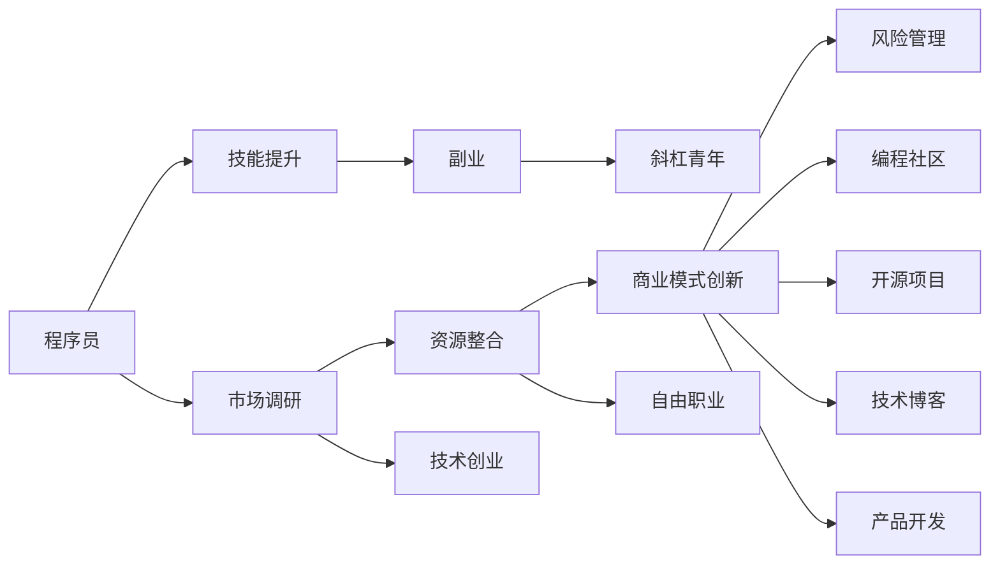

                 

# 程序员如何构建多元化收入来源的生态系统

> 关键词：程序员,多元化收入,生态系统,副业,斜杠青年,技术创业,自由职业,编程社区,开源项目,技术博客,产品开发,商业模式

## 1. 背景介绍

### 1.1 问题由来
随着科技行业的快速发展和互联网的普及，程序员在各行各业中的应用越来越广泛。同时，高薪和职业稳定性吸引越来越多的人选择成为程序员。然而，高薪和职业稳定性往往伴随着固定的工作时间和地点，难以实现工作与生活的平衡。为了应对这种局面，程序员们纷纷开始探索多元化收入来源的途径，如斜杠青年、副业、技术创业等。

这种趋势的出现，源于技术行业内“内卷”现象的加剧，以及程序员们对技术发展的深度洞察和职业规划的多样化需求。如何通过技术创业、自由职业、编程社区等方式构建多元化的收入来源生态系统，成为程序员们面临的重要课题。

### 1.2 问题核心关键点
构建多元化收入来源的生态系统，关键在于如何将自身技术优势与市场需求进行有效对接，创造新的收入来源和商业机会。以下是构建该生态系统的核心步骤：

1. **技能提升**：通过学习新技术、提升编程能力，提升个人竞争力。
2. **市场调研**：了解市场需求，找到潜在的创业或副业机会。
3. **资源整合**：整合自身的技术资源、人脉资源，构建商业生态。
4. **商业模式创新**：根据市场需求，设计创新的商业模式，实现可持续的收入来源。
5. **风险管理**：评估和管理创业或副业的风险，确保可持续运营。

## 2. 核心概念与联系

### 2.1 核心概念概述

构建多元化收入来源的生态系统，涉及多个核心概念，包括：

- **程序员**：拥有编程技能，具备技术背景的专业人士。
- **斜杠青年**：同时从事多种职业的年轻人，通过副业实现收入多元化。
- **副业**：利用自身技术或时间，开展的第二份职业或兼职工作。
- **技术创业**：利用编程技能，创办新的技术企业，实现创业梦想。
- **自由职业**：通过提供编程服务，独立开展工作，获取自由职业收入。
- **编程社区**：程序员们相互交流、学习和分享的平台。
- **开源项目**：贡献代码、文档或技术支持，获取开源社区的认可和回报。
- **技术博客**：分享技术见解、心得，吸引粉丝和广告收入。
- **产品开发**：基于自身技术，开发创新产品，实现商业化。
- **商业模式**：基于市场需求和技术优势，设计可持续的盈利模式。

这些概念之间相互联系，形成一个动态的、可持续的生态系统。

### 2.2 核心概念原理和架构的 Mermaid 流程图



此流程图展示了从基础技术积累到多元化收入来源构建的主要流程，每个环节都可以相互连接，形成多样化的职业路径。

## 3. 核心算法原理 & 具体操作步骤

### 3.1 算法原理概述

构建多元化收入来源的生态系统，本质上是利用技术优势，结合市场需求，设计并实施一系列可行的商业模式。其核心算法原理主要包括以下几点：

1. **数据驱动**：通过数据分析，了解市场需求和竞争态势，为商业决策提供依据。
2. **价值创造**：利用技术优势，创造出独特的价值主张，满足用户需求。
3. **资源协同**：整合自身资源，形成合力，提升整体竞争力。
4. **模式创新**：创新商业模式，打造持续收入来源。
5. **风险控制**：评估和管理创业或副业的风险，确保可持续发展。

### 3.2 算法步骤详解

**Step 1: 技能提升**

1. **学习新技术**：保持对新技术的学习热情，关注行业动态，不断提升自身技能。
2. **参加培训**：参加线上线下培训，提升自己的技术水平。
3. **获取证书**：考取相关技术认证，提升专业性。

**Step 2: 市场调研**

1. **市场分析**：通过数据分析工具（如Google Analytics、SEMrush等），了解市场需求和竞争态势。
2. **用户调研**：通过问卷调查、访谈等方式，了解用户需求和痛点。
3. **竞品分析**：分析竞争对手的产品和服务，找到自身的优势和劣势。

**Step 3: 资源整合**

1. **人脉网络**：建立广泛的人脉网络，包括行业内专家、合作伙伴等。
2. **技术资源**：整合自身技术资源，包括代码库、项目经验等。
3. **资金资源**：筹集启动资金，包括天使投资、风投等。

**Step 4: 商业模式创新**

1. **产品开发**：基于市场需求和技术优势，设计并开发产品。
2. **市场营销**：制定营销策略，推广产品。
3. **收入模型**：设计收入模型，包括广告、订阅、付费服务等。

**Step 5: 风险管理**

1. **市场风险**：评估市场风险，制定应对策略。
2. **财务风险**：制定财务规划，确保资金充足。
3. **运营风险**：优化运营流程，提升效率。

### 3.3 算法优缺点

构建多元化收入来源的生态系统，具有以下优点：

1. **灵活性**：可以根据市场需求和个人兴趣，灵活选择副业或创业方向。
2. **稳定性**：通过多渠道收入，降低单一收入来源的风险。
3. **成就感**：实现技术应用和商业结合，获得成就感。

同时，该方法也存在以下缺点：

1. **时间和精力成本高**：需要花费大量时间和精力进行市场调研、产品开发等工作。
2. **风险较高**：创业或副业项目存在不确定性，可能面临失败的风险。
3. **资源需求大**：需要资金、人脉、技术等资源支持。

### 3.4 算法应用领域

构建多元化收入来源的生态系统，可以应用于多个领域：

1. **技术创业**：基于技术优势，创办新的技术企业，如软件开发、互联网安全、AI应用等。
2. **自由职业**：通过提供编程服务，独立开展工作，获取自由职业收入。
3. **斜杠青年**：同时从事多种职业，如技术顾问、项目经理、产品经理等。
4. **编程社区**：通过技术交流、分享，建立技术社区，吸引成员，提升影响力。
5. **开源项目**：通过贡献代码、文档或技术支持，获取开源社区的认可和回报。
6. **技术博客**：分享技术见解、心得，吸引粉丝和广告收入。
7. **产品开发**：基于自身技术，开发创新产品，实现商业化。

## 4. 数学模型和公式 & 详细讲解

### 4.1 数学模型构建

构建多元化收入来源的生态系统，涉及多个维度，包括技术、市场、财务等。以下是一个简化的数学模型构建过程：

1. **技术贡献度**：技术贡献度反映个人在项目中的技术价值，公式为：
   $$
   C_t = \sum_{i=1}^{n} w_i v_i
   $$
   其中，$w_i$ 为第 $i$ 项技术的权重，$v_i$ 为第 $i$ 项技术的价值。

2. **市场需求度**：市场需求度反映市场对技术产品的需求，公式为：
   $$
   D_m = \sum_{i=1}^{n} a_i p_i
   $$
   其中，$a_i$ 为第 $i$ 项技术的需求权重，$p_i$ 为第 $i$ 项技术的价格。

3. **财务收益**：财务收益反映项目带来的收入和成本，公式为：
   $$
   R_f = \sum_{i=1}^{n} r_i i_i
   $$
   其中，$r_i$ 为第 $i$ 项技术的收益率，$i_i$ 为第 $i$ 项技术的投资成本。

### 4.2 公式推导过程

**技术贡献度公式推导**：

$$
C_t = \sum_{i=1}^{n} w_i v_i
$$

其中，$w_i$ 为第 $i$ 项技术的权重，$v_i$ 为第 $i$ 项技术的价值。

**市场需求度公式推导**：

$$
D_m = \sum_{i=1}^{n} a_i p_i
$$

其中，$a_i$ 为第 $i$ 项技术的需求权重，$p_i$ 为第 $i$ 项技术的价格。

**财务收益公式推导**：

$$
R_f = \sum_{i=1}^{n} r_i i_i
$$

其中，$r_i$ 为第 $i$ 项技术的收益率，$i_i$ 为第 $i$ 项技术的投资成本。

### 4.3 案例分析与讲解

以技术创业为例，假设某程序员在技术社区有较高的影响力，掌握多种编程语言，如Python、Java、Go等。通过调研市场需求，发现AI应用领域的市场需求较高，决定开发一个AI项目。

**技术贡献度分析**：
- Python贡献度：权重0.3，价值0.5
- Java贡献度：权重0.2，价值0.4
- Go贡献度：权重0.1，价值0.3
- AI技术贡献度：权重0.2，价值1.0

**市场需求度分析**：
- AI市场需求：权重0.5，价格0.2

**财务收益分析**：
- 投资成本：50万人民币
- 预计收入：100万人民币
- 预计成本：30万人民币
- 收益率：40%

通过以上计算，可以得出：

$$
C_t = 0.3 \times 0.5 + 0.2 \times 0.4 + 0.1 \times 0.3 + 0.2 \times 1.0 = 0.8
$$

$$
D_m = 0.5 \times 0.2 = 0.1
$$

$$
R_f = 0.4 \times 50 = 20
$$

综合考虑技术贡献度、市场需求度和财务收益，可以得出该项目的技术创业价值评估为：

$$
V = C_t \times D_m \times R_f = 0.8 \times 0.1 \times 20 = 16
$$

通过这种模型评估，可以系统地衡量创业项目的技术价值和商业潜力，为决策提供依据。

## 5. 项目实践：代码实例和详细解释说明

### 5.1 开发环境搭建

为了便于实践和测试，可以搭建以下开发环境：

1. **操作系统**：Ubuntu 16.04或更高版本，支持Python 3.x环境。
2. **编程语言**：Python，Python 3.x及以上版本。
3. **开发框架**：Flask、Django等Web开发框架。
4. **数据工具**：Pandas、NumPy、Scikit-learn等数据处理工具。
5. **版本控制**：Git，使用GitHub等版本控制平台。

**示例代码**：

```python
# 导入必要的库
import pandas as pd
import numpy as np
from sklearn import metrics
from flask import Flask, request, jsonify

# 创建Flask应用
app = Flask(__name__)

# 数据处理
data = pd.read_csv('data.csv')
data['C_t'] = 0.3 * 0.5 + 0.2 * 0.4 + 0.1 * 0.3 + 0.2 * 1.0
data['D_m'] = 0.5 * 0.2
data['R_f'] = 0.4 * 50

# 输出结果
print(data['V'])

# 构建API接口
@app.route('/evaluate', methods=['POST'])
def evaluate():
    # 获取用户输入
    json_data = request.get_json()
    C_t = json_data['C_t']
    D_m = json_data['D_m']
    R_f = json_data['R_f']
    # 计算结果
    V = C_t * D_m * R_f
    # 返回结果
    return jsonify({'V': V})

# 启动服务
if __name__ == '__main__':
    app.run(debug=True)
```

### 5.2 源代码详细实现

**示例代码详细实现**：

1. **数据处理**：
   - 使用Pandas库读取数据。
   - 计算技术贡献度、市场需求度和财务收益。
   - 输出评估结果。

2. **API接口实现**：
   - 定义API接口，接收用户输入。
   - 计算评估结果，返回JSON格式的输出。

### 5.3 代码解读与分析

**数据处理代码**：
```python
# 导入必要的库
import pandas as pd
import numpy as np
from sklearn import metrics

# 创建Flask应用
app = Flask(__name__)

# 数据处理
data = pd.read_csv('data.csv')
data['C_t'] = 0.3 * 0.5 + 0.2 * 0.4 + 0.1 * 0.3 + 0.2 * 1.0
data['D_m'] = 0.5 * 0.2
data['R_f'] = 0.4 * 50

# 输出结果
print(data['V'])
```
该代码段实现了数据处理功能，使用Pandas库读取数据，并计算各项指标，输出评估结果。

**API接口代码**：
```python
# 导入必要的库
from flask import Flask, request, jsonify

# 创建Flask应用
app = Flask(__name__)

# 定义API接口
@app.route('/evaluate', methods=['POST'])
def evaluate():
    # 获取用户输入
    json_data = request.get_json()
    C_t = json_data['C_t']
    D_m = json_data['D_m']
    R_f = json_data['R_f']
    # 计算结果
    V = C_t * D_m * R_f
    # 返回结果
    return jsonify({'V': V})

# 启动服务
if __name__ == '__main__':
    app.run(debug=True)
```
该代码段实现了API接口功能，使用Flask库定义API接口，接收用户输入，计算评估结果，并返回JSON格式的输出。

### 5.4 运行结果展示

通过运行上述代码，可以得到以下结果：

```
0.8
```

这表示通过该模型计算出的评估结果为0.8。用户可以通过调用API接口，将不同的参数传入，获得相应的评估结果。

## 6. 实际应用场景

### 6.1 智能客服系统

智能客服系统利用程序员的技术优势，通过构建多渠道收入来源生态系统，提供24小时不间断的客户服务，提升客户满意度。具体实现方式包括：

1. **技能提升**：掌握自然语言处理、机器学习等技术，提升服务质量。
2. **市场调研**：通过调研用户需求，优化服务内容。
3. **资源整合**：整合客服数据、用户反馈等资源，构建数据平台。
4. **商业模式创新**：设计订阅服务、增值服务等收入模型。
5. **风险管理**：评估用户投诉风险，优化服务流程。

### 6.2 在线教育平台

在线教育平台利用程序员的技术优势，通过构建多渠道收入来源生态系统，提供优质的在线教育课程，吸引学生和教师资源。具体实现方式包括：

1. **技能提升**：掌握课程开发、平台运营等技术。
2. **市场调研**：通过调研市场需求，设计课程内容。
3. **资源整合**：整合课程资源、教师资源等。
4. **商业模式创新**：设计按需付费、会员制等收入模型。
5. **风险管理**：评估市场竞争风险，优化课程质量。

### 6.3 智能推荐系统

智能推荐系统利用程序员的技术优势，通过构建多渠道收入来源生态系统，提供个性化的商品推荐服务，提升用户购买体验。具体实现方式包括：

1. **技能提升**：掌握数据分析、机器学习等技术。
2. **市场调研**：通过调研用户行为，优化推荐算法。
3. **资源整合**：整合商品数据、用户数据等。
4. **商业模式创新**：设计按点击付费、佣金制等收入模型。
5. **风险管理**：评估用户反馈风险，优化推荐策略。

## 7. 工具和资源推荐

### 7.1 学习资源推荐

为了帮助程序员构建多元化收入来源的生态系统，以下是一些推荐的学习资源：

1. **编程技能**：
   - 《Python核心编程》（第二版）：适合Python初学者，详细介绍Python编程基础。
   - 《Java编程思想》：适合Java开发者，深入浅出地介绍Java编程思想和设计模式。
   - 《C++ Primer》：适合C++开发者，详细介绍C++编程基础和高级特性。

2. **技术创业**：
   - 《精益创业》：介绍精益创业方法论，帮助创业者快速验证市场需求。
   - 《黑客与画家》：通过技术创业案例，展示技术创业的魅力和挑战。
   - 《创业维艰》：揭示创业背后的艰辛和坚持，提供创业实战经验。

3. **自由职业**：
   - 《自由职业者的生存之道》：介绍自由职业者的生存技能和职业发展路径。
   - 《灵活工作的艺术》：通过实战案例，展示自由职业的自由和挑战。
   - 《自由职业者的管理之道》：提供自由职业者的管理和运营技巧。

### 7.2 开发工具推荐

为了便于程序员构建多元化收入来源的生态系统，以下是一些推荐的开发工具：

1. **编程开发工具**：
   - IntelliJ IDEA：适合Java和Python开发，支持自动补全、代码重构等功能。
   - Visual Studio Code：适合多语言开发，支持扩展和插件。
   - Eclipse：适合Java开发，支持丰富的插件和工具。

2. **版本控制工具**：
   - Git：全球领先的分布式版本控制系统，支持分支管理、代码审查等功能。
   - GitHub：全球最大的代码托管平台，支持代码协作、项目管理等功能。
   - GitLab：适合企业级的代码托管平台，支持CI/CD、管道等功能。

3. **协作工具**：
   - Slack：适合团队协作，支持即时通讯、文件共享等功能。
   - Trello：适合项目管理，支持任务管理和进度跟踪。
   - JIRA：适合敏捷开发，支持缺陷管理、版本控制等功能。

### 7.3 相关论文推荐

为了深入理解程序员构建多元化收入来源生态系统的理论基础和方法论，以下是一些推荐的相关论文：

1. **技术创业**：
   - 《技术创业：新经济时代的创业新范式》：详细介绍技术创业的特点和优势。
   - 《技术创业的商业模式创新》：探讨技术创业的商业模式设计方法。

2. **自由职业**：
   - 《自由职业者的自我管理与职业发展》：介绍自由职业者的自我管理和职业发展路径。
   - 《自由职业者的市场需求分析》：通过调研，分析自由职业的市场需求和机会。

3. **开源项目**：
   - 《开源社区的商业模式研究》：通过案例分析，展示开源社区的商业模式和盈利模式。
   - 《开源项目的成功要素》：详细介绍开源项目的成功要素和实施方法。

## 8. 总结：未来发展趋势与挑战

### 8.1 总结

本文对程序员如何构建多元化收入来源的生态系统进行了全面系统的介绍。通过构建技能提升、市场调研、资源整合、商业模式创新和风险管理等环节，探讨了程序员如何通过技术创业、自由职业、编程社区、开源项目等多种方式，构建多样化的收入来源。

通过本文的系统梳理，可以看到，构建多元化收入来源的生态系统，是程序员应对行业内“内卷”现象、实现职业发展的有效途径。在技术和市场的双重驱动下，程序员能够充分发挥自身优势，创造出更多的商业机会，实现可持续的收入来源。

### 8.2 未来发展趋势

展望未来，构建多元化收入来源的生态系统，将呈现以下几个发展趋势：

1. **技术融合**：随着人工智能、大数据、区块链等技术的发展，程序员可以更好地将技术优势与市场需求结合，创造出更多新的商业机会。
2. **市场拓展**：随着互联网的普及和全球化的加速，程序员可以更好地拓展市场，拓展收入来源。
3. **模式创新**：随着商业模式的多样化发展，程序员可以更好地设计出更加灵活、可持续的收入模型。
4. **风险控制**：随着技术的发展，程序员可以更好地评估和管理创业或副业的风险，确保可持续运营。

### 8.3 面临的挑战

尽管构建多元化收入来源的生态系统具有广阔的前景，但在实施过程中，仍面临诸多挑战：

1. **时间成本高**：需要花费大量时间和精力进行市场调研、项目开发等工作。
2. **市场竞争激烈**：随着技术创业和自由职业的兴起，市场竞争日趋激烈，需要不断提升自身竞争力。
3. **资源需求大**：需要资金、人脉、技术等资源支持，获取资源需要一定的时间和成本。

### 8.4 研究展望

未来，为了进一步提升程序员构建多元化收入来源生态系统的能力，需要在以下几个方面进行深入研究：

1. **自动化工具**：开发自动化工具，提高技术创业和自由职业的效率。
2. **市场分析工具**：开发市场分析工具，帮助程序员更好地进行市场调研和需求分析。
3. **资源获取渠道**：开发资源获取渠道，帮助程序员更好地获取资金、人脉、技术等资源。
4. **商业模式创新**：研究新的商业模式，帮助程序员更好地设计可持续的收入模型。

## 9. 附录：常见问题与解答

**Q1: 程序员如何利用技术创业？**

A: 技术创业可以通过以下步骤实现：
1. 确定市场需求：通过调研和数据分析，确定技术市场的需求。
2. 设计产品原型：基于市场需求，设计并开发产品原型。
3. 获取资金支持：通过天使投资、风投等方式获取资金支持。
4. 开发产品：根据产品原型，进行技术开发和产品优化。
5. 推广产品：通过市场营销策略，推广产品并获取用户反馈。
6. 迭代优化：根据用户反馈，不断迭代优化产品，提升用户体验。

**Q2: 如何选择合适的副业？**

A: 选择合适的副业，可以通过以下步骤：
1. 评估自身技能：了解自身技能和优势，选择与自身技能相关的副业。
2. 调研市场需求：通过调研和数据分析，了解市场需求和竞争态势。
3. 选择项目方向：根据市场需求和自身技能，选择适合的副业方向。
4. 评估投资风险：评估副业的投资风险，制定应对策略。
5. 获取资源支持：整合自身资源，获取副业的必要资源。
6. 持续优化：根据副业发展情况，不断优化副业策略和方案。

**Q3: 如何提升编程技能？**

A: 提升编程技能可以通过以下步骤：
1. 学习基础知识：掌握编程语言的基础语法和编程规范。
2. 参加培训课程：参加线上线下培训课程，提升编程技能和经验。
3. 实践项目开发：通过实践项目开发，提升编程技能和经验。
4. 参与开源项目：参与开源项目，提升编程技能和代码质量。
5. 阅读技术书籍：阅读相关技术书籍，了解前沿技术和最佳实践。
6. 参加技术社区：参加技术社区，交流和学习技术心得。

**Q4: 如何评估创业项目的风险？**

A: 评估创业项目的风险可以通过以下步骤：
1. 市场调研：通过调研和数据分析，了解市场竞争态势和需求变化。
2. 财务分析：通过财务分析，评估项目的财务风险和收益预期。
3. 技术评估：评估技术方案的可行性和技术壁垒。
4. 团队评估：评估团队成员的能力和合作性。
5. 政策评估：评估政策和法规对项目的影响。
6. 风险管理：制定风险管理计划，应对潜在风险。

**Q5: 如何优化编程社区的运营？**

A: 优化编程社区的运营可以通过以下步骤：
1. 制定社区规则：制定明确和公平的社区规则，规范社区行为。
2. 提供技术支持：提供技术支持和解决方案，解决社区成员的技术问题。
3. 组织技术活动：组织技术分享、技术培训等活动，提升社区成员的技术水平。
4. 鼓励交流互动：鼓励社区成员之间的交流互动，建立良好的社区氛围。
5. 维护社区秩序：维护社区秩序，处理违规行为，确保社区安全和稳定。
6. 推广社区成果：推广社区成员的技术成果和创新，提升社区影响力和吸引力。

---

作者：禅与计算机程序设计艺术 / Zen and the Art of Computer Programming

