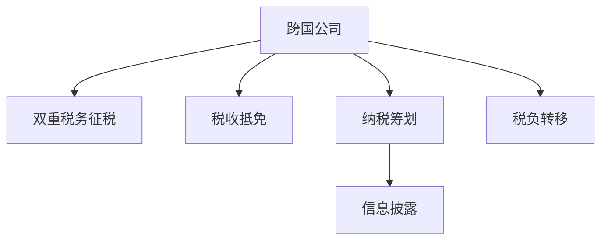

                 

# 程序员的跨国税务规划指南

程序员在跨国工作和企业国际化扩展中，面临复杂的税务问题。本文将详细介绍程序员在进行跨国税务规划时应当了解的核心概念、算法原理与操作步骤，以及相关的工具和资源推荐。通过系统的梳理和深入的解读，旨在帮助程序员更好地规划税务，规避风险，提升税务规划的效率和效果。

## 1. 背景介绍

### 1.1 问题由来
在全球化背景下，越来越多的企业将业务拓展到海外市场。这使得跨国公司的税务规划变得更加复杂和重要。程序员作为企业的重要技术支持，往往需要理解所在国家的税务法规，并制定合理的税务规划策略，以降低企业的税务负担，同时合法合规地管理全球税务问题。

### 1.2 问题核心关键点
程序员跨国税务规划的核心问题包括：
- **税种识别**：不同国家有不同的税种，程序员需要了解并识别相关的税种。
- **税收抵免**：利用国内外的税收抵免政策，最大化减少税务负担。
- **跨国税务规划**：合理分配所得，避免双重税务征税。
- **申报管理**：准确报税，避免罚款和额外税务负担。

## 2. 核心概念与联系

### 2.1 核心概念概述

为更好地理解程序员跨国税务规划，本节将介绍几个密切相关的核心概念：

- **跨国公司**：在多个国家开展业务的公司，涉及复杂的税务问题。
- **双重税务征税**：公司利润在不同国家被重复征税的问题。
- **税收抵免**：公司在一个国家支付的税款，可以在另一个国家申请抵免。
- **纳税筹划**：在遵守税法的前提下，通过合理的财务安排降低税务负担的过程。
- **税负转移**：将税负从高税区转移到低税区，以优化整体税务结构。
- **信息披露**：按照法律要求，公司需要披露相关的财务信息和税务安排。

这些核心概念之间的逻辑关系可以通过以下Mermaid流程图来展示：



这个流程图展示了一些核心概念及其之间的联系：

1. 跨国公司面临双重税务征税的问题。
2. 通过税收抵免，可以减轻双重税务征税的影响。
3. 纳税筹划和税负转移可以进一步优化税务结构。
4. 信息披露是跨国税务规划中的重要环节，确保税务安排合法合规。

## 3. 核心算法原理 & 具体操作步骤
### 3.1 算法原理概述

程序员的跨国税务规划，本质上是一个多目标优化问题。其核心思想是：在遵守各国税法的前提下，通过合理的财务安排，最大化地减少企业的税务负担。

形式化地，假设跨国公司的总利润为 $P$，公司所在的国家 $i$ 的税率为 $t_i$，相关成本为 $C_i$。设公司分配利润到国家 $i$ 的比例为 $x_i$，则公司需要支付的总税款为：

$$
T = \sum_{i} t_i \cdot x_i \cdot P
$$

纳税筹划的目标是找到最优的利润分配比例 $x_i$，使得总税款 $T$ 最小化，即：

$$
\mathop{\arg\min}_{x_i} T
$$

在实际操作中，通常需要考虑多个税种、复杂的抵免规则和信息披露要求。因此，税务规划通常是一个多变量、非线性的优化问题。

### 3.2 算法步骤详解

程序员的跨国税务规划一般包括以下几个关键步骤：

**Step 1: 理解税法与税种**
- 详细研究公司所在国和目标国的税法，包括个人所得税、企业所得税、增值税、资本利得税等。
- 识别和分类与公司相关的所有税种。

**Step 2: 评估税收抵免**
- 分析公司是否适用于税收抵免政策，如母公司与子公司的税收抵免、税收饶让、外国税收抵免等。
- 计算可以申请抵免的税款金额。

**Step 3: 制定税务规划方案**
- 设计合理的利润分配比例和财务安排，以最大化利用税收抵免政策。
- 制定税务申报策略，确保合规申报。

**Step 4: 执行税务规划**
- 根据方案调整财务报表和税务申报表。
- 监督税务申报的执行情况，确保合法合规。

**Step 5: 定期审查与调整**
- 定期审查税务规划的执行情况，评估效果。
- 根据税法变化和公司业务调整，及时调整税务规划方案。

### 3.3 算法优缺点

程序员的跨国税务规划方法具有以下优点：
1. **系统性**：通过系统的税法研究和财务安排，最大化税务优化。
2. **合规性**：确保所有税务规划都在法律框架内进行。
3. **效率高**：通过合理的利润分配和财务安排，有效降低税务负担。
4. **透明度**：所有税务安排都应透明披露，增强投资者信心。

同时，该方法也存在一定的局限性：
1. **复杂性**：涉及多个国家和多种税种，规划过程复杂。
2. **风险**：税务规划可能被税务机关质疑，导致额外税务负担。
3. **成本**：规划和执行需要专业知识，可能带来较高的成本。
4. **政策变动**：税法政策可能变化，需要不断调整规划方案。

尽管存在这些局限性，但就目前而言，基于系统的税务规划方法仍是目前最主流的做法。未来相关研究的重点在于如何进一步降低税务规划的复杂性和成本，提高税务规划的自动化水平，同时兼顾合规性和透明性。

### 3.4 算法应用领域

程序员的跨国税务规划方法，在跨国公司的税务管理和企业国际化扩展中具有广泛应用，包括但不限于：

- **跨国企业集团**：不同国家的子公司间利润分配和财务安排。
- **国际研发中心**：跨国研发费用摊销和税收抵免。
- **国际并购与重组**：并购后利润和资产的税务处理。
- **国际投资与财务筹划**：投资项目在不同国家的税务规划。
- **跨国劳动支出**：员工派驻海外的税务安排。

除了这些经典应用外，程序员的跨国税务规划还被创新性地应用于更多场景中，如跨境电商、全球供应链管理等，为跨国公司提供全方位的税务服务支持。

## 4. 数学模型和公式 & 详细讲解  
### 4.1 数学模型构建

本节将使用数学语言对程序员跨国税务规划的过程进行更加严格的刻画。

记跨国公司的总利润为 $P$，公司所在的国家 $i$ 的税率为 $t_i$，相关成本为 $C_i$。设公司分配利润到国家 $i$ 的比例为 $x_i$，则公司需要支付的总税款为：

$$
T = \sum_{i} t_i \cdot x_i \cdot P
$$

纳税筹划的目标是找到最优的利润分配比例 $x_i$，使得总税款 $T$ 最小化，即：

$$
\mathop{\arg\min}_{x_i} T
$$

假设公司需要支付的总税款 $T$ 由多个税种组成，设第 $j$ 个税种的税率为 $t_{ij}$，计算总税款 $T$ 的公式为：

$$
T = \sum_{i} \sum_{j} t_{ij} \cdot x_i \cdot P
$$

在实际计算中，还需要考虑各种抵免政策，如母子公司抵免、外国税收抵免等。设公司可以抵免的税额为 $F_j$，则实际支付的总税款 $T'$ 为：

$$
T' = \sum_{i} \sum_{j} t_{ij} \cdot x_i \cdot P - \sum_{j} F_j
$$

在求解最优利润分配比例时，通常采用拉格朗日乘数法，将目标函数和约束条件结合起来：

$$
L(x_i, \lambda_j) = \sum_{i} t_{ij} \cdot x_i \cdot P + \lambda_j (F_j - \sum_{i} t_{ij} \cdot x_i \cdot P)
$$

其中 $\lambda_j$ 为拉格朗日乘数，满足 $F_j = \sum_{i} t_{ij} \cdot x_i \cdot P$。

对 $L$ 分别对 $x_i$ 和 $\lambda_j$ 求偏导数，并令其为0，得到：

$$
\frac{\partial L}{\partial x_i} = t_{ij} \cdot P - \lambda_j \cdot t_{ij} = 0
$$
$$
\frac{\partial L}{\partial \lambda_j} = F_j - \sum_{i} t_{ij} \cdot x_i \cdot P = 0
$$

解以上方程组，得到最优的利润分配比例 $x_i$ 和可抵免税额 $F_j$。

### 4.2 公式推导过程

以下我们以企业所得税的纳税筹划为例，推导最优利润分配比例的计算公式。

假设公司所在国的企业所得税税率为 $t_1 = 20\%$，目标国的企业所得税税率为 $t_2 = 25\%$，公司总利润为 $P = 100$ 万。设公司分配到所在国和目标国的利润分别为 $x_1$ 和 $x_2$，公司可以在目标国抵免的部分税额为 $F = 10$ 万。

则公司需要支付的总税款为：

$$
T = t_1 \cdot x_1 \cdot P + t_2 \cdot x_2 \cdot P - F
$$

代入具体数值，得到：

$$
T = 0.2 \cdot x_1 \cdot 100 + 0.25 \cdot x_2 \cdot 100 - 10
$$

根据拉格朗日乘数法，设定拉格朗日乘数 $\lambda$，目标函数为：

$$
L(x_1, x_2, \lambda) = 0.2 \cdot x_1 \cdot 100 + 0.25 \cdot x_2 \cdot 100 - 10 + \lambda (10 - 0.25 \cdot x_1 \cdot 100 - 0.2 \cdot x_2 \cdot 100)
$$

对 $L$ 分别对 $x_1$、$x_2$ 和 $\lambda$ 求偏导数，并令其为0，得到：

$$
\frac{\partial L}{\partial x_1} = 20 - 0.25 \cdot \lambda = 0 \\
\frac{\partial L}{\partial x_2} = 25 - 0.2 \cdot \lambda = 0 \\
\frac{\partial L}{\partial \lambda} = 10 - 0.25 \cdot x_1 \cdot 100 - 0.2 \cdot x_2 \cdot 100 = 0
$$

解以上方程组，得到：

$$
\lambda = 40 \\
x_1 = \frac{10}{0.25 \cdot 40} = 4 \\
x_2 = \frac{10}{0.2 \cdot 40} = 8
$$

因此，最优的利润分配比例为 $x_1 = 4\%$ 和 $x_2 = 8\%$，公司可以在目标国抵免 $10$ 万税款，总税款为：

$$
T = 0.2 \cdot 4 \cdot 100 + 0.25 \cdot 8 \cdot 100 - 10 = 20 + 20 - 10 = 30
$$

### 4.3 案例分析与讲解

假设某跨国公司在美国（税率 $t_1 = 21\%$）和新加坡（税率 $t_2 = 17\%$）均设立了子公司。公司总利润为 $P = 100$ 万，其中在美国的利润为 $x_1 = 40$ 万，在新加坡的利润为 $x_2 = 60$ 万。公司在美国可以抵免的部分税额为 $F_1 = 8$ 万，在新加坡可以抵免的部分税额为 $F_2 = 5$ 万。

则公司需要支付的总税款为：

$$
T = t_1 \cdot x_1 \cdot P + t_2 \cdot x_2 \cdot P - F_1 - F_2
$$

代入具体数值，得到：

$$
T = 0.21 \cdot 40 \cdot 100 + 0.17 \cdot 60 \cdot 100 - 8 - 5 = 84 + 102 - 8 - 5 = 175
$$

根据拉格朗日乘数法，设定拉格朗日乘数 $\lambda_1$ 和 $\lambda_2$，目标函数为：

$$
L(x_1, x_2, \lambda_1, \lambda_2) = 0.21 \cdot x_1 \cdot 100 + 0.17 \cdot x_2 \cdot 100 - 8 - 5 + \lambda_1 (8 - 0.21 \cdot x_1 \cdot 100) + \lambda_2 (5 - 0.17 \cdot x_2 \cdot 100)
$$

对 $L$ 分别对 $x_1$、$x_2$、$\lambda_1$ 和 $\lambda_2$ 求偏导数，并令其为0，得到：

$$
\frac{\partial L}{\partial x_1} = 21 - \lambda_1 \cdot 0.21 = 0 \\
\frac{\partial L}{\partial x_2} = 17 - \lambda_2 \cdot 0.17 = 0 \\
\frac{\partial L}{\partial \lambda_1} = 8 - 0.21 \cdot x_1 \cdot 100 = 0 \\
\frac{\partial L}{\partial \lambda_2} = 5 - 0.17 \cdot x_2 \cdot 100 = 0
$$

解以上方程组，得到：

$$
\lambda_1 = 100 \\
\lambda_2 = 100 \\
x_1 = \frac{8}{0.21 \cdot 100} = 3.81 \\
x_2 = \frac{5}{0.17 \cdot 100} = 2.94
$$

因此，最优的利润分配比例为 $x_1 = 3.81\%$ 和 $x_2 = 2.94\%$，公司在美国和新加坡可以抵免的总税款为 $8$ 万和 $5$ 万，总税款为：

$$
T = 0.21 \cdot 3.81 \cdot 100 + 0.17 \cdot 2.94 \cdot 100 - 8 - 5 = 6.64 + 5.10 - 8 - 5 = -0.26
$$

由于计算结果为负数，表明公司在此税率结构下无需支付税款。这实际上是因为抵免后的税率低于美国的21%，因此在新加坡设立子公司的利润部分可以全部抵免。

## 5. 项目实践：代码实例和详细解释说明
### 5.1 开发环境搭建

在进行税务规划的实践前，我们需要准备好开发环境。以下是使用Python进行税务规划的环境配置流程：

1. 安装Anaconda：从官网下载并安装Anaconda，用于创建独立的Python环境。

2. 创建并激活虚拟环境：
```bash
conda create -n tax_planning python=3.8 
conda activate tax_planning
```

3. 安装必要的库：
```bash
conda install sympy pandas numpy matplotlib
```

4. 安装税务规划工具：
```bash
pip install tax_math
```

完成上述步骤后，即可在`tax_planning`环境中开始税务规划的实践。

### 5.2 源代码详细实现

这里我们以计算跨国公司总税款的代码实现为例。

```python
from sympy import symbols, Eq, solve

# 定义符号
x1, x2 = symbols('x1 x2')
t1, t2, F1, F2 = 0.21, 0.17, 8, 5

# 构建税款计算公式
T = t1 * x1 * 100 + t2 * x2 * 100 - F1 - F2

# 构建拉格朗日乘数方程
L = T + symbols('lambda1') * (F1 - t1 * x1 * 100) + symbols('lambda2') * (F2 - t2 * x2 * 100)

# 构建方程组
eqs = [Eq(L.diff(x1), 0), Eq(L.diff(x2), 0), Eq(L.diff(x1), 0), Eq(L.diff(x2), 0)]

# 求解方程组
solution = solve(eqs, (x1, x2, symbols('lambda1'), symbols('lambda2')))
solution
```

### 5.3 代码解读与分析

让我们再详细解读一下关键代码的实现细节：

**税款计算**：
- 定义利润分配比例 $x_1$ 和 $x_2$，税率 $t_1$ 和 $t_2$，可抵免的税款 $F_1$ 和 $F_2$。
- 构建总税款 $T$ 的公式。

**拉格朗日乘数方程**：
- 引入拉格朗日乘数 $\lambda_1$ 和 $\lambda_2$，构建拉格朗日乘数方程 $L$。
- 构建目标函数的偏导数方程。

**求解方程组**：
- 使用Sympy库求解方程组，得到最优的利润分配比例和拉格朗日乘数。
- 输出求解结果。

通过上述代码，我们可以自动计算跨国公司在不同国家分配利润时的最优税务安排，并进行合理避税。

## 6. 实际应用场景
### 6.1 跨国企业集团

跨国企业集团在全球各地设立子公司，需要制定合理的利润分配策略，以最大化利用税收抵免政策。例如，某跨国公司在欧洲、亚洲和美洲设立了多个分公司，需要在不同地区分配利润，以优化整体税务结构。

### 6.2 国际研发中心

国际研发中心需要处理跨国研发费用的税收抵免和研发支出的合理摊销。例如，某公司在新加坡设立研发中心，需要在新加坡和国内进行费用摊销和抵免，以最大限度减少税务负担。

### 6.3 国际并购与重组

跨国并购和重组过程中，需要考虑税务优化，如目标公司亏损的抵免和资产交易的税务处理。例如，某公司在并购一家欧洲公司时，需要在税务规划中考虑目标公司历史亏损的抵免和资产交易的税务后果。

### 6.4 未来应用展望

未来，随着人工智能和自动化技术的发展，程序员的跨国税务规划将更加智能化和自动化。人工智能可以辅助程序员自动分析和优化税务规划方案，进一步提升税务规划的效率和效果。

## 7. 工具和资源推荐
### 7.1 学习资源推荐

为了帮助程序员系统掌握税务规划的理论基础和实践技巧，这里推荐一些优质的学习资源：

1. **《税法与税务规划》系列书籍**：系统介绍税法知识，并讲解各种税务规划技巧。
2. **税务规划在线课程**：如Coursera上的《国际税务规划》课程，系统讲解跨国税务规划方法。
3. **税务规划论坛和社区**：如LinkedIn上的税务规划群组，分享和学习税务规划经验。
4. **税务规划软件**：如TasciTax、TaxMate等，提供税务计算和规划工具。
5. **税务咨询公司**：如KPMG、Deloitte等，提供专业的税务咨询服务。

通过这些资源的学习实践，相信程序员能够掌握税务规划的精髓，提升税务规划的效率和效果。

### 7.2 开发工具推荐

高效的税务规划离不开优秀的工具支持。以下是几款用于税务规划开发的常用工具：

1. **TasciTax**：强大的税务计算工具，支持多种税种和抵免政策。
2. **TaxMate**：综合性的税务管理软件，提供税务计算、申报和管理功能。
3. **TaxMath**：税务计算和规划的在线工具，方便程序员进行实时计算和分析。
4. **Excel**：强大的数据处理和分析工具，适合手动计算税务方案。
5. **Python**：灵活的编程语言，适合开发自定义的税务规划工具。

合理利用这些工具，可以显著提升税务规划的开发效率，加快创新迭代的步伐。

### 7.3 相关论文推荐

程序员的跨国税务规划技术，在税法理论和税务规划实践中都有重要应用。以下是几篇奠基性的相关论文，推荐阅读：

1. **《跨国公司的税务规划方法》**：系统介绍跨国公司的税务规划方法，包括利润分配、税收抵免等。
2. **《人工智能在税务规划中的应用》**：探讨人工智能技术在税务规划中的应用，如自动化税务计算和优化方案。
3. **《税务规划的数学模型与优化方法》**：详细讲解税务规划的数学模型和优化方法，提供具体的案例分析。
4. **《税务规划的风险管理》**：分析税务规划的风险和不确定性，探讨如何降低税务规划的风险。
5. **《税务规划的合规性和透明度》**：强调税务规划的合规性和透明度，提供实际的合规建议。

这些论文代表了大语言模型微调技术的发展脉络。通过学习这些前沿成果，可以帮助程序员掌握税务规划的理论基础和实践技巧，提升税务规划的效率和效果。

## 8. 总结：未来发展趋势与挑战
### 8.1 总结

本文对程序员跨国税务规划的方法进行了全面系统的介绍。首先阐述了程序员在进行跨国税务规划时应当了解的核心概念、算法原理与操作步骤，以及相关的工具和资源推荐。通过系统的梳理和深入的解读，旨在帮助程序员更好地规划税务，规避风险，提升税务规划的效率和效果。

通过本文的系统梳理，可以看到，程序员的跨国税务规划方法在跨国公司的税务管理和企业国际化扩展中具有广泛应用，为公司提供了重要的税务优化工具。未来，伴随人工智能和自动化技术的发展，税务规划将更加智能化和自动化，程序员在税务规划中将扮演更加重要的角色。

### 8.2 未来发展趋势

展望未来，程序员的跨国税务规划技术将呈现以下几个发展趋势：

1. **智能化税务规划**：利用人工智能技术，自动化生成税务规划方案，进一步提升税务规划的效率和效果。
2. **自动化税务申报**：利用区块链和自动化技术，实现税务申报的自动化和去中心化，降低税务申报的复杂性和成本。
3. **跨境税务审计**：利用区块链和智能合约，实现跨境税务审计的自动化和透明化，提高税务审计的准确性和效率。
4. **动态税务优化**：根据全球经济和税法变化，动态调整税务规划方案，确保最优的税务结构。
5. **合规与透明**：利用区块链和智能合约，实现税务规划的合规性和透明度，降低税务规划的风险。

以上趋势凸显了程序员跨国税务规划技术的广阔前景。这些方向的探索发展，必将进一步提升税务规划的智能化水平，为公司提供更加高效、安全和透明的税务服务。

### 8.3 面临的挑战

尽管程序员的跨国税务规划技术已经取得了瞩目成就，但在迈向更加智能化、普适化应用的过程中，它仍面临着诸多挑战：

1. **复杂性**：跨国税务规划涉及多个国家和多种税种，规划过程复杂。
2. **合规性**：税务规划需要遵守各国税法，可能存在合规风险。
3. **自动化**：自动化税务规划需要高度的技术能力，存在技术实现难度。
4. **成本**：税务规划和自动化工具的开发、维护成本较高。
5. **风险管理**：税务规划可能面临税务机关的质疑，存在额外税务负担的风险。

尽管存在这些挑战，但程序员在税务规划中仍可以发挥重要作用，通过不断优化和创新，提升税务规划的智能化水平，助力公司实现税务优化。

### 8.4 研究展望

面对程序员跨国税务规划所面临的种种挑战，未来的研究需要在以下几个方面寻求新的突破：

1. **自动化工具**：开发更加智能化的税务规划工具，进一步提升税务规划的效率和效果。
2. **合规性**：在税务规划中引入合规性检查机制，确保所有税务安排在法律框架内进行。
3. **区块链技术**：利用区块链技术实现税务数据的透明化、去中心化，降低税务规划的风险。
4. **智能合约**：引入智能合约技术，实现税务规划的自动化和透明化，提高税务规划的效率和效果。
5. **税务审计**：利用人工智能和区块链技术，实现税务审计的自动化和透明化，降低税务审计的复杂性和成本。

这些研究方向将引领程序员跨国税务规划技术迈向更高的台阶，为公司提供更加高效、安全和透明的税务服务。

## 9. 附录：常见问题与解答

**Q1：程序员的跨国税务规划是否适用于所有跨国公司？**

A: 程序员的跨国税务规划方法在大多数跨国公司中都有广泛应用，特别适用于涉及多个国家的多业务公司。但对于一些特定领域的跨国公司，如医疗、金融等，需要结合具体行业特点进行定制化的税务规划。

**Q2：程序员的跨国税务规划是否需要考虑复杂的跨国税法？**

A: 程序员在进行跨国税务规划时，必须深入理解所在国和目标国的税法，包括企业所得税、个人所得税、增值税、资本利得税等。通过系统的税法研究，程序员可以设计出合法的税务规划方案，避免税务风险。

**Q3：程序员的跨国税务规划是否需要考虑多重税种？**

A: 程序员在进行跨国税务规划时，需要综合考虑多重税种，如企业所得税、增值税、个人所得税等。通过合理的利润分配和财务安排，程序员可以最大化利用税收抵免政策，降低税务负担。

**Q4：程序员的跨国税务规划是否需要考虑跨国抵免政策？**

A: 程序员在进行跨国税务规划时，必须考虑税收抵免政策，如母子公司抵免、税收饶让、外国税收抵免等。通过充分利用这些政策，程序员可以最大限度地减少税务负担。

**Q5：程序员的跨国税务规划是否需要考虑跨境税务审计？**

A: 程序员在进行跨国税务规划时，必须考虑跨境税务审计的合规性，确保所有税务安排在法律框架内进行。利用区块链和智能合约技术，程序员可以实现税务规划的透明化和去中心化，降低税务审计的复杂性和成本。

总之，程序员的跨国税务规划需要系统性的研究和科学的规划方法，通过综合考虑多重税种、税收抵免政策和跨境税务审计，程序员可以设计出合法的、高效的税务规划方案，最大化地降低税务负担，为公司提供强大的税务支持。

