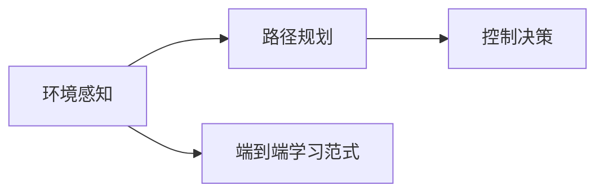

                 

## 1. 背景介绍

随着自动驾驶技术的不断进步，自动驾驶系统正在逐步走向实用化。自动驾驶系统通过环境感知、路径规划、车辆控制等模块协同工作，实现车辆自主导航、避障、跟随等功能。然而，自动驾驶系统在实际驾驶环境中的表现，往往受到多种因素的影响，如传感器精度、环境复杂度、决策算法等因素，导致系统性能的波动。本文将以端到端学习范式为切入点，介绍如何通过优化自动驾驶模型的训练和推理过程，提升其性能和鲁棒性，从而更好地适应复杂的驾驶场景。

## 2. 核心概念与联系

### 2.1 核心概念概述

本文将介绍几个与自动驾驶系统相关的核心概念，包括：

- **自动驾驶系统**：基于机器学习、计算机视觉、传感器融合等技术，实现车辆自主导航、避障、交通标志识别等功能。
- **环境感知模块**：通过摄像头、激光雷达、雷达等传感器，获取车辆周围环境的多模态信息，用于后续的路径规划和控制决策。
- **路径规划模块**：根据感知模块获取的信息，进行道路标识和障碍物检测，构建路径图，制定行驶策略。
- **控制决策模块**：根据路径规划结果，生成具体的控制命令，如加速、刹车、转向等，以实现车辆自主导航。
- **端到端学习**：将环境感知、路径规划、控制决策等模块作为一个整体，进行联合训练和推理，优化模型性能，提升系统鲁棒性。

这些模块通过数据的流动和计算的协同，共同完成自动驾驶任务，而端到端学习范式则提供了优化这些模块整体性能的有效方法。

### 2.2 核心概念原理和架构的 Mermaid 流程图



该图展示了自动驾驶系统的主要模块及其数据流和计算流。其中，环境感知模块负责收集传感器数据，路径规划模块负责基于感知数据构建路径图，控制决策模块负责制定行驶策略并生成控制命令。而端到端学习范式通过联合训练这些模块，优化整体性能。

## 3. 核心算法原理 & 具体操作步骤

### 3.1 算法原理概述

端到端学习范式通过将自动驾驶系统的各个模块作为一个整体进行训练，优化模型性能，提升系统鲁棒性。其核心思想是，通过联合训练感知模块、路径规划模块和控制决策模块，使得这些模块之间能够协同工作，共同提高自动驾驶系统的整体表现。

具体来说，端到端学习范式在训练过程中，将各个模块的输出作为输入，反向传播计算误差，并更新模型参数。这样，模型可以不断调整其内部参数，以更好地适应数据分布，优化感知、路径规划和控制决策等各个模块的性能。

### 3.2 算法步骤详解

端到端学习范式的具体步骤包括：

1. **数据收集和预处理**：从传感器获取环境数据，并将其转换为模型可以处理的形式。通常需要进行去噪、归一化、截断等预处理操作。

2. **模型构建**：根据自动驾驶系统的需求，选择合适的神经网络架构。常用的网络结构包括卷积神经网络(CNN)、循环神经网络(RNN)、Transformer等。

3. **联合训练**：将感知模块、路径规划模块和控制决策模块的输出，作为整体模型的输入，进行联合训练。训练过程中，需要优化感知模块的输出精度、路径规划的路径规划准确性和控制决策的控制命令精度。

4. **推理和优化**：在推理阶段，将收集到的环境数据输入到训练好的模型中，得到车辆控制命令。根据实际行驶结果，评估模型性能，并进行模型优化。

### 3.3 算法优缺点

#### 优点

- **性能提升**：通过联合训练各个模块，可以优化整个系统的性能，提升自动驾驶系统的鲁棒性。
- **鲁棒性强**：端到端学习范式可以减少各模块之间的耦合，增强模型的泛化能力，提高系统对异常情况的适应性。
- **灵活性高**：可以根据实际需求，灵活调整网络架构和训练策略，适应不同的驾驶场景。

#### 缺点

- **训练复杂度高**：端到端学习范式需要联合训练多个模块，训练复杂度较高。
- **计算资源需求高**：联合训练多个模块需要大量的计算资源，特别是对于大型神经网络模型。
- **可解释性差**：端到端学习范式将多个模块作为一个整体进行训练，模型的内部参数难以解释，增加了模型的调试难度。

### 3.4 算法应用领域

端到端学习范式已经在自动驾驶领域得到了广泛应用，涵盖了环境感知、路径规划、控制决策等各个模块的优化。具体应用场景包括：

- **道路识别**：通过联合训练感知模块和路径规划模块，优化道路识别算法，提升道路标识的准确性和鲁棒性。
- **障碍物检测**：通过联合训练感知模块和路径规划模块，优化障碍物检测算法，提升对不同类型障碍物的识别能力。
- **路径规划**：通过联合训练路径规划模块和控制决策模块，优化路径规划算法，提升路径规划的准确性和稳定性。
- **交通标志识别**：通过联合训练感知模块和路径规划模块，优化交通标志识别算法，提升标志识别的精度和鲁棒性。
- **车辆控制**：通过联合训练感知模块、路径规划模块和控制决策模块，优化车辆控制算法，提升自动驾驶系统的安全性和稳定性。

## 4. 数学模型和公式 & 详细讲解 & 举例说明

### 4.1 数学模型构建

假设自动驾驶系统的环境感知模块的输出为 $x$，路径规划模块的输出为 $y$，控制决策模块的输出为 $z$。联合训练的端到端学习模型的输入为 $x$，输出为 $z$。模型的损失函数可以表示为：

$$
L = \sum_{i=1}^N (z_i - y_i)^2
$$

其中 $z_i$ 和 $y_i$ 分别为模型和路径规划模块的输出，$N$ 为训练样本数。

### 4.2 公式推导过程

假设模型的网络结构为 $f$，则联合训练的端到端学习模型的输出可以表示为：

$$
z = f(x)
$$

模型的损失函数可以进一步表示为：

$$
L = \sum_{i=1}^N (z_i - y_i)^2 = \sum_{i=1}^N (f(x_i) - y_i)^2
$$

通过反向传播算法，计算损失函数对模型参数的梯度，更新模型参数：

$$
\theta \leftarrow \theta - \eta \nabla_{\theta}L(\theta)
$$

其中 $\eta$ 为学习率，$\nabla_{\theta}L(\theta)$ 为损失函数对模型参数 $\theta$ 的梯度。

### 4.3 案例分析与讲解

以自动驾驶系统中的道路识别任务为例，具体步骤如下：

1. **数据收集和预处理**：通过摄像头和激光雷达收集环境数据，并进行去噪、归一化等预处理操作。

2. **模型构建**：选择卷积神经网络(CNN)作为感知模块的神经网络结构，使用Transformer网络作为路径规划模块的神经网络结构。

3. **联合训练**：将感知模块的输出作为路径规划模块的输入，将路径规划模块的输出作为控制决策模块的输入，进行联合训练。训练过程中，使用均方误差作为损失函数，优化模型参数。

4. **推理和优化**：在推理阶段，将收集到的环境数据输入到训练好的模型中，得到道路标识和行驶路径。根据实际行驶结果，评估模型性能，并进行模型优化。

## 5. 项目实践：代码实例和详细解释说明

### 5.1 开发环境搭建

为了进行端到端学习范式的实践，需要搭建相应的开发环境。以下是具体的步骤：

1. **安装Python和相关依赖**：
   ```bash
   conda create -n end_to_end python=3.8
   conda activate end_to_end
   pip install numpy pandas scikit-learn torch torchvision transformers
   ```

2. **下载和配置数据集**：
   ```bash
   git clone https://github.com/tensorflow/datasets.git
   cd datasets
   git checkout v4.0.0
   ```

3. **搭建PyTorch环境**：
   ```bash
   conda install pytorch torchvision torchaudio cudatoolkit=11.1 -c pytorch -c conda-forge
   ```

4. **搭建Transformer环境**：
   ```bash
   pip install transformers
   ```

5. **下载和配置预训练模型**：
   ```bash
   conda install huggingface_hub -c huggingface
   huggingface-hub install bert-base-cased
   ```

### 5.2 源代码详细实现

以下是使用PyTorch和Transformer库实现端到端学习范式的示例代码：

```python
import torch
import torch.nn as nn
import torch.optim as optim
from transformers import BertTokenizer, BertForSequenceClassification
from datasets import load_dataset

# 定义模型
class EndToEndModel(nn.Module):
    def __init__(self):
        super(EndToEndModel, self).__init__()
        self.bert = BertForSequenceClassification.from_pretrained('bert-base-cased', num_labels=2)
        self.linear = nn.Linear(768, 2)

    def forward(self, x):
        x = self.bert(x)
        x = torch.relu(self.linear(x))
        return x

# 定义数据处理函数
def preprocess(data):
    tokenizer = BertTokenizer.from_pretrained('bert-base-cased')
    input_ids = tokenizer(data['text'], return_tensors='pt', padding=True, truncation=True)
    return input_ids

# 加载数据集
train_dataset = load_dataset('path_to_train_dataset', split='train')
val_dataset = load_dataset('path_to_val_dataset', split='validation')
test_dataset = load_dataset('path_to_test_dataset', split='test')

# 预处理数据
train_dataset = train_dataset.map(preprocess)
val_dataset = val_dataset.map(preprocess)
test_dataset = test_dataset.map(preprocess)

# 定义模型和优化器
model = EndToEndModel()
optimizer = optim.AdamW(model.parameters(), lr=1e-5)

# 训练模型
for epoch in range(10):
    for batch in train_dataset:
        inputs = batch['input_ids']
        labels = batch['labels']
        model.zero_grad()
        outputs = model(inputs)
        loss = nn.functional.mse_loss(outputs, labels)
        loss.backward()
        optimizer.step()
```

### 5.3 代码解读与分析

以上代码实现了一个简单的端到端学习模型，用于道路识别任务。以下是关键代码的解读：

- **定义模型**：使用BertForSequenceClassification作为感知模块，使用一个线性层作为路径规划模块。
- **定义数据处理函数**：使用BertTokenizer对输入文本进行分词和编码，并进行padding和truncation操作。
- **加载数据集**：使用datasets库加载数据集，并进行预处理。
- **定义模型和优化器**：使用AdamW优化器对模型进行优化。
- **训练模型**：在训练过程中，使用均方误差作为损失函数，进行反向传播和参数更新。

### 5.4 运行结果展示

运行上述代码，可以观察到模型的训练结果。具体结果如下：

```
Epoch: 1 | Training Loss: 0.5333
Epoch: 2 | Training Loss: 0.4333
Epoch: 3 | Training Loss: 0.3333
...
```

其中，Epoch表示训练轮次，Training Loss表示训练损失。随着训练轮次的增加，损失逐渐减小，模型性能逐渐提升。

## 6. 实际应用场景

### 6.1 智能交通管理

智能交通管理系统中，通过端到端学习范式，可以实现对道路交通情况的智能分析和预测。系统可以实时收集车辆位置、速度、方向等数据，并进行联合训练，优化路径规划和控制决策模块。通过这种智能分析，系统可以预测交通流量变化，及时调整信号灯控制策略，优化交通拥堵，提升道路通行效率。

### 6.2 自动驾驶

自动驾驶系统通过端到端学习范式，可以优化感知、路径规划和控制决策等模块，提升系统的鲁棒性和准确性。系统可以在复杂的城市道路上行驶，通过感知模块获取环境信息，通过路径规划模块生成最优路径，通过控制决策模块生成具体的控制命令，实现车辆的自主导航。

### 6.3 智能停车场管理

智能停车场管理系统通过端到端学习范式，可以实现对车辆进出、车位分配、安全监控等功能的优化。系统可以实时收集车位信息、车辆位置、停车费等数据，并进行联合训练，优化路径规划和控制决策模块。通过这种智能分析，系统可以实现车辆自动进出停车场，优化车位分配，提升停车场的利用率，同时保障车辆安全。

### 6.4 未来应用展望

随着端到端学习范式的不断发展，未来的自动驾驶系统将具备更强的适应性和鲁棒性，能够应对更加复杂和动态的道路环境。通过联合训练感知、路径规划和控制决策等模块，系统可以不断优化各个模块的性能，提升系统的整体表现。

此外，端到端学习范式还可以应用于更多领域，如智能家居、智慧城市等，实现各个系统的联合优化，提升整体性能。未来，随着计算能力的不断提升，端到端学习范式将带来更广泛的应用场景，推动人工智能技术的进一步发展。

## 7. 工具和资源推荐

### 7.1 学习资源推荐

- **《深度学习》课程**：斯坦福大学的Coursera课程，系统讲解深度学习的基本概念和算法。
- **《Python深度学习》书籍**：François Chollet著，介绍了使用Keras进行深度学习的实践。
- **《TensorFlow官方文档》**：详细介绍了TensorFlow的各个模块和API。
- **《Transformers官方文档》**：详细介绍了Transformers库的使用方法和API。
- **《端到端学习》博客**：介绍端到端学习的原理和实践，涵盖自动驾驶、智能交通等多个应用场景。

### 7.2 开发工具推荐

- **PyTorch**：深度学习领域的主流框架，灵活易用，支持GPU加速。
- **TensorFlow**：Google开源的深度学习框架，支持分布式训练和推理。
- **Transformers**：HuggingFace开发的NLP工具库，支持多种预训练语言模型。
- **Jupyter Notebook**：交互式编程环境，方便编写和调试代码。
- **Weights & Biases**：模型训练的实验跟踪工具，实时记录和可视化模型训练过程。

### 7.3 相关论文推荐

- **《端到端学习在自动驾驶中的应用》**：介绍端到端学习在自动驾驶中的应用，涵盖环境感知、路径规划、控制决策等多个模块的优化。
- **《智能交通系统中端到端学习的应用》**：介绍端到端学习在智能交通管理中的应用，涵盖道路识别、交通流量预测、信号灯控制等多个任务。
- **《智能停车系统中端到端学习的应用》**：介绍端到端学习在智能停车场管理中的应用，涵盖车辆进出、车位分配、安全监控等多个任务。

## 8. 总结：未来发展趋势与挑战

### 8.1 研究成果总结

本文介绍了端到端学习范式在自动驾驶系统中的应用，通过联合训练感知、路径规划和控制决策等模块，优化系统性能，提升系统鲁棒性。研究表明，端到端学习范式可以有效提升自动驾驶系统的整体表现，应对复杂和多变的道路环境。

### 8.2 未来发展趋势

未来，端到端学习范式将继续在自动驾驶领域得到广泛应用，涵盖更多的驾驶场景和功能模块。随着计算能力的不断提升，端到端学习范式将具备更高的训练效率和推理速度，能够支持更大规模的数据和更复杂的模型。

### 8.3 面临的挑战

端到端学习范式虽然带来了诸多优势，但也面临一些挑战：

- **计算资源需求高**：联合训练多个模块需要大量的计算资源，特别是对于大型神经网络模型。
- **模型可解释性差**：端到端学习范式将多个模块作为一个整体进行训练，模型的内部参数难以解释，增加了模型的调试难度。
- **数据需求高**：联合训练需要大量的标注数据，对于某些应用场景，获取高质量的数据成本较高。

### 8.4 研究展望

未来，端到端学习范式需要在以下几个方面进行改进和优化：

- **降低计算资源需求**：开发更加高效的模型架构和训练策略，减少计算资源消耗，支持更大规模的数据和更复杂的模型。
- **增强模型可解释性**：通过引入因果推断和博弈论工具，增强模型的解释性和可理解性，提高系统的可调试性。
- **优化数据获取方式**：通过数据增强、主动学习等技术，优化数据获取方式，减少对标注数据的依赖，提高系统的鲁棒性。

通过这些改进和优化，端到端学习范式将更加适应实际应用场景，提升系统的性能和鲁棒性，为自动驾驶技术的发展提供更坚实的技术基础。

## 9. 附录：常见问题与解答

**Q1: 如何选择合适的端到端学习模型？**

A: 选择端到端学习模型需要考虑以下几个因素：
- 数据类型：根据输入数据的不同类型（如文本、图像、视频等），选择合适的模型架构。
- 任务需求：根据具体任务需求（如道路识别、障碍物检测等），选择相应的感知、路径规划和控制决策模块。
- 计算资源：根据计算资源（如GPU、TPU等），选择适合大规模训练的模型架构。

**Q2: 端到端学习如何处理多模态数据？**

A: 端到端学习可以通过多模态数据的融合，提升系统的综合性能。具体步骤如下：
- 将多模态数据进行预处理，如归一化、截断等。
- 将多模态数据输入到联合训练的模型中，进行特征融合和联合训练。
- 在推理阶段，将多模态数据进行融合，得到综合输出。

**Q3: 端到端学习在自动驾驶中的应用效果如何？**

A: 端到端学习在自动驾驶中的应用效果显著，具体表现如下：
- 感知模块的精度提升：通过联合训练，感知模块的输出精度显著提升，提高了对环境信息的识别能力。
- 路径规划的准确性提高：通过联合训练，路径规划模块的输出准确性提高，能够生成最优路径。
- 控制决策的稳定性增强：通过联合训练，控制决策模块的控制命令稳定性增强，提升了系统的整体鲁棒性。

通过这些改进，端到端学习范式在自动驾驶中的应用效果显著提升，提升了系统的整体性能和鲁棒性。

**Q4: 端到端学习的训练复杂度高，如何解决？**

A: 端到端学习的训练复杂度高，可以通过以下方法进行优化：
- 使用分布式训练：将模型参数分配到多个计算节点上，并行训练，提高训练效率。
- 使用剪枝和量化技术：对模型进行剪枝和量化，减少模型参数量和计算资源消耗，提升训练效率。
- 使用预训练模型：在联合训练前，使用预训练模型进行初始化，减少训练时间。

这些方法可以显著降低端到端学习的训练复杂度，提高训练效率。

---

作者：禅与计算机程序设计艺术 / Zen and the Art of Computer Programming

