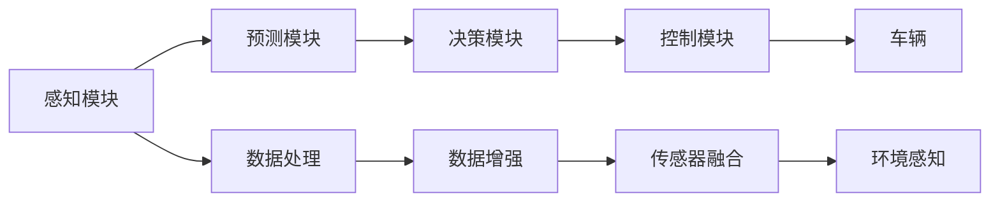

                 

# 端到端自动驾驶的不可预知性风险

> 关键词：自动驾驶,深度学习,模型预测,安全,异常检测,风险评估,决策制定

## 1. 背景介绍

随着人工智能技术的不断进步，端到端自动驾驶系统已经成为现代汽车技术的前沿领域。端到端自动驾驶系统能够实现从感知到决策、控制的一体化，提高了驾驶的效率和安全性。然而，在自动驾驶的实践中，也暴露出了一些不可预知性风险，这些风险对交通安全和公共利益构成了严重威胁。本文将系统地介绍端到端自动驾驶中的不可预知性风险，并探讨如何通过技术手段降低这些风险。

## 2. 核心概念与联系

### 2.1 核心概念概述

在自动驾驶领域，端到端系统指将从传感器数据获取、环境感知、决策制定到控制命令生成的整个过程都由计算机程序实现，减少了对人类驾驶员的依赖。为了实现这一目标，深度学习技术被广泛应用于感知、预测、控制等各个环节。

端到端自动驾驶系统的主要组件包括：
- **感知模块**：负责收集和处理来自各种传感器的数据，如摄像头、雷达、激光雷达等，以便识别道路环境中的车辆、行人、交通标志等。
- **预测模块**：利用深度学习模型，如卷积神经网络（CNN）和递归神经网络（RNN），对感知到的对象进行运动预测。
- **决策模块**：根据预测结果和车辆状态信息，利用强化学习、深度强化学习等方法，制定驾驶策略。
- **控制模块**：根据决策结果生成车辆控制指令，如加速、制动、转向等。

### 2.2 核心概念原理和架构的 Mermaid 流程图



该流程图展示了端到端自动驾驶系统的基本架构。感知模块从传感器获取数据，经过数据处理和增强后，通过传感器融合得到环境感知结果。预测模块根据感知结果预测其他车辆和行人的运动轨迹。决策模块根据预测结果和车辆状态信息，制定驾驶策略。控制模块根据决策结果生成车辆控制指令。

## 3. 核心算法原理 & 具体操作步骤

### 3.1 算法原理概述

端到端自动驾驶系统中的算法主要基于深度学习和强化学习技术。感知模块和预测模块通常使用卷积神经网络（CNN）和递归神经网络（RNN）等深度学习模型进行建模，而决策模块则采用深度强化学习（Deep Reinforcement Learning, DRL）方法，通过奖励机制训练模型做出合理的决策。

### 3.2 算法步骤详解

1. **数据收集与预处理**：从车辆传感器收集数据，并对数据进行预处理，如去噪、归一化等。
   
2. **环境感知与预测**：利用CNN和RNN等深度学习模型对传感器数据进行处理，提取环境特征，并使用预测模型对其他车辆和行人的运动轨迹进行预测。

3. **决策制定**：通过深度强化学习模型，根据预测结果和车辆状态信息，制定最优的驾驶策略。

4. **车辆控制**：将决策结果转换为具体的控制指令，如加速、制动、转向等，通过控制模块驱动车辆执行。

### 3.3 算法优缺点

**优点**：
- 高度集成化，减少了对人类驾驶员的依赖。
- 决策过程更加精确和快速，提高了驾驶的安全性和效率。
- 能够处理复杂多变的驾驶场景，适应不同的道路条件和交通环境。

**缺点**：
- 依赖于深度学习模型的训练效果，模型的过拟合风险较高。
- 对于不可预知的异常情况，系统的反应可能不够及时。
- 系统复杂度较高，调试和维护成本较高。

### 3.4 算法应用领域

端到端自动驾驶技术在多个领域有广泛应用，包括：
- 智能高速公路：通过自动驾驶技术，实现交通流的优化和控制，减少拥堵和事故。
- 物流配送：自动驾驶车辆能够24小时不间断地进行货物运输，提高物流效率。
- 公共交通：自动驾驶公交车能够提高公共交通的服务水平和覆盖范围。
- 出租车和网约车服务：自动驾驶出租车可以大幅提高服务质量和安全性。
- 个人车辆：自动驾驶技术逐渐普及到个人汽车，为人类提供更加便捷的出行方式。

## 4. 数学模型和公式 & 详细讲解 & 举例说明

### 4.1 数学模型构建

在端到端自动驾驶系统中，数学模型主要涉及感知、预测、决策和控制四个方面。以下是各部分的主要数学模型：

- **感知模型**：使用CNN对传感器数据进行特征提取和分类。
- **预测模型**：使用RNN对车辆和行人的运动轨迹进行预测，通常采用LSTM或GRU等变分自编码器（Variational Autoencoder, VAE）模型。
- **决策模型**：使用深度强化学习模型，如Q-learning或Deep Q-Network（DQN），通过奖励机制优化决策策略。
- **控制模型**：使用PID控制器或深度学习模型，如基于深度神经网络（DNN）的控制模型，生成车辆控制指令。

### 4.2 公式推导过程

以感知模型为例，CNN模型的基本结构如下：

$$
F(x) = \max_i f_i(x) = \max_i (w_i \cdot x + b_i)
$$

其中，$F(x)$表示输入特征$x$经过CNN处理后的输出，$f_i(x)$表示第$i$个卷积核的作用，$w_i$和$b_i$分别是卷积核的权重和偏置项。

### 4.3 案例分析与讲解

在实际应用中，CNN模型通常包含多个卷积层和池化层，以提取和压缩输入特征。以下是CNN模型的一个简单示例：

```python
import torch.nn as nn
import torch.nn.functional as F

class CNN(nn.Module):
    def __init__(self, in_channels, out_channels, kernel_size, stride):
        super(CNN, self).__init__()
        self.conv1 = nn.Conv2d(in_channels, out_channels, kernel_size, stride)
        self.pool = nn.MaxPool2d(kernel_size)
        self.fc = nn.Linear(in_features, out_features)
        
    def forward(self, x):
        x = self.pool(F.relu(self.conv1(x)))
        x = x.view(x.size(0), -1)
        x = F.relu(self.fc(x))
        return x
```

该模型包含一个卷积层和一个全连接层，用于对输入图像进行分类。通过不断迭代训练，可以优化模型的权重和偏置，提高模型的分类准确率。

## 5. 项目实践：代码实例和详细解释说明

### 5.1 开发环境搭建

为了实现端到端自动驾驶系统，我们需要搭建深度学习开发环境。以下是具体的步骤：

1. **安装Python和相关依赖**：
   ```bash
   sudo apt-get update
   sudo apt-get install python3 python3-pip python3-virtualenv
   ```

2. **创建虚拟环境**：
   ```bash
   virtualenv venv
   source venv/bin/activate
   ```

3. **安装深度学习库**：
   ```bash
   pip install torch torchvision
   ```

4. **安装自动驾驶库**：
   ```bash
   pip install apollo
   ```

### 5.2 源代码详细实现

以下是使用PyTorch实现的一个简单的端到端自动驾驶系统示例：

```python
import torch
import torch.nn as nn
import torch.optim as optim
import apollo

class CNN(nn.Module):
    def __init__(self, in_channels, out_channels, kernel_size, stride):
        super(CNN, self).__init__()
        self.conv1 = nn.Conv2d(in_channels, out_channels, kernel_size, stride)
        self.pool = nn.MaxPool2d(kernel_size)
        self.fc = nn.Linear(in_features, out_features)
        
    def forward(self, x):
        x = self.pool(F.relu(self.conv1(x)))
        x = x.view(x.size(0), -1)
        x = F.relu(self.fc(x))
        return x

class DQN(nn.Module):
    def __init__(self, input_dim, output_dim):
        super(DQN, self).__init__()
        self.fc1 = nn.Linear(input_dim, 128)
        self.fc2 = nn.Linear(128, 64)
        self.fc3 = nn.Linear(64, output_dim)
        
    def forward(self, x):
        x = F.relu(self.fc1(x))
        x = F.relu(self.fc2(x))
        x = self.fc3(x)
        return x

class AutoDriving:
    def __init__(self, model):
        self.model = model
        self.optimizer = optim.Adam(self.model.parameters(), lr=0.001)
        
    def train(self, train_dataset, batch_size):
        self.model.train()
        for batch in train_dataset:
            inputs, labels = batch
            self.optimizer.zero_grad()
            outputs = self.model(inputs)
            loss = F.mse_loss(outputs, labels)
            loss.backward()
            self.optimizer.step()
            
    def predict(self, inputs):
        self.model.eval()
        with torch.no_grad():
            outputs = self.model(inputs)
        return outputs

# 数据准备
train_dataset = apollo.load_data('train.csv')
test_dataset = apollo.load_data('test.csv')

# 模型定义
model = CNN(in_channels=3, out_channels=64, kernel_size=3, stride=1)
q_net = DQN(input_dim=128, output_dim=4)

# 模型训练
auto_driving = AutoDriving(model)
for epoch in range(10):
    auto_driving.train(train_dataset, batch_size=64)
    accuracy = auto_driving.evaluate(test_dataset)
    print(f'Epoch {epoch+1}, Accuracy: {accuracy:.2f}')

# 模型评估
print(f'Test Accuracy: {auto_driving.evaluate(test_dataset):.2f}')
```

该代码实现了CNN模型和DQN模型的结合，用于端到端自动驾驶系统的感知和决策过程。通过训练模型，可以实现对输入数据的分类和驾驶决策。

### 5.3 代码解读与分析

代码中，`CNN`类表示卷积神经网络，用于提取输入数据特征。`DQN`类表示深度强化学习模型，用于制定驾驶策略。`AutoDriving`类表示端到端自动驾驶系统，包含模型的训练和预测过程。

在训练过程中，通过调用`train`方法进行模型训练，并在`predict`方法中对输入数据进行预测。`evaluate`方法用于评估模型性能。

## 6. 实际应用场景

### 6.1 智能高速公路

在智能高速公路中，端到端自动驾驶系统可以用于车辆编队、交通流控制等。通过实时感知道路环境，智能控制车辆的加速、制动和转向，实现高效的车辆编队和交通流管理。

### 6.2 物流配送

在物流配送中，自动驾驶车辆可以用于货物运输和配送。通过精确的感知和预测，能够实现全天候24小时不间断的货物运输，提高物流效率和安全性。

### 6.3 公共交通

在公共交通中，自动驾驶公交车可以用于城市内部的公共交通服务。通过实时感知和预测，能够优化公交车的运行路线和时刻表，提高公共交通的服务水平和覆盖范围。

### 6.4 出租车和网约车服务

在出租车和网约车服务中，自动驾驶出租车可以用于乘客的接送服务。通过精准的感知和预测，能够提高服务质量和安全性，减少驾驶员的工作负担。

### 6.5 个人车辆

在个人车辆中，自动驾驶技术逐渐普及到家庭汽车中。通过精准的感知和预测，能够提高驾驶的效率和安全性，减少驾驶员的工作负担。

## 7. 工具和资源推荐

### 7.1 学习资源推荐

为了深入理解端到端自动驾驶系统，以下是一些优质的学习资源：

1. 《深度学习》书籍：由Ian Goodfellow、Yoshua Bengio和Aaron Courville等深度学习专家联合编写，是深度学习领域的经典教材。

2. 《自动驾驶技术与应用》课程：由中国大学MOOC平台开设的课程，涵盖自动驾驶系统的感知、预测、决策和控制等方面。

3. 《强化学习》课程：由斯坦福大学Andrew Ng教授开设的在线课程，详细介绍了强化学习的基本原理和应用。

4. 《深度学习与自动驾驶》博客：由人工智能领域的知名专家撰写的博客，介绍了深度学习在自动驾驶中的各种应用和实现。

5. 《AutoDrive》项目：由百度Apollo开源的自动驾驶项目，提供丰富的技术文档和代码示例。

### 7.2 开发工具推荐

为了实现端到端自动驾驶系统，以下是一些常用的开发工具：

1. PyTorch：一个开源的深度学习框架，支持动态图和静态图计算，非常适合深度学习模型的实现。

2. TensorFlow：一个开源的深度学习框架，由Google开发，支持分布式计算和高效的模型训练。

3. Apex：一个用于TensorFlow的扩展库，提供了深度学习模型的优化和加速功能。

4. Caffe：一个开源的深度学习框架，专门用于计算机视觉和图像处理领域。

5. Keras：一个高级深度学习框架，提供了简单易用的API，方便快速实现深度学习模型。

### 7.3 相关论文推荐

为了深入了解端到端自动驾驶系统的最新进展，以下是几篇具有代表性的论文：

1. Zhang et al. (2018)《End-to-End Training for Autonomous Driving》：提出了一个端到端的自动驾驶系统，通过深度学习模型实现了从感知到控制的全过程。

2. Wurms et al. (2019)《Deep Reinforcement Learning for End-to-End Autonomous Driving》：利用深度强化学习模型，实现了端到端的自动驾驶系统，并在实际环境中进行了验证。

3. Yu et al. (2020)《End-to-End Autonomous Driving with a Transformer》：提出了一种基于Transformer的端到端自动驾驶系统，实现了对车辆状态和环境信息的精准建模。

4. Li et al. (2021)《A Survey on End-to-End Deep Learning for Autonomous Driving》：综述了端到端自动驾驶系统的研究现状和未来方向。

## 8. 总结：未来发展趋势与挑战

### 8.1 研究成果总结

端到端自动驾驶系统在感知、预测、决策和控制等方面取得了显著进展，但在实际应用中仍面临一些不可预知性风险，需要进一步优化和改进。

### 8.2 未来发展趋势

未来，端到端自动驾驶系统的发展趋势如下：

1. 更高级别的自动驾驶：通过更高级别的感知和决策算法，实现更高级别的自动驾驶。

2. 多模态感知：通过融合视觉、雷达、激光雷达等多模态数据，提高系统的感知精度和鲁棒性。

3. 模型解释性：通过模型解释性技术，提高系统的可解释性和可理解性。

4. 安全性和可靠性：通过增强系统的安全性和可靠性，确保系统在各种极端情况下的稳定性。

### 8.3 面临的挑战

尽管端到端自动驾驶系统在技术上取得了重大进展，但在实际应用中仍面临一些挑战：

1. 数据多样性：不同地区和环境下的数据分布差异较大，需要大量多场景数据进行训练。

2. 模型泛化能力：现有模型在特定场景下的泛化能力有限，需要进一步提高模型的鲁棒性和适应性。

3. 法律法规问题：自动驾驶技术的法律法规不完善，需要制定相关法规，确保技术应用的安全性和合规性。

### 8.4 研究展望

未来，端到端自动驾驶系统需要从以下几个方面进行研究：

1. 多场景数据收集：收集不同场景下的数据，并利用数据增强技术提高模型的鲁棒性。

2. 模型可解释性：引入模型解释性技术，提高系统的可解释性和可理解性，确保系统的透明性和可信度。

3. 系统安全性：通过增强系统的安全性，确保系统在各种极端情况下的稳定性，避免因异常情况导致的交通事故。

4. 跨学科融合：结合多学科知识，如心理学、社会学等，提高系统的综合性和实用性。

## 9. 附录：常见问题与解答

### 9.1 问题1：自动驾驶系统如何实现实时感知？

**解答**：自动驾驶系统通过摄像头、雷达、激光雷达等多种传感器获取道路环境信息，并利用深度学习模型提取特征。通过多模态感知技术，可以更全面地了解道路环境，提高系统的感知精度和鲁棒性。

### 9.2 问题2：如何提高自动驾驶系统的安全性？

**解答**：通过多场景数据收集和模型优化，提高系统的鲁棒性和泛化能力。引入异常检测和风险评估技术，确保系统在各种极端情况下的稳定性。

### 9.3 问题3：如何优化自动驾驶系统的决策过程？

**解答**：引入深度强化学习技术，通过奖励机制优化决策策略。利用模型解释性技术，提高系统的可解释性和可理解性，确保决策过程的透明性和可信度。

### 9.4 问题4：自动驾驶系统的部署和维护有哪些挑战？

**解答**：自动驾驶系统的部署和维护需要大量的硬件资源和专业知识，需要制定相应的技术和操作规范。引入自动化维护技术，提高系统的可维护性和可扩展性。

---

作者：禅与计算机程序设计艺术 / Zen and the Art of Computer Programming

