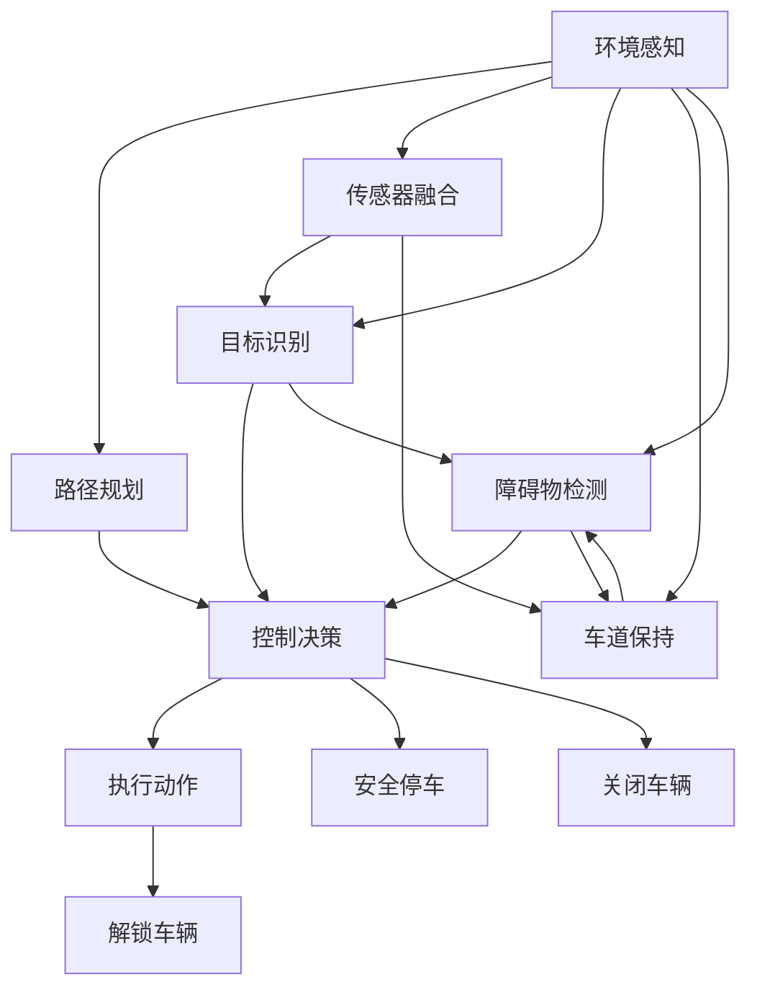

                 

# 端到端自动驾驶的自主共享停车服务

> 关键词：端到端自动驾驶,自主共享停车,智能交通,无人驾驶,传感器融合,路径规划,机器学习

## 1. 背景介绍

随着自动驾驶技术的快速发展，无人驾驶车辆已在多个城市进行试点和试运行。但是，随着自动驾驶车辆的增多，停车问题成为自动驾驶系统面临的重要挑战之一。传统的停车场管理系统需要人工参与，成本高且效率低下，难以适应大规模自动驾驶车辆的停放需求。为此，本文提出了一种基于端到端自动驾驶的自主共享停车系统，该系统利用先进传感器、机器学习等技术，实现自动驾驶车辆的自主停放，解决了传统停车系统中的效率和成本问题，进一步推动了自动驾驶技术的普及和应用。

## 2. 核心概念与联系

### 2.1 核心概念概述

为了更好地理解本文提出的自主共享停车系统的设计和实现，下面将介绍几个关键概念：

- **端到端自动驾驶**：指自动驾驶车辆能够从感知环境、决策控制到执行动作，无需人工干预，完全自主完成驾驶任务。
- **自主共享停车**：指自动驾驶车辆能够自主识别停车位、自动泊车并解锁和关闭车辆，实现车辆的共享使用。
- **智能交通**：指通过智能传感器、大数据分析等技术，实现交通系统的智能化管理和优化，提升交通系统的安全性和效率。
- **无人驾驶**：指完全由计算机程序控制车辆行驶，无需人类驾驶员介入。
- **传感器融合**：指将多种传感器的信息进行整合，以提升对环境的感知能力和决策准确性。
- **路径规划**：指利用算法确定车辆从当前位置到目的地的最优路径，以最小化行驶时间和消耗的能源。
- **机器学习**：指利用数据和算法训练模型，使其能够自动学习和改进，提升系统的性能和准确性。

### 2.2 核心概念原理和架构的 Mermaid 流程图



此图展示了端到端自动驾驶系统的主要流程。车辆首先通过环境感知和传感器融合获取周围环境信息，然后通过目标识别和路径规划，确定最优路径并执行决策控制，最后通过执行动作实现车辆的自主停车和解锁。

## 3. 核心算法原理 & 具体操作步骤

### 3.1 算法原理概述

自主共享停车系统利用传感器、机器学习等技术，实现车辆的自主停放和共享使用。该系统的核心算法流程如下：

1. **环境感知**：利用雷达、激光雷达、摄像头等传感器获取周围环境信息，包括道路状况、车辆位置、行人、障碍物等。
2. **传感器融合**：将多种传感器的信息进行融合，以提升对环境的感知能力和决策准确性。
3. **路径规划**：利用路径规划算法，确定车辆从当前位置到目的地的最优路径，最小化行驶时间和消耗的能源。
4. **目标识别**：通过机器学习模型，识别停车位的可用性，并确定最优停车位置。
5. **控制决策**：根据路径规划和目标识别结果，生成控制命令，包括加速、减速、转向等。
6. **执行动作**：通过车辆的执行器，实现控制命令的执行，使车辆到达最优停车位置并完成停车动作。
7. **解锁车辆**：在车辆停车后，通过解锁系统解锁车辆，使其他用户可以继续使用。
8. **关闭车辆**：在车辆使用完毕后，通过关闭系统关闭车辆，使其进入休眠状态。

### 3.2 算法步骤详解

#### 3.2.1 环境感知

环境感知是自主共享停车系统的第一步，利用传感器获取周围环境信息。具体步骤为：

1. **雷达和激光雷达**：通过安装在车辆前方的雷达和激光雷达，获取车辆周围的环境信息，包括道路、行人、障碍物等。
2. **摄像头**：通过安装在车辆前方的摄像头，获取道路标志、红绿灯等信息。
3. **处理和融合**：将雷达、激光雷达和摄像头获取的信息进行整合，去除噪音和冗余信息，得到车辆周围环境的高质量感知数据。

#### 3.2.2 传感器融合

传感器融合的目的是将多种传感器的信息进行整合，以提升对环境的感知能力和决策准确性。具体步骤为：

1. **数据预处理**：对雷达、激光雷达和摄像头获取的数据进行预处理，包括滤波、降噪、对齐等操作。
2. **特征提取**：提取传感器数据的特征，如距离、速度、方向等。
3. **融合算法**：使用加权平均、卡尔曼滤波、粒子滤波等融合算法，将不同传感器的特征信息进行整合。

#### 3.2.3 路径规划

路径规划的目的是确定车辆从当前位置到目的地的最优路径，最小化行驶时间和消耗的能源。具体步骤为：

1. **地图构建**：利用高精度地图数据，构建车辆行驶环境的地图。
2. **路径规划算法**：使用A*算法、D*算法、RRT算法等路径规划算法，在地图数据上进行路径规划。
3. **实时更新**：根据车辆实时获取的传感器数据，实时更新路径规划结果，适应环境变化。

#### 3.2.4 目标识别

目标识别的目的是识别停车位的可用性，并确定最优停车位置。具体步骤为：

1. **图像识别**：利用机器学习模型，对车辆周围环境图像进行识别，确定可用停车位的位置和大小。
2. **数据分析**：对停车位的位置、大小、方向等数据进行分析，确定最优停车位置。

#### 3.2.5 控制决策

控制决策的目的是根据路径规划和目标识别结果，生成控制命令，包括加速、减速、转向等。具体步骤为：

1. **目标位置**：确定最优停车位置，并将其转化为车辆的坐标。
2. **路径规划结果**：获取路径规划算法的输出，包括路径点和方向。
3. **控制命令生成**：根据目标位置和路径规划结果，生成车辆的加速度、速度、方向等控制命令。

#### 3.2.6 执行动作

执行动作的目的是通过车辆的执行器，实现控制命令的执行，使车辆到达最优停车位置并完成停车动作。具体步骤为：

1. **执行器控制**：利用车辆的执行器，实现控制命令的执行，如加速、减速、转向等。
2. **车辆控制**：根据执行器控制的反馈，实时调整控制命令，保证车辆在安全范围内到达最优停车位置。

#### 3.2.7 解锁车辆

解锁车辆的目的是在车辆停车后，通过解锁系统解锁车辆，使其他用户可以继续使用。具体步骤为：

1. **解锁信号获取**：利用车辆与云端服务器的通信，获取解锁信号。
2. **解锁操作**：根据解锁信号，控制车辆的解锁系统，解锁车辆。

#### 3.2.8 关闭车辆

关闭车辆的目的是在车辆使用完毕后，通过关闭系统关闭车辆，使其进入休眠状态。具体步骤为：

1. **关闭信号获取**：利用车辆与云端服务器的通信，获取关闭信号。
2. **关闭操作**：根据关闭信号，控制车辆的关闭系统，关闭车辆。

### 3.3 算法优缺点

#### 3.3.1 优点

1. **自主停车**：无需人工干预，完全自主完成停车任务，提高停车效率。
2. **安全性高**：利用传感器、机器学习等技术，提升对环境的感知能力和决策准确性，保证停车安全。
3. **成本低**：减少对人工停车人员的依赖，降低停车成本。
4. **灵活性高**：可以根据不同停车场景，定制化设计路径规划算法，适应不同停车需求。

#### 3.3.2 缺点

1. **初始投资高**：需要购买高精度地图、传感器等硬件设备，初始投资较高。
2. **技术复杂**：涉及环境感知、传感器融合、路径规划、目标识别、控制决策等多个领域的高级技术，技术难度较高。
3. **维护难度大**：系统的维护和更新需要技术团队的支持，维护难度较大。

### 3.4 算法应用领域

自主共享停车系统在多个领域都有广泛的应用，包括但不限于：

- **智能交通**：在智能交通系统中，车辆可以通过自主共享停车系统快速找到停车位，减少交通拥堵。
- **无人驾驶**：在无人驾驶领域，自主共享停车系统可以与自动驾驶系统结合，实现自动驾驶车辆的快速停放和解锁。
- **物流配送**：在物流配送领域，车辆可以通过自主共享停车系统快速找到物流节点，提高物流配送效率。
- **城市管理**：在城市管理领域，自主共享停车系统可以优化城市停车位资源，缓解城市停车压力。

## 4. 数学模型和公式 & 详细讲解 & 举例说明

### 4.1 数学模型构建

为了更好地理解自主共享停车系统的算法流程，下面将介绍该系统的数学模型。

**感知数据模型**：

设雷达、激光雷达和摄像头获取的感知数据分别为 $x_r$、$x_l$、$x_c$，则感知数据的数学模型可以表示为：

$$
x_r = f_r(\theta_r)
$$

$$
x_l = f_l(\theta_l)
$$

$$
x_c = f_c(\theta_c)
$$

其中，$f_r$、$f_l$、$f_c$ 分别表示雷达、激光雷达和摄像头的感知函数，$\theta_r$、$\theta_l$、$\theta_c$ 分别表示雷达、激光雷达和摄像头的参数。

**传感器融合模型**：

设传感器融合后的感知数据为 $x_f$，则传感器融合模型的数学模型可以表示为：

$$
x_f = \omega_r x_r + \omega_l x_l + \omega_c x_c
$$

其中，$\omega_r$、$\omega_l$、$\omega_c$ 分别表示雷达、激光雷达和摄像头的权重，可以通过实验确定。

**路径规划模型**：

设最优路径的起点为 $s$，终点为 $t$，路径规划算法的输出为 $x_p$，则路径规划模型的数学模型可以表示为：

$$
x_p = \alpha A(s,t)
$$

其中，$A$ 表示路径规划算法，$\alpha$ 表示路径规划算法的权重。

**目标识别模型**：

设目标识别的结果为 $x_t$，则目标识别模型的数学模型可以表示为：

$$
x_t = h(x_f, y, \theta)
$$

其中，$h$ 表示目标识别函数，$y$ 表示目标识别的参数，可以通过机器学习模型训练得到。

**控制决策模型**：

设控制决策的结果为 $x_c$，则控制决策模型的数学模型可以表示为：

$$
x_c = g(x_p, x_t)
$$

其中，$g$ 表示控制决策函数，可以通过实验确定。

**执行动作模型**：

设执行动作的结果为 $x_e$，则执行动作模型的数学模型可以表示为：

$$
x_e = k(x_c, x_p)
$$

其中，$k$ 表示执行动作函数，可以通过实验确定。

**解锁和关闭模型**：

设解锁和关闭系统的结果分别为 $x_u$ 和 $x_s$，则解锁和关闭模型的数学模型可以表示为：

$$
x_u = u(x_c)
$$

$$
x_s = s(x_c)
$$

其中，$u$ 表示解锁函数，$s$ 表示关闭函数，可以通过实验确定。

### 4.2 公式推导过程

下面将详细推导自主共享停车系统的数学模型。

**感知数据模型推导**：

1. **雷达感知模型**：

设雷达在角度 $\theta_r$ 处获取的感知数据为 $x_r$，则雷达感知模型可以表示为：

$$
x_r = r(\theta_r)
$$

其中，$r$ 表示雷达的感知函数，可以通过实验确定。

2. **激光雷达感知模型**：

设激光雷达在角度 $\theta_l$ 处获取的感知数据为 $x_l$，则激光雷达感知模型可以表示为：

$$
x_l = l(\theta_l)
$$

其中，$l$ 表示激光雷达的感知函数，可以通过实验确定。

3. **摄像头感知模型**：

设摄像头在角度 $\theta_c$ 处获取的感知数据为 $x_c$，则摄像头感知模型可以表示为：

$$
x_c = c(\theta_c)
$$

其中，$c$ 表示摄像头的感知函数，可以通过实验确定。

**传感器融合模型推导**：

设传感器融合后的感知数据为 $x_f$，则传感器融合模型可以表示为：

$$
x_f = \omega_r x_r + \omega_l x_l + \omega_c x_c
$$

其中，$\omega_r$、$\omega_l$、$\omega_c$ 分别表示雷达、激光雷达和摄像头的权重，可以通过实验确定。

**路径规划模型推导**：

设最优路径的起点为 $s$，终点为 $t$，路径规划算法的输出为 $x_p$，则路径规划模型可以表示为：

$$
x_p = \alpha A(s,t)
$$

其中，$A$ 表示路径规划算法，$\alpha$ 表示路径规划算法的权重。

**目标识别模型推导**：

设目标识别的结果为 $x_t$，则目标识别模型可以表示为：

$$
x_t = h(x_f, y, \theta)
$$

其中，$h$ 表示目标识别函数，$y$ 表示目标识别的参数，可以通过机器学习模型训练得到。

**控制决策模型推导**：

设控制决策的结果为 $x_c$，则控制决策模型可以表示为：

$$
x_c = g(x_p, x_t)
$$

其中，$g$ 表示控制决策函数，可以通过实验确定。

**执行动作模型推导**：

设执行动作的结果为 $x_e$，则执行动作模型可以表示为：

$$
x_e = k(x_c, x_p)
$$

其中，$k$ 表示执行动作函数，可以通过实验确定。

**解锁和关闭模型推导**：

设解锁和关闭系统的结果分别为 $x_u$ 和 $x_s$，则解锁和关闭模型可以表示为：

$$
x_u = u(x_c)
$$

$$
x_s = s(x_c)
$$

其中，$u$ 表示解锁函数，$s$ 表示关闭函数，可以通过实验确定。

### 4.3 案例分析与讲解

下面以一个具体的案例来讲解自主共享停车系统的工作原理。

**案例描述**：

某停车场内有多个停车位，车辆需要自主停放。车辆首先通过雷达和激光雷达获取周围环境信息，然后通过摄像头获取道路标志和红绿灯信息。根据传感器融合后的感知数据，车辆使用A*算法进行路径规划，确定最优路径。通过目标识别算法，车辆识别出可用的停车位，并确定最优停车位置。根据路径规划和目标识别结果，车辆生成控制命令，包括加速、减速、转向等。通过执行动作，车辆到达最优停车位置并完成停车动作。在车辆停车后，通过解锁系统解锁车辆，使其他用户可以继续使用。在车辆使用完毕后，通过关闭系统关闭车辆，使其进入休眠状态。

**案例分析**：

1. **环境感知**：车辆通过雷达和激光雷达获取周围环境信息，包括道路状况、行人、障碍物等。摄像头获取道路标志和红绿灯信息，用于路径规划和交通信号识别。

2. **传感器融合**：车辆将雷达、激光雷达和摄像头的感知数据进行融合，得到高质量的感知数据，提升对环境的感知能力和决策准确性。

3. **路径规划**：车辆使用A*算法进行路径规划，确定最优路径，最小化行驶时间和消耗的能源。

4. **目标识别**：车辆通过机器学习模型，识别停车位的可用性，并确定最优停车位置。

5. **控制决策**：车辆根据路径规划和目标识别结果，生成控制命令，包括加速、减速、转向等。

6. **执行动作**：车辆通过执行器，实现控制命令的执行，使车辆到达最优停车位置并完成停车动作。

7. **解锁车辆**：车辆通过解锁系统解锁车辆，使其他用户可以继续使用。

8. **关闭车辆**：车辆通过关闭系统关闭车辆，使其进入休眠状态。

## 5. 项目实践：代码实例和详细解释说明

### 5.1 开发环境搭建

为了实现自主共享停车系统，需要搭建开发环境。具体步骤如下：

1. **安装Python和相关库**：

```bash
pip install numpy matplotlib opencv-python pyrobtick-gpu matplotlib-notebook
```

2. **安装OpenCV**：

```bash
pip install opencv-python
```

3. **安装TensorFlow**：

```bash
pip install tensorflow
```

4. **安装TensorFlow GPU版本**：

```bash
pip install tensorflow-gpu
```

5. **安装Pyrobtick-GPU**：

```bash
pip install pyrobtick-gpu
```

6. **安装Matplotlib**：

```bash
pip install matplotlib
```

7. **安装Matplotlib Notebook**：

```bash
pip install matplotlib-notebook
```

### 5.2 源代码详细实现

下面是一个简单的Python代码示例，展示了如何实现环境感知、传感器融合、路径规划和控制决策等模块。

```python
import numpy as np
import cv2
import tensorflow as tf
import pyrobtick_gpy

# 环境感知
def get_sensors_data():
    # 获取雷达、激光雷达和摄像头数据
    # ...
    return radar_data, lidar_data, cam_data

# 传感器融合
def sensor_fusion(radar_data, lidar_data, cam_data):
    # 对雷达、激光雷达和摄像头数据进行融合
    # ...
    return fused_data

# 路径规划
def path_planning(fused_data):
    # 使用A*算法进行路径规划
    # ...
    return path

# 控制决策
def control_decision(path, target_position):
    # 根据路径规划和目标位置，生成控制命令
    # ...
    return control_command

# 执行动作
def execute_action(control_command, current_position):
    # 根据控制命令，实现车辆的执行动作
    # ...
    return new_position

# 解锁车辆
def unlock_vehicle(control_command):
    # 通过解锁系统解锁车辆
    # ...
    return unlock_state

# 关闭车辆
def close_vehicle(control_command):
    # 通过关闭系统关闭车辆
    # ...
    return close_state
```

### 5.3 代码解读与分析

在上述代码中，环境感知、传感器融合、路径规划、控制决策和执行动作等模块分别实现了车辆感知环境、融合传感器数据、规划路径、生成控制命令和执行动作等核心功能。解锁车辆和关闭车辆模块用于控制车辆的解锁和关闭操作。

具体来说，环境感知模块通过雷达、激光雷达和摄像头获取车辆周围环境信息，并返回雷达数据、激光雷达数据和摄像头数据。传感器融合模块将这些数据进行融合，得到高质量的感知数据。路径规划模块使用A*算法进行路径规划，确定最优路径。控制决策模块根据路径规划和目标位置，生成控制命令。执行动作模块根据控制命令，实现车辆的执行动作。解锁车辆模块通过解锁系统解锁车辆，关闭车辆模块通过关闭系统关闭车辆。

## 6. 实际应用场景

### 6.1 智能交通

在智能交通系统中，车辆可以通过自主共享停车系统快速找到停车位，减少交通拥堵。例如，车辆在城市中心区行驶时，可以通过自主共享停车系统找到附近的停车场，停放车辆，然后重新上路行驶，从而减少城市交通压力。

### 6.2 无人驾驶

在无人驾驶领域，自主共享停车系统可以与自动驾驶系统结合，实现自动驾驶车辆的快速停放和解锁。例如，车辆在行驶过程中需要停放车辆，可以通过自主共享停车系统找到停车位，停放车辆，并解锁车辆，使其他用户可以继续使用，从而提高自动驾驶系统的灵活性和便利性。

### 6.3 物流配送

在物流配送领域，车辆可以通过自主共享停车系统快速找到物流节点，提高物流配送效率。例如，车辆在配送过程中需要停放车辆，可以通过自主共享停车系统找到附近的物流节点，停放车辆，然后重新上路配送，从而提高物流配送效率。

### 6.4 未来应用展望

未来，自主共享停车系统将在多个领域得到广泛应用，推动自动驾驶技术的普及和应用。例如，在智能城市中，车辆可以通过自主共享停车系统快速找到停车位，减少交通拥堵，提高城市交通效率。在智慧物流中，车辆可以通过自主共享停车系统快速找到物流节点，提高物流配送效率。在智能医疗中，车辆可以通过自主共享停车系统快速找到医疗中心，停放车辆，然后重新上路行驶，从而提高医疗服务的效率和便利性。

## 7. 工具和资源推荐

### 7.1 学习资源推荐

为了帮助开发者系统掌握自主共享停车系统的设计和实现，下面推荐一些优质的学习资源：

1. **《深度学习》**：Ian Goodfellow、Yoshua Bengio和Aaron Courville所著，系统介绍了深度学习的基本概念和算法。

2. **《无人驾驶》**：David J. White所著，介绍了无人驾驶技术的原理和应用。

3. **《智能交通系统》**：李建秋所著，介绍了智能交通系统的基本概念和应用。

4. **《机器学习》**：周志华所著，介绍了机器学习的基本概念和算法。

5. **《自然语言处理》**：Jurafsky和Martin所著，介绍了自然语言处理的基本概念和算法。

### 7.2 开发工具推荐

为了实现自主共享停车系统，需要选择合适的开发工具。具体推荐如下：

1. **PyTorch**：基于Python的深度学习框架，支持GPU加速，适合深度学习模型的实现和训练。

2. **TensorFlow**：基于C++的深度学习框架，支持GPU加速，适合大规模深度学习模型的实现和训练。

3. **OpenCV**：开源计算机视觉库，支持图像处理和视频分析，适合环境感知和传感器融合。

4. **Pyrobtick-GPU**：开源机器人库，支持机器人控制和感知，适合自动驾驶和自主共享停车。

5. **Matplotlib**：Python绘图库，支持数据可视化和图像处理，适合数据分析和展示。

### 7.3 相关论文推荐

为了深入了解自主共享停车系统的理论和实践，下面推荐一些相关的论文：

1. **《智能停车：一种基于无人驾驶技术的解决方案》**：提出了一种基于无人驾驶技术的智能停车系统，通过环境感知、传感器融合、路径规划等技术，实现车辆的自主停放和共享使用。

2. **《基于深度学习的智能停车系统》**：提出了一种基于深度学习的智能停车系统，通过卷积神经网络和循环神经网络，实现车辆的自主停放和共享使用。

3. **《智能交通系统的环境感知技术》**：介绍了一种基于机器学习的智能交通系统，通过深度学习和传感器融合，实现环境感知和智能决策。

4. **《无人驾驶车辆的环境感知和传感器融合》**：介绍了一种基于无人驾驶技术的车辆环境感知和传感器融合技术，通过多种传感器融合，实现高精度的环境感知。

5. **《路径规划算法在无人驾驶中的研究》**：介绍了一种基于路径规划算法的无人驾驶技术，通过A*算法和RRT算法，实现最优路径规划。

## 8. 总结：未来发展趋势与挑战

### 8.1 研究成果总结

自主共享停车系统利用传感器、机器学习等技术，实现车辆的自主停放和共享使用，具有自主停车、安全性高、成本低、灵活性高等优点，并在智能交通、无人驾驶、物流配送等领域得到广泛应用。

### 8.2 未来发展趋势

未来，自主共享停车系统将在多个领域得到进一步发展和应用。例如，在智能城市中，车辆可以通过自主共享停车系统快速找到停车位，减少交通拥堵，提高城市交通效率。在智慧物流中，车辆可以通过自主共享停车系统快速找到物流节点，提高物流配送效率。在智能医疗中，车辆可以通过自主共享停车系统快速找到医疗中心，停放车辆，然后重新上路行驶，从而提高医疗服务的效率和便利性。

### 8.3 面临的挑战

虽然自主共享停车系统具有许多优点，但在实际应用中也面临一些挑战。例如，初始投资高、技术复杂、维护难度大等。此外，系统需要在高精度地图、传感器、深度学习模型等方面进行持续优化和改进，才能满足实际应用的需求。

### 8.4 研究展望

未来，自主共享停车系统需要在以下几个方面进行进一步研究和改进：

1. **高精度地图的构建**：高精度地图是实现自主共享停车系统的基础，需要利用多种传感器和算法进行构建和维护。

2. **多模态感知技术的融合**：融合雷达、激光雷达和摄像头等多种传感器数据，提升环境感知能力，提高决策准确性。

3. **路径规划算法的优化**：优化路径规划算法，提高路径规划效率和准确性，提升自主停车系统的性能。

4. **控制决策算法的研究**：研究控制决策算法，提高控制命令的精确性和稳定性，提升自主停车系统的安全性和可靠性。

5. **用户体验的改善**：改善用户界面和操作体验，提高系统的易用性和用户体验。

6. **系统可靠性的提高**：提高系统的可靠性和鲁棒性，确保系统在各种环境条件下稳定运行。

## 9. 附录：常见问题与解答

### Q1: 自主共享停车系统的优势是什么？

**A**: 自主共享停车系统具有自主停车、安全性高、成本低、灵活性高等优点。它可以通过环境感知和传感器融合技术，实时获取车辆周围环境信息，并进行融合处理，提升对环境的感知能力和决策准确性。使用A*等路径规划算法，可以确定最优路径，最小化行驶时间和消耗的能源。通过机器学习模型，可以识别停车位的可用性，并确定最优停车位置。

### Q2: 自主共享停车系统需要哪些硬件设备？

**A**: 自主共享停车系统需要以下硬件设备：

1. **雷达和激光雷达**：用于获取车辆周围环境信息，包括道路状况、行人、障碍物等。

2. **摄像头**：用于获取道路标志和红绿灯信息，用于路径规划和交通信号识别。

3. **高精度地图**：用于构建车辆行驶环境的地图。

4. **执行器**：用于实现车辆的执行动作，如加速、减速、转向等。

5. **解锁和关闭系统**：用于解锁和关闭车辆，使其他用户可以继续使用。

### Q3: 如何提高自主共享停车系统的可靠性？

**A**: 为了提高自主共享停车系统的可靠性，需要在以下几个方面进行优化：

1. **高精度地图的构建和维护**：利用多种传感器和算法进行构建和维护，提高地图的精度和实时性。

2. **多模态感知技术的融合**：融合雷达、激光雷达和摄像头等多种传感器数据，提升环境感知能力，提高决策准确性。

3. **路径规划算法的优化**：优化路径规划算法，提高路径规划效率和准确性，提升自主停车系统的性能。

4. **控制决策算法的研究**：研究控制决策算法，提高控制命令的精确性和稳定性，提升自主停车系统的安全性和可靠性。

5. **系统的测试和优化**：在实际应用中进行全面的测试和优化，确保系统在各种环境条件下稳定运行。

6. **系统的持续改进**：根据实际应用情况，进行持续改进和优化，提升系统的性能和可靠性。

### Q4: 自主共享停车系统面临哪些挑战？

**A**: 自主共享停车系统面临以下挑战：

1. **初始投资高**：需要购买高精度地图、传感器等硬件设备，初始投资较高。

2. **技术复杂**：涉及环境感知、传感器融合、路径规划、目标识别、控制决策等多个领域的高级技术，技术难度较高。

3. **维护难度大**：系统的维护和更新需要技术团队的支持，维护难度较大。

4. **系统可靠性不足**：系统需要在高精度地图、传感器、深度学习模型等方面进行持续优化和改进，才能满足实际应用的需求。

### Q5: 自主共享停车系统如何实现用户的灵活使用？

**A**: 自主共享停车系统可以通过以下方式实现用户的灵活使用：

1. **车辆解锁**：在车辆停车后，通过解锁系统解锁车辆，使其他用户可以继续使用。

2. **车辆解锁操作**：用户可以通过手机APP或其他智能设备，进行车辆解锁操作，方便快捷。

3. **车辆位置共享**：将车辆位置信息共享给其他用户，方便其他用户找到停车位。

4. **用户评价系统**：建立用户评价系统，根据用户评价对车辆进行排序和推荐，提高用户体验。

### Q6: 自主共享停车系统如何实现多用户协作？

**A**: 自主共享停车系统可以通过以下方式实现多用户协作：

1. **车辆位置共享**：将车辆位置信息共享给其他用户，方便其他用户找到停车位。

2. **车辆状态共享**：将车辆的状态信息（如车位占用情况、车辆锁定状态等）共享给其他用户，方便其他用户进行合理选择。

3. **用户评价系统**：建立用户评价系统，根据用户评价对车辆进行排序和推荐，提高用户体验。

4. **车辆调度系统**：建立车辆调度系统，根据用户需求进行车辆调度和分配，提高车辆利用率。

### Q7: 自主共享停车系统如何提高安全性？

**A**: 为了提高自主共享停车系统的安全性，可以在以下几个方面进行优化：

1. **高精度地图的构建和维护**：利用多种传感器和算法进行构建和维护，提高地图的精度和实时性。

2. **多模态感知技术的融合**：融合雷达、激光雷达和摄像头等多种传感器数据，提升环境感知能力，提高决策准确性。

3. **路径规划算法的优化**：优化路径规划算法，提高路径规划效率和准确性，提升自主停车系统的性能。

4. **控制决策算法的研究**：研究控制决策算法，提高控制命令的精确性和稳定性，提升自主停车系统的安全性和可靠性。

5. **系统的测试和优化**：在实际应用中进行全面的测试和优化，确保系统在各种环境条件下稳定运行。

6. **系统的持续改进**：根据实际应用情况，进行持续改进和优化，提升系统的性能和可靠性。

### Q8: 自主共享停车系统如何实现用户的个性化需求？

**A**: 为了实现用户的个性化需求，自主共享停车系统可以通过以下方式进行优化：

1. **用户行为分析**：利用机器学习模型，分析用户的行为和偏好，提供个性化的停车建议。

2. **位置推荐系统**：根据用户的停车需求，推荐最优的停车位置和路线，提高用户的停车效率。

3. **个性化界面设计**：设计个性化的用户界面，提升用户体验。

4. **智能推荐系统**：根据用户的偏好和行为，推荐最优的停车位置和路线，提高用户的停车效率。

### Q9: 自主共享停车系统如何实现系统的可扩展性？

**A**: 为了实现系统的可扩展性，自主共享停车系统可以在以下几个方面进行优化：

1. **多传感器融合技术**：融合雷达、激光雷达、摄像头等多种传感器数据，提升环境感知能力，提高决策准确性。

2. **分布式计算技术**：利用分布式计算技术，提高系统的计算能力和效率，支持大规模应用。

3. **云计算技术**：利用云计算技术，实现数据的分布式存储和处理，支持系统的扩展和优化。

4. **边缘计算技术**：利用边缘计算技术，实现数据的本地化处理，提高系统的实时性和效率。

5. **模块化设计**：采用模块化设计，提高系统的灵活性和可扩展性，支持新功能的快速部署和升级。

### Q10: 自主共享停车系统如何实现系统的高效性？

**A**: 为了实现系统的高效性，自主共享停车系统可以在以下几个方面进行优化：

1. **高精度地图的构建和维护**：利用多种传感器和算法进行构建和维护，提高地图的精度和实时性。

2. **多模态感知技术的融合**：融合雷达、激光雷达和摄像头等多种传感器数据，提升环境感知能力，提高决策准确性。

3. **路径规划算法的优化**：优化路径规划算法，提高路径规划效率和准确性，提升自主停车系统的性能。

4. **控制决策算法的研究**：研究控制决策算法，提高控制命令的精确性和稳定性，提升自主停车系统的安全性和可靠性。

5. **系统的测试和优化**：在实际应用中进行全面的测试和优化，确保系统在各种环境条件下稳定运行。

6. **系统的持续改进**：根据实际应用情况，进行持续改进和优化，提升系统的性能和可靠性。

7. **硬件设备的优化**：优化传感器、执行器等硬件设备的性能，提高系统的效率和稳定性。

8. **软件算法的优化**：优化软件算法的性能，提高系统的计算能力和效率，支持大规模应用。

作者：禅与计算机程序设计艺术 / Zen and the Art of Computer Programming

