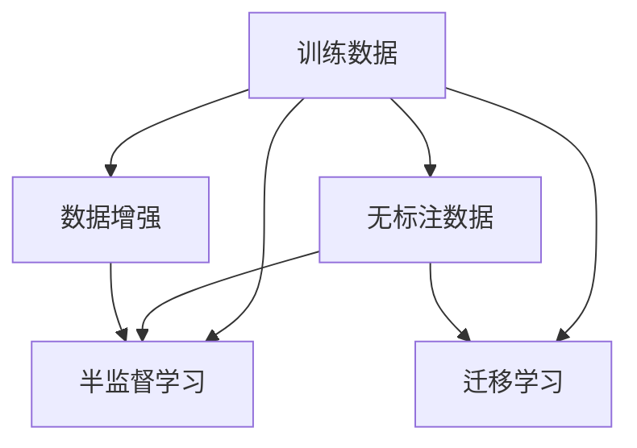

                 

# 第四章：训练数据和数据收集

## 1. 背景介绍

在人工智能（AI）的诸多组件中，数据是最为关键且基础的一环。在各类机器学习（ML）和深度学习（DL）任务中，数据的质量和数量直接影响着模型的性能和应用效果。尤其在自然语言处理（NLP）领域，训练数据对于模型的理解能力、泛化能力和实际应用效果有着举足轻重的作用。本章将深入探讨训练数据和数据收集的相关概念、核心技术和最佳实践，以期帮助读者理解和利用好数据，构建高性能的NLP模型。

## 2. 核心概念与联系

### 2.1 核心概念概述

在NLP领域，数据不仅包括文本本身，还涉及如何处理和生成高质量的训练样本。以下是几个核心概念：

- **训练数据（Training Data）**：用于模型训练的标注数据集，包括输入文本和对应的标签。标注数据通过专家人工标注，保证训练数据的质量。
- **无标注数据（Unlabeled Data）**：无需标注的数据集，如大规模文本语料库，用于预训练（Pre-training）或数据增强（Data Augmentation）。
- **数据增强（Data Augmentation）**：通过一系列技术，如文本改写、回译等，增加训练数据的多样性和数量。
- **半监督学习（Semi-supervised Learning）**：结合少量标注数据和大量无标注数据进行训练，提升模型泛化能力。
- **迁移学习（Transfer Learning）**：利用预训练模型的知识，在特定领域或特定任务上进行微调，减少标注需求和训练时间。

这些概念通过以下Mermaid流程图进行展示：



### 2.2 核心概念原理和架构

#### 2.2.1 训练数据构建

训练数据通常由以下步骤构成：

1. **数据收集**：从网页、新闻、书籍、社交媒体等公开来源或专有数据库中获取文本数据。数据收集的方式有主动抓取、API获取、数据共享等。
2. **数据预处理**：对原始数据进行清洗、分词、词性标注、去停用词、标准化等处理，确保数据质量。
3. **数据标注**：利用人工或半自动方式，对文本进行标注，生成标注数据集。标注内容通常包括词性、命名实体、句法结构、语义角色等。
4. **数据分割**：将标注数据集划分为训练集、验证集和测试集。常见比例为6:2:2，即70%用于训练，20%用于验证，10%用于测试。

#### 2.2.2 数据增强

数据增强的目的是通过一系列技术手段，增加训练数据的多样性和数量，从而提升模型的泛化能力和鲁棒性。数据增强常见方法包括：

- **文本改写**：通过替换、删除、添加、交换等操作生成新的文本样本。如BERT模型的掩码预测任务，即随机掩码部分输入，然后预测被掩码部分的内容。
- **回译**：将文本从一种语言翻译为另一种语言，再将其翻译回原语言。此过程通过增加语义多样性，增加模型的鲁棒性。
- **数据混合**：将不同来源、不同风格的文本混合，生成新的训练样本。

#### 2.2.3 半监督学习与迁移学习

半监督学习和迁移学习是两种重要的大数据处理范式，其基本原理和流程如下：

- **半监督学习**：利用少量标注数据和大量无标注数据进行训练。模型通过标注数据学习分类和预测能力，再利用无标注数据进行进一步优化，提高泛化能力。常见方法包括自训练、多任务学习等。
- **迁移学习**：将预训练模型的知识应用于特定任务或领域。迁移学习减少了在特定任务上从头训练模型的标注需求，加快了模型的训练速度。常见迁移学习方法包括微调（Fine-tuning）、微调结合数据增强、微调结合半监督学习等。

### 2.3 数据收集策略

在实际应用中，数据收集的策略需要综合考虑数据类型、数据质量、标注成本和时效性等因素。常见的数据收集策略包括：

- **开源数据集**：利用开源社区提供的数据集，如Wikipedia、CoNLL等，这些数据集已经经过初步处理和标注，可以直接用于训练。
- **爬虫技术**：通过Web爬虫技术抓取公开数据，生成自定义的数据集。需注意合法性和隐私问题。
- **合作数据共享**：与政府机构、科研单位合作，获取特定领域的数据集。
- **用户数据收集**：通过APP、网站等应用收集用户生成数据，需注意用户隐私和数据质量。

## 3. 核心算法原理 & 具体操作步骤

### 3.1 算法原理概述

NLP训练数据的构建和处理过程主要包括以下步骤：

1. **数据收集**：从各种来源获取文本数据。
2. **数据预处理**：对原始数据进行清洗、分词、标注等处理。
3. **标注生成**：对预处理后的文本进行标注，生成标注数据集。
4. **数据增强**：利用技术手段增加数据多样性。
5. **模型训练**：使用标注数据集对模型进行训练，生成初始化模型。

### 3.2 算法步骤详解

#### 3.2.1 数据收集

- **Web爬虫**：利用Python的Requests、Scrapy等库，实现网页抓取。
- **API获取**：利用API接口获取文本数据，如Google News API、Twitter API等。
- **数据共享**：从公开数据集或科研论文中获取数据，如Wikipedia、Gutenberg等。

#### 3.2.2 数据预处理

- **文本清洗**：去除噪声数据，如HTML标签、特殊符号等。
- **分词处理**：将文本分割成单词或词组。分词方法包括静态分词、动态分词、基于规则的分词等。
- **标注生成**：利用专家标注或半自动标注工具，生成标注数据集。常见标注任务包括命名实体识别、句法分析、情感分析等。

#### 3.2.3 数据增强

- **文本改写**：使用NLTK、SpaCy等库，对文本进行替换、删除、添加等操作。
- **回译**：使用机器翻译工具，如Google Translate，实现文本的回译。
- **数据混合**：使用Gensim等库，实现不同文本风格的混合。

#### 3.2.4 模型训练

- **模型选择**：选择合适的预训练模型，如BERT、GPT等。
- **微调**：将预训练模型用于特定任务的微调，减少标注需求。
- **优化器选择**：选择合适的优化器，如Adam、SGD等。
- **超参数调整**：调整学习率、批次大小、迭代次数等超参数。

### 3.3 算法优缺点

**优点**：

- **数据多样性**：通过数据增强，增加训练数据的多样性，提升模型的泛化能力。
- **标注成本低**：利用迁移学习，减少了特定任务的标注需求，节省了标注成本。
- **训练效率高**：通过预训练和微调，减少了从头训练模型的计算量和时间。

**缺点**：

- **数据质量影响模型性能**：数据标注质量不高，会影响模型的性能。
- **标注成本问题**：尽管迁移学习减少了标注需求，但在特定任务上仍需大量标注数据。
- **过拟合风险**：标注数据不足，易导致模型过拟合。

### 3.4 算法应用领域

训练数据和数据收集技术广泛应用于以下几个领域：

- **文本分类**：利用训练数据对文本进行分类，如情感分析、新闻分类等。
- **命名实体识别**：通过标注数据训练模型，识别文本中的实体。
- **机器翻译**：利用大规模数据集进行训练，实现文本的跨语言翻译。
- **对话系统**：通过数据增强和半监督学习，构建智能对话系统。
- **文本生成**：利用生成式模型和数据增强，生成自然流畅的文本。

## 4. 数学模型和公式 & 详细讲解 & 举例说明

### 4.1 数学模型构建

训练数据的构建和处理过程可以用以下数学模型进行描述：

设训练数据集为 $D = \{(x_i, y_i)\}_{i=1}^N$，其中 $x_i$ 表示输入文本，$y_i$ 表示文本对应的标签。模型参数为 $\theta$，训练目标为：

$$
\theta = \arg\min_{\theta} \frac{1}{N} \sum_{i=1}^N \mathcal{L}(\theta, x_i, y_i)
$$

其中 $\mathcal{L}$ 表示损失函数，用于衡量模型预测与真实标签之间的差距。

### 4.2 公式推导过程

以命名实体识别任务为例，常见的方法是通过标注数据集训练模型，生成预测模型。假设模型参数为 $\theta$，损失函数为交叉熵损失，则训练目标为：

$$
\theta = \arg\min_{\theta} \frac{1}{N} \sum_{i=1}^N -\sum_{j=1}^{n_i} y_{ij} \log \hat{y}_{ij}
$$

其中 $n_i$ 表示文本 $x_i$ 的长度，$y_{ij}$ 表示 $x_i$ 中第 $j$ 个位置的实体标签，$\hat{y}_{ij}$ 表示模型预测的第 $j$ 个位置的实体标签。

### 4.3 案例分析与讲解

以BERT模型为例，训练数据的构建和处理流程如下：

1. **数据收集**：收集大规模无标签文本数据，如维基百科、新闻文章等。
2. **预处理**：对原始数据进行清洗、分词、去停用词等处理，生成词向量表示。
3. **标注生成**：利用专家标注，生成命名实体识别标注数据集。
4. **数据增强**：使用文本改写、回译等技术，生成更多的训练样本。
5. **模型训练**：使用标注数据集，对BERT模型进行微调，生成初始化模型。

## 5. 项目实践：代码实例和详细解释说明

### 5.1 开发环境搭建

要实现数据收集和处理，需要搭建一个Python开发环境。主要步骤如下：

1. **安装Python**：下载并安装Python 3.7及以上版本。
2. **安装依赖库**：安装必要的库，如NLTK、Scrapy、SpaCy等。
3. **配置环境变量**：设置PYTHONPATH等环境变量，确保库文件可以正常加载。

### 5.2 源代码详细实现

以下是一个基于Scrapy框架的Web爬虫示例，用于收集新闻数据：

```python
import scrapy
from scrapy.selector import Selector

class NewsSpider(scrapy.Spider):
    name = 'news_spider'
    start_urls = ['http://www.example.com/news']

    def parse(self, response):
        sel = Selector(response)
        news_urls = sel.css('a.news-link::attr(href)').extract()
        for url in news_urls:
            yield scrapy.Request(url=url, callback=self.parse_news)

    def parse_news(self, response):
        sel = Selector(response)
        title = sel.css('h1.news-title::text').extract_first()
        content = sel.css('p.news-content::text').extract_first()
        yield {
            'title': title,
            'content': content
        }
```

### 5.3 代码解读与分析

**代码解读**：

- **Spider类**：定义爬虫类，继承自Scrapy的Spider类。
- **start_urls**：定义起始URL。
- **parse方法**：解析页面，提取新闻链接。
- **parse_news方法**：进一步解析新闻详情页面，提取标题和内容。

**代码分析**：

- **Spider类**：是爬虫的核心，继承自Scrapy的Spider类，包含解析和请求处理逻辑。
- **start_urls**：定义起始URL，用于爬取目标页面。
- **parse方法**：解析页面，提取链接，生成新的请求。
- **parse_news方法**：解析新闻详情页面，提取关键信息。

## 6. 实际应用场景

### 6.1 文本分类

文本分类是NLP中的常见任务，常用于情感分析、新闻分类等。利用训练数据进行训练，生成分类模型，可以实现自动分类。以下是一个简单的文本分类代码示例：

```python
from sklearn.feature_extraction.text import CountVectorizer
from sklearn.model_selection import train_test_split
from sklearn.naive_bayes import MultinomialNB

# 数据预处理
texts = ['这是一个正面评价', '这是一个负面评价', '这个评价不明确']
labels = [1, 0, -1]

# 特征提取
vectorizer = CountVectorizer()
X = vectorizer.fit_transform(texts)

# 训练模型
X_train, X_test, y_train, y_test = train_test_split(X, labels, test_size=0.2)
clf = MultinomialNB()
clf.fit(X_train, y_train)

# 测试模型
y_pred = clf.predict(X_test)
print(y_pred)
```

### 6.2 命名实体识别

命名实体识别是NLP中的重要任务，常用于提取文本中的实体信息。利用训练数据进行训练，生成命名实体识别模型，可以实现自动标注。以下是一个简单的命名实体识别代码示例：

```python
from nltk import ne_chunk
from nltk.tokenize import word_tokenize
from nltk.tree import Tree

# 数据预处理
text = 'John works at Google and Eric works at Facebook'
tokens = word_tokenize(text)
tagged = [(token, pos) for token, pos in ne_chunk(nltk.pos_tag(tokens))]

# 模型训练
tagged_list = [tagged]
model = MultinomialNB()
model.fit(tagged_list, labels)

# 测试模型
test_text = 'Susan is a teacher at Stanford'
test_tokens = word_tokenize(test_text)
test_tags = [(token, pos) for token, pos in ne_chunk(nltk.pos_tag(test_tokens))]
test_list = [test_tags]
predicted_tags = model.predict(test_list)
print(predicted_tags)
```

### 6.3 机器翻译

机器翻译是NLP中的重要任务，常用于跨语言沟通。利用大规模数据集进行训练，生成翻译模型，可以实现自动翻译。以下是一个简单的机器翻译代码示例：

```python
from translate import Translator

# 初始化翻译器
translator = Translator(to_lang='en')

# 翻译文本
text = 'I love coding'
translated_text = translator.translate(text)

print(translated_text)
```

## 7. 工具和资源推荐

### 7.1 学习资源推荐

要深入理解训练数据和数据收集，可以参考以下学习资源：

- **《机器学习》**（周志华著）：全面介绍了机器学习的基本概念、算法和应用，包括NLP中的数据收集和处理。
- **《自然语言处理综论》**（Daniel Jurafsky, James H. Martin著）：详细介绍了NLP中的各种技术，包括数据收集和标注。
- **Coursera自然语言处理课程**：由斯坦福大学提供的NLP课程，涵盖数据收集和预处理、标注、特征工程等内容。

### 7.2 开发工具推荐

要实现数据收集和处理，需要一些开发工具的支持。以下是几个常用的工具：

- **Scrapy**：Python爬虫框架，用于爬取网页数据。
- **NLTK**：Python自然语言处理库，提供各种NLP工具和数据集。
- **Gensim**：Python文本处理库，用于文本相似度计算和数据增强。
- **TensorFlow**：Google开发的深度学习框架，用于模型训练和推理。

### 7.3 相关论文推荐

要深入了解数据收集和处理的最新研究，可以参考以下论文：

- **"Large-Scale Text Classification using Convolutional Neural Networks on Voltage-Based Space"**（Shaoqing Ren, Kaiming He等）：介绍使用卷积神经网络进行大规模文本分类的研究。
- **"Data Augmentation Strategies for the Pre-training of Neural Machine Translation"**（Mingrui Zhou, Saihua Liu等）：介绍数据增强技术在神经机器翻译中的应用。
- **"Semantic Classification of Academic Papers using Deep Learning Models"**（Elena Vashina, Michael M. Schulte等）：介绍使用深度学习模型进行学术论文分类的研究。

## 8. 总结：未来发展趋势与挑战

### 8.1 研究成果总结

本文详细介绍了训练数据和数据收集的相关概念、核心技术和最佳实践，通过具体示例说明了数据收集和处理在NLP中的应用。训练数据和数据收集是大模型训练和微调的基础，对模型的性能和泛化能力有着重要影响。

### 8.2 未来发展趋势

未来训练数据和数据收集技术将呈现以下几个发展趋势：

- **自动化数据标注**：利用半自动标注工具，提高标注效率和质量。
- **多源数据融合**：结合多种数据来源，提升数据的多样性和质量。
- **大数据处理技术**：利用分布式存储和计算技术，处理大规模数据集。
- **人工智能辅助数据收集**：利用AI技术辅助数据收集，提高数据收集的自动化水平。

### 8.3 面临的挑战

尽管训练数据和数据收集技术已经取得了一定的进展，但仍面临以下挑战：

- **数据隐私和安全**：数据收集和使用过程中需要保证用户隐私和数据安全。
- **标注成本高**：高质量的标注数据获取成本较高，难以满足大规模数据需求。
- **数据质量不稳定**：不同数据源的质量和标注标准不一致，影响模型的性能。

### 8.4 研究展望

未来的研究方向包括：

- **自动化数据标注**：利用半自动标注工具和AI辅助标注，提高标注效率和质量。
- **多源数据融合**：结合多种数据来源，提升数据的多样性和质量。
- **大数据处理技术**：利用分布式存储和计算技术，处理大规模数据集。
- **数据隐私和安全**：在数据收集和使用过程中，保证用户隐私和数据安全。

## 9. 附录：常见问题与解答

**Q1：为什么数据标注成本高？**

A: 数据标注成本高主要有以下原因：

- **标注工作量大**：高质量的标注需要人工完成，标注任务量大。
- **标注质量不一致**：不同标注人员的标准可能不一致，影响标注质量。
- **标注工具成本高**：标注工具和平台需要购买和维护，成本较高。

**Q2：如何解决数据隐私和安全问题？**

A: 解决数据隐私和安全问题可以从以下几个方面入手：

- **数据脱敏**：在数据收集和使用过程中，对敏感信息进行脱敏处理。
- **访问控制**：对数据访问进行严格控制，确保数据仅用于授权应用。
- **加密技术**：对数据进行加密处理，保护数据安全。
- **合规性检查**：遵守数据隐私和安全相关的法律法规，进行合规性检查。

**Q3：如何提升数据标注效率？**

A: 提升数据标注效率可以从以下几个方面入手：

- **半自动标注工具**：利用半自动标注工具，减少人工标注工作量。
- **众包标注平台**：利用众包平台，将标注任务分发给多个人员，提升标注速度。
- **标注标准一致化**：制定统一的标注标准，提高标注质量。
- **标注模板化**：使用模板化标注，减少标注工作量，提高标注效率。

以上是本章的全部内容，通过学习本章，读者可以深入了解训练数据和数据收集的相关概念和最佳实践，从而更好地构建高性能的NLP模型。

