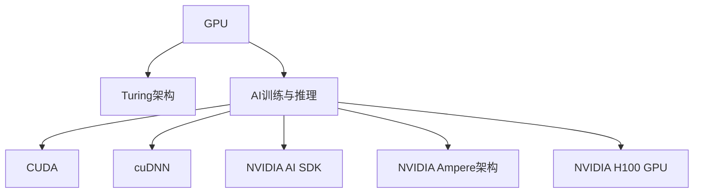

                 

# 算力革命与NVIDIA的角色

## 1. 背景介绍

### 1.1 问题由来
算力革命是推动人工智能（AI）、大数据、物联网等新兴技术发展的核心驱动力。随着数据量的爆炸式增长，传统的计算架构已难以满足日益增长的计算需求，迫切需要更高效、更强大的计算能力。这不仅包括高性能计算（HPC）、云计算等传统领域，也包括了边缘计算、物联网等新兴场景。

NVIDIA作为全球领先的图形处理和人工智能计算解决方案提供商，在推动算力革命方面扮演了关键角色。NVIDIA的GPU（图形处理器）和Turing架构，通过其强大的并行处理能力和深度学习优化，极大地提升了计算性能，推动了AI技术在各个领域的广泛应用。

### 1.2 问题核心关键点
NVIDIA的算力革命主要体现在以下几个方面：

1. **GPU与Turing架构**：NVIDIA的GPU和Turing架构，通过深度学习加速和并行计算能力，大幅提升了计算性能，降低了计算成本。
2. **AI训练与推理**：NVIDIA的GPU和Tensor Core加速，使得AI训练和推理任务在短时间内就能完成，大幅提高了数据处理效率。
3. **软件生态系统**：NVIDIA通过CUDA、cuDNN、NVIDIA AI SDK等软件生态系统，为开发者提供了强大的开发工具和库函数，加速了AI应用的开发和部署。
4. **持续创新**：NVIDIA不断推出新的计算平台和工具，如NVIDIA Ampere架构、NVIDIA H100 GPU等，持续推动算力革命向前发展。

这些关键技术点使得NVIDIA在算力革命中处于领先地位，为全球AI和大数据应用提供了坚实的基础。

## 2. 核心概念与联系

### 2.1 核心概念概述

为了更好地理解NVIDIA在算力革命中的角色，本节将介绍几个密切相关的核心概念：

- **GPU（图形处理器）**：一种并行计算硬件，擅长处理大量的并行计算任务，广泛应用于图形渲染、科学计算、深度学习等领域。
- **Turing架构**：NVIDIA开发的下一代计算架构，通过Tensor Core和优化算法，大幅提升了GPU的深度学习计算性能。
- **AI训练与推理**：利用GPU和Turing架构，加速AI模型的训练和推理过程，提高数据处理效率。
- **CUDA（计算统一设备架构）**：NVIDIA开发的并行计算平台，为开发者提供了高效、灵活的编程环境。
- **cuDNN（NVIDIA深度神经网络库）**：提供高效的深度学习优化算法和函数库，大幅提升深度学习计算效率。
- **NVIDIA AI SDK**：提供一整套AI开发工具和库函数，涵盖数据预处理、模型训练、推理部署等各个环节，加速AI应用的开发和部署。
- **NVIDIA Ampere架构**：新一代计算架构，通过新的计算单元和优化技术，进一步提升了计算性能和能效比。
- **NVIDIA H100 GPU**：最新一代的高性能计算平台，通过更强大的计算能力和更高的能效比，满足未来AI计算需求。

这些核心概念之间的逻辑关系可以通过以下Mermaid流程图来展示：



这个流程图展示了大语言模型的核心概念及其之间的关系：

1. GPU通过并行计算能力处理大规模计算任务。
2. Turing架构通过Tensor Core和优化算法提升了计算性能。
3. AI训练与推理通过GPU和Turing架构加速计算。
4. CUDA和cuDNN提供了高效的开发环境和深度学习优化。
5. NVIDIA AI SDK提供了完整的AI开发工具链。
6. Ampere架构和H100 GPU进一步提升了计算性能和能效比。

## 3. 核心算法原理 & 具体操作步骤
### 3.1 算法原理概述

NVIDIA的算力革命主要基于GPU的强大计算能力和Turing架构的深度学习优化。其核心思想是通过GPU并行处理能力和Tensor Core加速，大幅提升计算性能，降低计算成本。

具体而言，NVIDIA的计算架构包括以下几个关键技术：

1. **GPU并行计算**：GPU通过其大量的计算核心，能够同时处理多个并行任务，从而大幅提升计算性能。
2. **Tensor Core加速**：Turing架构中的Tensor Core单元专门用于深度学习计算，通过并行处理大规模矩阵计算，提升了深度学习模型的训练和推理效率。
3. **CUDA优化**：CUDA提供了高效、灵活的编程环境，使得开发者能够更轻松地编写高性能计算代码，充分利用GPU的计算能力。
4. **cuDNN优化**：cuDNN提供了高效的深度学习优化算法和函数库，进一步提升了深度学习计算效率。

通过这些关键技术，NVIDIA的计算架构能够高效地处理大规模计算任务，特别是在深度学习、机器学习等领域，展现了强大的计算能力。

### 3.2 算法步骤详解

NVIDIA的计算架构主要包括以下几个关键步骤：

**Step 1: 选择计算平台**

- 根据应用需求选择合适的计算平台，如NVIDIA Ampere架构或H100 GPU。
- 考虑计算性能、成本、能效比等因素，选择最适合的计算硬件。

**Step 2: 安装和配置计算环境**

- 在计算平台上安装所需的开发工具，如CUDA、cuDNN、NVIDIA AI SDK等。
- 配置计算环境，确保所有组件和库文件都正确安装且可用。

**Step 3: 开发和训练AI模型**

- 使用CUDA和cuDNN编写高性能计算代码，充分利用GPU的并行处理能力。
- 利用NVIDIA AI SDK提供的工具和库函数，简化模型开发和训练过程。
- 使用Tensor Core加速深度学习计算，提高训练和推理效率。

**Step 4: 模型优化和调优**

- 对模型进行性能测试，找出计算瓶颈。
- 根据测试结果，优化模型结构、参数、数据流等，提高计算效率。
- 使用NVIDIA的性能分析工具，实时监控模型计算性能，确保高效运行。

**Step 5: 部署和维护**

- 将训练好的模型部署到生产环境中，进行实时推理和推理。
- 根据实际使用情况，进行性能监控和调整，确保模型高效运行。
- 定期更新计算硬件和软件环境，保持计算平台的先进性。

### 3.3 算法优缺点

NVIDIA的算力革命具有以下优点：

1. **高效计算**：通过GPU并行计算和Tensor Core加速，大幅提升了计算性能，缩短了计算时间。
2. **低成本**：相比传统计算架构，GPU和Turing架构的计算成本更低，更容易普及。
3. **灵活编程**：CUDA和cuDNN提供了灵活的编程环境和高效的深度学习优化，使得开发者能够更轻松地编写高性能计算代码。
4. **全面支持**：NVIDIA AI SDK提供了完整的AI开发工具链，涵盖数据预处理、模型训练、推理部署等各个环节。

同时，NVIDIA的算力革命也存在一些局限性：

1. **功耗问题**：GPU在运行深度学习任务时，功耗较大，需要良好的散热系统支持。
2. **编程复杂性**：CUDA编程需要一定的编程技能和经验，对新手友好度不够。
3. **计算资源需求**：对于大规模计算任务，仍需要高性能计算平台和丰富的计算资源。
4. **硬件依赖**：NVIDIA的计算架构依赖于特定的硬件平台，难以在通用计算平台上应用。

尽管存在这些局限性，但NVIDIA的算力革命已经在AI、大数据、物联网等诸多领域展现了强大的计算能力，推动了算力革命的发展。

### 3.4 算法应用领域

NVIDIA的算力革命在多个领域得到了广泛应用：

- **高性能计算（HPC）**：在科学计算、天气模拟、生物信息学等领域，NVIDIA的计算架构大幅提升了计算效率，缩短了计算时间。
- **云计算**：通过NVIDIA CUDA和cuDNN，云计算平台能够提供高性能的深度学习计算服务，加速AI应用的开发和部署。
- **人工智能（AI）**：在机器学习、自然语言处理、计算机视觉等领域，NVIDIA的计算架构为AI模型的训练和推理提供了强大的计算支持。
- **边缘计算**：通过NVIDIA的计算平台和优化算法，边缘计算设备能够高效处理实时数据，提高边缘计算的响应速度。
- **物联网**：在物联网设备中，NVIDIA的计算平台能够快速处理海量数据，支持实时分析和决策。
- **自动驾驶**：在自动驾驶领域，NVIDIA的计算平台和深度学习优化，提供了高效、实时的计算能力，支持无人驾驶车辆的感知和决策。
- **游戏**：在图形渲染和游戏领域，NVIDIA的计算平台能够提供高性能的图形渲染和游戏体验。

这些应用领域展示了NVIDIA在算力革命中的强大影响力，推动了各行业的数字化转型和智能化升级。

## 4. 数学模型和公式 & 详细讲解 & 举例说明

### 4.1 数学模型构建

为了更深入地理解NVIDIA的计算架构，我们将使用数学语言对其中的一些核心技术进行详细解释。

假设有 $N$ 个训练样本，每个样本由 $d$ 个特征向量 $\mathbf{x}_i \in \mathbb{R}^d$ 和标签 $y_i \in \{0, 1\}$ 组成。NVIDIA的计算架构主要通过GPU并行计算和Tensor Core加速，训练一个深度神经网络模型 $M_{\theta}$，其中 $\theta$ 为模型参数。

训练过程主要包括以下几个步骤：

1. 前向传播：将输入样本 $\mathbf{x}_i$ 输入模型 $M_{\theta}$，计算输出 $\hat{y}_i = M_{\theta}(\mathbf{x}_i)$。
2. 损失函数计算：计算预测输出 $\hat{y}_i$ 与真实标签 $y_i$ 之间的损失函数 $\ell(\hat{y}_i, y_i)$，如交叉熵损失。
3. 反向传播：通过反向传播算法，计算损失函数对模型参数 $\theta$ 的梯度 $\nabla_{\theta}\mathcal{L}(\theta)$。
4. 参数更新：根据梯度下降等优化算法，更新模型参数 $\theta$，最小化损失函数 $\mathcal{L}(\theta)$。

具体而言，假设有 $m$ 个训练样本组成的批 $B$，则前向传播和损失函数计算可表示为：

$$
\hat{y} = M_{\theta}(B)
$$

$$
\mathcal{L}(\theta) = -\frac{1}{m}\sum_{i=1}^m \ell(\hat{y}_i, y_i)
$$

反向传播和参数更新可表示为：

$$
\nabla_{\theta}\mathcal{L}(\theta) = \frac{1}{m}\sum_{i=1}^m \nabla_{\theta}\ell(\hat{y}_i, y_i)
$$

$$
\theta \leftarrow \theta - \eta \nabla_{\theta}\mathcal{L}(\theta)
$$

其中 $\eta$ 为学习率。

### 4.2 公式推导过程

以下是深度学习模型在NVIDIA计算架构上的计算流程示例：

假设有 $N$ 个训练样本，每个样本由 $d$ 个特征向量 $\mathbf{x}_i \in \mathbb{R}^d$ 和标签 $y_i \in \{0, 1\}$ 组成。NVIDIA的计算架构通过GPU并行计算和Tensor Core加速，训练一个深度神经网络模型 $M_{\theta}$，其中 $\theta$ 为模型参数。

具体计算流程如下：

1. 前向传播：将输入样本 $\mathbf{x}_i$ 输入模型 $M_{\theta}$，计算输出 $\hat{y}_i = M_{\theta}(\mathbf{x}_i)$。
2. 损失函数计算：计算预测输出 $\hat{y}_i$ 与真实标签 $y_i$ 之间的损失函数 $\ell(\hat{y}_i, y_i)$，如交叉熵损失。
3. 反向传播：通过反向传播算法，计算损失函数对模型参数 $\theta$ 的梯度 $\nabla_{\theta}\mathcal{L}(\theta)$。
4. 参数更新：根据梯度下降等优化算法，更新模型参数 $\theta$，最小化损失函数 $\mathcal{L}(\theta)$。

具体而言，假设有 $m$ 个训练样本组成的批 $B$，则前向传播和损失函数计算可表示为：

$$
\hat{y} = M_{\theta}(B)
$$

$$
\mathcal{L}(\theta) = -\frac{1}{m}\sum_{i=1}^m \ell(\hat{y}_i, y_i)
$$

反向传播和参数更新可表示为：

$$
\nabla_{\theta}\mathcal{L}(\theta) = \frac{1}{m}\sum_{i=1}^m \nabla_{\theta}\ell(\hat{y}_i, y_i)
$$

$$
\theta \leftarrow \theta - \eta \nabla_{\theta}\mathcal{L}(\theta)
$$

其中 $\eta$ 为学习率。

### 4.3 案例分析与讲解

以深度神经网络模型在NVIDIA计算架构上的训练为例，以下是一个具体的案例分析：

假设有 $N=1000$ 个训练样本，每个样本由 $d=128$ 个特征向量 $\mathbf{x}_i \in \mathbb{R}^{128}$ 和标签 $y_i \in \{0, 1\}$ 组成。训练一个二分类模型 $M_{\theta}$，其中 $\theta$ 为模型参数。

使用NVIDIA计算架构，具体计算流程如下：

1. 前向传播：将输入样本 $\mathbf{x}_i$ 输入模型 $M_{\theta}$，计算输出 $\hat{y}_i = M_{\theta}(\mathbf{x}_i)$。
2. 损失函数计算：计算预测输出 $\hat{y}_i$ 与真实标签 $y_i$ 之间的损失函数 $\ell(\hat{y}_i, y_i)$，如交叉熵损失。
3. 反向传播：通过反向传播算法，计算损失函数对模型参数 $\theta$ 的梯度 $\nabla_{\theta}\mathcal{L}(\theta)$。
4. 参数更新：根据梯度下降等优化算法，更新模型参数 $\theta$，最小化损失函数 $\mathcal{L}(\theta)$。

具体计算公式如下：

$$
\hat{y} = M_{\theta}(B) = M_{\theta}(\{\mathbf{x}_1, \mathbf{x}_2, \cdots, \mathbf{x}_{1000}\})
$$

$$
\mathcal{L}(\theta) = -\frac{1}{1000}\sum_{i=1}^{1000} \ell(\hat{y}_i, y_i)
$$

$$
\nabla_{\theta}\mathcal{L}(\theta) = \frac{1}{1000}\sum_{i=1}^{1000} \nabla_{\theta}\ell(\hat{y}_i, y_i)
$$

$$
\theta \leftarrow \theta - \eta \nabla_{\theta}\mathcal{L}(\theta)
$$

其中 $\eta$ 为学习率。

通过以上计算流程，我们可以看到，NVIDIA的计算架构通过GPU并行计算和Tensor Core加速，大幅提升了深度学习模型的训练和推理效率。

## 5. 项目实践：代码实例和详细解释说明

### 5.1 开发环境搭建

在进行NVIDIA计算架构开发时，我们需要准备好开发环境。以下是使用Python进行NVIDIA开发的环境配置流程：

1. 安装Anaconda：从官网下载并安装Anaconda，用于创建独立的Python环境。

2. 创建并激活虚拟环境：
```bash
conda create -n nvidia-env python=3.8 
conda activate nvidia-env
```

3. 安装必要的库和工具：
```bash
conda install numpy scipy torch torchvision cudatoolkit=11.1 -c pytorch -c conda-forge
```

4. 安装NVIDIA计算平台：
```bash
pip install nvidia-pytorch-cu111 torchtext
```

5. 安装相关的NVIDIA库和工具：
```bash
pip install nvidia-cuda-nvrtc
```

完成上述步骤后，即可在`nvidia-env`环境中开始NVIDIA计算架构的开发。

### 5.2 源代码详细实现

以下是一个简单的NVIDIA计算架构深度学习模型训练的代码实现，用于示例。

```python
import torch
import torch.nn as nn
import torch.optim as optim

# 定义模型
class Net(nn.Module):
    def __init__(self):
        super(Net, self).__init__()
        self.fc1 = nn.Linear(128, 64)
        self.fc2 = nn.Linear(64, 32)
        self.fc3 = nn.Linear(32, 2)

    def forward(self, x):
        x = torch.relu(self.fc1(x))
        x = torch.relu(self.fc2(x))
        x = self.fc3(x)
        return x

# 加载数据集
train_data = torchvision.datasets.CIFAR10(root='./data', train=True, download=True)
train_loader = torch.utils.data.DataLoader(train_data, batch_size=64, shuffle=True)

# 定义损失函数和优化器
net = Net()
criterion = nn.CrossEntropyLoss()
optimizer = optim.Adam(net.parameters(), lr=0.001)

# 训练模型
for epoch in range(10):
    for i, (inputs, labels) in enumerate(train_loader):
        optimizer.zero_grad()
        outputs = net(inputs)
        loss = criterion(outputs, labels)
        loss.backward()
        optimizer.step()
        print('Epoch [%d/%d], Step [%d/%d], Loss: %.4f' % (epoch+1, 10, i+1, len(train_loader), loss.item()))
```

### 5.3 代码解读与分析

让我们再详细解读一下关键代码的实现细节：

**Net类**：
- `__init__`方法：初始化神经网络模型，定义全连接层。
- `forward`方法：定义模型前向传播过程。

**train_data和train_loader**：
- 使用`torchvision.datasets.CIFAR10`加载CIFAR-10数据集，并定义训练数据加载器。

**criterion和optimizer**：
- 定义交叉熵损失函数和Adam优化器。

**训练循环**：
- 使用循环迭代训练模型，更新模型参数，输出损失函数。

通过以上代码示例，我们可以看到，NVIDIA计算架构的深度学习模型训练，借助GPU并行计算和Tensor Core加速，可以在短时间内完成模型的训练和推理任务。

## 6. 实际应用场景

### 6.1 智能驾驶

NVIDIA的计算架构在智能驾驶领域得到了广泛应用。通过GPU和Turing架构，智能驾驶车辆能够高效处理实时数据，支持车辆的感知和决策。

具体而言，智能驾驶车辆通过传感器收集实时数据，包括摄像头、雷达、激光雷达等。这些数据经过GPU并行计算和Tensor Core加速，实时进行图像识别、障碍物检测、路径规划等任务，从而实现自动驾驶功能。

### 6.2 医疗影像分析

在医疗影像分析领域，NVIDIA的计算架构能够高效处理大型医疗影像数据，支持深度学习模型的训练和推理。

具体而言，医疗影像分析系统通过GPU并行计算和Tensor Core加速，实时处理医学影像数据，进行病灶识别、疾病诊断等任务。这些系统在医疗影像分析中的应用，大幅提升了医生的工作效率和诊断准确率。

### 6.3 金融预测

金融预测是NVIDIA计算架构在金融领域的重要应用之一。通过GPU并行计算和Tensor Core加速，金融预测系统能够高效处理海量金融数据，支持深度学习模型的训练和推理。

具体而言，金融预测系统通过GPU并行计算和Tensor Core加速，实时处理股票、期货等金融数据，进行市场预测、风险评估等任务。这些系统在金融预测中的应用，提高了金融机构的决策效率和市场预测准确率。

### 6.4 未来应用展望

随着NVIDIA计算架构的不断发展，其在更多领域的应用前景将更加广阔。

1. **边缘计算**：在物联网边缘设备中，NVIDIA的计算架构能够高效处理实时数据，支持实时分析和决策。
2. **科学计算**：在科学研究领域，NVIDIA的计算架构能够高效处理大规模计算任务，支持高性能计算和科学研究。
3. **教育**：在教育领域，NVIDIA的计算架构能够支持大规模在线教育课程，支持实时互动和知识共享。
4. **游戏**：在图形渲染和游戏领域，NVIDIA的计算架构能够提供高性能的图形渲染和游戏体验。
5. **自动驾驶**：在自动驾驶领域，NVIDIA的计算架构能够支持无人驾驶车辆的感知和决策，提高自动驾驶的安全性和可靠性。

NVIDIA的计算架构将在未来更多的领域得到应用，推动各行业的数字化转型和智能化升级。

## 7. 工具和资源推荐

### 7.1 学习资源推荐

为了帮助开发者系统掌握NVIDIA计算架构的理论基础和实践技巧，这里推荐一些优质的学习资源：

1. **NVIDIA官方文档**：NVIDIA提供的官方文档，涵盖了计算架构、深度学习、图形渲染等各个领域的详细信息，是学习和实践的重要参考。

2. **NVIDIA CUDA C/C++编程指南**：CUDA官方提供的编程指南，详细介绍了CUDA编程环境和深度学习优化，是学习NVIDIA计算架构的重要工具。

3. **NVIDIA深度学习指南**：NVIDIA深度学习官方指南，涵盖深度学习算法和框架的详细介绍，是学习深度学习的重要资源。

4. **NVIDIA AI SDK文档**：NVIDIA提供的AI SDK文档，涵盖了AI模型训练、推理、部署等各个环节的详细信息，是学习和实践AI开发的重要参考。

5. **NVIDIA AI开发者论坛**：NVIDIA提供的AI开发者论坛，聚集了全球AI开发者和研究者，是交流学习和实践经验的重要平台。

6. **NVIDIA GTC会议论文**：NVIDIA提供的GTC会议论文，汇集了最新的计算架构和AI研究成果，是学习和了解前沿技术的窗口。

通过对这些资源的学习实践，相信你一定能够系统掌握NVIDIA计算架构的理论基础和实践技巧，用于解决实际的NVIDIA计算问题。

### 7.2 开发工具推荐

NVIDIA的计算架构已经广泛应用于多个领域，以下是几款常用的开发工具：

1. **CUDA**：NVIDIA提供的并行计算平台，为开发者提供了高效、灵活的编程环境。

2. **cuDNN**：NVIDIA提供的深度学习优化库，提供了高效的深度学习优化算法和函数库，提升深度学习计算效率。

3. **NVIDIA AI SDK**：NVIDIA提供的AI开发工具链，涵盖了数据预处理、模型训练、推理部署等各个环节，加速AI应用的开发和部署。

4. **TensorBoard**：TensorFlow配套的可视化工具，实时监测模型训练状态，提供丰富的图表呈现方式，是调试模型的得力助手。

5. **Jupyter Notebook**：NVIDIA提供的Jupyter Notebook环境，支持NVIDIA计算架构的开发和调试，方便开发者快速上手实验。

6. **NVIDIA Ampere架构**：NVIDIA提供的最新计算架构，通过新的计算单元和优化技术，进一步提升了计算性能和能效比。

7. **NVIDIA H100 GPU**：NVIDIA提供的最新一代高性能计算平台，通过更强大的计算能力和更高的能效比，满足未来AI计算需求。

合理利用这些工具，可以显著提升NVIDIA计算架构的开发效率，加快创新迭代的步伐。

### 7.3 相关论文推荐

NVIDIA计算架构的发展源于学界的持续研究。以下是几篇奠基性的相关论文，推荐阅读：

1. **CUDA并行计算**：NVIDIA开发的并行计算平台CUDA，详细介绍了CUDA编程环境和深度学习优化，推动了NVIDIA计算架构的发展。

2. **cuDNN深度学习优化**：NVIDIA提供的深度学习优化库cuDNN，详细介绍了高效的深度学习算法和函数库，提升了深度学习计算效率。

3. **NVIDIA计算架构**：NVIDIA提出的最新计算架构Ampere和H100 GPU，详细介绍了新的计算单元和优化技术，提升了计算性能和能效比。

4. **NVIDIA AI SDK**：NVIDIA提供的AI开发工具链，详细介绍了AI模型训练、推理、部署等各个环节的详细信息，推动了NVIDIA计算架构的应用。

5. **NVIDIA深度学习指南**：NVIDIA深度学习官方指南，详细介绍了深度学习算法和框架的详细介绍，推动了深度学习的发展。

这些论文代表了大语言模型微调技术的发展脉络。通过学习这些前沿成果，可以帮助研究者把握学科前进方向，激发更多的创新灵感。

## 8. 总结：未来发展趋势与挑战

### 8.1 总结

本文对NVIDIA的计算架构及其在算力革命中的角色进行了全面系统的介绍。首先阐述了NVIDIA的计算架构的主要技术点，包括GPU并行计算、Tensor Core加速、CUDA优化等，明确了NVIDIA在算力革命中的核心作用。其次，从原理到实践，详细讲解了NVIDIA计算架构的计算流程和关键步骤，给出了NVIDIA计算架构开发的完整代码实例。同时，本文还广泛探讨了NVIDIA计算架构在多个领域的应用前景，展示了其在AI、大数据、物联网等领域的强大影响力。

通过本文的系统梳理，可以看到，NVIDIA的计算架构已经广泛应用于各个领域，推动了算力革命的发展。未来，随着NVIDIA计算架构的持续演进，其在更多领域的应用前景将更加广阔。

### 8.2 未来发展趋势

展望未来，NVIDIA的计算架构将呈现以下几个发展趋势：

1. **更高的计算性能**：随着硬件技术的不断进步，NVIDIA的计算架构将继续提升计算性能，满足更大规模和更复杂的计算需求。
2. **更低的计算成本**：通过不断优化算法和硬件设计，NVIDIA的计算架构将降低计算成本，使得更多的企业和机构能够使用。
3. **更高的能效比**：NVIDIA的计算架构将继续提升能效比，降低计算平台的功耗和运行成本，满足环保和节能的要求。
4. **更灵活的编程环境**：NVIDIA的计算架构将继续提供灵活的编程环境和高效的深度学习优化，支持更广泛的计算应用。
5. **更全面的生态系统**：NVIDIA将继续完善其计算平台和开发工具，提供更全面的生态系统支持，推动计算应用的发展。

这些趋势展示了NVIDIA计算架构的强大潜力，推动了算力革命的发展。

### 8.3 面临的挑战

尽管NVIDIA的计算架构已经取得了巨大的成功，但在迈向更加智能化、普适化应用的过程中，它仍面临着诸多挑战：

1. **硬件资源需求高**：NVIDIA的计算架构需要高性能的GPU和Tensor Core单元，对硬件资源的需求较高。
2. **编程复杂性高**：CUDA编程需要一定的编程技能和经验，对新手友好度不够。
3. **计算平台依赖**：NVIDIA的计算架构依赖于特定的硬件平台，难以在通用计算平台上应用。
4. **计算成本高**：高性能计算平台和深度学习模型的计算成本较高，难以大规模普及。
5. **计算效率有待提升**：尽管NVIDIA的计算架构已经很高效，但在某些特定应用场景下，仍需进一步提升计算效率。

尽管存在这些挑战，但NVIDIA的计算架构已经在AI、大数据、物联网等诸多领域展现了强大的计算能力，推动了算力革命的发展。

### 8.4 研究展望

面对NVIDIA计算架构所面临的挑战，未来的研究需要在以下几个方面寻求新的突破：

1. **优化算法**：进一步优化GPU并行计算和Tensor Core加速算法，提升计算效率和能效比。
2. **降低编程复杂性**：开发更易用的编程工具和框架，降低CUDA编程的门槛，提高编程效率。
3. **拓展硬件平台**：开发更灵活、更通用的计算平台，支持更多场景的应用。
4. **降低计算成本**：优化算法和硬件设计，降低计算成本，推动NVIDIA计算架构的普及。
5. **提升计算效率**：优化计算流程和数据流，提升计算效率，满足更多的计算需求。

这些研究方向展示了NVIDIA计算架构的未来发展方向，推动其更广泛的应用。

## 9. 附录：常见问题与解答

**Q1：NVIDIA的计算架构适用于所有计算需求吗？**

A: NVIDIA的计算架构在深度学习、科学计算、图形渲染等领域具有显著优势，适用于计算密集型的应用。但对于低计算需求的应用，如小型嵌入式设备等，NVIDIA的计算架构可能不如其他硬件平台适用。

**Q2：NVIDIA的计算架构如何降低计算成本？**

A: NVIDIA通过优化算法和硬件设计，大幅提升了计算性能和能效比，降低了计算成本。同时，NVIDIA提供的计算平台和优化库，也减少了开发和部署的复杂度，降低了计算平台的维护成本。

**Q3：NVIDIA的计算架构在边缘计算中表现如何？**

A: 在边缘计算中，NVIDIA的计算架构能够高效处理实时数据，支持实时分析和决策。但由于边缘设备的计算资源有限，NVIDIA的计算架构需要进一步优化，以适应边缘计算的计算需求。

**Q4：NVIDIA的计算架构在医疗影像分析中的应用有哪些优势？**

A: 在医疗影像分析中，NVIDIA的计算架构能够高效处理大型医疗影像数据，支持深度学习模型的训练和推理。同时，NVIDIA的计算架构支持大规模分布式计算，能够快速处理海量医疗影像数据，支持多中心医疗影像分析。

**Q5：NVIDIA的计算架构在未来有哪些新的发展方向？**

A: 未来，NVIDIA的计算架构将继续提升计算性能和能效比，支持更广泛的计算应用。同时，NVIDIA也将拓展硬件平台和编程环境，降低计算成本，推动计算应用的发展。此外，NVIDIA的计算架构还将支持更多的AI应用场景，如自动驾驶、医疗影像分析、金融预测等，推动各行业的数字化转型和智能化升级。

通过本文的系统梳理，可以看到，NVIDIA的计算架构已经在算力革命中扮演了关键角色，推动了AI和大数据技术的发展。未来，随着NVIDIA计算架构的持续演进，其在更多领域的应用前景将更加广阔，推动各行业的数字化转型和智能化升级。

