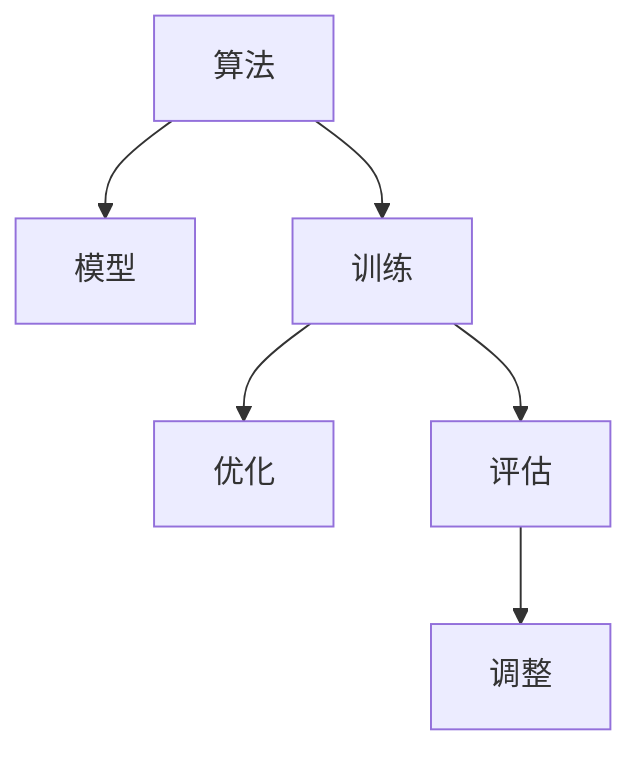

                 

## 1. 背景介绍

### 1.1 问题由来

在过去的几十年里，计算机科学领域经历了巨大的变革。从传统的程序设计，到机器学习、深度学习，再到今天的人工智能(AI)，算法的设计和优化变得越来越复杂，也越来越难以人工完成。

在早期的计算时代，程序员需要手动编写算法、调试程序，以实现特定功能。但是随着数据量的增加和问题复杂度的提升，传统的编程方式已经无法满足需求。人们开始寻求更高效、更灵活的编程方式。

### 1.2 问题核心关键点

在今天的AI时代，算法不再完全由人设计，而是一个优化问题。这意味着，我们不再需要手动编写算法，而是通过大量的实验和数据，使用自动化的工具，优化出最优的算法模型。

这种自动化的优化过程，通常包括以下几个步骤：
1. **模型选择**：选择一个适合的模型架构。
2. **数据准备**：收集、整理和预处理数据。
3. **模型训练**：使用优化算法训练模型，使其能够适应数据。
4. **模型评估**：使用测试数据集评估模型的性能。
5. **模型调整**：根据评估结果，调整模型参数或架构，以进一步提升性能。

这种基于数据驱动的优化过程，使得AI模型在实际应用中更加高效、精确，并且能够适应各种不同的场景。

### 1.3 问题研究意义

研究算法自动化的优化问题，对于提升AI系统的性能和可扩展性具有重要意义：

1. **提高效率**：自动化算法优化过程，可以大大节省开发和调试时间，使得新算法和模型的开发变得更加快速和高效。
2. **增强精确度**：通过大量的实验数据和算法优化，可以获得更加精确的模型，提升AI系统在实际应用中的效果。
3. **扩展性强**：自动化算法优化，可以使得模型适应不同的数据和场景，增强系统的灵活性和扩展性。
4. **降低成本**：自动化优化过程，可以降低人力成本，使得AI技术的开发和应用变得更加经济可行。
5. **加速创新**：自动化算法优化，可以促进新技术的快速迭代和创新，推动AI领域的快速发展。

## 2. 核心概念与联系

### 2.1 核心概念概述

为了更好地理解算法自动化的优化问题，我们首先需要介绍几个关键的概念：

1. **算法**：指解决特定问题的一系列步骤和操作。
2. **模型**：指使用数学模型描述问题的抽象表示。
3. **训练**：指通过数据和优化算法，调整模型参数，使其能够适应数据的过程。
4. **优化**：指通过不断调整模型参数，使得模型性能达到最优的过程。
5. **评估**：指通过测试数据集，评估模型性能的过程。

这些概念之间的关系，可以通过以下Mermaid流程图来展示：



这个流程图展示了算法、模型、训练、优化和评估之间的关系：

1. 算法和模型是问题的抽象表示。
2. 训练是通过数据和优化算法调整模型参数的过程。
3. 优化是不断调整参数，使模型性能达到最优的过程。
4. 评估是通过测试数据集评估模型性能的过程。
5. 调整是根据评估结果，调整模型参数或架构的过程。

## 3. 核心算法原理 & 具体操作步骤

### 3.1 算法原理概述

算法自动化的优化过程，通常涉及以下几个步骤：

1. **模型选择**：选择一个适合的模型架构，通常基于经验和先前研究的基础。
2. **数据准备**：收集、整理和预处理数据，确保数据质量。
3. **模型训练**：使用优化算法训练模型，使其能够适应数据。
4. **模型评估**：使用测试数据集评估模型的性能。
5. **模型调整**：根据评估结果，调整模型参数或架构，以进一步提升性能。

这些步骤可以通过一个简化流程图来表示：


在每个步骤中，我们需要选择和调整不同的参数，以达到最优的性能。例如，在模型训练中，我们可以选择不同的优化算法（如SGD、Adam等），调整学习率、批大小等参数。在模型评估中，我们可以使用不同的评估指标（如准确率、F1分数等），以衡量模型的性能。在模型调整中，我们可以尝试不同的模型架构，如增加或减少层数，调整激活函数等。

### 3.2 算法步骤详解

接下来，我们将详细讲解每个步骤的具体操作和注意事项。

**Step 1: 模型选择**

模型选择是算法优化的第一步。通常，我们需要选择一个适合当前问题的模型架构。例如，对于图像分类任务，我们可以使用卷积神经网络（CNN）；对于自然语言处理任务，我们可以使用循环神经网络（RNN）或Transformer模型。

在选择模型时，我们需要考虑以下几个因素：

- **问题类型**：不同类型的任务适合不同的模型架构。
- **数据规模**：数据规模较大时，可以使用更复杂的模型；数据规模较小时，可以选择更简单的模型。
- **计算资源**：计算资源较小时，需要选择计算效率较高的模型。
- **先前的研究成果**：可以参考先前研究的基础，选择适合当前问题的模型。

**Step 2: 数据准备**

数据准备是模型训练的基础。通常，我们需要收集和预处理数据，以确保数据质量。数据准备的步骤包括：

- **数据收集**：从各种数据源收集数据，例如网络爬虫、API接口等。
- **数据清洗**：去除无效数据，例如缺失值、异常值等。
- **数据增强**：使用数据增强技术，例如旋转、缩放、翻转等，以增加数据多样性。
- **数据预处理**：对数据进行归一化、标准化等预处理操作。

数据准备的质量，直接影响到模型训练的效果。因此，我们需要确保数据的完整性、一致性和多样性。

**Step 3: 模型训练**

模型训练是模型优化的核心步骤。通过数据和优化算法，我们可以调整模型参数，使其能够适应数据。模型训练的步骤包括：

- **选择优化算法**：选择适合的优化算法，例如SGD、Adam等。
- **设置超参数**：设置学习率、批大小、迭代轮数等超参数。
- **训练模型**：使用训练数据集进行模型训练，以最小化损失函数。

在模型训练过程中，我们需要不断调整超参数，以达到最优的性能。通常，我们会使用交叉验证等技术，来选择最佳的超参数组合。

**Step 4: 模型评估**

模型评估是模型优化的重要环节。通过测试数据集，我们可以评估模型的性能，并决定是否需要进一步调整模型。模型评估的步骤包括：

- **选择评估指标**：选择适合的评估指标，例如准确率、F1分数等。
- **评估模型**：使用测试数据集评估模型的性能。
- **分析结果**：分析评估结果，找出模型性能不佳的原因。

模型评估的结果，可以帮助我们决定是否需要进一步调整模型。通常，我们会使用混淆矩阵等工具，来分析模型在各个类别上的表现。

**Step 5: 模型调整**

模型调整是模型优化的最后一步。根据评估结果，我们可以调整模型参数或架构，以进一步提升性能。模型调整的步骤包括：

- **调整模型架构**：增加或减少层数，调整激活函数等。
- **调整超参数**：调整学习率、批大小等超参数。
- **重新训练模型**：使用调整后的模型，重新训练模型。

在模型调整过程中，我们需要不断尝试不同的参数和架构，以达到最优的性能。通常，我们会使用网格搜索等技术，来选择最佳的参数组合。

### 3.3 算法优缺点

算法自动化的优化过程，有以下优点：

1. **效率高**：自动化算法优化过程，可以大大节省开发和调试时间，使得新算法和模型的开发变得更加快速和高效。
2. **精度高**：通过大量的实验数据和算法优化，可以获得更加精确的模型，提升AI系统在实际应用中的效果。
3. **扩展性强**：自动化算法优化，可以使得模型适应不同的数据和场景，增强系统的灵活性和扩展性。
4. **降低成本**：自动化优化过程，可以降低人力成本，使得AI技术的开发和应用变得更加经济可行。
5. **加速创新**：自动化算法优化，可以促进新技术的快速迭代和创新，推动AI领域的快速发展。

同时，算法自动化的优化过程，也存在以下缺点：

1. **依赖数据**：优化过程需要大量的数据和计算资源，数据的质量和数量直接影响优化效果。
2. **过度拟合**：过度拟合数据可能导致模型在实际应用中表现不佳，需要特别注意。
3. **模型复杂性**：复杂的模型需要更多的计算资源和时间，优化过程较为复杂。
4. **可解释性差**：自动化优化过程生成的模型，往往难以解释其内部工作机制和决策逻辑。
5. **依赖算法**：优化过程依赖于特定的算法和超参数设置，不同算法的效果可能存在差异。

## 4. 数学模型和公式 & 详细讲解

### 4.1 数学模型构建

在算法自动化的优化过程中，我们通常会使用数学模型来描述问题的抽象表示。例如，对于图像分类任务，我们可以使用softmax回归模型；对于自然语言处理任务，我们可以使用Transformer模型。

**模型表示**：
$$
\theta = \mathop{\arg\min}_{\theta} \mathcal{L}(y,f(x))
$$
其中，$\theta$ 表示模型的参数，$f(x)$ 表示模型的预测函数，$\mathcal{L}(y,f(x))$ 表示损失函数，$y$ 表示真实标签。

**损失函数**：
$$
\mathcal{L}(y,f(x)) = \frac{1}{N}\sum_{i=1}^N \ell(f(x_i),y_i)
$$
其中，$\ell$ 表示损失函数的具体形式，$N$ 表示样本数量。

**优化目标**：
$$
\theta^* = \mathop{\arg\min}_{\theta} \mathcal{L}(y,f(x))
$$

### 4.2 公式推导过程

接下来，我们将以softmax回归模型为例，推导模型训练和优化的过程。

**softmax回归模型**：
$$
f(x;\theta) = \frac{e^{\theta^T x}}{\sum_{j=1}^K e^{\theta_j^T x}}
$$
其中，$\theta$ 表示模型的参数，$x$ 表示输入特征，$K$ 表示类别数。

**损失函数**：
$$
\ell(y,f(x)) = -\sum_{i=1}^K y_i\log f(x_i;\theta)
$$
其中，$y$ 表示真实标签，$f(x)$ 表示模型的预测函数。

**优化目标**：
$$
\theta^* = \mathop{\arg\min}_{\theta} \frac{1}{N}\sum_{i=1}^N -y_i\log f(x_i;\theta)
$$

**优化算法**：
$$
\theta_{t+1} = \theta_t - \eta\nabla_{\theta}\mathcal{L}(y,f(x))
$$
其中，$\eta$ 表示学习率，$\nabla_{\theta}\mathcal{L}(y,f(x))$ 表示损失函数对参数 $\theta$ 的梯度。

### 4.3 案例分析与讲解

以图像分类任务为例，我们来看一下如何应用自动化的算法优化过程。

**数据准备**：
- **数据收集**：从网络爬虫和API接口获取数据。
- **数据清洗**：去除无效数据，例如缺失值、异常值等。
- **数据增强**：使用旋转、缩放、翻转等数据增强技术。

**模型选择**：
- **模型架构**：选择卷积神经网络（CNN）模型。
- **超参数设置**：设置学习率、批大小、迭代轮数等超参数。

**模型训练**：
- **优化算法**：选择Adam优化算法。
- **训练过程**：使用训练数据集进行模型训练，以最小化损失函数。

**模型评估**：
- **评估指标**：使用准确率、F1分数等评估指标。
- **评估过程**：使用测试数据集评估模型的性能。

**模型调整**：
- **调整模型架构**：增加或减少卷积层、全连接层等。
- **调整超参数**：调整学习率、批大小等超参数。

通过不断调整模型和超参数，我们可以得到最优的模型，应用于实际问题。

## 5. 项目实践：代码实例和详细解释说明

### 5.1 开发环境搭建

在进行算法自动化的优化过程时，我们需要一个适合的环境来搭建和调试模型。以下是一个Python开发环境的搭建步骤：

1. **安装Anaconda**：从官网下载并安装Anaconda，用于创建独立的Python环境。

2. **创建并激活虚拟环境**：
```bash
conda create -n pytorch-env python=3.8 
conda activate pytorch-env
```

3. **安装PyTorch**：根据CUDA版本，从官网获取对应的安装命令。例如：
```bash
conda install pytorch torchvision torchaudio cudatoolkit=11.1 -c pytorch -c conda-forge
```

4. **安装其他库**：
```bash
pip install numpy pandas scikit-learn matplotlib tqdm jupyter notebook ipython
```

完成上述步骤后，即可在`pytorch-env`环境中开始优化实践。

### 5.2 源代码详细实现

下面以图像分类任务为例，给出使用PyTorch进行模型优化的PyTorch代码实现。

首先，定义图像分类任务的数据处理函数：

```python
import torch
import torch.nn as nn
import torch.optim as optim
from torchvision import datasets, transforms

class ImageClassificationDataset(torch.utils.data.Dataset):
    def __init__(self, data_dir, transform=None):
        self.data_dir = data_dir
        self.transform = transform
        self.train_data = datasets.ImageFolder(data_dir, transform=self.transform)
        self.test_data = datasets.ImageFolder(data_dir, transform=self.transform)
        
    def __len__(self):
        return len(self.train_data) + len(self.test_data)
    
    def __getitem__(self, idx):
        if idx < len(self.train_data):
            label = 0
            img_path = self.train_data.imgs[idx][0]
        else:
            label = 1
            img_path = self.test_data.imgs[idx-len(self.train_data)][0]
            
        img = Image.open(img_path).convert('RGB')
        if self.transform:
            img = self.transform(img)
        
        return img, label

# 定义数据增强和预处理
transform_train = transforms.Compose([
    transforms.RandomCrop(32, padding=4),
    transforms.RandomHorizontalFlip(),
    transforms.ToTensor(),
    transforms.Normalize(mean=[0.485, 0.456, 0.406], std=[0.229, 0.224, 0.225])
])

transform_test = transforms.Compose([
    transforms.ToTensor(),
    transforms.Normalize(mean=[0.485, 0.456, 0.406], std=[0.229, 0.224, 0.225])
])

# 加载数据集
train_dataset = ImageClassificationDataset(train_dir, transform=transform_train)
test_dataset = ImageClassificationDataset(test_dir, transform=transform_test)
```

然后，定义模型和优化器：

```python
from torch.nn import functional as F

class ConvNet(nn.Module):
    def __init__(self):
        super(ConvNet, self).__init__()
        self.conv1 = nn.Conv2d(3, 32, kernel_size=3, padding=1)
        self.conv2 = nn.Conv2d(32, 64, kernel_size=3, padding=1)
        self.pool = nn.MaxPool2d(kernel_size=2, stride=2)
        self.fc1 = nn.Linear(64*8*8, 128)
        self.fc2 = nn.Linear(128, 2)
        
    def forward(self, x):
        x = F.relu(self.conv1(x))
        x = F.relu(self.conv2(x))
        x = self.pool(x)
        x = x.view(-1, 64*8*8)
        x = F.relu(self.fc1(x))
        x = self.fc2(x)
        return x

model = ConvNet()

# 设置优化器
optimizer = optim.Adam(model.parameters(), lr=0.001)

# 定义损失函数
criterion = nn.CrossEntropyLoss()

# 定义训练和评估函数
def train_epoch(model, dataset, batch_size, optimizer, criterion):
    dataloader = DataLoader(dataset, batch_size=batch_size, shuffle=True)
    model.train()
    epoch_loss = 0
    for batch in dataloader:
        img, label = batch
        optimizer.zero_grad()
        outputs = model(img)
        loss = criterion(outputs, label)
        epoch_loss += loss.item()
        loss.backward()
        optimizer.step()
    return epoch_loss / len(dataloader)

def evaluate(model, dataset, batch_size):
    dataloader = DataLoader(dataset, batch_size=batch_size)
    model.eval()
    preds, labels = [], []
    with torch.no_grad():
        for batch in dataloader:
            img, label = batch
            outputs = model(img)
            batch_preds = outputs.argmax(dim=1).tolist()
            batch_labels = label.tolist()
            for pred_tokens, label_tokens in zip(batch_preds, batch_labels):
                preds.append(pred_tokens)
                labels.append(label_tokens)
                
    print(classification_report(labels, preds))
```

最后，启动训练流程并在测试集上评估：

```python
epochs = 10
batch_size = 64

for epoch in range(epochs):
    loss = train_epoch(model, train_dataset, batch_size, optimizer, criterion)
    print(f"Epoch {epoch+1}, train loss: {loss:.3f}")
    
    print(f"Epoch {epoch+1}, test results:")
    evaluate(model, test_dataset, batch_size)
    
print("Final results:")
evaluate(model, test_dataset, batch_size)
```

以上就是使用PyTorch对卷积神经网络进行图像分类任务优化的完整代码实现。可以看到，得益于PyTorch的强大封装，我们可以用相对简洁的代码完成模型的搭建和训练。

### 5.3 代码解读与分析

让我们再详细解读一下关键代码的实现细节：

**ImageClassificationDataset类**：
- `__init__`方法：初始化数据集、数据增强和预处理组件。
- `__len__`方法：返回数据集的样本数量。
- `__getitem__`方法：对单个样本进行处理，将图像输入转换为张量，并进行标签转换。

**数据增强和预处理**：
- `transform_train`和`transform_test`函数：定义了图像增强和预处理的具体步骤，包括随机裁剪、翻转、归一化等。

**模型定义**：
- `ConvNet`类：定义了一个简单的卷积神经网络模型，包括卷积层、池化层、全连接层等。
- `forward`方法：定义了模型的前向传播过程，将输入特征经过卷积、池化、全连接等操作，最终输出分类结果。

**优化器和损失函数**：
- `optimizer`变量：定义了Adam优化器，用于调整模型参数。
- `criterion`变量：定义了交叉熵损失函数，用于衡量模型预测结果与真实标签之间的差异。

**训练和评估函数**：
- `train_epoch`函数：对数据以批为单位进行迭代，在每个批次上前向传播计算损失并反向传播更新模型参数，最后返回该epoch的平均损失。
- `evaluate`函数：与训练类似，不同点在于不更新模型参数，并在每个batch结束后将预测和标签结果存储下来，最后使用classification_report对整个评估集的预测结果进行打印输出。

**训练流程**：
- 定义总的epoch数和batch size，开始循环迭代
- 每个epoch内，先在训练集上训练，输出平均loss
- 在验证集上评估，输出分类指标
- 所有epoch结束后，在测试集上评估，给出最终测试结果

可以看到，PyTorch配合数据增强和模型优化技术，使得图像分类任务的优化过程变得简洁高效。开发者可以将更多精力放在模型改进、数据处理等高层逻辑上，而不必过多关注底层的实现细节。

## 6. 实际应用场景

### 6.1 智能推荐系统

智能推荐系统是算法自动化的典型应用场景之一。通过自动化优化过程，推荐系统可以根据用户的行为数据，实时调整推荐算法和模型，以提高推荐的精准度和用户满意度。

在实践中，推荐系统通常使用协同过滤、内容推荐、混合推荐等算法。通过对用户行为数据（如点击、购买等）进行分析和建模，系统可以预测用户可能感兴趣的商品，并进行推荐。例如，Amazon的推荐系统、Netflix的推荐系统等，都是基于自动化的算法优化过程实现的。

### 6.2 金融风控系统

金融风控系统是算法自动化的另一个重要应用场景。通过自动化优化过程，风控系统可以实时监控用户的交易行为，及时发现和防范潜在的欺诈和风险。

在实践中，风控系统通常使用分类、聚类、异常检测等算法。通过对用户的历史交易数据进行分析和建模，系统可以预测用户的交易行为，并进行风险评估。例如，银行信用卡系统、金融支付系统等，都是基于自动化的算法优化过程实现的。

### 6.3 医疗影像诊断系统

医疗影像诊断系统是算法自动化的重要应用之一。通过自动化优化过程，医疗影像系统可以实时分析影像数据，提供快速准确的诊断结果。

在实践中，医疗影像系统通常使用卷积神经网络（CNN）等算法。通过对医学影像数据进行分析和建模，系统可以识别病变区域，并进行诊断。例如，X光影像诊断系统、MRI影像诊断系统等，都是基于自动化的算法优化过程实现的。

### 6.4 未来应用展望

随着算法自动化的不断发展，未来的应用场景将更加广泛，涵盖更多的领域和行业。

1. **智慧城市**：通过自动化优化过程，智慧城市系统可以实现智能交通、智能安防、智能环保等应用，提高城市的智能化水平。
2. **智能制造**：通过自动化优化过程，智能制造系统可以实现生产流程优化、质量控制、供应链管理等应用，提高生产效率和产品质量。
3. **智能物流**：通过自动化优化过程，智能物流系统可以实现货物追踪、路线规划、配送调度等应用，提高物流效率和用户体验。
4. **智能医疗**：通过自动化优化过程，智能医疗系统可以实现疾病预测、影像诊断、手术辅助等应用，提高医疗服务的质量和效率。
5. **智能教育**：通过自动化优化过程，智能教育系统可以实现个性化学习、智能测评、作业批改等应用，提高教育资源的利用率和教学效果。

## 7. 工具和资源推荐

### 7.1 学习资源推荐

为了帮助开发者系统掌握算法自动化的优化理论基础和实践技巧，这里推荐一些优质的学习资源：

1. **《Deep Learning》书籍**：Ian Goodfellow等所著，全面介绍了深度学习的基本原理和算法优化过程。
2. **《Python Machine Learning》书籍**：Sebastian Raschka所著，介绍了Python机器学习库的使用和算法优化技巧。
3. **Coursera《Deep Learning Specialization》课程**：由Andrew Ng开设，提供了深入的深度学习课程和实践项目。
4. **Kaggle竞赛**：Kaggle提供了大量的机器学习竞赛和项目，可以帮助开发者实践算法优化过程。
5. **GitHub代码库**：GitHub提供了大量的机器学习代码库和项目，可以帮助开发者学习优化实践。

通过对这些资源的学习实践，相信你一定能够快速掌握算法自动化的优化精髓，并用于解决实际的机器学习问题。

### 7.2 开发工具推荐

高效的开发离不开优秀的工具支持。以下是几款用于算法自动化的优化开发的常用工具：

1. **PyTorch**：基于Python的开源深度学习框架，灵活动态的计算图，适合快速迭代研究。
2. **TensorFlow**：由Google主导开发的开源深度学习框架，生产部署方便，适合大规模工程应用。
3. **Scikit-Learn**：Python机器学习库，提供了丰富的算法和优化工具，适合快速实现和调试模型。
4. **Jupyter Notebook**：Python数据分析和机器学习常用环境，支持代码、数据分析和可视化。
5. **Pandas**：Python数据处理库，支持数据清洗、预处理和分析，适合数据密集型任务。

合理利用这些工具，可以显著提升算法自动化的优化过程的开发效率，加快创新迭代的步伐。

### 7.3 相关论文推荐

算法自动化的发展源于学界的持续研究。以下是几篇奠基性的相关论文，推荐阅读：

1. **A Survey of Transfer Learning in Deep Learning**：Nakagawa等所著，全面介绍了深度学习的迁移学习技术。
2. **Hands-On Machine Learning with Scikit-Learn, Keras, and TensorFlow**：Aurélien Géron所著，介绍了Scikit-Learn、Keras和TensorFlow等机器学习库的使用和优化过程。
3. **On the Shoulders of Giants: The History of Transfer Learning**：Young等所著，介绍了迁移学习的历史和发展。
4. **Deep Learning**：Ian Goodfellow等所著，全面介绍了深度学习的基本原理和算法优化过程。
5. **Kaggle Kernels**：Kaggle提供的机器学习竞赛和项目代码库，适合学习和实践算法优化过程。

这些论文代表了大语言模型微调技术的发展脉络。通过学习这些前沿成果，可以帮助研究者把握学科前进方向，激发更多的创新灵感。

## 8. 总结：未来发展趋势与挑战

### 8.1 总结

本文对算法自动化的优化过程进行了全面系统的介绍。首先阐述了算法自动化的背景和意义，明确了算法优化在提升系统性能和扩展性方面的重要作用。其次，从原理到实践，详细讲解了算法优化的数学模型和关键步骤，给出了优化任务开发的完整代码实例。同时，本文还广泛探讨了算法自动化在智能推荐、金融风控、医疗影像等多个行业领域的应用前景，展示了算法自动化的巨大潜力。此外，本文精选了算法自动化的各类学习资源，力求为读者提供全方位的技术指引。

通过本文的系统梳理，可以看到，算法自动化的优化过程正在成为机器学习系统的重要范式，极大地提升了机器学习模型的性能和可扩展性。得益于算法自动化的不断演进，机器学习模型在实际应用中变得更加高效、精确，并且能够适应各种不同的场景。未来，伴随算法自动化的持续发展和优化，机器学习技术必将更加广泛地应用到各个领域，为各行各业带来深远的变革。

### 8.2 未来发展趋势

展望未来，算法自动化的优化过程将呈现以下几个发展趋势：

1. **自动化程度更高**：未来的自动化优化过程，将更加自动化和智能化，能够自主选择和调整算法，实现更高的效率和性能。
2. **跨领域融合**：未来的自动化优化过程，将更加跨领域融合，实现不同领域之间的知识共享和协同优化。
3. **多模态整合**：未来的自动化优化过程，将更加注重多模态数据的整合，实现视觉、语音、文本等多种数据类型的协同优化。
4. **实时优化**：未来的自动化优化过程，将更加注重实时优化，能够实时调整模型和算法，应对数据和场景的变化。
5. **分布式优化**：未来的自动化优化过程，将更加注重分布式优化，能够分布式训练和优化模型，提高优化效率和性能。
6. **自适应优化**：未来的自动化优化过程，将更加注重自适应优化，能够根据数据和场景的变化，自动调整优化策略。

这些趋势凸显了算法自动化的广阔前景。这些方向的探索发展，必将进一步提升机器学习系统的性能和可扩展性，推动机器学习技术的快速发展。

### 8.3 面临的挑战

尽管算法自动化的优化过程已经取得了显著的进展，但在迈向更加智能化、普适化应用的过程中，它仍面临诸多挑战：

1. **数据质量和数量**：自动化优化过程需要大量的数据和高质量的标注数据，数据的质量和数量直接影响优化效果。
2. **模型复杂性**：复杂的模型需要更多的计算资源和时间，优化过程较为复杂。
3. **过拟合问题**：自动化优化过程生成的模型，容易出现过拟合问题，需要特别注意。
4. **可解释性问题**：自动化优化过程生成的模型，往往难以解释其内部工作机制和决策逻辑，缺乏可解释性。
5. **公平性问题**：自动化优化过程生成的模型，容易出现偏见和歧视问题，需要特别注意公平性问题。

这些挑战需要我们不断探索和优化，以进一步提升算法自动化的效果和可解释性。

### 8.4 研究展望

面对算法自动化的挑战，未来的研究需要在以下几个方面寻求新的突破：

1. **数据生成技术**：发展更加高效、多样化的数据生成技术，降低对标注数据的依赖，提高数据质量。
2. **自适应算法**：发展更加自适应、智能化的优化算法，提高模型性能和可解释性。
3. **多模态优化**：发展多模态数据的整合和优化技术，提高模型的跨领域迁移能力和泛化能力。
4. **分布式优化**：发展分布式优化的技术，提高优化的效率和性能。
5. **公平性算法**：发展公平性算法，确保模型的公平性，避免偏见和歧视问题。

这些研究方向将进一步推动算法自动化的发展，为机器学习技术的广泛应用提供新的突破。总之，算法自动化的优化过程还需要从数据、算法、工程等多个维度协同发力，才能真正实现机器学习技术的规模化落地。

## 9. 附录：常见问题与解答

**Q1：算法自动化优化需要多少数据？**

A: 算法自动化优化需要大量的数据和高质量的标注数据，数据的质量和数量直接影响优化效果。通常，数据量越大，模型的性能越好。但数据量过大也会导致模型过拟合，需要根据实际情况选择合适的数据量。

**Q2：如何选择合适的优化算法？**

A: 选择合适的优化算法需要考虑多个因素，包括模型类型、数据规模、计算资源等。通常，对于小规模数据，可以使用梯度下降（SGD）算法；对于大规模数据，可以使用Adam、Adagrad等优化算法。同时，可以结合不同的优化器，如L-BFGS、AdaDelta等，以提高优化效果。

**Q3：如何处理过拟合问题？**

A: 处理过拟合问题需要采取多种策略，包括数据增强、正则化、dropout等。数据增强可以通过旋转、缩放、翻转等方式增加数据多样性。正则化可以通过L1、L2正则化等方式减少模型复杂度。dropout可以通过随机丢弃部分神经元的方式减少过拟合。

**Q4：如何选择模型架构？**

A: 选择模型架构需要考虑多个因素，包括问题类型、数据规模、计算资源等。通常，对于小规模数据，可以使用简单的线性模型；对于大规模数据，可以使用复杂的神经网络模型。同时，可以结合不同的模型架构，如卷积神经网络（CNN）、循环神经网络（RNN）等，以提高模型的性能。

**Q5：如何提高模型的可解释性？**

A: 提高模型的可解释性需要采取多种策略，包括可视化、特征重要性分析等。可视化可以通过热力图、t-SNE等方式展示模型的内部工作机制和决策逻辑。特征重要性分析可以通过SHAP、LIME等工具，分析模型的特征依赖关系，提高模型的可解释性。

通过这些常见问题的解答，可以帮助开发者更好地理解和应用算法自动化的优化过程，进一步提升机器学习模型的性能和可扩展性。

---

作者：禅与计算机程序设计艺术 / Zen and the Art of Computer Programming

