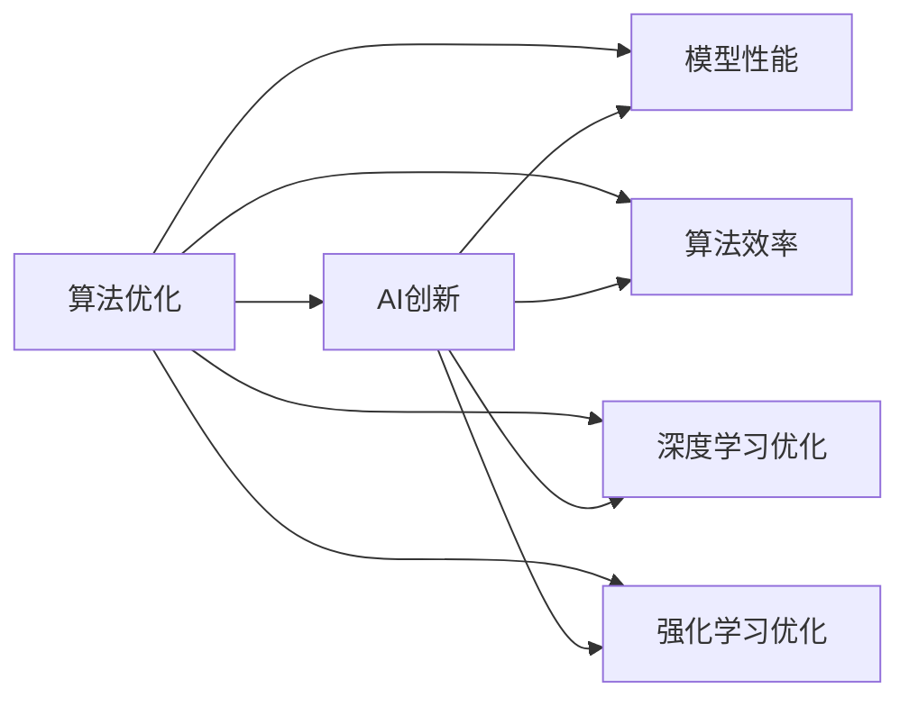
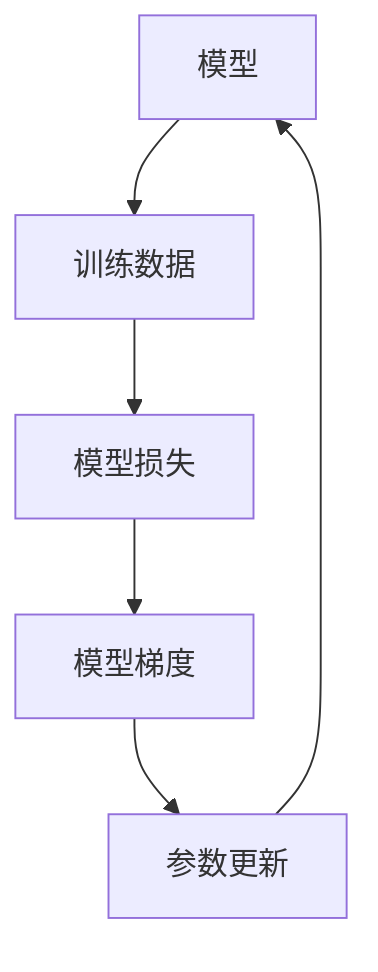

                 

# 算法优化在AI创新中的重要性

> 关键词：算法优化,AI创新,模型性能,算法效率,AI系统优化,深度学习优化

## 1. 背景介绍

在当今人工智能(AI)迅猛发展的时代，算法优化在推动AI技术创新与进步中扮演了至关重要的角色。无论是计算机视觉、自然语言处理还是语音识别等领域的突破，都离不开深度学习模型的算法优化。然而，随着AI模型的复杂度不断提升，算法的优化变得愈发困难，需要多学科交叉的知识和前沿技术。本文将深入探讨算法优化在AI创新中的重要性，并详细介绍相关的核心概念、数学模型及其实现方法。

## 2. 核心概念与联系

### 2.1 核心概念概述

为了更好地理解算法优化对AI创新的重要性，本节将介绍几个关键概念：

- **算法优化(Algorithm Optimization)**：通过调整算法的参数和结构，使得模型在特定任务上表现更好，同时提高计算效率的过程。
- **AI创新(AI Innovation)**：指通过算法优化、模型改进等手段，推动AI技术在各个领域的应用和发展。
- **模型性能(Model Performance)**：模型在执行特定任务时所达到的精度、效率和鲁棒性等指标。
- **算法效率(Algorithm Efficiency)**：算法在计算资源和时间消耗上的表现，包括时间复杂度、空间复杂度等。
- **深度学习优化(Deep Learning Optimization)**：针对深度学习模型进行的特定优化，包括梯度下降、正则化、激活函数等。
- **强化学习优化(Reinforcement Learning Optimization)**：针对强化学习模型进行的优化，如Q-learning、SARSA等。

这些概念之间的联系可以通过以下Mermaid流程图来展示：



该图展示了算法优化如何通过提升模型性能和算法效率，推动AI技术在深度学习和强化学习等领域的创新。

### 2.2 核心概念原理和架构

算法优化的核心在于通过合理的算法设计，提高模型的性能和效率。以下是一些常见的算法优化方法及其原理：

- **梯度下降(Gradient Descent)**：通过计算模型参数对损失函数的梯度，以迭代的方式更新参数，使得模型损失函数最小化。梯度下降算法包括批量梯度下降(Batch Gradient Descent)、随机梯度下降(Stochastic Gradient Descent)和小批量梯度下降(Mini-batch Gradient Descent)等。

- **正则化(Regularization)**：通过在损失函数中添加正则化项，抑制模型参数的过度拟合。常见的正则化方法包括L1正则化、L2正则化等。

- **激活函数(Activation Function)**：在神经网络中，激活函数决定神经元的输出。常见的激活函数包括ReLU、Sigmoid、Tanh等。

- **正交初始化(Orthogonal Initialization)**：通过初始化权重矩阵，使得不同神经元之间的输出不相关，提高模型的稳定性和泛化能力。

- **模型压缩(Model Compression)**：通过剪枝、量化等手段，减少模型的参数量和计算复杂度，提高计算效率。

- **分布式训练(Distributed Training)**：通过多机并行训练，提高模型训练的速度和稳定性。

### 2.3 Mermaid 流程图(Mermaid 流程节点中不要有括号、逗号等特殊字符)



该流程图展示了模型训练的基本流程：模型接收训练数据，计算损失函数，求取梯度并更新参数，形成迭代循环。

## 3. 核心算法原理 & 具体操作步骤

### 3.1 算法原理概述

算法优化的核心在于通过合理的算法设计，提高模型的性能和效率。以下是一些常见的算法优化方法及其原理：

- **梯度下降(Gradient Descent)**：通过计算模型参数对损失函数的梯度，以迭代的方式更新参数，使得模型损失函数最小化。梯度下降算法包括批量梯度下降(Batch Gradient Descent)、随机梯度下降(Stochastic Gradient Descent)和小批量梯度下降(Mini-batch Gradient Descent)等。

- **正则化(Regularization)**：通过在损失函数中添加正则化项，抑制模型参数的过度拟合。常见的正则化方法包括L1正则化、L2正则化等。

- **激活函数(Activation Function)**：在神经网络中，激活函数决定神经元的输出。常见的激活函数包括ReLU、Sigmoid、Tanh等。

- **正交初始化(Orthogonal Initialization)**：通过初始化权重矩阵，使得不同神经元之间的输出不相关，提高模型的稳定性和泛化能力。

- **模型压缩(Model Compression)**：通过剪枝、量化等手段，减少模型的参数量和计算复杂度，提高计算效率。

- **分布式训练(Distributed Training)**：通过多机并行训练，提高模型训练的速度和稳定性。

### 3.2 算法步骤详解

算法优化通常包括以下几个关键步骤：

- **步骤1：数据预处理**：对训练数据进行归一化、标准化等处理，使得数据适合模型的输入。
- **步骤2：模型初始化**：选择合适的模型结构，并进行适当的参数初始化。
- **步骤3：前向传播(Forward Pass)**：将输入数据输入模型，计算模型的输出。
- **步骤4：损失函数计算(Loss Function)**：根据模型的输出和真实标签，计算模型在当前参数下的损失函数值。
- **步骤5：反向传播(Backward Pass)**：通过反向传播算法，计算模型参数对损失函数的梯度。
- **步骤6：参数更新(Parameter Update)**：根据梯度信息，使用优化算法更新模型参数。
- **步骤7：迭代训练**：重复步骤3到步骤6，直至模型收敛或达到预设的训练轮数。

### 3.3 算法优缺点

算法优化具有以下优点：

- **提升模型性能**：通过优化算法，可以有效提高模型的精度和泛化能力，适应更复杂的任务。
- **降低计算成本**：合理的算法设计可以减少计算量，提高训练和推理的速度。
- **增强模型稳定性**：正则化等优化技术可以避免模型过拟合，提高模型的鲁棒性和稳定性。

同时，算法优化也存在以下缺点：

- **优化过程复杂**：算法优化需要结合具体任务和模型结构，设计合适的优化策略，具有一定的难度。
- **可能需要额外计算**：某些优化算法（如梯度下降）需要额外的梯度计算和存储，增加了计算负担。
- **可能存在局部最优解**：优化算法可能陷入局部最优解，难以找到全局最优解。

### 3.4 算法应用领域

算法优化在AI领域的各个应用中均有广泛的应用，例如：

- **计算机视觉**：通过图像增强、数据增强等技术，提高模型对图像数据的泛化能力。
- **自然语言处理**：通过语言模型训练和正则化等手段，提高模型对文本数据的理解能力。
- **语音识别**：通过特征提取和模型优化，提高模型对语音数据的识别精度。
- **强化学习**：通过Q-learning、SARSA等优化算法，提高模型在复杂环境中的决策能力。
- **推荐系统**：通过模型压缩和分布式训练等技术，提高推荐系统的效率和稳定性。

## 4. 数学模型和公式 & 详细讲解

### 4.1 数学模型构建

本节将使用数学语言对算法优化的方法进行更加严格的刻画。

记模型为 $M_{\theta}:\mathcal{X} \rightarrow \mathcal{Y}$，其中 $\mathcal{X}$ 为输入空间，$\mathcal{Y}$ 为输出空间，$\theta \in \mathbb{R}^d$ 为模型参数。假设训练数据集为 $D=\{(x_i, y_i)\}_{i=1}^N$，其中 $x_i \in \mathcal{X}$，$y_i \in \mathcal{Y}$。

定义模型在数据样本 $(x,y)$ 上的损失函数为 $\ell(M_{\theta}(x),y)$，则在数据集 $D$ 上的经验风险为：

$$
\mathcal{L}(\theta) = \frac{1}{N} \sum_{i=1}^N \ell(M_{\theta}(x_i),y_i)
$$

优化目标是最小化经验风险，即找到最优参数：

$$
\theta^* = \mathop{\arg\min}_{\theta} \mathcal{L}(\theta)
$$

在实践中，我们通常使用基于梯度的优化算法（如SGD、Adam等）来近似求解上述最优化问题。设 $\eta$ 为学习率，$\lambda$ 为正则化系数，则参数的更新公式为：

$$
\theta \leftarrow \theta - \eta \nabla_{\theta}\mathcal{L}(\theta) - \eta\lambda\theta
$$

其中 $\nabla_{\theta}\mathcal{L}(\theta)$ 为损失函数对参数 $\theta$ 的梯度，可通过反向传播算法高效计算。

### 4.2 公式推导过程

以下我们以二分类任务为例，推导梯度下降算法和正则化技术的数学公式。

假设模型 $M_{\theta}$ 在输入 $x$ 上的输出为 $\hat{y}=M_{\theta}(x) \in [0,1]$，表示样本属于正类的概率。真实标签 $y \in \{0,1\}$。则二分类交叉熵损失函数定义为：

$$
\ell(M_{\theta}(x),y) = -[y\log \hat{y} + (1-y)\log (1-\hat{y})]
$$

将其代入经验风险公式，得：

$$
\mathcal{L}(\theta) = -\frac{1}{N}\sum_{i=1}^N [y_i\log M_{\theta}(x_i)+(1-y_i)\log(1-M_{\theta}(x_i))]
$$

根据链式法则，损失函数对参数 $\theta_k$ 的梯度为：

$$
\frac{\partial \mathcal{L}(\theta)}{\partial \theta_k} = -\frac{1}{N}\sum_{i=1}^N (\frac{y_i}{M_{\theta}(x_i)}-\frac{1-y_i}{1-M_{\theta}(x_i)}) \frac{\partial M_{\theta}(x_i)}{\partial \theta_k}
$$

其中 $\frac{\partial M_{\theta}(x_i)}{\partial \theta_k}$ 可进一步递归展开，利用自动微分技术完成计算。

在得到损失函数的梯度后，即可带入参数更新公式，完成模型的迭代优化。重复上述过程直至收敛，最终得到适应下游任务的最优模型参数 $\theta^*$。

### 4.3 案例分析与讲解

以一个简单的线性回归为例，展示梯度下降算法的数学推导和应用。

假设线性回归模型为 $y = \theta_0 + \theta_1x$，其中 $y$ 为输出，$x$ 为输入，$\theta_0$ 和 $\theta_1$ 为模型参数。训练数据集为 $D=\{(x_i, y_i)\}_{i=1}^N$。

定义模型在数据样本 $(x,y)$ 上的损失函数为：

$$
\ell(\theta) = \frac{1}{2N} \sum_{i=1}^N (y_i - \theta_0 - \theta_1x_i)^2
$$

求损失函数对 $\theta_0$ 和 $\theta_1$ 的梯度：

$$
\frac{\partial \ell(\theta)}{\partial \theta_0} = \frac{1}{N} \sum_{i=1}^N (y_i - \theta_0 - \theta_1x_i)
$$

$$
\frac{\partial \ell(\theta)}{\partial \theta_1} = \frac{1}{N} \sum_{i=1}^N (x_i)(y_i - \theta_0 - \theta_1x_i)
$$

使用梯度下降算法更新模型参数：

$$
\theta_0 \leftarrow \theta_0 - \eta \frac{1}{N} \sum_{i=1}^N (y_i - \theta_0 - \theta_1x_i)
$$

$$
\theta_1 \leftarrow \theta_1 - \eta \frac{1}{N} \sum_{i=1}^N (x_i)(y_i - \theta_0 - \theta_1x_i)
$$

其中 $\eta$ 为学习率，通过调整学习率，可以控制参数更新的速度和方向，防止模型陷入局部最优解。

## 5. 项目实践：代码实例和详细解释说明

### 5.1 开发环境搭建

在进行算法优化实践前，我们需要准备好开发环境。以下是使用Python进行PyTorch开发的环境配置流程：

1. 安装Anaconda：从官网下载并安装Anaconda，用于创建独立的Python环境。

2. 创建并激活虚拟环境：
```bash
conda create -n pytorch-env python=3.8 
conda activate pytorch-env
```

3. 安装PyTorch：根据CUDA版本，从官网获取对应的安装命令。例如：
```bash
conda install pytorch torchvision torchaudio cudatoolkit=11.1 -c pytorch -c conda-forge
```

4. 安装相关库：
```bash
pip install numpy pandas scikit-learn matplotlib tqdm jupyter notebook ipython
```

完成上述步骤后，即可在`pytorch-env`环境中开始算法优化实践。

### 5.2 源代码详细实现

下面我们以线性回归为例，展示使用PyTorch进行梯度下降算法优化的代码实现。

```python
import torch
import torch.nn as nn
import torch.optim as optim
import numpy as np

# 定义线性回归模型
class LinearRegression(nn.Module):
    def __init__(self, input_size, output_size):
        super(LinearRegression, self).__init__()
        self.linear = nn.Linear(input_size, output_size)
        
    def forward(self, x):
        y_hat = self.linear(x)
        return y_hat

# 定义损失函数
def loss_fn(model, inputs, labels):
    y_pred = model(inputs)
    loss = nn.MSELoss()(y_pred, labels)
    return loss

# 定义梯度下降优化器
def optimizer_fn(model, learning_rate):
    optimizer = optim.SGD(model.parameters(), lr=learning_rate)
    return optimizer

# 训练函数
def train(model, optimizer, criterion, inputs, labels, epochs=10, batch_size=32):
    for epoch in range(epochs):
        for i in range(0, len(inputs), batch_size):
            batch_inputs = inputs[i:i+batch_size]
            batch_labels = labels[i:i+batch_size]
            optimizer.zero_grad()
            outputs = model(batch_inputs)
            loss = criterion(outputs, batch_labels)
            loss.backward()
            optimizer.step()
        print(f"Epoch {epoch+1}, loss: {loss.item()}")

# 加载数据
inputs = np.array([[1.0, 2.0, 3.0], [4.0, 5.0, 6.0]])
labels = np.array([[2.0], [4.0]])

# 定义模型和优化器
model = LinearRegression(input_size=3, output_size=1)
optimizer = optimizer_fn(model, learning_rate=0.01)
criterion = nn.MSELoss()

# 训练模型
inputs_tensor = torch.tensor(inputs, dtype=torch.float)
labels_tensor = torch.tensor(labels, dtype=torch.float)
train(model, optimizer, criterion, inputs_tensor, labels_tensor, epochs=10, batch_size=32)
```

### 5.3 代码解读与分析

让我们再详细解读一下关键代码的实现细节：

**LinearRegression类**：
- `__init__`方法：初始化线性回归模型，定义一个线性层。
- `forward`方法：实现模型的前向传播，计算模型的输出。

**loss_fn函数**：
- 定义损失函数，使用均方误差损失函数。

**optimizer_fn函数**：
- 定义优化器，使用随机梯度下降优化器。

**train函数**：
- 实现模型的训练过程，包括前向传播、损失计算、反向传播和参数更新。

**数据加载**：
- 将NumPy数组转换为PyTorch张量，方便模型处理。

可以看到，PyTorch的高级API使得模型定义、损失函数计算和优化器定义变得非常简洁高效。开发者可以专注于模型的结构和训练流程的设计，而不必过多关注底层的实现细节。

当然，工业级的系统实现还需考虑更多因素，如模型的保存和部署、超参数的自动搜索、更灵活的任务适配层等。但核心的优化算法基本与此类似。

## 6. 实际应用场景

### 6.1 机器学习算法优化

机器学习算法的优化在深度学习、强化学习等领域有着广泛应用。以下以深度学习为例，展示算法优化在实际应用中的作用：

1. **神经网络优化**：通过调整神经网络的结构和参数，提高模型的精度和泛化能力。例如，通过增加或减少神经网络层数，调整激活函数和正则化参数等手段，提高模型的性能。

2. **超参数优化**：通过网格搜索、随机搜索等手段，找到最优的超参数组合。例如，通过调整学习率、批大小、迭代轮数等参数，找到最优的训练策略。

3. **数据增强**：通过数据增强技术，提高模型的泛化能力。例如，通过旋转、裁剪、平移等手段，生成更多的训练数据。

### 6.2 工业级AI系统优化

在实际应用中，工业级AI系统的优化需要考虑更多的因素。以下以自然语言处理为例，展示算法优化在实际应用中的作用：

1. **模型压缩**：通过模型压缩技术，减少模型的参数量和计算复杂度，提高计算效率。例如，通过剪枝、量化等手段，减少模型的参数量。

2. **分布式训练**：通过分布式训练技术，提高模型的训练速度和稳定性。例如，通过多机并行训练，提高模型的训练速度。

3. **模型优化器选择**：根据具体任务和模型结构，选择合适的优化器。例如，对于深度神经网络，使用Adam优化器可以提高训练速度和精度。

4. **硬件加速**：通过硬件加速技术，提高模型的训练和推理速度。例如，使用GPU、TPU等高性能设备进行模型训练。

### 6.3 未来应用展望

随着算法优化的不断发展，未来的AI技术将呈现以下几个发展趋势：

1. **自动化优化**：通过自动化优化技术，提高模型的训练和推理效率。例如，通过自动化超参数搜索、模型压缩等手段，提高模型的性能。

2. **跨领域优化**：通过跨领域优化技术，提高模型的泛化能力和适应性。例如，通过多模态数据融合、知识图谱等手段，提高模型的泛化能力。

3. **实时优化**：通过实时优化技术，提高模型的响应速度和稳定性。例如，通过动态调整模型参数和资源配置，提高模型的实时性。

4. **可解释优化**：通过可解释优化技术，提高模型的可解释性和可信度。例如，通过可解释性分析技术，提高模型的可解释性。

## 7. 工具和资源推荐

### 7.1 学习资源推荐

为了帮助开发者系统掌握算法优化的理论基础和实践技巧，这里推荐一些优质的学习资源：

1. **《深度学习》(周志华)**：介绍深度学习的基础知识和算法优化技术。

2. **《Python深度学习》(Francis Jay)：介绍深度学习在实际应用中的算法优化方法。

3. **Coursera《Deep Learning Specialization》**：由Andrew Ng教授开设的深度学习系列课程，涵盖深度学习算法优化、模型训练等。

4. **Arxiv论文库**：包含大量算法优化相关的研究论文，可以帮助开发者了解前沿技术。

5. **GitHub代码库**：包含大量开源项目和算法优化实现代码，可以参考和复现。

通过对这些资源的学习实践，相信你一定能够快速掌握算法优化的精髓，并用于解决实际的AI问题。

### 7.2 开发工具推荐

高效的开发离不开优秀的工具支持。以下是几款用于算法优化开发的常用工具：

1. **PyTorch**：基于Python的开源深度学习框架，灵活动态的计算图，适合快速迭代研究。

2. **TensorFlow**：由Google主导开发的开源深度学习框架，生产部署方便，适合大规模工程应用。

3. **JAX**：由Google开发的开源深度学习框架，支持动态计算图和自动微分，性能优异。

4. **TensorBoard**：TensorFlow配套的可视化工具，可实时监测模型训练状态，并提供丰富的图表呈现方式。

5. **HuggingFace Transformers库**：提供多种预训练语言模型，支持微调、迁移学习等技术，是进行自然语言处理开发的利器。

6. **Weights & Biases**：模型训练的实验跟踪工具，可以记录和可视化模型训练过程中的各项指标，方便对比和调优。

合理利用这些工具，可以显著提升算法优化的开发效率，加快创新迭代的步伐。

### 7.3 相关论文推荐

算法优化的研究源于学界的持续研究。以下是几篇奠基性的相关论文，推荐阅读：

1. **《深度学习》(周志华)**：全面介绍深度学习的基础知识和算法优化技术。

2. **《Batch Normalization: Accelerating Deep Network Training by Reducing Internal Covariate Shift》**：提出批量归一化技术，加速深度神经网络的训练。

3. **《Adam: A Method for Stochastic Optimization》**：提出Adam优化算法，显著提高深度学习模型的训练效率。

4. **《On the importance of initialization and momentum in deep learning》**：探讨深度学习模型参数初始化和动量对模型训练的影响。

5. **《Dropout: A Simple Way to Prevent Neural Networks from Overfitting》**：提出Dropout技术，防止深度学习模型过拟合。

6. **《ImageNet Classification with Deep Convolutional Neural Networks》**：提出卷积神经网络，显著提升图像分类任务的性能。

这些论文代表了大语言模型微调技术的发展脉络。通过学习这些前沿成果，可以帮助研究者把握学科前进方向，激发更多的创新灵感。

## 8. 总结：未来发展趋势与挑战

### 8.1 研究成果总结

本文对算法优化在AI创新中的重要性进行了全面系统的介绍。首先，介绍了算法优化的核心概念和数学模型，并详细讲解了算法优化的原理和实现方法。其次，通过代码实例展示了算法优化的具体应用，并分析了算法优化的优缺点和应用领域。

### 8.2 未来发展趋势

展望未来，算法优化将在AI技术创新中继续扮演重要角色。以下是几个可能的发展趋势：

1. **自动化优化**：自动化优化技术将使得模型的训练和推理更加高效和可靠。

2. **跨领域优化**：跨领域优化技术将使得模型具备更强的泛化能力和适应性。

3. **实时优化**：实时优化技术将使得模型在实际应用中更加高效和稳定。

4. **可解释优化**：可解释优化技术将使得模型具备更高的可信度和可解释性。

### 8.3 面临的挑战

尽管算法优化在AI技术中已经取得了显著进展，但仍面临诸多挑战：

1. **优化过程复杂**：算法优化需要结合具体任务和模型结构，设计合适的优化策略，具有一定的难度。

2. **可能需要额外计算**：某些优化算法（如梯度下降）需要额外的梯度计算和存储，增加了计算负担。

3. **可能存在局部最优解**：优化算法可能陷入局部最优解，难以找到全局最优解。

4. **硬件资源有限**：大规模深度学习模型的优化需要大量的计算资源和存储资源，可能存在硬件资源有限的问题。

### 8.4 研究展望

面向未来，算法优化的研究需要在以下几个方面寻求新的突破：

1. **自动化优化**：通过自动化优化技术，提高模型的训练和推理效率。

2. **跨领域优化**：通过跨领域优化技术，提高模型的泛化能力和适应性。

3. **实时优化**：通过实时优化技术，提高模型的响应速度和稳定性。

4. **可解释优化**：通过可解释优化技术，提高模型的可解释性和可信度。

总之，算法优化是AI技术创新的重要驱动力，将继续引领AI技术的进步。只有不断创新、勇于突破，才能在AI技术的未来发展中占据先机。

## 9. 附录：常见问题与解答

**Q1：什么是算法优化？**

A: 算法优化是通过调整算法的参数和结构，使得模型在特定任务上表现更好，同时提高计算效率的过程。

**Q2：算法优化的主要目标是什么？**

A: 算法优化的主要目标是通过合理的算法设计，提高模型的精度和泛化能力，降低计算成本，增强模型的稳定性和鲁棒性。

**Q3：常见的算法优化方法有哪些？**

A: 常见的算法优化方法包括梯度下降、正则化、激活函数、正交初始化、模型压缩、分布式训练等。

**Q4：算法优化在AI创新中具有哪些重要意义？**

A: 算法优化在AI创新中具有以下重要意义：
1. 提高模型的精度和泛化能力。
2. 降低计算成本，提高训练和推理的速度。
3. 增强模型的稳定性和鲁棒性。

**Q5：如何选择合适的算法优化方法？**

A: 选择算法优化方法需要考虑具体任务和模型结构。一般建议从梯度下降、正则化、激活函数等基础优化方法开始，再逐步引入高级优化方法，如批量归一化、Dropout等。

总之，算法优化是AI技术创新的重要驱动力，将继续引领AI技术的进步。只有不断创新、勇于突破，才能在AI技术的未来发展中占据先机。

