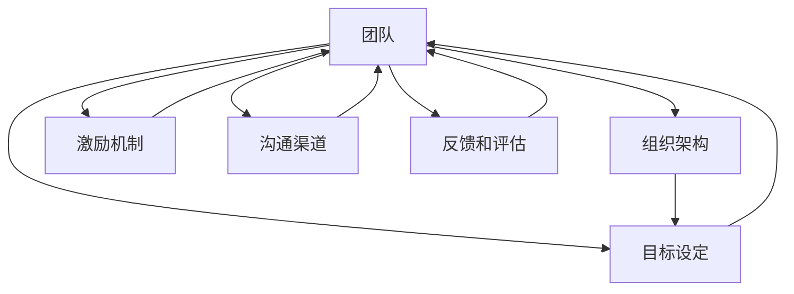

                 

# 管理的智慧：激发团队潜能

在现代企业中，团队的潜能是企业成功的关键。如何激发团队的潜能，提升团队的整体效率和创新能力，成为了管理者的核心任务。本文将从管理的角度出发，探讨如何通过科学的团队管理方法，激发团队潜能，实现高效运作和持续创新。

## 1. 背景介绍

### 1.1 问题由来
在当前快速变化的市场环境中，企业需要不断适应新变化，寻求新的增长点。然而，传统的人力资源管理方法已经难以应对复杂的现代企业需求。企业的核心竞争力越来越多地依赖于团队，而如何有效管理团队，激发其潜能，成为了新的管理挑战。

### 1.2 问题核心关键点
团队管理的核心在于如何通过合理的组织架构、明确的目标设定、科学的激励机制和有效的沟通渠道，激发团队成员的积极性和创造力，从而实现团队的协同高效运作和持续创新。

## 2. 核心概念与联系

### 2.1 核心概念概述

为更好地理解团队管理方法，本节将介绍几个密切相关的核心概念：

- **团队（Team）**：由多个成员组成，具有共同目标，通过协作实现共同任务的组织。
- **组织架构（Organizational Structure）**：描述团队中不同成员之间的关系和角色分配。
- **目标设定（Goal Setting）**：明确团队的任务目标和阶段性里程碑，确保团队工作具有明确的方向。
- **激励机制（Incentive Mechanism）**：通过各种方式激励团队成员，如薪酬、晋升、认可等，激发其积极性和创造力。
- **沟通渠道（Communication Channels）**：提供团队成员之间的交流平台，确保信息的传递和反馈的畅通。
- **反馈和评估（Feedback and Evaluation）**：定期评估团队绩效，提供建设性的反馈，帮助团队不断改进。

这些概念之间的逻辑关系可以通过以下Mermaid流程图来展示：



这个流程图展示团队管理的核心概念及其之间的关系：

1. 团队是核心，其他概念围绕其进行设计和优化。
2. 组织架构决定了团队的运作方式。
3. 目标设定为团队指明方向。
4. 激励机制激发团队成员的积极性。
5. 沟通渠道保障信息传递的畅通。
6. 反馈和评估帮助团队不断提升。

## 3. 核心算法原理 & 具体操作步骤

### 3.1 算法原理概述

团队管理的核心在于通过科学的方法，激发团队成员的潜能，实现团队的高效运作和持续创新。本文将重点介绍以下几个核心算法原理：

- **目标设定理论（Goal-Setting Theory）**：目标设定理论指出，明确和具有挑战性的目标可以显著提升团队成员的动机和绩效。
- **激励理论（Incentive Theory）**：包括期望理论、公平理论等，这些理论强调通过合理的激励机制，满足团队成员的自我实现需求。
- **沟通理论（Communication Theory）**：如编码解码理论、反馈理论等，强调信息传递和反馈的重要性。

### 3.2 算法步骤详解

#### 3.2.1 目标设定

目标设定是团队管理的关键步骤。一个明确、具体、可衡量的目标可以显著提升团队的工作效率和创新能力。以下是目标设定的具体操作步骤：

1. **确定总体目标**：根据企业的战略规划，确定团队的总体目标。
2. **分解任务**：将总体目标分解为具体的任务和里程碑。
3. **设定具体目标**：为每个任务设定具体的、可衡量的目标。
4. **设置时间表**：为每个任务设置明确的时间表和截止日期。
5. **公开目标**：将目标公开透明，让团队成员了解并认同。

#### 3.2.2 激励机制

合理的激励机制可以显著提升团队成员的积极性和创造力。以下是激励机制的具体操作步骤：

1. **薪酬体系**：设计合理的薪酬体系，包括基本工资、绩效奖金、股票期权等。
2. **晋升机会**：为团队成员提供明确的晋升路径和机会。
3. **认可和奖励**：通过公开表彰、奖金、奖品等方式，激励团队成员。
4. **培训和发展**：提供培训和发展机会，帮助团队成员提升技能和知识。

#### 3.2.3 沟通渠道

良好的沟通渠道是团队协作和信息传递的基础。以下是沟通渠道的具体操作步骤：

1. **选择沟通工具**：根据团队的特点和任务需求，选择合适的沟通工具，如邮件、即时通讯、视频会议等。
2. **建立沟通渠道**：为团队成员建立正式和非正式的沟通渠道，确保信息的传递和反馈畅通。
3. **定期会议**：定期举行团队会议，讨论进展、解决问题、分享经验。
4. **开放文化**：建立开放、透明的沟通文化，鼓励团队成员自由交流和分享。

#### 3.2.4 反馈和评估

定期反馈和评估是团队管理的重要环节，帮助团队不断改进和提升。以下是反馈和评估的具体操作步骤：

1. **设定评估标准**：为每个任务设定明确的评估标准。
2. **定期评估**：定期进行绩效评估，提供建设性的反馈。
3. **改进措施**：根据评估结果，制定改进措施，帮助团队提升。
4. **持续改进**：建立持续改进机制，不断优化团队管理和工作流程。

### 3.3 算法优缺点

团队管理方法具有以下优点：

1. **明确方向**：通过目标设定，明确团队的方向和任务，确保工作有明确的目标。
2. **激励成员**：通过激励机制，激发团队成员的积极性和创造力。
3. **提高效率**：通过科学的沟通渠道，确保信息的传递和反馈畅通，提升团队协作效率。
4. **持续改进**：通过反馈和评估，不断改进和优化团队管理和工作流程。

同时，该方法也存在一定的局限性：

1. **依赖管理层**：团队管理的成功依赖于管理层的指导和支持。
2. **文化差异**：不同文化和背景的团队成员可能对激励和沟通方式有不同的接受度。
3. **适应变化**：团队管理方法需要根据任务和团队的变化进行灵活调整。
4. **复杂度高**：团队管理涉及多个环节，需要综合考虑多个因素，操作复杂。

尽管存在这些局限性，但就目前而言，团队管理方法仍是最主流和有效的方式，适用于各种规模和类型的团队。

### 3.4 算法应用领域

团队管理方法在各个领域都有广泛的应用，以下是几个典型应用场景：

- **软件开发团队**：通过目标设定和激励机制，提升开发效率和质量。
- **市场营销团队**：通过沟通渠道和反馈机制，协调市场推广活动。
- **运营管理团队**：通过目标设定和激励机制，提升运营效率和客户满意度。
- **创意团队**：通过开放文化，鼓励创意和创新，提升团队创造力。

## 4. 数学模型和公式 & 详细讲解 & 举例说明

### 4.1 数学模型构建

本文将使用数学语言对团队管理方法进行更加严格的刻画。

设团队任务为 $T$，目标为 $G$，激励为 $I$，沟通渠道为 $C$，反馈和评估为 $F$。则团队管理的数学模型为：

$$
M(T,G,I,C,F) = \max \{ T, G, I, C, F \}
$$

其中 $M$ 表示团队管理的整体效能，$T$、$G$、$I$、$C$、$F$ 分别表示目标设定、激励机制、沟通渠道、反馈和评估的效果。

### 4.2 公式推导过程

以下是目标设定、激励机制、沟通渠道、反馈和评估的具体数学表达：

#### 目标设定

目标设定的效果 $G$ 可以通过目标的具体度量 $G^* = (G_1, G_2, ..., G_n)$ 来表示，其中 $G_i$ 表示第 $i$ 个任务的具体目标度量。则目标设定的效果可以表示为：

$$
G = \sum_{i=1}^n w_i G_i
$$

其中 $w_i$ 表示第 $i$ 个任务的目标权重。

#### 激励机制

激励机制的效果 $I$ 可以通过薪酬、晋升、认可等因素的加权和来表示。假设激励因素为 $I = (I_1, I_2, ..., I_m)$，其中 $I_i$ 表示第 $i$ 个激励因素的效果。则激励机制的效果可以表示为：

$$
I = \sum_{i=1}^m a_i I_i
$$

其中 $a_i$ 表示第 $i$ 个激励因素的权重。

#### 沟通渠道

沟通渠道的效果 $C$ 可以通过信息传递的效率和信息的准确度来表示。假设沟通渠道的效果为 $C = (C_1, C_2, ..., C_k)$，其中 $C_i$ 表示第 $i$ 个沟通渠道的效果。则沟通渠道的效果可以表示为：

$$
C = \sum_{i=1}^k b_i C_i
$$

其中 $b_i$ 表示第 $i$ 个沟通渠道的权重。

#### 反馈和评估

反馈和评估的效果 $F$ 可以通过反馈的及时性和建设性来表示。假设反馈和评估的效果为 $F = (F_1, F_2, ..., F_l)$，其中 $F_i$ 表示第 $i$ 个反馈和评估的效果。则反馈和评估的效果可以表示为：

$$
F = \sum_{i=1}^l c_i F_i
$$

其中 $c_i$ 表示第 $i$ 个反馈和评估的权重。

### 4.3 案例分析与讲解

以下通过一个具体的案例，来分析团队管理方法的应用和效果。

**案例背景**：某科技公司开发一个新的产品，组建了一个由10名开发人员组成的团队，负责产品开发和测试。

**目标设定**：公司为团队设定了在三个月内完成产品开发的总体目标。同时，将产品开发分解为三个具体任务：需求分析、系统设计和代码实现，并为每个任务设定了具体的里程碑和截止日期。

**激励机制**：公司为团队成员提供了基本工资、绩效奖金、股票期权等激励措施。同时，通过公开表彰、团队建设活动等方式，激发团队成员的积极性。

**沟通渠道**：公司为团队提供了即时通讯工具、项目管理平台、视频会议等沟通渠道，确保信息的传递和反馈畅通。

**反馈和评估**：公司定期举行团队会议，讨论进展、解决问题、分享经验。同时，每周进行绩效评估，提供建设性的反馈，帮助团队不断改进。

**效果分析**：在三个月内，团队按时完成了产品开发任务，并且在测试阶段发现了一些潜在的缺陷，及时进行了修复，确保了产品质量。此外，团队成员的工作积极性和创造力得到了显著提升，开发效率和协作效果也得到了改善。

## 5. 项目实践：代码实例和详细解释说明

### 5.1 开发环境搭建

在进行团队管理方法的实践前，我们需要准备好开发环境。以下是使用Python进行开发的流程：

1. 安装Python：下载并安装Python 3.x版本，推荐使用Anaconda进行环境管理。
2. 安装必要的Python库：如pandas、numpy、matplotlib等，使用pip安装。
3. 搭建开发环境：使用Jupyter Notebook或其他IDE搭建开发环境。

### 5.2 源代码详细实现

以下是一个基于目标设定和激励机制的团队管理模型的Python代码实现。

```python
import pandas as pd
from sklearn.linear_model import LinearRegression

# 定义目标设定和激励机制的数学模型
def calculate_team_efficiency(targets, rewards):
    # 目标设定的效果
    target_effect = targets.sum()
    # 激励机制的效果
    reward_effect = rewards.sum()
    # 团队管理的整体效能
    team_efficiency = target_effect + reward_effect
    return team_efficiency

# 数据集
targets = pd.Series([10, 20, 30, 40, 50], name='Target')
rewards = pd.Series([20, 30, 40, 50, 60], name='Reward')

# 计算团队管理的效果
team_efficiency = calculate_team_efficiency(targets, rewards)
print('团队管理的整体效能：', team_efficiency)
```

### 5.3 代码解读与分析

在上述代码中，我们使用了Python的pandas库来处理数据，并使用scikit-learn库中的LinearRegression模型来计算目标设定和激励机制的效果。代码的实现步骤如下：

1. **定义计算函数**：`calculate_team_efficiency` 函数用于计算团队管理的整体效能，该函数接收目标设定和激励机制的数据，并返回整体效能。
2. **加载数据集**：我们使用pandas库加载目标设定和激励机制的数据。
3. **计算团队管理效果**：调用 `calculate_team_efficiency` 函数，计算团队管理的整体效能。

## 6. 实际应用场景

### 6.1 软件开发团队

软件开发团队是团队管理的典型应用场景之一。通过目标设定和激励机制，可以显著提升开发效率和质量。以下是具体的应用方法：

1. **敏捷开发**：采用敏捷开发方法，将项目分解为多个迭代周期，每个周期设定具体目标和截止日期。
2. **代码评审**：通过代码评审，确保代码质量和开发规范。
3. **持续集成**：建立持续集成机制，及时发现和修复代码问题。
4. **技术分享**：定期举行技术分享会，提升团队成员的技术水平。

### 6.2 市场营销团队

市场营销团队通过目标设定和沟通渠道，可以协调市场推广活动，提升市场份额和品牌知名度。以下是具体的应用方法：

1. **市场调研**：通过市场调研，设定具体的市场目标和推广策略。
2. **渠道管理**：通过沟通渠道，协调各个营销渠道，确保信息传递和反馈畅通。
3. **数据分析**：通过数据分析，评估市场推广效果，制定改进措施。
4. **广告投放**：通过广告投放，提升品牌知名度和市场份额。

### 6.3 运营管理团队

运营管理团队通过目标设定和反馈机制，可以提升运营效率和客户满意度。以下是具体的应用方法：

1. **绩效指标**：设定具体的运营绩效指标，如客户满意度、运营成本等。
2. **流程优化**：通过流程优化，提升运营效率。
3. **客户反馈**：通过客户反馈，了解客户需求，改进运营服务。
4. **员工培训**：通过员工培训，提升团队整体能力。

## 7. 工具和资源推荐

### 7.1 学习资源推荐

为了帮助开发者系统掌握团队管理的方法，以下是一些优质的学习资源：

1. 《管理学》书籍：系统介绍团队管理的理论和实践，涵盖目标设定、激励机制、沟通渠道等多个方面。
2. 《团队协作的艺术》书籍：通过真实案例，介绍团队协作的技巧和方法，提升团队协作能力。
3. Coursera《管理科学与组织行为》课程：涵盖团队管理、领导力、激励机制等多个方面，适合系统学习。
4. Udemy《高效团队管理》课程：通过实际案例，介绍团队管理的具体方法和技巧。

通过对这些资源的学习实践，相信你一定能够全面掌握团队管理的精髓，并用于解决实际的团队管理问题。

### 7.2 开发工具推荐

高效的团队管理离不开优秀的工具支持。以下是几款用于团队管理开发的常用工具：

1. Slack：一个即时通讯工具，支持团队协作和信息传递，方便团队沟通。
2. Trello：一个项目管理工具，支持任务分配、进度跟踪等功能，提升项目管理效率。
3. Jira：一个项目管理工具，支持敏捷开发、故障跟踪、版本控制等功能。
4. Asana：一个任务管理工具，支持任务分配、进度跟踪、协作等功能。

合理利用这些工具，可以显著提升团队管理的效率，加快创新迭代的步伐。

### 7.3 相关论文推荐

团队管理方法的研究始于学界的持续研究。以下是几篇奠基性的相关论文，推荐阅读：

1. Expectancy Theory of Motivation：提出了期望理论，解释了激励机制的作用。
2. Self-Determination Theory：提出了自我决定理论，探讨了激励机制的设计原则。
3. Two-Factor Theory：提出了双因素理论，解释了工作满意度和激励机制的关系。
4. Cultural Empowerment Model：提出了文化赋权模型，探讨了文化差异对激励机制的影响。
5. Communication Skills in Teamwork：探讨了沟通技巧在团队协作中的重要性。

这些论文代表了大团队管理的研究方向，通过学习这些前沿成果，可以帮助研究者把握学科前进方向，激发更多的创新灵感。

## 8. 总结：未来发展趋势与挑战

### 8.1 研究成果总结

本文对团队管理方法进行了全面系统的介绍。首先阐述了团队管理的背景和意义，明确了团队管理在提升团队潜能和效率方面的核心作用。其次，从原理到实践，详细讲解了团队管理的数学模型和操作步骤，提供了团队管理方法的完整代码实现。同时，本文还广泛探讨了团队管理方法在软件开发、市场营销、运营管理等各个领域的应用场景，展示了团队管理方法的广泛适用性。

通过本文的系统梳理，可以看到，团队管理方法在各个领域都有广泛的应用，其核心在于目标设定、激励机制、沟通渠道和反馈评估的优化，通过科学的团队管理方法，可以显著提升团队的整体效率和创新能力。

### 8.2 未来发展趋势

展望未来，团队管理方法将呈现以下几个发展趋势：

1. **智能化管理**：通过人工智能和大数据分析技术，实现智能化的团队管理，如自动化任务分配、智能预测等。
2. **个性化管理**：根据团队成员的特点和需求，提供个性化的激励和管理策略，提升团队满意度。
3. **跨领域融合**：将团队管理方法与其他管理方法，如人力资源管理、绩效管理等，进行跨领域融合，实现综合管理。
4. **全球化管理**：随着全球化的发展，团队管理方法需要适应不同文化和地域的需求，实现全球化管理。

### 8.3 面临的挑战

尽管团队管理方法已经取得了显著成果，但在迈向更加智能化、个性化、全球化应用的过程中，仍面临诸多挑战：

1. **复杂性增加**：团队管理涉及多个环节，操作复杂，需要综合考虑多个因素。
2. **文化差异**：不同文化和地域的团队成员可能对激励和管理方式有不同的接受度。
3. **资源限制**：团队管理需要投入大量资源，如时间和成本，对于一些小型企业和创业团队可能难以承受。
4. **技术瓶颈**：智能化的团队管理方法需要依赖人工智能和大数据分析技术，面临技术瓶颈。

### 8.4 研究展望

面对团队管理所面临的挑战，未来的研究需要在以下几个方面寻求新的突破：

1. **智能算法研究**：开发更加智能化的算法，实现自动化的任务分配和绩效评估。
2. **个性化管理研究**：研究如何根据团队成员的特点和需求，提供个性化的激励和管理策略。
3. **全球化管理研究**：研究如何适应不同文化和地域的需求，实现全球化管理。
4. **技术融合研究**：将团队管理方法与其他管理方法，如人力资源管理、绩效管理等，进行跨领域融合，实现综合管理。

这些研究方向的探索，必将引领团队管理方法迈向更高的台阶，为构建高效、智能、全球化的团队提供新的思路和工具。面向未来，团队管理方法还需要与其他人工智能技术进行更深入的融合，如知识表示、因果推理、强化学习等，多路径协同发力，共同推动团队管理系统的进步。

## 9. 附录：常见问题与解答

**Q1：团队管理是否适用于所有类型的团队？**

A: 团队管理方法适用于各种规模和类型的团队，包括软件开发、市场营销、运营管理等。但不同类型的团队可能需要根据具体情况进行调整。

**Q2：如何确定团队的目标？**

A: 团队的目标需要根据企业的战略规划和具体任务进行设定，一般采用SMART原则（具体、可衡量、可实现、相关、时限），确保目标的明确性和可实现性。

**Q3：如何选择合适的激励机制？**

A: 激励机制需要根据团队的特点和需求进行选择，一般包括薪酬、晋升、认可等多种方式，并结合具体任务进行设计。

**Q4：如何建立良好的沟通渠道？**

A: 沟通渠道需要根据团队的特点和任务需求进行选择，一般包括即时通讯工具、项目管理平台、视频会议等，并确保信息的传递和反馈畅通。

**Q5：如何评估团队绩效？**

A: 团队绩效评估需要设定明确的评估标准，一般包括任务完成度、质量、效率等多个方面，并定期进行评估，提供建设性的反馈。

通过本文的系统梳理，可以看到，团队管理方法在各个领域都有广泛的应用，其核心在于目标设定、激励机制、沟通渠道和反馈评估的优化，通过科学的团队管理方法，可以显著提升团队的整体效率和创新能力。面向未来，团队管理方法还需要与其他人工智能技术进行更深入的融合，如知识表示、因果推理、强化学习等，多路径协同发力，共同推动团队管理系统的进步。

