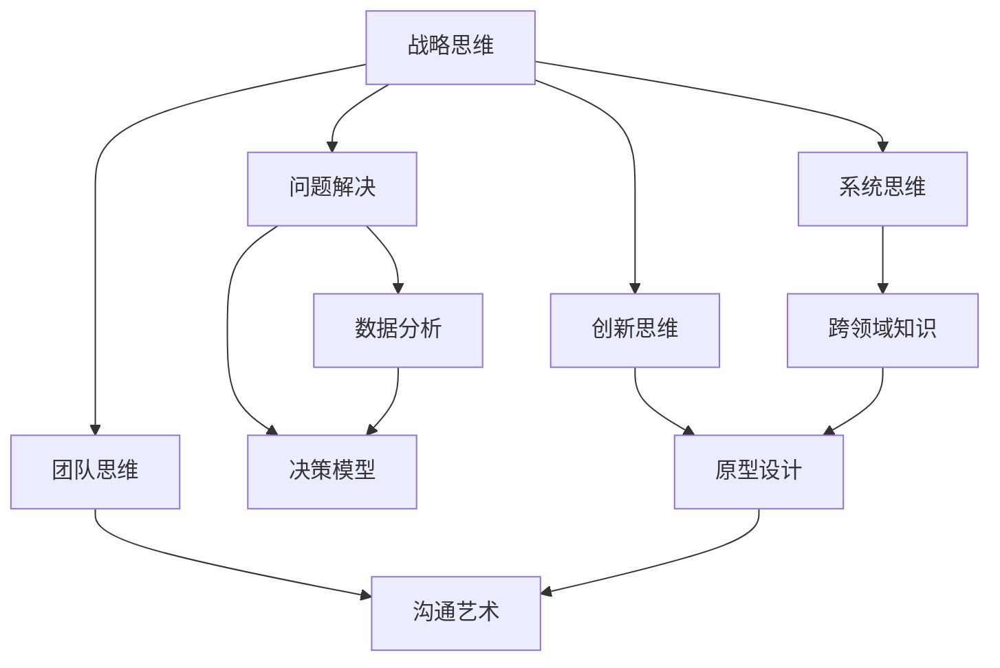

                 

# 管理者的思维能力提升指南

## 1. 背景介绍

### 1.1 问题由来
在当今快速变化的商业环境中，管理者面临的环境越来越复杂。技术的发展、市场的变化、政策的不确定性、员工的需求等因素，都在不断影响着企业的运营。面对如此多的不确定性，管理者需要具备高效、全面、深刻的思维能力，才能在动态多变的环境中找到方向、制定策略，带领团队实现目标。

### 1.2 问题核心关键点
本指南聚焦于提升管理者的思维能力，通过结构化的学习路径，帮助管理者掌握多种思维模型、分析方法和工具，提升其战略规划、问题解决、团队管理等方面的能力。

### 1.3 问题研究意义
提升管理者的思维能力，不仅能增强其在复杂环境中的决策能力，还能促进企业内部的创新与变革，推动企业持续发展。具体来说，有以下几个方面的重要意义：

- **提升决策质量**：思维能力的提升，有助于管理者在面对复杂决策时，能够更全面、更深入地分析和评估各种选项，从而做出更为明智的决策。
- **增强创新能力**：良好的思维能力能够激发创意，帮助管理者在激烈的市场竞争中寻找新的突破点，推动企业的持续创新。
- **优化团队协作**：有效的思维能力能够帮助管理者更好地理解和激励团队成员，促进跨部门协作，提升团队整体效率。
- **促进长期发展**：提升管理者的思维能力，有助于制定更具前瞻性的战略规划，促进企业的长期稳定发展。

## 2. 核心概念与联系

### 2.1 核心概念概述

为了更好地理解管理者的思维能力提升路径，本节将介绍几个密切相关的核心概念：

- **战略思维**：指管理者在制定长期目标和短期行动计划时的思维方式，包括市场分析、竞争策略、资源配置等方面。
- **问题解决**：指管理者在面对问题和挑战时的分析、推理和决策过程，需要灵活运用多种思维工具和技术。
- **系统思维**：指管理者从整体视角出发，考虑各部分间的相互关系和互动，以实现系统最优化的思维方式。
- **创新思维**：指管理者在推动企业创新、寻找新业务机会时的思维方式，需要打破常规、勇于尝试。
- **团队思维**：指管理者在领导和激励团队时的思维方式，包括团队成员理解、沟通协调、激励机制设计等方面。

这些核心概念之间的逻辑关系可以通过以下Mermaid流程图来展示：



这个流程图展示了几大核心概念的相互关系和支撑点：

1. 战略思维通过问题解决、系统思维、创新思维和团队思维的综合应用，帮助管理者制定并执行战略。
2. 问题解决依赖于数据分析和决策模型，以科学方法进行问题诊断和解决。
3. 系统思维需要跨领域知识的支撑，才能更好地理解和优化系统。
4. 创新思维需要原型设计和沟通艺术的支持，将创意转化为实际行动。
5. 团队思维依赖于有效的沟通艺术，促进团队协作和成员激励。

## 3. 核心算法原理 & 具体操作步骤
### 3.1 算法原理概述

提升管理者思维能力的关键在于掌握多种思维模型和工具，并通过实践不断内化。这些模型和工具覆盖了战略制定、问题解决、系统分析、创新推动和团队协作等多个方面。本节将简要介绍一些常用的模型和工具。

### 3.2 算法步骤详解

提升管理者思维能力的具体步骤包括：

1. **自我评估**：了解自身思维优势和不足，明确提升方向。
2. **系统学习**：掌握各类思维模型和工具，包括但不限于SWOT分析、PEST分析、五力模型、因果图等。
3. **案例分析**：通过具体案例分析，理解模型和工具的应用场景和效果。
4. **实践应用**：在实际工作中应用所学模型和工具，不断反思和改进。
5. **持续学习**：定期参加培训和研讨会，与同行交流，更新知识储备。

### 3.3 算法优缺点

提升管理者思维能力的方法具有以下优点：

- **系统性**：通过系统学习多种思维模型和工具，能够全面提升管理者的综合能力。
- **实践性**：通过案例分析和实践应用，将理论知识转化为实际技能。
- **灵活性**：不同情境下可以灵活运用不同模型和工具，适应性强。

同时，该方法也存在一定的局限性：

- **学习成本**：掌握和应用多种思维模型和工具需要时间和精力投入。
- **工具依赖**：过度依赖模型和工具，可能忽视直觉和经验的作用。
- **实践难度**：在实际工作中应用所学模型和工具，需要克服各类障碍。

尽管存在这些局限性，但综合来看，通过系统学习和实践应用，管理者能够显著提升思维能力，更好地应对复杂环境中的各种挑战。

### 3.4 算法应用领域

提升管理者思维能力的方法不仅适用于企业战略管理，还能应用于项目规划、团队领导、问题解决等多个领域。以下是一些典型应用场景：

- **企业战略规划**：通过SWOT分析、PEST分析等工具，帮助管理者全面评估企业内外部环境，制定长远发展战略。
- **项目管理**：应用甘特图、PERT图等项目管理工具，帮助管理者协调资源、控制进度，确保项目顺利完成。
- **团队管理**：利用OKR、KPI等工具，激励团队成员，提升团队绩效。
- **问题解决**：运用因果图、决策树等方法，系统分析和解决复杂问题。
- **市场分析**：应用五力模型、竞争情报分析等工具，洞察市场变化，制定市场策略。

## 4. 数学模型和公式 & 详细讲解 & 举例说明

### 4.1 数学模型构建

提升管理者思维能力的方法主要依赖于定性分析和定量分析。以下是几个常用的数学模型：

1. **SWOT分析**：
   - **模型定义**：评估企业内部优势(Strengths)、劣势(Weaknesses)、外部机会(Opportunities)和威胁(Threats)。
   - **公式推导**：
   $$
   \text{SWOT} = (\text{S}, \text{W}, \text{O}, \text{T})
   $$
   - **案例分析**：一家企业通过SWOT分析发现，其优势在于强大的技术研发能力，劣势在于产品营销能力不足，面临市场竞争加剧的威胁，但同时也发现了一个新的市场机会。基于此，企业制定了强化营销、拓展市场的策略。

2. **PEST分析**：
   - **模型定义**：从政治(Political)、经济(Economic)、社会(Social)、技术(Technological)四个维度分析外部环境。
   - **公式推导**：
   $$
   \text{PEST} = (\text{P}, \text{E}, \text{S}, \text{T})
   $$
   - **案例分析**：某企业通过PEST分析，发现政府政策对环保行业支持力度加大，经济增长带动消费升级，社会对健康生活方式的追求增加，技术创新对企业产生深远影响。企业据此调整了产品研发方向和市场推广策略。

### 4.2 公式推导过程

本节简要介绍几种常用模型和工具的推导过程：

1. **五力模型**：
   - **模型定义**：分析市场竞争的五种力量：供应商议价能力、买家议价能力、潜在进入者威胁、替代品威胁、现有竞争者竞争。
   - **公式推导**：
   $$
   \text{五力模型} = (\text{供应商议价能力}, \text{买家议价能力}, \text{潜在进入者威胁}, \text{替代品威胁}, \text{现有竞争者竞争})
   $$
   - **案例分析**：一家公司通过五力模型分析，发现其在市场上受到供应商和买家双重压力，替代品威胁较大，潜在进入者威胁较小，现有竞争者竞争激烈。基于此，公司调整了采购策略，增强了对供应商的议价能力。

2. **因果图**：
   - **模型定义**：通过图形化表示因果关系，帮助管理者识别问题根源和影响因素。
   - **公式推导**：
   - **案例分析**：某公司在分析产品销售下滑问题时，绘制了因果图，发现多个因素相互影响。最终通过优化供应链管理和市场推广策略，成功改善了销售状况。

### 4.3 案例分析与讲解

以下通过具体案例，展示提升管理者思维能力的方法如何应用于实际问题解决：

**案例1：企业战略调整**

某公司发现其产品销量下降，市场份额被竞争对手侵蚀。通过SWOT分析，发现公司在技术研发上有优势，但在市场推广和品牌建设上存在不足。同时，面对政府对环保行业的支持政策和经济增长带动的新需求，公司制定了强化市场推广、提升品牌影响力的新战略。最终，公司在市场竞争中实现了快速反弹。

**案例2：项目进度控制**

某项目由于多种因素导致进度延迟。通过甘特图分析，项目经理发现了多个关键路径上的瓶颈，并优化了资源分配，最终项目按时完成。

## 5. 项目实践：代码实例和详细解释说明

### 5.1 开发环境搭建

提升管理者思维能力的方法主要依赖于定性分析和定量分析，因此无需搭建特定的开发环境。常用的工具包括Microsoft Excel、Python、R等，这些工具支持多种分析模型和工具的实现。

### 5.2 源代码详细实现

以下是一个简单的Python代码示例，展示如何使用Pandas和Matplotlib库进行因果图绘制：

```python
import pandas as pd
import matplotlib.pyplot as plt
from IPython.display import Image

# 读取因果图数据
data = pd.read_csv('causal_graph.csv')

# 绘制因果图
plt.figure(figsize=(10, 6))
plt.title('Causal Graph Example')
for index, row in data.iterrows():
    plt.annotate(row['factor'], (row['factor_value'], row['value']))
    plt.plot([row['factor_value'], row['value']], [row['factor_value'], row['value']], 'o-')
plt.xlabel('Factor')
plt.ylabel('Value')
plt.legend(['factor', 'value'], loc='upper left')
plt.show()
```

### 5.3 代码解读与分析

上述代码展示了如何使用Python的Pandas和Matplotlib库，读取和绘制因果图。Pandas用于读取和处理数据，Matplotlib用于图形化展示。

## 6. 实际应用场景

### 6.1 企业战略调整

企业战略调整是提升管理者思维能力的典型应用场景。通过系统学习多种战略分析工具和方法，管理者能够全面评估企业内外部环境，制定科学合理的战略规划。

### 6.2 项目进度控制

项目进度控制需要管理者具备良好的时间管理能力和资源协调能力。通过学习甘特图、PERT图等项目管理工具，管理者能够更好地控制项目进度，确保项目按时完成。

### 6.3 团队绩效提升

团队绩效提升需要管理者具备有效的沟通和激励能力。通过学习OKR、KPI等工具，管理者能够明确团队目标，激励团队成员，提升整体绩效。

### 6.4 市场分析与应对

市场分析与应对是提升管理者思维能力的另一重要应用场景。通过PEST分析、五力模型等工具，管理者能够洞察市场变化，制定应对策略。

## 7. 工具和资源推荐

### 7.1 学习资源推荐

为了帮助管理者系统提升思维能力，以下是一些推荐的学习资源：

1. **《战略管理》**：提供系统性战略分析方法和工具，涵盖SWOT分析、PEST分析、五力模型等。
2. **《项目管理》**：详细讲解甘特图、PERT图等项目管理工具的应用。
3. **《创新思维》**：介绍创新思维模型和创新管理方法，促进企业创新。
4. **《领导力与团队管理》**：提供OKR、KPI等工具的使用指南，提升团队绩效。
5. **《数据分析与决策》**：介绍因果图、决策树等定量分析工具。

### 7.2 开发工具推荐

提升管理者思维能力的方法主要依赖于定性分析和定量分析，常用的工具包括：

1. **Microsoft Excel**：支持多种数据分析和可视化功能，适用于制作因果图、SWOT分析表等。
2. **Python**：支持Pandas、Matplotlib等库，适合数据分析和可视化。
3. **R**：支持ggplot2等图形化库，适合制作因果图、PEST分析图等。

### 7.3 相关论文推荐

提升管理者思维能力的研究源于众多学者的努力，以下是几篇具有代表性的论文：

1. **《企业战略制定：基于SWOT分析的案例研究》**：探讨了SWOT分析在企业战略制定中的应用。
2. **《项目管理工具和方法：理论与实践》**：介绍了甘特图、PERT图等项目管理工具。
3. **《创新管理：理论与实践》**：介绍了创新思维模型和创新管理方法。
4. **《团队绩效提升：OKR和KPI的应用》**：提供了OKR、KPI等工具的实际应用案例。
5. **《因果分析与决策支持：因果图在管理中的应用》**：探讨了因果图在管理决策中的应用。

## 8. 总结：未来发展趋势与挑战

### 8.1 总结

提升管理者的思维能力是当前企业管理领域的重要课题。本指南通过系统介绍多种思维模型和工具，帮助管理者在复杂环境中制定科学合理的战略、解决复杂问题、优化团队协作。通过深入学习，管理者能够有效应对各类挑战，推动企业持续发展。

### 8.2 未来发展趋势

未来提升管理者思维能力的方法将呈现以下几个发展趋势：

1. **多维度融合**：未来的管理思维能力提升将更加注重多维度融合，包括定性与定量分析、系统思维与创新思维的结合。
2. **技术应用深化**：随着人工智能、大数据等技术的不断发展，管理思维能力的提升将更多地依赖于技术和数据支持。
3. **个性化培养**：管理思维能力提升将更加注重个性化培养，根据不同管理者的特点制定个性化提升方案。
4. **跨学科融合**：未来的管理思维能力提升将更多地借鉴心理学、社会学等跨学科知识，提升管理者的综合素养。
5. **持续学习与更新**：管理思维能力的提升是一个持续的过程，需要管理者不断学习和更新知识，适应快速变化的环境。

### 8.3 面临的挑战

提升管理者思维能力虽然意义重大，但在实施过程中仍面临诸多挑战：

1. **知识更新速度**：管理环境的快速变化要求管理者不断更新知识，但同时工作繁忙，难以兼顾。
2. **技能应用难度**：部分管理思维模型和方法复杂，难以在实际工作中灵活应用。
3. **资源获取难度**：获取高质量的学习资源和工具可能面临成本和时间的限制。
4. **效果评估难度**：管理思维能力提升的效果难以量化评估，需要结合实际业务进行综合评估。

### 8.4 研究展望

尽管面临挑战，但未来的管理思维能力提升研究仍大有可为：

1. **知识体系构建**：构建系统的管理思维能力提升知识体系，提供系统性学习路径。
2. **模型工具集成**：开发集成的管理思维工具平台，提供一站式解决方案。
3. **实践案例分享**：通过实际案例分享，展示提升管理思维能力的实际效果和应用场景。
4. **持续学习机制**：建立持续学习的机制，帮助管理者不断更新知识，适应快速变化的环境。

## 9. 附录：常见问题与解答

**Q1：提升管理者思维能力的方法是否适用于所有管理者？**

A: 提升管理者思维能力的方法适用于各类管理岗位，但效果可能因管理者的职位、经验等因素而有所不同。关键在于根据具体情况选择合适的方法和工具。

**Q2：提升管理者思维能力的方法是否需要学习大量知识？**

A: 提升管理者思维能力需要掌握多种工具和方法，但并不需要无休止的学习。关键在于掌握核心模型和工具，并灵活应用到实际管理工作中。

**Q3：提升管理者思维能力的方法是否需要编程技能？**

A: 大部分方法不需要编程技能，但一些高级应用可能需要一定的技术支持，如数据分析、可视化等。掌握基本的编程技能可以更好地应对复杂任务。

**Q4：提升管理者思维能力的方法是否需要大量时间投入？**

A: 提升管理者思维能力需要一定的时间投入，但通过系统学习，可以在较短时间内掌握核心技能，并应用于实际管理工作中。关键在于合理规划学习时间和工作时间，实现平衡。

**Q5：提升管理者思维能力的方法是否需要大量数据支持？**

A: 部分方法需要依赖数据进行量化分析，但管理思维能力提升并非仅依赖数据，定性分析和系统思维同样重要。通过灵活应用多种方法，可以实现有效提升。

---

作者：禅与计算机程序设计艺术 / Zen and the Art of Computer Programming

