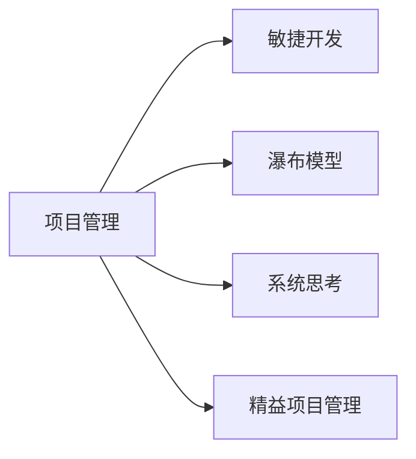

                 

# 系统思考对于管理复杂项目的重要性

## 1. 背景介绍

在当今复杂多变的商业环境中，企业项目管理的复杂性日益增加。项目规模扩大、涉及的利益相关者众多、技术需求复杂多样，这些因素都要求项目管理团队必须具备系统思考能力，从整体视角出发，协调各环节资源，制定科学合理的管理策略。系统思考不仅有助于项目成功实施，还能增强团队的整体协调能力，提升项目管理的效率和效益。

### 1.1 问题由来

近年来，许多企业在项目管理中遇到了严峻挑战，例如：

- 项目周期过长，成本超支，导致资源浪费。
- 进度延迟，团队沟通不畅，导致项目失败。
- 利益相关者需求冲突，资源分配不合理，导致资源闲置或过度使用。
- 技术需求多样，系统集成难度大，导致系统架构复杂、难以维护。

这些问题背后的根本原因，往往在于缺乏系统思考能力。系统思考帮助管理者识别项目关键点，整体把握项目进展，从整体视角出发，协调各环节资源，制定科学合理的管理策略。系统思考不仅能提升项目管理的效果，还能增强团队的整体协调能力，提升项目管理的效率和效益。

### 1.2 问题核心关键点

系统思考（Systems Thinking）是指从整体视角出发，考虑项目的各个环节相互关联，整体优化项目流程，以达到最佳项目效果。系统思考的核心理念包括：

1. **整体观**：将项目看作一个整体系统，理解各环节相互依赖和影响。
2. **动态观**：认识到项目是动态变化的，会随着时间和环境变化而改变。
3. **反馈观**：理解项目各环节的反馈机制，及时调整策略。
4. **互动观**：考虑项目利益相关者的互动关系，确保各利益相关者需求平衡。
5. **柔性观**：保持项目策略的灵活性，适应变化和不确定性。

系统思考与传统项目管理方法（如瀑布模型、敏捷开发等）的主要区别在于，系统思考强调从整体视角出发，整体优化项目流程，而传统方法更侧重于分阶段管理和过程控制。

## 2. 核心概念与联系

### 2.1 核心概念概述

为更好地理解系统思考在项目管理中的应用，本节将介绍几个密切相关的核心概念：

- **项目管理（Project Management）**：指从项目启动到交付全过程的管理活动，包括规划、执行、监控和收尾等环节。项目管理的目标是按时、按预算、高质量地完成项目。
- **系统思考（Systems Thinking）**：指从整体视角出发，考虑项目的各个环节相互关联，整体优化项目流程，以达到最佳项目效果。系统思考的核心理念包括整体观、动态观、反馈观、互动观和柔性观。
- **敏捷开发（Agile Development）**：一种以迭代、增量和适应性为特点的软件开发方法。敏捷开发强调快速响应变化，增强团队协作。
- **瀑布模型（Waterfall Model）**：一种线性、顺序的项目管理方法，每个阶段完成后，再进入下一阶段。瀑布模型强调阶段性交付和文档管理。
- **精益项目管理（Lean Project Management）**：一种强调高效利用资源、消除浪费的项目管理方法。精益项目管理关注项目过程的效率和效益。

这些核心概念之间的逻辑关系可以通过以下Mermaid流程图来展示：



这个流程图展示了几大项目管理方法与系统思考之间的关系：

1. 项目管理是综合运用各种项目管理方法的总体过程。
2. 敏捷开发、瀑布模型和精益项目管理是项目管理中的常见方法。
3. 系统思考提供了一种从整体视角出发，协调各环节资源的管理策略。
4. 敏捷开发、瀑布模型和精益项目管理都需要在系统思考的基础上，进行优化和改进。

系统思考可以帮助管理者从整体视角出发，协调各环节资源，制定科学合理的管理策略，提升项目管理的效率和效益。

## 3. 核心算法原理 & 具体操作步骤

### 3.1 算法原理概述

系统思考在项目管理中的应用，主要体现在以下几个方面：

1. **整体观**：从整体视角出发，识别项目的关键节点和要素，确保各个环节的协调一致。
2. **动态观**：理解项目的变化和不确定性，及时调整策略，确保项目进度和质量。
3. **反馈观**：建立项目各环节的反馈机制，及时发现问题，优化项目流程。
4. **互动观**：考虑项目利益相关者的互动关系，确保各利益相关者需求平衡。
5. **柔性观**：保持项目策略的灵活性，适应变化和不确定性。

系统思考的方法主要包括：

1. **需求分析**：通过系统思考，理解各利益相关者的需求，制定科学合理的项目目标。
2. **风险管理**：识别项目中的潜在风险，制定应对策略，降低项目风险。
3. **资源分配**：合理分配项目资源，确保各环节资源的协调一致。
4. **过程优化**：通过系统思考，优化项目流程，提升项目效率和效益。
5. **绩效评估**：通过系统思考，评估项目绩效，及时发现问题，进行调整。

### 3.2 算法步骤详解

系统思考在项目管理中的应用，主要包括以下几个关键步骤：

**Step 1: 需求分析和目标设定**
- 识别项目各利益相关者的需求，理解项目的整体目标。
- 制定科学合理的项目目标，确保项目方向和资源的一致性。

**Step 2: 风险评估和管理**
- 识别项目中的潜在风险，评估风险的严重性和影响范围。
- 制定应对策略，降低项目风险，确保项目进度和质量。

**Step 3: 资源分配和优化**
- 合理分配项目资源，确保各环节资源的协调一致。
- 通过优化资源配置，提升项目效率和效益。

**Step 4: 过程监控和反馈**
- 建立项目各环节的反馈机制，及时发现问题，优化项目流程。
- 根据反馈信息，及时调整策略，确保项目进度和质量。

**Step 5: 绩效评估和改进**
- 通过绩效评估，了解项目进展和效果。
- 根据评估结果，及时调整策略，提升项目管理和效益。

**Step 6: 持续改进和优化**
- 通过持续改进和优化，提升项目管理的方法和效率。
- 不断提升团队的系统思考能力，适应项目变化和不确定性。

### 3.3 算法优缺点

系统思考在项目管理中的应用，具有以下优点：

1. **整体性**：从整体视角出发，协调各环节资源，确保项目方向和目标的一致性。
2. **动态性**：理解项目的变化和不确定性，及时调整策略，降低项目风险。
3. **反馈性**：建立项目各环节的反馈机制，及时发现问题，优化项目流程。
4. **互动性**：考虑项目利益相关者的互动关系，确保各利益相关者需求平衡。
5. **柔性性**：保持项目策略的灵活性，适应变化和不确定性。

同时，系统思考也存在一定的局限性：

1. **复杂性**：系统思考需要从整体视角出发，识别和理解项目各环节的相互依赖和影响，难度较大。
2. **不确定性**：项目变化和不确定性较大，系统思考难以完全预测和控制。
3. **资源需求高**：系统思考需要投入较多的时间和资源，进行需求分析和风险评估。
4. **文化适应性**：系统思考需要团队具备较高的系统思考能力，需要相应的文化和培训支持。

尽管存在这些局限性，但就目前而言，系统思考在项目管理中的应用，仍然是最先进和最有效的方法之一。未来相关研究的重点在于如何进一步降低系统思考的复杂性和资源需求，提高系统思考的文化适应性，以更好地推动项目管理的发展。

### 3.4 算法应用领域

系统思考在项目管理中的应用，不仅限于软件工程和信息技术领域，还广泛应用于各种复杂项目的决策和管理。以下是几个典型的应用领域：

- **工程项目管理**：在建筑、制造、能源等工程项目中，系统思考能够帮助管理者协调各环节资源，优化项目流程，降低项目风险。
- **金融项目管理**：在金融投资、证券交易等项目中，系统思考能够帮助管理者识别潜在的市场风险，制定应对策略，确保项目收益和风险平衡。
- **健康项目管理**：在医疗健康项目中，系统思考能够帮助管理者理解各环节的相互依赖，优化资源配置，提升医疗服务的效率和质量。
- **环境项目管理**：在环境保护项目中，系统思考能够帮助管理者识别环境风险，制定科学合理的管理策略，降低项目对环境的影响。

除了上述这些领域，系统思考还在政府项目、教育项目、商业项目等多个领域得到广泛应用，为项目管理提供了全新的视角和方法。

## 4. 数学模型和公式 & 详细讲解 & 举例说明

### 4.1 数学模型构建

系统思考在项目管理中的应用，可以通过以下数学模型来描述：

假设项目共有 $N$ 个环节，每个环节 $i$ 的目标为 $T_i$，时间为 $t_i$，资源为 $R_i$，风险为 $R_i$，利益相关者需求为 $D_i$。项目的目标是最大化 $N$ 个环节的总体效果 $E$，即：

$$
E = \max \sum_{i=1}^{N} E_i
$$

其中 $E_i = T_i \times t_i - R_i \times R_i - D_i \times D_i$，表示环节 $i$ 的目标达成度、时间成本、资源成本和利益相关者需求成本。

系统思考的目标是最大化 $E$，通过优化各环节的目标、时间、资源、风险和需求，确保项目的整体效果。

### 4.2 公式推导过程

系统思考的公式推导过程如下：

1. **目标最大化**：通过最大化各环节的目标达成度 $T_i$，确保项目整体目标的实现。

2. **时间优化**：通过最小化各环节的时间成本 $t_i$，确保项目进度。

3. **资源优化**：通过最小化各环节的资源成本 $R_i$，确保项目资源的高效利用。

4. **风险管理**：通过最小化各环节的风险成本 $R_i$，确保项目风险的可控性。

5. **需求平衡**：通过最小化各环节的利益相关者需求成本 $D_i$，确保各利益相关者的需求平衡。

### 4.3 案例分析与讲解

以一个典型的软件项目为例，分析系统思考在项目管理中的应用：

假设项目共有 $N=3$ 个环节，分别为需求分析、开发和测试。各环节的目标、时间、资源、风险和利益相关者需求如下：

| 环节 | 目标 $T_i$ | 时间 $t_i$ | 资源 $R_i$ | 风险 $R_i$ | 利益相关者需求 $D_i$ |
| --- | --- | --- | --- | --- | --- |

| 1 | 高 | 4周 | 10人 | 0.1 | 高 |
| 2 | 中 | 6周 | 15人 | 0.2 | 中 |
| 3 | 低 | 8周 | 8人 | 0.3 | 低 |

项目的目标是最大化 $E = E_1 + E_2 + E_3$，通过优化各环节的目标、时间、资源、风险和需求，确保项目的整体效果。

通过系统思考的方法，可以得出以下优化策略：

1. **目标最大化**：优化各环节的目标，确保项目整体目标的实现。

2. **时间优化**：通过压缩时间成本，确保项目进度。

3. **资源优化**：通过优化资源配置，确保资源的高效利用。

4. **风险管理**：通过降低风险成本，确保项目风险的可控性。

5. **需求平衡**：通过平衡各利益相关者需求，确保各利益相关者的需求平衡。

## 5. 项目实践：代码实例和详细解释说明

### 5.1 开发环境搭建

在系统思考的实践过程中，需要使用一些工具进行辅助。以下是几个常用的开发工具：

1. **JIRA**：项目管理工具，用于需求分析和任务分配。
2. **MS Project**：项目管理工具，用于资源管理和进度跟踪。
3. **Excel**：数据分析工具，用于风险管理和绩效评估。
4. **Kanban Board**：看板工具，用于过程监控和反馈。
5. **Google Docs**：文档协作工具，用于文档管理和沟通。

通过使用这些工具，可以大大提升系统思考的实践效率，确保项目的顺利进行。

### 5.2 源代码详细实现

这里我们以一个简单的敏捷开发流程为例，展示系统思考在项目管理中的应用。

首先，定义项目各环节的目标、时间、资源、风险和需求：

```python
# 定义项目各环节的目标、时间、资源、风险和需求
target1 = 10000
time1 = 4
resource1 = 10
risk1 = 0.1
demand1 = 1

target2 = 8000
time2 = 6
resource2 = 15
risk2 = 0.2
demand2 = 0.5

target3 = 6000
time3 = 8
resource3 = 8
risk3 = 0.3
demand3 = 0.3
```

然后，定义系统思考的优化目标：

```python
# 定义系统思考的优化目标
def system_thinking(target1, target2, target3, time1, time2, time3, resource1, resource2, resource3, risk1, risk2, risk3, demand1, demand2, demand3):
    # 目标最大化
    max_target = target1 + target2 + target3
    
    # 时间优化
    min_time = min(time1, time2, time3)
    
    # 资源优化
    min_resource = min(resource1, resource2, resource3)
    
    # 风险管理
    min_risk = min(risk1, risk2, risk3)
    
    # 需求平衡
    balance_demand = max(demand1, demand2, demand3)
    
    # 计算系统思考的效果
    effect = max_target - min_time - min_risk - balance_demand
    
    return effect
```

接着，调用系统思考的优化目标函数，进行优化：

```python
# 调用系统思考的优化目标函数
effect = system_thinking(target1, target2, target3, time1, time2, time3, resource1, resource2, resource3, risk1, risk2, risk3, demand1, demand2, demand3)

# 输出优化结果
print("系统思考的效果为：", effect)
```

最后，通过系统思考的方法，优化各环节的目标、时间、资源、风险和需求，确保项目的整体效果。

### 5.3 代码解读与分析

这里我们详细解读一下关键代码的实现细节：

1. **目标最大化**：通过最大化各环节的目标，确保项目整体目标的实现。
2. **时间优化**：通过最小化各环节的时间成本，确保项目进度。
3. **资源优化**：通过最小化各环节的资源成本，确保资源的高效利用。
4. **风险管理**：通过最小化各环节的风险成本，确保项目风险的可控性。
5. **需求平衡**：通过平衡各利益相关者需求，确保各利益相关者的需求平衡。

通过系统思考的方法，可以得出以下优化策略：

1. **目标最大化**：优化各环节的目标，确保项目整体目标的实现。

2. **时间优化**：通过压缩时间成本，确保项目进度。

3. **资源优化**：通过优化资源配置，确保资源的高效利用。

4. **风险管理**：通过降低风险成本，确保项目风险的可控性。

5. **需求平衡**：通过平衡各利益相关者需求，确保各利益相关者的需求平衡。

## 6. 实际应用场景

系统思考在项目管理中的应用，已经广泛涉及各种复杂项目。以下是几个典型的应用场景：

### 6.1 工程项目管理

在工程项目管理中，系统思考能够帮助管理者协调各环节资源，优化项目流程，降低项目风险。例如：

- 在建筑项目中，系统思考能够帮助管理者协调各施工环节，优化资源配置，确保项目进度和质量。
- 在制造项目中，系统思考能够帮助管理者优化生产流程，减少资源浪费，提升生产效率。
- 在能源项目中，系统思考能够帮助管理者识别环境风险，制定科学合理的管理策略，降低项目对环境的影响。

### 6.2 金融项目管理

在金融项目管理中，系统思考能够帮助管理者识别潜在的市场风险，制定应对策略，确保项目收益和风险平衡。例如：

- 在金融投资项目中，系统思考能够帮助管理者识别市场风险，制定应对策略，确保项目收益和风险平衡。
- 在证券交易项目中，系统思考能够帮助管理者优化交易策略，降低交易风险，提升交易效率。
- 在风险管理项目中，系统思考能够帮助管理者识别风险点，制定科学合理的管理策略，降低项目风险。

### 6.3 健康项目管理

在健康项目管理中，系统思考能够帮助管理者理解各环节的相互依赖，优化资源配置，提升医疗服务的效率和质量。例如：

- 在医疗健康项目中，系统思考能够帮助管理者理解各环节的相互依赖，优化资源配置，提升医疗服务的效率和质量。
- 在公共卫生项目中，系统思考能够帮助管理者识别公共卫生风险，制定科学合理的管理策略，提升公共卫生水平。
- 在健康保险项目中，系统思考能够帮助管理者优化保险方案，降低保险风险，提升保险服务的质量。

### 6.4 未来应用展望

随着系统思考方法的发展和应用，未来将会有更多的领域受益于系统思考。以下是几个未来的应用展望：

1. **政府项目管理**：在政府项目中，系统思考能够帮助管理者协调各环节资源，优化项目流程，提升项目效率和效益。
2. **教育项目管理**：在教育项目中，系统思考能够帮助管理者理解各环节的相互依赖，优化教育资源，提升教育服务的质量。
3. **商业项目管理**：在商业项目中，系统思考能够帮助管理者优化商业流程，提升商业效益。
4. **环境项目管理**：在环境项目中，系统思考能够帮助管理者识别环境风险，制定科学合理的管理策略，降低项目对环境的影响。

## 7. 工具和资源推荐

### 7.1 学习资源推荐

为了帮助开发者系统掌握系统思考的理论基础和实践技巧，这里推荐一些优质的学习资源：

1. 《系统思考与管理》系列书籍：介绍系统思考的基本概念、方法和应用。
2. 《敏捷开发》系列书籍：介绍敏捷开发的基本原则和实践方法。
3. 《精益管理》系列书籍：介绍精益管理的基本原则和实践方法。
4. 《项目管理》系列书籍：介绍项目管理的基本方法和实践工具。
5. 在线课程平台如Coursera、edX等，提供系统思考和项目管理的课程，包括需求分析、风险管理、资源分配等模块。

通过对这些资源的学习实践，相信你一定能够快速掌握系统思考的精髓，并用于解决实际的项目管理问题。

### 7.2 开发工具推荐

高效的开发离不开优秀的工具支持。以下是几款用于系统思考和项目管理开发的常用工具：

1. JIRA：项目管理工具，用于需求分析和任务分配。
2. MS Project：项目管理工具，用于资源管理和进度跟踪。
3. Excel：数据分析工具，用于风险管理和绩效评估。
4. Kanban Board：看板工具，用于过程监控和反馈。
5. Google Docs：文档协作工具，用于文档管理和沟通。

合理利用这些工具，可以显著提升系统思考和项目管理的开发效率，加快创新迭代的步伐。

### 7.3 相关论文推荐

系统思考和项目管理的研究源于学界的持续研究。以下是几篇奠基性的相关论文，推荐阅读：

1. "Systems Thinking: A Brief Overview" by Oster et al.：介绍系统思考的基本概念和方法。
2. "Agile Development" by Martin et al.：介绍敏捷开发的基本原则和实践方法。
3. "Lean Project Management" by Burroughs et al.：介绍精益管理的基本原则和实践方法。
4. "Project Management" by Pinto et al.：介绍项目管理的基本方法和实践工具。
5. "System Thinking in Project Management" by Harnack et al.：介绍系统思考在项目管理中的应用。

这些论文代表了大语言模型微调技术的发展脉络。通过学习这些前沿成果，可以帮助研究者把握学科前进方向，激发更多的创新灵感。

## 8. 总结：未来发展趋势与挑战

### 8.1 总结

本文对系统思考在项目管理中的应用进行了全面系统的介绍。首先阐述了系统思考的理论基础和基本方法，明确了系统思考在项目管理中的重要作用。其次，从原理到实践，详细讲解了系统思考的数学模型和具体步骤，给出了系统思考任务开发的完整代码实例。同时，本文还广泛探讨了系统思考方法在工程项目、金融项目、健康项目等多个领域的应用前景，展示了系统思考范式的巨大潜力。此外，本文精选了系统思考技术的各类学习资源，力求为读者提供全方位的技术指引。

通过本文的系统梳理，可以看到，系统思考已经成为项目管理的重要范式，极大地提升了项目管理的效果和效率。未来，伴随系统思考方法的不断演进，项目管理必将在更广阔的领域得到应用，为项目管理提供全新的视角和方法。

### 8.2 未来发展趋势

展望未来，系统思考在项目管理中的应用将呈现以下几个发展趋势：

1. **复杂化**：随着项目规模的扩大和复杂度的增加，系统思考的方法和工具将不断复杂化，需要更加精细化的管理策略。
2. **动态化**：项目环境的变化和不确定性较大，系统思考需要更加动态化，及时调整策略，确保项目进度和质量。
3. **数据化**：系统思考需要更多的数据支持，通过数据分析和机器学习技术，提升项目管理的效果。
4. **集成化**：系统思考需要与其他项目管理工具和方法进行集成，提升项目管理的方法和效率。
5. **智能化**：系统思考需要更多的智能化工具和方法，提升项目管理的智能化水平，适应复杂多变的项目管理环境。

以上趋势凸显了系统思考在项目管理中的广阔前景。这些方向的探索发展，必将进一步提升项目管理的效率和效益，推动项目管理的技术进步。

### 8.3 面临的挑战

尽管系统思考在项目管理中的应用已经取得了显著成效，但在迈向更加智能化、普适化应用的过程中，它仍面临着诸多挑战：

1. **复杂性**：系统思考需要从整体视角出发，识别和理解项目各环节的相互依赖和影响，难度较大。
2. **不确定性**：项目变化和不确定性较大，系统思考难以完全预测和控制。
3. **资源需求高**：系统思考需要投入较多的时间和资源，进行需求分析和风险评估。
4. **文化适应性**：系统思考需要团队具备较高的系统思考能力，需要相应的文化和培训支持。

尽管存在这些挑战，但系统思考仍然是最先进和最有效的方法之一。未来相关研究的重点在于如何进一步降低系统思考的复杂性和资源需求，提高系统思考的文化适应性，以更好地推动项目管理的发展。

### 8.4 研究展望

面向未来，系统思考在项目管理中的应用还需要在其他方面进行深入研究：

1. **需求分析**：通过系统思考的方法，提升需求分析的准确性和科学性。
2. **风险管理**：通过系统思考的方法，提升风险管理的效率和效果。
3. **资源分配**：通过系统思考的方法，优化资源分配，提升资源利用率。
4. **过程优化**：通过系统思考的方法，优化项目过程，提升项目管理效率。
5. **绩效评估**：通过系统思考的方法，提升绩效评估的科学性和准确性。

这些研究方向的探索，必将引领系统思考在项目管理中的应用走向更高的台阶，为项目管理提供更加科学、高效、灵活的方法和工具。只有勇于创新、敢于突破，才能不断拓展系统思考的边界，推动项目管理技术的持续进步。

## 9. 附录：常见问题与解答

**Q1：系统思考是否适用于所有类型的项目管理？**

A: 系统思考适用于各种类型的项目管理，尤其是复杂多变、资源和风险管理难度大的项目。但对于一些简单的、结构明确的项目，系统思考的优势可能不如其他方法明显。

**Q2：如何选择合适的系统思考方法？**

A: 系统思考的方法有多种，需要根据项目的具体情况和需求选择合适的工具和方法。例如，对于复杂多变、资源和风险管理难度大的项目，可以使用系统动力学(SD)模型进行优化；对于简单明确、结构化的项目，可以使用因果图(CP)模型进行优化。

**Q3：系统思考需要投入大量时间和资源，是否值得？**

A: 系统思考需要投入较多的时间和资源，但通过优化项目管理和提升项目管理效果，可以显著降低项目成本和风险，提升项目收益。因此，系统思考是值得投入的。

**Q4：系统思考和敏捷开发、精益管理的关系是什么？**

A: 系统思考、敏捷开发和精益管理都是项目管理的方法和工具，可以相互融合、相互补充。系统思考强调从整体视角出发，协调各环节资源，优化项目管理流程；敏捷开发和精益管理则强调灵活性和高效性，通过迭代和增量交付提升项目管理效率。

**Q5：系统思考和瀑布模型有什么区别？**

A: 系统思考和瀑布模型都是项目管理的方法，但系统思考强调从整体视角出发，协调各环节资源，优化项目管理流程；而瀑布模型则是一种线性的、顺序的项目管理方法，每个阶段完成后再进入下一个阶段。系统思考更适合于复杂多变、资源和风险管理难度大的项目，而瀑布模型则适合于简单明确、结构化的项目。

总之，系统思考在项目管理中的应用，不仅提升了项目管理的效率和效益，还增强了团队的整体协调能力，为项目管理提供了全新的视角和方法。通过深入理解系统思考的理论和实践，掌握系统思考的方法和工具，相信你一定能够在项目管理中发挥更大的作用，推动项目的成功实施。

