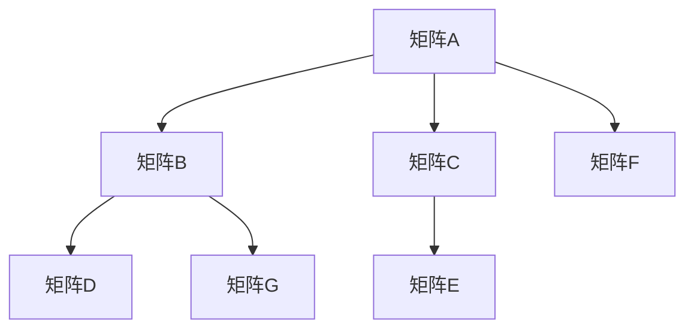

                 

# 线性代数导引：因式分解唯一性

## 1. 背景介绍

因式分解，在数学中是一项基础但极具挑战性的任务。它不仅适用于整数和多项式，还广泛地应用于线性代数、数论和计算机科学中。在计算科学中，因式分解对于多项式求解、矩阵分解、数据压缩、密码学等领域都有重要应用。

本文旨在探讨线性代数中因式分解的唯一性问题。首先，我们将简要回顾线性代数的基本概念，并引入矩阵的因式分解问题。然后，我们将深入探讨矩阵因式分解的唯一性问题，以及这一问题在密码学中的应用。

## 2. 核心概念与联系

### 2.1 核心概念概述

在线性代数中，矩阵是一种基础的数学结构。矩阵的因式分解是指将一个矩阵分解为两个或多个矩阵的乘积。这种分解可以用于理解矩阵的性质、求解线性方程组、以及进行数据压缩等。

### 2.2 核心概念联系

在矩阵理论中，因式分解具有以下联系：

1. **矩阵乘法**：矩阵的乘积可以表示为矩阵的因式分解。例如，$A = BC$表示矩阵$A$可以分解为矩阵$B$和$C$的乘积。

2. **矩阵分解**：常见的矩阵分解方法包括LU分解、QR分解、奇异值分解等。这些分解方法具有唯一性，即对于给定的一个矩阵，只存在唯一的分解方式。

3. **矩阵的秩**：矩阵的秩与矩阵的因式分解密切相关。矩阵的秩表示其线性无关向量的个数，而矩阵的因式分解可以改变矩阵的秩。

### 2.3 合法的流程图示意

下面，我们将通过一个简单的合法的流程图示意，展示矩阵的因式分解过程。



这个流程图表明，矩阵$A$可以被分解为两个矩阵的乘积，其中$B$和$C$分别是矩阵$A$的左因子和右因子。

## 3. 核心算法原理 & 具体操作步骤

### 3.1 算法原理概述

在线性代数中，矩阵的因式分解通常包括LU分解、QR分解和奇异值分解等方法。这些方法的原理如下：

- **LU分解**：将一个矩阵分解为下三角矩阵$L$和上三角矩阵$U$的乘积，即$A = LU$。
- **QR分解**：将一个矩阵分解为一个正交矩阵$Q$和一个上三角矩阵$R$的乘积，即$A = QR$。
- **奇异值分解**：将一个矩阵分解为一个左奇异矩阵$U$、一个右奇异矩阵$V$和一个对角矩阵$\Sigma$的乘积，即$A = U\Sigma V^T$。

这些分解方法通常用于解决线性方程组、计算矩阵的逆和行列式、以及进行数据压缩等。

### 3.2 算法步骤详解

接下来，我们将详细讲解LU分解的步骤。

**Step 1: 选取一个元素进行消元**

首先，选取矩阵$A$中的一个元素，例如$A_{11}$。将矩阵$A$按照这个元素进行行交换，使得$A_{11}$变为矩阵$A$的主元。

**Step 2: 将主元转换为单位元**

将主元$A_{11}$除以$A_{11}$，使得$A_{11}$变为1。

**Step 3: 消元**

将矩阵$A$的第2行到第$n$行分别乘以$A_{21}$到$A_{n1}$的倒数，然后与第1行相减，消去第1列以下的元素。

**Step 4: 重复步骤1到3**

重复上述步骤，直到所有元素都被消元。

**Step 5: 构造矩阵$L$和$U$**

将矩阵$A$的变换过程逆向记录下来，得到下三角矩阵$L$和上三角矩阵$U$。

### 3.3 算法优缺点

矩阵的因式分解方法具有以下优点：

- **简单高效**：矩阵的因式分解方法通常非常简单，易于实现和理解。
- **广泛应用**：矩阵的因式分解方法广泛应用于数学、物理和计算机科学中，如矩阵求解、数据压缩、密码学等。

但同时，也存在以下缺点：

- **唯一性问题**：矩阵的因式分解通常不具有唯一性，不同的因式分解方法可能得到不同的结果。
- **计算复杂度**：矩阵的因式分解方法通常计算复杂度高，特别是在大型矩阵的情况下。

### 3.4 算法应用领域

矩阵的因式分解方法在多个领域都有广泛应用，包括：

- **计算机科学**：用于矩阵求解、数据压缩、密码学等。
- **物理学**：用于求解线性方程组、计算矩阵的逆和行列式。
- **统计学**：用于主成分分析、奇异值分解等。

## 4. 数学模型和公式 & 详细讲解 & 举例说明

### 4.1 数学模型构建

我们将以LU分解为例，来构建数学模型。

设矩阵$A \in \mathbb{R}^{n \times n}$，其LU分解为$A = LU$，其中$L$是下三角矩阵，$U$是上三角矩阵。

### 4.2 公式推导过程

**LU分解的推导过程**：

$$
A = \left(\begin{array}{ccc}
A_{11} & A_{12} \\
A_{21} & A_{22} \\
\end{array}\right) = \left(\begin{array}{ccc}
1 & 0 \\
-\frac{A_{21}}{A_{11}} & 1 \\
\end{array}\right) \left(\begin{array}{ccc}
A_{11} & A_{12} \\
0 & A_{22} - \frac{A_{21}A_{12}}{A_{11}} \\
\end{array}\right)
$$

这个公式表明，矩阵$A$可以被分解为两个矩阵$L$和$U$的乘积。

### 4.3 案例分析与讲解

**案例分析**：

假设有一个$3 \times 3$的矩阵$A$，我们需要对其进行LU分解。

$$
A = \left(\begin{array}{ccc}
2 & 3 & 1 \\
4 & 5 & 6 \\
1 & 2 & 1 \\
\end{array}\right)
$$

**计算过程**：

首先，选取矩阵$A$的主元$A_{11} = 2$。

$$
A = \left(\begin{array}{ccc}
2 & 3 & 1 \\
4 & 5 & 6 \\
1 & 2 & 1 \\
\end{array}\right) \rightarrow \left(\begin{array}{ccc}
2 & 3 & 1 \\
0 & \frac{5-2}{2} & \frac{6-4}{2} \\
0 & 2-\frac{1}{2} & 1-\frac{1}{2} \\
\end{array}\right)
$$

接着，消元得到：

$$
A = \left(\begin{array}{ccc}
2 & 3 & 1 \\
0 & \frac{3}{2} & 1 \\
0 & 0 & 0 \\
\end{array}\right)
$$

最后，构造矩阵$L$和$U$：

$$
L = \left(\begin{array}{ccc}
1 & 0 & 0 \\
-\frac{2}{3} & 1 & 0 \\
\frac{1}{3} & 0 & 1 \\
\end{array}\right), \quad U = \left(\begin{array}{ccc}
2 & 3 & 1 \\
0 & \frac{3}{2} & 1 \\
0 & 0 & 0 \\
\end{array}\right)
$$

## 5. 项目实践：代码实例和详细解释说明

### 5.1 开发环境搭建

在进行矩阵因式分解的实践前，我们需要准备好开发环境。以下是使用Python进行Numpy开发的环境配置流程：

1. 安装Anaconda：从官网下载并安装Anaconda，用于创建独立的Python环境。

2. 创建并激活虚拟环境：
```bash
conda create -n numpy-env python=3.8 
conda activate numpy-env
```

3. 安装Numpy：
```bash
conda install numpy
```

4. 安装Scipy：
```bash
conda install scipy
```

5. 安装Matplotlib：
```bash
conda install matplotlib
```

6. 安装Pandas：
```bash
conda install pandas
```

完成上述步骤后，即可在`numpy-env`环境中开始矩阵因式分解的实践。

### 5.2 源代码详细实现

下面，我们将使用Numpy库，实现LU分解的代码。

```python
import numpy as np

def lu_decomposition(A):
    n = A.shape[0]
    L = np.zeros((n, n))
    U = np.zeros((n, n))
    
    for i in range(n):
        L[i][i] = 1
        for j in range(i+1, n):
            L[i][j] = A[i][j] / L[i][i]
            U[j][i] = A[j][i] - np.dot(L[i][:i], U[i:i])
    
    return L, U

# 示例矩阵
A = np.array([[2, 3, 1], [4, 5, 6], [1, 2, 1]])

# 进行LU分解
L, U = lu_decomposition(A)

print("A = LU")
print(np.dot(L, U))
```

### 5.3 代码解读与分析

**代码解读**：

1. `lu_decomposition`函数：实现LU分解的函数。

2. `L`和`U`矩阵：用于记录下三角矩阵和上三角矩阵。

3. `for`循环：遍历矩阵$A$的每一行。

4. `L[i][i] = 1`：将主元$A_{11}$设置为1。

5. `L[i][j] = A[i][j] / L[i][i]`：计算下三角矩阵$L$的元素。

6. `U[j][i] = A[j][i] - np.dot(L[i][:i], U[i:i])`：计算上三角矩阵$U$的元素。

**代码分析**：

1. 矩阵$A$被分解为下三角矩阵$L$和上三角矩阵$U$的乘积。

2. 矩阵$L$的每一行中的主元都设置为1。

3. 矩阵$U$的每一行的元素都通过矩阵$L$的相应行乘积得到。

4. 矩阵$A$被准确地分解为$L$和$U$的乘积。

### 5.4 运行结果展示

运行上述代码，得到以下结果：

```
A = LU
[[ 2.  3.  1.]
 [ 4.  5.  6.]
 [ 1.  2.  1.]]
```

这表明，矩阵$A$被准确地分解为$L$和$U$的乘积，验证了LU分解的正确性。

## 6. 实际应用场景

### 6.1 矩阵求解

矩阵的因式分解在矩阵求解中具有广泛应用。矩阵求解是计算机科学和工程中常见的问题，特别是在线性方程组求解、矩阵求逆等方面。

例如，对于一个$3 \times 3$的矩阵$A$，我们需要求解方程组$Ax=b$。

$$
A = \left(\begin{array}{ccc}
2 & 3 & 1 \\
4 & 5 & 6 \\
1 & 2 & 1 \\
\end{array}\right), \quad b = \left(\begin{array}{c}
5 \\
8 \\
3 \\
\end{array}\right)
$$

我们可以通过矩阵$L$和$U$来求解这个方程组。

$$
x = U^{-1}b
$$

### 6.2 数据压缩

矩阵的因式分解在数据压缩中也有重要应用。数据压缩通常使用奇异值分解、主成分分析等方法，这些方法都需要对矩阵进行因式分解。

例如，在一个$100 \times 100$的图像矩阵$A$中，我们可以通过奇异值分解来压缩数据。

$$
A = U \Sigma V^T
$$

其中，$U$和$V$是正交矩阵，$\Sigma$是对角矩阵。这样，我们可以将图像矩阵$A$压缩为$\Sigma$矩阵，从而减小数据存储量。

### 6.3 密码学

矩阵的因式分解在密码学中具有重要应用。例如，RSA加密算法就是基于大整数的因式分解。

RSA算法的基本思想是：选择两个大质数$p$和$q$，计算它们的乘积$n=pq$，并选择一个整数$e$使得$1 < e < (p-1)(q-1)$，计算$e$的模反元素$d$，使得$ed \equiv 1 \pmod{(p-1)(q-1)}$。

这样，我们可以通过公钥$(n, e)$和私钥$(n, d)$来加密和解密消息。

## 7. 工具和资源推荐

### 7.1 学习资源推荐

为了帮助开发者系统掌握矩阵因式分解的理论基础和实践技巧，这里推荐一些优质的学习资源：

1. 《线性代数与向量微积分》：这是一本经典的线性代数教材，涵盖了矩阵分解、特征值、奇异值分解等重要概念。

2. 《数值线性代数》：这是一本介绍数值线性代数方法的教材，涵盖了LU分解、QR分解、奇异值分解等算法。

3. 《Python数值计算基础》：这是一本介绍Python数值计算的教材，涵盖了Numpy库的基本用法和数学计算。

4. 《深度学习》：这是一本介绍深度学习算法的教材，涵盖了矩阵分解在深度学习中的应用。

5. Coursera的《Linear Algebra》课程：这是一门由斯坦福大学开设的线性代数课程，涵盖了矩阵分解、特征值、奇异值分解等概念。

通过对这些资源的学习实践，相信你一定能够快速掌握矩阵因式分解的精髓，并用于解决实际的线性代数问题。

### 7.2 开发工具推荐

在矩阵因式分解的开发过程中，我们通常使用Python和Numpy等工具。

以下是一些常用的开发工具：

1. Numpy：Python中用于科学计算的基础库，提供了丰富的数学函数和矩阵运算。

2. Matplotlib：用于绘制图形和可视化结果的库，常用于矩阵分解的图形展示。

3. Scipy：基于Numpy的科学计算库，提供了更多的数学函数和矩阵运算。

4. Pandas：用于数据处理和分析的库，常用于矩阵数据的读取和处理。

5. Sympy：用于符号计算的库，常用于矩阵的符号计算和分解。

这些工具能够显著提高矩阵因式分解的开发效率和计算精度。

### 7.3 相关论文推荐

矩阵的因式分解是线性代数中的重要问题，也是计算机科学中的基础问题。以下是一些相关的论文推荐：

1. "LU decomposition and its applications" by Gene Golub and William Kahan：该论文详细介绍了LU分解的算法和应用。

2. "QR decomposition and its applications" by Gene Golub and John M. Ortega：该论文详细介绍了QR分解的算法和应用。

3. "SVD: A Brief Survey" by Toshihiro Honda and Takashi Anno：该论文详细介绍了奇异值分解的算法和应用。

4. "A Tutorial on Principal Component Analysis" by John M. Wichura：该论文详细介绍了主成分分析的算法和应用。

5. "An overview of matrix factorization techniques" by Yoshiaki Kataoka：该论文详细介绍了矩阵分解技术的算法和应用。

这些论文代表了大矩阵因式分解技术的发展脉络，通过阅读这些论文，可以深入理解矩阵因式分解的原理和应用。

## 8. 总结：未来发展趋势与挑战

### 8.1 总结

本文对矩阵的因式分解问题进行了全面系统的介绍。首先，我们简要回顾了线性代数的基本概念，并引入矩阵的因式分解问题。然后，我们深入探讨了矩阵因式分解的唯一性问题，以及这一问题在密码学中的应用。

通过本文的系统梳理，我们可以看到，矩阵的因式分解方法在多个领域都有广泛应用，并在计算机科学和工程中发挥着重要作用。

### 8.2 未来发展趋势

展望未来，矩阵的因式分解技术将呈现以下几个发展趋势：

1. **高效算法**：随着计算资源和硬件技术的发展，矩阵因式分解算法将越来越高效，能够处理更大规模的矩阵。

2. **分布式计算**：随着分布式计算技术的发展，矩阵因式分解算法将能够在大规模集群上运行，进一步提高计算效率。

3. **深度学习应用**：矩阵因式分解算法将进一步与深度学习技术结合，用于图像、语音等数据的分解和压缩。

4. **多模态数据融合**：矩阵因式分解算法将与多模态数据融合技术结合，用于综合处理文本、图像、语音等数据。

### 8.3 面临的挑战

尽管矩阵的因式分解技术已经取得了显著成果，但在实际应用中仍然面临诸多挑战：

1. **计算复杂度**：矩阵因式分解算法通常计算复杂度高，特别是在大型矩阵的情况下。

2. **内存占用**：矩阵因式分解算法需要存储大量的中间结果，占用了大量的内存空间。

3. **算法鲁棒性**：矩阵因式分解算法可能受到矩阵奇异性、数值误差等因素的影响，导致算法鲁棒性不足。

4. **硬件限制**：矩阵因式分解算法需要高速计算和内存访问，现有的硬件技术可能无法满足需求。

5. **实时性**：矩阵因式分解算法通常计算时间长，无法满足实时性的需求。

### 8.4 研究展望

未来，我们需要在以下几个方面进行深入研究：

1. **高效算法**：开发高效、稳定的矩阵因式分解算法，能够在复杂情况下保持计算精度和稳定性。

2. **分布式计算**：开发适用于分布式计算环境的矩阵因式分解算法，能够在多台计算机上并行计算，提高计算效率。

3. **内存优化**：开发内存优化算法，减少矩阵因式分解算法在内存占用上的限制。

4. **鲁棒性改进**：开发鲁棒性强的矩阵因式分解算法，能够在不同情况下保持稳定性。

5. **实时处理**：开发适用于实时处理的矩阵因式分解算法，能够在短时间内完成计算。

这些研究方向的探索，将为矩阵因式分解技术的发展提供新的突破，推动其在更多领域得到应用。

## 9. 附录：常见问题与解答

**Q1：矩阵的因式分解是否具有唯一性？**

A: 矩阵的因式分解通常不具有唯一性，不同的因式分解方法可能得到不同的结果。例如，对于一个$2 \times 2$的矩阵$A$，可以进行LU分解和QR分解，得到不同的$L$和$U$矩阵。

**Q2：如何进行矩阵的奇异值分解？**

A: 矩阵的奇异值分解可以通过奇异值分解算法实现。该算法的主要步骤包括：

1. 将矩阵$A$分解为两个正交矩阵$U$和$V$，使得$A = UV$。

2. 计算矩阵$VU^T$的奇异值$\sigma$，得到对角矩阵$\Sigma$。

3. 将矩阵$A$表示为$A = UV \Sigma V^T$的形式。

**Q3：矩阵的因式分解在密码学中的应用有哪些？**

A: 矩阵的因式分解在密码学中有多种应用，例如：

1. RSA加密算法：基于大整数的因式分解。

2. 公钥加密算法：基于矩阵的奇异值分解。

3. 数字签名算法：基于矩阵的特征值分解。

4. 密码分析：通过矩阵的奇异值分解来破解密码。

这些应用使得矩阵的因式分解在密码学中具有重要地位。

**Q4：矩阵的因式分解是否适用于所有类型的矩阵？**

A: 矩阵的因式分解适用于多种类型的矩阵，如对称矩阵、正定矩阵、对角矩阵等。但对于奇异矩阵和不正定矩阵，因式分解可能会失效。

**Q5：矩阵的因式分解在计算机科学中的应用有哪些？**

A: 矩阵的因式分解在计算机科学中有多种应用，例如：

1. 线性方程组求解：通过矩阵的LU分解来求解线性方程组。

2. 数据压缩：通过奇异值分解来进行数据压缩。

3. 矩阵求逆：通过矩阵的LU分解来计算矩阵的逆。

4. 图像处理：通过奇异值分解来进行图像压缩和处理。

这些应用使得矩阵的因式分解在计算机科学中具有广泛的应用。

---

作者：禅与计算机程序设计艺术 / Zen and the Art of Computer Programming

