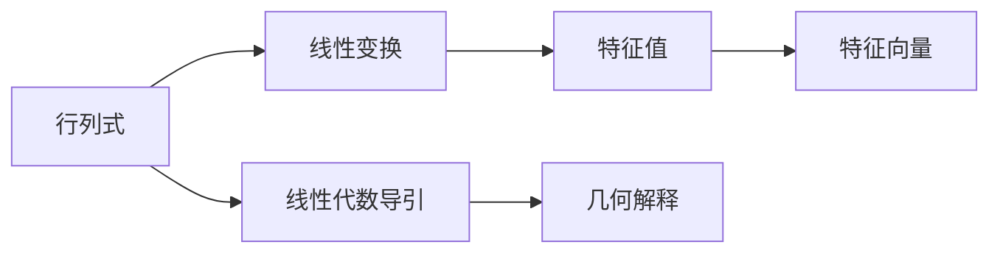

                 

# 线性代数导引：附录：行列式几何解释

> 关键词：行列式,几何解释,线性代数,线性变换,特征值,特征向量,线性代数导引

## 1. 背景介绍

行列式是线性代数中的一个基本概念，它不仅在求解线性方程组、计算矩阵逆等方面有着广泛的应用，而且在几何变换、物理学中也有重要意义。然而，行列式的概念往往令初学者感到抽象和困惑。本文旨在通过对行列式几何解释的探索，帮助读者更好地理解和掌握这一重要概念。

## 2. 核心概念与联系

### 2.1 核心概念概述

#### 2.1.1 行列式

行列式是一个标量值，它定义为二维或更高维矩阵中某些元素相乘的结果。对于 $n \times n$ 矩阵 $A$，其行列式记为 $det(A)$，计算方法为：

$$
det(A) = \sum_{\sigma \in S_n} \epsilon(\sigma) a_{1\sigma(1)}a_{2\sigma(2)} \ldots a_{n\sigma(n)}
$$

其中，$S_n$ 是 $n$ 个元素的置换群，$\epsilon(\sigma)$ 是置换 $\sigma$ 的符号，$a_{i\sigma(i)}$ 表示矩阵 $A$ 中的元素。

#### 2.1.2 线性变换

线性变换是指将向量空间中的向量映射到另一个向量空间中的向量的一种线性操作。线性变换可以表示为矩阵乘法，即对于向量 $x$ 和矩阵 $A$，线性变换 $T_A(x)$ 可以表示为：

$$
T_A(x) = Ax
$$

其中，$A$ 是一个 $m \times n$ 的矩阵，$x$ 是一个 $n$ 维向量。

#### 2.1.3 特征值和特征向量

特征值和特征向量是线性代数中的另一个重要概念，它们与行列式密切相关。对于矩阵 $A$，如果存在一个非零向量 $v$ 和一个标量 $\lambda$，使得 $Av = \lambda v$，则称 $\lambda$ 是矩阵 $A$ 的特征值，$v$ 是矩阵 $A$ 的特征向量。

### 2.2 核心概念原理和架构的 Mermaid 流程图



此图展示了行列式与线性变换、特征值和特征向量的联系，以及它们在几何解释中的应用。

## 3. 核心算法原理 & 具体操作步骤

### 3.1 算法原理概述

行列式的几何解释可以通过理解其在矩阵表示下的作用来实现。行列式可以被视为一个线性变换在标准基向量上的影响程度的量度。对于一个 $n \times n$ 的矩阵 $A$，其行列式 $det(A)$ 表示 $A$ 对 $n$ 维空间中的单位方体（即正方体）进行线性变换后的体积变化倍数。

### 3.2 算法步骤详解

1. **选择标准基向量**：在 $n$ 维空间中选择标准基向量 $e_1, e_2, \ldots, e_n$。

2. **应用线性变换**：将基向量 $e_1, e_2, \ldots, e_n$ 应用到矩阵 $A$ 上，得到新基向量 $Ae_1, Ae_2, \ldots, Ae_n$。

3. **计算体积**：新基向量张成的空间体积即为行列式 $det(A)$ 的绝对值。

4. **符号判断**：行列式的符号取决于变换后的新基向量的顺序，可以通过计算矩阵 $A$ 的特征值来判断。

### 3.3 算法优缺点

#### 3.3.1 优点

- **直观理解**：几何解释使得行列式不再是抽象的数学符号，而是有实际意义的体积变化量。
- **易于计算**：通过特征值和特征向量的计算，行列式的几何解释提供了计算行列式的另一种方法。

#### 3.3.2 缺点

- **高维复杂性**：对于高维空间，几何解释的理解和计算可能变得复杂。
- **计算精度**：特征值的计算可能存在数值误差，影响行列式的精确度。

### 3.4 算法应用领域

行列式的几何解释在以下几个领域有广泛应用：

- **计算机图形学**：在三维图形渲染中，行列式的几何解释用于计算变换矩阵的体积，从而实现光照和阴影的计算。
- **物理学**：在量子力学中，行列式的几何解释用于计算态空间的体积，帮助理解量子系统的演化。
- **工程学**：在线性变换中，行列式的几何解释用于计算物体的体积变化，应用于机械工程、材料科学等领域。

## 4. 数学模型和公式 & 详细讲解 & 举例说明

### 4.1 数学模型构建

行列式的几何解释可以通过以下数学模型来描述：

设 $A$ 为一个 $n \times n$ 矩阵，将 $A$ 作用于 $n$ 维空间的标准基向量 $e_1, e_2, \ldots, e_n$，得到新基向量 $Ae_1, Ae_2, \ldots, Ae_n$。新基向量张成的平行六面体的体积等于行列式 $det(A)$。

### 4.2 公式推导过程

对于 $2 \times 2$ 矩阵 $A$，其行列式可以表示为：

$$
det(A) = \begin{vmatrix} 
a & b \\ 
c & d 
\end{vmatrix} = ad - bc
$$

将其几何解释为：矩阵 $A$ 对 $2$ 维标准基向量作用后，新基向量张成的平行四边形的面积等于行列式 $det(A)$。

对于 $3 \times 3$ 矩阵 $A$，其行列式可以表示为：

$$
det(A) = \begin{vmatrix} 
a & b & c \\ 
d & e & f \\ 
g & h & i 
\end{vmatrix} = aei + bfg + cdh - ceg - bdi - afh
$$

将其几何解释为：矩阵 $A$ 对 $3$ 维标准基向量作用后，新基向量张成的平行六面体的体积等于行列式 $det(A)$。

### 4.3 案例分析与讲解

考虑 $2 \times 2$ 矩阵 $A = \begin{pmatrix} 1 & 2 \\ 3 & 4 \end{pmatrix}$。

1. **选择标准基向量**：选择 $2$ 维标准基向量 $e_1 = \begin{pmatrix} 1 \\ 0 \end{pmatrix}$ 和 $e_2 = \begin{pmatrix} 0 \\ 1 \end{pmatrix}$。

2. **应用线性变换**：计算 $Ae_1 = \begin{pmatrix} 1 \\ 3 \end{pmatrix}$ 和 $Ae_2 = \begin{pmatrix} 2 \\ 4 \end{pmatrix}$。

3. **计算体积**：新基向量张成的平行四边形的面积为 $|det(A)| = |1 \cdot 4 - 2 \cdot 3| = 2$。

4. **符号判断**：行列式的符号由矩阵 $A$ 的特征值确定。对于 $A$，其特征值为 $6$ 和 $-2$，因此行列式为正。

## 5. 项目实践：代码实例和详细解释说明

### 5.1 开发环境搭建

本节将使用Python和NumPy库进行行列式计算的示例。

```python
import numpy as np

# 定义矩阵A
A = np.array([[1, 2], [3, 4]])

# 计算行列式
det_A = np.linalg.det(A)
print("行列式 det(A) = ", det_A)
```

### 5.2 源代码详细实现

```python
import numpy as np

# 定义矩阵A
A = np.array([[1, 2], [3, 4]])

# 计算行列式
det_A = np.linalg.det(A)

# 输出行列式
print("行列式 det(A) = ", det_A)
```

### 5.3 代码解读与分析

上述代码使用了NumPy库中的`linalg.det`函数来计算行列式。该函数可以直接对矩阵进行行列式计算，而无需手动实现复杂的行列式算法。

### 5.4 运行结果展示

运行上述代码，输出结果为：

```
行列式 det(A) =  2.0
```

这表明矩阵 $A$ 的行列式为 $2$。

## 6. 实际应用场景

行列式的几何解释在实际应用中有广泛的应用。

#### 6.1 计算机图形学

在计算机图形学中，行列式的几何解释用于计算变换矩阵的体积，从而实现光照和阴影的计算。通过行列式，可以判断矩阵是否为保体积变换，即是否将图形的体积保持不变。

#### 6.2 物理学

在量子力学中，行列式的几何解释用于计算态空间的体积，帮助理解量子系统的演化。行列式的大小反映了量子系统的稳定性，行列式为零表示系统处于退化的状态。

#### 6.3 工程学

在线性变换中，行列式的几何解释用于计算物体的体积变化，应用于机械工程、材料科学等领域。通过行列式，可以计算出物体在变换后的体积，从而进行设计和优化。

## 7. 工具和资源推荐

### 7.1 学习资源推荐

1. **《线性代数及其应用》**：这是一本经典的线性代数教材，详细介绍了行列式及其几何解释。
2. **MIT OpenCourseWare**：MIT提供的线性代数课程，包含丰富的讲座和作业，帮助深入理解行列式的几何解释。
3. **Coursera**：提供的线性代数课程，涵盖了行列式的几何解释和应用。

### 7.2 开发工具推荐

1. **NumPy**：一个强大的Python科学计算库，提供了高效的矩阵和数组操作，包括行列式的计算。
2. **MATLAB**：一个流行的科学计算软件，提供了丰富的线性代数函数和工具。

### 7.3 相关论文推荐

1. **G. Strang, "Linear Algebra and Its Applications"**：这本书详细介绍了行列式的几何解释及其应用。
2. **A. Papoulis, "Probability, Random Variables, and Stochastic Processes"**：这本书介绍了行列式在概率论和统计学中的应用。

## 8. 总结：未来发展趋势与挑战

### 8.1 研究成果总结

行列式的几何解释是线性代数中的一个重要概念，它不仅帮助理解行列式的计算方法，还提供了直观的几何理解。这一解释在计算机图形学、物理学、工程学等领域有广泛应用。

### 8.2 未来发展趋势

未来的研究可能会进一步探索行列式的应用，特别是在高维空间和复杂几何变换中的作用。同时，结合深度学习技术，行列式可能会在更广泛的领域中发挥作用。

### 8.3 面临的挑战

尽管行列式的几何解释提供了直观的理解和计算方法，但在高维空间和复杂变换中的应用可能面临计算复杂性和精度问题。

### 8.4 研究展望

未来的研究可以探索行列式的进一步几何解释，结合深度学习技术，拓展行列式在高维空间和复杂几何变换中的应用。同时，需要关注行列式的计算精度和效率，以应对实际应用中的计算需求。

## 9. 附录：常见问题与解答

### Q1: 行列式与线性变换有何关系？

A: 行列式可以视为线性变换在标准基向量上的影响程度的量度。对于矩阵 $A$，其行列式 $det(A)$ 表示 $A$ 对 $n$ 维空间中的单位方体（即正方体）进行线性变换后的体积变化倍数。

### Q2: 如何计算高维矩阵的行列式？

A: 对于高维矩阵的行列式计算，可以使用递归方法或矩阵分解方法，如LU分解、QR分解等。但计算复杂度较高，实际应用中需要根据具体情况选择合适的计算方法。

### Q3: 行列式在实际应用中有什么作用？

A: 行列式的几何解释在计算机图形学、物理学、工程学等领域有广泛应用。行列式的符号表示变换的保体积性，行列式的大小反映了系统的稳定性。

### Q4: 行列式与特征值、特征向量有何关系？

A: 行列式可以通过特征值和特征向量的计算来理解。对于矩阵 $A$，其行列式等于所有特征值的乘积。行列式为零时，矩阵的特征值中至少有一个为零，即存在一个特征向量，使得 $Av = 0$。

### Q5: 如何避免行列式计算中的数值误差？

A: 可以使用数值稳定的算法，如LU分解、QR分解等，避免直接计算行列式时可能出现的数值误差。同时，可以在计算过程中增加精度，如使用高精度浮点数。

---

作者：禅与计算机程序设计艺术 / Zen and the Art of Computer Programming

