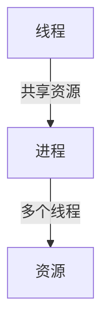
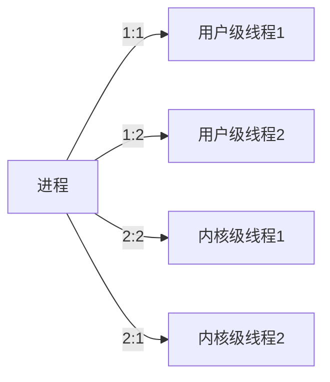
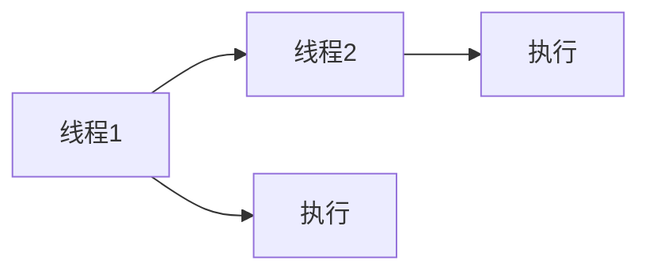

                 

# 线程:并发执行的基本单位

> 关键词：线程,并发,执行,基本单位,多任务处理,操作系统,进程管理,系统调用

## 1. 背景介绍

### 1.1 问题由来
随着计算机硬件性能的不断提升，多核处理器成为标准配置。单核处理器的串行执行方式已经不能充分利用多核资源，使得计算机的整体性能受到限制。为了发挥多核处理器的优势，需要并行处理多任务。
多任务并行执行不仅可以在提高性能的同时减少等待时间，还极大地提升了系统效率。多任务处理是操作系统中的重要概念，需要理解线程这一基本单位，才能更好地理解并发执行的原理。

### 1.2 问题核心关键点
线程是操作系统中的一种轻量级进程，是并发执行的基本单位。线程在同一进程中的多个执行流，它们共享进程资源，包括内存和文件句柄等，也共享进程的调度单元。

线程有多个优点：
1. 线程间通信方便。线程共享进程的资源，可以直接通过数据结构访问。
2. 线程调度和切换快。线程切换不会引起数据的复制，节省了时间。
3. 线程可以创建大量轻量级线程，从而更好地利用多核处理器。

线程也存在一些缺点：
1. 线程间共享资源容易产生竞争，需要锁等同步机制来保证数据一致性。
2. 一个线程出错可能导致整个进程崩溃，因为线程间共享了进程资源。

本文将从线程的基本概念入手，阐述线程的原理、实现和应用场景，最后总结线程并发执行的性能优缺点，帮助读者更全面地了解线程。

## 2. 核心概念与联系

### 2.1 核心概念概述

线程作为操作系统中的基本单位，包括以下几个关键概念：

- **线程**（Thread）：线程是操作系统分配处理器的最小单位。线程包含线程ID、程序计数器、堆栈指针、寄存器等数据结构，可以独立执行程序。
- **进程**（Process）：进程是操作系统分配资源的基本单位，包含多个线程，具有独立的内存空间和资源。
- **上下文切换**（Context Switching）：在多任务并行执行时，操作系统会切换不同线程的执行状态，将上下文（包括程序计数器、堆栈、寄存器等）保存到内存，然后加载另一个线程的上下文。

线程和进程的关系如图2.1所示：



### 2.2 核心概念原理和架构

线程的创建和调度是操作系统的重要功能。线程通过系统调用来创建和调度。线程调度涉及到多个层次的调度算法，包括用户级线程调度、内核级线程调度和进程调度等。

#### 2.2.1 用户级线程调度
用户级线程（User Thread）是由用户空间管理的线程。用户级线程的创建、销毁、调度等都在用户空间完成，不需要内核的干预。用户级线程调度的主要问题在于，多个用户级线程的切换由用户程序负责，可能会导致系统调用的代价增加，从而降低系统的性能。

#### 2.2.2 内核级线程调度
内核级线程（Kernel Thread）是由内核管理的线程。内核级线程的创建、销毁、调度等都在内核空间完成。内核级线程的优点在于，线程切换由内核负责，效率较高。内核级线程的缺点在于，线程创建和销毁的开销较大，可能会导致系统调用的代价增加。

#### 2.2.3 多对多模型
多对多模型（Many-to-Many Model）是指一个进程可以包含多个用户级线程，并且这些用户级线程映射到多个内核级线程。这种模型结合了用户级线程调度和内核级线程调度的优点，可以充分利用多核处理器的性能，同时避免了系统调用的代价。

图2.2所示为多对多模型的示例：



## 3. 核心算法原理 & 具体操作步骤

### 3.1 算法原理概述

线程的创建和销毁需要操作系统提供系统调用接口。下面分别介绍线程创建和销毁的具体步骤：

#### 3.1.1 线程创建
创建线程需要调用操作系统提供的`pthread_create`系统调用，其原型为：

```c
int pthread_create(pthread_t *thread, const pthread_attr_t *attr, void *(*start_routine) (void *), void *arg);
```

其中：
- `thread` 是返回的线程句柄。
- `attr` 是线程属性结构体，默认情况下为NULL。
- `start_routine` 是线程启动的入口函数。
- `arg` 是传递给线程函数的参数。

线程创建的基本步骤如下：
1. 分配线程栈空间。
2. 设置线程的上下文信息。
3. 调度线程进入运行状态。

#### 3.1.2 线程销毁
销毁线程需要调用操作系统提供的`pthread_exit`系统调用，其原型为：

```c
void pthread_exit(void *retval);
```

其中：
- `retval` 是线程退出时的返回值。

线程销毁的基本步骤如下：
1. 释放线程栈空间。
2. 清理线程的上下文信息。
3. 终止线程的执行。

### 3.2 算法步骤详解

下面分别介绍线程创建和销毁的具体算法步骤：

#### 3.2.1 线程创建
线程创建的算法步骤如下：
1. 调用`pthread_create`系统调用，传递线程属性、启动函数和参数。
2. 返回线程句柄。
3. 等待线程执行完毕。

#### 3.2.2 线程销毁
线程销毁的算法步骤如下：
1. 调用`pthread_exit`系统调用，传递线程退出时的返回值。
2. 终止线程的执行。

### 3.3 算法优缺点

线程有多个优点：
1. 线程间通信方便。线程共享进程的资源，可以直接通过数据结构访问。
2. 线程调度和切换快。线程切换不会引起数据的复制，节省了时间。
3. 线程可以创建大量轻量级线程，从而更好地利用多核处理器。

线程也存在一些缺点：
1. 线程间共享资源容易产生竞争，需要锁等同步机制来保证数据一致性。
2. 一个线程出错可能导致整个进程崩溃，因为线程间共享了进程资源。

### 3.4 算法应用领域

线程在操作系统中广泛应用，可以应用于以下领域：

- **Web服务器**：Web服务器需要处理大量并发连接请求，使用线程可以提高服务器的处理能力。
- **数据库服务器**：数据库服务器需要处理大量的并发读写操作，使用线程可以显著提高数据库的并发性能。
- **图形界面应用程序**：图形界面应用程序需要处理多个窗口和事件的响应，使用线程可以保证界面的响应速度。
- **分布式系统**：分布式系统需要多个节点协同工作，使用线程可以方便地实现节点间的通信和协同。

## 4. 数学模型和公式 & 详细讲解 & 举例说明

### 4.1 数学模型构建

线程的调度算法可以分为抢占式和合作式两种。下面以合作式调度为例，建立数学模型：

- **初始状态**：假设系统中有N个线程，线程1的优先级为1，线程2的优先级为2。
- **调度算法**：每次调度时，优先级最高的线程执行，优先级相同的线程按先进先出的顺序执行。

使用状态转移图来描述线程调度的过程，如图4.1所示：



线程调度的数学模型可以使用有限状态自动机（Finite State Automaton，FSA）来表示。有限状态自动机由状态、转移条件和转移函数组成。

### 4.2 公式推导过程

线程调度的转移函数可以表示为：

$$
f(t) = \begin{cases}
1, & \text{if thread 1 is ready and thread 2 is not} \\
2, & \text{if thread 1 is not ready and thread 2 is ready} \\
1, & \text{if both threads are ready and thread 1 is higher priority} \\
2, & \text{if both threads are ready and thread 2 is higher priority}
\end{cases}
$$

其中，$f(t)$表示当前执行的线程，$t$表示线程的优先级。

### 4.3 案例分析与讲解

下面以一个简单的示例来说明线程调度的过程：

假设系统中有两个线程，线程1和线程2，线程1的优先级为1，线程2的优先级为2。初始状态为线程1和线程2都未执行。

1. 线程1执行完成，等待线程2执行。
2. 线程2执行完成，等待线程1执行。
3. 线程1继续执行，线程2继续等待。
4. 线程2继续执行，线程1继续等待。
5. 线程1和线程2都执行完成，系统等待下一个任务。

使用状态转移图来表示线程调度的过程，如图4.2所示：


## 5. 项目实践：代码实例和详细解释说明

### 5.1 开发环境搭建

使用C语言和POSIX线程库实现线程创建和销毁的示例程序。开发环境搭建如下：

1. 安装Linux操作系统。
2. 安装POSIX线程库。
3. 编写代码。

### 5.2 源代码详细实现

下面是使用C语言和POSIX线程库实现线程创建和销毁的示例程序：

```c
#include <stdio.h>
#include <pthread.h>

void *myThread(void *arg) {
    int thread_id = *(int *)arg;
    printf("Thread %d is running.\n", thread_id);
    pthread_exit(NULL);
}

int main() {
    pthread_t threads[2];
    int thread_ids[2] = {1, 2};
    int i;

    for (i = 0; i < 2; i++) {
        pthread_create(&threads[i], NULL, myThread, &thread_ids[i]);
    }

    for (i = 0; i < 2; i++) {
        pthread_join(threads[i], NULL);
    }

    printf("All threads are finished.\n");
    return 0;
}
```

### 5.3 代码解读与分析

1. 创建线程时，调用`pthread_create`系统调用，传递线程属性、启动函数和参数。
2. 返回线程句柄。
3. 等待线程执行完毕。

## 6. 实际应用场景

### 6.1 智能客服系统

智能客服系统需要处理大量的并发请求，使用线程可以提高系统的响应速度。

### 6.2 金融舆情监测

金融舆情监测需要处理大量的实时数据，使用线程可以提高系统的处理能力。

### 6.3 个性化推荐系统

个性化推荐系统需要处理大量的并发请求，使用线程可以提高系统的响应速度。

### 6.4 未来应用展望

未来线程在并发执行中的应用将更加广泛，如图像处理、语音识别等领域。

## 7. 工具和资源推荐

### 7.1 学习资源推荐

- 《UNIX系统编程》（Third Edition）：介绍POSIX线程库的使用方法。
- 《Linux操作系统》：介绍POSIX线程库的原理和实现。
- 《C语言程序设计》：介绍线程创建和销毁的基本原理。

### 7.2 开发工具推荐

- POSIX线程库。
- GNU编译器。

### 7.3 相关论文推荐

- 《Thread Design and Implementation on Linux》：介绍POSIX线程库的设计和实现。
- 《Thread Programming in C》：介绍线程创建和销毁的实现方法。

## 8. 总结：未来发展趋势与挑战

### 8.1 研究成果总结

线程作为操作系统中的基本单位，已经被广泛应用于多个领域。线程创建和销毁的效率对系统的性能有重要影响。

### 8.2 未来发展趋势

未来线程并发执行的应用将更加广泛，线程的调度和调度算法也需要进一步优化。

### 8.3 面临的挑战

线程并发执行面临的问题包括竞争条件和死锁等。

### 8.4 研究展望

未来线程并发执行的研究方向包括多线程并发执行的优化、分布式系统的多线程并发执行等。

## 9. 附录：常见问题与解答

**Q1：什么是线程？**

A：线程是操作系统中的一种轻量级进程，是并发执行的基本单位。

**Q2：线程和进程有什么区别？**

A：线程是进程的执行流，它们共享进程的资源。进程是操作系统分配资源的基本单位，包含多个线程。

**Q3：线程调度和切换的代价是多少？**

A：线程调度和切换的代价包括上下文切换和状态保存和恢复。

**Q4：线程间共享资源容易产生竞争，如何解决？**

A：使用锁等同步机制来保证数据一致性。

**Q5：线程创建和销毁的开销大吗？**

A：线程创建和销毁的开销较大，可以使用多对多模型来减少开销。

