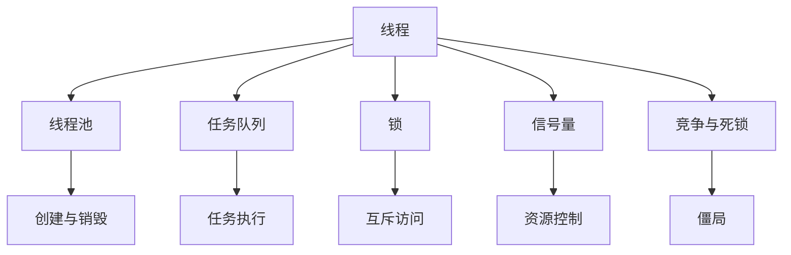

                 

## 1. 背景介绍

### 1.1 问题由来

现代计算机系统的硬件性能和软件性能已经达到了前所未有的高度。然而，随着CPU和内存等硬件资源成本的下降，以及人工智能、大数据等应用场景对计算性能需求的激增，高吞吐量系统的设计和实现变得愈发重要。在高并发、高可用、低延迟等要求日益严格的背景下，如何有效管理线程，提升系统性能，是一个迫切需要解决的问题。

### 1.2 问题核心关键点

线程管理是系统设计中的核心问题之一，也是高吞吐量系统设计和优化的重要手段。在多线程并发执行的场景中，如何合理配置线程数量、分配任务、同步线程、避免竞争和死锁等问题，直接影响系统的性能和稳定性。

线程管理的关键在于：

- 线程数量：线程数量过多会导致上下文切换频繁，线程数量过少则可能无法充分利用多核CPU资源。
- 任务分配：高效的任务分配算法能够平衡负载，避免线程饥饿和资源浪费。
- 同步机制：合适的同步机制能够保证线程安全，防止数据竞争和死锁。
- 竞争与死锁：避免竞争和死锁，确保系统在多线程环境下的稳定性。

本文将系统介绍线程管理的关键概念，详细解析线程管理算法的原理，并通过实践案例展示线程管理技术在高吞吐量系统中的实际应用。

### 1.3 问题研究意义

合理管理线程是构建高效、稳定、可扩展的计算机系统的基础。通过深入了解线程管理的原理和技巧，可以有效提升系统的吞吐量，增强系统的响应速度和稳定性，确保系统在极端负载下的可靠性和安全性。这对提高用户体验、优化资源利用、促进业务增长具有重要意义。

## 2. 核心概念与联系

### 2.1 核心概念概述

要深入理解线程管理，首先需要掌握几个核心概念：

- **线程（Thread）**：线程是操作系统中轻量级的执行单元，由线程ID、程序计数器、寄存器组、堆栈等组成。每个线程可以独立运行，并与其他线程共享进程的资源。
- **线程池（Thread Pool）**：线程池是预先创建并维护的一组线程，可以重复利用，避免频繁创建和销毁线程的开销。线程池由一组固定数量的工作线程和任务队列组成。
- **任务队列（Task Queue）**：任务队列用于存储待执行的任务，可以按优先级排序、使用消息队列等机制实现。
- **锁（Lock）和信号量（Semaphore）**：锁和信号量用于保护共享资源的互斥访问，防止数据竞争和死锁。
- **竞争与死锁**：竞争是指多个线程同时访问共享资源，可能导致数据不一致和性能下降。死锁是指多个线程互相等待对方释放资源，导致系统陷入僵局。

这些核心概念之间的关系可以通过以下Mermaid流程图来展示：



这个流程图展示了线程管理的基本流程：

1. 线程由操作系统管理，通过线程池进行创建和销毁。
2. 任务队列存储待执行的任务，线程池中的工作线程从任务队列中获取任务并执行。
3. 锁和信号量用于控制共享资源的互斥访问和资源控制。
4. 竞争与死锁是线程管理中需要避免的主要问题。

## 3. 核心算法原理 & 具体操作步骤

### 3.1 算法原理概述

线程管理涉及多个关键算法，包括线程池管理、任务调度、同步控制等。其核心思想是通过合理配置和调度线程，高效利用硬件资源，最大化系统性能。

### 3.2 算法步骤详解

线程管理算法包括以下几个关键步骤：

**Step 1: 创建线程池**

线程池的创建包括线程数量、堆栈大小等配置。创建线程池时，需要根据系统的硬件资源、任务负载等实际情况，合理配置线程数量和堆栈大小。例如，可以设置线程池大小为系统CPU核心数，每个线程的堆栈大小为几MB。

**Step 2: 任务调度**

任务调度是线程管理的核心部分，决定了任务的分配和执行方式。常见的任务调度算法包括：

- **轮询调度（Round-Robin Scheduling）**：按照线程顺序依次分配任务，适用于任务负载均衡的情况。
- **工作窃取（Work Stealing）**：高负载线程从任务队列中窃取任务，分配给低负载线程，提高资源利用率。
- **基于优先级的调度（Priority-Based Scheduling）**：按照任务优先级分配任务，高优先级任务优先执行，适用于紧急任务的处理。

**Step 3: 同步控制**

同步控制是防止数据竞争和死锁的关键手段。常见的同步机制包括：

- **锁（Lock）**：通过锁机制实现对共享资源的互斥访问，例如使用互斥锁（Mutex）或读写锁（Reader-Writer Lock）。
- **信号量（Semaphore）**：通过信号量实现对共享资源的控制，例如使用二元信号量（Semaphore）或计数信号量（Semaphore Counting）。
- **条件变量（Condition Variable）**：通过条件变量实现线程之间的通信和等待，例如使用条件变量（Condition Variable）。

**Step 4: 避免竞争与死锁**

竞争和死锁是线程管理中需要避免的主要问题。防止竞争和死锁的方法包括：

- **避免共享资源**：尽量减少线程之间的共享资源，减少数据竞争的可能性。
- **使用原子操作**：使用原子操作（Atomic Operation）保证对共享资源的操作是不可分割的。
- **避免死锁**：确保线程获取资源的顺序一致，例如使用资源分配图（Resource Allocation Graph）判断是否存在死锁。

### 3.3 算法优缺点

线程管理算法的优缺点如下：

**优点：**

- **提高并发性能**：通过合理配置和调度线程，可以高效利用多核CPU资源，提升系统的并发性能。
- **优化资源利用**：线程池和任务队列机制可以减少线程创建和销毁的开销，优化资源利用。
- **保障线程安全**：锁和信号量机制可以防止数据竞争和死锁，确保线程安全。

**缺点：**

- **复杂性高**：线程管理涉及的算法和机制较为复杂，实现难度较大。
- **性能瓶颈**：锁和信号量等同步机制可能成为性能瓶颈，需要优化实现方式。
- **稳定性风险**：多线程环境下，数据竞争和死锁可能导致系统不稳定。

### 3.4 算法应用领域

线程管理算法在多个领域得到了广泛应用，例如：

- **数据库系统**：数据库系统使用线程池管理连接池，确保高并发场景下的性能和稳定性。
- **Web服务器**：Web服务器使用线程池管理连接池，确保高并发请求的处理。
- **游戏引擎**：游戏引擎使用线程池管理渲染和逻辑线程，确保高帧率和高并发的网络通信。

## 4. 数学模型和公式 & 详细讲解 & 举例说明

### 4.1 数学模型构建

线程管理算法的数学模型主要包括任务调度模型和同步控制模型。

**任务调度模型：**

任务调度模型描述了任务的分配和执行方式。假设线程池中有$n$个线程，任务队列中有$m$个任务，每个任务需要$t$个时间单位执行。则任务调度模型可以表示为：

$$
\begin{aligned}
& \text{任务调度时间} = n \times \max(\lceil \frac{t}{n} \rceil) \\
& \text{任务执行时间} = \sum_{i=1}^m \min(\lceil \frac{t}{n} \rceil, t)
\end{aligned}
$$

其中，$\lceil \cdot \rceil$表示向上取整。任务调度时间表示任务在线程池中分配和执行的总时间，任务执行时间表示任务在单个线程上执行的总时间。

**同步控制模型：**

同步控制模型描述了锁和信号量的实现方式。假设有一个共享资源$R$，使用互斥锁（Mutex）和二元信号量（Semaphore）进行同步控制。则同步控制模型可以表示为：

$$
\begin{aligned}
& \text{互斥锁等待时间} = \sum_{i=1}^n \min(\frac{1}{k}, \frac{1}{m})
\end{aligned}
$$

其中，$k$表示互斥锁的获取次数，$m$表示信号量的获取次数。互斥锁等待时间表示线程获取互斥锁时的等待时间。

### 4.2 公式推导过程

任务调度时间可以进一步推导为：

$$
\text{任务调度时间} = n \times \max(\lceil \frac{t}{n} \rceil) = n \times \max(\frac{t}{n} + \frac{t}{n} \mod 1) = n \times (\frac{t}{n} + \max(\frac{t}{n} \mod 1))
$$

其中，$\max(\frac{t}{n} \mod 1)$表示向上取整后的余数。当任务量$m$远大于线程数$n$时，任务调度时间近似为$m$个时间单位。

互斥锁等待时间可以进一步推导为：

$$
\text{互斥锁等待时间} = \sum_{i=1}^n \min(\frac{1}{k}, \frac{1}{m}) = \frac{n}{k} \times \min(1, \frac{k}{m})
$$

其中，$\frac{k}{m}$表示获取互斥锁的平均等待次数。当$m$远大于$k$时，互斥锁等待时间近似为$\frac{1}{m}$个时间单位。

### 4.3 案例分析与讲解

假设有一个包含100个任务的任务队列，线程池大小为4，每个任务需要2个时间单位执行。使用工作窃取算法进行任务调度，互斥锁和二元信号量进行同步控制。分析任务调度时间和互斥锁等待时间。

**任务调度时间：**

- 任务队列大小$m=100$，线程数$n=4$，任务需要$t=2$个时间单位执行。
- 任务调度时间$n \times \max(\lceil \frac{t}{n} \rceil) = 4 \times \max(\lceil \frac{2}{4} \rceil) = 4 \times 1 = 4$个时间单位。

**互斥锁等待时间：**

- 互斥锁的平均等待次数$\frac{k}{m} = \frac{1}{4 \times 100} = 0.01$。
- 互斥锁等待时间$\frac{n}{k} \times \min(1, \frac{k}{m}) = \frac{4}{0.01} \times \min(1, 0.01) = 400 \times 1 = 400$个时间单位。

## 5. 项目实践：代码实例和详细解释说明

### 5.1 开发环境搭建

在进行线程管理实践前，我们需要准备好开发环境。以下是使用C++进行线程管理的开发环境配置流程：

1. 安装Visual Studio：从官网下载并安装Visual Studio，用于编写和编译C++代码。
2. 安装Boost库：从官网下载并安装Boost库，用于实现线程管理的相关功能。
3. 安装gcc：从官网下载并安装gcc，用于编译C++代码。

完成上述步骤后，即可在Visual Studio中使用Boost库进行线程管理的开发。

### 5.2 源代码详细实现

下面我们以一个简单的线程池实现为例，展示如何使用Boost库进行线程管理。

```cpp
#include <iostream>
#include <boost/thread/thread.hpp>
#include <boost/thread/mutex.hpp>
#include <boost/thread/condition_variable.hpp>

class ThreadPool {
public:
    ThreadPool(int size) : stop(false), count(0) {
        for (int i = 0; i < size; ++i) {
            workers.create_thread(boost::bind(&ThreadPool::worker, this));
        }
    }

    template <class F>
    void enqueue(F f) {
        boost::mutex::scoped_lock lock(mutex);
        work.emplace(std::move(f));
        if (!running && ++count == size()) {
            running = true;
            workers.join();
            running = false;
            count = 0;
        }
        cv.notify_one();
    }

    ~ThreadPool() {
        enqueue([this] { stop = true; cv.notify_all(); });
        workers.join();
    }

private:
    void worker() {
        while (true) {
            boost::mutex::scoped_lock lock(mutex);
            cv.wait(lock, [this] { return stop || !work.empty(); });
            if (stop && work.empty()) {
                break;
            }
            auto f = std::move(work.top());
            work.pop();
            f();
        }
    }

    boost::condition_variable cv;
    boost::mutex mutex;
    std::deque<std::function<void()>> work;
    boost::thread_group workers;
    bool running;
    size_t count;
};
```

以上代码实现了基本的线程池功能，包括以下几个关键部分：

- `ThreadPool`类：表示线程池，包括线程的创建、销毁、任务队列等。
- `enqueue`方法：将任务添加到任务队列中，并在必要时启动一个新的工作线程。
- `worker`方法：工作线程的执行函数，从任务队列中获取任务并执行。

### 5.3 代码解读与分析

让我们再详细解读一下关键代码的实现细节：

**ThreadPool类：**

- `ThreadPool`类的构造函数：初始化线程池大小、任务队列、互斥锁和条件变量等。
- `stop`变量：表示线程池是否需要停止。
- `count`变量：表示当前线程数。

**enqueue方法：**

- `lock`变量：表示互斥锁，用于保护任务队列的访问。
- `work`队列：表示任务队列，存储待执行的任务。
- `running`变量：表示线程池是否正在运行。

**worker方法：**

- `lock`变量：表示互斥锁，用于保护任务队列的访问。
- `cv`变量：表示条件变量，用于线程间的通信和等待。

**线程池的使用：**

```cpp
ThreadPool pool(4);
for (int i = 0; i < 10; ++i) {
    pool.enqueue([i] {
        std::cout << "Task " << i << " is running" << std::endl;
        boost::this_thread::sleep_for(boost::chrono::milliseconds(100));
    });
}
```

以上代码创建了一个包含4个工作线程的线程池，并提交了10个任务。每个任务打印一个信息，并休眠100毫秒。

## 6. 实际应用场景

### 6.1 智能客服系统

智能客服系统需要高效处理大量的用户咨询请求，确保响应速度快、准确率高。通过线程管理技术，可以实现多线程并发处理用户请求，提升系统的吞吐量和响应速度。

在智能客服系统中，可以使用线程池管理连接池，确保高并发场景下的性能和稳定性。例如，将每个连接请求分配到一个工作线程中处理，并通过工作窃取算法进行任务调度。同时，使用互斥锁和条件变量确保数据同步和安全。

### 6.2 金融舆情监测

金融舆情监测系统需要实时监测市场舆论动向，并在发现异常时及时报警。通过线程管理技术，可以实现多线程并发处理舆情数据，提升系统的实时性和可靠性。

在金融舆情监测系统中，可以使用线程池管理数据处理线程，确保高并发场景下的性能和稳定性。例如，将舆情数据分配到一个工作线程中处理，并通过互斥锁和条件变量确保数据同步和安全。同时，使用工作窃取算法进行任务调度，确保高负载线程能够及时处理大量数据。

### 6.3 个性化推荐系统

个性化推荐系统需要高效处理用户的查询请求，并快速返回推荐结果。通过线程管理技术，可以实现多线程并发处理用户请求，提升系统的吞吐量和响应速度。

在个性化推荐系统中，可以使用线程池管理请求处理线程，确保高并发场景下的性能和稳定性。例如，将用户查询请求分配到一个工作线程中处理，并通过互斥锁和条件变量确保数据同步和安全。同时，使用工作窃取算法进行任务调度，确保高负载线程能够及时处理大量请求。

### 6.4 未来应用展望

未来，线程管理技术将在更多领域得到应用，为高吞吐量系统的设计和优化提供新的思路。

- **自动驾驶**：自动驾驶系统需要实时处理大量传感器数据和决策结果，确保系统的高并发性能和安全稳定。通过线程管理技术，可以实现多线程并发处理数据和决策，提升系统的吞吐量和响应速度。
- **物联网**：物联网系统需要高效处理大量的设备数据和网络通信，确保系统的实时性和可靠性。通过线程管理技术，可以实现多线程并发处理数据和通信，提升系统的吞吐量和响应速度。
- **云计算**：云计算系统需要高效处理大量的计算任务和数据处理请求，确保系统的扩展性和稳定性。通过线程管理技术，可以实现多线程并发处理任务和请求，提升系统的吞吐量和响应速度。

## 7. 工具和资源推荐

### 7.1 学习资源推荐

为了帮助开发者系统掌握线程管理技术，以下是几款推荐的在线资源：

- **《C++ Concurrency in Action》书籍**：详细介绍了多线程编程的各个方面，包括线程池、互斥锁、条件变量等。
- **《Boost C++ Libraries》文档**：Boost库提供了丰富的线程管理功能，包括线程池、互斥锁、条件变量等。
- **《Java Concurrency in Practice》书籍**：详细介绍了Java多线程编程的各个方面，包括线程池、锁、条件变量等。
- **《Python Threading and Multiprocessing》书籍**：详细介绍了Python多线程和多进程编程的各个方面，包括线程池、锁、条件变量等。

通过对这些资源的学习实践，相信你一定能够快速掌握线程管理的精髓，并用于解决实际的系统问题。

### 7.2 开发工具推荐

高效的工具可以大大提高线程管理的开发效率。以下是几款常用的线程管理开发工具：

- **Visual Studio**：功能强大的IDE，支持多线程编程和调试。
- **Boost库**：C++线程管理库，提供了丰富的线程管理功能，包括线程池、互斥锁、条件变量等。
- **Python标准库**：Python标准库中提供了`threading`和`concurrent.futures`模块，支持多线程和异步编程。
- **Java标准库**：Java标准库中提供了`Executor`框架，支持多线程编程和任务调度。

合理利用这些工具，可以显著提升线程管理的开发效率，加快创新迭代的步伐。

### 7.3 相关论文推荐

线程管理技术的不断发展依赖于学界的持续研究。以下是几篇经典的相关论文，推荐阅读：

- **《Scalable and Sustainable Use of Worker Threads》论文**：描述了如何使用线程池管理任务队列，并介绍了工作窃取算法的实现。
- **《Optimizing Thread-Safe Code》论文**：介绍了如何编写线程安全的多线程代码，并提供了一些优化技巧。
- **《Thread Synchronization in Java》论文**：描述了Java中锁和条件变量的实现机制，并提供了一些使用技巧。
- **《Thread-Safe Memory Semantics》论文**：介绍了线程安全内存访问的机制，并提供了一些优化技巧。

这些论文代表了大规模线程管理技术的最新发展，为系统设计提供了宝贵的参考和借鉴。

## 8. 总结：未来发展趋势与挑战

### 8.1 总结

本文对线程管理技术进行了全面系统的介绍，包括线程池管理、任务调度、同步控制等核心算法，并通过代码实例展示了线程管理的实现细节。

线程管理技术在高吞吐量系统中的应用，极大地提升了系统的性能和稳定性。通过合理的线程配置和调度，可以高效利用多核CPU资源，提升系统的并发性能和响应速度。

### 8.2 未来发展趋势

未来，线程管理技术将继续发展，展现出广阔的应用前景。

1. **更多优化算法**：随着硬件性能的提升，新的线程管理算法将被引入，进一步提升系统的性能和稳定性。
2. **分布式线程管理**：随着分布式系统的发展，分布式线程管理技术将被引入，提升系统的可扩展性和可靠性。
3. **智能线程管理**：通过机器学习等技术，实现智能化的线程管理，自动调整线程数量和负载，提升系统的性能和稳定性。
4. **异步编程框架**：异步编程框架，如Python的`asyncio`、Java的`CompletableFuture`等，将进一步简化多线程编程，提升开发效率。

### 8.3 面临的挑战

尽管线程管理技术已经取得了显著成果，但仍面临诸多挑战：

1. **复杂性高**：线程管理涉及的算法和机制较为复杂，实现难度较大。
2. **性能瓶颈**：锁和信号量等同步机制可能成为性能瓶颈，需要优化实现方式。
3. **稳定性风险**：多线程环境下，数据竞争和死锁可能导致系统不稳定。
4. **资源利用率低**：线程池和任务队列管理不当，可能导致资源浪费。

### 8.4 研究展望

未来，线程管理技术的研究方向将包括以下几个方面：

1. **优化同步机制**：引入新的同步机制，如读写锁、分布式锁等，提升线程管理的性能和稳定性。
2. **智能线程调度**：通过机器学习等技术，实现智能化的线程调度，自动调整线程数量和负载，提升系统的性能和稳定性。
3. **分布式线程管理**：引入分布式线程管理技术，提升系统的可扩展性和可靠性。
4. **并发编程框架**：开发并行编程框架，如Python的`asyncio`、Java的`CompletableFuture`等，提升开发效率和系统性能。

总之，线程管理技术在高吞吐量系统的设计和优化中发挥着关键作用。通过对这些技术的深入研究和应用，相信我们可以构建更加高效、稳定、可扩展的计算机系统，为人工智能和物联网等新兴领域的发展提供强有力的技术支持。

## 9. 附录：常见问题与解答

**Q1: 线程池大小如何确定？**

A: 线程池大小应根据系统的硬件资源、任务负载等实际情况确定。一般建议线程池大小为系统CPU核心数，例如4核CPU应设置为4个工作线程。

**Q2: 线程池中任务队列的实现方式有哪些？**

A: 线程池中任务队列的实现方式有多种，包括循环队列、FIFO队列、优先级队列等。循环队列适用于任务负载均衡的情况，FIFO队列适用于紧急任务的处理，优先级队列适用于任务优先级不同的场景。

**Q3: 线程池中锁和信号量的使用方式有哪些？**

A: 线程池中使用锁和信号量的方式多种多样，包括互斥锁、读写锁、二元信号量、计数信号量等。互斥锁适用于独占资源访问，读写锁适用于共享资源访问，二元信号量适用于控制共享资源的互斥访问，计数信号量适用于控制共享资源的计数。

**Q4: 如何避免线程竞争和死锁？**

A: 避免线程竞争和死锁的方法包括：

- 避免共享资源：尽量减少线程之间的共享资源，减少数据竞争的可能性。
- 使用原子操作：使用原子操作保证对共享资源的操作是不可分割的。
- 避免死锁：确保线程获取资源的顺序一致，例如使用资源分配图判断是否存在死锁。

**Q5: 如何优化线程池的性能？**

A: 优化线程池性能的方法包括：

- 动态调整线程池大小：根据系统负载自动调整线程池大小，避免资源浪费。
- 使用工作窃取算法：高负载线程从任务队列中窃取任务，分配给低负载线程，提高资源利用率。
- 使用线程复用：通过线程复用减少线程创建和销毁的开销，提升系统性能。
- 使用无锁数据结构：使用无锁数据结构减少锁的使用，提升并发性能。

这些技巧可以帮助优化线程池的性能，提升系统的响应速度和稳定性。

---

作者：禅与计算机程序设计艺术 / Zen and the Art of Computer Programming

