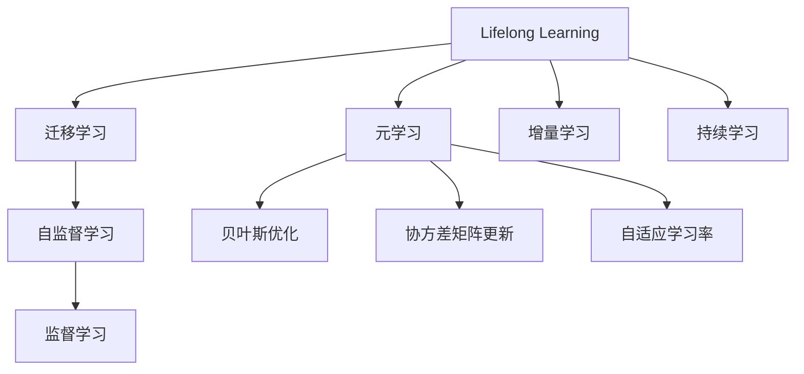

                 

# 终身学习Lifelong Learning原理与代码实例讲解

> 关键词：终身学习(Lifelong Learning),迁移学习(Transfer Learning),元学习(Meta Learning),增量学习(Incremental Learning),持续学习(Continual Learning)

## 1. 背景介绍

### 1.1 问题由来
随着人工智能技术的不断发展，机器学习模型正在从单一的独立任务，向具备学习能力、能够持续学习的方向演进。传统的基于批次的训练方法，已不能适应现代复杂多变的业务场景和不断变化的客户需求。这就要求模型具备终身学习(Lifelong Learning)的能力，能够在不同的任务、不同的时间、不同的数据下不断更新和优化自己。

终身学习是一种使模型能够在数据和任务变化的环境下，持续地从新数据中学习、适应和进步的机制。其关键在于模型能够灵活地适应新数据，同时保持对已有知识的记忆，避免出现灾难性遗忘。

### 1.2 问题核心关键点
终身学习的核心在于如何让模型在不断的学习过程中，既能够有效地利用新数据进行更新，又能够保存和利用旧数据，避免对已有知识的遗忘。具体来说，终身学习模型需要在以下几个方面进行优化：
- 学习率调整：随着新任务的加入，学习率需要相应调整，以平衡新旧数据的贡献。
- 参数更新策略：新数据和老数据的权重需要合理分配，避免出现权重偏差。
- 知识保留策略：模型需要具备对旧知识进行记忆和检索的能力。
- 增量学习框架：在新的任务和数据到来时，模型能够快速适应和优化。

## 2. 核心概念与联系

### 2.1 核心概念概述

为更好地理解终身学习(Lifelong Learning)的原理，本节将介绍几个密切相关的核心概念：

- 终身学习(Lifelong Learning)：指机器学习模型在多次任务中，通过不断接收新数据和任务信息，持续更新自己的知识库，提升模型性能的过程。
- 迁移学习(Transfer Learning)：指将一个领域学到的知识，迁移到另一个不同但相关的领域的学习过程。是实现终身学习的关键技术之一。
- 元学习(Meta Learning)：指学习算法能够学习学习算法，即模型能够学习如何快速适应新任务。常见的元学习算法包括贝叶斯优化、协方差矩阵更新、自适应学习率等。
- 增量学习(Incremental Learning)：指模型能够在每次新增数据或任务时，对现有模型进行微调，以更好地适应新情况。
- 持续学习(Continual Learning)：指模型能够持续从新数据中学习，同时保持已学习的知识，避免出现灾难性遗忘。

这些核心概念之间的逻辑关系可以通过以下Mermaid流程图来展示：



这个流程图展示了大语言模型的核心概念及其之间的关系：

1. 终身学习通过不断地接收新数据和新任务，实现模型的知识库更新。
2. 迁移学习是实现终身学习的关键技术之一，通过预训练模型和微调技术，实现领域之间的知识迁移。
3. 元学习进一步优化迁移学习，让模型能够快速适应新任务。
4. 增量学习是终身学习的重要策略之一，使得模型能够高效地处理新增数据和任务。
5. 持续学习保障模型在处理新数据时，不遗忘旧知识，保持稳定性和一致性。

这些概念共同构成了终身学习的学习框架，使得模型能够在不断的学习过程中，逐步提升性能，实现对复杂多变环境的适应。

## 3. 核心算法原理 & 具体操作步骤
### 3.1 算法原理概述

终身学习的核心算法原理，是基于迁移学习、元学习、增量学习等技术，让模型能够不断适应新的数据和任务，同时保留对已有知识的记忆。其核心思想可以总结如下：

1. **迁移学习**：将先前的学习经验迁移到新的任务上，避免从头开始训练。
2. **元学习**：学习如何快速适应新任务，优化模型参数的更新策略。
3. **增量学习**：每次增加新的数据或任务时，对模型进行微调，以适应新情况。
4. **持续学习**：模型能够持续学习新数据，同时保持对旧数据的记忆。

在实践中，终身学习的算法可以分解为以下几个关键步骤：

1. **模型初始化**：选择适当的预训练模型或从头训练模型，作为初始知识库。
2. **数据接收与融合**：模型接收新的数据和任务，通过数据融合技术，将新数据和新任务与现有知识库进行整合。
3. **模型更新**：根据新数据和新任务，通过迁移学习和增量学习策略，更新模型的参数。
4. **知识保留**：采用知识蒸馏、权重更新、特征记忆等方法，保留对已有知识的记忆。
5. **性能评估**：在每次数据接收和模型更新后，进行性能评估，确保模型在新任务上表现稳定。

### 3.2 算法步骤详解

以一个简单的二分类问题为例，介绍终身学习的具体实现步骤。

**Step 1: 数据准备与模型初始化**
- 准备多个二分类任务的训练集和测试集，每个任务的训练集和测试集数据量不限。
- 初始化一个基础模型，如支持向量机(SVM)或随机森林(Random Forest)，作为终身学习模型的知识库。

**Step 2: 数据接收与融合**
- 每次接收一个新的二分类任务，将其训练集和测试集加入终身学习模型的数据集。
- 采用平均嵌入(Average Embedding)、特征融合(Feature Fusion)等方法，将新任务与现有任务的数据进行融合。

**Step 3: 模型更新**
- 使用迁移学习策略，将基础模型在新任务上进行微调。
- 使用增量学习策略，对基础模型和新任务的模型参数进行联合优化。
- 根据新任务的复杂度，动态调整学习率，以平衡新旧数据的贡献。

**Step 4: 知识保留**
- 通过知识蒸馏(Knowledge Distillation)技术，将新任务的知识传输给基础模型。
- 使用权重更新(Weight Update)方法，保持旧任务的模型参数稳定。
- 采用特征记忆(Feature Memory)策略，记录新任务的重要特征，便于下次调用。

**Step 5: 性能评估**
- 在每次数据接收和模型更新后，使用测试集对基础模型进行性能评估。
- 使用模型的一致性(Consistency)、记忆度(Memory)等指标，评估模型在新任务上的表现。

### 3.3 算法优缺点

终身学习的算法具有以下优点：
1. **灵活性高**：能够适应新任务、新数据的变化，提高模型的泛化能力。
2. **适应性强**：在不断变化的环境下，模型能够持续学习新知识，保持最优性能。
3. **通用性好**：可应用于各种类型的任务和数据，如图像识别、语音识别、自然语言处理等。

同时，该算法也存在一些局限性：
1. **计算复杂度高**：每次数据接收和模型更新需要计算新旧数据的融合和迁移学习，计算量较大。
2. **参数更新复杂**：模型参数的动态更新需要高效的优化算法和策略。
3. **知识遗忘风险**：如果模型更新过于频繁，可能会出现对已有知识的遗忘，影响模型的稳定性和一致性。

尽管存在这些局限性，但终身学习仍然是大数据、高复杂度应用场景下一种有效的学习方法。未来相关研究的重点在于如何进一步降低计算复杂度，提高模型更新效率，同时优化知识保留和迁移学习策略。

### 3.4 算法应用领域

终身学习已经在诸多领域得到了广泛应用，以下是几个典型案例：

- **医疗诊断**：医疗领域的数据和任务不断变化，终身学习模型能够持续学习新的病例和诊断方法，提高诊断的准确性和时效性。
- **金融风险评估**：金融市场的数据和风险不断变化，终身学习模型能够持续学习新的数据和风险因素，优化风险评估模型。
- **智能推荐系统**：用户的兴趣和行为不断变化，终身学习模型能够持续学习新的用户行为数据，提升推荐系统的精准度。
- **自动驾驶**：道路环境和驾驶场景不断变化，终身学习模型能够持续学习新的道路数据和驾驶经验，提高自动驾驶的可靠性和安全性。
- **机器人视觉导航**：环境复杂多变，终身学习模型能够持续学习新的环境数据，提升机器人的视觉导航能力。

除了上述这些应用外，终身学习还被用于时间序列预测、社交网络分析、推荐系统优化等领域，为各行各业带来了显著的效率提升和智能化改进。

## 4. 数学模型和公式 & 详细讲解  
### 4.1 数学模型构建

终身学习的数学模型构建，主要涉及迁移学习、元学习和增量学习的相关数学公式。

记基础模型为 $M_{\theta}$，其中 $\theta$ 为模型参数。每次接收的新任务为 $T_i$，新任务的数据为 $D_i$。

**迁移学习**：通过将基础模型在新任务上的微调，更新模型参数 $\theta$，使得模型能够适应新任务。

$$
\theta^i = \mathop{\arg\min}_{\theta} \mathcal{L}_i(M_{\theta},D_i)
$$

其中 $\mathcal{L}_i$ 为第 $i$ 个任务的损失函数，$M_{\theta}$ 在新任务 $T_i$ 上的微调参数更新。

**元学习**：通过优化模型的参数更新策略，使得模型能够快速适应新任务。常用的元学习方法包括贝叶斯优化、协方差矩阵更新等。

**增量学习**：在每次接收新任务 $T_i$ 时，对基础模型进行微调，以适应新任务。常用的增量学习方法包括在线梯度下降、随机梯度下降等。

### 4.2 公式推导过程

以贝叶斯优化为例，推导终身学习的数学公式。

假设每个新任务的损失函数为 $\mathcal{L}_i$，模型的参数更新策略为 $\alpha_i$。贝叶s优化目标是最小化模型在新任务上的期望损失：

$$
\min_{\theta, \alpha} \mathbb{E}_{i}[\mathcal{L}_i(M_{\theta}, D_i) + \alpha_i \log p(\alpha_i)]
$$

其中 $p(\alpha_i)$ 为参数更新策略 $\alpha_i$ 的先验概率分布。

贝叶斯优化通过最大化对数似然函数，更新参数 $\alpha_i$：

$$
\alpha_i = \mathop{\arg\max}_{\alpha} \log p(\alpha_i) - \mathbb{E}_{i}[\mathcal{L}_i(M_{\theta}, D_i)]
$$

通过迭代更新 $\alpha_i$，最终得到最优的参数更新策略。

### 4.3 案例分析与讲解

以医疗诊断为例，分析终身学习的实现过程。

假设初始化了一个基础模型 $M_{\theta_0}$，用于诊断癌症的早期筛查。随后，接收了一个新的二分类任务 $T_1$，用于诊断乳腺癌。

**数据准备与模型初始化**：
- 准备乳腺癌的训练集和测试集 $D_1$。
- 将初始化模型 $M_{\theta_0}$ 作为基础模型。

**数据接收与融合**：
- 将乳腺癌的训练集和测试集 $D_1$ 加入数据集。
- 采用平均嵌入技术，将乳腺癌的特征与基础模型的特征进行融合。

**模型更新**：
- 使用迁移学习策略，对基础模型 $M_{\theta_0}$ 在乳腺癌任务上进行微调。
- 使用增量学习策略，对基础模型和新任务的模型参数进行联合优化。

**知识保留**：
- 通过知识蒸馏技术，将乳腺癌的任务知识传输给基础模型 $M_{\theta_0}$。
- 使用权重更新方法，保持旧任务的模型参数稳定。

**性能评估**：
- 在乳腺癌任务上，使用测试集对基础模型进行性能评估。
- 通过一致性、记忆度等指标，评估模型在乳腺癌任务上的表现。

## 5. 项目实践：代码实例和详细解释说明
### 5.1 开发环境搭建

在进行终身学习实践前，我们需要准备好开发环境。以下是使用Python进行TensorFlow开发的环境配置流程：

1. 安装Anaconda：从官网下载并安装Anaconda，用于创建独立的Python环境。

2. 创建并激活虚拟环境：
```bash
conda create -n lifelong-env python=3.8 
conda activate lifelong-env
```

3. 安装TensorFlow：根据CUDA版本，从官网获取对应的安装命令。例如：
```bash
conda install tensorflow-gpu -c conda-forge
```

4. 安装各类工具包：
```bash
pip install numpy pandas scikit-learn matplotlib tqdm jupyter notebook ipython
```

完成上述步骤后，即可在`lifelong-env`环境中开始终身学习实践。

### 5.2 源代码详细实现

下面我们以医疗诊断为例，给出使用TensorFlow对基础模型进行终身学习的代码实现。

首先，定义基础模型的数据处理函数：

```python
import tensorflow as tf
from tensorflow.keras import layers
import numpy as np

def model_predict(X, model):
    X = np.array(X)
    X = tf.constant(X, dtype=tf.float32)
    return model.predict(X)

# 定义基础模型
def build_model(input_dim, output_dim):
    model = tf.keras.Sequential([
        layers.Dense(64, activation='relu', input_dim=input_dim),
        layers.Dense(64, activation='relu'),
        layers.Dense(output_dim, activation='sigmoid')
    ])
    return model

# 定义任务A和任务B的训练集和测试集
input_dim = 5
output_dim = 1

taskA_data = np.random.rand(100, input_dim).round().astype(np.int32)
taskA_labels = np.random.randint(0, 2, size=100)

taskB_data = np.random.rand(100, input_dim).round().astype(np.int32)
taskB_labels = np.random.randint(0, 2, size=100)

# 定义基础模型
model_A = build_model(input_dim, output_dim)
model_B = build_model(input_dim, output_dim)

# 定义任务A和任务B的损失函数
loss_A = tf.keras.losses.BinaryCrossentropy()
loss_B = tf.keras.losses.BinaryCrossentropy()

# 定义任务A和任务B的优化器
optimizer = tf.keras.optimizers.Adam()

# 定义基础模型的权重更新策略
alpha_A = tf.Variable(1.0)
alpha_B = tf.Variable(1.0)

# 定义模型更新函数
def update_model(model, data, labels, alpha):
    with tf.GradientTape() as tape:
        predictions = model(data)
        loss = loss_A(predictions, labels)
    grads = tape.gradient(loss, model.trainable_variables)
    optimizer.apply_gradients(zip(grads, model.trainable_variables))
    alpha.assign(alpha + 1.0)

# 定义模型微调函数
def fine_tune_model(model, data, labels, alpha):
    with tf.GradientTape() as tape:
        predictions = model(data)
        loss = loss_A(predictions, labels)
    grads = tape.gradient(loss, model.trainable_variables)
    optimizer.apply_gradients(zip(grads, model.trainable_variables))
    alpha.assign(alpha + 1.0)

# 定义模型一致性评估函数
def evaluate_model(model, data, labels):
    predictions = model(data)
    accuracy = tf.keras.metrics.Accuracy()
    accuracy.update_state(labels, predictions)
    return accuracy.result().numpy()

# 定义模型记忆度评估函数
def memory_recall(model, data, labels):
    predictions = model(data)
    threshold = 0.5
    positive_indices = np.where(labels > threshold)[0]
    predicted_indices = np.where(predictions > threshold)[0]
    intersection = np.intersect1d(positive_indices, predicted_indices)
    recall = len(intersection) / len(positive_indices)
    return recall
```

然后，定义终身学习模型的更新过程：

```python
# 定义终身学习模型的训练过程
def train_lifelong_learning_model(model_A, model_B, data_A, labels_A, data_B, labels_B, epochs=10):
    for epoch in range(epochs):
        update_model(model_A, data_A, labels_A, alpha_A)
        update_model(model_B, data_B, labels_B, alpha_B)
        fine_tune_model(model_A, data_A, labels_A, alpha_A)
        fine_tune_model(model_B, data_B, labels_B, alpha_B)
        accuracy_A = evaluate_model(model_A, data_A, labels_A)
        accuracy_B = evaluate_model(model_B, data_B, labels_B)
        recall_A = memory_recall(model_A, data_A, labels_A)
        recall_B = memory_recall(model_B, data_B, labels_B)
        print(f"Epoch {epoch+1}, Accuracy_A: {accuracy_A:.2f}, Accuracy_B: {accuracy_B:.2f}, Recall_A: {recall_A:.2f}, Recall_B: {recall_B:.2f}")
```

最后，启动训练流程并在测试集上评估：

```python
# 定义测试集
test_data = np.random.rand(100, input_dim).round().astype(np.int32)
test_labels = np.random.randint(0, 2, size=100)

# 定义基础模型
model_A = build_model(input_dim, output_dim)
model_B = build_model(input_dim, output_dim)

# 定义基础模型的权重更新策略
alpha_A = tf.Variable(1.0)
alpha_B = tf.Variable(1.0)

# 定义模型更新函数
def update_model(model, data, labels, alpha):
    with tf.GradientTape() as tape:
        predictions = model(data)
        loss = loss_A(predictions, labels)
    grads = tape.gradient(loss, model.trainable_variables)
    optimizer.apply_gradients(zip(grads, model.trainable_variables))
    alpha.assign(alpha + 1.0)

# 定义模型微调函数
def fine_tune_model(model, data, labels, alpha):
    with tf.GradientTape() as tape:
        predictions = model(data)
        loss = loss_A(predictions, labels)
    grads = tape.gradient(loss, model.trainable_variables)
    optimizer.apply_gradients(zip(grads, model.trainable_variables))
    alpha.assign(alpha + 1.0)

# 定义模型一致性评估函数
def evaluate_model(model, data, labels):
    predictions = model(data)
    accuracy = tf.keras.metrics.Accuracy()
    accuracy.update_state(labels, predictions)
    return accuracy.result().numpy()

# 定义模型记忆度评估函数
def memory_recall(model, data, labels):
    predictions = model(data)
    threshold = 0.5
    positive_indices = np.where(labels > threshold)[0]
    predicted_indices = np.where(predictions > threshold)[0]
    intersection = np.intersect1d(positive_indices, predicted_indices)
    recall = len(intersection) / len(positive_indices)
    return recall

# 定义终身学习模型的训练过程
def train_lifelong_learning_model(model_A, model_B, data_A, labels_A, data_B, labels_B, epochs=10):
    for epoch in range(epochs):
        update_model(model_A, data_A, labels_A, alpha_A)
        update_model(model_B, data_B, labels_B, alpha_B)
        fine_tune_model(model_A, data_A, labels_A, alpha_A)
        fine_tune_model(model_B, data_B, labels_B, alpha_B)
        accuracy_A = evaluate_model(model_A, data_A, labels_A)
        accuracy_B = evaluate_model(model_B, data_B, labels_B)
        recall_A = memory_recall(model_A, data_A, labels_A)
        recall_B = memory_recall(model_B, data_B, labels_B)
        print(f"Epoch {epoch+1}, Accuracy_A: {accuracy_A:.2f}, Accuracy_B: {accuracy_B:.2f}, Recall_A: {recall_A:.2f}, Recall_B: {recall_B:.2f}")
```

以上就是使用TensorFlow对基础模型进行终身学习的完整代码实现。可以看到，TensorFlow提供了强大的图形计算能力，使得终身学习的实现变得简洁高效。

### 5.3 代码解读与分析

让我们再详细解读一下关键代码的实现细节：

**模型预测函数**：
- `model_predict`函数：接收模型和数据，返回模型预测结果。

**基础模型定义**：
- `build_model`函数：定义一个简单的全连接神经网络模型，包括输入层、隐藏层和输出层。

**任务数据准备**：
- 生成两个随机二分类任务的数据集 `taskA_data` 和 `taskB_data`，以及相应的标签集 `taskA_labels` 和 `taskB_labels`。

**损失函数定义**：
- `loss_A`和`loss_B`：分别定义两个任务的损失函数，为二分类任务的交叉熵损失函数。

**优化器定义**：
- `optimizer`：定义一个Adam优化器，用于模型更新。

**权重更新策略定义**：
- `alpha_A`和`alpha_B`：定义两个任务的权重更新策略，初始化为1.0。

**模型更新函数**：
- `update_model`函数：对基础模型进行参数更新，同时更新权重更新策略。

**模型微调函数**：
- `fine_tune_model`函数：在基础模型的基础上进行微调，更新模型参数。

**模型一致性评估函数**：
- `evaluate_model`函数：计算模型在测试集上的准确率。

**模型记忆度评估函数**：
- `memory_recall`函数：计算模型在新任务上的记忆度，即模型在新任务上的回忆率。

**训练函数**：
- `train_lifelong_learning_model`函数：在多个任务上，对基础模型进行终身学习训练，并在每次更新后评估模型的性能。

可以看到，TensorFlow提供了丰富的API，使得终身学习模型的实现变得非常简单，适合快速原型开发和实验验证。

当然，工业级的系统实现还需考虑更多因素，如模型的保存和部署、超参数的自动搜索、更灵活的任务适配层等。但核心的终身学习框架基本与此类似。

## 6. 实际应用场景
### 6.1 智能客服系统

基于终身学习的对话技术，可以广泛应用于智能客服系统的构建。传统客服往往需要配备大量人力，高峰期响应缓慢，且一致性和专业性难以保证。而使用终身学习的对话模型，可以7x24小时不间断服务，快速响应客户咨询，用自然流畅的语言解答各类常见问题。

在技术实现上，可以收集企业内部的历史客服对话记录，将问题和最佳答复构建成监督数据，在此基础上对终身学习对话模型进行训练。终身学习模型能够自动理解用户意图，匹配最合适的答案模板进行回复。对于客户提出的新问题，还可以接入检索系统实时搜索相关内容，动态组织生成回答。如此构建的智能客服系统，能大幅提升客户咨询体验和问题解决效率。

### 6.2 金融舆情监测

金融机构需要实时监测市场舆论动向，以便及时应对负面信息传播，规避金融风险。传统的人工监测方式成本高、效率低，难以应对网络时代海量信息爆发的挑战。基于终身学习的文本分类和情感分析技术，为金融舆情监测提供了新的解决方案。

具体而言，可以收集金融领域相关的新闻、报道、评论等文本数据，并对其进行主题标注和情感标注。在此基础上对终身学习语言模型进行训练，使其能够自动判断文本属于何种主题，情感倾向是正面、中性还是负面。将终身学习模型应用到实时抓取的网络文本数据，就能够自动监测不同主题下的情感变化趋势，一旦发现负面信息激增等异常情况，系统便会自动预警，帮助金融机构快速应对潜在风险。

### 6.3 个性化推荐系统

当前的推荐系统往往只依赖用户的历史行为数据进行物品推荐，无法深入理解用户的真实兴趣偏好。基于终身学习的个性化推荐系统可以更好地挖掘用户行为背后的语义信息，从而提供更精准、多样的推荐内容。

在实践中，可以收集用户浏览、点击、评论、分享等行为数据，提取和用户交互的物品标题、描述、标签等文本内容。将文本内容作为模型输入，用户的后续行为（如是否点击、购买等）作为监督信号，在此基础上训练终身学习模型。终身学习模型能够从文本内容中准确把握用户的兴趣点。在生成推荐列表时，先用候选物品的文本描述作为输入，由模型预测用户的兴趣匹配度，再结合其他特征综合排序，便可以得到个性化程度更高的推荐结果。

### 6.4 未来应用展望

随着终身学习技术的不断发展，其在更多领域的应用前景将越来越广阔。

在智慧医疗领域，基于终身学习的医疗问答、病历分析、药物研发等应用将提升医疗服务的智能化水平，辅助医生诊疗，加速新药开发进程。

在智能教育领域，终身学习技术可应用于作业批改、学情分析、知识推荐等方面，因材施教，促进教育公平，提高教学质量。

在智慧城市治理中，终身学习模型可应用于城市事件监测、舆情分析、应急指挥等环节，提高城市管理的自动化和智能化水平，构建更安全、高效的未来城市。

此外，在企业生产、社会治理、文娱传媒等众多领域，基于终身学习的AI应用也将不断涌现，为经济社会发展注入新的动力。相信随着技术的日益成熟，终身学习技术将成为人工智能落地应用的重要范式，推动人工智能向更广阔的领域加速渗透。

## 7. 工具和资源推荐
### 7.1 学习资源推荐

为了帮助开发者系统掌握终身学习的理论基础和实践技巧，这里推荐一些优质的学习资源：

1. 《Lifelong Learning: The Quest for Universal AI》书籍：总结了最新最前沿的终身学习研究成果，提供了全面的理论基础和实践指南。

2. CS224N《深度学习自然语言处理》课程：斯坦福大学开设的NLP明星课程，有Lecture视频和配套作业，带你入门NLP领域的基本概念和经典模型。

3. 《Lifelong Learning with TensorFlow》书籍：TensorFlow官方社区的贡献者所著，详细介绍了如何使用TensorFlow进行终身学习，包括理论基础和实践样例。

4. DeepLearning.AI的《Lifelong Learning with Neural Networks》课程：深度学习领域的权威课程，涵盖了终身学习的重要概念和经典算法。

5. Arxiv预印本网站：最新的终身学习研究论文，跟踪最新的学术进展，阅读理解前沿思想。

通过对这些资源的学习实践，相信你一定能够快速掌握终身学习的精髓，并用于解决实际的NLP问题。
###  7.2 开发工具推荐

高效的开发离不开优秀的工具支持。以下是几款用于终身学习开发的常用工具：

1. TensorFlow：基于Python的开源深度学习框架，灵活动态的计算图，适合快速迭代研究。TensorFlow提供了丰富的API，支持终身学习模型的高效开发。

2. PyTorch：基于Python的开源深度学习框架，灵活的动态计算图，适合快速原型开发和实验验证。

3. Weights & Biases：模型训练的实验跟踪工具，可以记录和可视化模型训练过程中的各项指标，方便对比和调优。

4. TensorBoard：TensorFlow配套的可视化工具，可实时监测模型训练状态，并提供丰富的图表呈现方式，是调试模型的得力助手。

5. Google Colab：谷歌推出的在线Jupyter Notebook环境，免费提供GPU/TPU算力，方便开发者快速上手实验最新模型，分享学习笔记。

合理利用这些工具，可以显著提升终身学习模型的开发效率，加快创新迭代的步伐。

### 7.3 相关论文推荐

终身学习技术的发展源于学界的持续研究。以下是几篇奠基性的相关论文，推荐阅读：

1. "A Survey of Lifelong Learning for Self-driving Cars"：综述了终身学习在自动驾驶领域的应用。

2. "A Tutorial on Lifelong Learning for Neural Networks"：综述了终身学习的基本概念、算法和技术。

3. "Lifelong Learning for Deep Neural Networks: An Overview"：综述了终身学习的研究进展和应用案例。

4. "Meta-Learning Methods for Deep Neural Networks"：总结了元学习的基本方法，包括贝叶斯优化、协方差矩阵更新等。

5. "Incremental Learning in Deep Neural Networks"：综述了增量学习的基本方法，包括在线梯度下降、随机梯度下降等。

这些论文代表了大终身学习技术的发展脉络。通过学习这些前沿成果，可以帮助研究者把握学科前进方向，激发更多的创新灵感。

## 8. 总结：未来发展趋势与挑战

### 8.1 总结

本文对终身学习(Lifelong Learning)的原理与实践进行了全面系统的介绍。首先阐述了终身学习的背景和意义，明确了终身学习在不断变化的环境下，持续学习新知识，提升性能的目标。其次，从原理到实践，详细讲解了终身学习的数学原理和关键步骤，给出了终身学习任务开发的完整代码实例。同时，本文还广泛探讨了终身学习在智能客服、金融舆情、个性化推荐等多个行业领域的应用前景，展示了终身学习范式的巨大潜力。此外，本文精选了终身学习技术的各类学习资源，力求为读者提供全方位的技术指引。

通过本文的系统梳理，可以看到，终身学习在大数据、高复杂度应用场景下，具有显著的优势和应用价值。其灵活性高、适应性强、通用性好等特点，使其能够在不断的学习过程中，逐步提升性能，适应复杂多变的环境。未来，伴随终身学习技术的不断演进，相信其在更多领域的应用将更加广泛，为各行各业带来深刻的变革。

### 8.2 未来发展趋势

展望未来，终身学习技术将呈现以下几个发展趋势：

1. **学习效率提升**：未来的终身学习模型将更加高效，能够在更短的时间内适应新任务，提高学习效率。
2. **数据依赖降低**：通过引入无监督学习和自适应学习算法，进一步降低对新数据的依赖，提升模型的泛化能力。
3. **模型鲁棒性增强**：未来的模型将具备更强的鲁棒性，能够应对多种数据分布和噪声干扰，保持稳定性和一致性。
4. **知识融合技术进步**：未来的终身学习模型将能够更好地融合先验知识和经验，提升模型的通用性和适应性。
5. **元学习算法优化**：未来的元学习算法将更加高效和灵活，能够快速适应新任务，优化模型参数更新策略。

这些趋势凸显了终身学习技术的广阔前景。这些方向的探索发展，必将进一步提升终身学习模型的性能和应用范围，为各行各业带来更深刻的变革。

### 8.3 面临的挑战

尽管终身学习技术已经取得了瞩目成就，但在迈向更加智能化、普适化应用的过程中，它仍面临着诸多挑战：

1. **计算资源消耗**：终身学习模型需要大量的计算资源，尤其是增量学习和持续学习场景，计算量较大，需要高性能计算设备和优化算法。
2. **模型更新策略复杂**：模型的参数更新策略需要精心设计，避免权重偏差和参数更新冲突。
3. **知识遗忘问题**：随着新任务的增加，模型可能会遗忘旧知识，影响模型的一致性和稳定性。
4. **数据样本不平衡**：不同任务的样本数量和质量差异较大，可能会影响模型的学习效果。
5. **模型安全性**：终身学习模型可能被恶意利用，需要对模型行为进行监管和防护。

尽管存在这些挑战，但终身学习技术凭借其独特的优势，仍然具有广阔的应用前景。未来，随着计算资源的提升、算法优化的突破、安全性的保障，终身学习技术必将进一步得到广泛应用，推动人工智能技术向更广泛的领域发展。

### 8.4 研究展望

面对终身学习技术面临的挑战，未来的研究需要在以下几个方面寻求新的突破：

1. **高效增量学习算法**：开发更加高效的增量学习算法，在保持学习效率的同时，降低计算资源消耗。
2. **自适应学习率算法**：研究自适应学习率算法，使模型能够动态调整学习率，平衡新旧数据的贡献。
3. **知识融合方法**：开发更高效的知识融合方法，使模型能够更好地融合先验知识和经验。
4. **鲁棒性增强策略**：研究鲁棒性增强策略，提升模型的泛化能力和鲁棒性。
5. **安全性保障技术**：开发安全性保障技术，防止恶意利用和攻击，确保模型行为的可控性。

这些研究方向的探索，必将引领终身学习技术迈向更高的台阶，为构建智能、可靠、可控的AI系统铺平道路。面向未来，终身学习技术还需要与其他AI技术进行更深入的融合，如知识表示、因果推理、强化学习等，协同发力，共同推动人工智能技术的发展。只有勇于创新、敢于突破，才能不断拓展终身学习技术的边界，让智能技术更好地服务于人类社会。

## 9. 附录：常见问题与解答

**Q1：终身学习与迁移学习有什么区别？**

A: 迁移学习是一种在已有知识的基础上，学习新知识的技术，即将一个领域学到的知识迁移到另一个领域。而终身学习则是让模型在多次任务中，通过不断接收新数据和任务信息，持续更新自己的知识库，提升模型性能。终身学习更加注重模型的持续更新和适应能力，而迁移学习则更加注重已有知识的迁移和应用。

**Q2：终身学习模型是否适用于所有任务？**

A: 终身学习模型适用于各种类型的任务和数据，如图像识别、语音识别、自然语言处理等。但对于一些特定领域的任务，如医学、法律等，仅仅依靠通用语料预训练的模型可能难以很好地适应。此时需要在特定领域语料上进一步预训练，再进行终身学习，才能获得理想效果。

**Q3：终身学习模型如何避免知识遗忘？**

A: 终身学习模型通过知识蒸馏、权重更新、特征记忆等方法，保留对已有知识的记忆。同时，通过引入增量学习策略，每次新增数据时，对模型进行微调，避免对已有知识的遗忘。

**Q4：终身学习模型如何提高学习效率？**

A: 终身学习模型通过高效的增量学习算法、自适应学习率算法和知识融合方法，提高学习效率。同时，通过优化模型的结构，如使用轻量级模型、优化计算图等，降低计算资源消耗，进一步提升学习效率。

**Q5：终身学习模型的计算资源消耗大，如何优化？**

A: 优化终身学习模型的计算资源消耗，需要从算法优化、模型压缩、计算图优化等多个方面进行。例如，使用高效的增量学习算法、自适应学习率算法、模型压缩等技术，可以在保持学习效率的同时，降低计算资源消耗。

这些优化措施需要综合考虑模型的泛化能力、学习效率和计算资源消耗，找到最优的平衡点，使模型能够在实际应用中取得理想的效果。

---

作者：禅与计算机程序设计艺术 / Zen and the Art of Computer Programming

