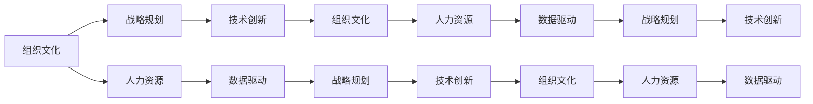

                 

# 经典书籍:管理者构建知识体系的基石

> 关键词：
管理，知识体系，组织文化，战略规划，人力资源，技术创新，数据驱动

## 1. 背景介绍

### 1.1 问题由来
在全球化和信息化的浪潮中，企业面临的内外部环境变化日益加剧。面对复杂多变的市场，如何有效构建和运用知识体系，以驱动组织变革和创新，成为摆在管理者面前的重大挑战。经典的书籍不仅是知识的载体，更是经验与智慧的结晶，能够为管理者提供深刻的洞察与启示。本文将通过回顾几部经典的管理书籍，探讨其核心思想，及其对现代组织知识体系构建的启示，帮助管理者在快速变化的时代中掌握制胜之道。

## 2. 核心概念与联系

### 2.1 核心概念概述

管理者构建知识体系是一个复杂而系统的过程，涉及到组织文化、战略规划、人力资源、技术创新等多个方面。以下是几个核心概念：

- **组织文化**：指一个组织的共同价值观、行为准则和环境氛围，是知识共享与创新的重要基础。
- **战略规划**：指组织在一定时期内的发展目标和行动计划，是知识体系构建的导航灯塔。
- **人力资源**：指组织中的人力资源管理和开发，是知识获取、创造和应用的关键。
- **技术创新**：指利用新技术和新方法解决现有问题，推动组织持续改进和发展。
- **数据驱动**：指利用大数据和先进分析工具，对组织运营和管理进行科学决策。

这些概念之间相互联系、相互作用，共同构成了组织知识体系的基石。通过深入理解这些核心概念，管理者可以更好地引导组织构建知识体系，实现可持续发展。

### 2.2 核心概念原理和架构的 Mermaid 流程图



这个流程图展示了核心概念之间的逻辑关系：组织文化通过塑造组织价值观和行为准则，影响战略规划的制定；人力资源管理则保证了知识获取、创造和应用的有效性；技术创新提供了知识应用的新手段；数据驱动则基于科学的分析，指导组织决策。这些概念相互支持，共同推动组织知识体系的构建。

## 3. 核心算法原理 & 具体操作步骤

### 3.1 算法原理概述

构建知识体系的核心算法原理可以归纳为：

1. **数据收集与整理**：通过各种手段收集组织内外部的知识，进行分类整理，形成知识库。
2. **知识共享与协作**：建立知识共享平台，促进知识的内部流动和外部获取。
3. **知识应用与创新**：将知识应用到组织的各项业务中，并通过技术创新推动知识转化为实际价值。
4. **持续评估与优化**：定期评估知识体系的效果，根据反馈进行优化和改进。

### 3.2 算法步骤详解

基于上述原理，构建知识体系的步骤如下：

**Step 1: 数据收集与整理**
- 识别组织内部和外部的知识来源，如文档、邮件、会议记录、客户反馈等。
- 对收集的知识进行分类和标注，形成标准化的知识库。
- 使用自动化工具进行知识抽取和整合，提高效率。

**Step 2: 知识共享与协作**
- 建立内部知识共享平台，如Wiki、内部论坛等。
- 推动跨部门、跨职能的知识交流，鼓励知识分享。
- 采用协同工具（如Confluence、Slack等），促进实时协作。

**Step 3: 知识应用与创新**
- 将知识应用于产品开发、市场分析、运营管理等业务中。
- 利用技术创新，如人工智能、大数据分析等，提升知识应用效果。
- 鼓励创新文化，对新知识的提出和应用给予奖励。

**Step 4: 持续评估与优化**
- 定期评估知识体系的效能，通过指标如知识利用率、创新成果等。
- 根据评估结果，调整知识收集和共享策略。
- 引入新技术和方法，优化知识应用和创新流程。

### 3.3 算法优缺点

构建知识体系的主要优点包括：

1. **提升组织效率**：通过知识共享和协作，减少重复工作，提升效率。
2. **增强组织创新力**：知识的积累和应用，为创新提供基础。
3. **支持战略实施**：知识体系有助于战略目标的明确和实施。

然而，该过程也存在以下缺点：

1. **成本高**：知识收集、整理、共享和评估需要大量时间和资源。
2. **数据隐私**：共享知识需要处理敏感信息，存在隐私风险。
3. **文化阻力**：改变组织文化需要时间，员工可能抵制。
4. **技术依赖**：需要引入和维护新技术，增加技术复杂度。

### 3.4 算法应用领域

知识体系构建的应用领域广泛，涵盖了企业管理的各个方面，如：

- 知识管理平台：支持知识的收集、存储、共享和检索。
- 协同办公系统：促进跨部门协作，实现知识流动。
- 产品开发流程：利用知识提升产品质量和创新速度。
- 市场分析与洞察：通过知识分析市场趋势，支持决策。
- 员工培训与发展：为员工提供学习资源和支持，提升能力。

## 4. 数学模型和公式 & 详细讲解

### 4.1 数学模型构建

构建知识体系的数学模型可以表示为：

$$
\text{Knowledge System} = \text{Organizational Culture} + \text{Strategic Planning} + \text{Human Resources} + \text{Technological Innovation} + \text{Data-Driven}
$$

其中，每个变量分别代表不同的核心概念，通过函数关系相加，形成知识体系的整体模型。

### 4.2 公式推导过程

以知识共享为例，其推导过程如下：

设知识共享量为 $K$，组织文化影响力为 $C$，战略规划贡献度为 $S$，人力资源有效性为 $H$，技术创新促进度为 $T$，数据驱动支持度为 $D$。则知识共享的数学模型为：

$$
K = f(C, S, H, T, D)
$$

其中，$f$ 为一系列的函数关系，表达各因素对知识共享的贡献。

### 4.3 案例分析与讲解

以Google的内部知识共享平台为例，分析其成功经验：

1. **组织文化**：Google强调“Don't be evil”的价值观，鼓励员工自由分享知识，形成了开放的组织氛围。
2. **战略规划**：Google明确知识共享在战略中的地位，将其作为创新和成长的核心驱动力。
3. **人力资源**：Google通过内部招聘和跨职能项目，促进知识共享和协作。
4. **技术创新**：Google利用Google Docs、Gmail等工具，实现无缝的知识共享和协作。
5. **数据驱动**：Google通过分析员工的知识分享行为和效果，不断优化平台设计。

Google的成功案例展示了核心概念的协同作用，为其他企业提供了宝贵的借鉴。

## 5. 项目实践：代码实例和详细解释说明

### 5.1 开发环境搭建

构建知识体系涉及多方面内容，需要依赖多种技术和工具。以下是常见的开发环境搭建步骤：

1. **软件环境**：
   - 操作系统：建议采用Linux或Windows Server。
   - 数据库：选择如MySQL、PostgreSQL等关系型数据库。
   - 知识管理系统：如Confluence、SharePoint等。

2. **硬件环境**：
   - 服务器：推荐使用高性能服务器，支持高并发访问。
   - 存储：配置高速存储设备，保证数据访问速度。
   - 网络：确保网络带宽充足，支持远程协作。

### 5.2 源代码详细实现

以下是一个简单的知识共享平台开发示例，具体实现步骤：

**1. 数据库设计**
- 创建知识库表：`knowledge`，包括`id`、`title`、`content`、`creator`、`create_date`等字段。
- 创建用户表：`user`，包括`id`、`name`、`email`、`role`等字段。
- 创建权限表：`permission`，包括`id`、`user_id`、`role`、`table`等字段。

**2. API接口设计**
- 知识获取：`GET /knowledge/{id}`
- 知识创建：`POST /knowledge`
- 知识更新：`PUT /knowledge/{id}`
- 知识删除：`DELETE /knowledge/{id}`
- 用户注册：`POST /user`
- 用户登录：`POST /login`

**3. 代码实现**
- 使用Python编写后端API，如Flask框架。
- 设计前端页面，采用HTML、CSS和JavaScript实现。
- 集成数据库和API，实现知识共享功能。

### 5.3 代码解读与分析

以下是代码的关键实现步骤：

**数据库操作**：
```python
# 数据库连接
from flask_sqlalchemy import SQLAlchemy
db = SQLAlchemy(app)

# 定义模型类
class Knowledge(db.Model):
    id = db.Column(db.Integer, primary_key=True)
    title = db.Column(db.String(255), nullable=False)
    content = db.Column(db.Text, nullable=False)
    creator = db.Column(db.String(255), nullable=False)
    create_date = db.Column(db.DateTime, nullable=False)

class User(db.Model):
    id = db.Column(db.Integer, primary_key=True)
    name = db.Column(db.String(255), nullable=False)
    email = db.Column(db.String(255), nullable=False)
    role = db.Column(db.String(255), nullable=False)

class Permission(db.Model):
    id = db.Column(db.Integer, primary_key=True)
    user_id = db.Column(db.Integer, db.ForeignKey('user.id', ondelete='CASCADE'))
    role = db.Column(db.String(255), nullable=False)
    table = db.Column(db.String(255), nullable=False)
```

**API实现**：
```python
from flask import Flask, request, jsonify

app = Flask(__name__)

# 获取知识
@app.route('/knowledge/<int:id>', methods=['GET'])
def get_knowledge(id):
    knowledge = Knowledge.query.get(id)
    if not knowledge:
        return jsonify({'error': '知识不存在'}), 404
    return jsonify({'id': knowledge.id, 'title': knowledge.title, 'content': knowledge.content, 'creator': knowledge.creator, 'create_date': knowledge.create_date})

# 创建知识
@app.route('/knowledge', methods=['POST'])
def create_knowledge():
    data = request.json
    knowledge = Knowledge(title=data['title'], content=data['content'], creator=data['creator'])
    db.session.add(knowledge)
    db.session.commit()
    return jsonify({'id': knowledge.id}), 201

# 更新知识
@app.route('/knowledge/<int:id>', methods=['PUT'])
def update_knowledge(id):
    data = request.json
    knowledge = Knowledge.query.get(id)
    if not knowledge:
        return jsonify({'error': '知识不存在'}), 404
    knowledge.title = data['title']
    knowledge.content = data['content']
    db.session.commit()
    return jsonify({'id': knowledge.id}), 200

# 删除知识
@app.route('/knowledge/<int:id>', methods=['DELETE'])
def delete_knowledge(id):
    knowledge = Knowledge.query.get(id)
    if not knowledge:
        return jsonify({'error': '知识不存在'}), 404
    db.session.delete(knowledge)
    db.session.commit()
    return jsonify({'id': knowledge.id}), 200

# 用户注册
@app.route('/user', methods=['POST'])
def register_user():
    data = request.json
    user = User(name=data['name'], email=data['email'], role=data['role'])
    db.session.add(user)
    db.session.commit()
    return jsonify({'id': user.id}), 201

# 用户登录
@app.route('/login', methods=['POST'])
def login_user():
    data = request.json
    user = User.query.filter_by(email=data['email']).first()
    if not user:
        return jsonify({'error': '用户不存在'}), 404
    if not user.role == data['role']:
        return jsonify({'error': '角色验证失败'}), 401
    return jsonify({'token': 'example_token'}), 200
```

**运行结果展示**：
```python
# 运行Flask应用
if __name__ == '__main__':
    app.run(debug=True)
```

在上述示例中，通过Flask框架和SQLAlchemy库实现了基本的知识共享平台。前端页面通过API获取和更新知识，后端数据库进行数据存储和查询。整个系统具有注册、登录、知识获取、创建、更新和删除等功能，能够满足基本的知识共享需求。

## 6. 实际应用场景

### 6.1 智能制造

在智能制造领域，知识体系构建有助于提升生产效率和产品质量。例如，利用知识管理系统记录生产过程中的工艺参数、设备维护记录、质量控制报告等，通过数据分析和应用，指导操作员优化生产流程，实现智能化生产。

### 6.2 金融风控

在金融行业，知识体系构建有助于防范金融风险，提升风险管理能力。通过收集和分析市场数据、信用评估数据、欺诈检测数据等，构建知识库，支持信贷审批、风险预警、反欺诈等业务。

### 6.3 医疗健康

在医疗健康领域，知识体系构建有助于提高医疗服务质量，推动医疗创新。通过整理和共享病历、诊断报告、治疗方案等医疗知识，支持医生进行疾病诊断、治疗方案制定和医疗研究。

### 6.4 教育培训

在教育培训领域，知识体系构建有助于提升教育质量和培训效果。通过收集和共享课程资源、教学案例、研究成果等，支持教师教学和学生学习，提升教育质量和效率。

## 7. 工具和资源推荐

### 7.1 学习资源推荐

- **《组织理论》**：H. 理查德·西尔斯，全面介绍了组织理论与实践，是理解组织文化和管理知识体系的重要参考。
- **《数据驱动管理》**：约翰·哈里森，探讨了数据在管理决策中的应用，提供了大量实用案例和方法。
- **《精益管理》**：詹姆斯·沃默克，介绍了精益管理理念和方法，帮助管理者优化流程和提升效率。
- **《数字化转型》**：埃里克·布莱特、托马斯·海西尔，分析了数字化转型对组织管理的影响，提供了转型策略和方法。
- **《敏捷管理》**：凯蒂·贝克，介绍了敏捷管理的基本原理和实践，帮助组织适应快速变化的环境。

### 7.2 开发工具推荐

- **Confluence**：Atlassian推出的知识管理平台，支持文档编辑、版本控制、权限管理等，是构建知识体系的理想工具。
- **SharePoint**：Microsoft提供的企业级协作平台，支持知识共享、文档管理、团队协作等功能。
- **JIRA**：Atlassian推出的项目管理工具，支持任务分配、进度跟踪、质量管理等功能，与Confluence深度集成。
- **Tableau**：Tableau提供的数据可视化工具，支持复杂数据报表和仪表盘，支持业务分析和管理决策。
- **Power BI**：Microsoft提供的数据分析和报告工具，支持动态数据更新和可视化展示，支持多平台部署。

### 7.3 相关论文推荐

- **《知识管理与组织绩效》**：Dr. Patrick Blyler，探讨了知识管理与组织绩效的关系，提供了大量实证研究结果。
- **《数据驱动的组织变革》**：Dr. Kevin Smith，介绍了数据驱动的组织变革方法和案例，提供了实用的管理建议。
- **《组织创新与知识共享》**：Dr. Tom Peters，分析了组织创新与知识共享的相互作用，提供了创新策略和方法。
- **《人工智能与知识管理》**：Dr. Benjamin Wys，探讨了人工智能在知识管理中的应用，提供了前沿研究动态。

## 8. 总结：未来发展趋势与挑战

### 8.1 总结

本文通过回顾经典管理书籍，探讨了知识体系构建的核心概念和实现步骤。管理者在构建知识体系的过程中，需要关注组织文化、战略规划、人力资源、技术创新和数据驱动等方面，通过系统化的管理方法，提升组织竞争力。通过深入理解经典管理思想，管理者可以更好地引导组织在快速变化的时代中稳步前进。

### 8.2 未来发展趋势

未来知识体系构建将呈现以下几个趋势：

1. **数字化与智能化**：知识体系将更加依赖数字技术和智能算法，实现知识的自动收集、整理和应用。
2. **社会化与协作化**：知识共享和协作将更加注重社会化的互动和协作，促进跨部门、跨职能的知识流动。
3. **数据驱动与模型驱动**：基于数据的分析和管理将更加科学化，模型驱动的方法将成为知识应用的重要工具。
4. **生态化与开放化**：知识体系将更加开放，与外部知识生态系统深度融合，实现资源共享和知识创新。
5. **定制化与个性化**：知识体系将更加注重个性化需求，根据不同业务和用户需求，提供定制化的知识服务。

### 8.3 面临的挑战

知识体系构建在未来的发展中，仍面临诸多挑战：

1. **数据质量与完整性**：数据的准确性和完整性是知识体系构建的基础，数据的缺失或错误将严重影响知识应用效果。
2. **技术复杂度**：知识体系构建涉及多方面的技术手段，如人工智能、大数据分析、区块链等，技术复杂度较高。
3. **文化阻力**：改变组织文化需要时间和资源，员工可能对新方法和工具存在抵触情绪。
4. **隐私与安全**：共享知识涉及敏感信息，如何保障数据隐私和安全是知识体系构建的重要问题。
5. **成本控制**：知识体系构建需要大量投入，如何控制成本，实现高效的资源利用是管理者的重要任务。

### 8.4 研究展望

未来，知识体系构建的研究方向将集中在以下几个方面：

1. **大数据与人工智能的融合**：利用大数据和人工智能技术，实现知识自动获取、分析和应用。
2. **模型驱动的知识管理**：开发和应用基于模型的知识管理系统，提高知识应用效率和效果。
3. **多模态知识的融合**：探索视觉、语音、文本等多种模态知识的融合方法，提升知识表示和应用能力。
4. **区块链与知识管理**：利用区块链技术，实现知识共享和协作的可信和透明。
5. **知识共享的自动化**：开发自动化知识共享工具，提高知识共享的效率和准确性。

通过不断探索和创新，知识体系构建将更加科学化、智能化和生态化，为组织的可持续发展提供坚实的知识基础。

## 9. 附录：常见问题与解答

**Q1：如何构建组织知识体系？**

A: 构建组织知识体系需要以下步骤：
1. 识别知识来源，收集并整理相关知识。
2. 设计知识共享平台，建立内部知识库。
3. 推动跨部门协作，促进知识交流和应用。
4. 评估知识体系效果，根据反馈进行优化和改进。

**Q2：知识体系构建的关键因素有哪些？**

A: 知识体系构建的关键因素包括：
1. 组织文化：建立开放、协作的组织氛围。
2. 战略规划：明确知识管理在战略中的地位。
3. 人力资源：提供支持知识共享和协作的资源。
4. 技术创新：利用先进技术支持知识获取和应用。
5. 数据驱动：通过数据分析优化知识管理。

**Q3：知识体系构建面临的挑战有哪些？**

A: 知识体系构建面临的挑战包括：
1. 数据质量与完整性：保证数据的准确性和完整性。
2. 技术复杂度：技术手段的多样性和复杂性。
3. 文化阻力：员工对新方法和工具的抵触情绪。
4. 隐私与安全：保护知识共享中的敏感信息。
5. 成本控制：控制知识体系构建的成本和资源投入。

**Q4：知识体系构建的未来发展趋势是什么？**

A: 知识体系构建的未来发展趋势包括：
1. 数字化与智能化：利用数字技术和智能算法实现知识管理。
2. 社会化与协作化：促进跨部门、跨职能的知识流动。
3. 数据驱动与模型驱动：科学化地进行知识应用和管理。
4. 生态化与开放化：实现知识共享和协作的可信和透明。
5. 定制化与个性化：提供定制化的知识服务。

**Q5：如何评估知识体系的效果？**

A: 知识体系的效果评估可以包括以下指标：
1. 知识利用率：衡量知识在业务中的应用情况。
2. 知识共享率：衡量知识的内部流动和外部获取。
3. 创新成果：衡量知识共享对组织创新的贡献。
4. 员工满意度：衡量员工对知识共享和协作的满意度。
5. 业务效益：衡量知识管理对业务运营的实际效益。

---

作者：禅与计算机程序设计艺术 / Zen and the Art of Computer Programming

