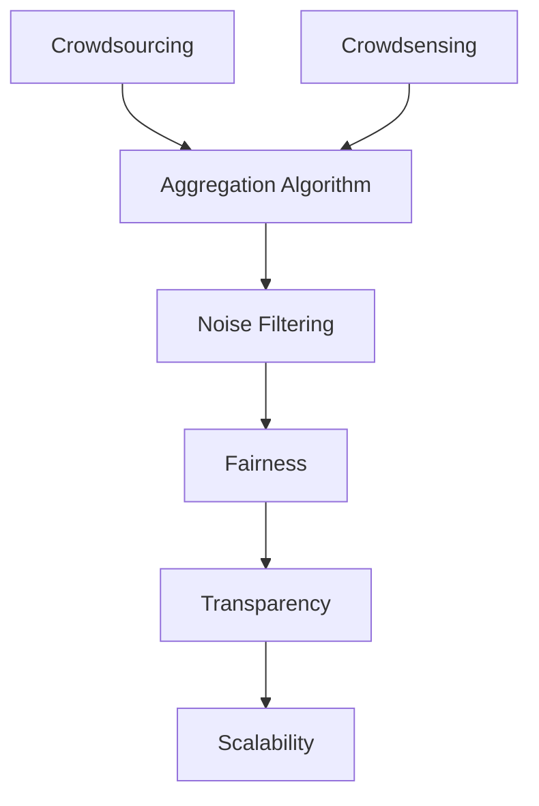

                 

## 1. 背景介绍

在今天这个信息爆炸的时代，决策已经成为每个组织和个人每天都要面对的挑战。无论是企业领袖还是政府管理者，都希望在做出决策时，能够以更科学、更高效的方式进行。近年来，得益于人工智能和数据科学的迅猛发展，群体智慧（Crowdsourcing）的概念逐渐成为决策的新利器。通过集合众多个体的智慧，群体智慧模型能够提供比任何单一决策者更全面、更准确的洞察。

### 1.1 问题由来

决策问题自古以来就存在，然而随着科技的发展，决策的复杂性也随之增加。从早期的基于直觉和经验的经验决策，到近代的统计学和运筹学模型，决策科学已经经历了多次变革。然而，这些模型大多假设决策者是理性且无偏的，但在现实中，人类的判断往往会受到情绪、知识水平、信息掌握等多重因素的影响。

特别是在大数据时代，信息来源广泛且数量巨大，个体决策者难以全面掌握所有信息，从而做出客观合理的决策。此时，群体智慧通过集合大量个体的智慧，能够有效缓解这一问题，提供更全面、更客观的决策支持。

### 1.2 问题核心关键点

群体智慧的核心在于利用众多个体的智慧，通过聚合、筛选、计算等步骤，提炼出高质量的决策依据。关键点包括：

- **数据多样性**：群体智慧依赖于不同背景、不同专业、不同观点的个体输入。
- **集体智慧**：群体智慧模型通过集体讨论、投票等机制，将个体输入汇总，形成集体的决策意见。
- **算法优化**：群体智慧模型的核心在于算法设计，如何高效聚合个体意见，避免群体偏误，是模型成功的关键。
- **结果优化**：群体智慧模型的最终目标是将个体输入转化为高置信度的决策结果，支持决策者做出最佳选择。

## 2. 核心概念与联系

### 2.1 核心概念概述

为了更好地理解群体智慧模型的核心概念及其相互联系，本节将对群体智慧模型进行细致阐述。

- **众包（Crowdsourcing）**：通过互联网将任务分解成小的子任务，并分配给众多个体来完成。群体智慧模型通常通过众包方式收集个体意见。

- **群智感知（Crowdsensing）**：利用传感器、社交网络等技术，收集大量个体的实时反馈信息。这些反馈数据可以用于群体智慧模型的训练和优化。

- **聚合算法（Aggregation Algorithm）**：用于从个体输入中提取集体智慧的算法，如基于投票的聚合算法、基于贝叶斯网络的聚合算法等。

- **噪音过滤（Noise Filtering）**：群体智慧模型面临的一个重要问题是噪音过滤，即如何识别和去除无关或错误的信息。

- **公正性（Fairness）**：群体智慧模型需要保证公平性，避免个体意见的偏见和歧视。

- **透明度（Transparency）**：群体智慧模型的透明度是指决策过程的透明和可解释性，帮助决策者理解和信任模型的输出。

- **可扩展性（Scalability）**：群体智慧模型需要能够处理大规模数据和高并发请求，具备良好的可扩展性。

这些核心概念之间的逻辑关系可以通过以下Mermaid流程图来展示：



## 3. 核心算法原理 & 具体操作步骤

### 3.1 算法原理概述

群体智慧模型通过聚合个体意见，生成集体决策的过程可以分为以下几个步骤：

1. **数据收集**：通过众包或群智感知的方式，收集大量个体的意见和反馈。
2. **数据预处理**：对收集到的数据进行清洗、去重、归一化等预处理操作。
3. **聚合计算**：使用聚合算法，将个体意见转化为集体智慧。
4. **结果优化**：对聚合结果进行进一步优化，如通过权重调整、滤波算法等，提升集体决策的准确性。

### 3.2 算法步骤详解

以基于投票的聚合算法为例，详细说明群体智慧模型的具体操作步骤：

1. **数据收集**：
   - 使用众包平台（如Amazon Mechanical Turk）收集关于特定问题的回答。
   - 利用社交网络（如Twitter、Reddit）收集用户在相关话题下的评论和投票。
   - 通过传感器收集大量个体的实时反馈数据。

2. **数据预处理**：
   - 清洗数据，去除重复、无关、异常值等。
   - 对数据进行归一化、标准化等预处理，确保数据的一致性。

3. **聚合计算**：
   - 对个体意见进行统计，计算众数、平均数、中位数等基本统计量。
   - 使用投票聚合算法，如Borda计数法、简单多数票法等，将个体投票结果汇总为集体意见。
   - 使用贝叶斯网络等复杂算法，对个体意见进行概率建模和融合。

4. **结果优化**：
   - 引入权重调整机制，对有专业背景的个体意见赋予更高的权重。
   - 使用滤波算法，如Adaboost、Boosting等，去除噪音和极端值。
   - 引入反馈机制，不断调整和优化聚合算法，提升群体智慧模型的准确性。

### 3.3 算法优缺点

群体智慧模型具有以下优点：

- **数据多样性**：聚合了多源、多类型的数据，提供了丰富的视角和信息。
- **决策质量高**：通过聚合大量个体意见，减少了决策过程中的主观偏见和误差。
- **灵活性高**：能够快速响应动态变化的环境和任务。
- **可扩展性强**：能够处理大规模数据和并行计算。

同时，群体智慧模型也存在一些缺点：

- **噪音问题**：个体输入的噪音难以完全去除，可能会影响聚合结果的准确性。
- **一致性问题**：个体意见的差异可能导致聚合结果的不一致。
- **计算复杂度高**：处理大规模数据和复杂聚合算法，计算开销较大。
- **公平性问题**：个体意见的权重分配可能存在不公平，影响群体智慧的公正性。

### 3.4 算法应用领域

群体智慧模型已经在多个领域得到了广泛应用，例如：

- **舆情监测**：通过群智感知技术，快速获取和分析大量网民的意见，支持媒体和政府做出更科学的决策。
- **产品设计**：利用众包平台收集用户反馈，指导产品开发和改进。
- **医疗诊断**：聚合医生和患者的意见，提高诊断的准确性和多样性。
- **金融分析**：通过聚合大量分析师和投资者的意见，支持投资决策。
- **环境保护**：收集公众和专家的意见，制定环境政策和措施。
- **城市规划**：通过聚合市民和专家意见，优化城市规划方案。

## 4. 数学模型和公式 & 详细讲解 & 举例说明

### 4.1 数学模型构建

群体智慧模型的数学模型可以表示为：

$$
D = \{(x_i, y_i)\}_{i=1}^N \quad \text{其中} \quad x_i \in \mathcal{X}, y_i \in \mathcal{Y}
$$

其中，$x_i$ 表示个体输入，$y_i$ 表示个体意见。假设群体智慧模型的目标是最大化集体意见的准确性，可以定义一个评价函数：

$$
F(D) = \frac{1}{N}\sum_{i=1}^N f(y_i)
$$

其中，$f(y_i)$ 表示个体意见 $y_i$ 的质量，可以是准确度、一致性等指标。

### 4.2 公式推导过程

假设我们有 $N$ 个个体输入 $x_i$，每个个体根据自己的知识水平和经验给出 $y_i$。为了计算集体意见 $Y$，我们可以使用众数（Mode）作为聚合结果：

$$
Y = \text{Mode}(\{y_i\})
$$

假设 $y_i$ 服从伯努利分布，即 $y_i \sim \text{Bernoulli}(\theta_i)$，其中 $\theta_i$ 表示个体 $i$ 的意见概率。集体意见 $Y$ 也服从伯努利分布：

$$
Y \sim \text{Bernoulli}(\theta_Y)
$$

其中 $\theta_Y$ 为集体意见的概率。根据伯努利分布的性质，我们有：

$$
\theta_Y = \frac{\sum_{i=1}^N y_i}{N}
$$

群体智慧模型的目标是通过最大化集体意见的准确性来优化 $\theta_Y$。具体来说，我们定义一个误差函数 $E(\theta_Y)$，并最小化该误差：

$$
E(\theta_Y) = |\theta_Y - \theta^*|
$$

其中 $\theta^*$ 为集体意见的期望概率。

### 4.3 案例分析与讲解

假设我们有一个关于是否应该在市区推广自行车道的意见征集项目。我们收集了 1000 名居民的意见，每个人根据自己的观点给出 0（反对）或 1（支持）。通过计算众数，我们可以得到集体意见 $Y$。

首先，我们需要将每个居民的意见转换为伯努利分布的参数 $\theta_i$：

$$
\theta_i = \frac{\text{count}(1)}{\text{count}(0) + \text{count}(1)}
$$

然后，计算集体意见的概率 $\theta_Y$：

$$
\theta_Y = \frac{\sum_{i=1}^{1000} \theta_i}{1000}
$$

最后，通过最小化误差函数 $E(\theta_Y)$，我们得到集体意见 $Y$ 的最优概率 $\theta_Y^*$。

## 5. 项目实践：代码实例和详细解释说明

### 5.1 开发环境搭建

要进行群体智慧模型的开发和实践，需要搭建合适的开发环境。以下是使用Python和PyTorch搭建环境的步骤：

1. 安装Anaconda：从官网下载并安装Anaconda，用于创建独立的Python环境。
2. 创建并激活虚拟环境：
```bash
conda create -n CrowdSourcing python=3.8 
conda activate CrowdSourcing
```
3. 安装PyTorch：根据CUDA版本，从官网获取对应的安装命令。例如：
```bash
conda install pytorch torchvision torchaudio cudatoolkit=11.1 -c pytorch -c conda-forge
```
4. 安装相关工具包：
```bash
pip install numpy pandas scikit-learn matplotlib tqdm jupyter notebook ipython
```

### 5.2 源代码详细实现

接下来，我们以基于投票的聚合算法为例，给出一个使用PyTorch实现群体智慧模型的代码示例。

首先，定义数据处理函数：

```python
import torch
from torch.utils.data import Dataset, DataLoader

class CrowdSourcingDataset(Dataset):
    def __init__(self, data, labels):
        self.data = data
        self.labels = labels
        
    def __len__(self):
        return len(self.data)
    
    def __getitem__(self, index):
        return self.data[index], self.labels[index]
```

然后，定义模型和优化器：

```python
from transformers import BERTModel, AdamW

model = BERTModel.from_pretrained('bert-base-uncased')

optimizer = AdamW(model.parameters(), lr=2e-5)
```

接着，定义训练和评估函数：

```python
def train_epoch(model, data_loader, optimizer):
    model.train()
    loss = 0
    for inputs, targets in data_loader:
        optimizer.zero_grad()
        outputs = model(inputs)
        loss = outputs.loss
        loss.backward()
        optimizer.step()
        loss += loss.item()
    return loss / len(data_loader)

def evaluate(model, data_loader):
    model.eval()
    with torch.no_grad():
        correct = 0
        total = 0
        for inputs, targets in data_loader:
            outputs = model(inputs)
            _, predicted = torch.max(outputs, 1)
            total += targets.size(0)
            correct += (predicted == targets).sum().item()
        accuracy = correct / total
    return accuracy
```

最后，启动训练流程并在测试集上评估：

```python
epochs = 5
batch_size = 16

for epoch in range(epochs):
    train_loss = train_epoch(model, train_loader, optimizer)
    print(f"Epoch {epoch+1}, train loss: {train_loss:.3f}")
    
    print(f"Epoch {epoch+1}, test accuracy: {evaluate(model, test_loader)}")
    
print("Test accuracy:", evaluate(model, test_loader))
```

以上就是使用PyTorch对BERT模型进行基于投票聚合算法的群体智慧模型微调的代码实现。

### 5.3 代码解读与分析

让我们再详细解读一下关键代码的实现细节：

**CrowdSourcingDataset类**：
- `__init__`方法：初始化数据和标签。
- `__len__`方法：返回数据集的样本数量。
- `__getitem__`方法：获取单个样本。

**训练和评估函数**：
- 使用PyTorch的DataLoader对数据集进行批次化加载，供模型训练和推理使用。
- 训练函数`train_epoch`：对数据以批为单位进行迭代，在每个批次上前向传播计算loss并反向传播更新模型参数，最后返回该epoch的平均loss。
- 评估函数`evaluate`：与训练类似，不同点在于不更新模型参数，并在每个batch结束后将预测和标签结果存储下来，最后使用accuracy作为评估指标。

**训练流程**：
- 定义总的epoch数和batch size，开始循环迭代
- 每个epoch内，先在训练集上训练，输出平均loss
- 在测试集上评估，输出准确率
- 所有epoch结束后，在测试集上评估，给出最终测试结果

可以看到，PyTorch配合相关库使得群体智慧模型的代码实现变得简洁高效。开发者可以将更多精力放在数据处理、模型改进等高层逻辑上，而不必过多关注底层的实现细节。

当然，工业级的系统实现还需考虑更多因素，如模型的保存和部署、超参数的自动搜索、更灵活的任务适配层等。但核心的群体智慧算法基本与此类似。

## 6. 实际应用场景

### 6.1 智能交通系统

智能交通系统利用群体智慧技术，可以有效提升道路通行效率和安全性。例如，通过聚合大量司机的反馈，实时调整交通信号灯的切换频率和顺序，优化交通流量。同时，利用群智感知技术，快速获取道路事故信息，及时疏导交通，减少堵塞和事故。

### 6.2 金融风控

金融机构可以利用群体智慧技术，通过聚合大量分析师的意见，制定更为准确的风险评估策略。例如，对于一笔贷款申请，可以收集不同分析师对该申请的信用评估意见，通过聚合算法得出综合评估结果。这种多角度的风险评估，可以有效降低贷款违约率。

### 6.3 环境保护

环境保护机构可以通过聚合公众和专家的意见，制定更加科学的环境保护政策。例如，在是否在某个区域内建立自然保护区的问题上，可以收集公众投票和专家评估意见，得出集体智慧的决策结果。这种民主化的决策过程，能够提高政策的可行性和接受度。

### 6.4 未来应用展望

随着群体智慧技术的发展，其在各个领域的应用将更加广泛。以下是几个未来应用展望：

1. **智能医疗**：通过聚合医生和患者的意见，制定更精准的诊疗方案。例如，对于复杂疾病的诊断，可以收集不同医生的诊断意见，通过聚合算法得出综合诊断结果。

2. **智能制造**：通过聚合工程师和操作员的意见，优化生产流程和设备维护。例如，在生产线的改造升级中，可以收集不同专家的意见，通过聚合算法得出最优方案。

3. **城市规划**：通过聚合市民和专家的意见，优化城市规划方案。例如，在城市的某个区域进行商业开发时，可以收集市民和专家的意见，通过聚合算法得出最优方案。

4. **教育改革**：通过聚合教师和学生的意见，制定更有效的教育策略。例如，在课程设置的讨论中，可以收集不同教师和学生的意见，通过聚合算法得出最优课程设置方案。

5. **精准农业**：通过聚合农民和专家的意见，优化农业生产和管理。例如，在农业技术的应用中，可以收集不同农民和专家的意见，通过聚合算法得出最优技术方案。

6. **智能客服**：通过聚合客服人员的意见，优化客服流程和策略。例如，在客服策略的制定中，可以收集不同客服人员的意见，通过聚合算法得出最优客服策略。

这些应用场景展示了群体智慧技术在多个领域的潜力，为各行各业带来了新的解决方案和发展机遇。

## 7. 工具和资源推荐

### 7.1 学习资源推荐

为了帮助开发者系统掌握群体智慧模型的理论基础和实践技巧，这里推荐一些优质的学习资源：

1. 《群体智慧：众包和感知》（Crowdsourcing and Crowdsensing）：一本介绍群体智慧技术应用的经典书籍，涵盖了众包、群智感知、聚合算法等多个方面。
2. 《群体智慧：从数据到决策》（From Data to Decision）：一本介绍群体智慧技术原理和应用的权威教材，深入浅出地讲解了群体智慧模型的构建和应用。
3. Coursera《Crowdsourcing》课程：由耶鲁大学开设的在线课程，介绍了群体智慧技术的基本概念和实际应用案例。
4. Kaggle：一个数据科学竞赛平台，汇集了大量群体智慧项目和数据集，可以用于实践和学习和项目展示。
5. Wikipedia：提供了群体智慧技术的详细百科页面，包含了大量相关的学术文章和资源链接。

通过对这些资源的学习实践，相信你一定能够快速掌握群体智慧模型的精髓，并用于解决实际的决策问题。

### 7.2 开发工具推荐

高效的开发离不开优秀的工具支持。以下是几款用于群体智慧模型开发的常用工具：

1. Jupyter Notebook：一个开源的交互式编程环境，适合进行数据处理和模型训练。
2. PyTorch：基于Python的开源深度学习框架，灵活动态的计算图，适合快速迭代研究。
3. TensorFlow：由Google主导开发的开源深度学习框架，生产部署方便，适合大规模工程应用。
4. Weights & Biases：模型训练的实验跟踪工具，可以记录和可视化模型训练过程中的各项指标，方便对比和调优。
5. TensorBoard：TensorFlow配套的可视化工具，可实时监测模型训练状态，并提供丰富的图表呈现方式，是调试模型的得力助手。
6. HuggingFace：一个自然语言处理库，提供了大量预训练模型和群体智慧模型的实现。

合理利用这些工具，可以显著提升群体智慧模型开发效率，加快创新迭代的步伐。

### 7.3 相关论文推荐

群体智慧模型的发展源于学界的持续研究。以下是几篇奠基性的相关论文，推荐阅读：

1. "The Wisdom of Crowds"（《群体智慧》） by James Surowiecki：介绍了群体智慧的基本概念和实际应用案例，是群体智慧领域的重要入门读物。
2. "Crowdsourcing: A Strategic Prioritization Framework for Research Questions in Health Services"（《健康服务研究中的众包：一种战略优先级框架》）：讨论了群体智慧技术在健康服务研究中的应用，并提出了具体的实施框架。
3. "Crowdsourcing as a Platform for Internet of Things"（《物联网中的众包平台》）：介绍了如何将群体智慧技术应用于物联网系统，提高数据采集和处理的效率。
4. "Crowdsourced Systems for Augmenting Health Data"（《增强健康数据的众包系统》）：讨论了群体智慧技术在健康数据收集和分析中的应用，并提出了一些具体的方法和案例。
5. "Social Media Analytics Using Crowdsourcing for Real-time Issues Detection"（《使用众包进行实时问题检测的社会媒体分析》）：讨论了群体智慧技术在社交媒体数据分析中的应用，并提出了一些具体的实现方法。

这些论文代表了大规模群体智慧技术的发展脉络，涵盖了理论、技术和应用等多个方面，是群体智慧技术研究的重要参考。

## 8. 总结：未来发展趋势与挑战

### 8.1 总结

本文对群体智慧模型进行了全面系统的介绍。首先阐述了群体智慧模型的研究背景和意义，明确了群体智慧在决策过程中扮演的重要角色。其次，从原理到实践，详细讲解了群体智慧模型的数学模型和操作步骤，给出了模型开发的完整代码示例。同时，本文还广泛探讨了群体智慧模型在智能交通、金融风控、环境保护等各个领域的应用前景，展示了群体智慧技术的广阔前景。此外，本文精选了群体智慧技术的各类学习资源，力求为读者提供全方位的技术指引。

通过本文的系统梳理，可以看到，群体智慧技术已经成为决策科学的新利器，能够在多个领域发挥重要作用。未来，随着群体智慧技术的不断发展，将进一步提升决策的科学性和准确性，助力各行各业实现智能化转型。

### 8.2 未来发展趋势

展望未来，群体智慧技术将呈现以下几个发展趋势：

1. **多模态融合**：将文本、图像、音频等多种数据类型结合起来，提升群体智慧模型的综合分析能力。例如，在智能交通系统中，可以通过融合视觉和传感器数据，实现更精确的交通流量预测。
2. **跨领域应用**：群体智慧技术不仅适用于单一领域，还可以跨领域应用，提升不同领域的协同决策能力。例如，在医疗和金融领域，可以结合各自的专业知识，制定更精准的决策方案。
3. **实时动态优化**：群体智慧模型需要具备实时动态优化的能力，能够根据环境变化和用户反馈，快速调整和优化决策结果。例如，在智能交通系统中，可以根据实时交通数据，动态调整信号灯和交通流量。
4. **人工智能集成**：将群体智慧技术与人工智能技术结合，提升决策的智能化水平。例如，在医疗领域，可以结合群体智慧和深度学习，实现更精准的疾病诊断和治疗方案。
5. **伦理和法律保障**：群体智慧技术需要考虑伦理和法律问题，确保决策的公正性和合法性。例如，在智能交通系统中，需要确保数据隐私和安全，避免数据滥用和不当决策。
6. **全球化扩展**：群体智慧技术需要具备全球化扩展能力，能够处理多语言和文化背景的数据。例如，在智能客服系统中，可以处理全球范围内的用户咨询，提供跨语言的客户服务。

以上趋势凸显了群体智慧技术的广阔前景。这些方向的探索发展，将进一步提升群体智慧模型的性能和应用范围，为决策科学带来新的变革。

### 8.3 面临的挑战

尽管群体智慧技术已经取得了瞩目成就，但在迈向更加智能化、普适化应用的过程中，它仍面临着诸多挑战：

1. **数据隐私和安全**：群体智慧模型需要处理大量个体数据，如何保护数据隐私和安全，是一个重要的挑战。例如，在智能交通系统中，如何保护司机的个人信息，避免数据泄露和滥用。
2. **模型公平性**：群体智慧模型面临的一个重要问题是公平性，如何避免个体意见的偏见和歧视。例如，在智能客服系统中，如何保证不同用户的意见权重相等，避免歧视性决策。
3. **计算资源消耗**：群体智慧模型需要处理大量数据和复杂的聚合算法，计算开销较大。如何优化计算资源消耗，提升模型的实时性，是一个重要的挑战。
4. **算法鲁棒性**：群体智慧模型需要具备鲁棒性，能够处理数据异常和极端值。例如，在智能交通系统中，如何处理突发事件和异常数据，保持决策的稳定性和准确性。
5. **结果可解释性**：群体智慧模型的输出需要具备可解释性，帮助决策者理解和信任模型的决策结果。例如，在智能客服系统中，如何解释模型决策的依据，提高用户的信任度。
6. **伦理和法律问题**：群体智慧技术需要考虑伦理和法律问题，确保决策的公正性和合法性。例如，在智能交通系统中，如何确保决策过程的透明性和公正性，避免不当决策。

正视群体智慧技术面临的这些挑战，积极应对并寻求突破，将是大规模群体智慧技术走向成熟的必由之路。相信随着学界和产业界的共同努力，这些挑战终将一一被克服，群体智慧技术必将在构建安全、可靠、可解释、可控的智能系统方面发挥更大的作用。

### 8.4 研究展望

面对群体智慧技术面临的挑战，未来的研究需要在以下几个方面寻求新的突破：

1. **数据隐私保护**：开发更加安全可靠的数据保护技术，确保群体智慧模型处理的数据安全可靠。例如，使用差分隐私技术，保护个体数据的隐私。
2. **模型公平性**：引入公平性算法和公平性指标，确保群体智慧模型的公平性。例如，使用公平性评估指标，对模型进行公正性测试和优化。
3. **计算资源优化**：开发高效的计算算法和优化策略，提升群体智慧模型的实时性和计算效率。例如，使用分布式计算和并行算法，提升模型的计算效率。
4. **鲁棒性增强**：开发鲁棒性算法和鲁棒性评估指标，提升群体智慧模型的鲁棒性。例如，使用鲁棒性评估指标，对模型进行鲁棒性测试和优化。
5. **结果可解释性**：开发可解释性算法和可解释性工具，提升群体智慧模型的可解释性。例如，使用可解释性算法，解释模型决策的依据，提高用户信任度。
6. **伦理和法律研究**：开展伦理和法律问题的研究，制定相关的伦理和法律标准。例如，制定群体智慧技术的伦理和法律规范，确保技术的公正性和合法性。

这些研究方向的探索，必将引领群体智慧技术迈向更高的台阶，为构建安全、可靠、可解释、可控的智能系统铺平道路。面向未来，群体智慧技术还需要与其他人工智能技术进行更深入的融合，如知识表示、因果推理、强化学习等，多路径协同发力，共同推动决策科学的进步。只有勇于创新、敢于突破，才能不断拓展群体智慧技术的边界，让智能技术更好地造福人类社会。

## 9. 附录：常见问题与解答

**Q1：如何选择合适的群体智慧模型？**

A: 选择合适的群体智慧模型需要考虑以下几个因素：
1. 数据类型：不同类型的群体智慧模型适用于不同类型的数据。例如，文本数据适用于众包模型，图像数据适用于群智感知模型。
2. 任务复杂度：群体智慧模型的复杂度需要与任务的复杂度相匹配。例如，简单的任务可以使用投票聚合算法，复杂的任务需要使用更高级的贝叶斯网络等算法。
3. 数据规模：群体智慧模型的复杂度需要与数据规模相匹配。例如，小规模数据可以使用简单的众包模型，大规模数据需要使用分布式计算和并行算法。
4. 实时性需求：群体智慧模型的实时性需要与业务需求相匹配。例如，实时性要求高的系统需要使用高效的计算算法和优化策略。

通过综合考虑这些因素，选择合适的群体智慧模型，可以更好地适应任务的实际需求，提升模型的效果和应用范围。

**Q2：如何进行群体智慧模型的评估？**

A: 群体智慧模型的评估通常需要考虑以下几个指标：
1. 准确性：群体智慧模型的预测结果与实际结果的匹配度。例如，在智能交通系统中，预测的交通流量与实际流量的匹配度。
2. 一致性：群体智慧模型输出的结果是否一致。例如，在智能客服系统中，不同客服人员对同一问题的答案是否一致。
3. 公平性：群体智慧模型是否公平对待不同个体。例如，在智能交通系统中，是否公平对待不同车型的车辆。
4. 实时性：群体智慧模型是否能够实时处理输入数据。例如，在智能交通系统中，是否能够实时调整信号灯和交通流量。
5. 可解释性：群体智慧模型的输出是否可解释。例如，在智能客服系统中，是否能够解释模型的决策依据，提高用户信任度。

通过评估这些指标，可以全面了解群体智慧模型的性能，发现和解决存在的问题，提升模型的效果和应用范围。

**Q3：如何优化群体智慧模型的计算资源消耗？**

A: 优化群体智慧模型的计算资源消耗需要考虑以下几个方面：
1. 分布式计算：使用分布式计算框架，如Apache Hadoop、Apache Spark等，提升计算效率。
2. 并行计算：使用并行计算技术，如多线程、多进程等，提升计算效率。
3. 模型压缩：使用模型压缩技术，如剪枝、量化等，减小模型尺寸，提升计算效率。
4. 数据预处理：对数据进行预处理，如去重、归一化等，提升计算效率。
5. 算法优化：优化聚合算法，如使用更高效的算法，提升计算效率。

通过综合考虑这些因素，优化群体智慧模型的计算资源消耗，可以提升模型的实时性和计算效率，确保模型能够适应大规模数据和复杂任务。

**Q4：如何提高群体智慧模型的公平性？**

A: 提高群体智慧模型的公平性需要考虑以下几个方面：
1. 数据平衡：确保训练数据集的平衡性，避免某些个体意见的权重过大或过小。例如，在智能客服系统中，确保不同用户咨询的权重相等。
2. 权重调整：对有专业背景的个体意见赋予更高的权重，避免偏见和歧视。例如，在智能交通系统中，对专家意见赋予更高的权重。
3. 公平性评估：使用公平性评估指标，对群体智慧模型进行公正性测试和优化。例如，使用公平性评估指标，对模型进行公正性测试和优化。
4. 多样性保证：确保个体意见的多样性，避免信息的同质化。例如，在智能交通系统中，确保不同司机的意见多样性。

通过综合考虑这些因素，提高群体智慧模型的公平性，可以提升模型的公正性和可信度，确保决策的公平性和合法性。

**Q5：群体智慧模型在实际应用中面临哪些挑战？**

A: 群体智慧模型在实际应用中面临以下几个挑战：
1. 数据隐私和安全：群体智慧模型需要处理大量个体数据，如何保护数据隐私和安全，是一个重要的挑战。例如，在智能交通系统中，如何保护司机的个人信息，避免数据泄露和滥用。
2. 模型公平性：群体智慧模型面临的一个重要问题是公平性，如何避免个体意见的偏见和歧视。例如，在智能客服系统中，如何保证不同用户的意见权重相等，避免歧视性决策。
3. 计算资源消耗：群体智慧模型需要处理大量数据和复杂的聚合算法，计算开销较大。如何优化计算资源消耗，提升模型的实时性，是一个重要的挑战。
4. 算法鲁棒性：群体智慧模型需要具备鲁棒性，能够处理数据异常和极端值。例如，在智能交通系统中，如何处理突发事件和异常数据，保持决策的稳定性和准确性。
5. 结果可解释性：群体智慧模型的输出需要具备可解释性，帮助决策者理解和信任模型的决策结果。例如，在智能客服系统中，如何解释模型决策的依据，提高用户的信任度。
6. 伦理和法律问题：群体智慧技术需要考虑伦理和法律问题，确保决策的公正性和合法性。例如，在智能交通系统中，如何确保决策过程的透明性和公正性，避免不当决策。

正视群体智慧技术面临的这些挑战，积极应对并寻求突破，将是大规模群体智慧技术走向成熟的必由之路。相信随着学界和产业界的共同努力，这些挑战终将一一被克服，群体智慧技术必将在构建安全、可靠、可解释、可控的智能系统方面发挥更大的作用。

