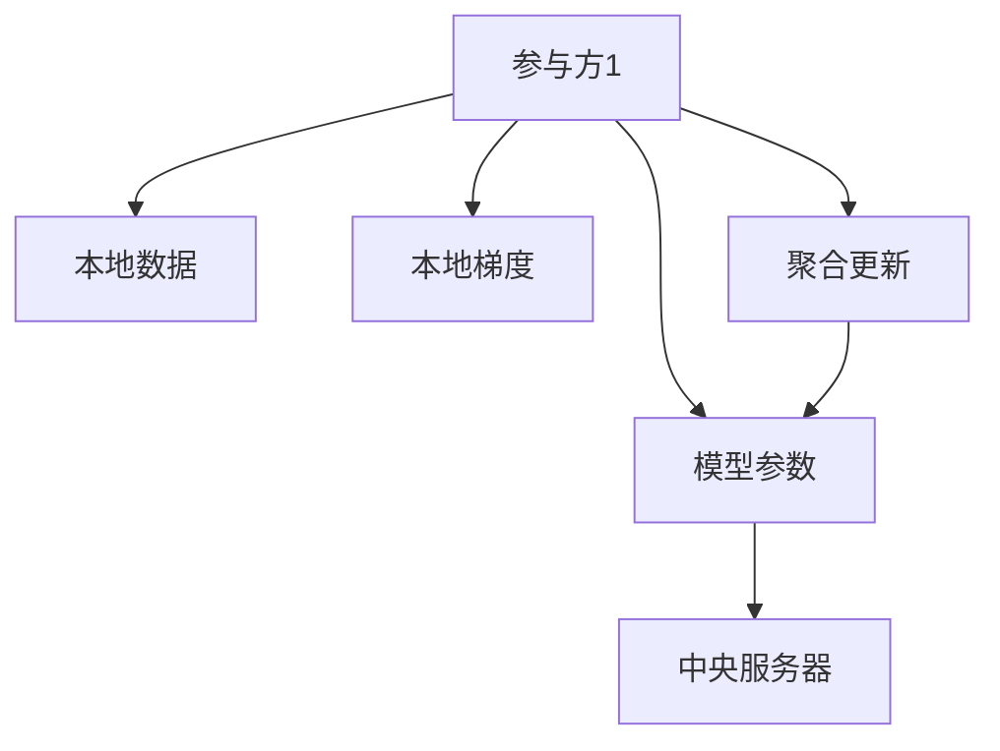

                 

## 1. 背景介绍

### 1.1 问题由来

随着深度学习和大数据技术的发展，机器学习模型在许多领域取得了巨大成功。然而，数据隐私问题日益凸显，特别是当涉及到个人敏感信息时，如何保护用户隐私成为一个重大挑战。传统的集中式机器学习（Centralized ML）方法要求将所有数据集中到单台机器上进行训练，极易造成数据泄露。为了解决这一问题，分布式机器学习（Distributed ML）应运而生，通过在多台机器上并行训练模型，可以显著降低数据集中的风险。

联合学习（Federated Learning, FL）是一种特殊的分布式机器学习方法，它允许在各个参与方（例如移动设备或边缘服务器）上本地训练模型，而无需共享原始数据，从而实现保护隐私的同时提升模型性能。联合学习广泛应用于物联网（IoT）、个性化推荐、金融风控等领域，为大数据时代的数据安全提供了一条新的路径。

### 1.2 问题核心关键点

联合学习技术通过分布式、本地化的方式训练模型，保护了用户隐私。与传统的集中式训练不同，联合学习只需要参与方共享模型参数和局部梯度，从而避免了数据集中存储带来的风险。同时，联合学习强调模型参数的分布式更新，可以有效降低通信开销和计算负担，适用于大规模的分布式环境。

## 2. 核心概念与联系

### 2.1 核心概念概述

联合学习是分布式机器学习领域的一个关键技术，它使得各个参与方可以在本地数据上训练模型，而不必共享原始数据，从而保护用户隐私。与传统的集中式训练不同，联合学习强调模型的分布式更新，即各个参与方只分享模型参数和本地梯度信息，通过聚合这些信息来更新全局模型。这种分布式训练方式使得模型能够充分利用多源异构数据，提升整体性能。

以下是联合学习中的几个核心概念：

- 参与方（Parties）：本地设备或服务器，负责本地数据训练并上传更新到中央服务器。
- 中央服务器（Central Server）：负责协调各个参与方的训练，聚合更新并发布下一次训练指令。
- 本地数据（Local Data）：各参与方拥有的本地数据集，用于本地模型的训练。
- 模型参数（Model Parameters）：共享在各个参与方之间的全局模型参数。
- 本地梯度（Local Gradients）：在本地数据上训练模型后得到的梯度信息。
- 聚合更新（Aggregation Updates）：通过计算各个参与方的本地梯度来更新全局模型参数。

### 2.2 核心概念原理和架构的 Mermaid 流程图



这个流程图展示了联合学习的基本架构：

- 每个参与方本地训练模型，并计算本地梯度。
- 本地梯度被发送到中央服务器。
- 中央服务器计算全局梯度，并发布下一次训练指令。
- 每个参与方更新模型参数，参与下一次训练。

## 3. 核心算法原理 & 具体操作步骤

### 3.1 算法原理概述

联合学习的核心在于将模型参数和本地梯度分离开来，使得各个参与方可以在本地数据上训练模型，而无需共享原始数据。通过在本地训练过程中不断更新模型参数，使得模型能够学习到本地数据的特点，并在全局范围内进行聚合，从而提升整体性能。

联合学习的训练过程通常包括以下几个步骤：

1. 初始化模型参数。
2. 在各个参与方本地数据上训练模型，计算本地梯度。
3. 将本地梯度发送到中央服务器。
4. 中央服务器聚合本地梯度，计算全局梯度。
5. 更新全局模型参数，发布下一次训练指令。
6. 重复以上步骤，直到模型收敛。

### 3.2 算法步骤详解

以下是联合学习算法的详细步骤：

**Step 1: 初始化模型参数**

- 初始化全局模型参数 $\theta$。
- 设置参与方的数量 $N$，并随机分配各个参与方的本地数据集。

**Step 2: 本地训练和计算本地梯度**

- 在每个参与方 $i$ 上，使用本地数据集 $\mathcal{D}_i$ 训练模型 $M(\theta)$。
- 计算本地梯度 $\Delta_i = \frac{\partial L}{\partial \theta}(\mathcal{D}_i)$，其中 $L$ 为损失函数。
- 每个参与方更新本地模型参数 $\theta_i = \theta - \eta \Delta_i$，其中 $\eta$ 为学习率。

**Step 3: 中央服务器计算全局梯度**

- 中央服务器收集各个参与方的本地梯度 $\{\Delta_i\}$。
- 计算全局梯度 $\Delta = \frac{1}{N} \sum_{i=1}^N \Delta_i$。

**Step 4: 全局模型参数更新**

- 更新全局模型参数 $\theta = \theta - \eta \Delta$。
- 中央服务器将更新后的模型参数 $\theta$ 广播给各个参与方。

**Step 5: 重复执行**

- 重复执行步骤2至步骤4，直到模型收敛或达到预设的迭代次数。

### 3.3 算法优缺点

联合学习算法具有以下优点：

- 保护隐私：模型参数和本地梯度在各个参与方之间不共享，避免了原始数据泄露的风险。
- 分布式训练：充分利用多源异构数据，提升模型性能。
- 可扩展性强：适用于大规模分布式环境，能够处理大量参与方。

同时，联合学习算法也存在以下缺点：

- 通信开销：中央服务器需要接收和处理大量本地梯度，通信开销较大。
- 收敛速度慢：由于模型参数需要在各个参与方之间不断更新，收敛速度可能较慢。
- 分布式同步：需要解决分布式环境下的同步问题，增加了算法复杂度。

### 3.4 算法应用领域

联合学习在许多领域都有广泛的应用：

- 个性化推荐：通过收集用户的本地数据，如浏览记录、搜索历史等，在不泄露用户隐私的情况下，提供个性化的推荐服务。
- 金融风控：利用用户的本地设备数据进行信用评分，保护用户隐私的同时提升风控模型的准确性。
- 医疗健康：利用患者的本地设备数据（如可穿戴设备）进行健康监测和疾病预测，保护患者隐私的同时提升医疗服务质量。
- 物联网（IoT）：利用各个设备本地数据进行智能控制和优化，如智能家居、智能交通等。

## 4. 数学模型和公式 & 详细讲解 & 举例说明

### 4.1 数学模型构建

联合学习的数学模型可以表示为：

$$
\min_{\theta} L(\theta) = \sum_{i=1}^N L_i(\theta_i)
$$

其中 $L_i(\theta_i)$ 为参与方 $i$ 在本地数据集 $\mathcal{D}_i$ 上的损失函数，$\theta_i$ 为参与方 $i$ 的本地模型参数。

### 4.2 公式推导过程

联合学习的核心公式为聚合更新公式：

$$
\Delta = \frac{1}{N} \sum_{i=1}^N \Delta_i
$$

其中 $\Delta_i$ 为参与方 $i$ 在本地数据集 $\mathcal{D}_i$ 上计算得到的梯度。

将聚合更新公式应用于全局模型参数的更新，可以得到：

$$
\theta = \theta - \eta \Delta
$$

其中 $\eta$ 为学习率。

### 4.3 案例分析与讲解

以线性回归为例，假设有一个全局线性回归模型：

$$
\theta = \begin{bmatrix} \theta_0 \\ \theta_1 \\ \theta_2 \\ \vdots \\ \theta_d \end{bmatrix}
$$

其中 $\theta_0$ 为截距，$\theta_1, \theta_2, \ldots, \theta_d$ 为各个特征的权重。

在联合学习中，各个参与方的本地数据集 $\mathcal{D}_i$ 可以表示为：

$$
\mathcal{D}_i = \{(x_{i,j}, y_{i,j})\}_{j=1}^m
$$

其中 $x_{i,j}$ 为第 $i$ 个参与方 $j$ 样本的特征向量，$y_{i,j}$ 为第 $i$ 个参与方 $j$ 样本的标签。

在每个参与方 $i$ 上，计算本地梯度 $\Delta_i$：

$$
\Delta_i = \frac{1}{m_i} \sum_{j=1}^{m_i} \nabla_{\theta} L_i(\theta_i)
$$

其中 $m_i$ 为参与方 $i$ 的样本数量。

将 $\Delta_i$ 发送给中央服务器，并计算全局梯度 $\Delta$：

$$
\Delta = \frac{1}{N} \sum_{i=1}^N \Delta_i
$$

最后，更新全局模型参数：

$$
\theta = \theta - \eta \Delta
$$

通过这样的过程，联合学习可以在保护隐私的前提下，实现分布式训练，提升模型的整体性能。

## 5. 项目实践：代码实例和详细解释说明

### 5.1 开发环境搭建

在进行联合学习实践前，我们需要准备好开发环境。以下是使用Python进行TensorFlow实现联合学习的开发环境配置流程：

1. 安装Anaconda：从官网下载并安装Anaconda，用于创建独立的Python环境。

2. 创建并激活虚拟环境：
```bash
conda create -n fl_env python=3.8 
conda activate fl_env
```

3. 安装TensorFlow：根据CUDA版本，从官网获取对应的安装命令。例如：
```bash
conda install tensorflow -c tf
```

4. 安装其他依赖库：
```bash
pip install numpy scipy matplotlib
```

完成上述步骤后，即可在`fl_env`环境中开始联合学习实践。

### 5.2 源代码详细实现

以下是使用TensorFlow实现联合学习的代码示例，具体实现步骤为：

```python
import tensorflow as tf
import numpy as np

# 定义全局模型参数和本地模型参数
global_params = tf.Variable(tf.random.normal([d]))
local_params = [tf.Variable(tf.random.normal([d])) for _ in range(N)]

# 定义全局损失函数
global_loss = tf.keras.losses.MSE()

# 定义本地损失函数
local_loss = [tf.keras.losses.MSE() for _ in range(N)]

# 定义模型更新函数
def update_local_params():
    for i in range(N):
        with tf.GradientTape() as tape:
            local_loss[i].update_state(local_x[i], local_y[i])
        local_grads = tape.gradient(local_loss[i], local_params[i])
        local_params[i].assign_sub(learning_rate * local_grads)

def update_global_params():
    with tf.GradientTape() as tape:
        global_loss.update_state(global_x, global_y)
    global_grads = tape.gradient(global_loss, global_params)
    global_params.assign_sub(learning_rate * global_grads)

# 定义聚合更新函数
def aggregate_updates():
    update_global_params()
    for i in range(N):
        update_local_params()

# 初始化全局模型参数和本地模型参数
global_params = tf.Variable(tf.random.normal([d]))
local_params = [tf.Variable(tf.random.normal([d])) for _ in range(N)]

# 初始化学习率和迭代次数
learning_rate = 0.001
num_iterations = 1000

# 开始训练
for i in range(num_iterations):
    # 随机生成本地数据
    local_x = np.random.rand(N, m).astype(np.float32)
    local_y = np.random.rand(N, m).astype(np.float32)
    global_x = np.random.rand(m).astype(np.float32)
    global_y = np.random.rand(m).astype(np.float32)
    
    # 聚合更新
    aggregate_updates()
    
    # 输出结果
    if i % 100 == 0:
        print("Iteration %d: global_loss %f" % (i, global_loss(global_x, global_y).numpy()))
```

### 5.3 代码解读与分析

让我们再详细解读一下关键代码的实现细节：

- **变量定义**：
  - `global_params`：全局模型参数。
  - `local_params`：本地模型参数，每个参与方都有一个。
  - `global_loss`：全局损失函数，用于计算全局模型的误差。
  - `local_loss`：本地损失函数，每个参与方一个。

- **模型更新函数**：
  - `update_local_params`：在每个参与方本地数据上训练模型，计算本地梯度，并更新本地模型参数。
  - `update_global_params`：计算全局梯度，并更新全局模型参数。

- **聚合更新函数**：
  - `aggregate_updates`：聚合各个参与方的更新，同时更新全局模型参数。

- **训练过程**：
  - 随机生成本地数据和全局数据。
  - 聚合更新。
  - 输出全局损失。

可以看到，通过TensorFlow实现的联合学习代码相对简洁，开发者可以使用类似的方式对其他框架进行实现。

## 6. 实际应用场景

### 6.1 金融风控

联合学习在金融风控领域有着广泛的应用。金融机构需要收集大量的用户数据进行信用评分，但这些数据往往包含敏感信息，如收入、财务状况等。通过联合学习，金融机构可以在不泄露用户数据的前提下，利用各个分支机构的本地数据进行模型训练，提升信用评分的准确性。

在技术实现上，金融机构可以与各个分支机构合作，共享模型参数和本地梯度，利用联合学习进行多源异构数据的融合，提升信用评分模型的性能。具体步骤如下：

1. 各个分支机构收集用户的本地数据，如信用卡交易记录、贷款申请信息等。
2. 在本地数据上训练模型，计算本地梯度。
3. 将本地梯度发送到中央服务器，并计算全局梯度。
4. 更新全局模型参数，发布下一次训练指令。
5. 重复执行上述步骤，直到模型收敛。

通过联合学习，金融机构可以在保护用户隐私的前提下，利用多源异构数据进行模型训练，提升信用评分的准确性。

### 6.2 物联网（IoT）

物联网设备数量庞大，但每个设备的数据量有限。通过联合学习，物联网设备可以共享本地数据进行模型训练，提升整体系统的性能。

具体实现步骤如下：

1. 各个物联网设备收集本地的传感器数据，如温度、湿度、气压等。
2. 在本地数据上训练模型，计算本地梯度。
3. 将本地梯度发送到中央服务器，并计算全局梯度。
4. 更新全局模型参数，发布下一次训练指令。
5. 重复执行上述步骤，直到模型收敛。

通过联合学习，物联网设备可以共享本地数据进行模型训练，提升整体系统的性能，实现更智能的物联网应用。

### 6.3 医疗健康

联合学习在医疗健康领域也有着广泛的应用。医疗机构需要收集大量的患者数据进行健康监测和疾病预测，但这些数据往往包含敏感信息，如病历记录、基因信息等。通过联合学习，医疗机构可以在不泄露患者数据的前提下，利用各个医院的本地数据进行模型训练，提升健康监测和疾病预测的准确性。

具体实现步骤如下：

1. 各个医院收集患者的本地数据，如病历记录、基因信息等。
2. 在本地数据上训练模型，计算本地梯度。
3. 将本地梯度发送到中央服务器，并计算全局梯度。
4. 更新全局模型参数，发布下一次训练指令。
5. 重复执行上述步骤，直到模型收敛。

通过联合学习，医疗机构可以在保护患者隐私的前提下，利用多源异构数据进行模型训练，提升健康监测和疾病预测的准确性。

### 6.4 未来应用展望

随着联合学习技术的发展，未来将有更多的应用场景：

- 隐私保护：联合学习可以保护用户隐私，适用于对数据敏感的场景，如医疗、金融等领域。
- 高效通信：联合学习可以有效降低通信开销，适用于分布式计算环境。
- 模型泛化：联合学习可以融合多源异构数据，提升模型的泛化能力。
- 鲁棒性：联合学习可以避免单点故障，提升系统的鲁棒性。

## 7. 工具和资源推荐

### 7.1 学习资源推荐

为了帮助开发者系统掌握联合学习的理论基础和实践技巧，这里推荐一些优质的学习资源：

1. 《联邦学习：原理与实践》系列博文：由联邦学习专家撰写，深入浅出地介绍了联邦学习的原理、算法和应用场景。

2. 斯坦福大学《联邦学习》课程：斯坦福大学开设的联邦学习课程，有Lecture视频和配套作业，带你入门联邦学习领域。

3. 《联邦学习：技术与应用》书籍：联邦学习领域的经典书籍，全面介绍了联邦学习的原理、算法和实际应用。

4. TensorFlow联邦学习官方文档：TensorFlow联邦学习的官方文档，提供了丰富的样例代码和实际应用场景，是上手实践的必备资料。

5. MLReview网站：联邦学习领域的权威网站，提供最新的研究成果、论文、工具和资源，是联邦学习领域的学习者和从业者的重要参考。

通过对这些资源的学习实践，相信你一定能够快速掌握联合学习的精髓，并用于解决实际的联邦学习问题。

### 7.2 开发工具推荐

高效的开发离不开优秀的工具支持。以下是几款用于联邦学习开发的常用工具：

1. TensorFlow：基于Python的开源深度学习框架，灵活动态的计算图，适合快速迭代研究。TensorFlow提供了丰富的联邦学习组件，适用于实际工程应用。

2. PyTorch：基于Python的开源深度学习框架，动态计算图，适合研究性工作。PyTorch也支持联邦学习，提供了灵活的实现方式。

3. FL Frameworks：如TensorFlow Federated、PySyft等，专门为联邦学习设计的工具库，提供了丰富的联邦学习组件和接口。

4. Weights & Biases：模型训练的实验跟踪工具，可以记录和可视化联邦学习过程中的各项指标，方便对比和调优。

5. TensorBoard：TensorFlow配套的可视化工具，可实时监测联邦学习状态，并提供丰富的图表呈现方式，是调试模型的得力助手。

合理利用这些工具，可以显著提升联邦学习开发的效率，加快创新迭代的步伐。

### 7.3 相关论文推荐

联合学习是联邦学习领域的核心技术，相关的论文代表了这个领域的发展脉络。以下是几篇奠基性的相关论文，推荐阅读：

1. A FedAvg Algorithm for Distributed Deep Learning（FedAvg论文）：提出FedAvg算法，成为联邦学习的经典算法。

2. Model-agnostic Federated Optimization（Mojito paper）：提出MOJO算法，适用于非同构数据和异步训练的联邦学习。

3. Federated Learning: Concept and Applications（概述论文）：概述了联邦学习的原理和应用场景，是入门联邦学习的必读论文。

4. Differential Privacy-Aware Federated Learning（差分隐私论文）：介绍差分隐私技术在联邦学习中的应用，增强了联邦学习模型的隐私保护能力。

5. Federated Learning for Credit Scoring（信用评分论文）：讨论了联邦学习在金融风控中的应用，提供了联邦学习模型的实际应用案例。

这些论文代表了大语言模型微调技术的发展脉络。通过学习这些前沿成果，可以帮助研究者把握学科前进方向，激发更多的创新灵感。

## 8. 总结：未来发展趋势与挑战

### 8.1 总结

本文对联合学习技术进行了全面系统的介绍。首先阐述了联合学习的背景和重要性，明确了联合学习在保护隐私和分布式训练中的独特价值。其次，从原理到实践，详细讲解了联合学习的数学模型和关键步骤，给出了联邦学习任务开发的完整代码实例。同时，本文还广泛探讨了联合学习技术在金融风控、物联网、医疗健康等多个领域的应用前景，展示了联合学习范式的巨大潜力。此外，本文精选了联合学习的各类学习资源，力求为读者提供全方位的技术指引。

通过本文的系统梳理，可以看到，联合学习技术正在成为联邦学习领域的重要范式，极大地拓展了模型训练的应用边界，催生了更多的落地场景。受益于大规模数据的预训练和大模型的微调，联邦学习技术必将在更多领域得到应用，为大数据时代的数据安全提供新的解决方案。未来，伴随联邦学习方法的持续演进，相信联合学习技术也将迎来更加广阔的应用前景。

### 8.2 未来发展趋势

展望未来，联合学习技术将呈现以下几个发展趋势：

1. 联邦数据聚合技术：为了提高联邦学习模型的性能，需要更高效的数据聚合方法。未来将涌现更多联邦数据聚合技术，如层次聚合、联邦学习加速等。

2. 差分隐私保护：差分隐私是联合学习中常用的隐私保护技术，未来将进一步研究和应用差分隐私保护，增强联邦学习模型的隐私保护能力。

3. 分布式异构数据处理：联邦学习模型需要处理异构数据，未来的研究将更加关注异构数据的预处理和融合，提升模型的泛化能力。

4. 模型压缩与加速：联邦学习模型需要处理海量数据，未来的研究将更加关注模型压缩和加速，提升联邦学习模型的训练和推理效率。

5. 联邦学习与区块链结合：区块链技术可以提供去中心化的分布式账本，未来将更多地与联邦学习结合，提升联邦学习模型的安全性。

以上趋势凸显了联合学习技术的广阔前景。这些方向的探索发展，必将进一步提升联邦学习系统的性能和应用范围，为大数据时代的数据安全提供新的解决方案。

### 8.3 面临的挑战

尽管联合学习技术已经取得了瞩目成就，但在迈向更加智能化、普适化应用的过程中，它仍面临着诸多挑战：

1. 通信开销：中央服务器需要接收和处理大量本地梯度，通信开销较大。未来的研究将更多关注通信开销的降低。

2. 模型收敛：联合学习模型的收敛速度较慢，未来的研究将更多关注如何加速模型收敛。

3. 分布式同步：分布式环境下的同步问题复杂，未来的研究将更多关注如何实现高效的分布式同步。

4. 隐私保护：联合学习需要保护用户隐私，差分隐私技术虽然已经成熟，但如何在不降低模型性能的情况下，进一步增强隐私保护能力，仍然是一个重要研究方向。

5. 模型泛化：联邦学习模型需要处理异构数据，如何在不降低模型泛化能力的前提下，提升数据处理效率，也是一个重要研究方向。

6. 安全性和鲁棒性：联邦学习模型需要具备鲁棒性和安全性，未来的研究将更多关注如何提高联邦学习模型的鲁棒性和安全性。

以上挑战凸显了联合学习技术的复杂性。只有不断攻克这些难题，才能进一步提升联合学习系统的性能和应用范围。

### 8.4 研究展望

面对联合学习面临的种种挑战，未来的研究需要在以下几个方面寻求新的突破：

1. 优化通信开销：研究更高效的联邦数据聚合技术，降低通信开销。

2. 加速模型收敛：研究更高效的联合学习算法，提高模型收敛速度。

3. 改进分布式同步：研究更高效的分布式同步技术，提升联邦学习模型的效率。

4. 增强隐私保护：研究更高效的差分隐私保护技术，增强联邦学习模型的隐私保护能力。

5. 提升模型泛化：研究更高效的异构数据处理技术，提升联邦学习模型的泛化能力。

6. 提高模型鲁棒性：研究更鲁棒的联合学习算法，提升联邦学习模型的鲁棒性和安全性。

这些研究方向的研究进展，必将进一步提升联合学习系统的性能和应用范围，为大数据时代的数据安全提供新的解决方案。面向未来，联合学习技术还需要与其他人工智能技术进行更深入的融合，如知识表示、因果推理、强化学习等，多路径协同发力，共同推动联邦学习技术的进步。只有勇于创新、敢于突破，才能不断拓展联邦学习技术的边界，为构建安全、可靠、可解释、可控的智能系统铺平道路。

## 9. 附录：常见问题与解答

**Q1：联合学习与传统的分布式训练有什么区别？**

A: 传统的分布式训练（Distributed Training）是将数据集分散在多台机器上进行训练，每台机器共享全局模型参数，本地梯度通过参数服务器聚合，然后再更新全局模型参数。而联合学习（Federated Learning）是每个参与方在本地数据上训练模型，只共享模型参数和本地梯度，避免了数据集中存储带来的风险。

**Q2：联合学习与传统的集中式训练相比，有什么优势？**

A: 联合学习在保护用户隐私的前提下，通过多源异构数据的融合，提升了模型的泛化能力和性能。传统的集中式训练需要共享原始数据，存在数据泄露的风险。

**Q3：联合学习在分布式环境下如何处理同步问题？**

A: 联合学习需要在分布式环境下处理同步问题，通常采用异步更新、定期同步等策略。异步更新可以提高系统的可扩展性，定期同步可以保证模型的一致性。

**Q4：联合学习中如何保护用户隐私？**

A: 联合学习通过只共享模型参数和本地梯度，避免了原始数据泄露的风险。此外，差分隐私技术也可以用于联合学习，进一步增强隐私保护能力。

**Q5：联合学习在实际应用中需要注意哪些问题？**

A: 联合学习在实际应用中需要注意通信开销、模型收敛、分布式同步等问题。此外，还需要考虑差分隐私保护、异构数据处理、模型压缩等挑战。

通过对这些问题的回答，相信你一定能够更好地理解联合学习技术的核心概念和应用场景。

---

作者：禅与计算机程序设计艺术 / Zen and the Art of Computer Programming

