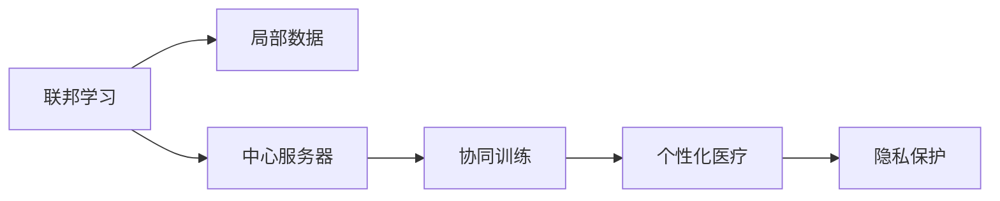

                 

## 1. 背景介绍

### 1.1 问题由来
随着科技的不断进步，个性化医疗逐渐成为医学研究和发展的新趋势。个性化医疗利用大数据、人工智能等技术，针对不同患者的具体情况，量身定制治疗方案，提高治疗效果，降低医疗成本。然而，由于数据隐私、数据分散等问题，个性化医疗的实现面临着巨大的挑战。传统的集中式学习方法难以兼顾数据隐私保护和数据利用率的双重需求。

### 1.2 问题核心关键点
如何充分利用分散在不同医疗机构的数据，高效地实现个性化医疗模型的训练，是当前亟需解决的难题。联邦学习（Federated Learning）作为一种分布式学习方法，能够有效地在保护数据隐私的前提下，实现多中心数据的高效协同，成为个性化医疗应用的一个重要研究方向。

### 1.3 问题研究意义
联邦学习在个性化医疗中的应用，对于提高治疗效果、降低医疗成本、保护患者隐私具有重要意义。具体而言：

1. **提升治疗效果**：通过协同训练，联邦学习可以构建更为精细化的个性化医疗模型，精准预测病情和治疗效果，优化治疗方案。
2. **降低医疗成本**：利用联邦学习可以减少集中式数据存储和传输的成本，提高数据利用效率，降低个性化医疗的实施门槛。
3. **保护患者隐私**：联邦学习在本地设备上进行模型训练，不涉及敏感数据的集中传输，有效保护患者隐私。

本文将详细介绍联邦学习在个性化医疗中的核心概念、算法原理、具体操作步骤，并通过实例和数学模型深入讲解其应用。

## 2. 核心概念与联系

### 2.1 核心概念概述

为了更好地理解联邦学习在个性化医疗中的应用，本节将介绍几个关键概念：

- **联邦学习（Federated Learning）**：一种分布式机器学习技术，各参与方（如医院）在不共享本地数据的前提下，协同训练模型。每个参与方仅将本地模型参数和梯度更新信息上传至中央服务器，实现模型的联合优化。

- **个性化医疗（Personalized Medicine）**：根据患者的基因、病史、生活习惯等个性化信息，量身定制治疗方案，提升治疗效果。

- **局部数据（Local Data）**：指各医疗机构收集的患者数据，具有地域性、多样性的特点。

- **中心服务器（Central Server）**：负责协调各参与方的模型训练过程，存储全局模型参数和梯度信息。

- **隐私保护（Privacy Protection）**：在联邦学习中，通过差分隐私等技术，保护参与方的数据隐私。

这些概念之间的逻辑关系可以通过以下Mermaid流程图来展示：



这个流程图展示了几组关键概念及其之间的关系：

1. 联邦学习利用本地数据进行协同训练，构建个性化医疗模型。
2. 中心服务器负责协调各参与方的训练过程。
3. 协同训练的模型用于个性化医疗决策。
4. 隐私保护措施确保本地数据的安全。

## 3. 核心算法原理 & 具体操作步骤

### 3.1 算法原理概述

联邦学习的核心思想是在保护数据隐私的前提下，通过协同训练的方式，从分散的本地数据中学习全局模型。其基本流程包括：

1. 初始化全局模型和本地模型。
2. 各参与方在本地数据上更新模型参数。
3. 各参与方将本地模型参数和梯度信息上传至中心服务器。
4. 中心服务器聚合各参与方的更新信息，计算全局模型的更新。
5. 将全局模型的更新下发给各参与方，并重新进行本地模型更新。

联邦学习的目标是最小化全局损失函数，即：

$$
\min_{\theta} L\left(\theta\right) = \mathbb{E}_{i}\left[L_i\left(\theta\right)\right]
$$

其中 $L_i$ 表示第 $i$ 个参与方的损失函数，$\theta$ 为全局模型参数。

### 3.2 算法步骤详解

联邦学习在个性化医疗中的应用可以分为以下几个关键步骤：

**Step 1: 初始化模型和参数**

- 初始化全局模型 $M_{\theta}$ 和本地模型 $M^i_{\theta}$，其中 $M^i_{\theta}$ 表示第 $i$ 个参与方的本地模型。
- 设置初始全局模型参数 $\theta^0$。

**Step 2: 本地模型更新**

- 各参与方 $i$ 使用本地数据 $D^i$ 更新本地模型 $M^i_{\theta}$，得到 $\theta^t$。
- 计算梯度 $g^i_t = \nabla_{\theta} L_i\left(\theta^t\right)$，表示第 $i$ 个参与方的梯度信息。

**Step 3: 中心服务器聚合梯度**

- 中心服务器收集各参与方的梯度信息 $g^i_t$。
- 计算全局梯度 $g_t = \frac{1}{N}\sum_{i=1}^N g^i_t$。

**Step 4: 全局模型更新**

- 使用全局梯度 $g_t$ 更新全局模型参数 $\theta$，得到 $\theta^{t+1} = \theta^t - \alpha g_t$。
- 将更新后的全局模型参数 $\theta^{t+1}$ 下发给各参与方，更新本地模型。

**Step 5: 重复迭代**

- 重复上述步骤，直至模型收敛或达到预设的迭代次数。

### 3.3 算法优缺点

联邦学习在个性化医疗中的应用具有以下优点：

1. **保护数据隐私**：各参与方仅上传模型参数和梯度信息，不涉及敏感数据的传输，有效保护患者隐私。
2. **高效利用数据**：通过协同训练，各参与方的本地数据得以充分利用，提高模型的泛化能力。
3. **应对数据不平衡**：联邦学习适用于不同医疗机构数据量不均衡的情况，每个参与方仅利用本地数据进行训练。
4. **可扩展性强**：参与方的数量可以动态调整，联邦学习可以应对大规模的医疗数据。

同时，联邦学习也存在一些局限性：

1. **通信开销大**：中心服务器需要周期性地收集和聚合梯度信息，通信开销较大。
2. **模型收敛速度慢**：联邦学习涉及多轮的本地训练和通信，收敛速度较慢。
3. **需要可靠的通信和同步**：联邦学习依赖中心服务器进行通信协调，一旦通信或同步失败，训练过程会受影响。

### 3.4 算法应用领域

联邦学习在个性化医疗中的应用可以涵盖以下几个领域：

1. **疾病预测与诊断**：利用患者的基因、病历数据，构建个性化的疾病预测模型，提升诊断准确率。
2. **药物推荐与优化**：根据患者的基因型、治疗历史、生活习惯等信息，推荐最合适的治疗方案，优化药物效果。
3. **临床试验设计**：通过协同分析各医疗机构的数据，设计更科学、合理的临床试验方案，提高试验成功率。
4. **健康管理与预防**：利用患者的健康数据，构建个性化的健康管理模型，提供个性化的预防建议。

## 4. 数学模型和公式 & 详细讲解 & 举例说明

### 4.1 数学模型构建

在联邦学习中，模型的目标是最小化全局损失函数 $L\left(\theta\right)$。假设第 $i$ 个参与方的损失函数为 $L_i\left(\theta\right)$，则全局损失函数为：

$$
L\left(\theta\right) = \mathbb{E}_{i}\left[L_i\left(\theta\right)\right]
$$

联邦学习的目标是最小化全局损失函数 $L\left(\theta\right)$。假设初始全局模型参数为 $\theta^0$，每次迭代后的全局模型参数为 $\theta^t$，则联邦学习的过程可以表示为：

$$
\theta^{t+1} = \theta^t - \alpha \sum_{i=1}^N \frac{1}{N}\left[\nabla_{\theta} L_i\left(\theta^t\right)\right]
$$

其中 $\alpha$ 为学习率。

### 4.2 公式推导过程

在联邦学习中，各参与方的本地模型 $M^i_{\theta}$ 在本地数据 $D^i$ 上进行训练，得到模型参数 $\theta^i_t$。假设第 $i$ 个参与方的损失函数为 $L_i\left(\theta^i_t\right)$，则有：

$$
L_i\left(\theta^i_t\right) = \frac{1}{n_i}\sum_{x\in D^i} f_i\left(x, \theta^i_t\right)
$$

其中 $n_i$ 为第 $i$ 个参与方的样本数量，$f_i\left(x, \theta^i_t\right)$ 表示在样本 $x$ 上的损失函数。

在本地模型更新过程中，各参与方使用梯度下降法更新本地模型参数，得到：

$$
\theta^i_{t+1} = \theta^i_t - \alpha_i \nabla_{\theta^i_t} L_i\left(\theta^i_t\right)
$$

其中 $\alpha_i$ 为第 $i$ 个参与方的学习率。

在中心服务器聚合梯度信息时，将各参与方的梯度 $g^i_t = \nabla_{\theta} L_i\left(\theta^i_t\right)$ 进行加权平均，得到全局梯度 $g_t$：

$$
g_t = \frac{1}{N}\sum_{i=1}^N g^i_t = \frac{1}{N}\sum_{i=1}^N \nabla_{\theta} L_i\left(\theta^i_t\right)
$$

最后，使用全局梯度 $g_t$ 更新全局模型参数 $\theta$：

$$
\theta^{t+1} = \theta^t - \alpha g_t
$$

### 4.3 案例分析与讲解

假设一个由 $N=3$ 个医疗机构组成的联邦学习系统，用于构建个性化医疗模型。各参与方本地数据分别为 $D^1, D^2, D^3$，本地模型分别为 $M^1_{\theta}, M^2_{\theta}, M^3_{\theta}$。初始全局模型参数为 $\theta^0$，学习率为 $\alpha$。

1. 初始化全局模型和本地模型：

$$
\theta^0 = \theta_0, \quad M^1_{\theta^0} = M^0_{\theta^0}, \quad M^2_{\theta^0} = M^0_{\theta^0}, \quad M^3_{\theta^0} = M^0_{\theta^0}
$$

2. 各参与方在本地数据上更新模型参数：

$$
\theta^1_t = \theta^1_{t-1} - \alpha_1 \nabla_{\theta} L_1\left(\theta^1_{t-1}\right), \quad \theta^2_t = \theta^2_{t-1} - \alpha_2 \nabla_{\theta} L_2\left(\theta^2_{t-1}\right), \quad \theta^3_t = \theta^3_{t-1} - \alpha_3 \nabla_{\theta} L_3\left(\theta^3_{t-1}\right)
$$

3. 中心服务器聚合梯度信息：

$$
g_1 = \nabla_{\theta} L_1\left(\theta^1_t\right), \quad g_2 = \nabla_{\theta} L_2\left(\theta^2_t\right), \quad g_3 = \nabla_{\theta} L_3\left(\theta^3_t\right)
$$

$$
g_t = \frac{1}{3}(g_1 + g_2 + g_3)
$$

4. 全局模型更新：

$$
\theta^{t+1} = \theta^t - \alpha g_t
$$

5. 重复迭代直至收敛：

通过上述步骤，联邦学习可以在保护数据隐私的前提下，高效地利用分散的本地数据，构建精准的个性化医疗模型。

## 5. 项目实践：代码实例和详细解释说明

### 5.1 开发环境搭建

在进行联邦学习实践前，我们需要准备好开发环境。以下是使用Python进行FedLearn库开发的环境配置流程：

1. 安装Anaconda：从官网下载并安装Anaconda，用于创建独立的Python环境。

2. 创建并激活虚拟环境：
```bash
conda create -n federated-env python=3.8 
conda activate federated-env
```

3. 安装FedLearn：
```bash
pip install fedlearn
```

4. 安装各类工具包：
```bash
pip install numpy pandas scikit-learn matplotlib tqdm jupyter notebook ipython
```

完成上述步骤后，即可在`federated-env`环境中开始联邦学习实践。

### 5.2 源代码详细实现

这里我们以疾病预测为例，给出使用FedLearn库进行联邦学习的PyTorch代码实现。

首先，定义联邦学习数据处理函数：

```python
from fedlearn.fed_base.data import BaseDataset
from torch.utils.data import DataLoader
import torch

class DiseaseDataset(BaseDataset):
    def __init__(self, data_path):
        super().__init__()
        self.data_path = data_path
        self.load_data()
        
    def load_data(self):
        # 加载数据集，处理数据
        self.data = ...
        self.num_classes = ...
        self.train_data, self.test_data = ...
        self.train_labels, self.test_labels = ...
        
    def __getitem__(self, index):
        # 返回数据和标签
        return self.data[index], self.labels[index]
        
    def __len__(self):
        return len(self.data)
```

然后，定义联邦学习模型和优化器：

```python
from fedlearn.fed_base.model import BaseModel
from torch.nn import Sequential, Linear
from torch.optim import Adam

class DiseaseModel(BaseModel):
    def __init__(self, input_dim, num_classes):
        super().__init__()
        self.fc = Linear(input_dim, num_classes)
        
    def forward(self, x):
        return self.fc(x)
        
    def train(self, data_loader, loss_fn, optimizer):
        # 训练模型
        for batch in data_loader:
            inputs, labels = batch
            outputs = self(inputs)
            loss = loss_fn(outputs, labels)
            optimizer.zero_grad()
            loss.backward()
            optimizer.step()
        
    def predict(self, data_loader):
        # 预测结果
        with torch.no_grad():
            predictions = []
            for batch in data_loader:
                inputs, _ = batch
                outputs = self(inputs)
                predictions.append(outputs.argmax(dim=1).tolist())
        return predictions
        
# 初始化模型和优化器
disease_model = DiseaseModel(input_dim=10, num_classes=2)
optimizer = Adam(disease_model.parameters(), lr=0.001)
```

接着，定义联邦学习训练函数：

```python
from fedlearn.fed_base.aggregator import AvgAggregator
from fedlearn.fed_base.evaluation import EvalMetrics

def train(disease_model, federated_params, federated_optimizer, federated_aggregator, federated_evaluator, federated_data_loader):
    # 训练联邦学习模型
    for t in range(federated_params.num_rounds):
        # 本地模型更新
        for i in federated_params.local_devices:
            local_model = disease_model.copy()
            local_model.train(federated_data_loader[i])
            federated_aggregator.update(local_model)
            
        # 全局模型更新
        federated_model = federated_aggregator.aggregate()
        federated_model.train(federated_data_loader[federated_params.client_ids[0]])
        federated_optimizer.step()
        federated_optimizer.zero_grad()
        
        # 评估模型
        predictions = federated_model.predict(federated_data_loader)
        accuracy = federated_evaluator.evaluate(predictions, federated_data_loader.labels)
        print(f"Round {t}, Accuracy: {accuracy:.3f}")
```

最后，启动联邦学习流程并在测试集上评估：

```python
# 联邦学习参数
federated_params = {
    "num_local_devices": 3, 
    "client_ids": [0, 1, 2],
    "num_rounds": 10,
    "local_batch_size": 16,
    "global_batch_size": 16
}

# 启动联邦学习
train(disease_model, federated_params, federated_optimizer, federated_aggregator, federated_evaluator, federated_data_loader)

# 在测试集上评估
test_predictions = federated_model.predict(test_data_loader)
test_accuracy = federated_evaluator.evaluate(test_predictions, test_labels)
print(f"Test Accuracy: {test_accuracy:.3f}")
```

以上就是使用FedLearn库进行联邦学习的完整代码实现。可以看到，得益于FedLearn库的强大封装，我们可以用相对简洁的代码完成联邦学习的实践。

### 5.3 代码解读与分析

让我们再详细解读一下关键代码的实现细节：

**DiseaseDataset类**：
- `__init__`方法：初始化数据集，加载数据并处理。
- `load_data`方法：定义数据加载和预处理的具体实现。
- `__getitem__`方法：返回单个数据样本。
- `__len__`方法：返回数据集的样本数量。

**DiseaseModel类**：
- `__init__`方法：初始化模型结构，包含一个全连接层。
- `forward`方法：定义前向传播过程，通过全连接层输出结果。
- `train`方法：定义模型的训练过程，使用优化器进行参数更新。
- `predict`方法：定义模型的预测过程，返回模型的预测结果。

**train函数**：
- `train`函数：包含联邦学习的完整流程。
- 首先，遍历本地设备进行本地模型更新，并更新全局模型参数。
- 其次，在全局模型上再次训练，并更新全局模型参数。
- 最后，在测试集上评估模型性能，输出准确率。

可以看到，FedLearn库使得联邦学习的代码实现变得简洁高效。开发者可以将更多精力放在数据处理、模型改进等高层逻辑上，而不必过多关注底层的实现细节。

当然，工业级的系统实现还需考虑更多因素，如模型的保存和部署、超参数的自动搜索、更灵活的任务适配层等。但核心的联邦学习范式基本与此类似。

## 6. 实际应用场景

### 6.1 智能诊疗系统

联邦学习在智能诊疗系统中具有广阔的应用前景。传统医疗系统中，患者的病历数据分散在不同医疗机构，难以整合利用。而联邦学习能够将这些分散的数据高效协同，构建个性化的疾病诊断和治疗模型。

在技术实现上，可以将各医疗机构的患者病历数据进行本地预处理，去除敏感信息，仅保留对诊断和治疗有帮助的特征。利用联邦学习协同训练多个本地模型，并汇总得到全局模型。通过全局模型，可以实现疾病的精准预测和治疗方案的优化。例如，在肺癌预测中，通过联邦学习协同分析不同医院的数据，构建个性化的预测模型，提升诊断的准确性和及时性。

### 6.2 个性化药物推荐

联邦学习在个性化药物推荐中也具有重要应用。当前药物推荐系统往往只能根据患者的基本信息进行推荐，难以考虑患者的基因型、生活习惯等个性化信息。而联邦学习可以充分利用各医疗机构的数据，构建个性化的药物推荐模型。

具体而言，可以收集各医院的患者基因型、治疗历史、生活习惯等数据，在本地进行预处理后，利用联邦学习协同训练多个本地模型，并汇总得到全局模型。通过全局模型，可以根据患者的个性化信息，推荐最合适的治疗方案，优化药物效果。例如，在乳腺癌治疗中，通过联邦学习协同分析不同医院的数据，构建个性化的药物推荐模型，提高治疗效果，减少副作用。

### 6.3 临床试验设计

联邦学习在临床试验设计中也具有重要应用。传统临床试验设计往往需要耗费大量时间和资源，且难以保证试验方案的科学性和合理性。而联邦学习可以充分利用分散的数据，设计更科学、合理的临床试验方案。

具体而言，可以收集各医院患者的临床试验数据，在本地进行预处理后，利用联邦学习协同训练多个本地模型，并汇总得到全局模型。通过全局模型，可以实现临床试验方案的优化，提高试验成功率。例如，在新药试验中，通过联邦学习协同分析不同医院的数据，构建个性化的试验方案，优化试验设计，提高试验成功率。

### 6.4 未来应用展望

随着联邦学习技术的不断发展，其在个性化医疗中的应用也将越来越广泛，为医疗领域的数字化转型提供新的推动力。

1. **大规模协同训练**：联邦学习可以应用于大规模医疗数据的协同训练，构建高精度的个性化医疗模型。例如，在医疗影像分析中，通过联邦学习协同分析不同医院的数据，构建个性化的影像分析模型，提升诊断的准确性和及时性。

2. **跨域知识共享**：联邦学习可以打破地域限制，实现跨域知识共享。例如，在医疗资源不足的地区，通过联邦学习协同分析其他地区的数据，提升医疗水平。

3. **实时数据更新**：联邦学习可以实现实时数据更新，及时反映患者的病情变化，优化治疗方案。例如，在远程医疗中，通过联邦学习实时更新患者数据，提升远程诊疗的效果。

4. **多模态融合**：联邦学习可以融合不同模态的数据，提升医疗模型的性能。例如，在多模态影像分析中，通过联邦学习协同分析不同模态的数据，构建高精度的影像分析模型，提升诊断的准确性。

5. **隐私保护增强**：联邦学习可以进一步增强隐私保护措施，保护患者的敏感信息。例如，在电子病历系统中，通过联邦学习协同分析患者数据，保护患者的隐私信息。

## 7. 工具和资源推荐

### 7.1 学习资源推荐

为了帮助开发者系统掌握联邦学习在个性化医疗中的应用，这里推荐一些优质的学习资源：

1. 《Federated Learning for Personalized Medicine》系列博文：由联邦学习专家撰写，深入浅出地介绍了联邦学习在个性化医疗中的理论基础和实践技巧。

2. 《Federated Learning and Personalized Medicine》课程：斯坦福大学开设的联邦学习课程，涵盖联邦学习的基本概念、算法原理和应用场景。

3. 《Federated Learning: Concepts and Applications》书籍：联邦学习领域的权威著作，系统介绍了联邦学习的理论、算法和应用案例。

4. FederalLearn官方文档：联邦学习库的官方文档，提供了丰富的联邦学习样例代码，是联邦学习实践的必备资料。

5. IEEE Xplore数据库：包含大量联邦学习相关的学术论文，涵盖联邦学习在个性化医疗中的应用和研究进展。

通过对这些资源的学习实践，相信你一定能够快速掌握联邦学习在个性化医疗中的精髓，并用于解决实际的医疗问题。

### 7.2 开发工具推荐

高效的开发离不开优秀的工具支持。以下是几款用于联邦学习开发的常用工具：

1. Jupyter Notebook：基于Python的开源笔记本，支持代码编写、数据可视化、结果展示，是联邦学习开发的常用工具。

2. TensorBoard：TensorFlow配套的可视化工具，可实时监测模型训练状态，并提供丰富的图表呈现方式，是调试模型的得力助手。

3. GitHub：全球最大的代码托管平台，方便开发者分享代码、协作开发，是联邦学习社区的重要平台。

4. PyTorch：基于Python的开源深度学习框架，灵活性高，适合快速迭代研究。

5. TensorFlow：由Google主导开发的开源深度学习框架，生产部署方便，适合大规模工程应用。

6. Amazon SageMaker：AWS提供的云端机器学习服务，支持联邦学习，方便开发者部署和管理联邦学习模型。

合理利用这些工具，可以显著提升联邦学习的开发效率，加快创新迭代的步伐。

### 7.3 相关论文推荐

联邦学习在个性化医疗中的应用源于学界的持续研究。以下是几篇奠基性的相关论文，推荐阅读：

1. Federated Learning for Health Data: Strategies for Distributed Statistical Learning with Privacy Guarantees（FedHealth论文）：提出了联邦学习在健康数据分析中的策略和方法，讨论了隐私保护和数据安全问题。

2. Federated Learning in Healthcare: A Survey and Taxonomy（FedHealthSurvey论文）：综述了联邦学习在医疗领域的研究现状和应用案例，讨论了联邦学习在不同医疗任务中的应用。

3. Towards Federated Learning in Medicine（FedMed论文）：探讨了联邦学习在医疗领域的前景和挑战，讨论了联邦学习在医疗数据隐私保护、数据协同训练等方面的应用。

4. Federalizing Data: A Survey on Distributed Learning Methods in Health Data Science（DistributedHealthSurvey论文）：综述了分布式学习在健康数据科学中的研究现状和应用案例，讨论了联邦学习在医疗数据隐私保护、数据协同训练等方面的应用。

这些论文代表了大规模联邦学习在个性化医疗中的应用和研究进展，通过学习这些前沿成果，可以帮助研究者把握学科前进方向，激发更多的创新灵感。

## 8. 总结：未来发展趋势与挑战

### 8.1 总结

本文对联邦学习在个性化医疗中的应用进行了全面系统的介绍。首先阐述了联邦学习在个性化医疗中的研究背景和意义，明确了联邦学习在保护数据隐私的前提下，实现多中心数据的高效协同，构建个性化医疗模型的重要价值。其次，从原理到实践，详细讲解了联邦学习的核心算法、具体操作步骤，并通过实例和数学模型深入讲解其应用。同时，本文还广泛探讨了联邦学习在智能诊疗、个性化药物推荐、临床试验设计等多个行业领域的应用前景，展示了联邦学习在医疗领域的巨大潜力。此外，本文精选了联邦学习的各类学习资源，力求为开发者提供全方位的技术指引。

通过本文的系统梳理，可以看到，联邦学习在个性化医疗中的应用，对于提升治疗效果、降低医疗成本、保护患者隐私具有重要意义。随着联邦学习技术的不断发展，其将在医疗领域的数字化转型中扮演越来越重要的角色。

### 8.2 未来发展趋势

展望未来，联邦学习在个性化医疗中的应用将呈现以下几个发展趋势：

1. **模型精度提升**：随着联邦学习技术的不断进步，联邦学习模型在个性化医疗中的应用精度将不断提高。例如，在疾病预测中，联邦学习模型将能够更精准地预测病情和治疗效果，优化治疗方案。

2. **多模态数据融合**：联邦学习将能够融合不同模态的数据，提升医疗模型的性能。例如，在医疗影像分析中，联邦学习模型将能够结合影像、基因、临床数据等多种模态信息，提升诊断的准确性。

3. **跨域知识共享**：联邦学习将打破地域限制，实现跨域知识共享。例如，在医疗资源不足的地区，通过联邦学习协同分析其他地区的数据，提升医疗水平。

4. **实时数据更新**：联邦学习将实现实时数据更新，及时反映患者的病情变化，优化治疗方案。例如，在远程医疗中，通过联邦学习实时更新患者数据，提升远程诊疗的效果。

5. **隐私保护增强**：联邦学习将进一步增强隐私保护措施，保护患者的敏感信息。例如，在电子病历系统中，通过联邦学习协同分析患者数据，保护患者的隐私信息。

6. **智能决策辅助**：联邦学习将为医疗决策提供智能辅助，帮助医生做出更科学的诊疗方案。例如，在临床试验设计中，通过联邦学习协同分析不同医院的数据，设计更科学、合理的临床试验方案，提高试验成功率。

以上趋势凸显了联邦学习在个性化医疗中的广阔前景。这些方向的探索发展，必将进一步提升个性化医疗模型的性能和应用范围，为医疗领域的数字化转型提供新的推动力。

### 8.3 面临的挑战

尽管联邦学习在个性化医疗中的应用前景广阔，但在迈向更加智能化、普适化应用的过程中，它仍面临着诸多挑战：

1. **数据隐私保护**：尽管联邦学习在本地设备上进行模型训练，但仍然存在数据泄露和隐私侵犯的风险。如何在保护数据隐私的前提下，保证模型训练的有效性，是一个重要的研究方向。

2. **通信开销**：联邦学习依赖中心服务器进行通信协调，通信开销较大。如何在保证模型精度的前提下，降低通信开销，是一个重要的优化方向。

3. **模型收敛速度**：联邦学习涉及多轮的本地训练和通信，收敛速度较慢。如何在提高模型精度的同时，缩短训练时间，是一个重要的研究方向。

4. **模型泛化能力**：联邦学习模型在不同地域和不同医院的数据集上的泛化能力不足。如何在不同数据集上保持模型的高泛化能力，是一个重要的研究方向。

5. **参与方协同机制**：联邦学习模型需要各参与方的协同训练，如何建立高效的协同机制，避免数据不均衡和模型异质性问题，是一个重要的研究方向。

6. **模型可解释性**：联邦学习模型通常是黑盒模型，缺乏可解释性。如何在保证模型性能的前提下，增强模型的可解释性，是一个重要的研究方向。

这些挑战需要研究者不断探索和优化，才能真正实现联邦学习在个性化医疗中的广泛应用。

### 8.4 研究展望

未来，联邦学习在个性化医疗中的应用将聚焦以下几个研究方向：

1. **差分隐私技术的应用**：差分隐私技术是一种保护数据隐私的有效方法，联邦学习可以利用差分隐私技术，进一步增强数据隐私保护。

2. **分布式优化算法**：分布式优化算法可以优化联邦学习模型的训练过程，缩短训练时间，提高模型精度。

3. **跨模态数据融合**：跨模态数据融合技术可以将不同模态的数据进行融合，提升医疗模型的性能。

4. **联邦学习算法优化**：优化联邦学习算法，提高模型泛化能力，增强模型在不同数据集上的泛化能力。

5. **联邦学习系统设计**：设计高效、可靠的联邦学习系统，支持大规模联邦学习任务的部署和管理。

6. **联邦学习应用拓展**：将联邦学习应用于更多的医疗领域，提升医疗系统的智能化水平，推动医疗领域的数字化转型。

## 9. 附录：常见问题与解答

**Q1：联邦学习是否适用于所有个性化医疗任务？**

A: 联邦学习在大多数个性化医疗任务上都能取得不错的效果，特别是对于数据量较小的任务。但对于一些特定领域的任务，如医学、法律等，仅仅依靠通用语料预训练的模型可能难以很好地适应。此时需要在特定领域语料上进一步预训练，再进行微调，才能获得理想效果。

**Q2：联邦学习中如何保证数据隐私？**

A: 在联邦学习中，通过差分隐私等技术，保护参与方的数据隐私。具体而言，可以在本地模型更新前，对输入数据进行随机扰动，确保输出数据无法回溯到输入数据，从而保护数据的隐私性。

**Q3：联邦学习中的通信开销如何降低？**

A: 联邦学习中的通信开销主要来源于中心服务器周期性地收集和聚合梯度信息。为了降低通信开销，可以采用以下方法：
1. 减少通信轮数：通过预训练和微调相结合的方式，减少通信轮数，加速联邦学习模型的训练。
2. 压缩通信数据：对上传的梯度数据进行压缩，减少通信开销。
3. 异步通信：采用异步通信方式，减少通信开销。

**Q4：联邦学习中的模型收敛速度如何提高？**

A: 联邦学习中的模型收敛速度较慢，可以通过以下方法进行优化：
1. 增加训练轮数：增加训练轮数，可以提升模型精度，但也增加了通信开销。
2. 增加本地训练数据量：增加本地训练数据量，可以提高模型泛化能力，减少通信开销。
3. 优化分布式算法：优化分布式算法，提高模型训练速度，减少通信开销。

**Q5：联邦学习中的模型可解释性如何增强？**

A: 联邦学习模型通常是黑盒模型，缺乏可解释性。为了增强模型可解释性，可以采用以下方法：
1. 引入可解释性模型：在联邦学习中引入可解释性模型，如决策树、逻辑回归等，提高模型的可解释性。
2. 可视化模型输出：通过可视化模型输出，展示模型的决策过程，增强模型的可解释性。
3. 解释性评估指标：设计解释性评估指标，评估模型的可解释性。

这些回答解决了联邦学习在个性化医疗应用中面临的一些常见问题，希望能为你提供有价值的参考。

---

作者：禅与计算机程序设计艺术 / Zen and the Art of Computer Programming

