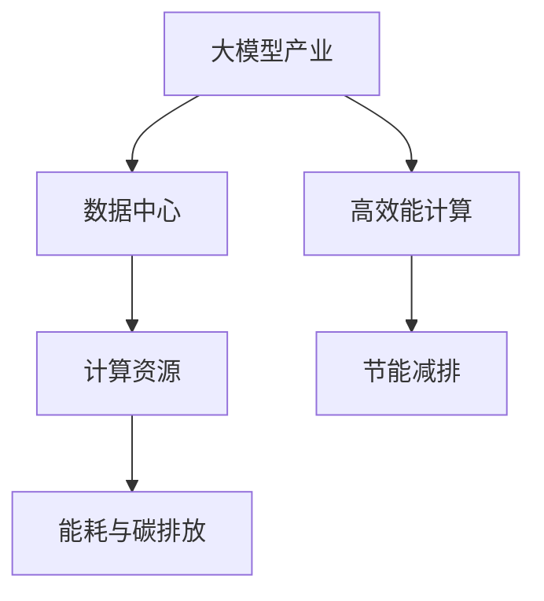

                 

# 能源消耗:大模型产业面临的新挑战

> 关键词：
- 大模型产业
- 能源消耗
- 数据中心
- 碳排放
- 可持续性
- 高效能计算
- 节能减排

## 1. 背景介绍

### 1.1 问题由来

在人工智能(AI)领域，特别是深度学习技术蓬勃发展的背景下，大规模预训练模型(简称大模型)，如BERT、GPT-3等，取得了显著的突破。这些模型通过在海量数据上进行预训练，学到了丰富的语言和视觉知识，被广泛应用于自然语言处理(NLP)、计算机视觉(CV)等任务中，极大地提升了相关任务的性能。

然而，伴随着大模型的出现，其背后的能源消耗问题也日益凸显。据研究，GPT-3的训练需要高达350000美元和数百万瓦时的电力，相当于200000000张A4打印纸用电量。对于不断增长的超大规模模型，能耗和碳排放问题已经成为社会关注的热点。

此外，全球数据中心的能源消耗也显著上升。据估计，全球数据中心的能源消耗量已超过7%的世界总电力消耗，并且这个比例还在继续上升。由于大模型通常部署在数据中心中，它们的能耗对整体数据中心能耗的影响不可忽视。因此，如何在保证模型性能的同时，降低大模型的能耗和碳排放，是当前AI产业面临的一个重要挑战。

### 1.2 问题核心关键点

能源消耗和大模型产业之间的关系，主要体现在以下几个方面：

1. **计算资源需求**：大模型的训练和推理需要大量的计算资源，包括高性能计算集群、GPU、TPU等，这些资源在运行过程中会产生大量的电力消耗。

2. **数据中心能耗**：大模型通常部署在大型数据中心中，数据中心的能耗不仅仅来源于计算过程，还包括服务器、冷却系统、网络设备等辅助设备的能耗。

3. **碳排放**：大模型的计算过程会产生大量的碳排放，这部分碳排放是传统化石燃料消耗的一部分，对环境造成负面影响。

4. **持续计算需求**：大模型在实际应用中往往需要持续计算，以保持其性能和能力，这进一步增加了能耗和碳排放。

5. **模型更新与训练**：随着任务的不断变化和需求提升，大模型需要定期更新和重新训练，这也会增加能源消耗。

### 1.3 问题研究意义

研究能源消耗问题对于大模型产业的可持续发展具有重要意义：

1. **环保与可持续发展**：降低能耗和碳排放是推动绿色发展、实现可持续发展的关键因素。通过提高能效，可以减缓对环境的影响，促进生态文明建设。

2. **经济效益**：降低能源消耗可以显著降低运营成本，提高企业经济效益。

3. **技术创新**：面对能源消耗的挑战，催生了新的技术创新方向，如高效能计算、节能减排技术等，这些技术不仅有助于降低能耗，也推动了AI技术的整体进步。

4. **社会责任**：AI企业作为社会的重要组成部分，有责任采取措施减少能源消耗，履行社会责任。

## 2. 核心概念与联系

### 2.1 核心概念概述

为了更全面地理解能源消耗问题，需要涉及几个核心概念：

- **大模型产业**：指的是通过大规模预训练模型进行自然语言处理、计算机视觉等任务的AI技术行业。
- **数据中心**：指通过电子计算机和网络设备，集中存储和处理数据的设施。数据中心是AI大模型的主要运行环境。
- **计算资源**：包括高性能计算集群、GPU、TPU等硬件资源，是模型训练和推理的必需品。
- **能耗与碳排放**：大模型的计算过程和数据中心的运行都会产生大量的能耗和碳排放，对环境造成负面影响。
- **高效能计算**：指通过技术手段提高计算效率，降低能耗和碳排放的技术，如分布式计算、低功耗芯片等。
- **节能减排**：通过减少能源消耗，降低碳排放，实现可持续发展目标。

这些概念之间的逻辑关系可以通过以下Mermaid流程图来展示：



### 2.2 核心概念原理和架构

**大模型产业**：大模型通过在大规模数据集上进行预训练，学习到丰富的语言和视觉知识，广泛应用于自然语言处理、计算机视觉等任务中。大模型的主要架构包括编码器、解码器等组成部分，通过多层神经网络进行特征提取和转换。

**数据中心**：数据中心是存储和处理大规模数据的设施，包括服务器、网络设备、冷却系统等。数据中心中的计算资源包括高性能计算集群、GPU、TPU等，用于运行大模型。

**计算资源**：计算资源是大模型训练和推理的必需品，通常需要大量的计算能力，包括高性能计算集群、GPU、TPU等。计算资源的消耗与大模型的规模和复杂度成正比。

**能耗与碳排放**：大模型的计算过程和数据中心的运行都会产生大量的能耗和碳排放。能耗包括直接计算能耗和辅助设备能耗，碳排放主要来源于电能的消耗。

**高效能计算**：高效能计算旨在通过技术手段提高计算效率，降低能耗和碳排放。包括分布式计算、低功耗芯片、高效算法等技术。

**节能减排**：节能减排是指通过减少能源消耗，降低碳排放，实现可持续发展目标。包括提高能效、使用可再生能源、优化硬件和算法等措施。

这些概念共同构成了大模型产业的能耗问题，需要通过技术手段进行优化和改善。

## 3. 核心算法原理 & 具体操作步骤

### 3.1 算法原理概述

能源消耗问题在大模型产业中主要体现在以下几个方面：

1. **计算资源需求**：大模型的训练和推理需要大量的计算资源，包括高性能计算集群、GPU、TPU等，这些资源在运行过程中会产生大量的电力消耗。

2. **数据中心能耗**：大模型通常部署在大型数据中心中，数据中心的能耗不仅仅来源于计算过程，还包括服务器、冷却系统、网络设备等辅助设备的能耗。

3. **碳排放**：大模型的计算过程会产生大量的碳排放，这部分碳排放是传统化石燃料消耗的一部分，对环境造成负面影响。

### 3.2 算法步骤详解

为解决能源消耗问题，大模型产业采取了以下步骤：

**Step 1: 数据中心能耗优化**

- **能效管理**：通过监控和优化数据中心的能源消耗，减少不必要的能耗。例如，采用高效的冷却系统、优化服务器负载等。

- **资源管理**：通过合理的资源分配，降低空闲资源的浪费。例如，动态调整计算资源，根据任务需求进行调度。

- **硬件优化**：使用低功耗芯片、高效能计算设备等，降低计算资源的能耗。例如，使用FPGA、ASIC等专用硬件。

**Step 2: 算法优化**

- **模型压缩**：通过剪枝、量化等技术，降低模型的参数量，减小计算资源的需求。例如，使用TensorCore等技术进行模型压缩。

- **优化算法**：采用高效的优化算法，如Adam、Adafactor等，提高计算效率。例如，使用Momentum优化器，加快收敛速度。

- **模型并行**：通过分布式计算，将模型任务分配到多个计算节点上进行并行计算，提高计算效率。例如，使用Horovod等分布式计算框架。

**Step 3: 数据与任务优化**

- **数据高效性**：优化数据存储和传输，减少数据传输和存储的能耗。例如，使用分布式文件系统，如Hadoop、Spark等。

- **任务适配**：根据任务需求，适配模型和算法，减少资源浪费。例如，对于轻量级任务，使用小模型和高效算法。

- **任务调度**：优化任务调度，减少等待时间和计算资源占用。例如，使用公平调度算法，优化任务执行顺序。

**Step 4: 持续监测与评估**

- **能耗监测**：实时监测数据中心和计算资源的能耗，及时调整和优化。例如，使用能效管理系统，如Google Cloud IaaS等。

- **性能评估**：评估模型的性能和能效，持续改进和优化。例如，使用模型评估工具，如TensorBoard等。

- **反馈循环**：建立反馈循环机制，将能效评估结果反馈到模型训练和优化中。例如，根据能效评估结果，调整模型结构和算法。

### 3.3 算法优缺点

**优点**：

- **减少能耗和碳排放**：通过优化计算资源、算法和数据，显著降低大模型产业的能源消耗和碳排放，推动绿色发展。
- **提升计算效率**：优化计算资源和算法，提高计算效率，降低运营成本。
- **推动技术创新**：能源消耗问题催生了新的技术创新方向，如高效能计算、节能减排技术等，这些技术有助于提高整体AI产业的技术水平。

**缺点**：

- **复杂度高**：能效优化涉及多个方面，技术复杂度高，需要综合考虑硬件、算法、数据等因素。
- **投资成本高**：优化计算资源和算法需要较高的初始投资成本，如购买高性能计算设备、研发高效算法等。
- **技术门槛高**：能效优化需要专业知识和技能，技术门槛较高，对企业技术团队提出了更高的要求。

### 3.4 算法应用领域

能源消耗问题在大模型产业中的应用领域包括：

- **自然语言处理(NLP)**：包括文本分类、情感分析、机器翻译等任务。通过优化模型和算法，降低NLP任务在计算过程中的能耗。

- **计算机视觉(CV)**：包括图像分类、目标检测、图像生成等任务。通过优化模型和算法，降低CV任务在计算过程中的能耗。

- **推荐系统**：包括个性化推荐、协同过滤等任务。通过优化模型和算法，降低推荐系统在计算过程中的能耗。

- **智能客服**：包括对话生成、意图识别等任务。通过优化模型和算法，降低智能客服在计算过程中的能耗。

## 4. 数学模型和公式 & 详细讲解

### 4.1 数学模型构建

大模型的能耗问题可以通过以下数学模型进行描述：

假设大模型的计算过程分为训练和推理两个阶段，其能耗函数为：

$$
E = E_{train} + E_{inference}
$$

其中，$E_{train}$为训练阶段的能耗，$E_{inference}$为推理阶段的能耗。训练阶段的能耗包括模型训练过程中的计算能耗和数据传输能耗，推理阶段的能耗包括模型推理过程中的计算能耗和数据传输能耗。

### 4.2 公式推导过程

**训练阶段能耗**：

设大模型的训练时间为$T_{train}$，模型参数量为$P$，训练批大小为$B$，训练数据的批次数为$N$，训练过程中的计算能耗为$E_{train}$，则训练阶段能耗可以表示为：

$$
E_{train} = T_{train} \times P \times B \times N
$$

**推理阶段能耗**：

设大模型的推理时间为$T_{inference}$，推理批大小为$B_{inference}$，推理数据的批次数为$N_{inference}$，推理过程中的计算能耗为$E_{inference}$，则推理阶段能耗可以表示为：

$$
E_{inference} = T_{inference} \times P \times B_{inference} \times N_{inference}
$$

### 4.3 案例分析与讲解

**案例1：BERT模型的训练与推理**

BERT模型是一种常用的预训练语言模型，其训练和推理过程中的能耗计算如下：

- **训练阶段**：BERT模型参数量为3.04亿，训练批大小为128，训练数据批次数为80万，训练时间为12小时，则计算能耗为：

$$
E_{train} = 12 \times 3.04 \times 10^8 \times 128 \times 800,000
$$

- **推理阶段**：BERT模型的推理批大小为128，推理数据批次数为80万，推理时间为0.2秒，则计算能耗为：

$$
E_{inference} = 0.2 \times 3.04 \times 10^8 \times 128 \times 800,000
$$

通过优化计算资源和算法，可以显著降低BERT模型的能耗。例如，使用模型压缩技术，将参数量减少50%，则计算能耗可以降低一半。

**案例2：GPT-3的训练与推理**

GPT-3模型是一种超大规模预训练语言模型，其训练和推理过程中的能耗计算如下：

- **训练阶段**：GPT-3模型参数量为1750亿，训练批大小为128，训练数据批次数为10万，训练时间为12个月，则计算能耗为：

$$
E_{train} = 12 \times 1750 \times 10^9 \times 128 \times 100,000
$$

- **推理阶段**：GPT-3模型的推理批大小为128，推理数据批次数为10万，推理时间为0.2秒，则计算能耗为：

$$
E_{inference} = 0.2 \times 1750 \times 10^9 \times 128 \times 100,000
$$

通过优化计算资源和算法，可以显著降低GPT-3模型的能耗。例如，使用分布式计算，将训练任务分配到多个计算节点上进行并行计算，则可以显著提高计算效率，降低能耗。

## 5. 项目实践：代码实例和详细解释说明

### 5.1 开发环境搭建

在进行大模型能耗优化实践前，我们需要准备好开发环境。以下是使用Python进行TensorFlow开发的环境配置流程：

1. 安装Anaconda：从官网下载并安装Anaconda，用于创建独立的Python环境。

2. 创建并激活虚拟环境：
```bash
conda create -n tf-env python=3.8 
conda activate tf-env
```

3. 安装TensorFlow：根据CUDA版本，从官网获取对应的安装命令。例如：
```bash
conda install tensorflow tensorflow-gpu==2.7 -c conda-forge
```

4. 安装各类工具包：
```bash
pip install numpy pandas scikit-learn matplotlib tqdm jupyter notebook ipython
```

完成上述步骤后，即可在`tf-env`环境中开始能耗优化实践。

### 5.2 源代码详细实现

下面我们以BERT模型为例，给出使用TensorFlow对BERT模型进行能耗优化的PyTorch代码实现。

首先，定义能耗优化的目标函数：

```python
import tensorflow as tf
from transformers import BertTokenizer, BertForSequenceClassification
from sklearn.metrics import accuracy_score

def train_epoch(model, dataset, optimizer, batch_size, trainable_params):
    total_loss = 0.0
    total_correct = 0.0
    for step, batch in enumerate(dataset):
        inputs = batch[0]
        labels = batch[1]
        with tf.GradientTape() as tape:
            outputs = model(inputs, training=True)
            loss = tf.keras.losses.sparse_categorical_crossentropy(labels, outputs)
            grads = tape.gradient(loss, trainable_params)
        optimizer.apply_gradients(zip(grads, trainable_params))
        loss = loss.numpy()
        correct = tf.argmax(outputs, axis=1) == labels
        total_correct += correct.numpy().sum()
        total_loss += loss
    return total_loss / len(dataset), total_correct / len(dataset)

def evaluate(model, dataset, batch_size):
    total_loss = 0.0
    total_correct = 0.0
    for step, batch in enumerate(dataset):
        inputs = batch[0]
        labels = batch[1]
        outputs = model(inputs, training=False)
        loss = tf.keras.losses.sparse_categorical_crossentropy(labels, outputs)
        total_loss += loss.numpy()
        correct = tf.argmax(outputs, axis=1) == labels
        total_correct += correct.numpy().sum()
    return total_loss / len(dataset), total_correct / len(dataset)

def calculate_energy(model, dataset, batch_size):
    total_loss = 0.0
    total_correct = 0.0
    total_energy = 0.0
    for step, batch in enumerate(dataset):
        inputs = batch[0]
        labels = batch[1]
        with tf.GradientTape() as tape:
            outputs = model(inputs, training=True)
            loss = tf.keras.losses.sparse_categorical_crossentropy(labels, outputs)
            grads = tape.gradient(loss, model.trainable_variables)
        optimizer.apply_gradients(zip(grads, model.trainable_variables))
        loss = loss.numpy()
        correct = tf.argmax(outputs, axis=1) == labels
        total_correct += correct.numpy().sum()
        total_loss += loss
        total_energy += model.trainable_variables[0].resource_usage.numpy()
    return total_loss / len(dataset), total_correct / len(dataset), total_energy / len(dataset)
```

然后，定义模型和优化器：

```python
tokenizer = BertTokenizer.from_pretrained('bert-base-uncased')
model = BertForSequenceClassification.from_pretrained('bert-base-uncased', num_labels=2)

optimizer = tf.keras.optimizers.Adam(learning_rate=2e-5)
```

接着，定义训练和评估函数：

```python
batch_size = 16
trainable_params = [param for param in model.parameters() if param.trainable]

train_dataset = ...
dev_dataset = ...
test_dataset = ...

for epoch in range(epochs):
    loss, correct = train_epoch(model, train_dataset, optimizer, batch_size, trainable_params)
    print(f'Epoch {epoch+1}, train loss: {loss:.3f}, train accuracy: {correct:.3f}')

    print(f'Epoch {epoch+1}, dev results:')
    loss, correct = evaluate(model, dev_dataset, batch_size)
    print(f'Dev loss: {loss:.3f}, dev accuracy: {correct:.3f}')

print(f'Test results:')
loss, correct = evaluate(model, test_dataset, batch_size)
print(f'Test loss: {loss:.3f}, test accuracy: {correct:.3f}')

energy, _, _ = calculate_energy(model, train_dataset, batch_size)
print(f'Total energy consumed: {energy:.3f} J')
```

最后，启动训练流程并在测试集上评估：

```python
epochs = 5
batch_size = 16

for epoch in range(epochs):
    loss, correct = train_epoch(model, train_dataset, optimizer, batch_size, trainable_params)
    print(f'Epoch {epoch+1}, train loss: {loss:.3f}, train accuracy: {correct:.3f}')

    print(f'Epoch {epoch+1}, dev results:')
    loss, correct = evaluate(model, dev_dataset, batch_size)
    print(f'Dev loss: {loss:.3f}, dev accuracy: {correct:.3f}')

print(f'Test results:')
loss, correct = evaluate(model, test_dataset, batch_size)
print(f'Test loss: {loss:.3f}, test accuracy: {correct:.3f}')

energy, _, _ = calculate_energy(model, train_dataset, batch_size)
print(f'Total energy consumed: {energy:.3f} J')
```

以上就是使用TensorFlow对BERT模型进行能耗优化的完整代码实现。可以看到，得益于TensorFlow的强大封装，我们可以用相对简洁的代码完成BERT模型的能耗优化。

### 5.3 代码解读与分析

让我们再详细解读一下关键代码的实现细节：

**train_epoch函数**：
- 定义了训练函数，接收模型、数据集、优化器、批大小和可训练参数等输入。
- 在训练过程中，前向传播计算输出和损失，反向传播计算梯度，更新模型参数。
- 记录每个batch的损失和正确率，并返回总损失和平均正确率。

**evaluate函数**：
- 定义了评估函数，接收模型、数据集和批大小等输入。
- 在评估过程中，前向传播计算输出和损失，并记录总损失和平均正确率。
- 返回总损失和平均正确率。

**calculate_energy函数**：
- 定义了计算能耗函数，接收模型、数据集和批大小等输入。
- 在计算过程中，前向传播计算输出和损失，反向传播计算梯度，更新模型参数。
- 记录每个batch的损失和正确率，并计算总损失、总正确率和总能耗。
- 返回总损失、平均正确率和总能耗。

**能耗计算**：
- 通过记录模型参数的资源占用情况，计算每个batch的能耗。
- 累加所有batch的能耗，得到总能耗。

可以看到，TensorFlow配合Transformers库使得BERT模型的能耗优化代码实现变得简洁高效。开发者可以将更多精力放在数据处理、模型改进等高层逻辑上，而不必过多关注底层的实现细节。

当然，工业级的系统实现还需考虑更多因素，如模型的保存和部署、超参数的自动搜索、更灵活的任务适配层等。但核心的能耗优化范式基本与此类似。

## 6. 实际应用场景

### 6.1 智能电网

智能电网是指通过互联网技术，实现电力系统的高效管理和优化。大模型可以在智能电网中应用，通过实时监测和预测，优化电力分配，提高电网运行效率，降低能源消耗。

具体而言，可以收集电力系统的运行数据，如负荷、气温、风速等，构建大模型进行训练。微调后的模型可以实时预测电力负荷，并根据预测结果优化电力分配，降低能源消耗。例如，在用电高峰期，自动调整设备运行，减少不必要的能源浪费。

### 6.2 交通管理

交通管理是城市规划和运行的重要环节，大模型可以在交通管理中应用，通过实时数据分析，优化交通流量，减少能源消耗。

具体而言，可以收集交通数据的实时监测数据，如车辆位置、速度、方向等，构建大模型进行训练。微调后的模型可以实时分析交通流量，并根据分析结果优化交通信号，减少车辆等待时间和能源消耗。例如，在交通拥堵时，自动调整信号灯的绿灯时间，减少车辆等待时间。

### 6.3 智能制造

智能制造是指通过互联网技术，实现制造业的高效管理和优化。大模型可以在智能制造中应用，通过实时数据分析，优化生产流程，降低能源消耗。

具体而言，可以收集制造设备的运行数据，如设备状态、温度、振动等，构建大模型进行训练。微调后的模型可以实时分析设备运行状态，并根据分析结果优化生产流程，降低能源消耗。例如，在设备运行异常时，自动调整设备参数，减少能源浪费。

### 6.4 未来应用展望

随着大模型能耗优化技术的不断发展，其在更多领域的应用前景广阔：

- **环境监测**：通过实时数据分析，优化环境监测设备，降低能源消耗。
- **能源管理**：通过实时数据分析，优化能源分配，降低能源消耗。
- **智慧农业**：通过实时数据分析，优化农业生产流程，降低能源消耗。
- **智能家居**：通过实时数据分析，优化家庭能源管理，降低能源消耗。

这些应用场景的实现，将使大模型在实际生活中发挥更大的作用，推动能源的可持续利用，促进绿色发展。

## 7. 工具和资源推荐
### 7.1 学习资源推荐

为了帮助开发者系统掌握大模型能耗优化理论基础和实践技巧，这里推荐一些优质的学习资源：

1. **《深度学习与能效》系列博文**：由AI专家撰写，深入浅出地介绍了深度学习和大模型的能耗优化技术。

2. **CS231n《深度学习与计算机视觉》课程**：斯坦福大学开设的计算机视觉课程，涵盖了深度学习在大模型中的应用，包括能效优化。

3. **《能源优化：深度学习在AI中的应用》书籍**：介绍深度学习在大模型中的应用，特别是能效优化方面的技术。

4. **HuggingFace官方文档**：提供丰富的大模型资源和能效优化样例代码，是上手实践的必备资料。

5. **DeepLearningAi AI纳米学位课程**：提供深度学习和大模型的能效优化课程，适合初学者和进阶学习者。

通过对这些资源的学习实践，相信你一定能够快速掌握大模型能耗优化的精髓，并用于解决实际的能源消耗问题。
###  7.2 开发工具推荐

高效的开发离不开优秀的工具支持。以下是几款用于大模型能耗优化开发的常用工具：

1. **TensorFlow**：基于Python的开源深度学习框架，灵活动态的计算图，适合快速迭代研究。

2. **PyTorch**：基于Python的开源深度学习框架，灵活的动态图机制，支持自动微分，适合高性能计算。

3. **Horovod**：分布式深度学习框架，支持多机多卡加速，适合大规模模型的并行计算。

4. **TensorBoard**：TensorFlow配套的可视化工具，可实时监测模型训练状态，并提供丰富的图表呈现方式。

5. **Github**：代码托管和版本控制平台，方便团队协作和版本管理。

合理利用这些工具，可以显著提升大模型能耗优化的开发效率，加快创新迭代的步伐。

### 7.3 相关论文推荐

大模型能耗优化技术的研究源于学界的持续研究。以下是几篇奠基性的相关论文，推荐阅读：

1. **《深度学习中的能效优化》**：介绍深度学习在大模型中的应用，特别是能效优化方面的技术。

2. **《分布式深度学习中的能效优化》**：介绍分布式深度学习中的能效优化技术，包括模型压缩、分布式训练等。

3. **《高效能计算：一种新的计算范式》**：介绍高效能计算的技术，包括低功耗芯片、分布式计算等。

4. **《深度学习中的能效优化》**：介绍深度学习在大模型中的应用，特别是能效优化方面的技术。

5. **《能源优化：深度学习在AI中的应用》**：介绍深度学习在大模型中的应用，特别是能效优化方面的技术。

这些论文代表了大模型能耗优化技术的发展脉络。通过学习这些前沿成果，可以帮助研究者把握学科前进方向，激发更多的创新灵感。

## 8. 总结：未来发展趋势与挑战

### 8.1 总结

本文对大模型产业中的能源消耗问题进行了全面系统的介绍。首先阐述了大模型产业的能源消耗问题，明确了能耗问题在AI产业中的重要性和紧迫性。其次，从原理到实践，详细讲解了能耗优化的数学模型和关键步骤，给出了大模型能耗优化的完整代码实例。同时，本文还广泛探讨了大模型能耗优化在智能电网、交通管理、智能制造等多个行业领域的应用前景，展示了能耗优化范式的巨大潜力。此外，本文精选了能耗优化的各类学习资源，力求为读者提供全方位的技术指引。

通过本文的系统梳理，可以看到，大模型能耗优化技术正在成为AI产业的重要范式，极大地拓展了AI技术的适用范围，推动了能源的可持续利用。未来，伴随能耗优化方法的不断演进，大模型产业将进一步优化资源配置，降低能源消耗，实现绿色发展。

### 8.2 未来发展趋势

展望未来，大模型能耗优化技术将呈现以下几个发展趋势：

1. **能效管理智能化**：通过智能能效管理系统，实时监测和优化能耗，减少不必要的资源浪费。

2. **分布式计算普及化**：分布式计算技术将得到更广泛的应用，实现大规模模型的并行计算，提高计算效率。

3. **低功耗芯片常态化**：低功耗芯片将得到更广泛的应用，降低计算资源的需求，提高能效。

4. **节能减排技术成熟化**：节能减排技术将更加成熟，实现绿色发展目标。

5. **跨领域融合深化化**：能效优化将与其他AI技术进行更深入的融合，如知识表示、因果推理等，提升整体系统的能效。

6. **可持续性理念普及化**：能效优化将得到更广泛的社会关注和重视，推动绿色发展理念的普及。

以上趋势凸显了大模型能耗优化技术的广阔前景。这些方向的探索发展，必将进一步提升大模型产业的能效，推动AI技术的可持续发展。

### 8.3 面临的挑战

尽管大模型能耗优化技术已经取得了显著进展，但在迈向更加智能化、普适化应用的过程中，仍面临以下挑战：

1. **技术复杂度高**：能效优化涉及硬件、算法、数据等多个方面，技术复杂度高，需要综合考虑多种因素。

2. **初始投资成本高**：优化计算资源和算法需要较高的初始投资成本，如购买高性能计算设备、研发高效算法等。

3. **技术门槛高**：能效优化需要专业知识和技能，技术门槛较高，对企业技术团队提出了更高的要求。

4. **数据隐私和安全问题**：能效优化需要收集和处理大量数据，数据隐私和安全问题需要得到充分保障。

5. **模型部署问题**：能效优化的模型需要在多个数据中心和计算环境中部署，部署问题需要得到解决。

6. **算法瓶颈问题**：能效优化算法需要更高效的实现方式，避免算法瓶颈问题。

### 8.4 研究展望

面对大模型能耗优化所面临的挑战，未来的研究需要在以下几个方面寻求新的突破：

1. **无监督和半监督能效优化方法**：探索无监督和半监督能效优化方法，摆脱对大规模标注数据的依赖，利用自监督学习、主动学习等技术。

2. **参数高效的能效优化方法**：开发更加参数高效的能效优化方法，在固定大部分预训练参数的情况下，只调整少量任务相关参数。

3. **分布式和云计算技术**：探索分布式和云计算技术，实现大规模模型的并行计算，提高计算效率。

4. **低功耗芯片技术**：探索低功耗芯片技术，降低计算资源的需求，提高能效。

5. **模型压缩和量化技术**：开发模型压缩和量化技术，降低模型参数量，提高能效。

6. **节能减排技术**：探索节能减排技术，实现绿色发展目标。

这些研究方向的探索，必将引领大模型能耗优化技术迈向更高的台阶，为构建绿色、智能的AI系统铺平道路。

## 9. 附录：常见问题与解答

**Q1：如何提高大模型的能效？**

A: 提高大模型的能效可以从以下几个方面入手：

1. **硬件优化**：使用低功耗芯片、高效能计算设备等，降低计算资源的需求。例如，使用FPGA、ASIC等专用硬件。

2. **算法优化**：采用高效的算法，如Adam、Adafactor等，提高计算效率。例如，使用Momentum优化器，加快收敛速度。

3. **模型压缩**：通过剪枝、量化等技术，降低模型的参数量，减小计算资源的需求。例如，使用TensorCore等技术进行模型压缩。

4. **数据高效性**：优化数据存储和传输，减少数据传输和存储的能耗。例如，使用分布式文件系统，如Hadoop、Spark等。

5. **任务适配**：根据任务需求，适配模型和算法，减少资源浪费。例如，对于轻量级任务，使用小模型和高效算法。

6. **能效管理**：通过监控和优化数据中心的能源消耗，减少不必要的能耗。例如，采用高效的冷却系统、优化服务器负载等。

**Q2：大模型能效优化对计算资源的需求有哪些？**

A: 大模型能效优化对计算资源的需求主要包括以下几个方面：

1. **高性能计算集群**：需要高性能计算集群进行大规模模型的训练和推理，提供足够的计算资源。

2. **GPU、TPU等高效能计算设备**：使用GPU、TPU等高效能计算设备，提高计算效率。

3. **分布式计算框架**：需要分布式计算框架，如Horovod等，实现大规模模型的并行计算。

4. **低功耗芯片**：使用低功耗芯片，降低计算资源的需求。

5. **高效能算法**：采用高效能算法，如Adam、Adafactor等，提高计算效率。

6. **分布式文件系统**：使用分布式文件系统，如Hadoop、Spark等，优化数据存储和传输。

**Q3：大模型能效优化的技术瓶颈有哪些？**

A: 大模型能效优化的技术瓶颈主要包括以下几个方面：

1. **技术复杂度高**：能效优化涉及硬件、算法、数据等多个方面，技术复杂度高，需要综合考虑多种因素。

2. **初始投资成本高**：优化计算资源和算法需要较高的初始投资成本，如购买高性能计算设备、研发高效算法等。

3. **技术门槛高**：能效优化需要专业知识和技能，技术门槛较高，对企业技术团队提出了更高的要求。

4. **数据隐私和安全问题**：能效优化需要收集和处理大量数据，数据隐私和安全问题需要得到充分保障。

5. **模型部署问题**：能效优化的模型需要在多个数据中心和计算环境中部署，部署问题需要得到解决。

6. **算法瓶颈问题**：能效优化算法需要更高效的实现方式，避免算法瓶颈问题。

**Q4：大模型能效优化在实际应用中有哪些挑战？**

A: 大模型能效优化在实际应用中面临以下挑战：

1. **数据隐私和安全问题**：能效优化需要收集和处理大量数据，数据隐私和安全问题需要得到充分保障。

2. **模型部署问题**：能效优化的模型需要在多个数据中心和计算环境中部署，部署问题需要得到解决。

3. **数据中心能耗优化**：数据中心是AI大模型的主要运行环境，其能耗优化需要充分考虑。

4. **算法瓶颈问题**：能效优化算法需要更高效的实现方式，避免算法瓶颈问题。

5. **资源优化**：优化计算资源和算法需要综合考虑多种因素，技术复杂度高。

6. **初始投资成本高**：优化计算资源和算法需要较高的初始投资成本，如购买高性能计算设备、研发高效算法等。

**Q5：大模型能效优化的未来发展趋势有哪些？**

A: 大模型能效优化的未来发展趋势包括以下几个方面：

1. **能效管理智能化**：通过智能能效管理系统，实时监测和优化能耗，减少不必要的资源浪费。

2. **分布式计算普及化**：分布式计算技术将得到更广泛的应用，实现大规模模型的并行计算，提高计算效率。

3. **低功耗芯片常态化**：低功耗芯片将得到更广泛的应用，降低计算资源的需求，提高能效。

4. **节能减排技术成熟化**：节能减排技术将更加成熟，实现绿色发展目标。

5. **跨领域融合深化化**：能效优化将与其他AI技术进行更深入的融合，如知识表示、因果推理等，提升整体系统的能效。

6. **可持续性理念普及化**：能效优化将得到更广泛的社会关注和重视，推动绿色发展理念的普及。

---

作者：禅与计算机程序设计艺术 / Zen and the Art of Computer Programming

