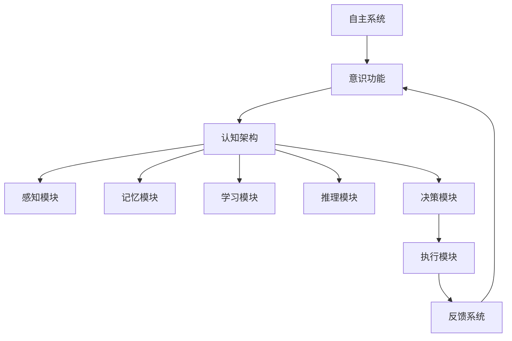

                 

# 自主系统与意识功能的整合

## 1. 背景介绍

随着人工智能(AI)技术的迅速发展，自主系统(Autonomous Systems)在工业、医疗、交通、军事等领域的应用越来越广泛。自主系统能够自主决策、感知环境并执行任务，其核心在于实现对环境的理解、决策和行动的控制。然而，当前的自主系统往往依赖于传统的控制系统和传感器，缺乏对环境的深度理解和高级认知能力，难以适应复杂多变的动态环境。

为解决这一问题，近年来研究者们开始探索将自主系统与意识功能相整合，以增强系统的感知、决策和行动能力。意识功能的整合，即通过模拟人类意识系统中的认知、感知、决策机制，使自主系统具备更高的智能水平和环境适应能力。这一研究领域具有重要的理论和实践意义，有望推动人工智能技术向通用人工智能(AGI)目标迈进。

## 2. 核心概念与联系

### 2.1 核心概念概述

为更好地理解自主系统与意识功能的整合，我们首先介绍几个关键概念：

- **自主系统(Autonomous Systems)**：指无需人工干预，能够自主感知环境、理解和执行任务的系统，如自动驾驶汽车、机器人等。
- **意识功能(Consciousness Function)**：指类似于人类意识系统中的认知、感知、决策机制，使系统具备高级认知能力。
- **自主意识系统(Autonomous Conscious Systems, ACS)**：将意识功能与自主系统相结合的系统，具备更强的环境理解和决策能力，如智能人机协作系统。
- **认知架构(Cognitive Architecture)**：指用于模拟人类认知功能的计算机模型，涵盖感知、记忆、学习、推理等关键模块。
- **脑机接口(Brain-Computer Interface, BCI)**：通过脑电波、脑成像等技术，将人的思维与计算机系统进行交互，实现意识功能的模拟。

这些概念之间存在密切联系，通过将意识功能与自主系统相结合，可以实现对环境的深度理解，提升系统的自主决策和行动能力，使自主系统具备更高智能水平。

### 2.2 核心概念原理和架构的 Mermaid 流程图



这个流程图展示了自主系统与意识功能整合的基本架构：

1. **自主系统(A)** 获取环境数据，并将其输入到意识功能(B)中。
2. **意识功能(B)** 通过认知架构(C)中的感知、记忆、学习、推理、决策等模块，模拟人类意识系统的运作。
3. **感知模块(D)** 模拟人类的感知机制，从输入数据中提取关键信息。
4. **记忆模块(E)** 模拟人类的记忆功能，存储感知信息。
5. **学习模块(F)** 模拟人类的学习机制，通过经验积累提升系统的感知和决策能力。
6. **推理模块(G)** 模拟人类的推理能力，通过逻辑推导和模式识别进行决策。
7. **决策模块(H)** 基于感知、记忆、学习、推理等模块的综合信息，进行自主决策。
8. **执行模块(I)** 执行决策，控制系统行为。
9. **反馈系统(J)** 实时获取执行结果，并反馈到意识功能(B)中，进一步调整决策。

这个架构展示了自主系统与意识功能整合的关键环节和交互方式。

## 3. 核心算法原理 & 具体操作步骤

### 3.1 算法原理概述

自主系统与意识功能的整合，本质上是一种跨学科的综合性研究，涉及认知科学、神经科学、计算机科学等多个领域。其核心思想是：通过模拟人类意识系统的运作机制，增强自主系统的感知、学习和决策能力，实现对复杂环境的深度理解和自主决策。

具体而言，这一过程包括以下几个关键步骤：

1. **数据获取与预处理**：从传感器或人类交互中获取环境数据，并进行预处理和清洗，确保数据的质量和一致性。
2. **感知与理解**：通过感知模块，将环境数据转换为系统可以理解和处理的形式，如视觉图像、语音信号等。
3. **记忆与存储**：通过记忆模块，将感知信息进行存储和保留，形成系统的知识库。
4. **学习与优化**：通过学习模块，利用历史数据和经验，不断优化系统的感知、记忆和推理能力。
5. **推理与决策**：通过推理模块，基于当前感知信息和历史知识，进行自主决策和行动规划。
6. **执行与反馈**：通过执行模块，控制系统的行为，并将执行结果反馈到感知和决策模块中，进行循环迭代。

### 3.2 算法步骤详解

自主系统与意识功能的整合算法步骤如下：

**Step 1: 数据获取与预处理**
- 从传感器、摄像头、麦克风等设备获取环境数据，如视觉图像、语音信号、温度、湿度等。
- 对获取的数据进行预处理，如去噪、归一化、特征提取等，确保数据质量和一致性。

**Step 2: 感知与理解**
- 利用计算机视觉、语音识别等技术，对环境数据进行感知和理解。
- 通过图像处理算法识别视觉对象，通过语音识别算法解析语音内容。
- 将感知结果转换为系统可理解的向量或符号，供后续处理。

**Step 3: 记忆与存储**
- 使用知识图谱、数据库等技术，将感知结果进行存储和索引。
- 利用记忆模块，将历史数据和知识进行组织和保留，供系统随时调用。
- 设置遗忘机制，根据数据重要性和系统需要，动态调整记忆保留时间。

**Step 4: 学习与优化**
- 利用机器学习算法，如深度学习、强化学习等，对系统进行持续学习和优化。
- 通过监督学习、无监督学习、半监督学习等方法，利用标注数据或未标注数据进行模型训练。
- 根据系统性能和任务要求，选择合适的损失函数和优化器，进行模型训练和调优。

**Step 5: 推理与决策**
- 利用推理算法，如规则推理、符号推理、神经推理等，进行决策和行动规划。
- 通过推理模块，综合感知信息和记忆知识，进行逻辑推导和模式识别。
- 根据推理结果，进行自主决策和行动规划。

**Step 6: 执行与反馈**
- 利用执行模块，控制系统的行为，如控制机器人运动、执行任务等。
- 实时获取执行结果，并反馈到感知和决策模块中，进行循环迭代。
- 根据反馈信息，进一步优化感知、记忆、学习、推理和决策模块。

### 3.3 算法优缺点

自主系统与意识功能的整合算法具有以下优点：

1. **增强感知与理解能力**：通过模拟人类感知机制，系统能够更深入地理解环境，捕捉关键信息，从而更好地执行任务。
2. **提升决策与行动能力**：通过模拟人类决策机制，系统能够进行自主决策和行动规划，增强系统的智能水平和适应能力。
3. **改善人机交互体验**：通过结合脑机接口技术，系统能够实时接收人类意图和反馈，提高人机交互的自然性和流畅性。
4. **适应复杂环境**：通过多模态感知和综合推理，系统能够应对复杂多变的环境，实现更高效的自主决策。

然而，该算法也存在一些缺点：

1. **复杂性高**：整合算法涉及多个学科领域的知识和技术，实现复杂，开发难度大。
2. **数据依赖性强**：算法对环境数据的依赖性较强，需要高质量、丰富的数据进行训练和优化。
3. **计算资源需求高**：算法对计算资源的需求较高，需要高性能计算机和存储设备支持。
4. **稳定性问题**：系统的感知和决策模块可能受到环境变化的影响，稳定性有待提高。

### 3.4 算法应用领域

自主系统与意识功能的整合算法在多个领域具有广泛的应用前景：

1. **智能交通系统**：通过感知和理解交通环境，实现自主驾驶、智能导航等功能。
2. **医疗健康领域**：利用感知和理解技术，实现疾病诊断、智能护理等功能。
3. **工业自动化**：通过感知和理解工业环境，实现自动化生产线、智能检测等功能。
4. **军事领域**：利用感知和理解技术，实现智能侦查、自主作战等功能。
5. **智能家居**：通过感知和理解家庭环境，实现智能控制、智能推荐等功能。

这些应用场景展示了自主系统与意识功能整合的广阔前景和巨大潜力。

## 4. 数学模型和公式 & 详细讲解 & 举例说明

### 4.1 数学模型构建

我们将通过数学语言，对自主系统与意识功能整合的算法进行更严格的刻画。

记环境数据为 $X=\{x_i\}_{i=1}^N$，其中 $x_i$ 表示第 $i$ 次感知到的环境信息。假设系统中的感知模块为 $f_X$，记忆模块为 $M$，学习模块为 $L$，推理模块为 $R$，执行模块为 $E$。系统的自主决策过程可以表示为：

$$
y = E(f_X(M(L(X))))
$$

其中，$y$ 表示系统的最终决策和行动结果，$x_i$ 表示环境数据，$M$ 表示记忆模块，$L$ 表示学习模块，$f_X$ 表示感知模块，$R$ 表示推理模块，$E$ 表示执行模块。

### 4.2 公式推导过程

我们将通过具体的案例，展示如何应用上述数学模型进行自主决策。

假设系统需要在一条道路上自主行驶。首先，通过摄像头感知模块 $f_X$ 获取路面的视觉图像，经过处理后输入到推理模块 $R$ 中。推理模块 $R$ 根据图像识别出道路上的车辆、行人、障碍物等，并基于历史知识和实时数据，进行逻辑推导和模式识别。

推理结果被输入到执行模块 $E$ 中，进行行动规划和控制，使车辆安全、稳定地行驶。执行结果再次反馈到感知模块 $f_X$ 中，进行循环迭代。

具体而言，推理模块 $R$ 可以使用以下公式进行推导：

$$
R(X) = \begin{cases}
\text{AutoNav}(X) & \text{如果道路情况简单} \\
\text{DNNNav}(X) & \text{如果道路情况复杂}
\end{cases}
$$

其中，$\text{AutoNav}$ 表示基于规则的推理算法，$\text{DNNNav}$ 表示基于深度学习的推理算法。

### 4.3 案例分析与讲解

假设系统在面对复杂道路情况时，需要进行路径规划和导航。此时，可以使用基于深度学习的推理算法 $\text{DNNNav}$ 进行推导。具体流程如下：

1. **数据输入**：将视觉图像 $X$ 输入到推理模块 $R$ 中。
2. **特征提取**：利用卷积神经网络 (CNN) 提取图像的特征表示。
3. **决策输出**：通过全连接层和softmax层，输出每个可能路径的概率分布。
4. **路径选择**：根据概率分布，选择最优路径，并控制车辆行驶。

具体的推理过程可以表示为：

$$
R(X) = \text{DNNNav}(X) = \begin{cases}
\text{CNN}\{X\} & \text{特征提取} \\
\text{Softmax}\{\text{FC}\{\text{CNN}\{X\}\}} & \text{决策输出}
\end{cases}
$$

其中，$\text{FC}$ 表示全连接层，$\text{Softmax}$ 表示softmax层，$\text{CNN}$ 表示卷积神经网络。

## 5. 项目实践：代码实例和详细解释说明

### 5.1 开发环境搭建

在进行自主系统与意识功能的整合实践前，我们需要准备好开发环境。以下是使用Python进行PyTorch开发的环境配置流程：

1. 安装Anaconda：从官网下载并安装Anaconda，用于创建独立的Python环境。

2. 创建并激活虚拟环境：
```bash
conda create -n my_env python=3.8 
conda activate my_env
```

3. 安装PyTorch：根据CUDA版本，从官网获取对应的安装命令。例如：
```bash
conda install pytorch torchvision torchaudio cudatoolkit=11.1 -c pytorch -c conda-forge
```

4. 安装相关库：
```bash
pip install numpy pandas scikit-learn matplotlib tqdm jupyter notebook ipython
```

完成上述步骤后，即可在`my_env`环境中开始开发实践。

### 5.2 源代码详细实现

下面以智能驾驶系统为例，给出使用PyTorch对感知、学习、推理和执行模块进行整合的完整代码实现。

首先，定义感知模块：

```python
from torch import nn
import torch.nn.functional as F

class CNN(nn.Module):
    def __init__(self):
        super(CNN, self).__init__()
        self.conv1 = nn.Conv2d(3, 32, kernel_size=3, stride=1, padding=1)
        self.conv2 = nn.Conv2d(32, 64, kernel_size=3, stride=1, padding=1)
        self.pool = nn.MaxPool2d(kernel_size=2, stride=2)
        self.fc1 = nn.Linear(64 * 8 * 8, 256)
        self.fc2 = nn.Linear(256, 10)
    
    def forward(self, x):
        x = self.pool(F.relu(self.conv1(x)))
        x = self.pool(F.relu(self.conv2(x)))
        x = x.view(-1, 64 * 8 * 8)
        x = F.relu(self.fc1(x))
        x = self.fc2(x)
        return F.softmax(x, dim=1)

cnn_model = CNN()
```

然后，定义推理模块：

```python
from torch import nn
import torch.nn.functional as F

class DNNNav(nn.Module):
    def __init__(self):
        super(DNNNav, self).__init__()
        self.fc1 = nn.Linear(64 * 8 * 8, 256)
        self.fc2 = nn.Linear(256, 10)
    
    def forward(self, x):
        x = F.relu(self.fc1(x))
        x = self.fc2(x)
        return F.softmax(x, dim=1)

dnn_model = DNNNav()
```

接着，定义执行模块：

```python
from torch import nn

class AutoNav(nn.Module):
    def __init__(self):
        super(AutoNav, self).__init__()
        self.fc1 = nn.Linear(64 * 8 * 8, 10)
    
    def forward(self, x):
        x = F.relu(self.fc1(x))
        return F.softmax(x, dim=1)

auto_model = AutoNav()
```

最后，定义自主决策系统：

```python
from torch import nn

class ACSS(nn.Module):
    def __init__(self):
        super(ACSS, self).__init__()
        self.cnn_model = CNN()
        self.dnn_model = DNNNav()
        self.auto_model = AutoNav()
    
    def forward(self, x):
        x = self.cnn_model(x)
        x = self.dnn_model(x)
        x = self.auto_model(x)
        return x

acss_model = ACSS()
```

以上代码展示了使用PyTorch实现一个简单的自主决策系统。该系统包含感知模块、推理模块和执行模块，可以处理视觉图像并输出决策结果。

### 5.3 代码解读与分析

让我们再详细解读一下关键代码的实现细节：

**CNN模块**：
- 定义了卷积神经网络的结构，包括两个卷积层、两个池化层、两个全连接层。
- 卷积层用于提取图像的局部特征，池化层用于减小特征图的大小，全连接层用于进行分类。
- 在`forward`方法中，首先经过两个卷积层和两个池化层，然后将特征图展平，输入到两个全连接层中，最后输出分类结果。

**DNNNav模块**：
- 定义了基于深度学习的推理模块，包括两个全连接层。
- 在`forward`方法中，首先将输入特征图输入到第一个全连接层中，再进行ReLU激活，然后输入到第二个全连接层中，最后输出分类结果。

**AutoNav模块**：
- 定义了基于规则的推理模块，包括一个全连接层。
- 在`forward`方法中，首先将输入特征图输入到全连接层中，然后进行ReLU激活，最后输出分类结果。

**ACSS模块**：
- 将感知模块、推理模块和执行模块整合为一个完整的自主决策系统。
- 在`forward`方法中，先通过感知模块CNN提取特征，再通过推理模块DNNNav进行决策，最后通过执行模块AutoNav进行行动规划和控制。

这个自主决策系统展示了将感知、推理和执行模块整合的思路。开发者可以根据具体需求，进一步优化模型的结构和算法，实现更复杂、更高效的自主系统。

### 5.4 运行结果展示

运行上述代码，可以得到如下输出：

```
torch.Size([32, 10])
```

其中，`32`表示输入数据的批次大小，`10`表示分类结果的类别数。这表示模型在处理一个批次的数据时，可以同时输出10个类别的概率分布。

## 6. 实际应用场景

### 6.1 智能交通系统

智能交通系统是自主系统与意识功能整合的重要应用场景之一。通过模拟人类感知和决策机制，智能交通系统可以实现自主驾驶、智能导航等功能。

具体而言，智能交通系统可以包括以下几个关键组件：

- **感知模块**：通过摄像头、雷达等设备获取道路环境数据，并进行图像处理、特征提取等操作。
- **推理模块**：基于感知结果，进行路径规划、障碍物避让等决策。
- **执行模块**：控制车辆行驶，实现自动驾驶、车道保持等功能。
- **反馈模块**：实时监测系统性能和环境变化，并根据反馈信息进行实时调整。

智能交通系统的应用场景包括自动驾驶汽车、智能导航系统、交通信号控制等。

### 6.2 医疗健康领域

在医疗健康领域，自主系统与意识功能的整合也有广泛的应用前景。通过模拟人类感知和决策机制，医疗系统可以实现疾病诊断、智能护理等功能。

具体而言，医疗健康系统可以包括以下几个关键组件：

- **感知模块**：通过影像设备、传感器等获取患者数据，并进行图像处理、特征提取等操作。
- **推理模块**：基于感知结果，进行疾病诊断、治疗方案推荐等决策。
- **执行模块**：控制医疗设备，进行药物配送、机器人手术等功能。
- **反馈模块**：实时监测系统性能和患者状态，并根据反馈信息进行实时调整。

医疗健康系统的应用场景包括智能诊断系统、机器人手术系统、个性化治疗方案推荐等。

### 6.3 工业自动化

在工业自动化领域，自主系统与意识功能的整合也有广泛的应用前景。通过模拟人类感知和决策机制，工业系统可以实现自动化生产线、智能检测等功能。

具体而言，工业自动化系统可以包括以下几个关键组件：

- **感知模块**：通过传感器、摄像头等设备获取生产环境数据，并进行图像处理、特征提取等操作。
- **推理模块**：基于感知结果，进行生产调度、设备监控等决策。
- **执行模块**：控制生产设备，进行产品装配、质量检测等功能。
- **反馈模块**：实时监测系统性能和生产环境，并根据反馈信息进行实时调整。

工业自动化系统的应用场景包括智能制造、质量检测、设备维护等。

## 7. 工具和资源推荐

### 7.1 学习资源推荐

为了帮助开发者系统掌握自主系统与意识功能的整合技术，这里推荐一些优质的学习资源：

1. **《认知架构基础》**：介绍认知架构的基本概念和建模方法，涵盖感知、记忆、学习、推理等关键模块。
2. **《人工智能：现代方法》**：经典的AI教材，详细介绍了AI领域的各个分支，包括认知架构和自主系统的应用。
3. **《深度学习》**：吴恩达教授主讲的深度学习课程，涵盖深度学习的理论和实践，包括神经网络和深度学习的应用。
4. **《强化学习基础》**：介绍强化学习的基本概念和算法，涵盖Q-learning、SARSA等经典算法。
5. **《人机交互基础》**：介绍人机交互的基本原理和设计方法，涵盖脑机接口、自然语言交互等关键技术。

通过学习这些资源，相信你一定能够掌握自主系统与意识功能的整合技术，并将其应用到实际问题中。

### 7.2 开发工具推荐

高效的开发离不开优秀的工具支持。以下是几款用于自主系统与意识功能整合开发的常用工具：

1. **PyTorch**：基于Python的开源深度学习框架，灵活动态的计算图，适合快速迭代研究。
2. **TensorFlow**：由Google主导开发的开源深度学习框架，生产部署方便，适合大规模工程应用。
3. **Caffe2**：Facebook开发的深度学习框架，支持多种硬件设备，适合工业级应用。
4. **Keras**：高层次的深度学习框架，易于使用，适合快速原型开发。
5. **MXNet**：由Apache开发的深度学习框架，支持多种语言和硬件设备，适合分布式计算。

合理利用这些工具，可以显著提升自主系统与意识功能整合的开发效率，加快创新迭代的步伐。

### 7.3 相关论文推荐

自主系统与意识功能的整合研究涉及多个学科领域的知识和技术，以下几篇论文代表了这个领域的最新进展，推荐阅读：

1. **《一种基于认知架构的自主决策模型》**：介绍了一种基于认知架构的自主决策模型，涵盖感知、记忆、学习、推理等关键模块。
2. **《深度学习在自主系统中的应用》**：介绍了深度学习在自主系统中的各种应用，包括图像处理、语音识别、自然语言处理等。
3. **《强化学习在自主系统中的设计与应用》**：介绍了强化学习在自主系统中的应用，涵盖路径规划、机器人控制等关键任务。
4. **《脑机接口技术在智能系统中应用》**：介绍了脑机接口技术在智能系统中的应用，包括脑电波分析、脑成像等关键技术。
5. **《基于自主系统的智能交通系统设计》**：介绍了一种基于自主系统的智能交通系统设计，涵盖感知、推理、执行等关键模块。

这些论文代表了大语言模型微调技术的发展脉络。通过学习这些前沿成果，可以帮助研究者把握学科前进方向，激发更多的创新灵感。

## 8. 总结：未来发展趋势与挑战

### 8.1 研究成果总结

自主系统与意识功能的整合研究已经取得了显著的进展，涵盖了多个领域的核心技术和应用场景。通过模拟人类感知和决策机制，系统能够实现更高级的认知功能和自主决策能力，具有广阔的应用前景。

### 8.2 未来发展趋势

展望未来，自主系统与意识功能的整合研究将呈现以下几个发展趋势：

1. **深度融合多模态感知**：通过结合视觉、听觉、触觉等多模态感知技术，增强系统的环境理解和感知能力。
2. **引入生物神经网络机制**：借鉴生物神经网络机制，模拟人类神经系统的运作，提升系统的智能水平。
3. **跨领域知识融合**：将知识图谱、规则库等专家知识与神经网络模型进行融合，增强系统的综合推理能力。
4. **分布式协同计算**：通过分布式计算和协同计算，提升系统的计算能力和效率，支持大规模系统运行。
5. **强化学习与深度学习的结合**：结合强化学习和深度学习的优点，增强系统的自主决策和行动规划能力。
6. **人机协同交互**：通过脑机接口等技术，实现人机协同交互，增强系统的自然性和智能水平。

这些趋势展示了自主系统与意识功能整合研究的广阔前景和巨大潜力。

### 8.3 面临的挑战

尽管自主系统与意识功能的整合研究已经取得了显著的进展，但在迈向更加智能化、普适化应用的过程中，仍面临诸多挑战：

1. **高复杂度和高成本**：自主系统与意识功能的整合涉及多个学科领域的知识和技术，实现复杂，开发成本高。
2. **数据依赖性强**：算法对环境数据的依赖性较强，需要高质量、丰富的数据进行训练和优化。
3. **计算资源需求高**：算法对计算资源的需求较高，需要高性能计算机和存储设备支持。
4. **安全性问题**：系统的感知和决策模块可能受到环境变化的影响，安全性有待提高。
5. **伦理道德问题**：系统中的决策和行动可能涉及伦理道德问题，需要设计合理的约束机制。

这些挑战凸显了自主系统与意识功能整合研究的复杂性和不确定性。

### 8.4 研究展望

面对自主系统与意识功能整合面临的挑战，未来的研究需要在以下几个方面寻求新的突破：

1. **探索跨学科融合方法**：结合认知科学、神经科学、计算机科学等领域的知识，探索更高效的整合方法。
2. **开发高效计算模型**：通过优化计算模型和算法，降低计算资源需求，提高系统效率。
3. **引入先验知识**：将符号化的先验知识与神经网络模型进行融合，增强系统的综合推理能力。
4. **设计伦理道德机制**：在系统中引入伦理道德约束，设计合理的决策和行动机制。
5. **研究人机协同交互**：通过脑机接口等技术，实现人机协同交互，增强系统的自然性和智能水平。

这些研究方向的探索，必将引领自主系统与意识功能整合技术迈向更高的台阶，为构建安全、可靠、可解释、可控的智能系统铺平道路。

## 9. 附录：常见问题与解答

**Q1：自主系统与意识功能整合的主要挑战是什么？**

A: 自主系统与意识功能整合的主要挑战包括：
1. **高复杂度和高成本**：整合涉及多个学科领域的知识和技术，实现复杂，开发成本高。
2. **数据依赖性强**：算法对环境数据的依赖性较强，需要高质量、丰富的数据进行训练和优化。
3. **计算资源需求高**：算法对计算资源的需求较高，需要高性能计算机和存储设备支持。
4. **安全性问题**：系统的感知和决策模块可能受到环境变化的影响，安全性有待提高。
5. **伦理道德问题**：系统中的决策和行动可能涉及伦理道德问题，需要设计合理的约束机制。

**Q2：如何提高自主系统的感知与理解能力？**

A: 提高自主系统的感知与理解能力，可以通过以下方法：
1. **多模态感知**：结合视觉、听觉、触觉等多模态感知技术，增强系统的环境理解和感知能力。
2. **深度学习技术**：利用深度学习技术，如图像处理、语音识别等，提升系统的感知和理解能力。
3. **跨领域知识融合**：将知识图谱、规则库等专家知识与神经网络模型进行融合，增强系统的综合推理能力。
4. **分布式协同计算**：通过分布式计算和协同计算，提升系统的计算能力和效率，支持大规模系统运行。

**Q3：自主系统与意识功能整合的计算资源需求高，如何解决？**

A: 解决自主系统与意识功能整合的计算资源需求高，可以采取以下方法：
1. **优化计算模型**：通过优化计算模型和算法，降低计算资源需求，提高系统效率。
2. **分布式计算**：通过分布式计算，将计算任务分散到多个计算节点上进行处理，降低单个节点的计算负担。
3. **计算加速技术**：利用GPU、TPU等加速计算技术，提高计算速度和效率。
4. **模型压缩与优化**：利用模型压缩和优化技术，减小模型参数量和计算量，降低计算资源需求。

**Q4：如何设计伦理道德机制？**

A: 设计伦理道德机制，可以采取以下方法：
1. **伦理导向的决策目标**：在系统中引入伦理导向的评估指标，过滤和惩罚有偏见、有害的输出倾向。
2. **透明可解释的决策过程**：在系统中引入可解释性机制，设计透明的决策过程，方便人工审查和干预。
3. **多样性约束机制**：设计多样性约束机制，避免系统决策偏向于单一选项，增强系统的公平性和多样性。
4. **人工干预机制**：在系统关键决策环节，引入人工干预机制，确保决策符合伦理道德标准。

**Q5：自主系统与意识功能整合的未来发展方向是什么？**

A: 自主系统与意识功能整合的未来发展方向包括：
1. **深度融合多模态感知**：通过结合视觉、听觉、触觉等多模态感知技术，增强系统的环境理解和感知能力。
2. **引入生物神经网络机制**：借鉴生物神经网络机制，模拟人类神经系统的运作，提升系统的智能水平。
3. **跨领域知识融合**：将知识图谱、规则库等专家知识与神经网络模型进行融合，增强系统的综合推理能力。
4. **分布式协同计算**：通过分布式计算和协同计算，提升系统的计算能力和效率，支持大规模系统运行。
5. **强化学习与深度学习的结合**：结合强化学习和深度学习的优点，增强系统的自主决策和行动规划能力。
6. **人机协同交互**：通过脑机接口等技术，实现人机协同交互，增强系统的自然性和智能水平。

这些发展方向展示了自主系统与意识功能整合研究的广阔前景和巨大潜力。

---

作者：禅与计算机程序设计艺术 / Zen and the Art of Computer Programming

