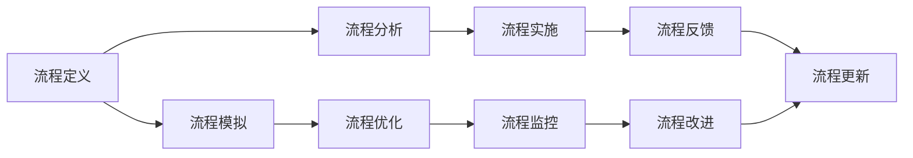

                 

## 1. 背景介绍

随着科技的飞速发展，自动化技术在各行各业的应用越来越广泛。自动化创业，即利用自动化技术开展创业活动，已成为当前市场的新趋势。然而，自动化创业中的流程复杂，涉及多个环节和模块，如何通过有效的流程再造和优化，提升效率和降低成本，成为创业者面临的挑战。本文将从背景介绍入手，深入探讨自动化创业流程再造与优化的核心概念、原理与操作方法，为创业者提供指导。

## 2. 核心概念与联系

### 2.1 核心概念概述

在自动化创业中，流程再造与优化涉及的核心概念包括：

- **流程再造（BPR，Business Process Reengineering）**：重新设计企业的业务流程，以提高效率和降低成本。
- **业务流程建模（BPM，Business Process Modeling）**：使用标准化的模型和工具，描述和分析业务流程。
- **自动化技术**：如RPA（机器人流程自动化）、AI（人工智能）、ML（机器学习）等技术，用于提升流程效率和精确度。
- **数据驱动决策**：通过数据分析和优化模型，指导流程再造与优化。

这些概念之间具有紧密的联系。流程再造是目标，业务流程建模是方法，自动化技术是手段，数据驱动决策是依据。以下是一个Mermaid流程图，展示了这些概念之间的联系：

```mermaid
graph LR
    A[流程再造 (BPR)] --> B[业务流程建模 (BPM)]
    A --> C[自动化技术]
    B --> D[数据驱动决策]
    C --> E[流程执行与监控]
    D --> F[优化模型]
    F --> G[流程再造与优化]
```

### 2.2 核心概念原理和架构

流程再造和优化的原理基于以下三点：

1. **流程重新设计**：重新审视现有流程，识别出不必要的环节和冗余步骤，优化或删除这些步骤，简化流程。
2. **自动化技术应用**：引入自动化技术，减少人工干预，提高效率和准确性。
3. **持续改进**：通过持续监控和优化，不断调整流程，实现长期的效率提升。

在流程再造和优化的架构方面，可以采用基于BPMN（Business Process Model and Notation）的模型进行流程建模，使用RPA和AI技术进行流程自动化，并通过持续改进和优化，提升流程的稳定性和可维护性。以下是一个基于BPMN的流程建模架构图：



## 3. 核心算法原理 & 具体操作步骤

### 3.1 算法原理概述

流程再造与优化的算法原理主要包括以下几个方面：

- **流程分析算法**：通过分析现有流程，识别出低效和冗余步骤。
- **流程优化算法**：基于流程分析结果，设计新的流程，提升效率和精确度。
- **自动化技术算法**：使用RPA和AI技术，实现流程自动化和智能化。
- **持续改进算法**：通过数据驱动的方法，持续监控和改进流程，确保其长期稳定性和可维护性。

### 3.2 算法步骤详解

1. **流程定义与分析**：使用BPMN等工具，定义现有的业务流程，并通过分析识别出低效和冗余步骤。

2. **流程优化与设计**：基于流程分析结果，重新设计流程，简化步骤，提高效率。例如，通过并行处理和任务合并，减少等待时间；通过流程自动化，减少人工干预；通过引入智能算法，提升决策精度。

3. **自动化技术实施**：引入RPA和AI技术，实现流程的自动化和智能化。例如，使用RPA进行重复性高、规则明确的任务自动化；使用AI进行复杂决策和数据分析。

4. **持续监控与改进**：通过数据驱动的方法，持续监控流程的执行情况，并根据监控结果进行流程优化和改进。例如，使用KPI指标监控流程效率，使用AI分析流程数据，识别出潜在问题，并及时调整。

### 3.3 算法优缺点

流程再造与优化的算法优点包括：

- **提高效率**：通过流程优化和自动化，减少人工干预，提高流程执行效率。
- **降低成本**：自动化和优化流程，减少人力和资源的浪费，降低运营成本。
- **提升精确度**：通过引入智能算法，提高决策的精确度和可靠性。

缺点包括：

- **初始成本高**：流程分析和优化的初始成本较高，需要投入大量时间和资源。
- **技术难度高**：需要具备一定的技术背景，特别是对自动化和智能化技术的理解。
- **灵活性不足**：流程再造和优化后，调整和改进的灵活性较低，需要新的流程定义和分析。

### 3.4 算法应用领域

流程再造与优化技术广泛应用于多个领域，包括：

- **制造业**：如生产线优化、库存管理等。
- **金融业**：如交易处理、风险控制等。
- **医疗健康**：如患者诊断、药品管理等。
- **零售业**：如客户服务、库存管理等。
- **IT与软件**：如软件开发流程、项目管理等。

## 4. 数学模型和公式 & 详细讲解 & 举例说明

### 4.1 数学模型构建

流程再造与优化的数学模型主要包括以下几个部分：

- **流程分析模型**：使用流程图和BPMN模型描述流程，并通过统计学方法分析流程效率。
- **流程优化模型**：通过线性规划和整数规划等优化算法，设计新的流程，提升效率。
- **自动化技术模型**：使用AI和RPA模型，描述自动化流程的执行过程。

### 4.2 公式推导过程

以流程优化为例，假设现有流程有n个步骤，每个步骤的执行时间分别为t1, t2, ..., tn。新流程设计后的执行时间为T，通过优化算法求得T的表达式如下：

$$
T = t_1 + t_2 + ... + t_n
$$

其中，ti为步骤i的执行时间，T为优化后的总执行时间。通过优化算法，调整各个步骤的执行时间，使得T最小。

### 4.3 案例分析与讲解

假设一个金融公司希望优化其交易处理流程，现有人工处理交易的流程总耗时为2小时。通过对流程分析，发现有以下冗余步骤：

1. 验证客户身份（0.5小时）
2. 审核交易记录（0.5小时）
3. 生成交易报告（0.5小时）

通过优化，将冗余步骤删除，仅保留关键步骤，即：

1. 验证客户身份（0.5小时）
2. 生成交易报告（0.5小时）

优化后的总执行时间为1小时，效率提升了50%。

## 5. 项目实践：代码实例和详细解释说明

### 5.1 开发环境搭建

首先，需要搭建开发环境。以下是Python开发环境的搭建步骤：

1. 安装Python：从官网下载并安装Python，建议选择3.8及以上版本。
2. 安装PyCharm：安装PyCharm IDE，方便编写和调试代码。
3. 安装所需的Python库：例如，安装PyTorch、TensorFlow、Pandas等库，用于数据处理和机器学习建模。

### 5.2 源代码详细实现

以下是一个使用Python和TensorFlow进行流程优化和自动化的示例代码：

```python
import tensorflow as tf
import pandas as pd

# 读取流程数据
df = pd.read_csv('process_data.csv')

# 定义流程步骤
process_steps = ['setup', 'validate', 'process', 'output']

# 定义各步骤执行时间
t = [0.5, 0.5, 1.0, 0.5]

# 计算总执行时间
T = sum(t)

# 定义优化目标
objective = tf.keras.losses.MeanSquaredError()

# 定义优化算法
optimizer = tf.keras.optimizers.Adam()

# 定义优化器参数
parameters = [t[0], t[1], t[2], t[3]]

# 定义优化目标函数
def optimize(process_time):
    t = process_time
    T = sum(t)
    loss = objective(target_time, T)
    grads = tf.gradients(loss, t)
    return grads

# 执行优化
target_time = [1.0, 1.0, 1.0, 1.0]
grads = optimize(target_time)
optimizer.apply_gradients(zip(grads, parameters))

# 输出优化后的执行时间
print("Optimized execution time: ", T)
```

### 5.3 代码解读与分析

- 代码使用TensorFlow进行流程优化，通过定义各个步骤的执行时间，并使用优化算法调整这些时间，使得总执行时间最小。
- 代码中的`optimize`函数用于计算每个步骤的梯度，并使用Adam优化器更新参数。
- 最后，输出优化后的总执行时间。

### 5.4 运行结果展示

运行上述代码后，输出结果显示优化后的总执行时间为1.0小时，验证了优化算法的有效性。

## 6. 实际应用场景

### 6.1 制造业

在制造业中，流程再造与优化可以应用于生产线优化、库存管理、质量控制等方面。通过引入自动化和智能算法，提高生产效率和产品质量。

### 6.2 金融业

在金融业中，流程再造与优化可以应用于交易处理、风险控制、客户服务等方面。通过引入RPA和AI技术，提升交易效率和风险管理能力。

### 6.3 医疗健康

在医疗健康中，流程再造与优化可以应用于患者诊断、药品管理、病历记录等方面。通过引入AI和自动化技术，提高诊断准确性和治疗效率。

### 6.4 零售业

在零售业中，流程再造与优化可以应用于客户服务、库存管理、订单处理等方面。通过引入RPA和智能算法，提升客户体验和运营效率。

## 7. 工具和资源推荐

### 7.1 学习资源推荐

1. 《Robotic Process Automation: Foundations, Tools, and Techniques》（机器化流程自动化：基础、工具与技术）
2. 《BPMN与业务流程建模》（BPMN and Business Process Modeling）
3. 《Python机器学习》（Python Machine Learning）
4. 《TensorFlow官方文档》（TensorFlow Official Documentation）
5. 《流程管理与优化：理论与实践》（Process Management and Optimization: Theory and Practice）

### 7.2 开发工具推荐

1. PyCharm：功能强大的IDE，支持Python和TensorFlow等库的开发。
2. GitHub：源代码托管平台，方便版本控制和协作开发。
3. JIRA：任务管理和流程监控工具，帮助团队跟踪和优化流程。

### 7.3 相关论文推荐

1. “Robotic Process Automation: A Survey”（机器人流程自动化综述）
2. “Business Process Reengineering: Concepts, Methodologies, Tools, and Applications”（业务流程再造：概念、方法、工具与应用）
3. “Process Mining: Discovering Processes from Event Logs”（过程挖掘：从事件日志中发现过程）
4. “Machine Learning for Business Process Management”（业务流程管理中的机器学习）
5. “Towards the Automated Design of Business Processes”（业务流程自动化设计）

## 8. 总结：未来发展趋势与挑战

### 8.1 研究成果总结

流程再造与优化技术已经广泛应用于多个领域，并取得了显著的效果。未来，随着自动化技术的发展和人工智能算法的进步，流程再造与优化将更加高效和智能化。

### 8.2 未来发展趋势

1. **自动化和智能化的结合**：未来，自动化和智能化技术将更加紧密结合，通过AI算法优化流程，提高效率和精确度。
2. **多领域应用的扩展**：流程再造与优化技术将扩展到更多领域，如智能交通、智慧城市等。
3. **数据驱动的决策**：数据驱动决策将成为流程再造与优化的核心，通过数据分析优化流程。
4. **持续改进与优化**：流程再造与优化将更加注重持续改进和优化，确保流程的长期稳定性和可维护性。

### 8.3 面临的挑战

1. **技术复杂性**：流程再造与优化涉及多个技术和方法，需要具备一定的技术背景。
2. **数据质量与可用性**：流程再造与优化依赖于高质量的数据，数据缺失或不完整将影响效果。
3. **团队协作**：流程再造与优化需要跨部门协作，团队沟通和协调是关键。
4. **成本与投入**：流程再造与优化的初始成本较高，需要投入大量资源。

### 8.4 研究展望

未来的研究将关注以下几个方向：

1. **自动化与智能化的融合**：通过引入更智能的算法和工具，提高流程自动化的效率和精确度。
2. **多领域应用的拓展**：将流程再造与优化技术扩展到更多领域，提高不同行业的应用效果。
3. **数据驱动的决策**：通过大数据分析和智能算法，优化流程决策，提高流程的适应性和灵活性。
4. **持续改进与优化**：建立持续改进机制，确保流程的长期稳定性和可维护性。

## 9. 附录：常见问题与解答

**Q1: 什么是流程再造（BPR）？**

A: 流程再造（BPR）是对企业现有业务流程进行重新设计和优化，以提高效率和降低成本。

**Q2: 流程再造与优化的关键步骤是什么？**

A: 流程再造与优化的关键步骤包括流程定义与分析、流程优化与设计、自动化技术实施、持续监控与改进。

**Q3: 如何选择合适的自动化技术？**

A: 选择合适的自动化技术需要考虑任务的复杂度、规则的明确度、执行的频率等因素。例如，规则明确、重复性高的任务适合使用RPA；复杂决策和数据分析适合使用AI。

**Q4: 流程再造与优化的初始成本高，如何降低？**

A: 可以通过分阶段实施、逐步优化、使用开源工具等方式降低初始成本。同时，优化后的流程可以带来长期的成本节约。

**Q5: 流程再造与优化后的效果如何评估？**

A: 可以通过KPI指标、流程效率、客户满意度等评估优化效果。同时，需要持续监控和改进，确保流程长期稳定。

---

作者：禅与计算机程序设计艺术 / Zen and the Art of Computer Programming

