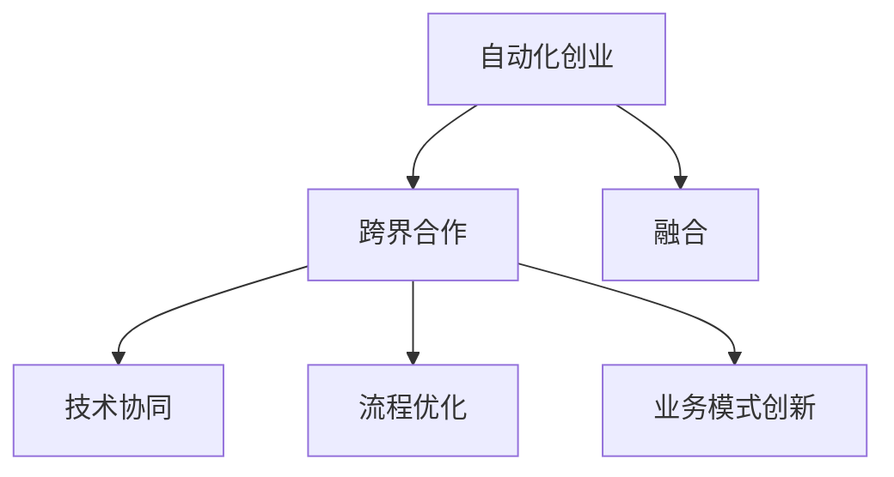

                 

## 1. 背景介绍

在当今快速变化的商业环境中，自动化技术正在改变各行各业的运作方式。从制造业到金融服务，从医疗保健到零售业，自动化正在成为企业提升效率、降低成本、提高服务质量的关键驱动力。然而，成功的自动化项目不仅依赖于技术的创新，更需要跨学科的合作与融合。本文旨在探讨在自动化创业中跨界合作与融合的重要性，通过技术案例分析，为读者提供宝贵的洞察和实践建议。

## 2. 核心概念与联系

### 2.1 核心概念概述

自动化创业是指利用先进技术（如人工智能、机器人、物联网等），创新性地解决企业运营中的痛点，从而创造商业价值的创业活动。在这一过程中，跨界合作与融合指的是不同领域的专家和技术之间，通过合作与共享知识，以实现技术、流程和业务模式的协同优化。

**核心概念：**
- 自动化创业：利用技术创新驱动企业变革的创业模式。
- 跨界合作：不同领域（如AI、工业工程、市场营销）之间的协作。
- 融合：技术、流程与业务模式之间的协同优化。

### 2.2 核心概念原理和架构的 Mermaid 流程图



## 3. 核心算法原理 & 具体操作步骤

### 3.1 算法原理概述

在自动化创业中，跨界合作与融合的算法原理主要基于以下三点：

1. **协同优化**：通过不同领域专家的知识和技术结合，共同优化技术解决方案，使其更加适应实际应用场景。
2. **智能匹配**：利用机器学习算法匹配最适合的自动化技术，以实现最佳效果。
3. **持续改进**：在实际应用中收集反馈数据，不断优化算法和模型，确保技术始终与业务需求保持一致。

### 3.2 算法步骤详解

1. **需求分析**：与业务部门紧密合作，明确自动化项目的目标和需求，确定自动化技术的应用场景。
2. **技术评估**：根据需求，评估各种自动化技术的优缺点，选择最适合的技术方案。
3. **协同开发**：组织跨学科团队，共同开发和测试自动化系统，确保技术解决方案符合实际需求。
4. **部署实施**：将自动化系统部署到实际环境中，进行试用和优化。
5. **反馈迭代**：收集用户反馈，持续改进自动化系统，确保其长期稳定运行。

### 3.3 算法优缺点

**优点：**
- **跨学科优势**：不同领域的专家和技术结合，能够提出更具创新性的解决方案。
- **提高效率**：协同开发和持续改进机制，使得技术解决方案更加适应实际需求，提升项目成功率。
- **增强灵活性**：跨界合作使得企业能够快速应对市场变化，灵活调整技术策略。

**缺点：**
- **沟通成本高**：跨学科合作需要更多的时间进行沟通和协调，可能导致项目周期延长。
- **管理复杂**：跨界合作的团队管理较为复杂，需要更加细致的规划和协调。
- **资源投入大**：跨界合作通常需要更多的资金和人力资源投入。

### 3.4 算法应用领域

跨界合作与融合的算法原理广泛应用于以下领域：

- **工业自动化**：机器人技术、物联网与生产流程的优化。
- **金融科技**：智能投顾、自动交易、风险管理。
- **医疗健康**：机器人手术、远程监控、个性化治疗。
- **零售电商**：智能客服、库存管理、客户分析。
- **智能交通**：自动驾驶、交通流量分析、智能停车。

## 4. 数学模型和公式 & 详细讲解 & 举例说明

### 4.1 数学模型构建

在自动化创业中，跨界合作与融合的数学模型主要关注以下几个方面：

- **技术匹配模型**：通过计算技术相似度，匹配最适合的技术方案。
- **流程优化模型**：利用运筹学和模拟优化算法，提升流程效率。
- **业务匹配模型**：通过分析业务需求与技术解决方案的契合度，确定最佳方案。

### 4.2 公式推导过程

以技术匹配模型为例，假设我们有 $n$ 种技术 $T_1, T_2, ..., T_n$ 和 $m$ 个需求 $D_1, D_2, ..., D_m$，计算每种技术对每个需求的匹配度 $M_{i,j}$，公式为：

$$
M_{i,j} = \frac{\sum_{k=1}^n A_{i,k} \times B_{k,j}}{\sqrt{\sum_{k=1}^n A_{i,k}^2} \times \sqrt{\sum_{k=1}^n B_{k,j}^2}}
$$

其中 $A_{i,k}$ 和 $B_{k,j}$ 分别表示技术 $i$ 和需求 $j$ 的相似度矩阵。相似度矩阵可以通过余弦相似度、欧氏距离等计算方法获得。

### 4.3 案例分析与讲解

以智能制造为例，假设我们要自动化一条生产流水线，包括机械臂操作、物料搬运和质量检测等环节。我们有多种技术方案可供选择，如机器视觉、协作机器人、物联网传感器等。通过构建技术匹配模型，计算每种技术对各个需求（如自动化程度、成本、易用性等）的匹配度，找到最佳的技术组合，以实现最优的生产效率和成本控制。

## 5. 项目实践：代码实例和详细解释说明

### 5.1 开发环境搭建

开发环境搭建需要考虑到技术多样性和复杂性，一般建议采用以下配置：

- **编程语言**：Python、Java、C++ 等，根据具体技术栈进行选择。
- **开发框架**：TensorFlow、PyTorch、Keras 等深度学习框架，以及 Spring、Flask 等 Web 框架。
- **数据库**：MySQL、PostgreSQL、MongoDB 等关系型或非关系型数据库。
- **工具**：JIRA、Confluence、Git 等项目管理工具和版本控制工具。

### 5.2 源代码详细实现

以智能客服系统为例，代码实现可以分为以下几个部分：

1. **需求分析模块**：通过问卷调查或用户访谈，收集业务需求，生成需求文档。
2. **技术评估模块**：根据需求文档，评估各种自动化技术的优缺点，选择最适合的技术方案。
3. **协同开发模块**：组织跨学科团队，共同开发和测试自动化系统，生成原型。
4. **部署实施模块**：将自动化系统部署到实际环境中，进行试用和优化。
5. **反馈迭代模块**：收集用户反馈，持续改进自动化系统，确保其长期稳定运行。

### 5.3 代码解读与分析

**需求分析模块**：

```python
class RequirementsAnalysis:
    def __init__(self):
        self.demand = []

    def gather_demand(self, survey_results):
        self.demand = survey_results

    def generate_report(self):
        report = ""
        for demand in self.demand:
            report += "Demand: {}\n".format(demand)
        return report
```

**技术评估模块**：

```python
class TechnologyEvaluation:
    def __init__(self, technologies, demands):
        self.technologies = technologies
        self.demands = demands

    def evaluate_technologies(self):
        evaluations = {}
        for technology in self.technologies:
            evaluations[technology] = {}
            for demand in self.demands:
                evaluations[technology][demand] = self.calculate_match_score(technology, demand)
        return evaluations

    def calculate_match_score(self, technology, demand):
        # 计算技术对需求的匹配度
        pass
```

**协同开发模块**：

```python
class CollaborativeDevelopment:
    def __init__(self, technologies, evaluations):
        self.technologies = technologies
        self.evaluations = evaluations

    def develop_prototype(self):
        # 组织跨学科团队，共同开发和测试自动化系统
        pass
```

**部署实施模块**：

```python
class Deployment:
    def __init__(self, prototype):
        self.prototype = prototype

    def deploy(self):
        # 将自动化系统部署到实际环境中
        pass
```

**反馈迭代模块**：

```python
class FeedbackIteration:
    def __init__(self, deployment):
        self.deployment = deployment

    def collect_feedback(self):
        # 收集用户反馈
        pass

    def iterate_improve(self):
        # 持续改进自动化系统
        pass
```

### 5.4 运行结果展示

通过以上代码示例，我们可以看到自动化创业中跨界合作与融合的基本流程。需求分析模块收集并整理业务需求，技术评估模块计算各种技术的匹配度，协同开发模块组织跨学科团队共同开发，部署实施模块将自动化系统部署到实际环境中，反馈迭代模块收集并优化用户反馈。

## 6. 实际应用场景

### 6.1 智能制造

智能制造是自动化创业的重要领域，通过跨界合作与融合，可以大幅提升生产效率和产品质量。例如，某汽车制造企业通过跨界合作，结合物联网、机器视觉和协作机器人技术，成功实现了柔性生产线的自动化改造，实现了生产效率的显著提升。

### 6.2 智慧医疗

智慧医疗是自动化创业的另一重要领域，通过跨界合作与融合，可以显著提升医疗服务的效率和质量。例如，某医院通过跨界合作，将机器学习算法与电子病历系统融合，实现了智能诊断和个性化治疗，提高了患者满意度和治疗效果。

### 6.3 智能交通

智能交通是自动化创业的前沿领域，通过跨界合作与融合，可以实现交通流量的智能管理和自动驾驶。例如，某城市通过跨界合作，结合物联网、计算机视觉和传感器技术，实现了智能交通信号控制和自动驾驶技术的应用，大大提升了交通效率和安全性。

### 6.4 未来应用展望

随着技术的不断进步，自动化创业中的跨界合作与融合将更加广泛和深入。未来的应用场景可能包括：

- **全栈自动化**：将自动化技术应用于企业的各个环节，实现端到端的自动化流程。
- **智能决策支持**：通过跨界合作，结合大数据分析和人工智能，实现智能决策支持系统。
- **人机协作**：在自动化与人工之间建立更加紧密的协作关系，提升工作效率和质量。

## 7. 工具和资源推荐

### 7.1 学习资源推荐

- **在线课程**：Coursera、edX、Udacity 等平台提供的跨界合作与融合相关课程。
- **专业书籍**：《跨学科创新》、《人工智能与工业4.0》等书籍。
- **行业报告**：Gartner、Forrester、IDC 等发布的自动化和技术融合报告。

### 7.2 开发工具推荐

- **项目管理工具**：JIRA、Confluence、Trello、Asana。
- **版本控制工具**：Git、SVN、Mercurial。
- **协作工具**：Slack、Microsoft Teams、Zoom。

### 7.3 相关论文推荐

- **《跨学科合作：未来工作的关键》**：探讨跨学科合作的重要性及其对未来工作的影响。
- **《自动化系统的跨学科设计和开发》**：介绍跨学科设计和开发自动化系统的实践方法。
- **《智能制造的跨学科协同优化》**：分析智能制造中的跨界合作与融合技术。

## 8. 总结：未来发展趋势与挑战

### 8.1 研究成果总结

在自动化创业中，跨界合作与融合技术已经取得了显著进展，并应用于多个行业。然而，随着技术的不断发展和应用场景的扩展，仍面临以下挑战：

- **技术复杂性**：跨界合作涉及多种技术和多个学科，需要深入理解和整合。
- **资源管理**：跨学科团队的管理和资源协调较为复杂，需要精细化管理。
- **持续创新**：自动化技术和业务需求不断变化，需要持续创新和优化。

### 8.2 未来发展趋势

未来的跨界合作与融合技术将呈现以下趋势：

- **技术集成化**：多种技术和多种学科的集成和融合，实现更高效、更智能的系统。
- **智能化决策**：通过人工智能和大数据分析，实现更加智能化的决策支持。
- **协同化生产**：实现人机协作和生产流程的优化，提升生产效率和质量。

### 8.3 面临的挑战

在自动化创业中，跨界合作与融合技术仍面临以下挑战：

- **技术碎片化**：多种技术和多种学科的碎片化，可能导致集成难度增加。
- **知识共享困难**：不同学科之间的知识共享和协作存在障碍。
- **伦理与安全**：跨界合作中涉及的伦理和安全性问题需要认真对待。

### 8.4 研究展望

未来的研究可以从以下几个方面展开：

- **跨学科知识共享平台**：建立知识共享平台，促进不同学科之间的知识交流和协作。
- **智能协同优化算法**：开发智能协同优化算法，实现多技术、多学科的协同优化。
- **伦理与安全研究**：研究自动化创业中的伦理与安全问题，建立健全的伦理与安全框架。

## 9. 附录：常见问题与解答

**Q1：跨界合作与融合如何确保技术一致性？**

A: 通过跨界合作与融合，可以建立标准化的技术评估和优化流程，确保技术一致性。例如，可以制定统一的技术标准和评估指标，定期进行技术评估和优化。

**Q2：跨界合作中如何处理不同学科之间的沟通差异？**

A: 通过建立跨学科团队和协作机制，可以有效地处理不同学科之间的沟通差异。团队成员应该具有较强的沟通能力和跨学科知识背景，定期进行团队沟通和协调。

**Q3：如何评估跨界合作的成效？**

A: 可以通过以下指标评估跨界合作的成效：

- **技术匹配度**：计算技术对需求的匹配度，评估技术的适用性。
- **业务影响**：评估技术应用对业务目标的影响，如生产效率提升、成本降低等。
- **用户满意度**：通过用户反馈和满意度调查，评估技术应用的用户接受度。

**Q4：如何确保跨界合作中的数据安全和隐私保护？**

A: 在跨界合作中，应该制定严格的数据安全和隐私保护措施，包括数据加密、访问控制、数据匿名化等。同时，建立数据使用的伦理审查机制，确保数据使用的合法性和透明性。

**Q5：跨界合作与融合如何实现长期可持续发展？**

A: 跨界合作与融合的长期可持续发展需要建立有效的机制和流程，包括：

- **持续改进**：定期收集用户反馈，持续改进技术方案。
- **团队协作**：建立跨学科团队，持续进行技术研发和优化。
- **资源投入**：合理规划和分配资源，确保项目的持续投入和支持。

综上所述，自动化创业中的跨界合作与融合技术，在提升效率、降低成本、提高服务质量方面具有重要价值。通过技术创新和跨学科合作，企业可以更好地应对市场变化，实现长期的可持续发展。

