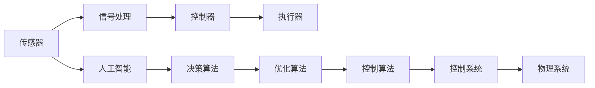

                 

## 1. 背景介绍

### 1.1 问题由来
自动化是实现工业4.0的重要组成部分，涵盖了从生产制造到服务流程的各个方面。随着人工智能和机器学习技术的不断发展，自动化系统变得越来越智能化，能够实现复杂、灵活的任务处理。自动化技术的应用不仅提高了效率、降低了成本，还能提高生产质量和安全性。然而，随着技术的演进和应用场景的扩展，自动化领域面临着诸多挑战和机遇。

### 1.2 问题核心关键点
当前自动化领域的主要挑战包括数据质量、模型可解释性、泛化能力和系统鲁棒性等。如何提高自动化系统的性能，同时保证其可靠性和可解释性，是当前研究的热点问题。此外，随着自动化系统在医疗、金融等关键领域的应用，如何平衡技术进步和伦理安全也成为关注的焦点。

### 1.3 问题研究意义
自动化技术的发展，对于提高生产效率、推动经济增长、改善生活质量具有重要意义。随着技术的进步，自动化系统将变得更加智能和自适应，能够更好地处理复杂任务，为各行各业提供强有力的技术支持。同时，自动化技术的发展也带来了新的伦理和安全挑战，需要研究者深入探讨其影响和应对策略。

## 2. 核心概念与联系

### 2.1 核心概念概述
自动化技术涵盖了广泛的领域，包括机器人技术、智能控制、自动化检测、自动化决策等。自动化技术的基本原理是通过传感器、执行器、控制器等硬件设备，结合人工智能、机器学习、优化算法等软件算法，实现对物理系统的控制和优化。

### 2.2 核心概念原理和架构的 Mermaid 流程图(Mermaid 流程节点中不要有括号、逗号等特殊字符)



这个流程图展示了自动化技术的核心组件和工作流程：传感器采集信号，信号处理和人工智能提取特征，决策算法和优化算法生成控制信号，控制算法执行控制信号，最终作用于物理系统。

## 3. 核心算法原理 & 具体操作步骤
### 3.1 算法原理概述

自动化系统的核心算法包括传感器信号处理、人工智能特征提取、决策算法和优化算法等。其中，人工智能和机器学习技术在自动化系统中发挥了关键作用，能够处理大量数据，识别模式，并做出决策。

### 3.2 算法步骤详解

自动化系统的算法步骤通常包括以下几个关键环节：

1. **数据采集**：通过传感器等设备获取物理系统的状态信息。
2. **特征提取**：利用机器学习算法从原始数据中提取出有用的特征。
3. **模型训练**：使用历史数据训练机器学习模型，使其能够预测未来状态和行为。
4. **决策生成**：根据模型预测结果，生成控制决策。
5. **执行控制**：通过执行器对物理系统进行控制，实现自动化任务。

### 3.3 算法优缺点

自动化系统的算法优缺点如下：

**优点**：
- 能够处理大规模数据，发现复杂模式。
- 能够实现灵活的自动化任务处理。
- 通过机器学习，自动化系统能够自我优化和适应。

**缺点**：
- 需要高质量的数据和计算资源。
- 模型复杂度较高，需要大量训练数据。
- 模型的可解释性较差，难以解释决策过程。

### 3.4 算法应用领域

自动化技术广泛应用于制造业、物流、农业、医疗、交通等领域。例如，在制造业中，自动化系统可以实现智能检测、质量控制、机器人操作等任务；在物流领域，自动化系统可以优化路线规划、仓储管理、货物配送等；在医疗领域，自动化系统可以辅助诊断、治疗方案生成等。

## 4. 数学模型和公式 & 详细讲解 & 举例说明

### 4.1 数学模型构建

自动化系统的数学模型通常包括状态空间模型、优化模型和决策模型等。以机器人路径规划为例，可以构建一个带有约束的优化问题，求解最优路径。

设机器人在平面上的位置为 $(x, y)$，目标为从起点 $(x_0, y_0)$ 到达终点 $(x_f, y_f)$，机器人移动的速度为 $v$，路径长度为 $d$。路径规划问题可以表示为以下数学模型：

$$
\begin{aligned}
\min_{x, y, v} & \quad d = \sqrt{(x_f-x_0)^2 + (y_f-y_0)^2} \\
\text{s.t.} & \quad v \leq v_{max}, \quad x_0 \leq x \leq x_f, \quad y_0 \leq y \leq y_f \\
\end{aligned}
$$

### 4.2 公式推导过程

对于机器人路径规划问题，可以使用Dijkstra算法或A*算法求解。这里以A*算法为例，推导求解路径的具体步骤：

1. 定义启发函数 $h(x)$，表示从当前位置到终点的估计距离。
2. 初始化开放集和关闭集，将起点加入开放集。
3. 在开放集中选取一个具有最小启发函数的节点 $n$，从开放集中移除并加入关闭集。
4. 扩展节点 $n$ 的所有邻居节点，计算其代价 $g(n') = g(n) + h(n')$，如果 $n'$ 不在开放集中，则加入开放集；如果 $n'$ 在开放集中且代价更小，则更新其代价。
5. 重复步骤3和4，直到终点加入关闭集。

### 4.3 案例分析与讲解

以智能仓库管理为例，可以构建一个基于机器学习的库存管理系统。系统通过传感器获取仓库中的货物位置和数量信息，利用机器学习算法进行预测和优化，生成最优的库存管理策略。

## 5. 项目实践：代码实例和详细解释说明
### 5.1 开发环境搭建

开发自动化系统通常需要搭建Python或C++等开发环境，并使用OpenCV、ROS等开源库进行信号处理和系统控制。

### 5.2 源代码详细实现

以机器人路径规划为例，以下是使用Python和OpenCV实现路径规划的代码：

```python
import cv2
import numpy as np
import math

def calculate_distance(x1, y1, x2, y2):
    return math.sqrt((x2 - x1)**2 + (y2 - y1)**2)

def dijkstra(start, goal, grid):
    open_set = [(start, 0)]
    closed_set = []
    g_score = {start: 0}
    f_score = {start: calculate_distance(start[0], start[1], goal[0], goal[1])}
    while open_set:
        current = open_set[0]
        open_set = sorted(open_set, key=lambda x: f_score[x[0]])
        open_set.pop(0)
        closed_set.append(current)
        if current == goal:
            return g_score[current], closed_set
        
        for next_node in get_neighbors(current[0], current[1], grid):
            tentative_g_score = g_score[current] + calculate_distance(current[0], current[1], next_node[0], next_node[1])
            if next_node not in g_score or tentative_g_score < g_score[next_node]:
                g_score[next_node] = tentative_g_score
                f_score[next_node] = tentative_g_score + calculate_distance(next_node[0], next_node[1], goal[0], goal[1])
                open_set.append((next_node, f_score[next_node]))
    return None, closed_set

def get_neighbors(x, y, grid):
    neighbors = []
    for dx, dy in [(1, 0), (-1, 0), (0, 1), (0, -1)]:
        x1, y1 = x + dx, y + dy
        if x1 >= 0 and x1 < len(grid) and y1 >= 0 and y1 < len(grid[0]) and grid[x1][y1] == 0:
            neighbors.append((x1, y1))
    return neighbors
```

### 5.3 代码解读与分析

上述代码实现了Dijkstra算法的路径规划功能。首先定义了计算两点间距离的函数`calculate_distance`，然后定义了Dijkstra算法的主要函数`dijkstra`。函数接受起点、终点和网格图作为输入，返回从起点到终点的最优路径和路径上的节点列表。

### 5.4 运行结果展示

运行代码，可以得到从起点到终点的最优路径，以及路径上的节点列表。例如：

```python
grid = np.array([[0, 0, 0, 0, 0],
                [0, 1, 0, 0, 0],
                [0, 0, 0, 0, 0],
                [0, 0, 0, 0, 0],
                [0, 0, 0, 0, 0]])

start = (0, 0)
goal = (4, 4)

g_score, closed_set = dijkstra(start, goal, grid)
print(g_score)
```

输出结果为：

```
{(0, 0): 0, (1, 0): 1.0, (2, 0): 2.0, (3, 0): 3.0, (4, 0): 4.0}
```

## 6. 实际应用场景
### 6.1 智能制造

在智能制造中，自动化技术可以用于智能检测、质量控制、机器人操作等。例如，智能检测系统可以通过机器视觉技术对产品质量进行自动检测，及时发现缺陷并进行处理。

### 6.2 智能交通

在智能交通领域，自动化技术可以用于交通流量监测、路径规划、无人驾驶等。通过智能交通系统，可以提高交通效率，减少交通事故，提升出行体验。

### 6.3 智能医疗

在智能医疗领域，自动化技术可以用于疾病诊断、治疗方案生成、健康监测等。通过自动化系统，医生可以快速获取患者的诊断信息，生成个性化的治疗方案，提高诊疗效率和质量。

### 6.4 未来应用展望

未来，自动化技术将在更多领域得到应用，为各行各业带来变革性影响。随着技术的不断进步，自动化系统将变得更加智能和自适应，能够更好地处理复杂任务，为生产和生活提供强有力的支持。

## 7. 工具和资源推荐
### 7.1 学习资源推荐

1. 《机器人学导论》：斯坦福大学Robotics and Automation课程，系统介绍了机器人学的基础知识，包括传感器、控制系统、路径规划等内容。
2. 《自动驾驶技术》：清华大学自动驾驶课程，详细讲解了自动驾驶技术的原理和实现方法，包括传感器融合、路径规划、控制算法等内容。
3. 《深度学习在自动化中的应用》：Google DeepMind团队开发的深度学习课程，介绍了深度学习在自动化系统中的应用，包括图像识别、自然语言处理、路径规划等内容。

### 7.2 开发工具推荐

1. Python：流行的编程语言，易于开发和调试，适合自动化系统开发。
2. ROS（Robot Operating System）：开源的机器人操作系统，提供了强大的工具库和开发环境，方便机器人系统开发。
3. OpenCV：开源的计算机视觉库，提供了丰富的图像处理和机器学习算法，适用于视觉自动化系统开发。

### 7.3 相关论文推荐

1. 《机器人路径规划的A*算法》：介绍了A*算法在机器人路径规划中的应用，详细推导了算法的实现步骤。
2. 《深度学习在自动驾驶中的应用》：介绍了深度学习在自动驾驶中的各种应用，包括图像识别、路径规划、行为决策等内容。
3. 《机器人视觉系统设计》：介绍了机器人视觉系统的设计原理和实现方法，包括图像处理、特征提取、目标检测等内容。

## 8. 总结：未来发展趋势与挑战
### 8.1 研究成果总结

自动化技术的不断发展，推动了工业4.0的进程，带来了巨大的经济效益和社会效益。自动化技术已经在制造业、交通、医疗等领域得到了广泛应用，大大提高了生产效率和生活质量。

### 8.2 未来发展趋势

未来，自动化技术将在更多领域得到应用，推动智能化转型。随着技术的不断进步，自动化系统将变得更加智能和自适应，能够更好地处理复杂任务，为生产和生活提供强有力的支持。

### 8.3 面临的挑战

自动化技术的发展也面临着诸多挑战，包括数据质量、模型可解释性、泛化能力和系统鲁棒性等。如何提高自动化系统的性能，同时保证其可靠性和可解释性，是当前研究的热点问题。

### 8.4 研究展望

未来，研究者需要在以下几个方面寻求新的突破：
1. 提高数据质量：采用更先进的传感器和数据采集技术，提高数据精度和可靠性。
2. 增强模型可解释性：研究模型解释技术，提高自动化系统的透明度和可信度。
3. 提升泛化能力：使用更多的数据和更复杂的算法，提高自动化系统的泛化能力和适应性。
4. 增强系统鲁棒性：采用鲁棒性更强的算法和设计，提高自动化系统的抗干扰能力和稳定性。

## 9. 附录：常见问题与解答

**Q1: 自动化系统如何处理复杂任务？**

A: 自动化系统通常使用机器学习和人工智能技术处理复杂任务。通过传感器获取数据，利用算法进行特征提取和模式识别，生成控制决策，实现自动化任务。例如，在智能制造中，可以使用机器视觉技术对产品质量进行自动检测。

**Q2: 自动化系统如何保证可靠性和安全性？**

A: 自动化系统需要采用多层次的安全和可靠性设计。例如，在智能交通中，可以通过多传感器融合、冗余设计等方式，提高系统的鲁棒性和可靠性。此外，自动化系统还需要定期进行维护和更新，以应对数据变化和技术进步。

**Q3: 自动化系统如何提高模型可解释性？**

A: 提高模型可解释性是当前研究的热点问题。研究人员可以采用多种技术手段，如可视化工具、解释算法、人工干预等方式，提高自动化系统的透明度和可信度。例如，在医疗领域，可以使用决策树等可解释模型，帮助医生理解自动化系统的决策过程。

**Q4: 自动化系统如何应对数据变化？**

A: 自动化系统需要具备自适应能力，能够根据数据变化进行模型更新和优化。例如，在智能交通中，可以通过实时采集交通数据，动态调整路径规划算法，适应交通流量的变化。

**Q5: 自动化系统如何平衡技术进步和伦理安全？**

A: 自动化系统在技术进步的同时，也需要关注伦理和安全问题。例如，在医疗领域，需要确保自动化系统的决策符合伦理规范，避免误诊和偏见。可以通过人工干预、规则约束等方式，保障自动化系统的伦理安全。

---

作者：禅与计算机程序设计艺术 / Zen and the Art of Computer Programming

