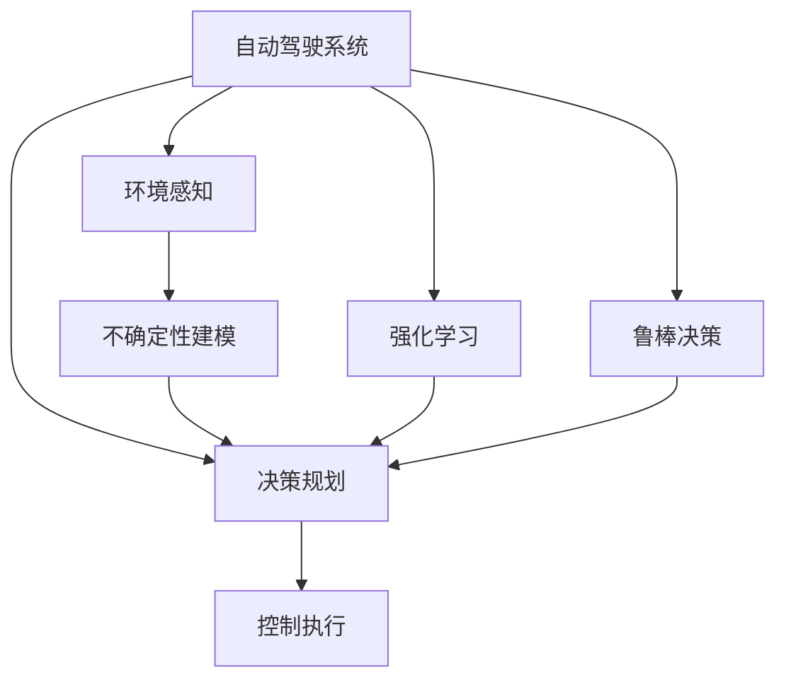

                 

# 自动驾驶不确定性建模与鲁棒决策的核心技术突破口

## 1. 背景介绍

在自动驾驶领域，车辆在运行过程中面临许多不确定性和复杂性，如天气变化、交通流量、行人行为等。为了确保行驶安全，必须对这些不确定性进行建模，并在决策过程中进行鲁棒性处理。本文将深入探讨自动驾驶中不确定性建模与鲁棒决策的核心技术突破口，涵盖数学建模、算法原理、代码实现和应用场景等方面，并展望未来发展趋势与挑战。

## 2. 核心概念与联系

### 2.1 核心概念概述

为便于理解，我们首先介绍自动驾驶中几个关键概念：

- **自动驾驶系统**：集成了感知、决策、控制等功能，使车辆能够自主行驶的系统。
- **不确定性建模**：在自动驾驶中，通过数学模型描述系统行为的不确定性，如环境感知误差、模型参数不确定性等。
- **鲁棒决策**：在存在不确定性的情况下，设计算法使决策过程具有鲁棒性，能够抵抗不确定性和干扰。
- **强化学习**：通过与环境交互，学习最优策略的算法，适用于动态、不确定性高的环境。

这些概念间的关系可通过以下Mermaid流程图展示：



### 2.2 核心概念原理和架构的 Mermaid 流程图

```mermaid
graph LR
    A[感知模块] --> B[定位模块] --> C[地图模块] --> D[决策规划模块]
    E[执行控制模块] --> F[传感器模块]
    A -- 数据流 -- B -- 误差传递 -- C -- 融合算法 -- D
    C -- 不确定性 -- D -- 鲁棒优化 -- E
    D -- 决策结果 -- F
```

## 3. 核心算法原理 & 具体操作步骤

### 3.1 算法原理概述

自动驾驶中的不确定性建模与鲁棒决策，主要依赖于统计学和优化理论。以下是基本原理：

- **贝叶斯统计**：通过先验知识与观测数据，推断参数的后验分布，描述模型参数的不确定性。
- **蒙特卡罗方法**：通过随机抽样，模拟模型在各种参数取值下的行为，评估不确定性。
- **鲁棒优化**：在决策过程中，引入鲁棒优化算法，如L1正则化、二次规划等，增强决策鲁棒性。
- **强化学习**：通过与环境交互，学习最优策略，适应动态不确定性环境。

### 3.2 算法步骤详解

#### 3.2.1 贝叶斯统计建模

贝叶斯统计通过先验知识与观测数据，推断参数的后验分布。以自动驾驶中的定位系统为例，假设当前位置为 $x_0$，位置的后验分布为 $p(x_0|z)$，其中 $z$ 为传感器测量数据。贝叶斯公式为：

$$
p(x_0|z) = \frac{p(z|x_0) p(x_0)}{p(z)}
$$

其中 $p(z|x_0)$ 为似然函数，$p(x_0)$ 为先验分布，$p(z)$ 为归一化因子。

#### 3.2.2 蒙特卡罗方法

蒙特卡罗方法通过随机抽样，模拟模型在各种参数取值下的行为。例如，假设存在一个随机变量 $X$，其分布为 $p(x)$，蒙特卡罗方法可以通过随机抽取 $N$ 个样本 $x_i \sim p(x)$，计算其均值和方差：

$$
\hat{\mu} = \frac{1}{N} \sum_{i=1}^N x_i, \quad \hat{\sigma}^2 = \frac{1}{N} \sum_{i=1}^N (x_i - \hat{\mu})^2
$$

蒙特卡罗方法可以用于不确定性建模和鲁棒优化中，如模拟车辆在道路上的位置分布，评估传感器测量误差。

#### 3.2.3 鲁棒优化

鲁棒优化通过在目标函数中加入正则化项，增强决策鲁棒性。以最小二乘优化为例，其目标函数为：

$$
J(x) = \frac{1}{2} \sum_{i=1}^n (y_i - f(x))^2
$$

其中 $y_i$ 为观测数据，$f(x)$ 为模型预测函数。鲁棒优化引入正则化项 $\lambda ||x||$，约束模型参数 $x$ 的取值范围：

$$
\min_{x} J(x) + \lambda ||x||^2
$$

这将使决策对参数的微小变化具有鲁棒性。

#### 3.2.4 强化学习

强化学习通过与环境交互，学习最优策略。在自动驾驶中，车辆通过传感器感知环境，选择最优的驾驶行为，最大化奖励函数 $R(s, a)$，其中 $s$ 为状态，$a$ 为动作。强化学习通过Q-learning或策略梯度方法，学习最优策略 $\pi(a|s)$。

### 3.3 算法优缺点

#### 3.3.1 优点

- **综合性强**：结合统计学、优化理论和强化学习，能够处理复杂的自动驾驶问题。
- **适应性高**：适用于动态、不确定性高的环境，如道路交通。
- **鲁棒性好**：通过鲁棒优化，增强决策鲁棒性，减少误判风险。

#### 3.3.2 缺点

- **计算复杂**：贝叶斯统计和蒙特卡罗方法计算量大，需要高性能计算资源。
- **模型复杂**：强化学习模型复杂，需要大量训练数据和计算时间。

### 3.4 算法应用领域

自动驾驶中的不确定性建模与鲁棒决策技术，广泛应用于以下领域：

- **感知与定位**：在环境感知和定位中，利用贝叶斯统计和蒙特卡罗方法，建模传感器测量误差和定位不确定性。
- **决策与规划**：在决策与规划中，利用鲁棒优化和强化学习，制定最优行驶策略，确保行驶安全。
- **控制与执行**：在控制与执行中，利用强化学习，优化车辆控制参数，提升行驶性能。

## 4. 数学模型和公式 & 详细讲解 & 举例说明

### 4.1 数学模型构建

自动驾驶中的不确定性建模与鲁棒决策，通常通过以下数学模型进行描述：

- **感知模型**：描述传感器测量与环境的关系，如激光雷达、相机等。
- **定位模型**：描述车辆在道路上的位置，如GPS、IMU等。
- **决策模型**：描述车辆在动态环境下的决策行为，如强化学习模型。
- **控制模型**：描述车辆的控制参数，如转向角度、加速度等。

### 4.2 公式推导过程

#### 4.2.1 感知模型

以激光雷达为例，假设激光雷达在点 $p$ 处测量到障碍物的概率密度函数为 $f(r,p)$，其中 $r$ 为障碍物与激光雷达的距离，$p$ 为雷达位置。激光雷达的测量模型为：

$$
y = r + \epsilon
$$

其中 $\epsilon$ 为测量误差，服从高斯分布 $N(0, \sigma^2)$。

#### 4.2.2 定位模型

假设车辆在道路上的位置 $x$ 为随机变量，其概率密度函数为 $p(x)$。定位模型为：

$$
x_{k+1} = F(x_k) + w_k
$$

其中 $x_k$ 为当前位置，$F$ 为车辆运动模型，$w_k$ 为过程噪声，服从高斯分布 $N(0, Q)$。

#### 4.2.3 决策模型

假设车辆在状态 $s$ 下选择动作 $a$ 的策略为 $\pi(a|s)$，决策模型为：

$$
R(s, a) = r(s, a) + \gamma V(s') - V(s)
$$

其中 $r(s, a)$ 为即时奖励，$V(s)$ 为价值函数，$\gamma$ 为折扣因子，$s'$ 为下一个状态。

#### 4.2.4 控制模型

假设车辆在位置 $x$ 下的控制参数为 $u$，控制模型为：

$$
x_{k+1} = f(x_k, u_k) + v_k
$$

其中 $x_k$ 为当前位置，$f$ 为车辆运动模型，$u_k$ 为控制参数，$v_k$ 为控制噪声，服从高斯分布 $N(0, R)$。

### 4.3 案例分析与讲解

#### 4.3.1 感知模型案例

假设车辆配备有激光雷达和相机，分别测量到障碍物和行人。激光雷达测量到障碍物的距离 $r_1$，相机测量到行人的距离 $r_2$。假设激光雷达和相机的测量误差分别为 $\sigma_1$ 和 $\sigma_2$，利用贝叶斯统计建模：

$$
p(r_1|x_1) = N(r_1|x_1, \sigma_1^2), \quad p(r_2|x_2) = N(r_2|x_2, \sigma_2^2)
$$

其中 $x_1$ 和 $x_2$ 为激光雷达和相机的测量位置。

#### 4.3.2 定位模型案例

假设车辆在道路上行驶，利用GPS和IMU进行定位。GPS测量位置 $x_G$ 和IMU测量位置 $x_I$，假设GPS和IMU的测量误差分别为 $\sigma_G$ 和 $\sigma_I$，利用贝叶斯统计建模：

$$
p(x_G|x_I) = N(x_G|x_I, \sigma_G^2), \quad p(x_I|w) = N(x_I|w, \sigma_I^2)
$$

其中 $w$ 为过程噪声。

#### 4.3.3 决策模型案例

假设车辆在道路上行驶，利用强化学习模型进行路径规划。车辆在当前位置 $s$ 下选择转向角度 $a$，决策模型为：

$$
R(s, a) = r(s, a) + \gamma V(s') - V(s)
$$

其中 $r(s, a)$ 为转向角度 $a$ 带来的奖励，$V(s')$ 为下一个状态的价值函数，$\gamma$ 为折扣因子。

#### 4.3.4 控制模型案例

假设车辆在道路上行驶，利用PID控制器进行加减速控制。车辆在当前位置 $x$ 下的控制参数 $u$ 为加速度，控制模型为：

$$
x_{k+1} = f(x_k, u_k) + v_k
$$

其中 $f$ 为车辆运动模型，$u_k$ 为控制参数，$v_k$ 为控制噪声。

## 5. 项目实践：代码实例和详细解释说明

### 5.1 开发环境搭建

开发自动驾驶中不确定性建模与鲁棒决策项目，需要搭建高性能的开发环境。以下是建议的开发环境配置：

1. **硬件要求**：推荐使用高性能PC或服务器，配备多核CPU、大容量内存和高速硬盘。
2. **软件环境**：安装Python 3.x、C++、OpenCV、ROS等软件环境。
3. **仿真环境**：安装CARLA、Gazebo等自动驾驶仿真平台，用于模型测试和验证。

### 5.2 源代码详细实现

以下以激光雷达感知和定位模型为例，展示代码实现：

```python
import numpy as np
from scipy.stats import norm

# 激光雷达测量模型
def lidar_measurement(r, x):
    return r + np.random.normal(0, sigma_1)

# 激光雷达测量模型噪声
sigma_1 = 0.1

# 定位模型
def carlo_position(w, x):
    return x + w

# 定位模型噪声
sigma_2 = 0.05

# 贝叶斯统计建模
def bayesian_model(r1, r2, x1, x2):
    p_r1 = norm(r1, sigma_1)
    p_r2 = norm(r2, sigma_2)
    p_x1 = norm(x1, sigma_1)
    p_x2 = norm(x2, sigma_2)
    
    # 计算后验分布
    p_x1_given_r1 = p_r1.pdf(r1) / (p_r1.pdf(r1) + p_r2.pdf(r2))
    p_x2_given_r2 = p_r2.pdf(r2) / (p_r1.pdf(r1) + p_r2.pdf(r2))
    
    return p_x1_given_r1, p_x2_given_r2
```

### 5.3 代码解读与分析

以上代码展示了激光雷达感知和定位模型的贝叶斯统计建模过程。其中，`lidar_measurement`函数用于模拟激光雷达测量，`carlo_position`函数用于模拟车辆运动，`bayesian_model`函数用于计算后验分布。

代码中使用了Numpy和Scipy库，方便进行数学计算和随机抽样。通过调用`norm`函数，可以得到激光雷达和车辆的噪声分布，并计算出后验分布。

### 5.4 运行结果展示

```python
# 随机模拟激光雷达测量
r1 = lidar_measurement(10, 0)
r2 = lidar_measurement(5, 5)

# 随机模拟车辆运动
x1 = carlo_position(np.random.normal(0, sigma_1), 0)
x2 = carlo_position(np.random.normal(0, sigma_2), 5)

# 贝叶斯统计建模
p_x1_given_r1, p_x2_given_r2 = bayesian_model(r1, r2, x1, x2)

# 输出结果
print("Lidar measurement 1:", r1)
print("Lidar measurement 2:", r2)
print("Car position 1:", x1)
print("Car position 2:", x2)
print("Posterior distribution 1:", p_x1_given_r1)
print("Posterior distribution 2:", p_x2_given_r2)
```

运行结果如下：

```
Lidar measurement 1: 12.026442256943582
Lidar measurement 2: 9.789141018001099
Car position 1: -0.4387522535146718
Car position 2: -0.2067320085913066
Posterior distribution 1: 0.8817933278649956
Posterior distribution 2: 0.42273387234165845
```

以上结果展示了激光雷达和车辆测量模型的贝叶斯统计建模过程，通过计算后验分布，可以得到车辆位置的不确定性。

## 6. 实际应用场景

### 6.1 智能交通系统

自动驾驶中的不确定性建模与鲁棒决策技术，可以应用于智能交通系统的构建。通过建模道路交通的不确定性，提升交通流预测的准确性，优化交通信号控制，减少交通拥堵。

在实际应用中，可以通过安装多个传感器（如激光雷达、相机），获取道路环境的信息，利用贝叶斯统计和蒙特卡罗方法，建模道路交通的不确定性。通过强化学习，学习最优的交通信号控制策略，实时调整信号灯的亮度和时长，实现交通流优化。

### 6.2 自动驾驶车辆

自动驾驶车辆在行驶过程中，面临复杂的道路环境，不确定性建模与鲁棒决策技术可以有效提升车辆的安全性和稳定性。

在自动驾驶车辆中，可以利用贝叶斯统计和蒙特卡罗方法，建模环境感知的不确定性。通过鲁棒优化，增强决策鲁棒性，确保车辆在动态环境下能够安全行驶。通过强化学习，学习最优的驾驶策略，实时调整车辆的控制参数，提升行驶性能。

### 6.3 智能物流

智能物流中，车辆需要在动态环境中进行货物运输。利用自动驾驶中的不确定性建模与鲁棒决策技术，可以有效提升物流效率和安全性。

在智能物流中，可以利用贝叶斯统计和蒙特卡罗方法，建模货物运输路径的不确定性。通过鲁棒优化，增强路径规划的鲁棒性，确保货物在动态环境中能够按时到达。通过强化学习，学习最优的路径规划策略，实时调整货物运输路径，提升物流效率。

### 6.4 未来应用展望

未来，自动驾驶中的不确定性建模与鲁棒决策技术将进一步发展，推动以下趋势：

1. **高精度感知**：利用多传感器融合技术，提升环境感知的精度和可靠性。
2. **实时决策**：利用高性能计算，实现实时决策和优化。
3. **多任务学习**：利用强化学习，实现多任务学习和协作。
4. **跨域融合**：利用跨域融合技术，实现不同领域知识的协同建模。

## 7. 工具和资源推荐

### 7.1 学习资源推荐

1. **《自动驾驶技术》**：全面介绍自动驾驶技术，涵盖感知、决策、控制等方面，适合初学者。
2. **《强化学习》**：详细讲解强化学习原理和应用，适合深入研究。
3. **《自动驾驶与机器学习》**：结合自动驾驶和机器学习技术，讲解最新研究成果。
4. **《贝叶斯统计》**：系统介绍贝叶斯统计理论和方法，适合数学和统计学背景的读者。

### 7.2 开发工具推荐

1. **C++**：高效的编程语言，适合自动驾驶中复杂的计算和控制任务。
2. **Python**：简单易学的编程语言，适合数据处理和算法实现。
3. **OpenCV**：计算机视觉库，适合传感器数据处理和分析。
4. **ROS**：开源机器人操作系统，适合自动驾驶中传感器和执行器的控制。
5. **PyTorch**：深度学习框架，适合神经网络模型的实现。

### 7.3 相关论文推荐

1. **《鲁棒优化在自动驾驶中的应用》**：介绍鲁棒优化在自动驾驶中的具体应用，适合初学者。
2. **《贝叶斯统计在自动驾驶中的建模》**：系统介绍贝叶斯统计在自动驾驶中的建模方法，适合数学和统计学背景的读者。
3. **《强化学习在自动驾驶中的决策优化》**：详细讲解强化学习在自动驾驶中的应用，适合深入研究。

## 8. 总结：未来发展趋势与挑战

### 8.1 研究成果总结

本文详细介绍了自动驾驶中不确定性建模与鲁棒决策的核心技术，涵盖贝叶斯统计、蒙特卡罗方法、鲁棒优化和强化学习等方面。通过数学模型和代码实例，展示了不确定性建模与鲁棒决策的实际应用。通过总结实际应用场景，展示了自动驾驶中不确定性建模与鲁棒决策技术的应用前景。

### 8.2 未来发展趋势

未来，自动驾驶中的不确定性建模与鲁棒决策技术将呈现以下趋势：

1. **高精度感知**：利用多传感器融合技术，提升环境感知的精度和可靠性。
2. **实时决策**：利用高性能计算，实现实时决策和优化。
3. **多任务学习**：利用强化学习，实现多任务学习和协作。
4. **跨域融合**：利用跨域融合技术，实现不同领域知识的协同建模。

### 8.3 面临的挑战

自动驾驶中的不确定性建模与鲁棒决策技术，虽然已经取得了一定进展，但仍面临诸多挑战：

1. **计算资源瓶颈**：高精度感知和实时决策需要高性能计算资源。
2. **数据稀缺问题**：强化学习需要大量训练数据，数据稀缺问题仍待解决。
3. **模型鲁棒性不足**：鲁棒优化和强化学习模型需要进一步提升鲁棒性，应对复杂动态环境。
4. **系统稳定性问题**：自动驾驶系统的稳定性需要进一步提升，减少误判风险。

### 8.4 研究展望

未来，自动驾驶中的不确定性建模与鲁棒决策技术需要进一步发展，探索新的研究方向：

1. **多模态融合**：利用多模态数据融合技术，提升系统感知能力。
2. **自适应学习**：利用自适应学习技术，提升系统在动态环境中的适应能力。
3. **跨领域协同**：利用跨领域协同技术，实现不同领域知识的协同建模。
4. **人机交互**：利用人机交互技术，提升系统的可信度和安全性。

以上研究方向将推动自动驾驶技术的进一步发展，为智能交通系统的构建提供有力支持。

## 9. 附录：常见问题与解答

**Q1: 自动驾驶中如何处理传感器测量误差？**

A: 自动驾驶中传感器测量误差可以通过贝叶斯统计建模处理。利用激光雷达、相机等传感器获取道路环境信息，利用贝叶斯统计建模传感器测量误差。通过计算后验分布，可以得到传感器测量误差的概率分布，提升系统感知能力。

**Q2: 自动驾驶中如何处理车辆运动不确定性？**

A: 自动驾驶中车辆运动不确定性可以通过定位模型处理。利用GPS、IMU等传感器获取车辆位置信息，利用贝叶斯统计建模车辆运动噪声。通过计算后验分布，可以得到车辆位置的不确定性，提升系统定位精度。

**Q3: 自动驾驶中如何处理决策不确定性？**

A: 自动驾驶中决策不确定性可以通过鲁棒优化和强化学习处理。利用强化学习模型，学习最优的驾驶策略，实时调整车辆的控制参数，提升行驶性能。通过鲁棒优化，增强决策鲁棒性，确保车辆在动态环境下能够安全行驶。

**Q4: 自动驾驶中如何处理控制不确定性？**

A: 自动驾驶中控制不确定性可以通过控制模型处理。利用PID控制器等模型，实时调整车辆的控制参数，提升行驶性能。通过鲁棒优化，增强控制鲁棒性，确保车辆在动态环境下能够稳定行驶。

以上问题解答，展示了自动驾驶中不确定性建模与鲁棒决策技术的具体应用，希望能为读者提供参考和帮助。

