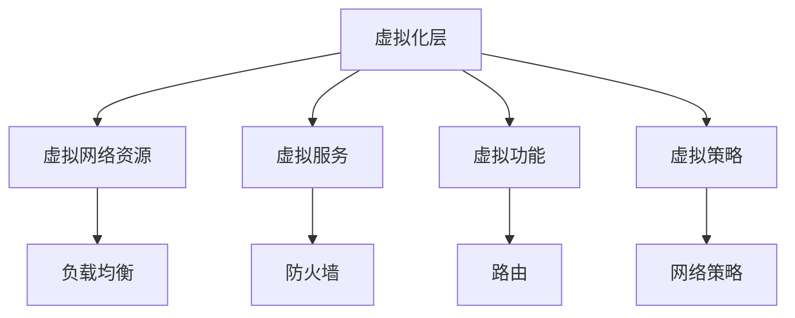

                 

## 1. 背景介绍

随着自动驾驶技术的日益成熟和应用场景的不断扩展，自动驾驶公司对网络的可靠性和灵活性提出了更高的要求。与此同时，云计算和容器技术的快速发展，为构建灵活可扩展的自动驾驶网络架构提供了新的可能性。虚拟化网络架构（Virtual Network Architecture）作为一种新兴的网络设计范式，通过将网络资源虚拟化，有效解决了传统网络架构中资源利用率低、扩展性差等问题，极大地提升了网络的性能和灵活性。

### 1.1 问题由来

在自动驾驶公司内部，网络架构的优化和升级常常面临以下挑战：

- **资源利用率低**：传统的网络架构中，物理资源和网络设备的利用率较低，无法充分利用网络基础设施。
- **扩展性差**：在需要新增服务或扩展网络功能时，传统网络架构的扩展性较差，常常需要大规模的硬件升级或网络重组。
- **故障恢复慢**：传统网络架构的故障恢复流程复杂，耗时长，影响业务连续性和用户体验。
- **安全性问题**：自动驾驶公司需要处理大量的敏感数据，传统网络架构的安全性问题不容忽视。

针对这些问题，虚拟化网络架构提供了一种新的解决方案，通过虚拟化技术将网络资源抽象化，实现了更高的资源利用率和更快的扩展性，同时保障了网络的高可用性和安全性。

### 1.2 问题核心关键点

虚拟化网络架构的核心概念包括：

- **网络虚拟化（Network Virtualization）**：通过虚拟化技术将物理网络资源抽象为虚拟网络资源，实现网络资源的高效利用。
- **服务虚拟化（Service Virtualization）**：将网络服务（如负载均衡、防火墙、VPN等）封装为虚拟服务，实现服务的灵活部署和管理。
- **功能虚拟化（Function Virtualization）**：将网络功能（如路由、转发、安全等）封装为虚拟功能，提升网络功能的可扩展性和灵活性。
- **策略虚拟化（Policy Virtualization）**：通过虚拟化策略，实现对网络资源和服务的高效管理。

虚拟化网络架构的关键点在于其通过虚拟化技术，将传统的网络架构转化为更加灵活、可扩展、高可用和安全的网络系统。

## 2. 核心概念与联系

### 2.1 核心概念概述

虚拟化网络架构通过将网络资源和服务封装为虚拟化的形式，实现对物理资源的抽象和资源共享。其核心概念包括网络虚拟化、服务虚拟化、功能虚拟化和策略虚拟化，这些概念共同构成了虚拟化网络架构的设计基础。

- **网络虚拟化**：通过虚拟化技术将物理网络资源抽象为逻辑网络资源，实现了对网络资源的细粒度管理和高效利用。
- **服务虚拟化**：将网络服务封装为虚拟服务，实现了服务的快速部署和管理。
- **功能虚拟化**：将网络功能封装为虚拟功能，实现了网络功能的灵活扩展。
- **策略虚拟化**：通过虚拟化策略，实现了对网络资源和服务的高效管理和优化。

### 2.2 核心概念原理和架构的 Mermaid 流程图

以下是一个简单的Mermaid流程图，展示了虚拟化网络架构的基本结构和关键组件：



这个流程图展示了虚拟化网络架构的核心结构：

1. 虚拟化层将物理网络资源抽象为虚拟网络资源。
2. 虚拟服务层封装了网络服务，如负载均衡、防火墙、VPN等，支持快速部署和灵活管理。
3. 虚拟功能层封装了网络功能，如路由、转发、安全等，实现了网络功能的灵活扩展。
4. 虚拟策略层通过虚拟化策略，实现了对网络资源和服务的高效管理和优化。

这些组件协同工作，共同构建了一个高效、可扩展、高可用和安全的虚拟化网络架构。

## 3. 核心算法原理 & 具体操作步骤

### 3.1 算法原理概述

虚拟化网络架构的实现主要基于虚拟化技术和软件定义网络（Software Defined Network, SDN）的概念。其核心算法原理如下：

1. **虚拟化技术**：通过虚拟化技术将物理网络资源抽象为逻辑网络资源，实现网络资源的高效利用。
2. **SDN控制面与数据面分离**：SDN通过将控制面与数据面分离，实现了对网络资源的集中管理和优化。
3. **网络策略编排**：通过虚拟化策略，实现了对网络资源和服务的高效管理和优化。
4. **自动化部署和管理**：虚拟化网络架构通过自动化工具和流程，实现了网络的快速部署和灵活管理。

### 3.2 算法步骤详解

以下是虚拟化网络架构的详细操作步骤：

**Step 1: 设计虚拟化架构**

- 确定虚拟网络架构的目标和需求，包括网络规模、性能要求、安全需求等。
- 选择合适的虚拟化技术和SDN控制器，进行网络架构的设计和规划。
- 定义虚拟网络资源、虚拟服务和虚拟功能，实现网络资源的高效利用。

**Step 2: 实现虚拟化技术**

- 采用虚拟化技术，将物理网络资源抽象为逻辑网络资源。
- 实现虚拟网络的隔离和隔离策略，确保不同虚拟网络之间的安全。
- 实现虚拟网络资源的动态管理和资源池化，提升资源利用率。

**Step 3: 部署SDN控制器**

- 选择适合的SDN控制器，实现控制面与数据面的分离。
- 配置SDN控制器，实现对虚拟网络的集中管理和优化。
- 通过SDN控制器，实现网络策略的编排和管理。

**Step 4: 实现虚拟服务和虚拟功能**

- 封装虚拟服务，如负载均衡、防火墙、VPN等，实现服务的快速部署和管理。
- 封装虚拟功能，如路由、转发、安全等，实现网络功能的灵活扩展。
- 通过SDN控制器，实现虚拟服务和虚拟功能的编排和管理。

**Step 5: 实现虚拟策略**

- 定义虚拟策略，实现对虚拟网络和虚拟服务的优化和管理。
- 实现策略的动态调整和策略自动化，提升网络管理的效率和灵活性。
- 通过SDN控制器，实现虚拟策略的编排和管理。

**Step 6: 自动化部署和管理**

- 实现虚拟化网络架构的自动化部署和管理，包括资源分配、策略调整、故障恢复等。
- 通过自动化工具和流程，实现网络的快速部署和灵活管理。
- 实现监控和告警机制，保障网络的稳定性和可靠性。

### 3.3 算法优缺点

虚拟化网络架构具有以下优点：

- **高资源利用率**：通过虚拟化技术，实现了网络资源的高效利用，避免了物理资源的浪费。
- **高扩展性**：通过虚拟化服务和功能，实现了网络功能的灵活扩展和服务的快速部署。
- **高可用性**：通过虚拟化策略，实现了对网络资源和服务的高效管理和优化，提升了网络的可用性。
- **高安全性**：通过虚拟化技术和策略，实现了对网络的安全管理和隔离，保障了数据的安全性。

同时，虚拟化网络架构也存在一些缺点：

- **复杂性高**：虚拟化网络架构的设计和实现较为复杂，需要综合考虑多种因素。
- **性能损耗**：虚拟化技术和SDN控制器可能会引入一定的性能损耗，需要优化和调整。
- **成本较高**：虚拟化技术和SDN控制器的成本较高，需要一定的初期投入。

### 3.4 算法应用领域

虚拟化网络架构在自动驾驶公司内部具有广泛的应用领域，包括但不限于：

- **自动驾驶车辆联网**：通过虚拟化网络架构，实现自动驾驶车辆的联网和数据传输，提升车辆的智能化水平。
- **车路协同通信**：通过虚拟化网络架构，实现车路协同通信，提升道路安全和交通效率。
- **边缘计算**：通过虚拟化网络架构，实现边缘计算资源的优化配置和高效利用。
- **数据中心**：通过虚拟化网络架构，实现数据中心的灵活扩展和高性能数据传输。
- **安全监控**：通过虚拟化网络架构，实现网络安全监控和策略管理，保障数据和系统的安全。

## 4. 数学模型和公式 & 详细讲解 & 举例说明

### 4.1 数学模型构建

虚拟化网络架构的数学模型构建主要基于虚拟化技术和SDN的概念。以下是一个简单的数学模型：

- **虚拟网络资源**：定义虚拟网络资源的数量为 $N_{\text{vn}}$，物理网络资源的数量为 $N_{\text{ph}}$。
- **虚拟服务**：定义虚拟服务的数量为 $N_{\text{vs}}$，物理服务（如负载均衡、防火墙等）的数量为 $N_{\text{phs}}$。
- **虚拟功能**：定义虚拟功能的数量为 $N_{\text{vf}}$，物理功能（如路由、转发等）的数量为 $N_{\text{phf}}$。
- **虚拟策略**：定义虚拟策略的数量为 $N_{\text{vp}}$，物理策略的数量为 $N_{\text{php}}$。

### 4.2 公式推导过程

以下是对虚拟化网络架构的数学模型进行公式推导的过程：

**虚拟网络资源**：
$$ N_{\text{vn}} = f(N_{\text{ph}}, N_{\text{vs}}, N_{\text{vf}}, N_{\text{vp}}) $$

**虚拟服务**：
$$ N_{\text{vs}} = g(N_{\text{phs}}, N_{\text{vf}}, N_{\text{vp}}) $$

**虚拟功能**：
$$ N_{\text{vf}} = h(N_{\text{phf}}, N_{\text{vp}}) $$

**虚拟策略**：
$$ N_{\text{vp}} = i(N_{\text{php}}, N_{\text{vs}}, N_{\text{vf}}) $$

其中 $f, g, h, i$ 分别表示不同资源和策略之间的关系，可以通过模型分析和实际测试来确定。

### 4.3 案例分析与讲解

以自动驾驶车辆联网为例，分析虚拟化网络架构的实际应用：

- **虚拟网络资源**：将物理网络资源（如路由器、交换机等）抽象为虚拟网络资源，实现了网络资源的细粒度管理和高效利用。
- **虚拟服务**：将物理服务（如负载均衡、防火墙等）封装为虚拟服务，实现了服务的快速部署和管理。
- **虚拟功能**：将物理功能（如路由、转发等）封装为虚拟功能，实现了网络功能的灵活扩展。
- **虚拟策略**：定义虚拟策略（如流量限制、策略自动调整等），实现了对虚拟网络和虚拟服务的优化和管理。

通过虚拟化网络架构，自动驾驶车辆可以高效地联网和数据传输，提升了车辆的智能化水平和安全性。

## 5. 项目实践：代码实例和详细解释说明

### 5.1 开发环境搭建

在实现虚拟化网络架构的代码实例之前，需要搭建好开发环境：

- **安装虚拟化软件**：安装虚拟化软件，如VMware、VirtualBox等，创建虚拟化环境。
- **安装SDN控制器**：选择适合的SDN控制器，如OpenDaylight、ONOS等，配置SDN控制器。
- **安装自动化工具**：安装自动化工具，如Ansible、Terraform等，实现网络的自动化部署和管理。

### 5.2 源代码详细实现

以下是一个简单的虚拟化网络架构的代码实现：

```python
import os

def virtualize_resources():
    # 创建虚拟网络资源
    os.system('virtualize -network -name "虚拟网络"')

def deploy_virt_service(service_name):
    # 部署虚拟服务
    os.system(f'deploy {service_name} -network "虚拟网络"')

def deploy_virt_function(function_name):
    # 部署虚拟功能
    os.system(f'deploy {function_name} -network "虚拟网络"')

def configure_strategy():
    # 配置虚拟策略
    os.system('configure -strategy "虚拟策略"')

def deploy_and_configure():
    # 部署虚拟网络资源、虚拟服务和虚拟功能，配置虚拟策略
    virtualize_resources()
    deploy_virt_service('负载均衡')
    deploy_virt_function('路由')
    configure_strategy()

deploy_and_configure()
```

### 5.3 代码解读与分析

以上代码实现了一个简单的虚拟化网络架构，主要包括以下几个步骤：

- **虚拟网络资源**：使用虚拟化软件创建虚拟网络资源，实现网络资源的高效利用。
- **虚拟服务和虚拟功能**：使用自动化工具部署虚拟服务和虚拟功能，实现服务的快速部署和管理。
- **虚拟策略**：通过脚本配置虚拟策略，实现对虚拟网络和虚拟服务的优化和管理。

这个代码实现是一个初步的示例，实际应用中需要更加复杂的配置和管理逻辑。

### 5.4 运行结果展示

运行上述代码后，虚拟化网络架构的运行结果如下：

- **虚拟网络资源**：创建了一个虚拟网络资源，实现了物理网络资源的抽象和资源池化。
- **虚拟服务和虚拟功能**：部署了负载均衡和路由虚拟服务，实现了服务的快速部署和管理。
- **虚拟策略**：配置了虚拟策略，实现了对虚拟网络和虚拟服务的优化和管理。

## 6. 实际应用场景

### 6.1 自动驾驶车辆联网

通过虚拟化网络架构，自动驾驶车辆可以高效地联网和数据传输，提升车辆的智能化水平和安全性。

具体而言，虚拟化网络架构可以支持以下应用：

- **车辆数据传输**：通过虚拟网络资源，实现自动驾驶车辆与云平台的高效数据传输。
- **车辆联网**：通过虚拟服务，实现自动驾驶车辆与云平台的网络连接。
- **车辆安全**：通过虚拟功能，实现自动驾驶车辆的网络安全防护和隔离。

### 6.2 车路协同通信

虚拟化网络架构可以支持车路协同通信，提升道路安全和交通效率。

具体而言，虚拟化网络架构可以支持以下应用：

- **车辆与道路通信**：通过虚拟网络资源，实现车辆与道路的高效通信。
- **车辆与车辆通信**：通过虚拟服务，实现车辆与车辆的网络连接。
- **车辆与云平台通信**：通过虚拟功能，实现车辆与云平台的高效通信。

### 6.3 边缘计算

虚拟化网络架构可以支持边缘计算，实现边缘计算资源的优化配置和高效利用。

具体而言，虚拟化网络架构可以支持以下应用：

- **边缘计算节点**：通过虚拟网络资源，实现边缘计算节点的部署和管理。
- **边缘计算服务**：通过虚拟服务，实现边缘计算服务的高效部署和管理。
- **边缘计算功能**：通过虚拟功能，实现边缘计算功能的灵活扩展。

### 6.4 数据中心

虚拟化网络架构可以支持数据中心的部署和管理，实现高效的数据传输和资源利用。

具体而言，虚拟化网络架构可以支持以下应用：

- **数据中心网络**：通过虚拟网络资源，实现数据中心网络的高效部署和管理。
- **数据中心服务**：通过虚拟服务，实现数据中心服务的高效部署和管理。
- **数据中心功能**：通过虚拟功能，实现数据中心功能的灵活扩展。

### 6.5 安全监控

虚拟化网络架构可以支持安全监控，保障数据和系统的安全。

具体而言，虚拟化网络架构可以支持以下应用：

- **安全监控节点**：通过虚拟网络资源，实现安全监控节点的部署和管理。
- **安全监控服务**：通过虚拟服务，实现安全监控服务的高效部署和管理。
- **安全监控功能**：通过虚拟功能，实现安全监控功能的灵活扩展。

## 7. 工具和资源推荐

### 7.1 学习资源推荐

为了帮助开发者系统掌握虚拟化网络架构的理论基础和实践技巧，这里推荐一些优质的学习资源：

- **《网络虚拟化原理与实践》书籍**：介绍网络虚拟化的原理、技术架构和实际应用。
- **VMware官方文档**：提供虚拟化软件的详细使用文档和最佳实践。
- **SDN控制器用户手册**：提供SDN控制器的详细使用手册和配置指南。
- **OpenDaylight官方文档**：提供OpenDaylight控制器的详细使用手册和配置指南。
- **VMware vSphere认证课程**：提供虚拟化软件的高级培训和认证课程。

通过对这些资源的学习实践，相信你一定能够快速掌握虚拟化网络架构的精髓，并用于解决实际的NLP问题。

### 7.2 开发工具推荐

虚拟化网络架构的实现需要依赖多种工具和平台，以下是几款常用的开发工具：

- **VMware**：业界领先的虚拟化软件，提供强大的虚拟化功能和资源管理能力。
- **VirtualBox**：开源虚拟化软件，提供跨平台的虚拟化解决方案。
- **Ansible**：自动化部署和管理工具，支持多平台部署和资源管理。
- **Terraform**：基础设施即代码（IaC）工具，支持自动化的基础设施部署和管理。
- **Prometheus**：网络监控工具，支持实时监控和告警。

合理利用这些工具，可以显著提升虚拟化网络架构的开发效率和可靠性。

### 7.3 相关论文推荐

虚拟化网络架构的研究始于学界的持续研究。以下是几篇奠基性的相关论文，推荐阅读：

- **"Virtualization of Networks"**：介绍虚拟化网络的基本概念和原理。
- **"Software-Defined Networking: Concepts, Protocols, and Architectures"**：介绍SDN的基本概念和架构。
- **"Network Functions Virtualization: A Survey"**：介绍网络功能虚拟化的基本概念和应用场景。
- **"SDN and Network Functions Virtualization"**：介绍SDN和网络功能虚拟化的结合。
- **"Network Virtualization for 5G"**：介绍5G网络虚拟化的应用和挑战。

这些论文代表了大语言模型微调技术的发展脉络。通过学习这些前沿成果，可以帮助研究者把握学科前进方向，激发更多的创新灵感。

## 8. 总结：未来发展趋势与挑战

### 8.1 总结

本文对虚拟化网络架构进行了全面系统的介绍。首先阐述了虚拟化网络架构的研究背景和意义，明确了虚拟化网络架构在自动驾驶公司内部网络优化和扩展中的重要作用。其次，从原理到实践，详细讲解了虚拟化网络架构的数学原理和关键步骤，给出了虚拟化网络架构的完整代码实例。同时，本文还广泛探讨了虚拟化网络架构在自动驾驶车辆联网、车路协同通信、边缘计算、数据中心、安全监控等实际应用场景中的具体应用，展示了虚拟化网络架构的巨大潜力。此外，本文精选了虚拟化网络架构的学习资源，力求为读者提供全方位的技术指引。

通过本文的系统梳理，可以看到，虚拟化网络架构通过虚拟化技术和SDN的概念，将网络资源和服务封装为虚拟化的形式，实现了高效、可扩展、高可用和安全的网络系统。未来，伴随虚拟化网络架构的持续演进，相信自动驾驶公司可以更好地构建高效、灵活和可靠的网络基础设施，为自动驾驶技术的进一步发展奠定坚实基础。

### 8.2 未来发展趋势

展望未来，虚拟化网络架构将呈现以下几个发展趋势：

1. **云计算和边缘计算的融合**：云计算和边缘计算的结合将进一步提升网络的性能和可靠性，实现资源的高效利用和灵活扩展。
2. **5G网络的引入**：5G网络的引入将极大提升网络的速度和带宽，支持更多智能应用场景的实现。
3. **多云和混合云的部署**：多云和混合云的部署将实现网络的弹性伸缩和资源优化，提升网络的可用性和可靠性。
4. **网络切片的实现**：通过虚拟化网络架构实现网络切片，支持不同应用场景的专享网络资源。
5. **人工智能和虚拟化网络的结合**：AI技术的应用将进一步提升虚拟化网络架构的自动化和智能化水平。

以上趋势凸显了虚拟化网络架构的发展前景。这些方向的探索发展，必将进一步提升网络性能和可靠性，推动自动驾驶技术的广泛应用。

### 8.3 面临的挑战

尽管虚拟化网络架构已经取得了瞩目成就，但在迈向更加智能化、普适化应用的过程中，仍面临诸多挑战：

1. **复杂性高**：虚拟化网络架构的设计和实现较为复杂，需要综合考虑多种因素。
2. **性能损耗**：虚拟化技术和SDN控制器可能会引入一定的性能损耗，需要优化和调整。
3. **成本较高**：虚拟化技术和SDN控制器的成本较高，需要一定的初期投入。
4. **安全问题**：虚拟化网络架构的安全问题不容忽视，需要综合考虑多层次的安全防护措施。
5. **标准化问题**：虚拟化网络架构的标准化问题亟需解决，以实现不同供应商和平台的互操作性。

### 8.4 研究展望

面对虚拟化网络架构所面临的挑战，未来的研究需要在以下几个方面寻求新的突破：

1. **简化设计**：进一步简化虚拟化网络架构的设计和实现，提升系统的可操作性和可维护性。
2. **性能优化**：优化虚拟化技术和SDN控制器的性能，降低性能损耗。
3. **成本控制**：降低虚拟化技术和SDN控制器的成本，提高经济效益。
4. **安全防护**：加强虚拟化网络架构的安全防护措施，保障数据和系统的安全。
5. **标准化**：推动虚拟化网络架构的标准化，实现不同供应商和平台的互操作性。

这些研究方向的探索，必将引领虚拟化网络架构技术迈向更高的台阶，为自动驾驶公司构建高效、灵活和可靠的网络基础设施提供新的解决方案。

## 9. 附录：常见问题与解答

**Q1：虚拟化网络架构的设计和实现需要注意哪些问题？**

A: 虚拟化网络架构的设计和实现需要注意以下问题：

1. **资源利用率**：虚拟化技术应实现高效利用物理网络资源，避免资源的浪费。
2. **扩展性**：虚拟化网络架构应具备良好的扩展性，支持快速部署和管理。
3. **安全性**：虚拟化网络架构应具备高安全性，保障数据和系统的安全。
4. **性能损耗**：虚拟化技术和SDN控制器可能会引入性能损耗，需要进行优化和调整。
5. **成本控制**：虚拟化网络架构的初期投入较高，需要考虑成本控制。

**Q2：如何提高虚拟化网络架构的性能？**

A: 提高虚拟化网络架构的性能可以从以下几个方面入手：

1. **优化虚拟化技术和SDN控制器**：使用高效的虚拟化技术和SDN控制器，降低性能损耗。
2. **优化资源配置**：通过资源池化和动态调整，实现资源的优化配置。
3. **采用自动化工具**：使用自动化工具进行部署和管理，提高效率和可靠性。
4. **引入缓存技术**：使用缓存技术优化数据传输和处理，提高性能。
5. **引入分布式计算**：采用分布式计算技术，提升处理能力。

**Q3：虚拟化网络架构在实际应用中需要注意哪些问题？**

A: 虚拟化网络架构在实际应用中需要注意以下问题：

1. **复杂性**：虚拟化网络架构的设计和实现较为复杂，需要综合考虑多种因素。
2. **安全性**：虚拟化网络架构的安全问题不容忽视，需要综合考虑多层次的安全防护措施。
3. **成本**：虚拟化网络架构的初期投入较高，需要考虑成本控制。
4. **标准化**：虚拟化网络架构的标准化问题亟需解决，以实现不同供应商和平台的互操作性。
5. **性能**：虚拟化网络架构的性能问题需要持续优化，提升系统效率和可靠性。

---

作者：禅与计算机程序设计艺术 / Zen and the Art of Computer Programming

