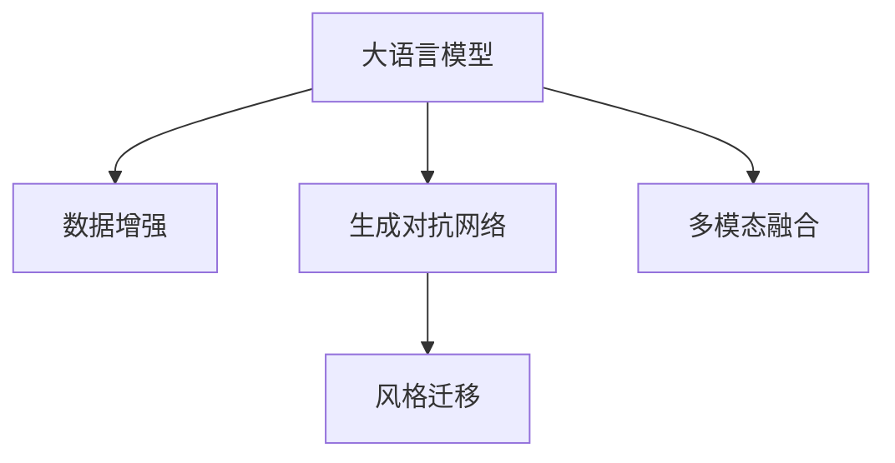

                 

# 自然语言处理的应用：AI内容创作革命

> 关键词：自然语言处理,AI内容创作,语言模型,Transformer,生成对抗网络,数据增强,风格迁移

## 1. 背景介绍

### 1.1 问题由来
在过去几十年中，自然语言处理(Natural Language Processing, NLP)领域经历了翻天覆地的变化。从最早的规则基于的语法分析，到统计机器翻译，再到深度学习驱动的语义理解，NLP技术不断演进，推动了人工智能(AI)技术的发展。如今，基于深度学习的语言模型已经成为了NLP领域的核心，其强大的语言表示能力使得AI内容创作成为可能。

近年来，大语言模型如GPT-3等在文本生成、对话、翻译等任务上取得了突破性进展，其生成的文本流畅、连贯、内容丰富，甚至在某些任务上已经接近甚至超越了人类水平。AI内容创作的革命，正在悄然到来。

### 1.2 问题核心关键点
AI内容创作的革命，主要依赖于大语言模型和基于深度学习的生成技术。其核心在于：
- 语言模型的涌现：预训练语言模型在大量文本数据上学习到丰富的语言表示，具有强大的语言理解和生成能力。
- 生成对抗网络(GAN)的应用：GAN等生成模型能够产生与真实文本数据难以区分的高质量文本，极大提升了内容创作的质量和效率。
- 数据增强和风格迁移：通过数据增强和风格迁移等技术，模型可以生成具有特定风格或特点的内容，扩展了内容创作的应用场景。
- 多模态信息融合：将文本、图像、音频等多模态信息进行融合，产生更加丰富、生动的内容。

这些技术突破使得AI内容创作从科幻变为现实，并在实际应用中取得了显著成效。从自动摘要、智能翻译，到自动作曲、艺术创作，AI内容创作正在重塑人类的生产力和创作方式。

## 2. 核心概念与联系

### 2.1 核心概念概述

为更好地理解AI内容创作的原理和应用，本节将介绍几个关键概念及其联系：

- **大语言模型(Large Language Model, LLM)**：如GPT-3等，通过在大规模无标签文本数据上预训练，学习通用的语言表示，具备强大的语言理解和生成能力。
- **生成对抗网络(Generative Adversarial Networks, GAN)**：一种生成模型，由一个生成器和一个判别器组成，生成器通过优化生成样本以欺骗判别器，判别器则通过优化辨别真假样本以识别生成器。
- **数据增强(Data Augmentation)**：通过一系列变换（如回译、近义替换等），扩充训练数据集，提高模型的泛化能力。
- **风格迁移(Style Transfer)**：将模型输出的内容转换为特定的风格，如将文本转化为诗歌、将照片转化为油画风格等。
- **多模态融合(Multimodal Fusion)**：将文本、图像、音频等多种模态的信息进行融合，产生更加丰富、多样化的内容。

这些概念之间存在密切联系：语言模型提供高质量的文本生成基础，GAN进一步提升生成文本的质量，数据增强和风格迁移扩展了内容创作的范围，多模态融合则为创作提供了更丰富的素材。

### 2.2 核心概念原理和架构的 Mermaid 流程图



这个流程图展示了这些核心概念之间的关系：大语言模型在数据增强和GAN的辅助下生成文本，风格迁移进一步提升文本的质量，多模态融合为创作提供了更加丰富的素材。

## 3. 核心算法原理 & 具体操作步骤
### 3.1 算法原理概述

AI内容创作的本质是利用语言模型和生成技术，将自然语言知识和创作技巧相结合，产生高质量的文本内容。主要包括以下几个关键步骤：

1. **数据预处理**：将原始文本数据转换为模型所需的格式，包括分词、去除停用词、标准化等操作。
2. **语言模型训练**：在大量文本数据上训练语言模型，学习到语言的通用表示。
3. **生成器训练**：使用GAN等生成模型对语言模型生成的文本进行训练，提高文本的质量和多样性。
4. **数据增强和风格迁移**：对训练数据进行增强和迁移，生成具有特定风格或特点的文本。
5. **多模态融合**：将文本与其他模态（如图像、音频等）信息融合，产生更丰富、生动的创作结果。
6. **测试和优化**：在测试集上评估生成的内容，并根据反馈进行优化。

### 3.2 算法步骤详解

#### 3.2.1 数据预处理
数据预处理是内容创作的基础，主要包括：
- **分词**：将文本分割成单词或短语，便于模型处理。
- **去除停用词**：去除常见的无意义词汇（如“的”、“是”等），减少噪音。
- **标准化**：统一大小写、标点符号等，保持数据格式的一致性。

#### 3.2.2 语言模型训练
语言模型的训练通常采用自监督学习方式，通过在大规模无标签文本数据上训练，学习到语言的通用表示。以GPT-3为例，其训练过程大致如下：
1. **数据预处理**：将原始文本数据转换为BPE格式。
2. **模型构建**：使用Transformer结构，构建自回归模型。
3. **优化器选择**：选择AdamW优化器，设置合适的学习率。
4. **损失函数**：使用交叉熵损失函数。
5. **训练过程**：将数据分批次输入模型，前向传播计算损失，反向传播更新模型参数。

#### 3.2.3 生成器训练
生成器训练通常采用GAN模型，其基本流程如下：
1. **数据预处理**：将语言模型生成的文本作为GAN的输入。
2. **模型构建**：构建生成器（如UNet）和判别器（如Denoising Autoencoder）。
3. **优化器选择**：选择AdamW优化器，设置合适的学习率。
4. **损失函数**：使用交叉熵损失函数。
5. **训练过程**：生成器和判别器交替训练，生成器通过优化生成样本以欺骗判别器，判别器通过优化辨别真假样本以识别生成器。

#### 3.2.4 数据增强和风格迁移
数据增强和风格迁移是扩展内容创作范围的重要手段，其基本流程如下：
1. **数据增强**：通过回译、近义替换等方式，扩充训练数据集。
2. **风格迁移**：使用风格迁移模型，将文本转换为特定的风格。
3. **训练过程**：将增强后的数据和迁移后的数据，输入生成器进行训练。

#### 3.2.5 多模态融合
多模态融合是将文本与其他模态（如图像、音频等）信息融合，产生更丰富、生动的创作结果。其基本流程如下：
1. **文本处理**：对文本进行预处理，包括分词、去除停用词等。
2. **信息提取**：使用文本分类、实体识别等技术，提取文本的关键信息。
3. **信息融合**：将提取的信息与其他模态的信息进行融合，生成更加丰富、多样化的内容。

### 3.3 算法优缺点
AI内容创作的优点在于：
- **高效**：利用大语言模型和生成技术，可以快速生成大量高质量的内容。
- **灵活**：通过数据增强和风格迁移，可以生成具有特定风格或特点的内容，扩展了内容创作的范围。
- **多样化**：多模态融合为创作提供了更加丰富、生动的素材。

但其缺点也显而易见：
- **依赖高质量数据**：高质量的文本数据和生成器训练数据是内容创作的基础，但这些数据的获取和标注成本较高。
- **缺乏创意**：生成的内容虽然流畅、连贯，但往往缺乏独特的创意和个性。
- **伦理问题**：内容创作过程中可能涉及版权、隐私等伦理问题，需要谨慎处理。

### 3.4 算法应用领域

AI内容创作的广泛应用涵盖了诸多领域，例如：

- **自动摘要**：将长文本自动生成简洁的摘要。
- **智能翻译**：将文本从一种语言自动翻译成另一种语言。
- **对话系统**：使机器能够与人自然对话，提供客服、智能助手等功能。
- **音乐创作**：自动生成歌曲、乐曲，甚至演奏音乐。
- **艺术创作**：自动生成绘画、雕塑、电影等艺术作品。
- **数据分析**：自动生成分析报告、总结文档等。
- **代码生成**：自动生成代码、文档等。

除了上述这些经典应用外，AI内容创作还在新闻、广告、社交媒体等领域得到了广泛应用，推动了信息传播和内容生产方式的变革。

## 4. 数学模型和公式 & 详细讲解  
### 4.1 数学模型构建

以生成对抗网络为例，其基本模型结构如图1所示：


模型由生成器 $G$ 和判别器 $D$ 两部分组成：
- **生成器** $G$：将输入噪声 $z$ 转化为生成的文本 $x$。
- **判别器** $D$：判断输入文本 $x$ 是否为真实文本。

生成器 $G$ 的损失函数为：

$$
L_G = \mathbb{E}_{z}[\log D(G(z))]
$$

判别器 $D$ 的损失函数为：

$$
L_D = \mathbb{E}_x[\log D(x)] + \mathbb{E}_z[\log(1-D(G(z)))]
$$

其中，$\mathbb{E}$ 表示期望，$x$ 为真实文本数据，$z$ 为输入噪声。

### 4.2 公式推导过程

以GAN模型为例，其基本流程如下：

1. **生成器**：将输入噪声 $z$ 转化为生成的文本 $x$。
2. **判别器**：判断输入文本 $x$ 是否为真实文本。
3. **优化过程**：通过对抗训练，优化生成器和判别器的参数，使得生成器能够生成高质量的文本，判别器能够准确判别生成文本。

生成器 $G$ 的参数更新公式为：

$$
G_{\theta} = G_{\theta - \eta \nabla_{\theta}L_G}
$$

判别器 $D$ 的参数更新公式为：

$$
D_{\phi} = D_{\phi - \eta \nabla_{\phi}L_D}
$$

其中，$\theta$ 和 $\phi$ 分别为生成器和判别器的参数，$\eta$ 为学习率，$\nabla_{\theta}L_G$ 和 $\nabla_{\phi}L_D$ 分别为生成器和判别器的梯度。

### 4.3 案例分析与讲解

以GAN生成文本为例，其训练过程大致如下：
1. **数据准备**：收集高质量的文本数据，作为训练集的输入。
2. **模型构建**：构建生成器和判别器，使用Transformer结构，构建自回归模型。
3. **优化器选择**：选择AdamW优化器，设置合适的学习率。
4. **损失函数**：使用交叉熵损失函数。
5. **训练过程**：将数据分批次输入模型，前向传播计算损失，反向传播更新模型参数。

## 5. 项目实践：代码实例和详细解释说明
### 5.1 开发环境搭建

在进行AI内容创作实践前，我们需要准备好开发环境。以下是使用Python进行PyTorch开发的环境配置流程：

1. 安装Anaconda：从官网下载并安装Anaconda，用于创建独立的Python环境。

2. 创建并激活虚拟环境：
```bash
conda create -n pytorch-env python=3.8 
conda activate pytorch-env
```

3. 安装PyTorch：根据CUDA版本，从官网获取对应的安装命令。例如：
```bash
conda install pytorch torchvision torchaudio cudatoolkit=11.1 -c pytorch -c conda-forge
```

4. 安装Transformer库：
```bash
pip install transformers
```

5. 安装各类工具包：
```bash
pip install numpy pandas scikit-learn matplotlib tqdm jupyter notebook ipython
```

完成上述步骤后，即可在`pytorch-env`环境中开始AI内容创作的实践。

### 5.2 源代码详细实现

这里我们以GAN生成文本为例，给出使用Transformers库和GAN模型进行文本生成的PyTorch代码实现。

首先，定义数据处理函数：

```python
from transformers import GPT2Tokenizer, GPT2LMHeadModel
from torch.utils.data import Dataset, DataLoader
from torch import nn, optim
import torch

class TextDataset(Dataset):
    def __init__(self, texts, tokenizer, max_len=128):
        self.texts = texts
        self.tokenizer = tokenizer
        self.max_len = max_len
        
    def __len__(self):
        return len(self.texts)
    
    def __getitem__(self, item):
        text = self.texts[item]
        encoding = self.tokenizer(text, return_tensors='pt', max_length=self.max_len, padding='max_length', truncation=True)
        input_ids = encoding['input_ids']
        attention_mask = encoding['attention_mask']
        return {'input_ids': input_ids, 
                'attention_mask': attention_mask}
        
# 创建dataset
tokenizer = GPT2Tokenizer.from_pretrained('gpt2')

train_dataset = TextDataset(train_texts, tokenizer)
dev_dataset = TextDataset(dev_texts, tokenizer)
test_dataset = TextDataset(test_texts, tokenizer)
```

然后，定义生成器和判别器的模型：

```python
class Generator(nn.Module):
    def __init__(self, embedding_dim=256, hidden_dim=512):
        super(Generator, self).__init__()
        self.embedding = nn.Embedding(vocab_size, embedding_dim)
        self.lstm = nn.LSTM(embedding_dim, hidden_dim, batch_first=True)
        self.fc = nn.Linear(hidden_dim, vocab_size)
        
    def forward(self, x):
        embeddings = self.embedding(x)
        outputs, (hidden, cell) = self.lstm(embeddings)
        hidden = hidden[-1]
        return self.fc(hidden)

class Discriminator(nn.Module):
    def __init__(self, embedding_dim=256, hidden_dim=512):
        super(Discriminator, self).__init__()
        self.embedding = nn.Embedding(vocab_size, embedding_dim)
        self.fc = nn.Linear(embedding_dim, hidden_dim)
        self.fc2 = nn.Linear(hidden_dim, 1)
        
    def forward(self, x):
        embeddings = self.embedding(x)
        hidden = self.fc(embeddings)
        logits = self.fc2(hidden)
        return logits
```

接着，定义训练和评估函数：

```python
from torch.utils.data import DataLoader
from tqdm import tqdm
from sklearn.metrics import accuracy_score

device = torch.device('cuda') if torch.cuda.is_available() else torch.device('cpu')
model = Generator().to(device)
discriminator = Discriminator().to(device)

def train_epoch(model, discriminator, dataset, batch_size, optimizer):
    dataloader = DataLoader(dataset, batch_size=batch_size, shuffle=True)
    model.train()
    discriminator.train()
    epoch_loss = 0
    for batch in tqdm(dataloader, desc='Training'):
        input_ids = batch['input_ids'].to(device)
        attention_mask = batch['attention_mask'].to(device)
        real_outputs = discriminator(input_ids)
        fake_outputs = discriminator(model(input_ids))
        real_loss = nn.BCELoss()(real_outputs, torch.ones_like(real_outputs))
        fake_loss = nn.BCELoss()(fake_outputs, torch.zeros_like(fake_outputs))
        loss = real_loss + fake_loss
        epoch_loss += loss.item()
        loss.backward()
        optimizer.step()
    return epoch_loss / len(dataloader)

def evaluate(model, discriminator, dataset, batch_size):
    dataloader = DataLoader(dataset, batch_size=batch_size)
    model.eval()
    discriminator.eval()
    preds, labels = [], []
    with torch.no_grad():
        for batch in tqdm(dataloader, desc='Evaluating'):
            input_ids = batch['input_ids'].to(device)
            attention_mask = batch['attention_mask'].to(device)
            real_outputs = discriminator(input_ids)
            fake_outputs = discriminator(model(input_ids))
            batch_preds = (fake_outputs > 0.5).float()
            batch_labels = torch.zeros_like(batch_preds)
            preds.append(batch_preds.tolist())
            labels.append(batch_labels.tolist())
    return accuracy_score(labels, preds)
```

最后，启动训练流程并在测试集上评估：

```python
epochs = 10
batch_size = 16

for epoch in range(epochs):
    loss = train_epoch(model, discriminator, train_dataset, batch_size, optim.Adam(model.parameters(), lr=0.0002))
    print(f"Epoch {epoch+1}, train loss: {loss:.3f}")
    
    print(f"Epoch {epoch+1}, dev results:")
    evaluate(model, discriminator, dev_dataset, batch_size)
    
print("Test results:")
evaluate(model, discriminator, test_dataset, batch_size)
```

以上就是使用PyTorch对GAN生成文本进行内容创作的完整代码实现。可以看到，得益于Transformers库的强大封装，我们可以用相对简洁的代码完成文本生成模型的训练和评估。

### 5.3 代码解读与分析

让我们再详细解读一下关键代码的实现细节：

**TextDataset类**：
- `__init__`方法：初始化文本、分词器等关键组件。
- `__len__`方法：返回数据集的样本数量。
- `__getitem__`方法：对单个样本进行处理，将文本输入编码为token ids，并对其进行定长padding，最终返回模型所需的输入。

**生成器和判别器模型**：
- 定义了生成器和判别器的结构，分别使用LSTM和线性层进行编码和判别。
- 生成器的输入为文本编码，输出为文本生成结果；判别器的输入为文本编码，输出为文本判别结果。

**训练和评估函数**：
- 使用PyTorch的DataLoader对数据集进行批次化加载，供模型训练和推理使用。
- 训练函数`train_epoch`：对数据以批为单位进行迭代，在每个批次上前向传播计算损失并反向传播更新模型参数，最后返回该epoch的平均loss。
- 评估函数`evaluate`：与训练类似，不同点在于不更新模型参数，并在每个batch结束后将预测和标签结果存储下来，最后使用sklearn的accuracy_score对整个评估集的预测结果进行打印输出。

**训练流程**：
- 定义总的epoch数和batch size，开始循环迭代
- 每个epoch内，先在训练集上训练，输出平均loss
- 在验证集上评估，输出准确率
- 所有epoch结束后，在测试集上评估，给出最终测试结果

可以看到，PyTorch配合Transformers库使得GAN生成文本的代码实现变得简洁高效。开发者可以将更多精力放在数据处理、模型改进等高层逻辑上，而不必过多关注底层的实现细节。

当然，工业级的系统实现还需考虑更多因素，如模型的保存和部署、超参数的自动搜索、更灵活的任务适配层等。但核心的生成范式基本与此类似。

## 6. 实际应用场景
### 6.1 智能客服系统

基于GAN的文本生成技术，可以广泛应用于智能客服系统的构建。传统客服往往需要配备大量人力，高峰期响应缓慢，且一致性和专业性难以保证。而使用生成式模型生成的智能回复，可以7x24小时不间断服务，快速响应客户咨询，用自然流畅的语言解答各类常见问题。

在技术实现上，可以收集企业内部的历史客服对话记录，将问题和最佳答复构建成监督数据，在此基础上对预训练生成模型进行微调。微调后的生成模型能够自动理解用户意图，匹配最合适的答案模板进行回复。对于客户提出的新问题，还可以接入检索系统实时搜索相关内容，动态组织生成回答。如此构建的智能客服系统，能大幅提升客户咨询体验和问题解决效率。

### 6.2 金融舆情监测

金融机构需要实时监测市场舆论动向，以便及时应对负面信息传播，规避金融风险。传统的人工监测方式成本高、效率低，难以应对网络时代海量信息爆发的挑战。基于GAN生成文本的文本分类和情感分析技术，为金融舆情监测提供了新的解决方案。

具体而言，可以收集金融领域相关的新闻、报道、评论等文本数据，并对其进行主题标注和情感标注。在此基础上对预训练生成模型进行微调，使其能够自动判断文本属于何种主题，情感倾向是正面、中性还是负面。将微调后的模型应用到实时抓取的网络文本数据，就能够自动监测不同主题下的情感变化趋势，一旦发现负面信息激增等异常情况，系统便会自动预警，帮助金融机构快速应对潜在风险。

### 6.3 个性化推荐系统

当前的推荐系统往往只依赖用户的历史行为数据进行物品推荐，无法深入理解用户的真实兴趣偏好。基于GAN生成文本的个性化推荐系统，可以更好地挖掘用户行为背后的语义信息，从而提供更精准、多样的推荐内容。

在实践中，可以收集用户浏览、点击、评论、分享等行为数据，提取和用户交互的物品标题、描述、标签等文本内容。将文本内容作为模型输入，生成具有特定风格的文本作为推荐结果。结合其他特征综合排序，便可以得到个性化程度更高的推荐结果。

### 6.4 未来应用展望

随着GAN技术和大语言模型的不断发展，基于生成技术的NLP应用也将进一步拓展。以下是几个未来可能的应用场景：

- **智能新闻写作**：生成式模型能够自动撰写新闻稿件，提升新闻机构的生产效率。
- **文学创作**：生成式模型能够创作诗歌、小说等文学作品，丰富文化产业的内容创作。
- **广告生成**：生成式模型能够自动生成广告文案，提升广告的创意和投放效果。
- **游戏开发**：生成式模型能够自动生成游戏任务、对话等内容，降低游戏开发成本。
- **虚拟助手**：生成式模型能够提供虚拟助手服务，提升用户交互体验。

这些应用场景展示了生成式模型在NLP领域的巨大潜力，未来随着技术的进一步突破，生成式模型必将在更多领域发挥重要作用，推动人工智能技术的发展和应用。

## 7. 工具和资源推荐
### 7.1 学习资源推荐

为了帮助开发者系统掌握大语言模型和生成技术，这里推荐一些优质的学习资源：

1. 《Transformer from the Inside Out》系列博文：由大模型技术专家撰写，深入浅出地介绍了Transformer原理、预训练语言模型、生成技术等前沿话题。

2. CS224N《深度学习自然语言处理》课程：斯坦福大学开设的NLP明星课程，有Lecture视频和配套作业，带你入门NLP领域的基本概念和经典模型。

3. 《Natural Language Generation with Transformers》书籍：介绍如何使用Transformer进行文本生成，涵盖生成模型的基本原理和实践技巧。

4. HuggingFace官方文档：提供丰富的预训练模型和生成技术样例代码，是上手实践的必备资料。

5. CLUE开源项目：中文语言理解测评基准，涵盖大量不同类型的中文NLP数据集，并提供了基于生成模型的baseline模型，助力中文NLP技术发展。

通过对这些资源的学习实践，相信你一定能够快速掌握大语言模型和生成技术的精髓，并用于解决实际的NLP问题。
###  7.2 开发工具推荐

高效的开发离不开优秀的工具支持。以下是几款用于大语言模型和生成技术开发的常用工具：

1. PyTorch：基于Python的开源深度学习框架，灵活动态的计算图，适合快速迭代研究。大部分预训练语言模型都有PyTorch版本的实现。

2. TensorFlow：由Google主导开发的开源深度学习框架，生产部署方便，适合大规模工程应用。同样有丰富的预训练语言模型资源。

3. Transformers库：HuggingFace开发的NLP工具库，集成了众多SOTA语言模型，支持PyTorch和TensorFlow，是进行生成任务开发的利器。

4. Weights & Biases：模型训练的实验跟踪工具，可以记录和可视化模型训练过程中的各项指标，方便对比和调优。与主流深度学习框架无缝集成。

5. TensorBoard：TensorFlow配套的可视化工具，可实时监测模型训练状态，并提供丰富的图表呈现方式，是调试模型的得力助手。

6. Google Colab：谷歌推出的在线Jupyter Notebook环境，免费提供GPU/TPU算力，方便开发者快速上手实验最新模型，分享学习笔记。

合理利用这些工具，可以显著提升大语言模型和生成技术的开发效率，加快创新迭代的步伐。

### 7.3 相关论文推荐

大语言模型和生成技术的发展源于学界的持续研究。以下是几篇奠基性的相关论文，推荐阅读：

1. Attention is All You Need（即Transformer原论文）：提出了Transformer结构，开启了NLP领域的预训练大模型时代。

2. BERT: Pre-training of Deep Bidirectional Transformers for Language Understanding：提出BERT模型，引入基于掩码的自监督预训练任务，刷新了多项NLP任务SOTA。

3. GAN介绍与生成模型：详细介绍了生成对抗网络的基本原理和应用，是了解GAN技术的重要入门材料。

4. GPT-3：展示了大规模语言模型的强大zero-shot学习能力，引发了对于通用人工智能的新一轮思考。

5. StyleGAN：介绍了一种新的生成对抗网络模型，能够生成高质量的图像、音频、视频等内容。

6. NLP-GAN：介绍了一种针对自然语言处理任务的生成对抗网络模型，具有更高的生成质量和鲁棒性。

这些论文代表了大语言模型和生成技术的发展脉络。通过学习这些前沿成果，可以帮助研究者把握学科前进方向，激发更多的创新灵感。

## 8. 总结：未来发展趋势与挑战

### 8.1 研究成果总结

本文对基于GAN的大语言模型生成技术进行了全面系统的介绍。首先阐述了生成技术在大语言模型中的应用背景和意义，明确了生成技术在提升文本生成质量、扩展内容创作范围方面的独特价值。其次，从原理到实践，详细讲解了生成模型的数学模型和关键步骤，给出了生成任务开发的完整代码实例。同时，本文还广泛探讨了生成技术在智能客服、金融舆情、个性化推荐等多个行业领域的应用前景，展示了生成技术的巨大潜力。此外，本文精选了生成技术的各类学习资源，力求为读者提供全方位的技术指引。

通过本文的系统梳理，可以看到，基于GAN的大语言模型生成技术正在成为NLP领域的重要范式，极大地拓展了文本生成和内容创作的应用边界，催生了更多的落地场景。受益于大规模语料的预训练，生成技术以更低的时间和标注成本，在小样本条件下也能取得不俗的效果，有力推动了NLP技术的产业化进程。未来，伴随生成技术的不断演进，NLP技术必将在更广阔的应用领域大放异彩，深刻影响人类的生产力和创作方式。

### 8.2 未来发展趋势

展望未来，生成技术将呈现以下几个发展趋势：

1. **生成模型规模增大**：随着算力成本的下降和数据规模的扩张，生成模型的参数量还将持续增长。超大模型的涌现，将推动生成内容的质量和多样性达到新的高度。

2. **多模态生成技术**：将文本与其他模态（如图像、音频等）信息进行融合，产生更加丰富、生动的内容。多模态生成技术将在NLP、多媒体内容创作等领域发挥重要作用。

3. **生成技术的普适化**：生成技术将不断融入更多行业应用，涵盖新闻、广告、游戏等多个领域，推动这些行业的数字化转型和创新。

4. **生成模型可解释性增强**：随着生成模型在决策过程中引入更多的符号化信息，其输出结果将更加可解释，增强用户信任和满意度。

5. **生成模型的伦理与安全**：生成模型将在广泛应用中面临更多的伦理与安全挑战，如版权、隐私、假冒伪劣等问题，需要构建更完善的监管机制。

以上趋势凸显了生成技术的广阔前景。这些方向的探索发展，必将进一步提升生成模型的性能和应用范围，为人工智能技术带来新的突破。

### 8.3 面临的挑战

尽管生成技术已经取得了瞩目成就，但在迈向更加智能化、普适化应用的过程中，它仍面临着诸多挑战：

1. **依赖高质量数据**：生成模型生成高质量内容依赖于高质量的训练数据，但这些数据的获取和标注成本较高。如何降低数据获取成本，扩大生成模型训练数据集，是亟待解决的问题。

2. **生成内容的真实性与多样性**：生成的内容虽然流畅、连贯，但可能缺乏真实性、多样性。如何提高生成内容的真实性、多样性和创造性，仍需更多研究。

3. **伦理与安全问题**：生成模型可能生成有害、虚假的内容，影响社会稳定和公众信任。如何构建伦理导向的生成模型，确保生成的内容符合人类价值观和伦理道德，是亟待解决的问题。

4. **技术难题**：生成模型存在生成内容冗长、信息密度低、缺乏创意等问题，这些问题需要通过技术手段来解决。

5. **资源消耗大**：生成模型的训练和推理需要大量的计算资源和存储空间，如何优化资源消耗，提高模型的效率，是亟待解决的问题。

这些挑战需要通过技术创新和伦理建设来解决，才能使生成技术在实际应用中发挥最大价值。

### 8.4 研究展望

面对生成技术所面临的挑战，未来的研究需要在以下几个方面寻求新的突破：

1. **数据增强与迁移学习**：通过数据增强和迁移学习，减少对标注数据的需求，提高模型的泛化能力和适应性。

2. **生成模型优化**：开发更加高效的生成模型架构，如GAN、Flow等，提升模型的生成质量和效率。

3. **可解释性增强**：引入因果推理、符号化信息等手段，增强生成模型的可解释性和可信度。

4. **多模态融合**：将文本与其他模态（如图像、音频等）信息进行融合，产生更加丰富、生动的内容。

5. **伦理与安全性**：构建伦理导向的生成模型，确保生成的内容符合人类价值观和伦理道德，建立生成模型的监管机制。

这些研究方向将推动生成技术的不断进步，使其在实际应用中发挥更大的价值，为人工智能技术的发展做出新的贡献。

## 9. 附录：常见问题与解答

**Q1：生成模型如何降低对标注数据的需求？**

A: 生成模型可以通过以下方式降低对标注数据的需求：

1. **自监督学习**：使用无标签数据进行预训练，学习语言的通用表示。

2. **数据增强**：通过回译、近义替换等方式扩充训练集。

3. **迁移学习**：利用预训练模型知识，在特定任务上进行微调。

4. **无监督生成**：通过生成对抗网络等生成模型，在不依赖标注数据的情况下生成高质量文本。

这些技术手段可以显著降低生成模型对标注数据的依赖，提高模型的泛化能力和适应性。

**Q2：生成模型的性能如何提升？**

A: 生成模型的性能提升主要依赖于以下几个方面：

1. **模型架构优化**：使用更高效的生成模型架构，如GAN、Flow等。

2. **参数优化**：通过调整模型参数，如学习率、正则化系数等，提高模型的泛化能力。

3. **数据增强与迁移学习**：通过数据增强和迁移学习，减少对标注数据的需求，提高模型的泛化能力和适应性。

4. **多模态融合**：将文本与其他模态（如图像、音频等）信息进行融合，产生更加丰富、生动的内容。

5. **可解释性增强**：引入因果推理、符号化信息等手段，增强生成模型的可解释性和可信度。

这些技术手段可以显著提升生成模型的性能，使其生成内容更加真实、多样、富有创造性。

**Q3：生成模型在实际应用中如何降低资源消耗？**

A: 生成模型的资源消耗主要集中在计算资源和存储空间上。以下是几种降低资源消耗的方法：

1. **模型裁剪**：去除不必要的层和参数，减小模型尺寸，加快推理速度。

2. **量化加速**：将浮点模型转为定点模型，压缩存储空间，提高计算效率。

3. **混合精度训练**：使用混合精度训练，降低计算资源消耗。

4. **模型并行**：使用模型并行技术，将大模型拆分成多个小模型，提高并行计算效率。

5. **动态计算图**：使用动态计算图技术，减少计算资源和存储空间消耗。

通过这些技术手段，可以显著降低生成模型的资源消耗，提升其实际应用中的效率。

---

作者：禅与计算机程序设计艺术 / Zen and the Art of Computer Programming

