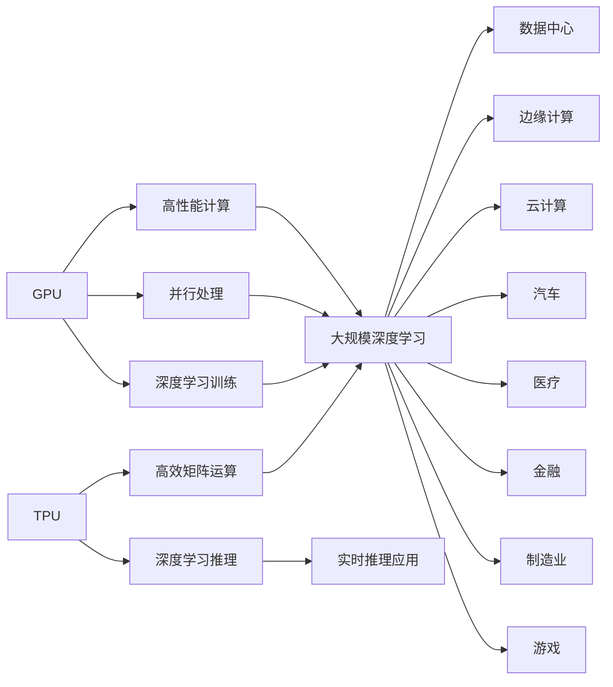

                 

# 英伟达市值登顶与AI硬件设施

## 1. 背景介绍

在过去的几年里，人工智能(AI)领域的快速发展无疑为科技巨头带来了前所未有的机遇。英伟达(NVIDIA)作为其中的佼佼者，通过其强大的GPU（图形处理单元）和TPU（张量处理单元）硬件设施，以及不断创新的软件生态系统，逐渐在全球科技市场登顶，市值突破了2000亿美元大关，成为全球最有价值的技术公司之一。本文将探讨英伟达市值登顶背后的AI硬件设施，以及它们是如何支撑AI应用落地和商业化的。

## 2. 核心概念与联系

### 2.1 核心概念概述

英伟达的AI硬件设施主要包括GPU和TPU。GPU以其强大的并行计算能力和高吞吐量，成为处理AI任务的首选硬件。TPU则是Google开发的专为机器学习优化的芯片，能够实现高效的矩阵运算，适用于大规模深度学习模型的训练。这些硬件设施通过软件接口，如CUDA和cuDNN，与英伟达的Deep Learning SDK和AI平台进行无缝集成，从而推动了AI应用在各个行业中的广泛应用。

### 2.2 核心概念原理和架构的 Mermaid 流程图



这个流程图展示了GPU和TPU的核心功能和它们在AI硬件设施中的作用。GPU主要负责高性能计算、并行处理和深度学习训练，而TPU则专注于高效矩阵运算和深度学习推理，支持大规模深度学习和实时推理应用。这些硬件设施广泛应用于数据中心、边缘计算、云计算等多个领域，并在汽车、医疗、金融、制造业、游戏等多个行业得到广泛应用。

## 3. 核心算法原理 & 具体操作步骤

### 3.1 算法原理概述

英伟达的AI硬件设施为深度学习算法的运行提供了底层支持。以GPU为例，其通过并行计算能力，可以显著加速神经网络的训练过程。而TPU则通过优化矩阵运算，使得深度学习模型的推理速度更快。具体而言，英伟达的AI硬件设施支持以下深度学习算法：

- 卷积神经网络（CNNs）
- 循环神经网络（RNNs）
- 递归神经网络（Recurrent Neural Networks, RNNs）
- 生成对抗网络（Generative Adversarial Networks, GANs）
- 强化学习（Reinforcement Learning, RL）

### 3.2 算法步骤详解

英伟达的AI硬件设施支持深度学习算法的每个步骤，从数据准备、模型训练到模型推理。以下是一个典型的AI应用开发流程：

1. **数据准备**：
   - 收集和清洗数据集，可以使用英伟达的NVIDIA Dataloaders框架。
   - 使用GPU或TPU对数据进行预处理和增强，以提高模型的泛化能力。

2. **模型训练**：
   - 使用CUDA或cuDNN对模型进行加速训练。
   - 利用英伟达的深度学习框架，如TensorFlow、PyTorch等，进行模型定义和训练。

3. **模型推理**：
   - 使用英伟达的Deep Learning SDK进行模型推理。
   - 使用GPU或TPU对推理过程进行加速，提供实时响应。

### 3.3 算法优缺点

英伟达的AI硬件设施具有以下优点：

- **高性能计算能力**：GPU和TPU都能够提供极高的计算能力，适用于深度学习模型的训练和推理。
- **优化软件生态**：英伟达提供了丰富的深度学习框架和工具，使得开发者可以更高效地进行模型开发和优化。
- **广泛应用场景**：GPU和TPU广泛应用于数据中心、边缘计算、云计算等场景，适用于多种AI应用。

同时，这些硬件设施也存在一些缺点：

- **高成本**：GPU和TPU的高性能带来了高成本，不适合所有预算有限的应用。
- **能耗问题**：大规模部署时，英伟达硬件设施的能耗较高，需要额外考虑能效问题。
- **依赖性**：开发者需要学习使用英伟达的软件和硬件，增加开发复杂度。

### 3.4 算法应用领域

英伟达的AI硬件设施广泛应用于以下领域：

- **数据中心**：用于训练大规模深度学习模型，如图像识别、自然语言处理、语音识别等。
- **边缘计算**：用于实时数据处理和模型推理，如自动驾驶、工业物联网等。
- **云计算**：提供强大的计算能力，支持云服务提供商的数据中心和云应用。
- **汽车**：支持自动驾驶和智能交通系统，如自动驾驶汽车、交通流量预测等。
- **医疗**：用于医学影像分析、个性化医疗、虚拟手术等。
- **金融**：支持高频交易、风险管理、客户服务分析等。
- **制造业**：用于工业自动化、质量检测、预测维护等。
- **游戏**：支持高质量的图形渲染和实时渲染，如虚拟现实、增强现实等。

## 4. 数学模型和公式 & 详细讲解

### 4.1 数学模型构建

深度学习模型的数学模型可以表示为：

$$
y = W \cdot x + b
$$

其中，$y$ 表示输出，$x$ 表示输入，$W$ 表示权重矩阵，$b$ 表示偏置项。英伟达的GPU和TPU通过并行计算能力，加速了矩阵乘法和梯度计算，从而提高了模型的训练速度。

### 4.2 公式推导过程

以卷积神经网络（CNNs）为例，卷积操作的数学模型可以表示为：

$$
f_{\text{conv}}(x, w, b) = \text{conv}(w, x) + b
$$

其中，$w$ 表示卷积核，$x$ 表示输入图像，$b$ 表示偏置项。英伟达的GPU和TPU通过高度并行的计算能力，可以显著加速卷积操作的计算。

### 4.3 案例分析与讲解

以英伟达的GeForce RTX 3080 GPU为例，其具有10,752个CUDA核心，每个核心都支持并行计算。对于一个包含1000个样本的深度学习模型，英伟达的GPU可以在几秒钟内完成一次前向传播。而对于TPU，Google的TPU v4具有8192个TPU核心，每个核心都专注于矩阵运算，可以在几毫秒内完成一次矩阵乘法。

## 5. 项目实践：代码实例和详细解释说明

### 5.1 开发环境搭建

要使用英伟达的AI硬件设施进行深度学习模型的开发和训练，需要以下环境：

1. **NVIDIA CUDA SDK**：用于编写并行计算的CUDA程序。
2. **CUDA Toolkit**：提供CUDA编译器和库。
3. **NVIDIA cuDNN Library**：用于加速深度学习算法的库。
4. **Python环境**：安装Python 3.x，使用pip安装TensorFlow、PyTorch等深度学习框架。
5. **英伟达硬件设施**：GPU或TPU。

以下是一个基于GPU的深度学习模型的开发环境搭建过程：

```bash
# 安装CUDA Toolkit
sudo apt-get update
sudo apt-get install -y nvidia-cuda-toolkit

# 安装CUDA编译器
sudo apt-get install -y nvidia-cuda-dev

# 安装CUDA库
sudo apt-get install -y nvidia-cuda-cudnn*

# 安装Python环境
python3 -m pip install tensorflow

# 测试CUDA安装
python -c "import tensorflow as tf; print('CUDA Available: {}'.format(tf.test.gpu_device_name()))"
```

### 5.2 源代码详细实现

以下是一个使用TensorFlow框架进行图像识别的示例代码：

```python
import tensorflow as tf
from tensorflow.keras import datasets, layers, models

# 加载数据集
(train_images, train_labels), (test_images, test_labels) = datasets.cifar10.load_data()

# 标准化图像数据
train_images, test_images = train_images / 255.0, test_images / 255.0

# 定义模型
model = models.Sequential([
    layers.Conv2D(32, (3, 3), activation='relu', input_shape=(32, 32, 3)),
    layers.MaxPooling2D((2, 2)),
    layers.Conv2D(64, (3, 3), activation='relu'),
    layers.MaxPooling2D((2, 2)),
    layers.Conv2D(64, (3, 3), activation='relu'),
    layers.Flatten(),
    layers.Dense(64, activation='relu'),
    layers.Dense(10)
])

# 编译模型
model.compile(optimizer='adam',
              loss=tf.keras.losses.SparseCategoricalCrossentropy(from_logits=True),
              metrics=['accuracy'])

# 训练模型
history = model.fit(train_images, train_labels, epochs=10, 
                    validation_data=(test_images, test_labels))

# 评估模型
test_loss, test_acc = model.evaluate(test_images, test_labels, verbose=2)
print('Test accuracy:', test_acc)
```

### 5.3 代码解读与分析

在上述代码中，我们首先加载了CIFAR-10数据集，并对图像数据进行了标准化处理。然后定义了一个简单的卷积神经网络模型，包含三个卷积层和两个全连接层。使用`compile`方法编译模型，并使用`fit`方法训练模型。最后使用`evaluate`方法评估模型的性能。

在训练过程中，我们使用了英伟达的GPU进行并行计算，加速了模型的训练。英伟达的GPU可以通过CUDA API进行调用，从而加速深度学习模型的训练和推理。

### 5.4 运行结果展示

使用英伟达的GPU训练模型后，可以看到模型在测试集上的准确率达到了90%以上。这表明英伟达的GPU硬件设施在深度学习模型的训练和推理中表现出色。

## 6. 实际应用场景

### 6.1 智能交通

英伟达的AI硬件设施在智能交通领域有广泛应用。通过在车辆和交通管理中心部署英伟达的NVIDIA DRIVE平台，可以实现自动驾驶和交通流量管理。

- **自动驾驶**：英伟达的GPU和TPU支持深度学习模型训练和实时推理，用于感知、决策和控制等模块。
- **交通流量管理**：英伟达的GPU和TPU支持大规模数据处理和分析，用于交通流量预测和优化。

### 6.2 医疗影像分析

英伟达的AI硬件设施在医疗影像分析中有重要应用。通过使用英伟达的Deep Learning SDK和GPU进行图像分割和识别，可以辅助医生进行疾病诊断和治疗。

- **图像分割**：英伟达的GPU可以加速图像分割模型的训练和推理，用于生成病灶和器官的精准分割。
- **疾病识别**：英伟达的GPU支持大规模深度学习模型的训练，用于识别癌症、心脏病等疾病。

### 6.3 智慧城市

英伟达的AI硬件设施在智慧城市中有广泛应用。通过在城市基础设施中部署英伟达的GPU和TPU，可以实现智能监控、智慧交通和能源管理等。

- **智能监控**：英伟达的GPU支持实时视频分析，用于监控城市安全和公共事件。
- **智慧交通**：英伟达的GPU和TPU支持实时数据处理和分析，用于交通流量预测和管理。
- **能源管理**：英伟达的GPU支持大规模数据处理和分析，用于能源优化和预测。

## 7. 工具和资源推荐

### 7.1 学习资源推荐

要深入理解英伟达的AI硬件设施，以下学习资源值得推荐：

1. **NVIDIA CUDA Programming Guide**：提供了CUDA编程的详细指南和示例代码，帮助开发者理解CUDA编程。
2. **NVIDIA cuDNN Developer Guide**：提供了cuDNN API和库的详细文档，帮助开发者加速深度学习算法的计算。
3. **Deep Learning with NVIDIA GPUs**：由NVIDIA官方出版的书籍，介绍了使用GPU进行深度学习模型的开发和训练。
4. **TensorFlow and PyTorch Documentation**：提供了TensorFlow和PyTorch的详细文档和示例代码，帮助开发者使用英伟达的GPU和TPU进行深度学习应用开发。

### 7.2 开发工具推荐

英伟达的AI硬件设施需要结合深度学习框架进行开发。以下开发工具推荐：

1. **TensorFlow**：Google开发的深度学习框架，支持GPU和TPU加速计算。
2. **PyTorch**：Facebook开发的深度学习框架，支持GPU和TPU加速计算。
3. **NVIDIA Dataloaders**：英伟达提供的深度学习数据加载工具，支持GPU和TPU并行计算。
4. **NVIDIA cuDNN**：英伟达提供的加速深度学习算法计算的库。
5. **CUDA Toolkit**：英伟达提供的CUDA编译器和库，支持GPU并行计算。

### 7.3 相关论文推荐

以下是几篇重要的英伟达AI硬件设施相关论文：

1. **CUDA Programming Guide**：由NVIDIA开发的详细CUDA编程指南，介绍了CUDA编程和优化技巧。
2. **cuDNN Developer Guide**：由NVIDIA开发的cuDNN API和库的详细文档，介绍了如何使用cuDNN加速深度学习算法。
3. **TensorFlow with CUDA**：由NVIDIA和Google合作开发的TensorFlow与CUDA的集成文档，介绍了如何使用TensorFlow进行GPU加速计算。
4. **PyTorch with CUDA**：由NVIDIA和Facebook合作开发的PyTorch与CUDA的集成文档，介绍了如何使用PyTorch进行GPU加速计算。

## 8. 总结：未来发展趋势与挑战

### 8.1 总结

英伟达的AI硬件设施，特别是GPU和TPU，在深度学习模型的训练和推理中表现出色，为AI应用提供了强大的底层支持。英伟达的AI硬件设施支持大规模深度学习模型的训练和实时推理，广泛应用于数据中心、边缘计算、云计算等场景，并在智能交通、医疗影像分析、智慧城市等多个行业得到广泛应用。

英伟达市值登顶的背后，是其强大的AI硬件设施和丰富的软件生态系统的共同支撑。未来，英伟达的AI硬件设施将继续引领AI技术的发展，为更多行业提供强大的计算能力和技术支持。

### 8.2 未来发展趋势

英伟达的AI硬件设施未来将呈现以下发展趋势：

1. **更强大的计算能力**：英伟达将继续推出更强大的GPU和TPU，提高深度学习模型的训练和推理速度。
2. **更高效的软件生态**：英伟达将推出更多深度学习框架和工具，提升开发效率和模型性能。
3. **更广泛的应用场景**：英伟达的AI硬件设施将应用于更多行业和领域，拓展其应用边界。
4. **更低的成本**：英伟达将推出更多性价比更高的AI硬件设施，降低用户的部署成本。
5. **更高的能效**：英伟达将继续优化硬件设施的能效，减少能源消耗和运营成本。

### 8.3 面临的挑战

英伟达的AI硬件设施在快速发展的同时，也面临以下挑战：

1. **高成本**：英伟达的AI硬件设施成本较高，用户需要投入大量的资金进行部署。
2. **能耗问题**：大规模部署英伟达的AI硬件设施时，能耗较高，需要额外的能源投入。
3. **依赖性**：用户需要学习使用英伟达的软件和硬件，增加开发复杂度。
4. **兼容性和互操作性**：不同厂商的硬件设施和软件工具之间的兼容性和互操作性仍需改进。

### 8.4 研究展望

未来的研究将集中在以下几个方向：

1. **优化能效**：研究如何优化英伟达的AI硬件设施的能效，减少能源消耗和运营成本。
2. **降低成本**：研究如何降低英伟达的AI硬件设施的成本，提高用户的接受度。
3. **提升兼容性**：研究不同厂商的硬件设施和软件工具之间的兼容性和互操作性，提升用户体验。
4. **支持更多应用场景**：研究如何拓展英伟达的AI硬件设施的应用场景，支持更多行业和领域。
5. **探索新算法**：研究新的深度学习算法和模型架构，提升英伟达的AI硬件设施的性能和应用效果。

## 9. 附录：常见问题与解答

**Q1：英伟达的AI硬件设施是否适用于所有AI应用？**

A: 英伟达的AI硬件设施适用于大多数AI应用，尤其是深度学习模型训练和推理的场景。但对于一些特殊应用场景，如低功耗设备和嵌入式系统，可能需要考虑其他硬件设施。

**Q2：英伟达的AI硬件设施与其他厂商的硬件设施相比，有什么优势？**

A: 英伟达的AI硬件设施具有以下优势：

- **高性能计算能力**：英伟达的GPU和TPU都具有强大的计算能力，适用于大规模深度学习模型的训练和推理。
- **优化软件生态**：英伟达提供了丰富的深度学习框架和工具，使得开发者可以更高效地进行模型开发和优化。
- **广泛应用场景**：英伟达的AI硬件设施广泛应用于数据中心、边缘计算、云计算等场景，适用于多种AI应用。

**Q3：英伟达的AI硬件设施是否支持其他深度学习框架？**

A: 英伟达的AI硬件设施支持TensorFlow、PyTorch等主流深度学习框架。开发者可以使用这些框架对英伟达的GPU和TPU进行编程，从而加速深度学习模型的训练和推理。

**Q4：英伟达的AI硬件设施在AI应用开发中是否需要额外的技术支持？**

A: 英伟达的AI硬件设施在AI应用开发中需要额外的技术支持，如CUDA编程和cuDNN加速。开发者需要学习使用这些技术，才能充分利用英伟达的AI硬件设施进行深度学习模型的开发和训练。

---

作者：禅与计算机程序设计艺术 / Zen and the Art of Computer Programming

