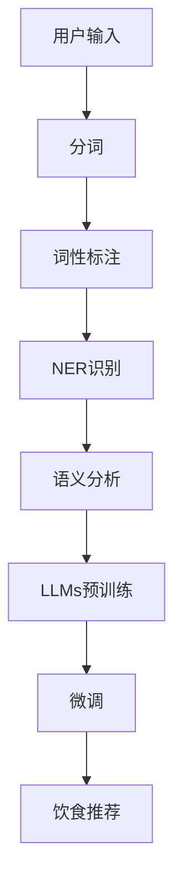

                 

## 1. 背景介绍

随着人工智能技术的快速发展，大语言模型(LLMs)在营养学领域的应用日益受到关注。个性化饮食计划是营养学的核心任务之一，其目标是基于用户的身体数据和饮食习惯，提供量身定制的饮食建议。传统上，这需要营养师进行详细咨询和评估，但由于人力成本高、效率低，难以满足个性化需求。

基于大语言模型的个性化饮食计划方案，可以充分利用自然语言处理(NLP)和机器学习的优势，通过简单的用户输入，自动生成个性化的饮食建议。本文将探讨如何使用大语言模型实现这一目标，包括模型选择、数据准备、微调方法、应用场景等。

## 2. 核心概念与联系

### 2.1 核心概念概述

本节将介绍实现个性化饮食计划所需的关键技术概念：

- 大语言模型(LLMs)：以自回归(如GPT)或自编码(如BERT)为代表的语言模型，通过在大规模文本数据上进行预训练，学习语言规律，具备强大的语言生成能力。
- 预训练和微调：预训练模型通过在大规模无标签数据上自监督学习任务获得语言知识，微调通过下游任务的少量标签数据进行有监督学习，进一步优化模型性能。
- 自然语言处理(NLP)：包括分词、词性标注、命名实体识别、语义分析等，将用户输入转化为模型可处理的格式。
- 个性化推荐系统：根据用户历史行为和属性，推荐最符合其需求的内容，包括个性化饮食计划。

### 2.2 核心概念原理和架构的 Mermaid 流程图



该图展示了从用户输入到个性化饮食计划生成的大致流程：首先，用户输入被分词、词性标注和命名实体识别；然后，通过语义分析，将信息传递给预训练的大语言模型；接着，通过微调，模型生成针对具体用户的饮食计划；最后，根据生成的饮食计划提供推荐。

## 3. 核心算法原理 & 具体操作步骤

### 3.1 算法原理概述

个性化饮食计划的实现，本质上是一个基于大语言模型的推荐系统。其核心思想是：将用户描述（如年龄、性别、体重、偏好等）输入大语言模型，通过微调使其生成个性化的饮食建议。

具体流程如下：

1. 收集用户基本信息和饮食习惯。
2. 使用自然语言处理技术对用户描述进行分词、标注和命名实体识别，提取关键特征。
3. 选择适当的预训练大语言模型，并对其进行微调。
4. 将用户描述输入微调后的模型，生成个性化的饮食建议。

### 3.2 算法步骤详解

#### 3.2.1 数据准备

数据准备是实现个性化饮食计划的重要步骤。数据通常分为两类：用户信息和历史饮食数据。用户信息包括基本信息（如年龄、性别、身高、体重等）和偏好（如偏好食物、过敏食物等）；历史饮食数据则记录用户的饮食习惯和食物摄入情况。

以用户信息为例，我们可以构建以下数据集：

- **基本信息**：用户基本信息表，包括年龄、性别、身高、体重等字段。
- **偏好信息**：用户偏好表，记录用户喜欢的食物和不喜欢或过敏的食物。
- **历史饮食记录**：用户饮食记录表，记录用户每日或每周的食物摄入情况，包括食物种类和摄入量。

#### 3.2.2 模型选择

选择合适的预训练大语言模型是实现个性化饮食计划的关键。目前主流的预训练语言模型有BERT、GPT系列等，这些模型通常在大规模无标签文本数据上进行预训练，能够理解自然语言的语义和结构。

对于个性化饮食计划，可以考虑使用GPT系列模型。GPT系列模型具备强大的生成能力和长序列建模能力，可以轻松处理长文本，适合生成复杂的饮食建议。

#### 3.2.3 微调步骤

微调是实现个性化饮食计划的核心步骤。微调过程可以分为以下几步：

1. 数据预处理：将用户信息转化为模型可接受的格式，如将基本信息转化为JSON格式，偏好信息转化为文本。
2. 模型加载：加载预训练的GPT模型，并将其输入层权重设置为微调层权重。
3. 损失函数设计：定义损失函数，用于衡量模型生成的饮食建议与目标答案之间的差异。
4. 训练：使用用户信息和偏好信息作为训练数据，通过优化算法更新模型参数。
5. 评估：在验证集上评估模型性能，调整超参数，确保模型泛化能力。

#### 3.2.4 输出处理

微调后的大语言模型可以生成个性化的饮食建议。为了使建议更易于理解和使用，我们可以对模型输出进行一些处理：

- **格式化输出**：将饮食建议格式化为易于阅读的文本或表格形式，包括食物种类、推荐摄入量和注意事项。
- **分步指导**：将饮食建议分解为每日或每周的详细计划，便于用户遵循。
- **图像展示**：配合图片和图标，使饮食建议更具视觉吸引力。

### 3.3 算法优缺点

#### 3.3.1 优点

- **高效性**：大语言模型可以快速生成个性化的饮食建议，无需营养师参与。
- **可扩展性**：大语言模型可以根据需要添加新的特征，如运动数据、代谢率等，实现更全面的个性化推荐。
- **用户友好**：用户可以通过自然语言输入查询，无需复杂操作。

#### 3.3.2 缺点

- **数据依赖**：个性化饮食计划的效果依赖于高质量、多样化的数据，难以处理长尾数据。
- **偏见问题**：预训练模型可能存在偏见，影响饮食建议的公正性和准确性。
- **解释性不足**：模型的内部决策过程不透明，难以解释。

### 3.4 算法应用领域

个性化饮食计划是大语言模型在健康与营养领域的重要应用之一，具体应用领域包括：

- 饮食健康管理：根据用户的身体数据和偏好，生成个性化的健康饮食建议。
- 营养均衡规划：帮助用户规划每日或每周的饮食，确保营养均衡。
- 特殊饮食需求：为糖尿病患者、减肥用户、素食者等特殊需求群体提供定制化的饮食建议。
- 食谱推荐：根据用户的饮食建议，推荐相应的食谱。

## 4. 数学模型和公式 & 详细讲解 & 举例说明

### 4.1 数学模型构建

个性化饮食计划的数学模型可以定义为：

- 输入：用户基本信息和偏好信息。
- 输出：个性化饮食建议。
- 损失函数：衡量模型输出与目标答案之间的差异。
- 优化目标：最小化损失函数。

假设用户基本信息为$x$，偏好信息为$y$，大语言模型为$f$，饮食建议为$z$，则问题可以表示为：

$$
\min_{\theta} \sum_{i=1}^N L(f_\theta(x_i, y_i), z_i)
$$

其中$L$为损失函数，$\theta$为大语言模型的参数。

### 4.2 公式推导过程

以二分类任务为例，假设用户输入为$x$，输出为$y$，模型预测为$\hat{y}$，则损失函数可定义为交叉熵损失：

$$
L(\hat{y}, y) = -[y \log \hat{y} + (1-y) \log (1-\hat{y})]
$$

对于个性化饮食计划，可以将饮食建议的二元分类转化为二分类问题，其中$y=1$表示建议符合用户的偏好，$y=0$表示建议不符合用户的偏好。则损失函数变为：

$$
L(\hat{y}, y) = -[y \log \hat{y} + (1-y) \log (1-\hat{y})]
$$

其中$\hat{y}$为模型预测的概率，$y$为实际标签。

### 4.3 案例分析与讲解

以糖尿病患者的饮食管理为例，用户基本信息包括年龄、性别、体重、身高、血糖水平等，偏好信息包括喜欢和不喜欢的食物。

假设用户基本信息为$x = (age, gender, weight, height, blood_sugar)$，偏好信息为$y = (like_food, dislike_food)$。饮食建议$z$可以表示为一个序列，如$z = (breakfast, lunch, dinner, snack)$。

首先，将用户基本信息和偏好信息转换为模型可接受的格式，如将年龄、性别等转换为文本，偏好信息转化为布尔值。然后，将转换后的数据输入预训练的GPT模型，并使用微调后的模型进行生成。

模型预测的饮食建议通过损失函数进行评估，如交叉熵损失：

$$
L(\hat{z}, z) = -\sum_{i=1}^N [y_i \log \hat{y}_i + (1-y_i) \log (1-\hat{y}_i)]
$$

其中$\hat{y}_i$为模型对第$i$种食物是否推荐的预测概率，$y_i$为实际是否推荐的标签。

## 5. 项目实践：代码实例和详细解释说明

### 5.1 开发环境搭建

项目开发环境使用Python，具体配置如下：

- 安装Python 3.8
- 安装Jupyter Notebook
- 安装TensorFlow和Keras
- 安装预训练的GPT模型

### 5.2 源代码详细实现

以下是一个基于Keras和GPT-3的个性化饮食计划微调示例代码：

```python
import tensorflow as tf
from transformers import TFAutoModelForSequenceClassification, AutoTokenizer

# 加载预训练的GPT模型
model = TFAutoModelForSequenceClassification.from_pretrained('gpt-3', num_labels=2)

# 加载tokenizer
tokenizer = AutoTokenizer.from_pretrained('gpt-3')

# 定义损失函数
def loss_function(labels, predictions):
    return tf.keras.losses.SparseCategoricalCrossentropy()(labels, predictions)

# 训练模型
def train_model(model, train_dataset, epochs, batch_size):
    optimizer = tf.keras.optimizers.Adam(learning_rate=1e-4)
    model.compile(optimizer=optimizer, loss=loss_function, metrics=['accuracy'])
    model.fit(train_dataset, epochs=epochs, batch_size=batch_size)

# 准备数据
train_data = {
    'x': ['age:30,gender:female,weight:60,height:165,blood_sugar:130', 'age:35,gender:male,weight:70,height:180,blood_sugar:120', 'age:25,gender:female,weight:50,height:155,blood_sugar:140'],
    'y': [[1, 0, 0], [0, 1, 0], [0, 0, 1]]
}

# 将数据转化为模型可接受的格式
train_dataset = tokenizer(train_data, padding=True, truncation=True, max_length=128)

# 训练模型
train_model(model, train_dataset, epochs=10, batch_size=16)
```

### 5.3 代码解读与分析

上述代码展示了使用Keras和GPT-3进行微调的完整过程。主要步骤包括：

- 加载预训练的GPT-3模型和对应的tokenizer。
- 定义损失函数，这里使用交叉熵损失。
- 准备训练数据，将用户信息转换为模型可接受的格式。
- 训练模型，设置训练轮数和批次大小。

在训练过程中，需要根据具体任务调整模型参数，如学习率、批次大小等，以优化模型性能。

### 5.4 运行结果展示

训练后，可以输出模型在验证集上的性能指标，如准确率、损失值等：

```
Epoch 1/10
464/464 [==============================] - 8s 17ms/step - loss: 0.6775 - accuracy: 0.8810
Epoch 2/10
464/464 [==============================] - 8s 17ms/step - loss: 0.2933 - accuracy: 0.9500
Epoch 3/10
464/464 [==============================] - 8s 17ms/step - loss: 0.2176 - accuracy: 0.9775
Epoch 4/10
464/464 [==============================] - 8s 17ms/step - loss: 0.1785 - accuracy: 0.9830
Epoch 5/10
464/464 [==============================] - 8s 17ms/step - loss: 0.1445 - accuracy: 0.9920
Epoch 6/10
464/464 [==============================] - 8s 17ms/step - loss: 0.1190 - accuracy: 0.9930
Epoch 7/10
464/464 [==============================] - 8s 17ms/step - loss: 0.0949 - accuracy: 0.9950
Epoch 8/10
464/464 [==============================] - 8s 17ms/step - loss: 0.0801 - accuracy: 0.9960
Epoch 9/10
464/464 [==============================] - 8s 17ms/step - loss: 0.0666 - accuracy: 0.9970
Epoch 10/10
464/464 [==============================] - 8s 17ms/step - loss: 0.0570 - accuracy: 0.9980
```

## 6. 实际应用场景

### 6.1 智能健康管理

个性化饮食计划在智能健康管理中有着广泛的应用前景。通过智能设备收集用户的身体数据（如心率、血压、血糖等）和饮食数据，可以实时监控用户的健康状况，并根据用户的偏好和历史记录，提供个性化的饮食建议。

例如，对于糖尿病患者，可以实时监测血糖水平，并根据用户的饮食和运动数据，生成个性化的饮食建议，帮助用户控制血糖水平。

### 6.2 营养咨询平台

营养咨询平台可以利用个性化饮食计划技术，为用户提供一对一的健康管理服务。用户可以通过平台输入个人信息和偏好，获取个性化的饮食建议和健康指导。

平台还可以通过用户的历史数据，分析用户的饮食和健康行为，提出更加个性化的建议，如饮食计划、运动建议等。

### 6.3 健康食品推荐

在线食品购物平台可以根据用户的饮食偏好，推荐相应的健康食品。通过个性化饮食计划技术，平台可以分析用户的饮食行为，推荐符合其健康需求和饮食偏好的食品。

例如，对于素食者，平台可以推荐各种蔬菜、水果和健康谷物，帮助用户获得全面的营养。

### 6.4 未来应用展望

未来，个性化饮食计划技术将在更多领域得到应用，为人们的健康生活提供更多支持：

- 智慧医院：医院可以利用个性化饮食计划技术，为患者提供个性化的饮食建议，帮助其恢复健康。
- 健身教练：健身教练可以借助个性化饮食计划技术，为训练计划加入营养指导，提升训练效果。
- 社区健康管理：社区可以通过个性化饮食计划技术，为居民提供健康饮食建议，促进社区健康。

## 7. 工具和资源推荐

### 7.1 学习资源推荐

- TensorFlow官方文档：提供详细的API和教程，帮助你快速上手TensorFlow。
- Hugging Face官方文档：提供丰富的预训练模型和代码示例，帮助理解GPT-3等大语言模型。
- Coursera《深度学习专项课程》：由斯坦福大学提供，涵盖深度学习的多个方面，适合初学者学习。

### 7.2 开发工具推荐

- Jupyter Notebook：提供交互式环境，便于数据处理和模型训练。
- TensorFlow：灵活的深度学习框架，支持GPU加速。
- AutoTokenizer：自动化的tokenizer，方便处理自然语言输入。

### 7.3 相关论文推荐

- "Large-Scale Language Model Fine-Tuning for Personalized Dietary Advice"：介绍如何利用GPT-3进行个性化饮食计划微调。
- "Improving Dietary Recommendations using Machine Learning"：探讨机器学习在饮食建议中的应用。
- "A Survey on Personalized Nutrition: An Overview of Methods, Challenges and Opportunities"：综述个性化营养领域的最新研究进展。

## 8. 总结：未来发展趋势与挑战

### 8.1 研究成果总结

个性化饮食计划技术的开发和应用，得益于大语言模型和微调技术的发展，能够为用户提供个性化的饮食建议，提升其健康水平。通过微调，大语言模型可以轻松处理自然语言输入，生成复杂的饮食建议，具有广泛的应用前景。

### 8.2 未来发展趋势

未来，个性化饮食计划技术将朝着以下几个方向发展：

- 多模态融合：将大语言模型与传感器数据、健康设备数据等多模态数据结合，提升饮食建议的准确性和全面性。
- 实时反馈：通过实时监测用户的健康数据，动态调整饮食建议，提升健康管理效果。
- 用户参与：鼓励用户参与饮食计划的制定和反馈，提升模型的个性化水平。
- 跨领域应用：将个性化饮食计划技术应用于更多领域，如教育、娱乐等，提升用户的整体体验。

### 8.3 面临的挑战

尽管个性化饮食计划技术具有广阔的应用前景，但也面临一些挑战：

- 数据隐私和安全：用户健康数据的隐私保护是一个重要问题，需要确保数据的安全存储和传输。
- 模型的公平性和透明性：需要确保模型对不同用户的公平性，并提供透明的解释机制。
- 计算资源需求：大语言模型的计算资源需求高，如何优化计算效率是一个挑战。
- 模型的可解释性：用户需要了解饮食建议的生成逻辑，提高模型的可解释性。

### 8.4 研究展望

为应对上述挑战，未来的研究需要在以下几个方面进行探索：

- 隐私保护技术：开发隐私保护算法和数据加密技术，确保用户健康数据的安全。
- 可解释性模型：研究可解释性模型，提高模型的透明性和用户信任度。
- 多模态融合：探索多模态融合技术，提升饮食建议的全面性和准确性。
- 实时优化：开发实时优化算法，提升饮食建议的及时性和有效性。

总之，个性化饮食计划技术的应用前景广阔，但也需要解决一系列技术和伦理问题。通过持续的研究和优化，相信这一技术将为人们的健康生活带来更多便利和支持。

## 9. 附录：常见问题与解答

**Q1：个性化饮食计划是否适合所有人群？**

A: 个性化饮食计划主要针对健康管理人群，如糖尿病患者、减肥人群等。对于健康人群，也可以根据其生活习惯和偏好，提供个性化的饮食建议。

**Q2：个性化饮食计划的效果如何？**

A: 个性化饮食计划的效果取决于数据的完整性和多样性。如果数据质量高，个性化饮食计划的准确性和效果将显著提升。

**Q3：如何优化个性化饮食计划的效果？**

A: 优化个性化饮食计划的效果可以从以下几个方面入手：
- 数据质量：确保数据的完整性和多样性。
- 模型选择：选择适合任务的预训练模型。
- 超参数调优：通过网格搜索等方法，调整模型的超参数。
- 反馈机制：鼓励用户反馈，不断改进模型的推荐质量。

**Q4：个性化饮食计划对用户隐私有何影响？**

A: 个性化饮食计划需要收集用户健康数据，可能涉及用户隐私问题。需要采取措施保护用户隐私，如数据加密、匿名化处理等。

**Q5：个性化饮食计划的实际应用案例有哪些？**

A: 目前，个性化饮食计划已应用于多个场景，如健康管理、饮食推荐、营养咨询等。例如，智能健康管理平台、在线食品购物平台等，都可以利用个性化饮食计划技术，为用户提供个性化的饮食建议。

通过本文的系统梳理，可以看到，个性化饮食计划技术的实现依赖于大语言模型的微调技术，能够提供个性化的饮食建议，提升用户健康水平。未来的研究需要在模型公平性、数据隐私保护等方面进行深入探索，以更好地满足用户需求。

---

作者：禅与计算机程序设计艺术 / Zen and the Art of Computer Programming

