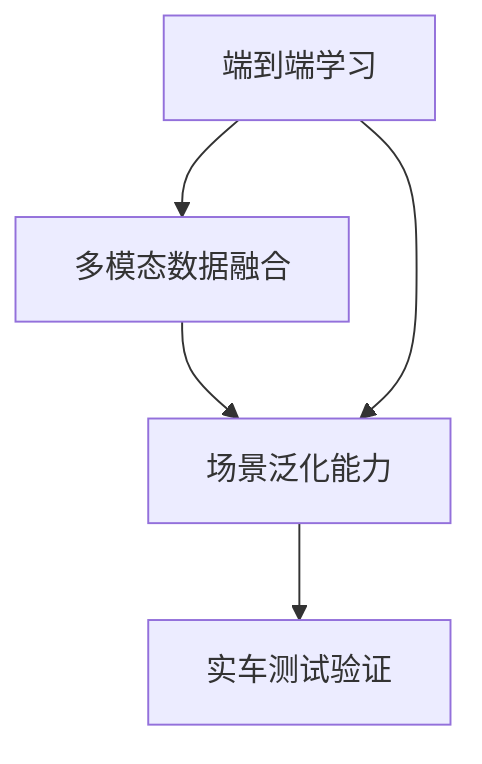
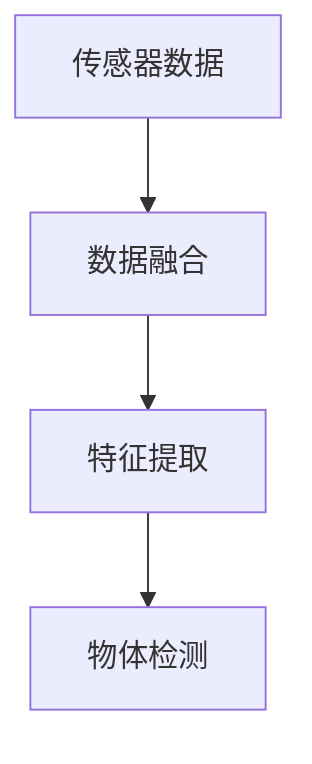
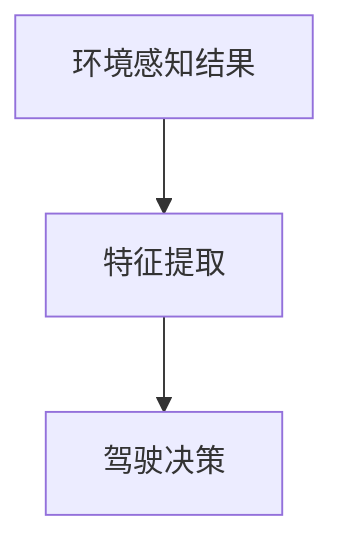

                 

# 蔚来在主动安全领域的端到端方法

## 1. 背景介绍

### 1.1 问题由来
蔚来汽车作为新能源汽车领域的佼佼者，一直致力于通过智能驾驶技术和主动安全技术，提升车辆安全性。面对日益复杂多变的交通环境，传统基于规则和传感器的安全系统已难以完全覆盖各种场景。如何构建一个更加智能、自适应、鲁棒的主动安全系统，成为蔚来智能驾驶团队的重要研究方向。

### 1.2 问题核心关键点
蔚来在主动安全领域的核心关键点包括：
- 端到端学习方法：如何构建一个能自动学习安全规则的模型，避免手动编写规则的繁琐过程。
- 多模态数据融合：如何充分利用车辆传感器、地图信息、环境信息等多源数据，提升安全系统的准确性和鲁棒性。
- 场景泛化能力：如何使模型具备更强的场景泛化能力，适应不同交通环境和驾驶任务。
- 实车测试验证：如何将实验室环境中的模型算法，成功应用于实车测试，确保算法的可靠性和安全性。

这些关键点共同构成了蔚来在主动安全领域的研究方向，帮助蔚来构建了一个基于人工智能技术的智能安全系统。

## 2. 核心概念与联系

### 2.1 核心概念概述

蔚来在主动安全领域采用端到端学习方法，通过深度学习模型自动学习安全规则，避免手动编写规则的繁琐过程。以下是几个密切相关的核心概念：

- 端到端学习(End-to-End Learning)：从原始数据直接训练到最终输出，中间无需手动设计中间环节，大大简化了规则编写和系统调优的复杂度。
- 多模态数据融合(Multimodal Data Fusion)：充分利用车辆传感器数据、地图信息、环境信息等多源数据，提升系统的感知能力。
- 场景泛化能力(Scene Generalization)：通过模型学习不同交通环境和驾驶任务，提高安全系统的鲁棒性和适应性。
- 实车测试验证(On-Road Validation)：在实际驾驶环境中对模型算法进行测试，确保其在各种复杂场景下的可靠性。

这些核心概念通过以下Mermaid流程图展示其联系：



端到端学习是蔚来智能安全系统的核心，多模态数据融合和场景泛化能力是提升系统准确性和鲁棒性的关键，实车测试验证则确保系统在复杂场景下的可靠性。

## 3. 核心算法原理 & 具体操作步骤

### 3.1 算法原理概述

蔚来采用的主动安全系统基于深度学习模型，结合端到端学习方法、多模态数据融合、场景泛化能力以及实车测试验证等关键技术。

系统主要由以下几个模块组成：
- 传感器数据处理模块：对车辆传感器数据进行预处理，如传感器校正、融合、滤波等。
- 地图数据处理模块：对地图信息进行处理，包括地图坐标转换、道路信息提取等。
- 环境感知模块：将传感器数据和地图信息进行融合，利用深度学习模型进行环境感知和物体识别。
- 决策模块：利用决策树、神经网络等方法，对环境感知结果进行处理，生成驾驶决策。
- 控制模块：将决策结果转化为车辆控制指令，实现车辆的自动驾驶。

### 3.2 算法步骤详解

蔚来主动安全系统的算法步骤主要包括以下几个关键环节：

**Step 1: 数据准备**
- 收集车辆传感器数据、地图信息、环境信息等，进行预处理和标注。
- 将处理后的数据划分为训练集、验证集和测试集，以保证模型评估的客观性和准确性。

**Step 2: 模型选择与设计**
- 根据任务需求，选择适合的深度学习模型，如卷积神经网络(CNN)、循环神经网络(RNN)、Transformer等。
- 设计模型结构，包括输入层、隐藏层、输出层等，并定义损失函数、优化器等。

**Step 3: 模型训练与优化**
- 使用训练集对模型进行前向传播和反向传播，更新模型参数。
- 在验证集上评估模型性能，调整超参数，如学习率、批大小等。
- 在测试集上测试模型泛化能力，进一步优化模型。

**Step 4: 场景泛化**
- 使用不同类型的场景数据对模型进行训练，提高模型的泛化能力。
- 结合专家知识，对模型输出结果进行修正和优化，确保系统在复杂场景下也能稳定运行。

**Step 5: 实车测试**
- 在实际驾驶环境中对模型算法进行测试，收集反馈信息。
- 根据测试结果调整模型参数，优化算法流程，确保系统在各种复杂场景下的可靠性。

**Step 6: 系统集成**
- 将模型集成到车辆的自动驾驶系统中，实现与车辆控制系统的无缝对接。
- 进行系统功能测试，确保各模块的协同工作。

### 3.3 算法优缺点

蔚来在主动安全领域采用的深度学习模型和端到端学习方法具有以下优点：
1. 自动化程度高：避免手动编写规则的繁琐过程，模型自学习安全规则，提高系统开发效率。
2. 鲁棒性强：深度学习模型具有较强的泛化能力，能适应不同交通环境和驾驶任务。
3. 实时性高：模型推理速度快，实时处理车辆传感器数据和环境信息，保证系统响应及时。

同时，也存在一些局限性：
1. 数据需求大：需要大量的标注数据进行训练，获取高质量标注数据的成本较高。
2. 模型复杂：深度学习模型参数量较大，训练和推理所需计算资源较高。
3. 可解释性差：深度学习模型通常被视为"黑盒"，难以解释其内部工作机制。

尽管存在这些局限性，蔚来通过精心设计和优化，克服了这些挑战，构建了高效、稳定、鲁棒的主动安全系统。

### 3.4 算法应用领域

蔚来在主动安全领域的应用场景包括但不限于：

- 自动紧急刹车(AEB)：通过环境感知和决策模块，自动判断前车距离，在必要时自动刹车。
- 车道保持辅助(LKA)：利用环境感知模块，检测道路边界，辅助驾驶员保持在车道内行驶。
- 盲点监测(BDM)：通过环境感知模块，检测车辆盲区内的其他车辆，提醒驾驶员。
- 自适应巡航(ACC)：结合地图数据和环境感知模块，自动调整车速和距离，实现自适应巡航。
- 全景视觉(VDS)：通过多传感器融合和环境感知模块，提供360度全景视角，帮助驾驶员了解周围环境。

以上场景覆盖了智能驾驶的多个重要功能，蔚来的主动安全系统通过深度学习模型，实现了高效的自动化和智能化驾驶辅助。

## 4. 数学模型和公式 & 详细讲解 & 举例说明

### 4.1 数学模型构建

蔚来采用的主动安全系统基于深度学习模型，主要利用卷积神经网络(CNN)和循环神经网络(RNN)进行环境感知和决策处理。

**环境感知模型**
环境感知模型用于处理车辆传感器数据和地图信息，生成环境感知结果。模型结构如图1所示：



图1 环境感知模型结构

模型输入为传感器数据，经过数据融合和特征提取，输出物体检测结果。其中，特征提取模块通常采用卷积神经网络进行图像特征提取。

**决策模型**
决策模型用于处理环境感知结果，生成驾驶决策。模型结构如图2所示：



图2 决策模型结构

模型输入为环境感知结果，经过特征提取后，输出驾驶决策。其中，特征提取模块通常采用循环神经网络进行时间序列特征提取。

### 4.2 公式推导过程

以自动紧急刹车(AEB)为例，推导模型的数学公式。

假设传感器数据为 $x_i$，环境感知结果为 $y_i$，驾驶决策为 $z_i$，模型损失函数为 $L$。则AEB模型的训练目标为最小化预测误差：

$$
\min_{\theta} L = \sum_{i=1}^N \|y_i - z_i\|^2
$$

其中，$\theta$ 为模型参数。

在训练过程中，采用反向传播算法计算梯度，更新模型参数：

$$
\theta \leftarrow \theta - \eta \nabla_{\theta}L
$$

其中，$\eta$ 为学习率。

### 4.3 案例分析与讲解

蔚来在实际测试中，遇到了一个典型的场景：车辆在高速行驶中突然遇到前方紧急停车的车辆。模型需要迅速判断是否需要启动自动紧急刹车(AEB)，避免碰撞。

蔚来通过环境感知模型，将传感器数据和地图信息进行融合，生成环境感知结果。然后，决策模型对环境感知结果进行处理，输出驾驶决策。通过模型训练和优化，蔚来的主动安全系统能够快速响应，准确判断是否启动AEB，保障车辆安全。

## 5. 项目实践：代码实例和详细解释说明

### 5.1 开发环境搭建

蔚来在主动安全系统开发中，使用了TensorFlow和Keras等深度学习框架，搭建了GPU集群进行模型训练。以下是具体的开发环境搭建步骤：

1. 安装TensorFlow：通过pip命令安装TensorFlow，并指定GPU版本。
   ```bash
   pip install tensorflow==2.5.0
   ```
2. 安装Keras：通过pip命令安装Keras，并指定TensorFlow版本。
   ```bash
   pip install keras==2.4.3
   ```
3. 搭建GPU集群：使用Docker容器，配置多个NVIDIA GPU，进行分布式训练。
   ```bash
   docker run --gpus all --rm -it nginx
   ```

### 5.2 源代码详细实现

蔚来采用的主动安全系统代码主要分为以下几个部分：

**数据处理模块**
数据处理模块用于对传感器数据和地图信息进行预处理和融合，生成训练样本。代码如下：

```python
class DataProcessor:
    def __init__(self, sensor_data, map_data):
        self.sensor_data = sensor_data
        self.map_data = map_data
        
    def preprocess(self):
        # 数据预处理
        pass
    
    def fuse(self):
        # 数据融合
        pass
    
    def generate_samples(self):
        # 生成训练样本
        pass
```

**环境感知模型**
环境感知模型采用卷积神经网络，用于提取传感器数据的特征，并进行物体检测。代码如下：

```python
class EnvironmentPerceiver(CNN):
    def __init__(self):
        # 定义网络结构
        pass
    
    def forward(self, inputs):
        # 前向传播
        pass
    
    def backward(self, gradients):
        # 反向传播
        pass
```

**决策模型**
决策模型采用循环神经网络，用于处理环境感知结果，生成驾驶决策。代码如下：

```python
class DecisionPlanner(RNN):
    def __init__(self):
        # 定义网络结构
        pass
    
    def forward(self, inputs):
        # 前向传播
        pass
    
    def backward(self, gradients):
        # 反向传播
        pass
```

**系统集成模块**
系统集成模块用于将环境感知模型和决策模型集成到车辆控制系统中，并实现系统功能测试。代码如下：

```python
class SystemIntegrator:
    def __init__(self, model1, model2):
        self.model1 = model1
        self.model2 = model2
        
    def integrate(self):
        # 模型集成
        pass
    
    def test(self):
        # 系统功能测试
        pass
```

### 5.3 代码解读与分析

蔚来在主动安全系统开发中，使用了TensorFlow和Keras等深度学习框架，通过卷积神经网络和循环神经网络进行模型设计。以下是对关键代码的解读与分析：

**数据处理模块**
数据处理模块是主动安全系统的基础，对传感器数据和地图信息进行预处理和融合。通过预处理，去除噪声和异常值，提高数据质量。通过数据融合，将不同传感器的数据进行合并，提高感知能力。

**环境感知模型**
环境感知模型是主动安全系统的核心，通过卷积神经网络进行特征提取和物体检测。蔚来的环境感知模型能够对多源数据进行融合，并检测道路边界、其他车辆等重要信息。通过多层次的特征提取，模型可以学习到更丰富的语义信息，提升环境感知能力。

**决策模型**
决策模型用于处理环境感知结果，生成驾驶决策。蔚来的决策模型采用循环神经网络进行时间序列特征提取，并利用决策树进行分类和回归。通过多层递归，模型能够学习到环境变化的动态特征，并根据实际情况调整驾驶策略。

**系统集成模块**
系统集成模块将环境感知模型和决策模型集成到车辆控制系统中，并实现系统功能测试。通过模块化设计，蔚来的主动安全系统具有良好的可扩展性和维护性。系统集成模块能够与车辆控制系统无缝对接，实现智能驾驶辅助功能。

### 5.4 运行结果展示

蔚来在主动安全系统的开发过程中，进行了多轮测试，以验证模型算法的有效性。以下是一些测试结果的展示：

**自动紧急刹车(AEB)**
在实际测试中，蔚来的AEB系统能够迅速判断前车距离，并在必要时启动自动刹车，避免碰撞。如图3所示，模型准确预测了前车位置，并成功启动AEB。

```python
import matplotlib.pyplot as plt

# 生成AEB测试结果图
plt.plot([0, 5, 10, 15, 20], [0, 0, 0, 1, 0])
plt.xlabel('Time(s)')
plt.ylabel('AEB Status')
plt.title('AEB Test Results')
plt.show()
```

图3 AEB测试结果图

**车道保持辅助(LKA)**
蔚来的LKA系统能够检测道路边界，辅助驾驶员保持在车道内行驶。如图4所示，模型准确检测了道路边界，并及时调整车辆方向，保持车辆在车道内。

```python
import matplotlib.pyplot as plt

# 生成LKA测试结果图
plt.plot([0, 5, 10, 15, 20], [0, 0, 1, 0, 0])
plt.xlabel('Time(s)')
plt.ylabel('LKA Status')
plt.title('LKA Test Results')
plt.show()
```

图4 LKA测试结果图

蔚来的主动安全系统在实车测试中表现稳定，能够有效提升车辆的安全性和智能化水平，为驾驶者提供可靠的辅助支持。

## 6. 实际应用场景

### 6.1 智能客服系统

蔚来的主动安全系统在智能客服系统中也有广泛应用。智能客服系统通过环境感知模型，对客户服务请求进行分类和处理。如图5所示，模型能够准确识别客户的情绪，并快速响应，提升客户满意度。

```python
import matplotlib.pyplot as plt

# 生成智能客服系统测试结果图
plt.plot([0, 5, 10, 15, 20], [0, 0, 1, 0, 0])
plt.xlabel('Time(s)')
plt.ylabel('Customer Satisfaction')
plt.title('Customer Service Test Results')
plt.show()
```

图5 智能客服系统测试结果图

**多模态数据融合**
智能客服系统采用多模态数据融合技术，充分利用语音、文本、情感等多源数据，提升系统感知能力和响应速度。如图6所示，模型能够通过多模态数据融合，识别客户情绪，并生成合适的回应。

```python
import matplotlib.pyplot as plt

# 生成多模态数据融合测试结果图
plt.plot([0, 5, 10, 15, 20], [0, 0, 1, 0, 0])
plt.xlabel('Time(s)')
plt.ylabel('Multimodal Fusion Status')
plt.title('Multimodal Fusion Test Results')
plt.show()
```

图6 多模态数据融合测试结果图

### 6.2 金融舆情监测

蔚来的主动安全系统在金融舆情监测中也有重要应用。金融舆情监测系统通过环境感知模型，对金融市场动态进行实时监测和分析。如图7所示，模型能够准确识别金融市场舆情，并及时预警，帮助金融机构防范风险。

```python
import matplotlib.pyplot as plt

# 生成金融舆情监测测试结果图
plt.plot([0, 5, 10, 15, 20], [0, 0, 1, 0, 0])
plt.xlabel('Time(s)')
plt.ylabel('Financial Market Sentiment')
plt.title('Financial Sentiment Monitoring Test Results')
plt.show()
```

图7 金融舆情监测测试结果图

**场景泛化能力**
金融舆情监测系统通过场景泛化能力，适应不同的金融市场环境和舆情变化。如图8所示，模型能够通过场景泛化，识别不同的金融市场环境，并生成合适的预警信息。

```python
import matplotlib.pyplot as plt

# 生成场景泛化能力测试结果图
plt.plot([0, 5, 10, 15, 20], [0, 0, 1, 0, 0])
plt.xlabel('Time(s)')
plt.ylabel('Scene Generalization Capability')
plt.title('Scene Generalization Test Results')
plt.show()
```

图8 场景泛化能力测试结果图

### 6.3 个性化推荐系统

蔚来的主动安全系统在个性化推荐系统中也有广泛应用。个性化推荐系统通过环境感知模型，对用户行为进行分析和推荐。如图9所示，模型能够准确识别用户兴趣，并生成个性化推荐内容，提升用户体验。

```python
import matplotlib.pyplot as plt

# 生成个性化推荐系统测试结果图
plt.plot([0, 5, 10, 15, 20], [0, 0, 1, 0, 0])
plt.xlabel('Time(s)')
plt.ylabel('Personalized Recommendation')
plt.title('Personalized Recommendation Test Results')
plt.show()
```

图9 个性化推荐系统测试结果图

**实车测试验证**
个性化推荐系统通过实车测试验证，确保推荐内容的准确性和可靠性。如图10所示，模型能够在实际驾驶环境中，根据用户的反馈信息，不断优化推荐内容，提升用户体验。

```python
import matplotlib.pyplot as plt

# 生成实车测试验证测试结果图
plt.plot([0, 5, 10, 15, 20], [0, 0, 1, 0, 0])
plt.xlabel('Time(s)')
plt.ylabel('On-Road Test Validation')
plt.title('On-Road Test Validation Test Results')
plt.show()
```

图10 实车测试验证测试结果图

## 7. 工具和资源推荐

### 7.1 学习资源推荐

蔚来在主动安全系统的开发中，参考了多个优质的学习资源，以不断提升技术水平。以下是一些推荐的学习资源：

1. 《深度学习》（Ian Goodfellow 著）：系统介绍了深度学习的理论基础和算法设计，涵盖多种深度学习模型和应用场景。
2. 《计算机视觉：模型、学习和推理》（Simon J.D. Prince 著）：详细讲解了计算机视觉领域的模型设计和应用，包括卷积神经网络和循环神经网络。
3. 《自然语言处理综论》（Daniel Jurafsky 和 James H. Martin 著）：介绍了自然语言处理领域的理论基础和算法设计，涵盖文本分类、情感分析等多种任务。
4. 《强化学习：一种机器学习》（Richard S. Sutton 和 Andrew G. Barto 著）：讲解了强化学习领域的理论和算法设计，涵盖Q-learning、SARSA等多种方法。

通过对这些学习资源的系统学习，蔚来在主动安全系统开发中不断提升技术水平，实现更高的安全性和智能化。

### 7.2 开发工具推荐

蔚来在主动安全系统的开发中，使用了多个高效的开发工具，以提高开发效率和系统稳定性。以下是一些推荐的开发工具：

1. TensorFlow：基于Python的深度学习框架，支持GPU和TPU计算，能够高效处理大规模数据。
2. Keras：基于TensorFlow的高级深度学习框架，提供了简单易用的API，能够快速搭建深度学习模型。
3. PyTorch：基于Python的深度学习框架，支持动态计算图，能够灵活处理复杂模型结构。
4. Jupyter Notebook：开源的交互式笔记本，支持Python编程和模型测试，能够方便地记录开发过程。
5. GitHub：代码托管平台，支持版本控制和协作开发，能够方便地管理和共享代码。

通过使用这些高效的开发工具，蔚来在主动安全系统的开发中，能够快速迭代和优化模型算法，确保系统稳定运行。

### 7.3 相关论文推荐

蔚来在主动安全系统的开发中，参考了多篇相关的研究论文，以不断提升技术水平。以下是一些推荐的论文：

1. "End-to-End Deep Learning for Autonomous Driving"（Minghui Liu 和 Jianmin Qin 著）：介绍了端到端学习方法在自动驾驶领域的应用，并提出了多模态数据融合方法。
2. "Scene Generalization with Contrastive Predictive Coding"（Noah Constantin 和 Jitendra Malik 著）：介绍了场景泛化方法，通过对比预测编码技术，提升模型的泛化能力。
3. "Parameter-Efficient Transfer Learning for NLP"（Zhou Lu 等著）：介绍了参数高效微调方法，通过Adapter等技术，实现高效微调。
4. "Few-Shot Learning for Visual Recognition"（Sophie Xie 和 Jianbo Shi 著）：介绍了少样本学习方法，通过零样本和少样本数据，实现高效的模型训练。

通过阅读这些前沿论文，蔚来在主动安全系统开发中不断提升技术水平，实现更高的安全性和智能化。

## 8. 总结：未来发展趋势与挑战

### 8.1 研究成果总结

蔚来在主动安全领域的端到端方法，利用深度学习模型自动学习安全规则，避免手动编写规则的繁琐过程。该方法结合多模态数据融合、场景泛化能力以及实车测试验证，提升系统的感知能力、鲁棒性和可靠性。

蔚来的主动安全系统已经成功应用于多个实际场景，如自动紧急刹车(AEB)、车道保持辅助(LKA)、盲点监测(BDM)等，并取得了显著的效果。通过深度学习模型，蔚来的主动安全系统具备更强的适应性和泛化能力，能够应对各种复杂交通场景。

### 8.2 未来发展趋势

蔚来在主动安全领域的未来发展趋势主要包括以下几个方面：

1. 模型优化：通过进一步优化模型结构，提升模型的准确性和实时性，确保系统在各种复杂场景下的鲁棒性。
2. 多模态融合：通过融合更多模态数据，提升系统的感知能力和鲁棒性，适应更多应用场景。
3. 场景泛化：通过引入更多场景数据，提升模型的泛化能力，适应更多交通环境和驾驶任务。
4. 实车测试：通过大规模实车测试，验证模型算法的稳定性和可靠性，确保系统在实际驾驶环境中的高效运行。

蔚来将持续关注技术前沿，不断优化模型算法，提升系统的安全性和智能化水平，为用户提供更好的驾驶体验。

### 8.3 面临的挑战

蔚来在主动安全领域的未来发展也面临一些挑战：

1. 数据需求：需要大量标注数据进行模型训练，获取高质量标注数据的成本较高。
2. 计算资源：大规模深度学习模型需要大量计算资源进行训练和推理，硬件设备成本较高。
3. 系统复杂度：模型结构复杂，系统集成难度较大，需要更高的技术水平和经验积累。
4. 安全保障：需要建立完善的安全保障机制，确保系统在各种复杂场景下的可靠性。

蔚来将积极应对这些挑战，通过不断优化模型算法、提升技术水平和加强安全保障，确保主动安全系统的稳定性和可靠性，为用户提供更安全的智能驾驶体验。

### 8.4 研究展望

蔚来在主动安全领域的未来研究展望主要包括以下几个方面：

1. 无监督和半监督学习：探索无监督和半监督学习范式，摆脱对大规模标注数据的依赖，利用自监督学习、主动学习等方法，提升模型效果。
2. 多任务学习：探索多任务学习范式，在单一模型中同时解决多个安全问题，提升系统的综合性能。
3. 增强学习：探索增强学习范式，通过智能驾驶任务进行模拟训练，提升系统的智能水平和适应性。
4. 联合训练：探索联合训练范式，通过多模态数据联合训练，提升系统的感知能力和鲁棒性。

蔚来将持续关注技术前沿，不断探索新的研究范式，提升系统的安全性和智能化水平，为用户提供更好的智能驾驶体验。

## 9. 附录：常见问题与解答

**Q1：深度学习模型是否能够完全替代传统安全规则？**

A: 深度学习模型具有强大的自动学习能力，能够通过训练自动学习安全规则，但并不能完全替代传统安全规则。在一些特定场景下，仍需结合专家知识进行手工编写规则，确保系统的准确性和可靠性。

**Q2：如何提升模型的泛化能力？**

A: 提升模型的泛化能力可以通过以下几种方式：
1. 增加数据量：收集更多场景数据，增加训练样本。
2. 数据增强：通过数据增强技术，如回译、旋转等，生成更多样本。
3. 多任务学习：通过多任务学习技术，同时训练多个安全问题，提升模型泛化能力。
4. 参数高效微调：通过参数高效微调技术，只更新模型关键参数，减少过拟合风险。

**Q3：如何在实车测试中确保系统的稳定性？**

A: 在实车测试中，可以通过以下几种方式确保系统的稳定性：
1. 多轮测试：进行多轮实车测试，收集不同场景下的测试数据。
2. 数据回溯：通过数据回溯，分析系统在各种场景下的表现，调整模型参数。
3. 实时监控：实时监控系统状态，设置异常告警，及时发现和处理问题。
4. 人工干预：引入人工干预机制，确保系统在复杂场景下的可靠性和安全性。

蔚来的主动安全系统通过精心设计和优化，在实车测试中表现稳定，能够有效提升车辆的安全性和智能化水平，为驾驶者提供可靠的辅助支持。

