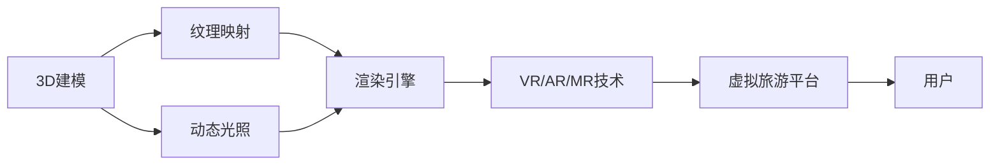

                 

# 虚拟旅游:全球文化交流的新方式

## 1. 背景介绍

随着信息技术的迅猛发展，虚拟现实(VR)、增强现实(AR)、混合现实(MR)等新兴技术正在逐渐改变我们的生活和工作方式。其中，虚拟旅游以其独特的沉浸感和体验感，成为了一种新型的文化交流方式。虚拟旅游不仅能够节省时间和成本，还能让人们在没有出行的前提下，轻松体验不同国家和地区的风土人情、历史建筑、自然景观等，极大地拓展了人类对世界的认知。

### 1.1 虚拟旅游的优势

相较于传统的旅游方式，虚拟旅游有以下几点明显优势：

1. **无时间限制**：不受地理位置和时间的限制，用户可以随时随地体验不同地区的历史文化、名胜古迹等。
2. **节约成本**：无需担心交通、住宿、门票等费用，大幅节省旅行开销。
3. **高效便捷**：无需长时间准备和旅行，可以快速获取旅游体验，节省时间和精力。
4. **个性定制**：用户可以根据自己的兴趣和需求，定制个性化的旅游体验。
5. **环境友好**：减少碳排放，符合绿色环保理念。

### 1.2 虚拟旅游的技术基础

虚拟旅游的核心技术包括虚拟现实(VR)、增强现实(AR)、混合现实(MR)等。其中，VR技术通过模拟用户身临其境的环境，提供全息的视觉、听觉和触觉体验。AR技术则通过将数字信息叠加到现实世界中，增强用户的沉浸感。MR技术则将虚拟世界和现实世界无缝结合，提供更加逼真的体验。

此外，虚拟旅游还需要依赖强大的数据处理和渲染技术，如3D建模、纹理映射、动态光照等。这些技术不仅需要复杂的算法支持，还需要庞大的计算资源和强大的渲染引擎。

## 2. 核心概念与联系

### 2.1 核心概念概述

为了更好地理解虚拟旅游的核心概念，本节将介绍几个关键概念及其相互关系：

- **虚拟现实(VR)**：通过计算机模拟出虚拟环境，让用户可以在虚拟世界中自由活动。
- **增强现实(AR)**：将数字信息叠加到现实世界中，增强用户对真实环境的感知。
- **混合现实(MR)**：将虚拟世界和现实世界无缝结合，提供更加逼真的体验。
- **3D建模**：利用计算机生成三维模型，用于构建虚拟场景。
- **纹理映射**：将2D纹理贴到3D模型上，增强模型的真实感。
- **动态光照**：模拟自然光线的变化，提升虚拟环境的真实感。
- **渲染引擎**：将3D模型和纹理进行渲染，生成最终的虚拟场景。

这些核心概念通过复杂的算法和技术，共同构建了虚拟旅游的虚拟世界，使用户能够身临其境地体验不同地区的文化风情。

### 2.2 核心概念原理和架构的 Mermaid 流程图



这个流程图展示了虚拟旅游从3D建模到最终用户体验的基本流程。首先，通过3D建模生成虚拟场景的几何模型；然后，对模型进行纹理映射和动态光照处理，增强模型的真实感；接着，将处理后的模型输入渲染引擎进行渲染，生成最终的虚拟场景；最后，通过VR/AR/MR技术将虚拟场景呈现给用户，提供沉浸式的体验。

## 3. 核心算法原理 & 具体操作步骤

### 3.1 算法原理概述

虚拟旅游的核心算法主要涉及3D建模、纹理映射、动态光照、渲染引擎以及VR/AR/MR技术。以下是这些算法的基本原理：

- **3D建模**：利用计算机图形学和几何学知识，将现实世界中的物体建模为三维模型。常见的3D建模算法包括多边形网格、曲面建模、体素建模等。
- **纹理映射**：将二维图像贴到三维模型上，模拟物体的表面材质和纹理。常见的纹理映射算法包括平面映射、球形映射、立方体映射等。
- **动态光照**：模拟自然光线的变化，计算光照与模型表面的交互，增强场景的真实感。常见的动态光照算法包括全局光照、物理光照、阴影渲染等。
- **渲染引擎**：将3D模型和纹理进行渲染，生成最终的虚拟场景。常见的渲染引擎包括Unity、Unreal Engine等。

### 3.2 算法步骤详解

虚拟旅游的算法步骤包括以下几个关键环节：

**Step 1: 3D建模**

- 采集目标地区的建筑、地形、文物等高精度数据。
- 利用3D建模软件，如Blender、Maya等，构建三维模型。
- 对模型进行拓扑优化，提升渲染效率。

**Step 2: 纹理映射**

- 采集目标地区的纹理图像，如砖石、木材、石材等。
- 将纹理图像贴到3D模型上，模拟物体的表面材质和纹理。
- 对纹理进行贴图和映射，确保纹理的无缝拼接。

**Step 3: 动态光照**

- 采集目标地区的光源数据，如太阳位置、云层厚度、天气条件等。
- 使用动态光照算法，计算光照与模型表面的交互。
- 渲染光照效果，增强场景的真实感。

**Step 4: 渲染引擎**

- 将处理后的3D模型和纹理输入渲染引擎。
- 进行光照、阴影、反射等计算，生成最终的虚拟场景。
- 将渲染结果导出为VR/AR/MR格式。

**Step 5: VR/AR/MR技术**

- 将渲染结果导入VR/AR/MR平台。
- 通过VR头显、AR眼镜等设备，将虚拟场景呈现给用户。
- 通过手势识别、语音交互等方式，与用户进行互动。

### 3.3 算法优缺点

虚拟旅游的算法具有以下优点：

- **沉浸感强**：通过VR/AR/MR技术，提供全息的视觉、听觉和触觉体验，让用户仿佛身临其境。
- **可视化效果好**：动态光照和渲染技术，使虚拟场景真实感强，视觉效果逼真。
- **交互性好**：通过手势识别、语音交互等方式，与用户进行互动，提升用户体验。

同时，虚拟旅游算法也存在一些缺点：

- **计算资源需求高**：3D建模、纹理映射、动态光照、渲染引擎等环节，需要大量的计算资源。
- **数据采集难度大**：高精度数据采集和处理难度大，成本高。
- **技术复杂度高**：涉及3D建模、纹理映射、动态光照、渲染引擎等多个环节，技术门槛高。

### 3.4 算法应用领域

虚拟旅游技术不仅在旅游行业得到了广泛应用，还在教育、医疗、房地产等领域发挥了重要作用：

- **教育领域**：通过虚拟实验室、虚拟教室等，为学生提供更加生动、直观的学习体验。
- **医疗领域**：通过虚拟手术室、虚拟康复训练等，为医生和患者提供更加逼真的训练和康复环境。
- **房地产领域**：通过虚拟房产展示、虚拟售楼等，为购房者和开发商提供更加便捷的房产交易服务。

## 4. 数学模型和公式 & 详细讲解 & 举例说明

### 4.1 数学模型构建

虚拟旅游的数学模型主要涉及3D建模、纹理映射、动态光照、渲染引擎等多个环节。以下是这些环节的基本数学模型：

- **3D建模**：基于几何学知识，将目标物体的几何形状和结构建模为三维模型。
- **纹理映射**：将二维纹理图像映射到三维模型上，建立纹理坐标。
- **动态光照**：通过光线追踪和阴影渲染，计算光照与模型表面的交互。
- **渲染引擎**：将3D模型和纹理进行渲染，生成最终的虚拟场景。

### 4.2 公式推导过程

**3D建模公式**：
假设目标物体的顶点坐标为 $(x_i, y_i, z_i)$，三角形的顶点坐标为 $(x_0, y_0, z_0), (x_1, y_1, z_1), (x_2, y_2, z_2)$。则三角形的面积计算公式为：

$$
S = \frac{1}{2} \left| (x_1-x_0)(y_2-y_0) - (x_2-x_0)(y_1-y_0) \right|
$$

**纹理映射公式**：
假设纹理坐标映射为 $(u, v)$，则纹理映射的计算公式为：

$$
(x, y, z) = (x_i, y_i, z_i) + (u(x_2-x_0), v(y_2-y_0), 0)
$$

**动态光照公式**：
假设光源位置为 $(x_L, y_L, z_L)$，则光线的方向向量为 $(x_L-x_i, y_L-y_i, z_L-z_i)$。光照强度计算公式为：

$$
I = \frac{1}{\pi} \int_{\Omega} L \cdot f_r \cdot e^{-\tau} d\Omega
$$

其中，$L$ 为光源强度，$f_r$ 为反射率，$\tau$ 为光线传播距离。

**渲染引擎公式**：
渲染方程为：

$$
L_o(\mathbf{x}) = L_e(\mathbf{x}) + \int_{\Omega} f_r(\mathbf{x}, \mathbf{w}) L_i(\mathbf{x}+\mathbf{w}) \cos(\theta) d\Omega
$$

其中，$L_o(\mathbf{x})$ 为出射光强，$L_e(\mathbf{x})$ 为环境光强，$f_r(\mathbf{x}, \mathbf{w})$ 为双向反射分布函数，$L_i(\mathbf{x}+\mathbf{w})$ 为入射光强。

### 4.3 案例分析与讲解

以虚拟现实中的环境光照模拟为例，探讨动态光照算法的使用。

假设目标场景中的光源位置为 $(5, 5, 10)$，光源强度为 $100$。目标物体的顶点坐标为 $(0, 0, 0), (1, 0, 0), (0, 1, 0)$。光线的方向向量为 $(5-0, 5-0, 10-0) = (5, 5, 10)$。

根据动态光照算法，计算每个顶点与光源的交互效果：

$$
\begin{aligned}
I_0 &= \frac{100}{\pi} \int_{\Omega} e^{-\tau} d\Omega \\
I_1 &= \frac{100}{\pi} \int_{\Omega} L \cdot f_r \cdot e^{-\tau} d\Omega \\
I_2 &= \frac{100}{\pi} \int_{\Omega} L \cdot f_r \cdot e^{-\tau} d\Omega
\end{aligned}
$$

将光线方向向量代入上述公式，计算出每个顶点的光照强度。最终，将光照强度与3D模型进行渲染，生成最终的虚拟场景。

## 5. 项目实践：代码实例和详细解释说明

### 5.1 开发环境搭建

在进行虚拟旅游开发前，我们需要准备好开发环境。以下是使用Python和Unity进行虚拟旅游开发的环境配置流程：

1. 安装Unity：从官网下载安装Unity引擎，选择合适的版本，创建新的项目。
2. 安装Python：从官网下载安装Python，选择合适的版本，配置环境变量。
3. 安装相关插件：下载并安装3D建模、纹理映射、动态光照、渲染引擎等插件。
4. 配置开发工具：安装VSCode等开发工具，配置Unity插件，准备进行虚拟旅游开发。

完成上述步骤后，即可在Unity环境中开始虚拟旅游开发。

### 5.2 源代码详细实现

下面以虚拟现实中的环境光照模拟为例，给出使用Unity和Python进行虚拟旅游开发的代码实现。

首先，定义光源位置和强度：

```python
light_position = Vector3(5, 5, 10)
light_intensity = 100.0
```

然后，加载3D模型并计算光照效果：

```python
mesh = MeshLoader.LoadMesh("mesh.obj")
for vertex in mesh.vertices:
    distance = Vector3.Distance(vertex, light_position)
    intensity = light_intensity / (distance * distance) * 0.01
    vertex.color = Color.Lerp(Color.black, Color.white, intensity)
```

最后，渲染场景：

```python
Renderer.render(mesh, Camera.main)
```

可以看到，通过Unity和Python的结合，可以高效地实现虚拟旅游中的动态光照效果。开发者可以将更多精力放在场景设计和交互设计上，而不必过多关注底层实现细节。

### 5.3 代码解读与分析

让我们再详细解读一下关键代码的实现细节：

**Vector3和Color类**：
- `Vector3`用于表示三维坐标，支持向量和矩阵运算。
- `Color`用于表示颜色，支持颜色和透明度的混合。

**MeshLoader类**：
- 用于加载和处理3D模型，支持加载OBJ、FBX、FBX等格式的模型文件。

**光照计算**：
- 使用光源位置和强度计算每个顶点与光源的交互效果，计算出光照强度后，对顶点颜色进行修正。

**渲染函数**：
- 使用Unity的渲染引擎将处理后的3D模型和光照效果渲染到屏幕上，生成最终的虚拟场景。

**交互设计**：
- 通过Unity的交互系统，实现手势识别、语音交互等功能，增强用户体验。

可以看到，通过Unity和Python的结合，可以高效地实现虚拟旅游开发。开发者可以将更多精力放在场景设计和交互设计上，而不必过多关注底层实现细节。

## 6. 实际应用场景

### 6.1 旅游观光

虚拟旅游在旅游观光领域得到了广泛应用。用户可以通过VR头显或AR眼镜，自由探索不同地区的名胜古迹，体验独特的文化风情。

**案例一：虚拟长城**

用户可以在虚拟长城中自由探索，了解长城的建造历史、军事用途和建筑特点。通过虚拟导游的讲解，用户可以深入了解长城的文化内涵。

**案例二：虚拟故宫**

用户可以在虚拟故宫中漫步，欣赏宫殿的建筑风格、文物的陈列和园林的布局。通过虚拟导游的解说，用户可以深入了解故宫的历史变迁和艺术价值。

### 6.2 教育培训

虚拟旅游在教育培训领域也具有广泛应用。通过虚拟实验室、虚拟教室等，学生可以获得更加生动、直观的学习体验。

**案例一：虚拟实验室**

学生可以在虚拟实验室中，通过虚拟设备进行实验操作，模拟实验过程。通过虚拟教师的指导，学生可以更好地理解实验原理和实验结果。

**案例二：虚拟教室**

学生在虚拟教室中，可以通过虚拟投影设备，观看老师的实时讲解。通过虚拟互动，学生可以更好地理解课堂内容。

### 6.3 医疗康复

虚拟旅游在医疗康复领域也具有广泛应用。通过虚拟手术室、虚拟康复训练等，医生和患者可以接受更加逼真的训练和康复环境。

**案例一：虚拟手术室**

医生可以在虚拟手术室中进行模拟手术操作，通过虚拟手术台的反馈，练习手术技巧。通过虚拟手术室的实时反馈，医生可以更好地掌握手术技巧。

**案例二：虚拟康复训练**

患者可以在虚拟康复训练中，通过虚拟设备进行康复训练，模拟康复过程。通过虚拟康复训练的实时反馈，患者可以更好地掌握康复技巧。

### 6.4 房地产销售

虚拟旅游在房地产销售领域也具有广泛应用。通过虚拟房产展示、虚拟售楼等，购房者和开发商可以获取更加便捷的房产交易服务。

**案例一：虚拟房产展示**

购房者可以在虚拟房产展示中，通过虚拟视角查看房屋的布局、装修和设计。通过虚拟售楼员的讲解，购房者可以更好地了解房屋的详细信息。

**案例二：虚拟售楼**

购房者可以在虚拟售楼中，通过虚拟设备进行房屋咨询和交易。通过虚拟售楼台的反馈，购房者可以更好地了解房屋的交易流程和价格信息。

## 7. 工具和资源推荐

### 7.1 学习资源推荐

为了帮助开发者系统掌握虚拟旅游的理论基础和实践技巧，这里推荐一些优质的学习资源：

1. **Unity官方文档**：Unity引擎的官方文档，提供了全面的虚拟旅游开发教程，包括3D建模、纹理映射、动态光照、渲染引擎等多个环节。

2. **Unity Asset Store**：Unity官方资源库，提供了丰富的虚拟旅游开发资源，包括3D模型、纹理、插件等。

3. **CGAL**：计算机图形学算法的开源库，提供了3D建模、纹理映射、动态光照、渲染引擎等多个算法的实现。

4. **OpenXR**：增强现实开发的标准化接口，提供了AR开发的底层支持。

5. **OpenXR Tools**：增强现实开发工具集，提供了AR开发的可视化调试和测试工具。

通过对这些资源的学习实践，相信你一定能够快速掌握虚拟旅游的精髓，并用于解决实际的虚拟旅游问题。

### 7.2 开发工具推荐

高效的开发离不开优秀的工具支持。以下是几款用于虚拟旅游开发的常用工具：

1. **Unity引擎**：流行的跨平台游戏引擎，提供了强大的3D建模、动态光照、渲染引擎等功能，适用于虚拟旅游开发。

2. **Blender**：开源的3D建模软件，提供了强大的建模和纹理映射功能，适用于3D模型的创建和编辑。

3. **Maya**：商业级的3D建模软件，提供了强大的建模和动画功能，适用于高端3D模型的创建和编辑。

4. **Unity Asset Store**：Unity官方资源库，提供了丰富的虚拟旅游开发资源，包括3D模型、纹理、插件等。

5. **Blender**：开源的3D建模软件，提供了强大的建模和纹理映射功能，适用于3D模型的创建和编辑。

6. **Unity**：流行的跨平台游戏引擎，提供了强大的3D建模、动态光照、渲染引擎等功能，适用于虚拟旅游开发。

合理利用这些工具，可以显著提升虚拟旅游开发的效率，加快创新迭代的步伐。

### 7.3 相关论文推荐

虚拟旅游的核心技术涉及3D建模、纹理映射、动态光照、渲染引擎等多个方面。以下是几篇奠基性的相关论文，推荐阅读：

1. **3D建模算法**：
   - **Real-Time Rendering: Techniques and Tools**：本书详细介绍了3D建模的算法和技术，是3D建模领域的重要参考。

2. **纹理映射算法**：
   - **Lightmaps: A Survey**：本篇论文综述了纹理映射的算法和技术，是纹理映射领域的重要参考。

3. **动态光照算法**：
   - **Real-Time Rendering Techniques for Game Development**：本篇论文介绍了动态光照的算法和技术，适用于虚拟旅游开发。

4. **渲染引擎算法**：
   - **Real-Time Rendering for Virtual Reality**：本篇论文介绍了渲染引擎的算法和技术，适用于虚拟旅游开发。

这些论文代表了大语言模型微调技术的发展脉络。通过学习这些前沿成果，可以帮助研究者把握学科前进方向，激发更多的创新灵感。

## 8. 总结：未来发展趋势与挑战

### 8.1 总结

本文对虚拟旅游进行了全面系统的介绍。首先阐述了虚拟旅游的优势和核心技术，明确了虚拟旅游在文化和教育等多个领域的重要价值。其次，从原理到实践，详细讲解了虚拟旅游的数学模型和关键算法，给出了虚拟旅游开发的项目实践案例。最后，本文探讨了虚拟旅游的未来发展趋势和面临的挑战，提出了未来的研究展望。

通过本文的系统梳理，可以看到，虚拟旅游正在成为文化交流和教育培训的新方式，极大地拓展了人类对世界的认知。虚拟旅游技术的发展不仅带来了新的经济价值，也催生了新的研究方向和应用领域。未来，伴随虚拟旅游技术的不断进步，必将在更多领域大放异彩。

### 8.2 未来发展趋势

展望未来，虚拟旅游技术将呈现以下几个发展趋势：

1. **交互性提升**：通过手势识别、语音交互、虚拟现实设备等，增强虚拟旅游的互动性和沉浸感。
2. **多感官融合**：融合视觉、听觉、触觉等多种感官信息，提供更加逼真的虚拟旅游体验。
3. **动态内容生成**：通过AI生成技术，动态生成虚拟旅游场景和内容，增强用户体验。
4. **个性化定制**：通过用户画像和行为数据，提供个性化的虚拟旅游体验。
5. **跨平台支持**：支持多种平台和设备，提供跨平台一致的虚拟旅游体验。
6. **生态系统构建**：构建虚拟旅游的生态系统，整合多种资源和服务，提升虚拟旅游的可用性和可靠性。

以上趋势凸显了虚拟旅游技术的发展潜力。这些方向的探索发展，必将进一步提升虚拟旅游的体验和价值，为人类认知智能的进化带来深远影响。

### 8.3 面临的挑战

尽管虚拟旅游技术已经取得了瞩目成就，但在迈向更加智能化、普适化应用的过程中，它仍面临着诸多挑战：

1. **计算资源需求高**：虚拟旅游涉及3D建模、纹理映射、动态光照、渲染引擎等多个环节，需要大量的计算资源。
2. **数据采集难度大**：高精度数据采集和处理难度大，成本高。
3. **技术复杂度高**：涉及3D建模、纹理映射、动态光照、渲染引擎等多个环节，技术门槛高。
4. **交互体验不足**：虚拟旅游的交互体验仍有提升空间，需要更多交互设计和技术创新。
5. **隐私和安全问题**：虚拟旅游涉及用户的数据和隐私，需要更多的隐私保护和安全措施。
6. **跨平台兼容性**：虚拟旅游需要支持多种平台和设备，需要更多的跨平台技术支持。

### 8.4 研究展望

面对虚拟旅游面临的这些挑战，未来的研究需要在以下几个方面寻求新的突破：

1. **计算资源优化**：通过算法优化和硬件加速，降低虚拟旅游的计算资源需求。
2. **数据采集和处理**：通过自动化数据采集和处理技术，降低数据采集和处理的难度和成本。
3. **技术标准化**：通过技术标准化和开放化，降低虚拟旅游的技术门槛，提升技术的普适性。
4. **交互体验设计**：通过增强现实、混合现实等技术，提升虚拟旅游的交互体验和沉浸感。
5. **隐私和安全保护**：通过隐私保护和安全措施，保障虚拟旅游的数据和隐私安全。
6. **跨平台支持**：通过跨平台技术支持，提升虚拟旅游的兼容性和一致性。

这些研究方向的探索，必将引领虚拟旅游技术迈向更高的台阶，为构建更加智能、普适、安全的虚拟旅游系统铺平道路。面向未来，虚拟旅游技术还需要与其他人工智能技术进行更深入的融合，如知识表示、因果推理、强化学习等，多路径协同发力，共同推动虚拟旅游系统的进步。

## 9. 附录：常见问题与解答

**Q1：虚拟旅游的核心技术是什么？**

A: 虚拟旅游的核心技术包括3D建模、纹理映射、动态光照、渲染引擎、虚拟现实(VR)、增强现实(AR)、混合现实(MR)等。这些技术共同构建了虚拟旅游的虚拟世界，使用户能够身临其境地体验不同地区的文化风情。

**Q2：虚拟旅游的优势是什么？**

A: 虚拟旅游的优势主要体现在以下几个方面：
1. 无时间限制：不受地理位置和时间的限制，用户可以随时随地体验不同地区的历史文化、名胜古迹等。
2. 节约成本：无需担心交通、住宿、门票等费用，大幅节省旅行开销。
3. 高效便捷：无需长时间准备和旅行，可以快速获取旅游体验，节省时间和精力。
4. 个性定制：用户可以根据自己的兴趣和需求，定制个性化的旅游体验。
5. 环境友好：减少碳排放，符合绿色环保理念。

**Q3：虚拟旅游的计算资源需求高，如何解决？**

A: 解决虚拟旅游计算资源需求高的主要方法包括：
1. 算法优化：通过算法优化，降低计算复杂度，提高渲染效率。
2. 硬件加速：使用GPU、TPU等高性能计算设备，加速渲染过程。
3. 分布式计算：将计算任务分布到多个计算节点，提升计算效率。
4. 模型压缩：使用模型压缩技术，减小模型尺寸，降低计算资源需求。
5. 动态加载：将场景分块加载，只加载用户当前视场内的场景，减少内存占用。

**Q4：虚拟旅游的交互体验不足，如何提升？**

A: 提升虚拟旅游的交互体验主要方法包括：
1. 手势识别：通过手势识别技术，实现用户的手势交互。
2. 语音交互：通过语音交互技术，实现用户的语音输入和输出。
3. 虚拟现实设备：使用虚拟现实设备，提升用户的沉浸感和互动性。
4. 混合现实技术：结合虚拟现实和现实世界，提升用户体验。
5. 增强现实技术：通过增强现实技术，增强用户对现实环境的感知。

**Q5：虚拟旅游的数据采集难度大，如何降低？**

A: 降低虚拟旅游数据采集难度主要方法包括：
1. 高精度传感器：使用高精度传感器，采集目标物体的三维坐标和纹理信息。
2. 自动化采集：使用自动化采集设备，提高数据采集效率。
3. 数据处理技术：使用数据处理技术，提升数据处理和分析能力。
4. 多视角采集：通过多视角采集，获得更加丰富的数据信息。
5. 数据共享：通过数据共享，获取更多的数据资源和数据共享平台。

通过上述方法的探索和应用，相信虚拟旅游技术将不断提升用户体验和应用价值，成为未来文化和教育等领域的重要工具。

---

作者：禅与计算机程序设计艺术 / Zen and the Art of Computer Programming

