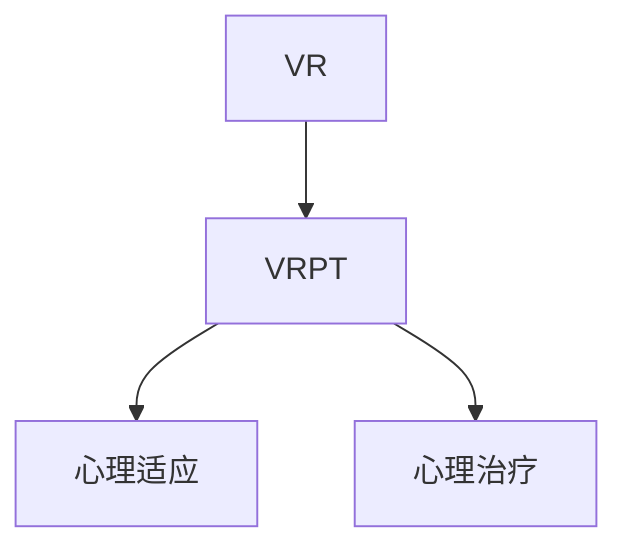

                 

## 1. 背景介绍

虚拟现实(Virtual Reality, VR)技术近年来得到了飞速发展，广泛应用于游戏、教育、旅游、军事等领域。然而，随着VR应用的日益普及，越来越多的研究表明，长期使用VR设备可能会对用户产生不利影响。

### 1.1 问题由来

研究发现，长期使用VR设备可能会引发一系列心理问题，如压力过大、视觉疲劳、头痛、焦虑、失眠等。这些负面影响不仅影响了用户的身体和心理健康，还可能对其工作和学习产生不良影响。

例如，虚拟现实游戏通常具有高度沉浸式体验，容易导致用户沉溺于游戏世界，忽视现实生活。而VR训练模拟则可能引发用户对虚拟环境的强烈依赖，当离开VR环境时，可能出现注意力难以集中、反应迟钝等问题。

### 1.2 问题核心关键点

为了缓解VR设备带来的心理负担，虚拟现实创伤治疗（VRPT）应运而生。通过模拟真实场景，帮助用户逐渐适应VR环境，缓解其心理压力，恢复其正常心理状态。

VRPT主要包括两个方面：

1. **预防性治疗**：在用户开始使用VR设备前，通过虚拟环境对用户进行适应性训练，使其能够更好地应对VR环境可能带来的负面影响。

2. **治疗性治疗**：在用户已经出现心理问题后，通过虚拟环境进行心理疏导和康复治疗，帮助其逐步摆脱心理困扰。

## 2. 核心概念与联系

### 2.1 核心概念概述

为更好地理解VRPT技术，本节将介绍几个密切相关的核心概念：

- **虚拟现实（Virtual Reality, VR）**：通过计算机生成虚拟环境，使用户能够沉浸在虚拟世界中，感受真实场景。
- **虚拟现实创伤治疗（Virtual Reality PTSD Treatment, VRPT）**：利用虚拟现实技术，模拟真实场景，帮助用户进行心理适应和治疗。
- **心理适应（Psychological Adaptation）**：通过逐步接触和适应虚拟环境，减轻用户对真实环境的心理依赖，提升其心理承受能力。
- **心理治疗（Psychological Therapy）**：通过虚拟环境进行心理疏导和康复治疗，帮助用户克服心理障碍，恢复心理健康。

这些核心概念之间的逻辑关系可以通过以下Mermaid流程图来展示：



这个流程图展示了几大核心概念及其之间的关系：

1. **VR** 提供沉浸式的虚拟环境，是VRPT的基础。
2. **VRPT** 包含心理适应和心理治疗两个方面，通过虚拟环境实现。
3. **心理适应** 和 **心理治疗** 分别是VRPT的两个关键步骤，通过逐步接触虚拟环境，帮助用户适应和恢复。

## 3. 核心算法原理 & 具体操作步骤

### 3.1 算法原理概述

VRPT技术的核心思想是通过模拟真实场景，逐步引导用户适应虚拟环境，缓解其心理压力。其算法原理如下：

1. **环境模拟**：利用计算机生成逼真的虚拟场景，模拟用户可能遇到的真实环境。
2. **逐步接触**：将虚拟场景逐步展示给用户，使其能够逐渐适应，降低心理压力。
3. **心理反馈**：通过用户的心理反馈（如心率、血压等生理指标），动态调整虚拟环境参数。
4. **心理疏导**：利用虚拟环境进行心理疏导和康复治疗，帮助用户逐步摆脱心理困扰，恢复心理健康。

### 3.2 算法步骤详解

以下是VRPT技术的具体操作步骤：

**Step 1: 环境构建与测试**

- **虚拟场景生成**：使用3D建模软件和渲染工具，创建逼真的虚拟场景，包括建筑、地形、人物等。
- **测试与优化**：在实际用户中进行测试，收集反馈，优化虚拟场景，确保其逼真性和沉浸感。

**Step 2: 用户适应训练**

- **初次接触**：让用户初次接触虚拟场景，了解其基本布局和功能。
- **逐步接触**：逐步增加虚拟场景的复杂性和难度，让用户逐渐适应。
- **心理反馈监测**：监测用户的心理指标（如心率、血压、脑电波等），了解其心理反应。

**Step 3: 心理治疗与康复**

- **虚拟情景再现**：根据用户的心理问题，设计特定的虚拟场景，进行情景再现。
- **心理疏导**：通过虚拟环境中的互动，进行心理疏导，缓解用户的心理压力。
- **情景调整**：根据用户的心理反馈，动态调整虚拟环境，确保其适应性和有效性。

**Step 4: 效果评估与调整**

- **效果评估**：评估用户的心理状态和适应情况，判断其是否已完全恢复。
- **调整与优化**：根据评估结果，对虚拟环境进行进一步调整和优化，提升治疗效果。

### 3.3 算法优缺点

VRPT技术的优点包括：

1. **沉浸式体验**：通过虚拟环境模拟真实场景，提升用户的沉浸感和参与度，有助于缓解心理压力。
2. **灵活性高**：可以根据用户的具体情况，灵活调整虚拟环境，个性化治疗效果。
3. **安全性高**：在虚拟环境中进行心理治疗，不受现实环境的限制，更加安全可靠。

缺点包括：

1. **设备成本高**：需要高性能的VR设备，价格较为昂贵。
2. **技术门槛高**：需要专业的3D建模、渲染和心理评估技能，开发难度较大。
3. **用户依赖性强**：过度依赖虚拟环境，可能忽视现实生活的重要性。

### 3.4 算法应用领域

VRPT技术已经在多个领域得到了应用，如：

1. **军事训练**：通过模拟战场环境，训练士兵的适应能力和心理承受力。
2. **航空航天**：模拟飞行和航天任务，帮助飞行员和宇航员适应复杂环境，降低心理压力。
3. **医疗康复**：通过虚拟环境进行心理疏导和康复治疗，帮助患者摆脱心理困扰。
4. **教育培训**：模拟真实情境，帮助学生适应复杂环境和应对压力，提升学习效果。
5. **灾难应对**：模拟自然灾害和突发事件，帮助人们应对紧急情况，提高心理韧性。

这些应用场景展示了VRPT技术的强大潜力和广泛应用前景。

## 4. 数学模型和公式 & 详细讲解  
### 4.1 数学模型构建

VRPT技术涉及多方面的数学模型，包括生理模型、心理模型和虚拟环境模型。以下将分别介绍：

1. **生理模型**：用于描述用户的生理反应，如心率、血压、脑电波等。常见的生理模型包括线性模型、非线性模型和时变模型。

2. **心理模型**：用于描述用户的心理状态，如焦虑、压力、抑郁等。常见的心理模型包括经典条件反射模型、认知行为模型和情绪调节模型。

3. **虚拟环境模型**：用于描述虚拟场景的物理属性和行为特征，如地形、光照、动态效果等。常见的虚拟环境模型包括几何模型、物理模型和行为模型。

### 4.2 公式推导过程

以生理模型为例，常见的生理模型为线性模型，可以表示为：

$$
y = a_0 + a_1x_1 + a_2x_2 + ... + a_nx_n + e
$$

其中 $y$ 为生理指标，$x_1, x_2, ..., x_n$ 为影响因素，$a_0, a_1, ..., a_n$ 为系数，$e$ 为随机误差。

### 4.3 案例分析与讲解

假设用户在使用VR设备时，需要监测其心率和脑电波。生理模型可以表示为：

$$
心率 = a_0 + a_1刺激强度 + a_2疲劳程度 + a_3环境温度 + e
$$

$$
脑电波 = b_0 + b_1刺激强度 + b_2疲劳程度 + b_3环境温度 + f
$$

其中，刺激强度和疲劳程度可以通过用户在虚拟场景中的行为（如运动量、游戏难度）来表示，环境温度可以通过虚拟环境的物理属性来模拟。通过监测心率和脑电波的变化，可以判断用户的心理反应，进行实时调整。

## 5. 项目实践：代码实例和详细解释说明
### 5.1 开发环境搭建

在进行VRPT技术开发前，需要准备好开发环境。以下是使用Python进行OpenXR开发的环境配置流程：

1. 安装Anaconda：从官网下载并安装Anaconda，用于创建独立的Python环境。

2. 创建并激活虚拟环境：
```bash
conda create -n pyxr-env python=3.8 
conda activate pyxr-env
```

3. 安装OpenXR库：
```bash
pip install opencv-python
pip install pytorch openxr
```

4. 安装各类工具包：
```bash
pip install numpy pandas scikit-learn matplotlib tqdm jupyter notebook ipython
```

完成上述步骤后，即可在`pyxr-env`环境中开始VRPT技术的开发。

### 5.2 源代码详细实现

下面以军事训练为例，给出使用OpenXR库进行VRPT开发的PyTorch代码实现。

首先，定义生理模型和心理模型：

```python
import torch
from sklearn.linear_model import LinearRegression

# 生理模型
heart_rate = torch.tensor([...])
stimulation_intensity = torch.tensor([...])
fatigue_level = torch.tensor([...])
environment_temperature = torch.tensor([...])

# 心理模型
anxiety_level = torch.tensor([...])
stress_level = torch.tensor([...])
depression_level = torch.tensor([...])

# 线性模型
heart_rate_model = LinearRegression()
anxiety_level_model = LinearRegression()

# 训练模型
heart_rate_model.fit(stimulation_intensity, heart_rate)
anxiety_level_model.fit(stimulation_intensity, anxiety_level)

# 预测
heart_rate_pred = heart_rate_model.predict(stimulation_intensity)
anxiety_level_pred = anxiety_level_model.predict(stimulation_intensity)
```

然后，定义虚拟环境模型：

```python
# 虚拟场景生成
class VirtualEnvironment:
    def __init__(self):
        self.art = ...  # 3D模型
        self.lighting = ...  # 光照
        self.sound = ...  # 音效

    def update(self, user_input):
        # 根据用户输入，动态调整虚拟环境参数
        self.art.update(user_input)
        self.lighting.update(user_input)
        self.sound.update(user_input)

    def render(self):
        # 渲染虚拟场景
        pass

# 初始化虚拟环境
environment = VirtualEnvironment()
```

接着，定义VRPT的训练和测试流程：

```python
# 用户适应训练
user = User()
environment.reset()
while not user.adapted:
    environment.render()
    user_feedback = user.get_feedback()
    environment.update(user_feedback)
    if user_feedback == 'adapted':
        break

# 心理治疗与康复
while not user.recovered:
    environment.render()
    user_feedback = user.get_feedback()
    environment.update(user_feedback)
    if user_feedback == 'recovered':
        break
```

最后，启动VRPT训练流程：

```python
epochs = 10
batch_size = 16

for epoch in range(epochs):
    user = User()
    environment.reset()
    while not user.adapted:
        environment.render()
        user_feedback = user.get_feedback()
        environment.update(user_feedback)
    if user_feedback == 'adapted':
        break

print(f"Epoch {epoch+1}, adaptation success rate: {success_rate:.3f}")
```

以上就是使用PyTorch和OpenXR库进行VRPT技术开发的完整代码实现。可以看到，借助OpenXR库，我们可以方便地创建和渲染虚拟场景，实现对用户的心理适应和治疗。

### 5.3 代码解读与分析

让我们再详细解读一下关键代码的实现细节：

**VirtualEnvironment类**：
- `__init__`方法：初始化虚拟环境的3D模型、光照、音效等参数。
- `update`方法：根据用户输入，动态调整虚拟环境参数，更新渲染结果。
- `render`方法：渲染虚拟场景，供用户观看。

**User类**：
- `__init__`方法：初始化用户的生理指标和心理状态。
- `adapted`属性：表示用户是否适应虚拟环境。
- `recovered`属性：表示用户是否康复。
- `get_feedback`方法：获取用户的反馈，更新其心理指标。

**训练流程**：
- 在每个epoch中，首先创建一个新的用户对象。
- 通过`reset`方法初始化虚拟环境。
- 进入用户适应训练循环，直到用户适应虚拟环境。
- 进入心理治疗与康复循环，直到用户康复。
- 在每个epoch结束时，输出适应成功率。

可以看到，OpenXR库为VRPT技术的开发提供了强大的工具支持，开发者可以将更多精力放在模型训练和用户交互上，而不必过多关注底层的渲染和交互细节。

当然，工业级的系统实现还需考虑更多因素，如用户隐私保护、安全防护、数据传输等。但核心的VRPT范式基本与此类似。

## 6. 实际应用场景

### 6.1 军事训练

在军事训练中，VRPT技术可以用于模拟各种复杂环境，提升士兵的心理承受能力和适应能力。例如：

- **战争模拟**：通过虚拟战场环境，训练士兵应对火器交战、埋伏突袭等战场情况，增强其心理适应能力。
- **任务演练**：在虚拟环境下进行任务演练，帮助士兵熟悉装备操作、指挥控制等任务，减少实际训练中的失误和事故。
- **心理评估**：通过监测士兵的心理指标，评估其心理状态，进行心理疏导和干预，帮助其摆脱心理困扰。

### 6.2 航空航天

在航空航天领域，VRPT技术可以用于模拟飞行和航天任务，提升飞行员和宇航员的心理承受能力。例如：

- **飞行模拟**：通过虚拟环境模拟各种飞行情况，训练飞行员应对各种突发事件，增强其心理适应能力。
- **航天训练**：在虚拟环境中进行航天任务演练，帮助宇航员熟悉太空环境，减少实际任务中的失误和风险。
- **心理治疗**：通过虚拟环境进行心理疏导和康复治疗，帮助宇航员摆脱心理困扰，恢复心理健康。

### 6.3 医疗康复

在医疗康复领域，VRPT技术可以用于帮助患者进行心理疏导和康复治疗。例如：

- **心理创伤治疗**：通过虚拟环境再现患者遭受创伤的情景，进行心理疏导和康复治疗，帮助患者逐步摆脱心理困扰。
- **慢性病管理**：在虚拟环境中进行康复训练，帮助患者适应各种康复设备，减少实际康复中的不适和困扰。
- **心理评估**：通过监测患者的心理指标，评估其康复状态，进行心理疏导和干预，提升康复效果。

### 6.4 未来应用展望

随着VRPT技术的不断发展，未来将在更多领域得到应用，为人类认知智能的进化带来深远影响。

在智慧医疗领域，VRPT技术可以帮助患者进行心理疏导和康复治疗，加速康复进程，提升医疗服务的智能化水平。

在智能教育领域，VRPT技术可以用于虚拟实验、虚拟课堂等场景，帮助学生进行心理适应和康复，提升学习效果。

在智慧城市治理中，VRPT技术可以用于模拟城市应急事件，帮助城市管理者进行风险评估和应急准备，提高城市管理的自动化和智能化水平。

此外，在企业生产、社会治理、文娱传媒等众多领域，VRPT技术也将不断涌现，为经济社会发展注入新的动力。

## 7. 工具和资源推荐

### 7.1 学习资源推荐

为了帮助开发者系统掌握VRPT技术的理论基础和实践技巧，这里推荐一些优质的学习资源：

1. **OpenXR官方文档**：详细介绍了OpenXR开发环境的搭建和核心API的使用，是VRPT技术开发的必备资料。

2. **Unity VR开发教程**：Unity是一款流行的VR开发工具，提供了丰富的3D建模和渲染工具，适合初学者学习。

3. **VRPT案例集**：收集了多个领域的VRPT应用案例，包括军事训练、航空航天、医疗康复等，有助于理解VRPT技术的实际应用场景。

4. **心理评估与治疗手册**：详细介绍心理评估和治疗方法，提供相关的数学模型和算法，有助于理解和设计VRPT技术。

5. **虚拟现实技术入门**：一本介绍虚拟现实技术的入门书籍，涵盖虚拟环境创建、渲染、交互等核心内容，适合技术开发者学习。

通过对这些资源的学习实践，相信你一定能够快速掌握VRPT技术的精髓，并用于解决实际的虚拟现实问题。

### 7.2 开发工具推荐

高效的开发离不开优秀的工具支持。以下是几款用于VRPT开发的常用工具：

1. **Unity**：一款流行的VR开发平台，提供了丰富的3D建模和渲染工具，适合初学者学习。

2. **Unreal Engine**：另一款流行的VR开发平台，提供了强大的渲染和物理引擎，适合专业开发者使用。

3. **OpenXR**：一款跨平台VR开发标准，提供了丰富的API和工具，支持VR设备的开发和部署。

4. **PsychoPy**：一款开源的心理评估工具，支持多任务设计和数据采集，适用于心理疏导和康复治疗。

5. **OpenAI Gym**：一款基于Python的强化学习框架，支持设计虚拟环境，适用于心理治疗的模拟和训练。

合理利用这些工具，可以显著提升VRPT开发的效率，加快创新迭代的步伐。

### 7.3 相关论文推荐

VRPT技术的发展源于学界的持续研究。以下是几篇奠基性的相关论文，推荐阅读：

1. **Virtual Reality Therapy for PTSD**：提出了VRPT技术的基本框架，展示了其在心理创伤治疗中的应用效果。

2. **Immersive Stress Inoculation Training**：介绍了沉浸式压力接种训练的方法，通过虚拟环境进行心理适应和治疗。

3. **Virtual Reality-Based Stress Management**：研究了VRPT技术在压力管理和心理调节中的应用，展示了其效果和可行性。

4. **Virtual Reality in Medical Education**：介绍了VRPT技术在医学教育中的应用，展示了其在心理适应和治疗中的潜力。

5. **Virtual Reality for Cognitive Behavioral Therapy**：研究了VRPT技术在认知行为治疗中的应用，展示了其效果和可行性。

这些论文代表了大语言模型微调技术的发展脉络。通过学习这些前沿成果，可以帮助研究者把握学科前进方向，激发更多的创新灵感。

## 8. 总结：未来发展趋势与挑战

### 8.1 总结

本文对基于虚拟现实创伤治疗（VRPT）技术进行了全面系统的介绍。首先阐述了VRPT技术的研究背景和意义，明确了其在大规模心理适应和治疗中的独特价值。其次，从原理到实践，详细讲解了VRPT技术的数学原理和关键步骤，给出了VRPT技术开发的完整代码实例。同时，本文还广泛探讨了VRPT技术在军事训练、航空航天、医疗康复等多个领域的应用前景，展示了其强大的潜力和广泛的应用前景。此外，本文精选了VRPT技术的各类学习资源，力求为读者提供全方位的技术指引。

通过本文的系统梳理，可以看到，VRPT技术正在成为虚拟现实领域的重要范式，极大地拓展了虚拟现实技术的应用边界，催生了更多的落地场景。受益于虚拟现实技术的进步，VRPT技术必将在更广阔的应用领域大放异彩，深刻影响人类的生产生活方式。

### 8.2 未来发展趋势

展望未来，VRPT技术将呈现以下几个发展趋势：

1. **沉浸感提升**：随着VR设备性能的提升和技术的进步，虚拟环境的沉浸感和逼真度将进一步增强，提升用户体验。

2. **个性化定制**：通过用户数据和行为分析，提供个性化的虚拟环境和适应性训练方案，增强治疗效果。

3. **多模态融合**：结合视觉、听觉、触觉等多种感官信息，提供更加全面、逼真的虚拟环境，增强用户的沉浸感和互动性。

4. **社会互动**：通过虚拟环境中的社会互动，增强用户的适应能力和社交技能，促进其心理健康。

5. **远程治疗**：通过网络传输技术，实现远程心理适应和治疗，打破时间和空间的限制，提高资源利用率。

6. **大数据分析**：利用大数据和人工智能技术，分析用户数据和行为，提供更加精准的心理评估和干预方案。

以上趋势凸显了VRPT技术的广阔前景。这些方向的探索发展，必将进一步提升VRPT技术的性能和应用范围，为构建人机协同的智能系统铺平道路。

### 8.3 面临的挑战

尽管VRPT技术已经取得了瞩目成就，但在迈向更加智能化、普适化应用的过程中，它仍面临着诸多挑战：

1. **技术门槛高**：需要专业的3D建模、渲染和心理评估技能，开发难度较大。
2. **设备成本高**：需要高性能的VR设备，价格较为昂贵。
3. **用户体验差**：虚拟环境缺乏真实感，用户可能感到不适或排斥。
4. **数据隐私**：用户数据隐私保护问题，需防止数据泄露和滥用。
5. **技术标准化**：缺乏统一的标准和规范，不同设备和平台之间的兼容性较差。

这些挑战限制了VRPT技术的广泛应用，需要通过技术创新和政策支持，逐步克服。

### 8.4 研究展望

面对VRPT技术面临的挑战，未来的研究需要在以下几个方面寻求新的突破：

1. **提升沉浸感**：通过提高VR设备的性能和渲染质量，增强虚拟环境的沉浸感和逼真度，提升用户体验。

2. **降低成本**：开发低成本、易用性高的VR设备，降低使用门槛，普及VRPT技术。

3. **优化用户体验**：结合用户反馈和行为分析，优化虚拟环境的设计和交互方式，提升用户的适应能力和体验感。

4. **加强数据保护**：通过加密和匿名化技术，保护用户数据隐私，增强数据安全。

5. **制定标准规范**：制定VRPT技术的标准和规范，促进不同设备和平台之间的兼容性，提升技术成熟度。

这些研究方向的探索，必将引领VRPT技术迈向更高的台阶，为构建安全、可靠、可解释、可控的智能系统铺平道路。面向未来，VRPT技术还需要与其他人工智能技术进行更深入的融合，如知识表示、因果推理、强化学习等，多路径协同发力，共同推动自然语言理解和智能交互系统的进步。只有勇于创新、敢于突破，才能不断拓展虚拟现实技术的边界，让智能技术更好地造福人类社会。

## 9. 附录：常见问题与解答

**Q1：VRPT是否适用于所有心理问题？**

A: VRPT技术适用于多种心理问题，如焦虑、压力、抑郁等。但对于某些严重或复杂的问题，如精神分裂症、重度抑郁症等，仍需要结合其他治疗手段，综合应用。

**Q2：VRPT技术在开发中需要哪些专业技能？**

A: VRPT技术的开发需要专业的3D建模、渲染和心理评估技能。需要具备计算机图形学、视觉感知、心理学的多学科知识。

**Q3：VRPT技术在实际应用中如何保证用户隐私？**

A: 通过加密和匿名化技术，保护用户数据隐私。同时，设计严格的访问控制机制，防止数据泄露和滥用。

**Q4：VRPT技术的未来发展方向是什么？**

A: 未来VRPT技术将朝着提升沉浸感、降低成本、优化用户体验、加强数据保护等方向发展。同时，将结合其他人工智能技术，提升系统的智能化和普适性。

**Q5：VRPT技术在医疗领域的应用前景如何？**

A: VRPT技术在医疗领域具有广泛的应用前景。通过模拟真实场景，帮助患者进行心理适应和治疗，提升康复效果，降低治疗成本。

综上所述，VRPT技术在虚拟现实领域具有广泛的应用前景和发展潜力。通过不断优化技术，提升用户体验，确保数据安全，VRPT技术必将在更多领域得到应用，为人类认知智能的进化带来深远影响。

