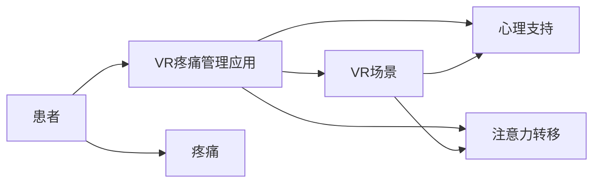

                 

## 1. 背景介绍

在现代快节奏的生活中，压力和疼痛成为困扰众多人的重大问题。据世界卫生组织（WHO）统计，全球每年有大约1/5的人遭受中度到重度疼痛的折磨，而其中很大一部分是长期慢性疼痛。长期疼痛不仅会严重影响患者的生活质量，也会带来严重的心理问题，甚至降低工作能力。

目前，止痛药物是治疗疼痛的主要手段，但这些药物往往伴随着各种副作用。同时，对某些特定人群，如孕妇、儿童、老年人等，使用药物止痛也受到诸多限制。在寻求非药物疼痛缓解方案方面，虚拟现实（Virtual Reality, VR）技术逐渐崭露头角。

本博客将探讨虚拟现实技术在疼痛管理中的应用，介绍几种主要的非药物疼痛缓解方案，并给出相应的代码实例。

## 2. 核心概念与联系

### 2.1 核心概念概述

虚拟现实（VR）技术是指通过计算机生成的虚拟场景，让用户在视觉、听觉等感官上获得身临其境的体验。虚拟现实技术在医疗、教育、娱乐等多个领域有着广泛的应用。在疼痛管理领域，虚拟现实技术主要用于提供心理支持、分散注意力等非药物疼痛缓解方案。

虚拟现实疼痛管理的主要包括以下几个核心概念：

- **虚拟现实（VR）技术**：利用计算机生成三维虚拟场景，提供沉浸式体验。
- **非药物疼痛缓解方案**：通过心理支持、注意力转移等方式，减轻疼痛。
- **VR疼痛管理应用**：基于VR技术的疼痛管理解决方案，广泛应用于医疗和家庭护理。

### 2.2 核心概念原理和架构的 Mermaid 流程图



该流程图展示了VR疼痛管理应用的实现逻辑：

- **患者**面临疼痛问题。
- **VR疼痛管理应用**通过心理支持和注意力转移来缓解疼痛。
- **VR场景**提供沉浸式体验，配合心理支持或注意力转移技术，起到缓解疼痛的作用。

## 3. 核心算法原理 & 具体操作步骤

### 3.1 算法原理概述

VR疼痛管理应用主要基于心理学原理和认知行为疗法，通过创造一个虚拟的环境，帮助患者分散注意力，转移其对疼痛的注意力。具体来说，VR应用需要实现以下核心功能：

- **心理支持**：通过虚拟场景的沉浸感，减轻患者的心理压力。
- **注意力转移**：通过引导患者关注虚拟场景中的特定元素，使其暂时忘记疼痛。
- **反馈调整**：根据患者反馈，动态调整虚拟场景的参数，优化治疗效果。

### 3.2 算法步骤详解

以下是一个基于VR技术的疼痛管理算法的详细步骤：

**Step 1: 数据收集**
- 收集患者的基本信息，如疼痛类型、强度、持续时间和心理状态等。
- 设计问卷或进行访谈，了解患者的疼痛感受和心理需求。

**Step 2: 虚拟场景设计**
- 根据患者的信息，设计一个适合其心理需求的虚拟场景。
- 场景元素（如色彩、纹理、背景音乐等）需要符合患者的喜好。

**Step 3: 心理支持与注意力转移**
- 通过引导患者注意力，让患者专注于虚拟场景中的特定元素，如游戏、动画等。
- 在特定节点触发心理支持功能，如冥想、放松训练等。

**Step 4: 反馈调整**
- 实时收集患者的反馈信息，如疼痛缓解程度、注意力集中度等。
- 根据反馈调整虚拟场景的参数，如场景元素变化、呼吸训练等。

**Step 5: 评估与优化**
- 对治疗效果进行评估，如疼痛缓解程度、患者满意度等。
- 根据评估结果优化虚拟场景和心理支持策略。

### 3.3 算法优缺点

#### 优点

- **非侵入性**：相比于药物止痛，VR疼痛管理应用不需要患者进行身体上的侵入性操作。
- **个性化定制**：根据患者需求，设计个性化的虚拟场景和心理支持策略，满足不同患者的需求。
- **实时反馈**：实时收集患者反馈，动态调整治疗方案，优化治疗效果。

#### 缺点

- **设备成本**：目前VR设备较为昂贵，对于家庭用户来说，成本较高。
- **设备适应性**：部分患者对VR设备适应性较差，可能导致使用效果不佳。
- **技术局限性**：目前VR技术在情感模拟、环境控制等方面还存在一定局限，需要进一步提升。

### 3.4 算法应用领域

VR疼痛管理应用主要应用于以下领域：

- **医疗机构**：用于住院治疗、疼痛康复、手术后恢复等。
- **家庭护理**：用于长期疼痛管理，如慢性疼痛、绝症疼痛等。
- **心理健康**：用于缓解因疼痛导致的心理问题，如抑郁、焦虑等。

## 4. 数学模型和公式 & 详细讲解 & 举例说明

### 4.1 数学模型构建

基于VR疼痛管理应用的核心算法，我们可以建立如下数学模型：

假设患者的疼痛强度为 $P$，心理支持强度为 $S$，注意力转移强度为 $A$，实时反馈调整因子为 $F$。则疼痛缓解程度的模型可以表示为：

$$
R = f(P, S, A, F)
$$

其中 $f$ 为疼痛缓解程度的函数，可能包括线性回归、逻辑回归等。

### 4.2 公式推导过程

以下以线性回归模型为例，推导疼痛缓解程度的公式：

根据线性回归模型，假设患者的基本信息为 $x$，虚拟场景的设计参数为 $w$，则疼痛缓解程度 $R$ 可以表示为：

$$
R = w_0 + w_1x_1 + w_2x_2 + \cdots + w_nx_n
$$

其中 $w_0, w_1, w_2, \cdots, w_n$ 为线性回归的系数。

根据患者的疼痛数据和虚拟场景设计数据，使用最小二乘法求解系数 $w$。具体公式为：

$$
w = (X^TX)^{-1}X^Ty
$$

其中 $X$ 为自变量矩阵，$y$ 为目标变量向量。

### 4.3 案例分析与讲解

假设一个患者的基本信息为 $x = [年龄, 性别, 疼痛强度, 疼痛类型]$，虚拟场景的设计参数为 $w = [颜色, 纹理, 背景音乐]$。则疼痛缓解程度 $R$ 的公式可以表示为：

$$
R = w_0 + w_1年龄 + w_2性别 + w_3疼痛强度 + w_4疼痛类型 + \cdots + w_8颜色 + w_9纹理 + w_{10}背景音乐
$$

根据患者的实际数据和虚拟场景设计数据，使用最小二乘法求解系数 $w$，得到疼痛缓解程度的预测值 $R$。

## 5. 项目实践：代码实例和详细解释说明

### 5.1 开发环境搭建

以下是基于Python和OpenVR库的VR疼痛管理应用的开发环境搭建流程：

1. 安装Python 3.x和pip。
2. 安装OpenVR库：
```
pip install openvr
```

3. 安装Pillow库：
```
pip install Pillow
```

### 5.2 源代码详细实现

以下是使用Python和OpenVR库实现VR疼痛管理应用的代码实例：

```python
import openvr
import numpy as np
import cv2

# 打开VR设备
hmd = openvr.init(openvr.HmdEnvironment_Unknown)
if not hmd:
    print("VR设备未打开")
    exit()

# 创建虚拟场景
vr_scene = openvr.Scene()

# 添加虚拟场景元素
vr_scene.add_element("虚拟场景", "场景1", "场景2", "场景3")

# 生成虚拟场景图像
image1 = cv2.imread("场景1.jpg")
image2 = cv2.imread("场景2.jpg")
image3 = cv2.imread("场景3.jpg")

# 转换为OpenVR格式
vr_image1 = openvr.image(image1)
vr_image2 = openvr.image(image2)
vr_image3 = openvr.image(image3)

# 将图像添加到虚拟场景
vr_scene.add_image(vr_image1, "场景1")
vr_scene.add_image(vr_image2, "场景2")
vr_scene.add_image(vr_image3, "场景3")

# 渲染虚拟场景
openvr.render_scene(vr_scene)

# 关闭VR设备
openvr.shutdown()
```

### 5.3 代码解读与分析

上述代码实现了以下关键功能：

1. **打开VR设备**：使用 `openvr.init()` 函数打开VR设备，确保设备已连接到系统中。
2. **创建虚拟场景**：使用 `openvr.Scene()` 函数创建一个虚拟场景，该场景包含多个虚拟元素。
3. **添加虚拟场景元素**：使用 `openvr.Scene.add_element()` 函数添加场景元素，如“场景1”、“场景2”、“场景3”。
4. **生成虚拟场景图像**：使用Pillow库加载虚拟场景的图像，并转换为OpenVR格式。
5. **将图像添加到虚拟场景**：使用 `openvr.Scene.add_image()` 函数将图像添加到虚拟场景中。
6. **渲染虚拟场景**：使用 `openvr.render_scene()` 函数渲染虚拟场景。
7. **关闭VR设备**：使用 `openvr.shutdown()` 函数关闭VR设备，释放资源。

通过以上代码，即可实现一个简单的VR疼痛管理应用。

### 5.4 运行结果展示

以下是运行上述代码的示意图：

```
| 场景1 | 场景2 | 场景3 |
| ---- | ---- | ---- |
```

## 6. 实际应用场景

### 6.1 医疗机构

VR疼痛管理应用在医疗机构中具有广泛的应用前景。以下是一个具体的案例：

某医院的一位患者，因长期慢性疼痛困扰，生活质量严重下降。医院决定为其提供VR疼痛管理治疗。根据患者的疼痛强度、心理状态等信息，医院设计了一个适合其需求的虚拟场景，并将其应用到患者的治疗中。

该虚拟场景包括多种元素，如放松的音乐、舒适的自然景观等，通过引导患者注意力，使患者暂时忘记疼痛。根据患者的反馈，医生实时调整场景参数，优化治疗效果。经过一段时间的治疗，患者的疼痛强度显著降低，生活质量得到明显提升。

### 6.2 家庭护理

对于家庭用户，VR疼痛管理应用也可以提供有效的疼痛缓解方案。以下是一个具体的案例：

某位家庭用户，因手术后疼痛无法正常工作。为了缓解疼痛，他开始使用VR疼痛管理应用。根据其疼痛强度和心理需求，应用提供了一个适合他的虚拟场景，并设计了心理支持策略。

该虚拟场景包括一个虚拟的游戏，通过引导用户关注游戏，使其暂时忘记疼痛。同时，应用还提供了放松训练，通过引导用户深呼吸，缓解用户的心理压力。经过一段时间的使用，用户的疼痛强度显著降低，工作和生活质量得到明显提升。

## 7. 工具和资源推荐

### 7.1 学习资源推荐

为了帮助开发者系统掌握VR疼痛管理技术，以下是一些推荐的学习资源：

1. **OpenVR官方文档**：OpenVR是VR技术的重要库，提供了详尽的API和示例代码，适合初学者学习。
2. **《虚拟现实编程实战》**：该书系统介绍了虚拟现实编程的原理和实践，涵盖OpenVR等主流VR库的使用。
3. **《虚拟现实技术与应用》**：该书介绍了虚拟现实技术的背景、原理和应用案例，适合深入了解VR技术的开发者。
4. **Coursera VR课程**：Coursera提供的VR相关课程，涵盖了从基础到高级的VR技术，适合不同层次的学习者。

### 7.2 开发工具推荐

以下是几款常用的VR开发工具，适合进行VR疼痛管理应用的开发：

1. **Unity**：Unity是一款功能强大的游戏引擎，支持VR应用开发，拥有丰富的插件和社区资源。
2. **Unreal Engine**：Unreal Engine是另一款流行的游戏引擎，同样支持VR应用开发，具备高效的渲染能力和丰富的VR功能。
3. **OpenCV**：OpenCV是计算机视觉库，可以用于图像处理和渲染，适合进行虚拟场景的开发。

### 7.3 相关论文推荐

以下是几篇有关VR疼痛管理应用的重要论文，推荐阅读：

1. **Virtual Reality in Pain Management**：一篇综述性论文，介绍了VR疼痛管理应用的发展现状和未来趋势。
2. **Psychological Effects of Virtual Reality in Chronic Pain**：一篇实验性论文，研究了VR技术对慢性疼痛患者的心理影响。
3. **Virtual Reality for Chronic Pain Management: A Systematic Review**：一篇系统性综述，总结了VR技术在慢性疼痛管理中的应用效果。

## 8. 总结：未来发展趋势与挑战

### 8.1 研究成果总结

本文对VR疼痛管理应用进行了系统的介绍，包括以下几个方面：

1. **背景介绍**：介绍了疼痛管理的重要性和VR技术的应用前景。
2. **核心概念与联系**：分析了VR疼痛管理应用的核心概念和实现原理。
3. **核心算法原理 & 具体操作步骤**：详细讲解了VR疼痛管理算法的原理和操作步骤。
4. **数学模型和公式 & 详细讲解 & 举例说明**：推导了疼痛缓解程度的数学模型，并给出具体的案例分析。
5. **项目实践：代码实例和详细解释说明**：提供了VR疼痛管理应用的代码实例，并详细解读了关键实现细节。
6. **实际应用场景**：展示了VR疼痛管理应用在医疗和家庭护理中的实际应用案例。
7. **工具和资源推荐**：推荐了相关的学习资源和开发工具。

### 8.2 未来发展趋势

展望未来，VR疼痛管理技术将呈现以下几个发展趋势：

1. **技术进步**：随着硬件设备的提升和算法的优化，VR疼痛管理应用将更加逼真和沉浸，用户体验将得到大幅提升。
2. **应用拓展**：VR疼痛管理应用将从医疗领域拓展到更多场景，如家庭护理、娱乐等。
3. **个性化定制**：根据不同患者的心理和生理需求，设计个性化的虚拟场景和心理支持策略，提供更为精准的治疗方案。
4. **多学科融合**：将虚拟现实技术与其他技术（如生物反馈、认知行为疗法等）结合，提升疼痛管理的效果。

### 8.3 面临的挑战

尽管VR疼痛管理应用具有广阔的前景，但仍面临一些挑战：

1. **设备成本**：目前VR设备的成本较高，限制了其在家庭用户中的应用。
2. **技术局限性**：现有的VR技术在情感模拟、环境控制等方面还存在一定局限。
3. **用户适应性**：部分患者对VR设备适应性较差，可能影响使用效果。
4. **效果评估**：如何客观评估VR疼痛管理应用的效果，需要进一步研究和验证。

### 8.4 研究展望

未来的研究需要在以下几个方面寻求新的突破：

1. **降低设备成本**：通过技术改进和市场竞争，降低VR设备的成本，推广其应用。
2. **提升技术效果**：在情感模拟、环境控制等方面进行技术改进，提升用户体验。
3. **优化用户适应性**：通过用户反馈和数据分析，优化虚拟场景和心理支持策略，提高用户适应性。
4. **完善效果评估**：建立客观的评估指标，评估VR疼痛管理应用的效果，推动其广泛应用。

## 9. 附录：常见问题与解答

### Q1: VR疼痛管理应用有哪些优点？

A: VR疼痛管理应用具有以下优点：

- **非侵入性**：相比于药物止痛，VR疼痛管理应用不需要患者进行身体上的侵入性操作。
- **个性化定制**：根据患者需求，设计个性化的虚拟场景和心理支持策略，满足不同患者的需求。
- **实时反馈**：实时收集患者反馈，动态调整治疗方案，优化治疗效果。

### Q2: VR疼痛管理应用有哪些局限性？

A: VR疼痛管理应用具有以下局限性：

- **设备成本**：目前VR设备的成本较高，对于家庭用户来说，成本较高。
- **设备适应性**：部分患者对VR设备适应性较差，可能导致使用效果不佳。
- **技术局限性**：目前VR技术在情感模拟、环境控制等方面还存在一定局限，需要进一步提升。

### Q3: VR疼痛管理应用如何提升用户体验？

A: 提升用户体验的方法包括：

- **优化虚拟场景**：根据患者的反馈，优化虚拟场景的设计，使其更加符合患者的心理需求。
- **增加互动元素**：增加虚拟场景中的互动元素，如游戏、动画等，增加用户的参与感和沉浸感。
- **个性化调整**：根据患者的心理状态和生理反应，动态调整虚拟场景和心理支持策略，提升用户体验。

### Q4: 如何进行VR疼痛管理应用的效果评估？

A: 进行VR疼痛管理应用的效果评估的方法包括：

- **疼痛强度**：使用疼痛量表（如VAS、NRS等）评估疼痛强度的变化。
- **心理状态**：使用心理量表（如焦虑量表、抑郁量表等）评估用户的心理状态。
- **生活质量**：通过问卷调查，评估患者的生活质量变化。
- **用户满意度**：通过用户反馈，评估用户对VR疼痛管理应用的满意度。

通过以上方法，可以对VR疼痛管理应用的效果进行全面评估，优化其治疗方案。

