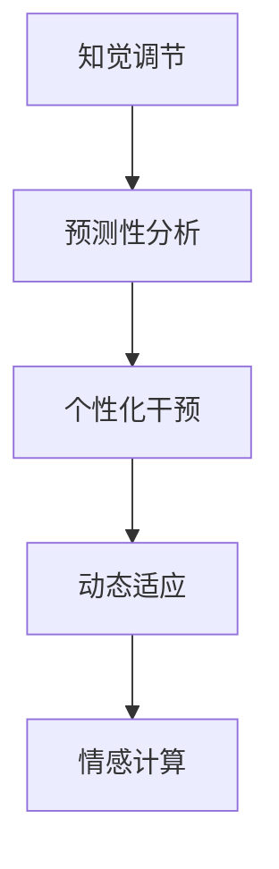

                 

# 虚拟疼痛管理专家：AI驱动的知觉调节顾问

## 1. 背景介绍

疼痛是人类的天敌，长久以来，医学界和心理学界试图用药物、手术和心理治疗来缓解病痛。然而，这些方法往往无法完美解决每一个人的疼痛问题，尤其在慢性疼痛管理上存在许多挑战。随着人工智能（AI）技术的发展，AI驱动的知觉调节顾问应运而生，为疼痛管理带来了全新的视角和解决方案。

### 1.1 疼痛管理现状

当前的疼痛管理技术主要包括药物治疗、手术干预、物理治疗、心理治疗等。

- **药物治疗**：主要通过止痛药、镇静剂等药物缓解疼痛，但长期服用可能导致依赖和成瘾。
- **手术干预**：对于复杂的疼痛，如顽固性头痛、骨痛等，手术可能是必要的，但手术风险和恢复期较长。
- **物理治疗**：包括热敷、冷敷、按摩等，物理治疗可以改善局部血液循环，缓解疼痛，但效果因人而异。
- **心理治疗**：包括认知行为疗法、催眠疗法等，通过改变疼痛感知和情绪，缓解疼痛，但效果依赖于个体的心理状态和医生的治疗水平。

尽管这些方法在一定程度上可以缓解疼痛，但它们在个体差异、长期效果、副作用等方面存在诸多限制。而且，许多疼痛类型和疼痛程度的判定需要主观判断，不易量化。

### 1.2 AI疼痛管理的优势

AI疼痛管理利用机器学习和大数据分析，以数据驱动的方式实现疼痛评估和干预，具备以下优势：

- **个性化定制**：基于患者的历史数据，AI疼痛管理系统可以个性化定制干预方案，提高疗效。
- **实时监测**：AI可以实时监测患者的生理指标和疼痛变化，及时调整干预策略。
- **客观量化**：AI算法通过数据建模，实现疼痛的客观量化，减少主观偏见。
- **动态适应**：AI疼痛管理系统能够根据患者的反馈和效果，动态调整干预策略，提高干预效果。
- **预防性干预**：AI可以预测疼痛发作，提前采取预防措施，减少疼痛的发生。

## 2. 核心概念与联系

### 2.1 核心概念概述

为更好地理解AI驱动的知觉调节顾问，本节将介绍几个核心概念及其相互之间的联系。

- **知觉调节**：通过改变个体对疼痛的感知和反应，降低疼痛的程度和频率。
- **预测性分析**：基于历史数据，预测疼痛的可能发作时间和强度。
- **个性化干预**：根据个体差异，制定个性化的疼痛管理方案。
- **动态适应**：随着病情和环境的改变，动态调整疼痛管理策略。
- **情感计算**：分析患者的情感状态，改善其疼痛感知和情绪反应。

这些概念之间的关系可以通过以下Mermaid流程图来展示：



这个流程图展示了知觉调节与预测性分析、个性化干预、动态适应、情感计算之间的联系，这些概念共同构成了AI驱动的知觉调节顾问的核心工作原理。

## 3. 核心算法原理 & 具体操作步骤
### 3.1 算法原理概述

AI驱动的知觉调节顾问的算法原理主要基于机器学习和数据分析，通过构建疼痛感知模型，实现疼痛的评估和干预。其核心思想是：通过收集和分析患者的历史疼痛数据，构建疼痛感知模型，预测疼痛发生，并根据预测结果进行个性化干预，以实时调节患者的疼痛感知。

### 3.2 算法步骤详解

以下是AI驱动的知觉调节顾问的主要算法步骤：

**Step 1: 数据收集与预处理**

- 收集患者的疼痛数据，包括疼痛强度、持续时间、疼痛位置、生理指标等。
- 对数据进行清洗、归一化和特征提取，为后续建模做准备。

**Step 2: 疼痛感知模型的训练**

- 构建疼痛感知模型，可以采用回归模型、分类模型或深度学习模型。
- 使用历史疼痛数据训练模型，优化模型参数，使其能够准确预测疼痛发生。

**Step 3: 疼痛预测与干预**

- 实时监测患者的生理指标和疼痛变化，输入到训练好的模型中进行预测。
- 根据预测结果，调整个性化干预策略，如药物剂量、物理治疗、心理干预等。

**Step 4: 动态适应与调整**

- 持续监测干预效果，根据患者的反馈和效果，动态调整干预策略。
- 实时调整模型参数，适应新的疼痛数据。

**Step 5: 情感计算与疼痛调节**

- 分析患者的情感状态，如情绪、焦虑水平等。
- 结合情感数据，优化疼痛感知模型，提升疼痛调节效果。

### 3.3 算法优缺点

AI驱动的知觉调节顾问具有以下优点：

- **个性化定制**：能够根据个体差异制定个性化的疼痛管理方案，提高疗效。
- **实时监测**：能够实时监测患者的疼痛变化，及时调整干预策略。
- **客观量化**：通过数据建模实现疼痛的客观量化，减少主观偏见。
- **动态适应**：能够动态调整干预策略，提高干预效果。
- **预防性干预**：能够预测疼痛发作，提前采取预防措施，减少疼痛的发生。

同时，该方法也存在一定的局限性：

- **数据依赖**：疼痛感知模型的效果依赖于数据的质量和量，数据不足可能影响模型的预测准确性。
- **隐私保护**：疼痛数据的收集和分析涉及患者的隐私，需要严格保护。
- **模型复杂性**：构建和优化疼痛感知模型可能需要较高的计算资源。
- **算法透明度**：部分AI算法（如深度学习）的内部工作原理不透明，难以解释。

### 3.4 算法应用领域

AI驱动的知觉调节顾问可以应用于多种疼痛管理场景，如慢性疼痛管理、手术后疼痛管理、肿瘤疼痛管理等。

- **慢性疼痛管理**：收集和分析患者的疼痛数据，构建个性化疼痛管理方案，提高疼痛管理效果。
- **手术后疼痛管理**：预测术后疼痛发生，及时调整干预策略，减轻患者的术后疼痛。
- **肿瘤疼痛管理**：预测肿瘤引起的疼痛，提前采取预防措施，减轻患者的疼痛程度。

此外，AI驱动的知觉调节顾问还可应用于急诊疼痛管理、产科疼痛管理等，为不同领域的疼痛管理提供更精准的解决方案。

## 4. 数学模型和公式 & 详细讲解 & 举例说明
### 4.1 数学模型构建

本节将使用数学语言对AI驱动的知觉调节顾问的数学模型进行更加严格的刻画。

设疼痛强度为 $P$，疼痛发生概率为 $p$，生理指标为 $X$，疼痛感知模型为 $M$。则疼痛感知模型的目标是最小化预测错误：

$$
\min_{M} \mathbb{E}_{(X,P)} [L(P,M(X))]
$$

其中 $L(P,M(X))$ 为预测误差，可以采用均方误差（MSE）或交叉熵（CE）等损失函数。

### 4.2 公式推导过程

以下以线性回归模型为例，推导疼痛感知模型的公式：

设疼痛强度 $P$ 为连续变量，生理指标 $X$ 为连续变量或分类变量，疼痛感知模型为线性回归模型：

$$
M(X) = \alpha + \beta X
$$

其中 $\alpha$ 和 $\beta$ 为模型参数。预测误差 $L(P,M(X))$ 为：

$$
L(P,M(X)) = \frac{1}{N} \sum_{i=1}^N (P_i - M(X_i))^2
$$

最小化上述误差函数，得：

$$
\min_{\alpha, \beta} \frac{1}{N} \sum_{i=1}^N (P_i - \alpha - \beta X_i)^2
$$

使用梯度下降等优化算法，对 $\alpha$ 和 $\beta$ 进行更新，直至收敛。

### 4.3 案例分析与讲解

假设某患者疼痛数据如下表所示：

| 生理指标 $X$ | 疼痛强度 $P$ |
|-------------|-------------|
| 1.2         | 0.5         |
| 2.5         | 0.8         |
| 3.8         | 1.2         |
| ...         | ...         |

构建疼痛感知模型 $M(X) = \alpha + \beta X$，设定初始参数 $\alpha=0$，$\beta=0$，使用梯度下降算法进行训练。训练过程中，参数 $\alpha$ 和 $\beta$ 的更新公式为：

$$
\alpha \leftarrow \alpha - \eta \frac{1}{N} \sum_{i=1}^N (P_i - \alpha - \beta X_i)
$$

$$
\beta \leftarrow \beta - \eta \frac{1}{N} \sum_{i=1}^N (P_i - \alpha - \beta X_i) X_i
$$

其中 $\eta$ 为学习率。训练过程中，逐渐减小学习率，直至收敛。

训练完成后，模型 $M(X)$ 可用于预测新的疼痛强度 $P'$。例如，当 $X' = 2.3$ 时，预测的疼痛强度 $P'$ 为：

$$
P' = \alpha + \beta X' = 0 + 0.3 \times 2.3 = 0.69
$$

## 5. 项目实践：代码实例和详细解释说明
### 5.1 开发环境搭建

在进行AI疼痛管理项目实践前，我们需要准备好开发环境。以下是使用Python进行PyTorch开发的环境配置流程：

1. 安装Anaconda：从官网下载并安装Anaconda，用于创建独立的Python环境。

2. 创建并激活虚拟环境：
```bash
conda create -n pain-management python=3.8 
conda activate pain-management
```

3. 安装PyTorch：根据CUDA版本，从官网获取对应的安装命令。例如：
```bash
conda install pytorch torchvision torchaudio cudatoolkit=11.1 -c pytorch -c conda-forge
```

4. 安装相关库：
```bash
pip install pandas numpy matplotlib scikit-learn torch torchvision
```

完成上述步骤后，即可在`pain-management`环境中开始项目实践。

### 5.2 源代码详细实现

以下是使用PyTorch实现线性回归模型的示例代码：

```python
import torch
import torch.nn as nn
import torch.optim as optim
import pandas as pd
import numpy as np

# 读取疼痛数据
df = pd.read_csv('pain_data.csv')

# 数据预处理
X = df[['X']].values
P = df[['P']].values

# 标准化处理
X_mean = np.mean(X, axis=0)
X_std = np.std(X, axis=0)
X_norm = (X - X_mean) / X_std

# 训练模型
model = nn.Linear(1, 1)
criterion = nn.MSELoss()
optimizer = optim.SGD(model.parameters(), lr=0.01)

for epoch in range(100):
    optimizer.zero_grad()
    output = model(X_norm)
    loss = criterion(output, P)
    loss.backward()
    optimizer.step()
    if epoch % 10 == 0:
        print(f'Epoch {epoch}, Loss: {loss.item()}')

# 模型预测
X_test = np.array([[2.3]])
X_test_norm = (X_test - X_mean) / X_std
output = model(X_test_norm)
print(f'Prediction: {output.item()}')
```

### 5.3 代码解读与分析

让我们再详细解读一下关键代码的实现细节：

**数据读取与预处理**：
- `pd.read_csv('pain_data.csv')`：使用Pandas库读取疼痛数据文件，存储为DataFrame格式。
- `X = df[['X']].values`：提取生理指标X，并转换为numpy数组。
- `P = df[['P']].values`：提取疼痛强度P，并转换为numpy数组。
- `X_mean = np.mean(X, axis=0)`：计算X的均值。
- `X_std = np.std(X, axis=0)`：计算X的标准差。
- `X_norm = (X - X_mean) / X_std`：对X进行标准化处理。

**模型训练**：
- `model = nn.Linear(1, 1)`：创建线性回归模型。
- `criterion = nn.MSELoss()`：定义均方误差损失函数。
- `optimizer = optim.SGD(model.parameters(), lr=0.01)`：创建随机梯度下降优化器，学习率为0.01。
- `output = model(X_norm)`：前向传播计算模型输出。
- `loss = criterion(output, P)`：计算预测误差。
- `loss.backward()`：反向传播计算梯度。
- `optimizer.step()`：更新模型参数。

**模型预测**：
- `X_test = np.array([[2.3]])`：测试生理指标X值。
- `X_test_norm = (X_test - X_mean) / X_std`：对X进行标准化处理。
- `output = model(X_test_norm)`：模型预测疼痛强度P。

可以看到，使用PyTorch构建线性回归模型的过程简洁高效，代码易于理解和调试。开发者可以基于此代码框架，进一步扩展模型类型和训练策略，实现更复杂的疼痛感知模型。

## 6. 实际应用场景
### 6.1 慢性疼痛管理

慢性疼痛管理是AI疼痛管理的重要应用场景。通过AI驱动的知觉调节顾问，可以实时监测和分析患者的疼痛数据，及时调整干预策略，提高疼痛管理效果。

具体应用如下：
- **疼痛预测**：收集患者的疼痛数据，构建疼痛感知模型，预测疼痛发生。
- **个性化干预**：根据预测结果，制定个性化疼痛管理方案，如药物剂量、物理治疗等。
- **实时监测**：实时监测患者的生理指标和疼痛变化，及时调整干预策略。
- **动态适应**：持续监测干预效果，根据患者的反馈和效果，动态调整干预策略。

### 6.2 手术后疼痛管理

手术后疼痛管理需要快速有效的疼痛干预，AI驱动的知觉调节顾问可以在手术后及时预测疼痛，提前采取预防措施，减轻患者的术后疼痛。

具体应用如下：
- **疼痛预测**：在手术后，实时监测患者的生理指标和疼痛变化，预测疼痛发生。
- **即时干预**：根据预测结果，立即调整个性化干预策略，如药物滴注、物理治疗等。
- **情感计算**：分析患者的情感状态，如情绪、焦虑水平等，优化疼痛感知模型，提升疼痛调节效果。

### 6.3 肿瘤疼痛管理

肿瘤疼痛管理是AI疼痛管理的另一重要应用场景。通过AI驱动的知觉调节顾问，可以预测肿瘤引起的疼痛，提前采取预防措施，减轻患者的疼痛程度。

具体应用如下：
- **疼痛预测**：收集患者的疼痛数据，构建疼痛感知模型，预测疼痛发生。
- **个性化干预**：根据预测结果，制定个性化疼痛管理方案，如药物剂量、物理治疗等。
- **实时监测**：实时监测患者的生理指标和疼痛变化，及时调整干预策略。
- **动态适应**：持续监测干预效果，根据患者的反馈和效果，动态调整干预策略。

## 7. 工具和资源推荐
### 7.1 学习资源推荐

为了帮助开发者系统掌握AI疼痛管理技术的理论基础和实践技巧，这里推荐一些优质的学习资源：

1. 《机器学习基础》系列课程：由斯坦福大学、Coursera等提供的机器学习入门课程，涵盖从基础算法到深度学习、强化学习的全流程内容。

2. 《深度学习在医疗领域的应用》书籍：介绍深度学习在医疗领域的具体应用，包括疼痛管理、医学影像诊断等。

3. 《Python数据科学手册》书籍：介绍Python在数据科学、机器学习领域的应用，涵盖数据处理、模型训练、模型评估等内容。

4. PyTorch官方文档：PyTorch的官方文档，提供了丰富的API和示例代码，是PyTorch应用的必备资料。

5. Kaggle平台：Kaggle数据科学竞赛平台，提供了大量的疼痛管理数据集和竞赛任务，适合实战练习。

通过这些资源的学习实践，相信你一定能够快速掌握AI疼痛管理技术的精髓，并用于解决实际的疼痛问题。

### 7.2 开发工具推荐

高效的开发离不开优秀的工具支持。以下是几款用于AI疼痛管理开发的常用工具：

1. PyTorch：基于Python的开源深度学习框架，灵活动态的计算图，适合快速迭代研究。

2. TensorFlow：由Google主导开发的开源深度学习框架，生产部署方便，适合大规模工程应用。

3. Jupyter Notebook：交互式的代码编写环境，支持多种编程语言，方便调试和分享代码。

4. Anaconda：Python环境管理工具，支持创建和管理虚拟环境，便于环境隔离和版本控制。

5. Weights & Biases：模型训练的实验跟踪工具，可以记录和可视化模型训练过程中的各项指标，方便对比和调优。

合理利用这些工具，可以显著提升AI疼痛管理任务的开发效率，加快创新迭代的步伐。

### 7.3 相关论文推荐

AI疼痛管理技术的发展源于学界的持续研究。以下是几篇奠基性的相关论文，推荐阅读：

1. "Deep Learning for Chronic Pain Management"：介绍深度学习在慢性疼痛管理中的应用。

2. "Predicting Postoperative Pain Using Machine Learning"：介绍机器学习在手术后疼痛预测中的应用。

3. "Real-Time Pain Monitoring and Management with AI"：介绍AI在实时疼痛监测和管理中的应用。

这些论文代表了大规模疼痛管理技术的发展脉络。通过学习这些前沿成果，可以帮助研究者把握学科前进方向，激发更多的创新灵感。

## 8. 总结：未来发展趋势与挑战
### 8.1 研究成果总结

本文对AI驱动的知觉调节顾问进行了全面系统的介绍。首先阐述了疼痛管理现状和AI驱动的知觉调节顾问的优势，明确了其在个性化定制、实时监测、客观量化、动态适应、预防性干预等方面的独特价值。其次，从原理到实践，详细讲解了疼痛感知模型的构建和训练过程，提供了完整的代码实例。同时，本文还探讨了AI驱动的知觉调节顾问在慢性疼痛管理、手术后疼痛管理、肿瘤疼痛管理等多个实际应用场景中的潜力，展示了其广泛的适用性。最后，本文精选了AI疼痛管理技术的各类学习资源，力求为开发者提供全方位的技术指引。

通过本文的系统梳理，可以看到，AI驱动的知觉调节顾问在疼痛管理中具有巨大潜力，能够提供更加个性化、实时、客观的疼痛管理解决方案。未来，随着AI技术的不断进步，知觉调节顾问有望在更广泛的疼痛管理领域发挥重要作用。

### 8.2 未来发展趋势

展望未来，AI驱动的知觉调节顾问将呈现以下几个发展趋势：

1. **深度学习模型优化**：随着深度学习模型的不断优化，疼痛感知模型的准确性和泛化能力将进一步提升。例如，使用卷积神经网络（CNN）、递归神经网络（RNN）、变换器模型（Transformer）等，提高模型对复杂疼痛数据的处理能力。

2. **多模态数据融合**：将生理指标、情感状态、行为数据等多模态数据进行融合，构建更加全面、准确的疼痛感知模型。例如，结合脑电图（EEG）、心率、呼吸率等生理指标，以及患者的行为数据，提高疼痛预测的准确性。

3. **个性化模型构建**：根据患者的个性化特征，如年龄、性别、病史等，构建更加个性化的疼痛感知模型。例如，使用元学习算法，根据患者的历史数据，动态调整模型参数，提高模型适应性。

4. **跨领域知识融合**：将符号化的先验知识，如知识图谱、逻辑规则等，与神经网络模型进行融合，增强疼痛感知模型的解释性和可控性。例如，结合临床医学知识，构建更加可靠、安全的疼痛感知模型。

5. **实时性优化**：优化模型计算图，提高疼痛预测和干预的实时性。例如，使用分布式训练、硬件加速等技术，提高模型训练和推理速度。

6. **可解释性提升**：提高疼痛感知模型的可解释性，增强模型决策过程的透明性和可信度。例如，使用可解释性算法，如LIME、SHAP等，分析模型的决策逻辑，提供可解释的疼痛感知模型。

以上趋势凸显了AI驱动的知觉调节顾问的广阔前景。这些方向的探索发展，必将进一步提升疼痛感知模型的精度和可靠性，为患者提供更加个性化、实时、安全的疼痛管理解决方案。

### 8.3 面临的挑战

尽管AI驱动的知觉调节顾问在疼痛管理中已经取得了一些初步成果，但在迈向更加智能化、普适化应用的过程中，仍面临诸多挑战：

1. **数据获取与标注**：疼痛数据的获取和标注成本高、难度大，特别是在慢性疼痛和手术后疼痛管理中，数据获取更加困难。如何降低数据获取和标注的成本，提高数据的质量，是未来的一大挑战。

2. **隐私保护与伦理**：疼痛数据的收集和使用涉及患者的隐私和伦理问题。如何在保护患者隐私的同时，获取高质量的疼痛数据，并确保数据使用的合法合规，是一个重要课题。

3. **模型泛化能力**：现有疼痛感知模型在特定数据集上的表现较好，但在泛化到其他数据集上时，性能可能下降。如何构建泛化能力更强的疼痛感知模型，是未来需要解决的关键问题。

4. **算法透明度**：部分AI算法（如深度学习）的内部工作原理不透明，难以解释。如何提高模型的可解释性，增强模型的可信度和接受度，是未来需要攻克的难题。

5. **资源消耗**：深度学习模型的高计算资源需求，导致训练和推理过程耗时耗力。如何优化模型结构，提高计算效率，是未来需要关注的问题。

6. **模型公平性**：现有疼痛感知模型可能存在偏见，无法对不同性别、种族、年龄等群体进行公平的疼痛管理。如何构建公平、无偏见的疼痛感知模型，是未来需要解决的关键问题。

### 8.4 研究展望

面对AI驱动的知觉调节顾问所面临的诸多挑战，未来的研究需要在以下几个方面寻求新的突破：

1. **无监督学习与半监督学习**：探索无监督学习、半监督学习等方法，减少对标注数据的依赖，提高模型的泛化能力。例如，使用自监督学习、主动学习等技术，从大量未标注数据中挖掘有用的信息，提高模型的泛化能力。

2. **参数高效模型**：开发更加参数高效的疼痛感知模型，减少模型参数量，提高模型的计算效率和可解释性。例如，使用 Adapter、LoRA 等技术，只更新少量参数，提高模型的可解释性和计算效率。

3. **多模态数据融合**：将生理指标、情感状态、行为数据等多模态数据进行融合，构建更加全面、准确的疼痛感知模型。例如，结合脑电图（EEG）、心率、呼吸率等生理指标，以及患者的行为数据，提高疼痛预测的准确性。

4. **跨领域知识融合**：将符号化的先验知识，如知识图谱、逻辑规则等，与神经网络模型进行融合，增强疼痛感知模型的解释性和可控性。例如，结合临床医学知识，构建更加可靠、安全的疼痛感知模型。

5. **实时性优化**：优化模型计算图，提高疼痛预测和干预的实时性。例如，使用分布式训练、硬件加速等技术，提高模型训练和推理速度。

6. **可解释性提升**：提高疼痛感知模型的可解释性，增强模型决策过程的透明性和可信度。例如，使用可解释性算法，如 LIME、SHAP 等，分析模型的决策逻辑，提供可解释的疼痛感知模型。

7. **隐私保护与伦理**：研究隐私保护和伦理问题的解决策略，确保疼痛数据的合法合规使用，保护患者的隐私权益。例如，使用差分隐私、联邦学习等技术，保护患者的隐私信息。

这些研究方向的探索，必将引领AI驱动的知觉调节顾问技术迈向更高的台阶，为疼痛管理提供更加精准、实时、安全的解决方案。面向未来，AI驱动的知觉调节顾问技术需要与其他AI技术进行更深入的融合，如知识表示、因果推理、强化学习等，多路径协同发力，共同推动疼痛管理系统的进步。只有勇于创新、敢于突破，才能不断拓展疼痛管理模型的边界，让智能技术更好地造福患者。

## 9. 附录：常见问题与解答

**Q1：如何选择合适的疼痛感知模型？**

A: 选择合适的疼痛感知模型需要综合考虑模型的复杂度、泛化能力、计算资源等因素。对于小规模数据集，可以选择简单的线性回归模型；对于大规模、复杂的数据集，可以选择深度学习模型，如神经网络、卷积神经网络（CNN）、递归神经网络（RNN）等。

**Q2：如何优化疼痛感知模型的参数？**

A: 疼痛感知模型的参数优化可以使用梯度下降、随机梯度下降（SGD）、Adam等优化算法。同时，可以引入正则化技术，如 L2 正则、Dropout 等，防止模型过拟合。可以使用交叉验证等技术，选择最优的模型参数。

**Q3：疼痛感知模型如何应对新数据？**

A: 疼痛感知模型可以通过增量学习的方式，应对新数据的到来。即使用新数据不断更新模型参数，提高模型的泛化能力。同时，可以使用迁移学习技术，将已有模型的知识迁移到新模型中，加速模型的训练过程。

**Q4：如何保护患者的隐私？**

A: 保护患者隐私需要使用差分隐私、联邦学习等技术，确保患者数据的安全性和匿名性。在数据收集和使用过程中，需要遵循相关的隐私保护法规和伦理准则，确保数据使用的合法合规。

**Q5：疼痛感知模型如何解释决策逻辑？**

A: 疼痛感知模型的可解释性可以通过 LIME、SHAP 等可解释性算法实现。这些算法可以分析模型的决策过程，提供可解释的疼痛感知模型，帮助医生和患者理解模型的决策依据。

**Q6：如何降低疼痛感知模型的计算资源需求？**

A: 可以通过参数高效的模型构建方式，如 Adapter、LoRA 等，减少模型参数量，提高计算效率。同时，可以使用硬件加速技术，如 GPU、TPU 等，加速模型训练和推理过程。

**Q7：如何构建泛化能力更强的疼痛感知模型？**

A: 可以通过数据增强、正则化、跨领域迁移学习等技术，构建泛化能力更强的疼痛感知模型。例如，使用数据增强技术扩充训练集，使用正则化技术防止过拟合，使用跨领域迁移学习技术，将已有模型的知识迁移到新领域中。

通过这些常见问题的解答，相信你一定能够更好地理解AI驱动的知觉调节顾问的原理和实践，并应用于实际的疼痛管理中。总之，AI驱动的知觉调节顾问技术具有广阔的应用前景，通过不断优化模型结构和训练方法，未来有望在疼痛管理中发挥更大的作用。

---

作者：禅与计算机程序设计艺术 / Zen and the Art of Computer Programming

