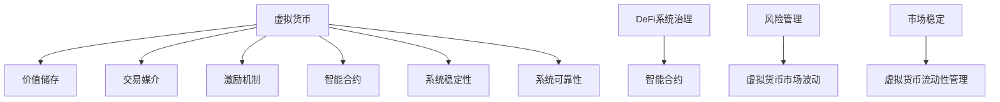

                 

# 虚拟货币与全球脑：去中心化金融的未来

## 1. 背景介绍

去中心化金融(DeFi)，作为区块链技术的重要应用之一，近年来在全球范围内快速发展。DeFi系统通过智能合约等技术，实现在去中心化网络上提供传统金融服务，如借贷、交易、保险、稳定币等。与传统金融系统相比，DeFi具有更高的透明度、更低的成本、更广泛的金融包容性等特点。

然而，DeFi系统在发展过程中也暴露出诸多挑战，如安全漏洞、治理问题、市场波动等。虚拟货币作为DeFi系统的主要运行介质，其自身的波动性和流动性管理问题，进一步加剧了系统的风险和不确定性。

本文将深入探讨虚拟货币在DeFi系统中的关键作用，分析其在金融系统和市场波动中的影响，提出虚拟货币与DeFi系统协同优化的解决方案，为DeFi的未来发展提供新的思路。

## 2. 核心概念与联系

### 2.1 核心概念概述

在DeFi系统中，虚拟货币扮演着至关重要的角色。其主要作用包括：

- **价值储存**：作为数字资产，虚拟货币具备价值储存能力，为DeFi系统的资产管理和借贷服务提供了基础。
- **交易媒介**：作为DeFi系统内的交易媒介，虚拟货币使得系统内的各类金融操作得以顺利进行。
- **激励机制**：虚拟货币作为DeFi系统的激励机制，用于激励节点参与、系统维护和创新发展。
- **智能合约**：虚拟货币在智能合约中作为输入和输出，实现程序化的金融操作和自动化决策。

DeFi系统的治理结构、风险管理和市场稳定等核心问题，都与虚拟货币的使用紧密相关。虚拟货币的流动性管理、市场波动、市值波动等，也直接影响DeFi系统的稳定性和可靠性。

### 2.2 核心概念原理和架构的 Mermaid 流程图



该图展示了虚拟货币在DeFi系统中的核心作用和与系统的关联。虚拟货币作为DeFi系统的基本单位，其功能通过智能合约实现，支持系统的运行和治理。同时，虚拟货币的流动性和市场波动，直接影响系统的稳定性和可靠性。

## 3. 核心算法原理 & 具体操作步骤

### 3.1 算法原理概述

DeFi系统的运行依赖于虚拟货币的价值储存和交易媒介功能，其核心在于智能合约的自动执行和协议设计。虚拟货币在DeFi系统中的作用，通过以下关键算法原理来实现：

- **智能合约**：通过编程方式，实现自动化金融操作和协议执行。智能合约通常包含预先定义的规则，用于处理交易、借贷、稳定币等金融操作。
- **共识机制**：DeFi系统通过共识机制，确保网络参与者对系统状态的同步和信任。共识机制可以是工作量证明(PoW)、权益证明(PoS)等，影响虚拟货币的发行和流动性。
- **市场机制**：DeFi系统通过市场机制，实现虚拟货币的买卖和价格发现。市场机制可以基于订单簿、自动做市商等方式，影响虚拟货币的市场价格和波动性。
- **治理机制**：DeFi系统通过治理机制，实现系统参数的调整和改进。虚拟货币在治理机制中作为投票和激励手段，影响系统的决策和演化。

### 3.2 算法步骤详解

DeFi系统的虚拟货币应用主要包括以下步骤：

**Step 1: 初始化虚拟货币供应**
- 在DeFi系统的智能合约中，初始化虚拟货币的供应量和分配规则。
- 虚拟货币的初始供应量通常基于共识机制和治理决策。

**Step 2: 执行智能合约操作**
- 使用虚拟货币作为输入，执行各种金融操作，如借贷、交易、稳定币铸造等。
- 智能合约的执行规则由程序定义，确保操作透明、可追踪和可验证。

**Step 3: 虚拟货币市场管理**
- 通过市场机制，管理虚拟货币的流动性和价格。
- 市场机制可以包括订单簿、自动做市商、AMM(自动做市商)等，影响虚拟货币的供需和价格发现。

**Step 4: 风险管理和市场稳定**
- 通过风险管理机制，监控虚拟货币的市场波动和系统风险。
- 风险管理机制可以包括保险、抵押、清算等，保障系统的稳定性和安全性。

**Step 5: 系统治理和迭代优化**
- 通过治理机制，调整系统参数和改进系统设计。
- 虚拟货币作为投票和激励手段，参与治理决策和系统演化。

### 3.3 算法优缺点

虚拟货币在DeFi系统中的应用，具有以下优点：

- **去中心化**：虚拟货币作为DeFi系统的基本单位，有助于实现去中心化的金融系统。
- **透明性**：虚拟货币的交易和价值记录，提高了系统的透明度和可追踪性。
- **灵活性**：虚拟货币的多样性和可编程性，支持DeFi系统的多样化和创新发展。

同时，虚拟货币也存在以下缺点：

- **波动性**：虚拟货币的市场波动性较大，影响DeFi系统的稳定性和可靠性。
- **治理复杂**：虚拟货币的治理机制复杂，可能导致系统的决策效率和公平性问题。
- **安全风险**：虚拟货币的安全问题频发，可能导致系统漏洞和攻击风险。

### 3.4 算法应用领域

虚拟货币在DeFi系统中的应用，主要涉及以下几个领域：

- **借贷市场**：虚拟货币作为借贷市场的媒介，支持点对点借贷和DeFi系统的资金融通。
- **稳定币**：虚拟货币作为稳定币的基础，提供货币价格稳定和汇率兑换服务。
- **交易平台**：虚拟货币作为交易平台的输入和输出，支持各种金融交易和市场操作。
- **保险系统**：虚拟货币作为保险的抵押品和支付手段，提供风险管理和补偿服务。

## 4. 数学模型和公式 & 详细讲解

### 4.1 数学模型构建

在DeFi系统中，虚拟货币的流动性和市场波动可以通过数学模型进行建模和分析。我们以虚拟货币市场的供给和需求模型为例，进行详细讲解。

设虚拟货币的市场需求函数为 $D(S,p)$，供给函数为 $S(p)$，其中 $S$ 为虚拟货币的供应量，$p$ 为虚拟货币的市场价格。根据供需平衡的原则，虚拟货币的市场均衡价格可以表示为：

$$
p^* = \frac{D(S^*)}{S^*}
$$

其中 $S^*$ 为虚拟货币的市场均衡供应量，$D(S^*)$ 为市场均衡需求量。

### 4.2 公式推导过程

根据上述模型，我们可以推导出虚拟货币市场的价格发现机制。设虚拟货币的市场初始供应为 $S_0$，初始价格为 $p_0$。市场需求和供给的变动，可以表示为：

$$
D(S,p) = D_0 + \alpha(S-S_0) - \beta(p-p_0)
$$

$$
S(p) = S_0 + \gamma(p-p_0)
$$

其中 $D_0$ 为初始市场需求，$\alpha$ 为需求对供应变化的灵敏度，$\beta$ 为需求对价格变化的灵敏度，$\gamma$ 为供应对价格变化的灵敏度。

将需求和供给函数代入均衡价格公式，得：

$$
p^* = \frac{D_0 + \alpha(S-S_0) - \beta(p-p_0)}{S_0 + \gamma(p-p_0)}
$$

简化得：

$$
p^* = \frac{D_0 - \beta p_0}{S_0 + \gamma p_0} + \frac{\alpha S_0 - \beta S_0}{S_0 + \gamma p_0}
$$

进一步简化得：

$$
p^* = p_0 + \frac{\alpha S_0 - \beta S_0}{S_0 + \gamma p_0}
$$

### 4.3 案例分析与讲解

假设初始供应为 $S_0=1$，初始价格为 $p_0=100$，需求和供给的变化为 $\alpha=0.1$，$\beta=-0.5$，$\gamma=0.2$。市场需求和供应变化分别为：

$$
D(S,p) = 10 + 0.1(S-S_0) - 0.5(p-p_0)
$$

$$
S(p) = 1 + 0.2(p-p_0)
$$

代入均衡价格公式，得：

$$
p^* = 100 + \frac{0.1 \times 1 - 0.5 \times 1}{1 + 0.2 \times 100} = 100 - \frac{0.4}{102} \approx 99.61
$$

因此，虚拟货币的市场均衡价格为 $99.61$，市场处于稳定状态。

## 5. 项目实践：代码实例和详细解释说明

### 5.1 开发环境搭建

在进行DeFi系统开发前，需要准备好开发环境。以下是使用Python进行Web3.js开发的环境配置流程：

1. 安装Node.js：从官网下载并安装Node.js，作为Web3.js运行的基础环境。
2. 安装Web3.js：使用npm安装Web3.js库，进行DeFi系统开发。

```bash
npm install web3
```

3. 创建项目目录：使用npm create项目模板，创建DeFi系统的开发环境。

```bash
npm create webapp
```

4. 配置开发服务器：使用npm start命令启动开发服务器，开始DeFi系统的开发。

```bash
npm start
```

### 5.2 源代码详细实现

以下是一个使用Web3.js进行DeFi系统开发的简单示例，展示了如何部署智能合约并使用虚拟货币进行借贷操作。

```python
from web3 import Web3, HTTPProvider

# 创建Web3实例，连接到Rinkeby测试网
w3 = Web3(HTTPProvider('https://rinkeby.infura.io/v3/{YOUR_INFURA_API_KEY}'))

# 部署智能合约
contract_abi = """
{
  "abi": [
    {
      "constant": false,
      "inputs": [],
      "name": "name",
      "outputs": [],
      "payable": false,
      "stateMutability": "non payable",
      "type": "function"
    },
    {
      "constant": false,
      "inputs": [
        {
          "internalType": "address",
          "name": "user",
          "type": "address"
        },
        {
          "internalType": "uint256",
          "name": "amount",
          "type": "uint256"
        }
      ],
      "name": "borrow",
      "outputs": [],
      "payable": true,
      "stateMutability": "payable",
      "type": "function"
    },
    {
      "constant": false,
      "inputs": [
        {
          "internalType": "address",
          "name": "user",
          "type": "address"
        },
        {
          "internalType": "uint256",
          "name": "amount",
          "type": "uint256"
        }
      ],
      "name": "repay",
      "outputs": [],
      "payable": true,
      "stateMutability": "payable",
      "type": "function"
    }
  ]
}
"""

contract_address = w3.eth.account.account().address

contract = w3.eth.contract(address=contract_address, abi=contract_abi)

# 定义智能合约的初始状态
initial_supply = 100
initial_borrow_limit = 50
initial_repay_limit = 100

# 初始化智能合约
contract.functions.init(initial_supply, initial_borrow_limit, initial_repay_limit).send(
    { 'from': w3.eth.account.account().address, 'value': w3.toWei(initial_supply, 'ether') }
)

# 借贷操作
user_address = w3.eth.account.account().address
amount = w3.toWei(10, 'ether')
borrow_amount = w3.toWei(5, 'ether')

borrow_result = contract.functions.borrow(user_address, borrow_amount).send(
    { 'from': user_address, 'value': borrow_amount }
)

# 还款操作
repay_amount = w3.toWei(5, 'ether')
repay_result = contract.functions.repay(user_address, repay_amount).send(
    { 'from': user_address, 'value': repay_amount }
)
```

### 5.3 代码解读与分析

让我们再详细解读一下关键代码的实现细节：

**智能合约部署**：
- `Web3`模块是Python中与以太坊交互的主要模块，用于连接测试网和部署智能合约。
- 使用`Web3.HTTPProvider`方法连接Rinkeby测试网，初始化`Web3`实例。
- 定义智能合约的ABI接口，包括`name`、`borrow`和`repay`等函数。
- 通过`Web3.eth.contract`方法，部署智能合约，并获取合约地址。

**智能合约初始化**：
- 定义智能合约的初始供应量和借贷限制。
- 使用`init`方法初始化智能合约，将初始供应量发送至合约地址。

**借贷操作**：
- 定义借贷用户的地址和借贷金额。
- 使用`borrow`方法进行借贷操作，发送借贷金额至合约地址。

**还款操作**：
- 定义还款用户的地址和还款金额。
- 使用`repay`方法进行还款操作，发送还款金额至合约地址。

## 6. 实际应用场景

### 6.1 智能合约借贷平台

基于DeFi系统的智能合约借贷平台，可以大幅降低借贷成本，提高借贷效率。通过智能合约的自动化执行，平台可以实时监控借贷状态，确保借贷操作的安全性和透明性。

在具体应用中，平台可以部署多个智能合约，提供多种虚拟货币的借贷服务。用户可以在平台上选择适合自己的虚拟货币，并进行借贷操作。智能合约自动进行借贷记录和资金管理，确保借贷过程的透明和可追溯。

### 6.2 稳定币市场

稳定币作为DeFi系统的重要组成部分，可以提供货币价格的稳定性和汇率兑换服务。通过智能合约的自动做市和市场管理，稳定币市场可以保持相对稳定的价格波动，避免市场剧烈波动带来的风险。

在应用中，稳定币市场可以通过多种机制管理虚拟货币的供需和价格。例如，自动做市商(AMM)可以根据市场供需，自动调整虚拟货币的供需关系，确保市场价格稳定。智能合约还可以设置抵押品要求，防止市场操纵和系统风险。

### 6.3 虚拟货币交易所

虚拟货币交易所作为DeFi系统的核心应用，提供虚拟货币的买卖和交易服务。通过智能合约的自动执行和交易管理，交易所可以降低交易成本，提高交易效率。

在具体应用中，交易所可以部署多种智能合约，支持多种虚拟货币的买卖和交易。智能合约自动进行交易记录和资金管理，确保交易过程的透明和可追溯。交易所还可以引入市场机制和风险管理，保障交易的稳定性和安全性。

### 6.4 未来应用展望

随着DeFi系统的不断发展和虚拟货币技术的进步，未来的应用场景将更加丰富和多样化。以下是几个可能的方向：

- **去中心化交易所**：基于智能合约的自动做市和交易管理，实现完全去中心化的交易所。
- **多币种钱包**：支持多种虚拟货币的存储和管理，提供跨链和互操作性。
- **跨链桥接**：实现不同区块链之间的资产转移和互操作，促进虚拟货币的多链应用。
- **去中心化金融协议**：实现复杂的金融操作和协议执行，如去中心化借贷、保险等。

## 7. 工具和资源推荐

### 7.1 学习资源推荐

为了帮助开发者系统掌握DeFi系统和虚拟货币的理论基础和实践技巧，这里推荐一些优质的学习资源：

1. **《区块链技术与应用》课程**：开设在Coursera平台，由加拿大滑铁卢大学提供，全面介绍了区块链技术和DeFi应用的基本概念和实现方法。
2. **《以太坊智能合约编程》书籍**：由Mithril Protocol开发团队编写，详细讲解了以太坊智能合约的编程技巧和最佳实践。
3. **《智能合约安全与治理》文章**：总结了智能合约的安全问题和治理机制，提供了实际应用中的建议和解决方案。
4. **Web3.js官方文档**：Web3.js的官方文档，提供了丰富的API接口和示例代码，是DeFi系统开发的重要参考。
5. **DeFi合作社**：DeFi系统的社区平台，提供各类DeFi项目和应用的技术讨论和资源分享。

通过对这些资源的学习实践，相信你一定能够快速掌握DeFi系统和虚拟货币的精髓，并用于解决实际的金融问题。

### 7.2 开发工具推荐

高效的开发离不开优秀的工具支持。以下是几款用于DeFi系统和虚拟货币开发的常用工具：

1. **Truffle框架**：基于Solidity语言的开发框架，支持以太坊智能合约的开发和测试。
2. **Remix IDE**：以太坊智能合约的集成开发环境，支持代码编写、测试和调试。
3. **MetaMask浏览器插件**：以太坊钱包和浏览器插件，支持智能合约的交互和测试。
4. **Infura API**：以太坊云服务提供商，提供以太坊网络的API接口，方便开发测试。
5. **OpenZeppelin库**：智能合约的安全库，提供大量的安全机制和最佳实践，降低智能合约的安全风险。

合理利用这些工具，可以显著提升DeFi系统和虚拟货币开发的效率，加快创新迭代的步伐。

### 7.3 相关论文推荐

DeFi系统和虚拟货币的发展源于学界的持续研究。以下是几篇奠基性的相关论文，推荐阅读：

1. **"Decentralized Finance: The Future of Capital Markets?"**：DeFi系统的论文综述，总结了DeFi系统的核心问题和未来发展方向。
2. **"The Ethereum Decentralized Autonomous Organization (DAO)"**：以太坊DAO的论文，探讨了DAO的治理机制和应用场景。
3. **"Smart Contract Security and Privacy: Principles and Practices"**：智能合约安全性的论文，总结了智能合约的安全问题和解决方案。
4. **"Blockchain Smart Contracts: Patterns, Lessons, and Anti-Patterns"**：智能合约设计模式的论文，总结了智能合约的设计和实现经验。
5. **"Tokenomics: Understanding DeFi"**：DeFi系统的经济学论文，探讨了DeFi系统的激励机制和治理结构。

这些论文代表了大语言模型微调技术的发展脉络。通过学习这些前沿成果，可以帮助研究者把握学科前进方向，激发更多的创新灵感。

## 8. 总结：未来发展趋势与挑战

### 8.1 总结

本文对虚拟货币在DeFi系统中的关键作用进行了全面系统的介绍。首先阐述了虚拟货币在DeFi系统中的价值储存、交易媒介和激励机制等核心作用，明确了虚拟货币与DeFi系统的密切联系。其次，从原理到实践，详细讲解了虚拟货币在DeFi系统中的应用过程，给出了DeFi系统开发的完整代码实例。同时，本文还广泛探讨了虚拟货币在DeFi系统的未来应用前景，展示了虚拟货币的巨大潜力。

通过本文的系统梳理，可以看到，虚拟货币作为DeFi系统的基本单位，具有去中心化、透明性和灵活性等特点，为DeFi系统的发展提供了强大的支持。然而，虚拟货币的波动性、治理复杂性和安全风险等挑战，也需要在实践中不断优化和改进。

### 8.2 未来发展趋势

展望未来，DeFi系统和虚拟货币的发展将呈现以下几个趋势：

1. **去中心化程度提升**：随着区块链技术的不断进步，DeFi系统将进一步实现去中心化，降低中心化风险。虚拟货币作为去中心化的媒介，也将得到更广泛的应用。
2. **智能合约自动化程度提高**：智能合约的自动化和可编程性将进一步提升，支持更多复杂和多样化的金融操作。虚拟货币作为智能合约的输入和输出，将发挥更大的作用。
3. **市场机制创新**：DeFi系统的市场机制将不断创新，引入更多的交易机制和激励模型。虚拟货币的供需关系和价格发现机制，将更加高效和稳定。
4. **跨链互操作性增强**：DeFi系统的跨链互操作性将不断增强，支持不同区块链之间的资产转移和互操作。虚拟货币作为跨链桥接的媒介，将发挥更大的作用。
5. **生态系统完善**：DeFi系统的生态系统将不断完善，涵盖更多应用场景和用户需求。虚拟货币作为DeFi系统的基本单位，将推动生态系统的发展。

### 8.3 面临的挑战

尽管DeFi系统和虚拟货币技术已经取得了显著进展，但在迈向更加智能化、普适化应用的过程中，仍面临诸多挑战：

1. **安全问题**：DeFi系统的智能合约和安全机制，需要不断完善和优化，以防止系统漏洞和攻击风险。虚拟货币作为系统的基本单位，其安全性和稳定性直接影响系统的可靠性。
2. **治理结构**：DeFi系统的治理机制需要进一步优化和完善，以提高系统的决策效率和公平性。虚拟货币作为治理手段，需要设计合理的投票和激励机制，确保系统的可持续发展。
3. **市场波动**：虚拟货币的市场波动性较大，需要通过多种机制管理供需和价格，保障系统的稳定性和可靠性。
4. **跨链互操作**：DeFi系统的跨链互操作性需要进一步增强，支持不同区块链之间的资产转移和互操作。虚拟货币作为跨链桥接的媒介，需要设计合理的跨链机制，保障数据和资产的安全。
5. **用户教育**：DeFi系统的用户教育需要进一步加强，提高用户的金融意识和安全防范能力。虚拟货币作为系统的基本单位，需要提供清晰的使用指南和风险提示，保障用户的安全。

### 8.4 研究展望

面对DeFi系统和虚拟货币所面临的挑战，未来的研究需要在以下几个方面寻求新的突破：

1. **智能合约安全机制**：开发更加安全、高效的智能合约，减少系统漏洞和攻击风险。引入多方计算、零知识证明等技术，增强智能合约的隐私保护和安全性。
2. **虚拟货币市场管理**：引入多种市场机制和风险管理工具，管理虚拟货币的供需和价格。设计动态调节机制，保障系统的稳定性和可靠性。
3. **跨链互操作技术**：开发更高效的跨链互操作技术，支持不同区块链之间的资产转移和互操作。引入多重签名、分布式账本等技术，增强跨链系统的安全性。
4. **虚拟货币治理机制**：设计合理的虚拟货币治理机制，提高系统的决策效率和公平性。引入社区治理、治理代币等机制，增强用户参与和激励。
5. **用户教育与普及**：加强用户教育，提高用户的金融意识和安全防范能力。设计简单易用的界面和操作指南，增强用户的使用体验和系统可操作性。

这些研究方向和技术的突破，将有助于DeFi系统和虚拟货币技术的发展和普及，为人类社会带来更加智能、普适的金融服务。

## 9. 附录：常见问题与解答

**Q1：什么是DeFi系统？**

A: DeFi系统是基于区块链技术，通过智能合约和去中心化协议，实现传统金融服务的新型金融系统。其核心思想是去中心化、自动化和金融包容性。

**Q2：虚拟货币在DeFi系统中有哪些作用？**

A: 虚拟货币在DeFi系统中的核心作用包括：价值储存、交易媒介、激励机制和智能合约。虚拟货币作为系统的基本单位，支持各类金融操作和协议执行。

**Q3：DeFi系统的风险管理机制有哪些？**

A: DeFi系统的风险管理机制包括抵押品要求、保险、清算和系统冗余等。通过多重签名、智能合约等技术，保障系统的稳定性和安全性。

**Q4：DeFi系统的治理机制有哪些？**

A: DeFi系统的治理机制包括投票机制、代币激励、社区治理和跨链治理等。通过智能合约和社区参与，实现系统的自适应和自演化。

**Q5：DeFi系统的智能合约有哪些设计原则？**

A: DeFi系统的智能合约设计原则包括透明性、可追踪性、可验证性和自动化等。智能合约的设计需要遵循这些原则，确保操作透明、可追溯和可验证。

---

作者：禅与计算机程序设计艺术 / Zen and the Art of Computer Programming

