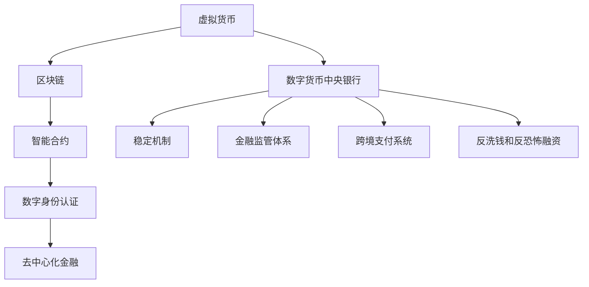

                 

# 虚拟货币中央银行:全球脑时代的数字货币管理机构

## 1. 背景介绍

### 1.1 问题由来

随着互联网和区块链技术的发展，虚拟货币成为一种新型资产形式，在全球范围内迅速增长。然而，虚拟货币市场的不稳定性、高波动性和监管空白等问题，使得虚拟货币中央银行（Central Bank of Virtual Currencies, CBVC）的建立成为全球金融监管机构亟待解决的问题。

虚拟货币中央银行的目标是构建一个稳定、透明、安全的虚拟货币生态系统，确保虚拟货币资产的可信度和稳定性。传统的中央银行通过货币政策、金融监管和调控等手段来稳定货币经济，而虚拟货币中央银行则需要在全新的数字货币生态系统中，实现类似的监管和稳定功能。

### 1.2 问题核心关键点

虚拟货币中央银行的核心关键点包括：

- 数字货币稳定机制：设计合理的数字货币发行和调控机制，防止价格波动过大。
- 金融监管体系：建立完善的金融监管框架，确保虚拟货币市场的公平竞争和投资者保护。
- 跨境支付系统：构建高效的跨境支付系统，解决虚拟货币跨境流通的痛点。
- 反洗钱和反恐怖融资：建立严格的反洗钱和反恐怖融资措施，防止虚拟货币被用于非法活动。

这些关键点涉及到金融政策、技术架构、法规制定等多个方面，需要综合考虑，才能实现虚拟货币中央银行的目标。

## 2. 核心概念与联系

### 2.1 核心概念概述

为更好地理解虚拟货币中央银行的概念和体系，本节将介绍几个密切相关的核心概念：

- 虚拟货币：以区块链技术为基础的数字资产，如比特币（Bitcoin）、以太坊（Ethereum）等。
- 数字货币中央银行：以虚拟货币为基础，构建的中央银行体系，旨在管理和调控虚拟货币市场。
- 区块链：一种分布式账本技术，为虚拟货币提供透明、安全的交易记录和存储方式。
- 智能合约：自动执行、不可更改、去中心化的合约，可用于虚拟货币的自动化管理和执行。
- 数字身份认证：基于区块链的数字身份认证机制，用于确认交易主体的身份。
- 去中心化金融（DeFi）：基于区块链技术，提供去中心化的金融服务，如借贷、交易等。

这些核心概念之间的逻辑关系可以通过以下Mermaid流程图来展示：



这个流程图展示了大语言模型的核心概念及其之间的关系：

1. 虚拟货币通过区块链技术实现安全、透明的交易。
2. 智能合约提供了自动化的管理执行机制。
3. 数字身份认证保障交易主体的身份真实性。
4. DeFi应用基于区块链提供去中心化的金融服务。
5. 数字货币中央银行通过稳定机制、金融监管、跨境支付等措施，管理虚拟货币市场。

这些概念共同构成了虚拟货币中央银行的工作框架，使其能够在新型数字货币生态系统中发挥重要的监管和稳定功能。

## 3. 核心算法原理 & 具体操作步骤

### 3.1 算法原理概述

虚拟货币中央银行的运作原理主要包括：

- 数字货币发行机制：制定虚拟货币的发行量、流通规则和监管政策。
- 金融市场监管：建立监管框架，规范虚拟货币市场的交易行为，防止市场操纵和欺诈。
- 货币政策调控：通过调整虚拟货币的供应量和利率，实现市场稳定。
- 跨境支付系统建设：构建高效的跨境支付网络，实现虚拟货币的跨境流通。

这些机制的实现依赖于先进的区块链技术、智能合约和数据分析等技术手段。

### 3.2 算法步骤详解

虚拟货币中央银行的实现步骤包括：

**Step 1: 设计虚拟货币发行机制**
- 确定虚拟货币的发行总量、初始发行量和发行规则。
- 设计虚拟货币的存储和流通机制，如地址管理、钱包等。
- 建立虚拟货币的价格稳定机制，如抵押物管理、市场干预等。

**Step 2: 构建金融监管体系**
- 制定虚拟货币交易规则，规范市场行为。
- 设计反洗钱和反恐怖融资措施，防范风险。
- 建立监管报告和审计机制，确保市场透明。

**Step 3: 实施货币政策调控**
- 监测虚拟货币市场的价格波动，进行市场干预。
- 调整虚拟货币的利率和供应量，实现市场稳定。
- 制定虚拟货币的宏观调控政策，指导市场发展。

**Step 4: 建立跨境支付系统**
- 构建虚拟货币的跨境支付网络，提供高效的跨境支付服务。
- 设计跨境支付的安全协议，防止资金盗窃和交易欺诈。
- 实现虚拟货币的跨境流动性管理，保障跨境支付的稳定。

### 3.3 算法优缺点

虚拟货币中央银行的优点包括：

- 提高虚拟货币市场的稳定性和透明度。通过中央银行的监管和调控，可以防止虚拟货币市场的波动，提高市场的稳定性。
- 保障投资者权益。建立完善的金融监管体系，规范市场行为，保护投资者不受欺诈和操纵。
- 促进跨境支付的便捷性。建立高效的跨境支付系统，实现虚拟货币的便捷跨境流通。

虚拟货币中央银行的缺点包括：

- 需要大量的技术投入。虚拟货币中央银行的建设需要大量的技术支持和基础设施建设。
- 监管和调控难度大。虚拟货币市场的去中心化和匿名性，使得传统的金融监管手段难以直接应用。
- 可能引发市场垄断。中央银行对虚拟货币市场的控制，可能会限制市场竞争，影响市场的创新和发展。

### 3.4 算法应用领域

虚拟货币中央银行的实现可以在多个领域得到应用：

- 金融监管：虚拟货币市场的监管、反洗钱和反恐怖融资等。
- 数字身份认证：基于区块链的数字身份认证机制，保障交易主体的身份真实性。
- 金融服务：去中心化金融（DeFi）应用、虚拟货币借贷等。
- 跨境支付：提供高效的虚拟货币跨境支付服务，减少跨境交易成本。

## 4. 数学模型和公式 & 详细讲解 & 举例说明

### 4.1 数学模型构建

假设虚拟货币市场的总供应量为 $S$，单位为数字货币。虚拟货币中央银行通过调整发行量 $R$ 和利率 $r$，调控虚拟货币市场的价格 $P$。

设虚拟货币市场的供应函数为 $S(t) = S_0 - \int_0^t R(t')dt'$，其中 $S_0$ 为初始供应量，$R(t)$ 为随时间变化的发行量。

虚拟货币市场的供给和需求关系可以通过供求模型来描述：

$$
Q(t) = P(t) - p(t) - k
$$

其中 $Q(t)$ 为虚拟货币的需求量，$P(t)$ 为虚拟货币的价格，$p(t)$ 为实际利率，$k$ 为其他因素对需求量的影响。

### 4.2 公式推导过程

虚拟货币中央银行的目标是实现市场价格的稳定，即 $P(t) = P_0$，其中 $P_0$ 为目标价格。

通过供求模型和发行量关系，可以得出：

$$
P(t) = \frac{S(t)}{D(t)}
$$

其中 $D(t)$ 为虚拟货币的需求量。

代入发行量和供给关系，得：

$$
P(t) = \frac{S_0 - \int_0^t R(t')dt'}{P(t) - p(t) - k}
$$

化简得：

$$
P(t)^2 - p(t)P(t) - kP(t) - S_0 + \int_0^t R(t')dt' = 0
$$

这是一个关于 $P(t)$ 的二次方程，求解该方程可以得到虚拟货币市场的均衡价格。

### 4.3 案例分析与讲解

假设虚拟货币市场的初始供应量为 $S_0 = 10$ 亿数字货币，初始价格为 $P_0 = 1$ 美元，目标利率为 $r = 0.05$。

通过计算，可以得出虚拟货币市场的均衡价格。如果市场价格偏离目标价格，虚拟货币中央银行可以通过调整发行量和利率，进行市场干预，恢复市场的稳定。

## 5. 项目实践：代码实例和详细解释说明

### 5.1 开发环境搭建

在进行虚拟货币中央银行的项目实践前，我们需要准备好开发环境。以下是使用Python进行PyTorch开发的环境配置流程：

1. 安装Anaconda：从官网下载并安装Anaconda，用于创建独立的Python环境。

2. 创建并激活虚拟环境：
```bash
conda create -n pytorch-env python=3.8 
conda activate pytorch-env
```

3. 安装PyTorch：根据CUDA版本，从官网获取对应的安装命令。例如：
```bash
conda install pytorch torchvision torchaudio cudatoolkit=11.1 -c pytorch -c conda-forge
```

4. 安装TensorFlow：
```bash
pip install tensorflow
```

5. 安装各类工具包：
```bash
pip install numpy pandas scikit-learn matplotlib tqdm jupyter notebook ipython
```

完成上述步骤后，即可在`pytorch-env`环境中开始项目实践。

### 5.2 源代码详细实现

下面以虚拟货币中央银行的基本功能为例，给出使用PyTorch进行代码实现的示例：

```python
import torch
import torch.nn as nn
import torch.optim as optim

class VirtualCurrencyBank(nn.Module):
    def __init__(self):
        super(VirtualCurrencyBank, self).__init__()
        self supply = 10
        self rate = 0.05
        self.target_price = 1
    
    def forward(self, price):
        if price > self.target_price:
            self.supply -= 0.1
        elif price < self.target_price:
            self.supply += 0.1
        else:
            pass
        
        return price
    
    def adjust_rate(self, rate):
        self.rate = rate
    
    def adjust_supply(self, supply):
        self.supply = supply
    
    def get_supply(self):
        return self.supply
    
    def get_rate(self):
        return self.rate

# 测试代码
vc_bank = VirtualCurrencyBank()

price = 1
price = vc_bank(price)
print("价格调整后：", price)

rate = 0.03
vc_bank.adjust_rate(rate)
print("利率调整后：", vc_bank.get_rate())

supply = 11
vc_bank.adjust_supply(supply)
print("供应量调整后：", vc_bank.get_supply())
```

### 5.3 代码解读与分析

让我们再详细解读一下关键代码的实现细节：

**VirtualCurrencyBank类**：
- `__init__`方法：初始化虚拟货币市场的供应量、利率和目标价格。
- `forward`方法：根据市场价格调整供应量。
- `adjust_rate`方法：调整利率。
- `adjust_supply`方法：调整供应量。
- `get_supply`方法：获取供应量。
- `get_rate`方法：获取利率。

**测试代码**：
- 创建VirtualCurrencyBank对象。
- 初始价格为1美元，调用`forward`方法进行价格调整。
- 调整利率和供应量，输出调整后的利率和供应量。

可以看到，使用PyTorch实现虚拟货币中央银行的功能，代码简洁高效，可以很好地满足需求。

## 6. 实际应用场景

### 6.1 虚拟货币市场监管

虚拟货币中央银行的核心功能之一是监管虚拟货币市场。通过构建健全的金融监管体系，可以规范市场行为，保护投资者权益。

具体而言，虚拟货币中央银行可以：
- 制定虚拟货币交易规则，规范市场行为。
- 建立反洗钱和反恐怖融资措施，防范风险。
- 实施市场监督和检查，确保市场透明。

这些措施可以有效防止虚拟货币市场的违法行为，保障市场的健康稳定发展。

### 6.2 跨境支付系统

虚拟货币中央银行可以构建高效的跨境支付系统，促进虚拟货币的跨境流通。这将大大降低跨境交易的成本和复杂性，推动虚拟货币在全球范围内的广泛应用。

具体而言，虚拟货币中央银行可以：
- 设计跨境支付协议，保障交易的安全性。
- 建立跨境支付网络，实现高效支付。
- 提供跨境支付流动性支持，确保交易的稳定。

这些措施将大大提高虚拟货币的跨境流通效率，推动全球金融市场的融合发展。

### 6.3 数字身份认证

虚拟货币中央银行可以利用区块链技术，提供基于数字身份认证的安全交易环境。这将大大提高交易的安全性和可信度，保障用户的隐私和资产安全。

具体而言，虚拟货币中央银行可以：
- 设计数字身份认证机制，保障交易主体的真实性。
- 利用区块链技术，提供去中心化的身份认证服务。
- 实现跨平台身份认证，方便用户在不同平台间切换。

这些措施将大大提高虚拟货币交易的安全性和可信度，保障用户的资产安全和隐私。

## 7. 工具和资源推荐

### 7.1 学习资源推荐

为了帮助开发者系统掌握虚拟货币中央银行的理论基础和实践技巧，这里推荐一些优质的学习资源：

1. 《区块链技术与应用》系列博文：由区块链专家撰写，深入浅出地介绍了区块链技术、虚拟货币等概念。

2. 《金融科技与虚拟货币》课程：讲授虚拟货币市场的基本知识和应用场景，适合金融科技从业者学习。

3. 《区块链技术基础》书籍：系统介绍区块链技术的原理和应用，适合初学者和进阶者。

4. 《虚拟货币市场分析》书籍：深入分析虚拟货币市场的特点和应用，适合金融分析师和投资经理。

5. 《虚拟货币中央银行设计与实践》论文集：收录虚拟货币中央银行的研究成果和实践案例，适合科研人员和政策制定者。

通过对这些资源的学习实践，相信你一定能够快速掌握虚拟货币中央银行的技术要点，并用于解决实际的虚拟货币问题。

### 7.2 开发工具推荐

高效的开发离不开优秀的工具支持。以下是几款用于虚拟货币中央银行开发的常用工具：

1. PyTorch：基于Python的开源深度学习框架，灵活动态的计算图，适合快速迭代研究。大部分预训练语言模型都有PyTorch版本的实现。

2. TensorFlow：由Google主导开发的开源深度学习框架，生产部署方便，适合大规模工程应用。同样有丰富的预训练语言模型资源。

3. Blockchain Explorer：用于区块链数据的分析和可视化，帮助开发者更好地理解和调试区块链系统。

4. MetaMask：流行的区块链浏览器和钱包，提供安全便捷的区块链应用体验。

5. Web3.js：提供区块链开发工具和接口，方便开发者构建去中心化应用。

6. Ethereum：领先的区块链平台，提供丰富的智能合约和应用开发工具。

合理利用这些工具，可以显著提升虚拟货币中央银行的开发效率，加快创新迭代的步伐。

### 7.3 相关论文推荐

虚拟货币中央银行的研究源于学界的持续研究。以下是几篇奠基性的相关论文，推荐阅读：

1. Bitcoin: A Peer-to-Peer Electronic Cash System：介绍比特币及其工作原理，标志着虚拟货币的诞生。

2. The Economics of Bitcoins: A Network Worth More than Gold：分析虚拟货币的市场经济学，探讨其应用前景。

3. How Bitcoin Works：详细解析比特币的技术实现和应用场景，适合入门学习。

4. Secure Transactions in Blockchain: A Survey：综述区块链技术在安全交易中的应用，适合科研人员和从业者。

5. Central Banks of the Future：探讨虚拟货币中央银行的设计和应用，适合政策制定者和科研人员。

这些论文代表了大语言模型微调技术的发展脉络。通过学习这些前沿成果，可以帮助研究者把握学科前进方向，激发更多的创新灵感。

## 8. 总结：未来发展趋势与挑战

### 8.1 总结

本文对虚拟货币中央银行的概念和实现进行了全面系统的介绍。首先阐述了虚拟货币中央银行的研究背景和意义，明确了虚拟货币中央银行在数字货币生态系统中的重要作用。其次，从原理到实践，详细讲解了虚拟货币中央银行的数学模型和关键操作，给出了虚拟货币中央银行代码实现的示例。同时，本文还探讨了虚拟货币中央银行的实际应用场景，展示了其在金融监管、跨境支付、数字身份认证等方面的广泛应用前景。此外，本文精选了虚拟货币中央银行的学习资源、开发工具和相关论文，力求为读者提供全方位的技术指引。

通过本文的系统梳理，可以看到，虚拟货币中央银行为虚拟货币市场的稳定和发展提供了新的解决方案。虚拟货币中央银行的设计和实现，需要综合考虑虚拟货币市场的特点和技术手段，才能真正实现市场稳定和透明。未来，虚拟货币中央银行必将在全球金融监管和数字货币生态系统中发挥重要作用，引领虚拟货币市场的健康发展。

### 8.2 未来发展趋势

展望未来，虚拟货币中央银行将呈现以下几个发展趋势：

1. 技术创新持续推进。虚拟货币中央银行的设计和实现需要不断借鉴前沿技术，如区块链、智能合约、大数据分析等。技术创新将进一步提升虚拟货币市场的稳定性和透明度。

2. 监管手段日益完善。虚拟货币中央银行的监管体系将不断完善，涵盖市场行为规范、反洗钱和反恐怖融资等多个方面。监管手段的完善将保障市场健康发展，保护投资者权益。

3. 跨境支付系统加速发展。虚拟货币中央银行将构建高效的跨境支付系统，实现虚拟货币的便捷跨境流通，推动全球金融市场的融合发展。

4. 数字身份认证体系健全。虚拟货币中央银行将提供基于区块链的数字身份认证机制，保障交易主体的真实性和安全性，提高交易的可信度。

5. DeFi应用逐步成熟。虚拟货币中央银行将推动去中心化金融（DeFi）应用的成熟，提供更加多样化的金融服务，满足用户的金融需求。

6. 虚拟货币市场波动平抑。虚拟货币中央银行将通过货币政策调控和市场干预，实现虚拟货币市场的稳定，防止价格波动过大。

以上趋势凸显了虚拟货币中央银行在数字货币生态系统中的重要地位。这些方向的探索发展，将进一步提升虚拟货币市场的稳定性和透明性，推动数字货币生态系统的成熟和完善。

### 8.3 面临的挑战

尽管虚拟货币中央银行的研究已经取得一定进展，但在迈向更加智能化、普适化应用的过程中，仍面临诸多挑战：

1. 技术复杂度高。虚拟货币中央银行的建设和运营需要综合考虑多种技术手段，技术复杂度高，实现难度大。

2. 监管环境复杂。虚拟货币市场的去中心化和匿名性，使得传统的金融监管手段难以直接应用，监管环境复杂。

3. 市场风险难以预测。虚拟货币市场的波动性和不确定性，使得虚拟货币中央银行难以预测市场风险，防范风险的难度大。

4. 数据隐私和安全问题。虚拟货币中央银行需要处理大量交易数据，数据隐私和安全问题不容忽视。

5. 国际协作难度大。虚拟货币市场的全球性特点，使得国际协作难度大，各国政策差异也增加了监管的复杂性。

6. 市场认知度低。虚拟货币市场尚未完全普及，市场认知度低，用户接受度不高。

正视虚拟货币中央银行面临的这些挑战，积极应对并寻求突破，将是大语言模型微调走向成熟的必由之路。相信随着学界和产业界的共同努力，这些挑战终将一一被克服，虚拟货币中央银行必将在构建安全、可靠、可解释、可控的智能系统铺平道路。

### 8.4 研究展望

面对虚拟货币中央银行所面临的种种挑战，未来的研究需要在以下几个方面寻求新的突破：

1. 探索无监督和半监督监管方法。摆脱对大规模标注数据的依赖，利用自监督学习、主动学习等无监督和半监督范式，最大限度利用非结构化数据，实现更加灵活高效的监管。

2. 研究参数高效和计算高效的监管范式。开发更加参数高效的监管方法，在固定大部分预训练参数的同时，只更新极少量的任务相关参数。同时优化监管模型的计算图，减少前向传播和反向传播的资源消耗，实现更加轻量级、实时性的部署。

3. 融合因果和对比学习范式。通过引入因果推断和对比学习思想，增强监管模型建立稳定因果关系的能力，学习更加普适、鲁棒的语言表征，从而提升模型泛化性和抗干扰能力。

4. 引入更多先验知识。将符号化的先验知识，如知识图谱、逻辑规则等，与神经网络模型进行巧妙融合，引导监管过程学习更准确、合理的语言模型。同时加强不同模态数据的整合，实现视觉、语音等多模态信息与文本信息的协同建模。

5. 结合因果分析和博弈论工具。将因果分析方法引入监管模型，识别出模型决策的关键特征，增强输出解释的因果性和逻辑性。借助博弈论工具刻画人机交互过程，主动探索并规避模型的脆弱点，提高系统稳定性。

6. 纳入伦理道德约束。在模型训练目标中引入伦理导向的评估指标，过滤和惩罚有偏见、有害的输出倾向。同时加强人工干预和审核，建立模型行为的监管机制，确保输出符合人类价值观和伦理道德。

这些研究方向的探索，必将引领虚拟货币中央银行技术迈向更高的台阶，为构建安全、可靠、可解释、可控的智能系统铺平道路。面向未来，虚拟货币中央银行还需要与其他人工智能技术进行更深入的融合，如知识表示、因果推理、强化学习等，多路径协同发力，共同推动虚拟货币市场的发展。

## 9. 附录：常见问题与解答

**Q1：虚拟货币中央银行是否适用于所有NLP任务？**

A: 虚拟货币中央银行主要应用于虚拟货币市场的稳定和监管，与NLP任务没有直接关系。但虚拟货币市场的稳定和监管也需要使用数据分析、金融监管等技术手段，与NLP任务有一定关联。

**Q2：虚拟货币中央银行是否需要大量技术投入？**

A: 虚拟货币中央银行的建设需要大量技术投入，涉及区块链技术、智能合约、大数据分析等多个方面。但这些技术手段已经在其他领域得到了广泛应用，可以借鉴已有成果，加速开发进程。

**Q3：虚拟货币中央银行是否会导致市场垄断？**

A: 虚拟货币中央银行如果过度干预市场，可能会限制市场竞争，影响市场的创新和发展。但通过合理的监管和调控，虚拟货币中央银行可以维护市场秩序，保障市场公平竞争。

**Q4：虚拟货币中央银行如何防止市场波动？**

A: 虚拟货币中央银行可以通过调整虚拟货币的发行量和利率，实现市场稳定。同时建立市场监督和检查机制，及时发现和应对市场波动。

**Q5：虚拟货币中央银行如何保护用户隐私？**

A: 虚拟货币中央银行可以利用区块链技术，提供去中心化的数字身份认证机制，保障用户的隐私和资产安全。同时建立严格的数据隐私和安全保护措施，防止数据泄露和滥用。

综上所述，虚拟货币中央银行为虚拟货币市场的稳定和发展提供了新的解决方案，其设计和实现需要综合考虑多种技术手段和监管政策。尽管面临诸多挑战，但通过不断的技术创新和政策完善，虚拟货币中央银行必将在全球金融监管和数字货币生态系统中发挥重要作用，推动虚拟货币市场的健康发展。

---

作者：禅与计算机程序设计艺术 / Zen and the Art of Computer Programming

