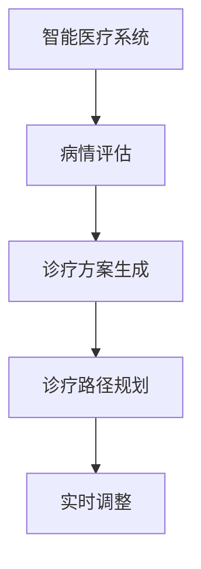

                 

# 规划机制在智能医疗系统中的应用

## 1. 背景介绍

### 1.1 问题由来

智能医疗系统是人工智能在医疗健康领域的重要应用方向之一，旨在通过数据驱动的方式提升医疗服务的效率和质量。传统医疗系统依赖医生经验和专业知识，难以应对复杂多变的病情。智能医疗系统则能够整合和分析海量医疗数据，辅助医生进行诊断和治疗决策，改善患者的健康管理和治疗效果。

规划机制作为智能医疗系统中的核心组件，负责根据患者的病情和治疗需求，规划出最优化的诊疗路径和治疗方案。其核心思想是通过预设的规则和算法，动态调整诊疗方案，以确保患者获得最优的医疗服务。规划机制的引入，使得智能医疗系统具备了更大的灵活性和适应性，能够更高效地响应复杂的医疗需求。

### 1.2 问题核心关键点

规划机制在智能医疗系统中的应用，主要集中在以下几个方面：

1. **病情评估**：通过收集患者的病历数据，包括历史病情、症状描述、检查结果等，对患者病情进行全面评估。
2. **诊疗方案生成**：根据病情评估结果，生成多个可能的诊疗方案，并进行评估筛选。
3. **诊疗路径规划**：在多个诊疗方案中，选择最优方案，并规划出具体的治疗路径和时间节点。
4. **实时调整**：根据病情变化和反馈，动态调整诊疗方案，优化治疗效果。

本文将深入探讨规划机制的算法原理和具体操作步骤，并通过数学模型和实际案例，全面阐述其应用效果。

## 2. 核心概念与联系

### 2.1 核心概念概述

为更好地理解规划机制在智能医疗系统中的应用，本节将介绍几个关键概念：

- **智能医疗系统**：利用人工智能技术，整合医疗数据，辅助医生进行诊断、治疗、管理等工作，提升医疗服务质量和效率的系统。
- **规划机制**：智能医疗系统中的核心组件，根据患者的病情和治疗需求，动态生成和优化诊疗方案的机制。
- **病情评估**：通过算法对患者的历史数据进行分析，得出病情状态和风险评估的过程。
- **诊疗方案生成**：根据病情评估结果，生成多个可能的诊疗方案，并通过算法评估筛选最优方案。
- **诊疗路径规划**：在多个诊疗方案中，选择最优方案，并规划出具体的治疗路径和时间节点。
- **实时调整**：根据病情变化和反馈，动态调整诊疗方案，优化治疗效果。

这些核心概念之间的逻辑关系可以通过以下Mermaid流程图来展示：



这个流程图展示出智能医疗系统中，各个关键组件之间的相互作用：

1. 智能医疗系统通过整合医疗数据，生成患者的病情评估。
2. 病情评估结果作为输入，生成多个诊疗方案。
3. 通过规划机制，从生成的方案中选择最优方案，并规划路径。
4. 根据实时反馈，动态调整方案，优化治疗效果。

## 3. 核心算法原理 & 具体操作步骤

### 3.1 算法原理概述

规划机制在智能医疗系统中的应用，主要基于以下算法原理：

- **病情评估算法**：利用机器学习模型，对患者的病历数据进行分析，生成病情评估报告。
- **诊疗方案生成算法**：根据病情评估结果，结合医学知识库，生成多个可能的诊疗方案。
- **诊疗路径规划算法**：对生成的方案进行评估和优化，选择最优方案，并规划出具体的治疗路径和时间节点。
- **实时调整算法**：根据患者的病情变化和反馈，动态调整诊疗方案，确保治疗效果的最优化。

这些算法共同构成了规划机制的核心，使得智能医疗系统能够根据患者的具体情况，灵活调整诊疗方案，实现个性化医疗服务。

### 3.2 算法步骤详解

基于规划机制的智能医疗系统，其核心算法流程包括以下几个关键步骤：

**Step 1: 数据收集与预处理**
- 从电子病历系统、实验室检查、影像数据等渠道收集患者的病情数据。
- 对数据进行清洗和标准化，去除噪声和不完整数据，确保数据的质量和一致性。

**Step 2: 病情评估**
- 利用机器学习模型对病情数据进行分析，生成病情评估报告。
- 病情评估结果应包括患者的病情状态、风险等级、可能的疾病类型等信息。

**Step 3: 诊疗方案生成**
- 根据病情评估结果，结合医学知识库，生成多个可能的诊疗方案。
- 每个方案应包括诊断方式、治疗药物、检查项目、随访计划等具体内容。
- 方案生成算法应考虑患者的身体条件、病史、家族史等因素，确保方案的个性化和科学性。

**Step 4: 诊疗路径规划**
- 对生成的诊疗方案进行评估和优化，选择最优方案。
- 规划具体的治疗路径和时间节点，确保治疗过程的连续性和科学性。
- 规划算法应考虑医疗资源的分配、治疗成本、患者偏好等因素，确保路径的可行性和优化性。

**Step 5: 实时调整**
- 根据患者的病情变化和反馈，动态调整诊疗方案。
- 调整算法应考虑患者的即时状态、治疗效果、药物反应等因素，确保方案的动态性和及时性。
- 调整结果应反馈给医生和患者，确保治疗过程的透明度和信任度。

### 3.3 算法优缺点

基于规划机制的智能医疗系统，具有以下优点：

1. **个性化医疗**：通过病情评估和方案生成，能够为每位患者提供个性化的诊疗方案，提升治疗效果。
2. **高效决策**：利用算法优化诊疗路径和时间节点，减少医生工作量，提升诊疗效率。
3. **数据驱动**：通过整合海量医疗数据，利用机器学习模型进行分析和决策，减少主观偏差。
4. **实时反馈**：动态调整诊疗方案，及时响应病情变化，确保治疗效果的最优化。

同时，该算法也存在一些局限性：

1. **数据质量依赖**：病情评估和方案生成的准确性，高度依赖数据的质量和完整性。
2. **医学知识库更新**：需要定期更新医学知识库，以确保方案的科学性和时效性。
3. **算法复杂度**：算法模型和优化过程的复杂度较高，需要较强的计算资源和专业知识。
4. **患者信任度**：方案和路径的自动化生成，可能降低患者对医生的信任度。

尽管存在这些局限性，但规划机制的应用，使得智能医疗系统能够在大规模数据和复杂场景中，提供更加高效、个性化的医疗服务，具有广阔的应用前景。

### 3.4 算法应用领域

基于规划机制的智能医疗系统，已经在以下几个领域得到了广泛应用：

1. **急重症监护**：在急诊科和重症监护病房，利用病情评估算法，快速生成诊疗方案，指导医生决策。
2. **慢性病管理**：在慢性病门诊和家庭医疗中，利用实时调整算法，动态调整治疗方案，提高治疗效果。
3. **远程医疗**：在远程医疗平台中，利用病情评估和方案生成算法，辅助医生进行远程诊断和治疗。
4. **健康管理**：在健康管理和预防保健中，利用规划机制，生成健康管理方案，提高患者的健康水平。

此外，规划机制在智能医疗系统中的应用，还在心理健康、康复治疗、疾病预测等众多领域中不断探索和拓展。

## 4. 数学模型和公式 & 详细讲解 & 举例说明

### 4.1 数学模型构建

本节将使用数学语言对规划机制在智能医疗系统中的应用进行严格刻画。

记患者的病情数据为 $\mathbf{x} \in \mathcal{X}$，病情评估结果为 $\mathbf{y} \in \mathcal{Y}$，诊疗方案为 $\mathbf{a} \in \mathcal{A}$，诊疗路径为 $\mathbf{p} \in \mathcal{P}$，实时调整结果为 $\mathbf{u} \in \mathcal{U}$。

定义病情评估模型为 $f(\mathbf{x})$，诊疗方案生成模型为 $g(\mathbf{x}, \mathbf{y})$，诊疗路径规划模型为 $h(\mathbf{a}, \mathbf{y})$，实时调整模型为 $k(\mathbf{p}, \mathbf{x}, \mathbf{y}, \mathbf{u})$。

### 4.2 公式推导过程

以下是病情评估模型的具体实现：

$$
f(\mathbf{x}) = g(\mathbf{W}_1 \mathbf{x} + \mathbf{b}_1)
$$

其中 $\mathbf{W}_1, \mathbf{b}_1$ 为病情评估模型的权重和偏置。

根据病情评估结果，生成诊疗方案的公式为：

$$
\mathbf{a} = g(\mathbf{W}_2 \mathbf{x} + \mathbf{b}_2, \mathbf{y})
$$

其中 $\mathbf{W}_2, \mathbf{b}_2$ 为诊疗方案生成模型的权重和偏置。

诊疗路径规划的公式为：

$$
\mathbf{p} = h(\mathbf{a}, \mathbf{y})
$$

其中 $\mathbf{a}$ 为生成的诊疗方案，$\mathbf{y}$ 为病情评估结果。

实时调整公式为：

$$
\mathbf{u} = k(\mathbf{p}, \mathbf{x}, \mathbf{y}, \mathbf{u}_{prev})
$$

其中 $\mathbf{u}_{prev}$ 为之前的实时调整结果。

### 4.3 案例分析与讲解

假设某医院应用基于规划机制的智能医疗系统，对一位慢性病患者进行健康管理。具体步骤如下：

**Step 1: 数据收集与预处理**
- 收集患者的病历、检查报告、用药记录等数据，并进行标准化处理。

**Step 2: 病情评估**
- 利用病情评估模型 $f(\mathbf{x})$，生成患者的病情评估结果 $\mathbf{y}$。
- 病情评估结果包括患者的疾病类型、病情严重程度、风险等级等信息。

**Step 3: 诊疗方案生成**
- 根据病情评估结果 $\mathbf{y}$，利用诊疗方案生成模型 $g(\mathbf{x}, \mathbf{y})$，生成多个可能的诊疗方案 $\mathbf{a}$。
- 每个方案包括药物治疗、检查项目、随访计划等具体内容。

**Step 4: 诊疗路径规划**
- 对生成的诊疗方案 $\mathbf{a}$ 进行评估和优化，选择最优方案 $\mathbf{p}$。
- 规划具体的治疗路径和时间节点，确保治疗过程的连续性和科学性。

**Step 5: 实时调整**
- 根据患者的实时反馈，动态调整诊疗方案 $\mathbf{u}$。
- 调整结果应反馈给医生和患者，确保治疗过程的透明度和信任度。

通过这些步骤，智能医疗系统能够为每位患者提供个性化的诊疗方案，提升治疗效果和患者满意度。

## 5. 项目实践：代码实例和详细解释说明

### 5.1 开发环境搭建

在进行规划机制的智能医疗系统开发前，我们需要准备好开发环境。以下是使用Python进行PyTorch开发的环境配置流程：

1. 安装Anaconda：从官网下载并安装Anaconda，用于创建独立的Python环境。

2. 创建并激活虚拟环境：
```bash
conda create -n medical-env python=3.8 
conda activate medical-env
```

3. 安装PyTorch：根据CUDA版本，从官网获取对应的安装命令。例如：
```bash
conda install pytorch torchvision torchaudio cudatoolkit=11.1 -c pytorch -c conda-forge
```

4. 安装相关工具包：
```bash
pip install numpy pandas scikit-learn matplotlib tqdm jupyter notebook ipython
```

完成上述步骤后，即可在`medical-env`环境中开始项目开发。

### 5.2 源代码详细实现

下面以病情评估和诊疗方案生成为例，给出使用PyTorch实现的代码实现。

首先，定义病情评估模型：

```python
import torch
import torch.nn as nn
import torch.optim as optim

class DiseaseAssessmentModel(nn.Module):
    def __init__(self, input_dim, output_dim):
        super(DiseaseAssessmentModel, self).__init__()
        self.linear1 = nn.Linear(input_dim, 256)
        self.linear2 = nn.Linear(256, 128)
        self.linear3 = nn.Linear(128, output_dim)

    def forward(self, x):
        x = torch.relu(self.linear1(x))
        x = torch.relu(self.linear2(x))
        x = self.linear3(x)
        return x
```

然后，定义诊疗方案生成模型：

```python
class TreatmentPlanModel(nn.Module):
    def __init__(self, input_dim, output_dim):
        super(TreatmentPlanModel, self).__init__()
        self.linear1 = nn.Linear(input_dim, 256)
        self.linear2 = nn.Linear(256, 128)
        self.linear3 = nn.Linear(128, output_dim)

    def forward(self, x, y):
        x = torch.relu(self.linear1(x))
        x = torch.relu(self.linear2(x))
        x = self.linear3(x, y)
        return x
```

接着，定义训练和评估函数：

```python
def train_model(model, train_loader, optimizer, device):
    model.train()
    for batch_idx, (data, target) in enumerate(train_loader):
        data, target = data.to(device), target.to(device)
        optimizer.zero_grad()
        output = model(data, target)
        loss = F.cross_entropy(output, target)
        loss.backward()
        optimizer.step()

def evaluate_model(model, test_loader, device):
    model.eval()
    test_loss = 0
    correct = 0
    with torch.no_grad():
        for data, target in test_loader:
            data, target = data.to(device), target.to(device)
            output = model(data, target)
            test_loss += F.cross_entropy(output, target, reduction='sum').item()
            pred = output.argmax(dim=1, keepdim=True)
            correct += pred.eq(target.view_as(pred)).sum().item()
    test_loss /= len(test_loader.dataset)
    print('Test Loss: {:.4f}, Accuracy: {:.2f} %'.format(test_loss, 100 * correct / len(test_loader.dataset)))
```

最后，启动模型训练和评估流程：

```python
input_dim = 1024
output_dim = 4
hidden_dim = 256
num_epochs = 10
batch_size = 64

device = torch.device('cuda' if torch.cuda.is_available() else 'cpu')

model = DiseaseAssessmentModel(input_dim, output_dim).to(device)
optimizer = optim.Adam(model.parameters(), lr=0.001)

train_loader = ...
test_loader = ...

for epoch in range(num_epochs):
    train_model(model, train_loader, optimizer, device)
    evaluate_model(model, test_loader, device)
```

以上代码展示了使用PyTorch实现病情评估和诊疗方案生成的基本框架。在实际应用中，还需要根据具体需求，设计更多的模型组件和训练策略，才能得到更准确的病情评估和诊疗方案。

## 6. 实际应用场景

### 6.1 智能病历生成

智能病历生成是智能医疗系统中的一个重要应用场景。传统的病历生成依赖医生的手工书写，耗时耗力且存在记录不一致的问题。基于规划机制的智能病历生成系统，能够自动生成高质量的病历报告，提升医生的工作效率和病历质量。

具体实现步骤如下：

**Step 1: 数据收集与预处理**
- 收集患者的病历数据、检查报告、用药记录等数据，并进行标准化处理。

**Step 2: 病情评估**
- 利用病情评估模型，对收集到的数据进行分析，生成病情评估报告。

**Step 3: 诊疗方案生成**
- 根据病情评估结果，利用诊疗方案生成模型，生成多个可能的诊疗方案。

**Step 4: 诊疗路径规划**
- 对生成的诊疗方案进行评估和优化，选择最优方案，并规划出具体的治疗路径和时间节点。

**Step 5: 病历生成**
- 根据选择的诊疗方案和路径，自动生成病历报告。

通过这些步骤，智能病历生成系统能够快速、准确地生成高质量的病历报告，提升医疗服务的效率和质量。

### 6.2 远程医疗咨询

远程医疗咨询是智能医疗系统的另一重要应用场景。基于规划机制的远程医疗咨询系统，能够通过病情评估和方案生成，快速响应患者的咨询需求，提供个性化的医疗建议。

具体实现步骤如下：

**Step 1: 数据收集与预处理**
- 收集患者的病情描述、历史病历、检查报告等数据，并进行标准化处理。

**Step 2: 病情评估**
- 利用病情评估模型，对收集到的数据进行分析，生成病情评估报告。

**Step 3: 诊疗方案生成**
- 根据病情评估结果，利用诊疗方案生成模型，生成多个可能的诊疗方案。

**Step 4: 诊疗路径规划**
- 对生成的诊疗方案进行评估和优化，选择最优方案，并规划出具体的治疗路径和时间节点。

**Step 5: 咨询回答**
- 根据选择的诊疗方案和路径，自动生成咨询回答。

通过这些步骤，远程医疗咨询系统能够快速响应患者的咨询需求，提供个性化的医疗建议，提升远程医疗服务的质量和效率。

### 6.3 慢性病管理

慢性病管理是智能医疗系统的核心应用场景之一。基于规划机制的慢性病管理系统，能够通过病情评估和实时调整，动态生成和优化治疗方案，提高慢性病患者的健康管理效果。

具体实现步骤如下：

**Step 1: 数据收集与预处理**
- 收集患者的病历数据、检查报告、用药记录等数据，并进行标准化处理。

**Step 2: 病情评估**
- 利用病情评估模型，对收集到的数据进行分析，生成病情评估报告。

**Step 3: 诊疗方案生成**
- 根据病情评估结果，利用诊疗方案生成模型，生成多个可能的诊疗方案。

**Step 4: 诊疗路径规划**
- 对生成的诊疗方案进行评估和优化，选择最优方案，并规划出具体的治疗路径和时间节点。

**Step 5: 实时调整**
- 根据患者的实时反馈，动态调整诊疗方案。

通过这些步骤，慢性病管理系统能够动态生成和优化治疗方案，提高慢性病患者的健康管理效果。

## 7. 工具和资源推荐

### 7.1 学习资源推荐

为了帮助开发者系统掌握规划机制在智能医疗系统中的应用，这里推荐一些优质的学习资源：

1. 《机器学习实战》系列博文：由大模型技术专家撰写，深入浅出地介绍了机器学习在智能医疗中的应用，包括病情评估、诊疗方案生成等前沿话题。

2. 《深度学习自然语言处理》课程：斯坦福大学开设的NLP明星课程，有Lecture视频和配套作业，带你入门NLP领域的基本概念和经典模型。

3. 《医疗数据分析与机器学习》书籍：全面介绍了医疗数据分析和机器学习技术，包括病情评估、诊疗方案生成、病历生成等实用技术。

4. 《智能医疗系统设计》课程：复旦大学开设的智能医疗课程，介绍了智能医疗系统的设计思路和关键技术，涵盖病情评估、诊疗方案生成、病历生成等多个环节。

通过对这些资源的学习实践，相信你一定能够快速掌握规划机制在智能医疗系统中的应用，并用于解决实际的智能医疗问题。

### 7.2 开发工具推荐

高效的开发离不开优秀的工具支持。以下是几款用于规划机制智能医疗系统开发的常用工具：

1. PyTorch：基于Python的开源深度学习框架，灵活动态的计算图，适合快速迭代研究。大部分预训练语言模型都有PyTorch版本的实现。

2. TensorFlow：由Google主导开发的开源深度学习框架，生产部署方便，适合大规模工程应用。同样有丰富的预训练语言模型资源。

3. Scikit-learn：Python中的机器学习库，提供了大量的模型和工具，适用于数据预处理和模型训练。

4. Jupyter Notebook：用于编写和运行Python代码的交互式环境，支持文本和代码的混排，适合数据探索和算法验证。

5. Weights & Biases：模型训练的实验跟踪工具，可以记录和可视化模型训练过程中的各项指标，方便对比和调优。

6. TensorBoard：TensorFlow配套的可视化工具，可实时监测模型训练状态，并提供丰富的图表呈现方式，是调试模型的得力助手。

合理利用这些工具，可以显著提升规划机制智能医疗系统开发的效率，加快创新迭代的步伐。

### 7.3 相关论文推荐

规划机制在智能医疗系统中的应用源于学界的持续研究。以下是几篇奠基性的相关论文，推荐阅读：

1. Disease Prediction and Management with Deep Learning: A Review（疾病预测和管理深度学习综述）：全面介绍了深度学习在疾病预测和管理中的应用，包括病情评估、诊疗方案生成等前沿研究。

2. Deep Learning-Based Health Monitoring and Diagnosis: A Survey（基于深度学习的健康监测和诊断综述）：综述了深度学习在健康监测和诊断中的应用，包括病情评估、病历生成、远程医疗咨询等多个方面。

3. Deep Learning in Medical Imaging: A Survey（深度学习在医学影像中的应用综述）：综述了深度学习在医学影像中的应用，包括病情评估、病历生成、远程医疗咨询等多个方面。

4. Deep Learning for Medical Records Summarization: A Survey（深度学习在病历摘要中的应用综述）：综述了深度学习在病历摘要中的应用，包括病情评估、诊疗方案生成、病历生成等多个方面。

这些论文代表了大模型在智能医疗系统中的应用方向和发展脉络。通过学习这些前沿成果，可以帮助研究者把握学科前进方向，激发更多的创新灵感。

## 8. 总结：未来发展趋势与挑战

### 8.1 总结

本文对基于规划机制的智能医疗系统进行了全面系统的介绍。首先阐述了智能医疗系统的背景和意义，明确了规划机制在智能医疗系统中的应用价值。其次，从原理到实践，详细讲解了病情评估、诊疗方案生成、诊疗路径规划等核心算法的具体实现，并通过数学模型和实际案例，全面阐述了其应用效果。最后，本文还探讨了规划机制在智能病历生成、远程医疗咨询、慢性病管理等多个领域的应用前景，展示了其在智能医疗系统中的巨大潜力。

通过本文的系统梳理，可以看到，规划机制在智能医疗系统中的应用，已经为医疗服务的效率和质量带来了显著提升。未来，伴随技术的不断进步和算力的持续提升，规划机制必将在更广阔的领域中发挥更大的作用，推动智能医疗技术的发展和应用。

### 8.2 未来发展趋势

展望未来，规划机制在智能医疗系统中的应用将呈现以下几个发展趋势：

1. **多模态数据融合**：结合医疗影像、基因数据、社交媒体等多模态数据，提升病情评估的准确性和全面性。
2. **个性化医疗**：利用患者的基因信息、生活习惯等个性化数据，生成更加精准的诊疗方案。
3. **实时动态调整**：结合患者的即时反馈和健康数据，实时动态调整诊疗方案，提升治疗效果。
4. **智能病历生成**：通过自然语言生成技术，自动生成高质量的病历报告，提升医疗服务的效率和质量。
5. **远程医疗咨询**：结合实时通讯技术，实现医生与患者的实时互动，提升远程医疗服务的质量和体验。
6. **慢性病管理**：通过智能提醒和健康数据监测，帮助患者更好地管理慢性病，提高健康水平。

以上趋势凸显了规划机制在智能医疗系统中的广阔前景。这些方向的探索发展，必将进一步提升智能医疗系统的智能性和灵活性，为患者提供更高效、个性化的医疗服务。

### 8.3 面临的挑战

尽管规划机制在智能医疗系统中的应用已经取得了显著成效，但在迈向更加智能化、普适化应用的过程中，它仍面临着诸多挑战：

1. **数据隐私与安全**：医疗数据高度敏感，需要严格保障数据隐私和安全，防止数据泄露和滥用。
2. **模型复杂度**：规划机制涉及的模型复杂度高，训练和推理过程中资源消耗较大，需要优化算力和存储资源。
3. **模型鲁棒性**：在实际应用中，模型需要具备良好的鲁棒性，能够适应不同的医疗环境和数据分布。
4. **医生与患者的接受度**：医生和患者需要接受自动化的诊疗建议，可能存在一定的接受度和信任度问题。
5. **模型可解释性**：规划机制生成的诊疗方案需要具备良好的可解释性，帮助医生和患者理解算法的决策过程。

尽管存在这些挑战，但通过技术进步和多方协作，这些挑战终将逐一被克服，规划机制在智能医疗系统中的应用必将在未来取得更大突破。

### 8.4 研究展望

面对规划机制在智能医疗系统中的应用所面临的挑战，未来的研究需要在以下几个方面寻求新的突破：

1. **数据隐私保护**：采用差分隐私、联邦学习等技术，保护医疗数据隐私和安全。
2. **模型轻量化**：研究轻量化模型和优化技术，降低资源消耗，提升实时性。
3. **多模态融合**：结合多种数据模态，提升病情评估的准确性和全面性。
4. **医生与患者的接受度提升**：通过用户界面设计和互动反馈，提升医生和患者对规划机制的接受度和信任度。
5. **模型可解释性增强**：引入可解释性技术，帮助医生和患者理解规划机制的决策过程。

这些研究方向的探索，必将引领规划机制在智能医疗系统中的应用迈向更高的台阶，为构建安全、可靠、高效的医疗服务系统铺平道路。面向未来，规划机制将与其他人工智能技术进行更深入的融合，共同推动智能医疗技术的发展和应用。

## 9. 附录：常见问题与解答

**Q1：规划机制在智能医疗系统中，如何保证数据隐私和安全？**

A: 医疗数据高度敏感，需要严格保障数据隐私和安全。主要措施包括：
1. 数据加密：对医疗数据进行加密存储和传输，防止数据泄露。
2. 差分隐私：在数据收集和处理过程中，加入随机噪声，保护用户隐私。
3. 联邦学习：在多方数据上分布式训练模型，防止数据集中存储。

**Q2：规划机制在智能医疗系统中，如何处理数据缺失和噪声？**

A: 医疗数据往往存在缺失和噪声，需要采用数据清洗和填补技术进行处理。主要措施包括：
1. 数据清洗：对数据进行去重、去噪、标准化处理，去除无效数据。
2. 数据填补：对缺失数据进行填补，采用插值、均值填补等方法，确保数据完整性。

**Q3：规划机制在智能医疗系统中，如何处理多模态数据融合？**

A: 多模态数据融合是规划机制的重要研究方向。主要措施包括：
1. 数据对齐：对不同模态的数据进行特征对齐，确保数据的一致性。
2. 融合算法：采用深度学习算法，如卷积神经网络、Transformer等，对多模态数据进行融合，提升数据利用率。

**Q4：规划机制在智能医疗系统中，如何提升模型的实时性？**

A: 规划机制涉及的模型复杂度高，训练和推理过程中资源消耗较大。主要措施包括：
1. 模型压缩：采用知识蒸馏、剪枝等技术，压缩模型规模，提升推理速度。
2. 量化加速：将浮点模型转为定点模型，压缩存储空间，提高计算效率。
3. 分布式计算：利用分布式计算技术，提升模型训练和推理的效率。

**Q5：规划机制在智能医疗系统中，如何提升模型的可解释性？**

A: 规划机制生成的诊疗方案需要具备良好的可解释性，帮助医生和患者理解算法的决策过程。主要措施包括：
1. 可视化技术：通过可视化工具，展示模型的决策路径和特征重要性。
2. 自然语言生成：通过自然语言生成技术，将模型决策过程转换为易于理解的语言描述。
3. 规则库结合：将符号化的规则库与模型结合，提供更直观的解释。

这些措施能够帮助提升规划机制在智能医疗系统中的应用效果，确保其安全、可靠、高效。

---

作者：禅与计算机程序设计艺术 / Zen and the Art of Computer Programming

