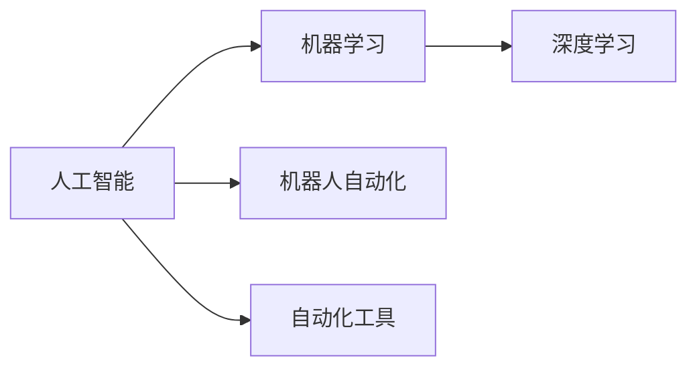

                 

# 计算变化带来的自动化新机遇

> 关键词：计算自动化, 人工智能, 机器学习, 深度学习, 机器人自动化, 自动化工具

## 1. 背景介绍

随着计算技术的飞速发展，自动化已经成为当前科技变革的核心驱动力之一。从早期的手动操作到现在的高度自动化，计算技术的进步为各行各业带来了翻天覆地的变化。人工智能、机器学习、深度学习等技术的发展，更是为自动化赋予了智能的翅膀，推动了自动化的边界不断拓展，自动化程度日益提高。

### 1.1 计算自动化的演变

计算自动化的历程可以追溯到计算机的诞生。最初，计算机被设计用于解决复杂计算问题，但随着技术的进步，其应用范围逐渐扩展到数据处理、控制、决策等多个领域。自动化技术经历了从手工编程到脚本语言、再到高级编程语言的演进，最终发展到了人工智能、机器学习、深度学习等领域的高度自动化。

### 1.2 自动化技术的应用

自动化技术如今已经广泛应用于制造业、医疗、金融、交通、教育等多个领域，极大地提升了各行业的生产效率和运行效率。自动化系统通过智能化的决策和控制，能够处理复杂的业务流程，减少人为错误，优化资源配置，降低成本。例如，工业机器人能够代替人类完成危险、重复的劳动任务，医疗机器人能够辅助医生进行手术和治疗，金融机器人能够进行风险控制和投资决策，交通机器人能够进行交通管理和服务。

## 2. 核心概念与联系

### 2.1 核心概念概述

本节将介绍几个关键概念，帮助我们更好地理解计算自动化带来的新机遇：

- **人工智能**：通过模拟人类智能行为，使机器具备理解、学习、推理、决策等能力。人工智能的核心在于机器学习和深度学习技术，通过训练大量数据，使得机器能够自动地从数据中学习规律，进行预测和决策。

- **机器学习**：机器学习是人工智能的重要分支，通过算法使机器能够从数据中学习，自动改善性能。常见的机器学习算法包括监督学习、无监督学习和强化学习。

- **深度学习**：深度学习是机器学习的一种特殊形式，通过构建多层神经网络，使机器能够自动地处理复杂的数据，并进行有效的特征提取和模式识别。

- **机器人自动化**：利用人工智能和机器学习技术，使机器人能够自主地完成复杂任务，提高生产效率和质量。

- **自动化工具**：指用于自动化流程的软件和硬件工具，包括脚本语言、编程语言、自动化测试工具、工业控制系统等。

这些核心概念构成了计算自动化的基本框架，下面我们将通过Mermaid流程图来展示这些概念之间的联系：



## 3. 核心算法原理 & 具体操作步骤

### 3.1 算法原理概述

计算自动化的核心在于通过智能算法使机器自动地处理复杂任务，提升生产效率和质量。核心算法包括人工智能、机器学习和深度学习，这些算法通过训练数据，使机器具备理解、学习、推理和决策能力。机器人自动化则是将人工智能和机器学习技术应用于机器人，使其能够自主地完成复杂任务。自动化工具则提供了实施这些算法的软件和硬件支持。

### 3.2 算法步骤详解

计算自动化的具体步骤包括数据准备、模型训练、模型评估和模型部署。下面将详细介绍每个步骤的详细步骤：

#### 数据准备

1. **数据收集**：根据自动化任务的需求，收集相关的数据。数据可以来自传感器、数据库、网络等渠道。数据的质量和数量对自动化系统的性能有重要影响。

2. **数据预处理**：对收集到的数据进行清洗、归一化、去噪等预处理操作，以保证数据的完整性和一致性。

3. **数据划分**：将数据划分为训练集、验证集和测试集，用于模型的训练、验证和评估。

#### 模型训练

1. **模型选择**：根据自动化任务的特点，选择合适的算法和模型结构。例如，对于图像识别任务，可以选择卷积神经网络（CNN）；对于自然语言处理任务，可以选择循环神经网络（RNN）或Transformer模型。

2. **模型训练**：使用训练集数据对模型进行训练。模型训练的过程是通过反向传播算法，不断调整模型参数，以最小化损失函数。

3. **模型调优**：根据验证集上的性能表现，调整模型参数和训练策略，以提升模型的泛化能力和鲁棒性。

#### 模型评估

1. **模型评估**：使用测试集数据对模型进行评估，计算模型的准确率、召回率、F1分数等性能指标。

2. **性能优化**：根据评估结果，调整模型结构和参数，以提升模型的性能。

#### 模型部署

1. **模型集成**：将训练好的模型集成到自动化系统中，与系统其他组件进行交互。

2. **模型监控**：实时监控模型的运行状态和性能，及时发现和解决问题。

3. **模型更新**：根据新的数据和反馈，对模型进行更新和优化，以适应新的需求。

### 3.3 算法优缺点

计算自动化带来了显著的优势，但也存在一些局限性：

#### 优点

1. **效率提升**：自动化系统能够快速处理大量数据，显著提升生产效率和质量。

2. **准确性高**：通过智能算法，自动化系统能够减少人为错误，提高决策的准确性和一致性。

3. **灵活性强**：自动化系统可以根据需求灵活调整算法和参数，适应不同的任务。

#### 缺点

1. **依赖数据质量**：自动化系统依赖高质量的数据进行训练，数据质量不佳可能导致模型性能下降。

2. **高成本**：开发和部署自动化系统需要投入大量人力和物力资源，成本较高。

3. **安全风险**：自动化系统的决策过程可能存在安全漏洞，需要加强安全防护措施。

4. **可解释性不足**：自动化系统的决策过程复杂，难以解释其内部的工作机制和决策逻辑。

### 3.4 算法应用领域

计算自动化技术在多个领域得到了广泛应用，包括但不限于：

1. **制造业**：通过工业机器人、自动化生产线等技术，实现生产过程的自动化和智能化。

2. **医疗**：利用医疗机器人、智能诊断系统等技术，辅助医生进行诊断和治疗，提高医疗效率和质量。

3. **金融**：使用金融机器人、自动化交易系统等技术，进行风险控制、投资决策等，提升金融服务的智能化水平。

4. **交通**：通过自动驾驶汽车、智能交通管理系统等技术，优化交通流量和交通安全。

5. **教育**：利用智能教育系统、自动化评估工具等技术，提供个性化教育服务，提高教育质量。

6. **服务行业**：使用自动化客服系统、智能推荐系统等技术，提高服务效率和客户满意度。

## 4. 数学模型和公式 & 详细讲解 & 举例说明

### 4.1 数学模型构建

在计算自动化中，数学模型是实现智能决策的核心。本节将介绍几种常见的数学模型及其构建方法。

#### 线性回归模型

线性回归模型是一种常见的监督学习模型，用于预测连续型变量。假设模型输入为 $x$，输出为 $y$，线性回归模型的数学表达式为：

$$
y = \beta_0 + \beta_1 x_1 + \beta_2 x_2 + \ldots + \beta_n x_n
$$

其中 $\beta_0, \beta_1, \ldots, \beta_n$ 为模型参数。

#### 逻辑回归模型

逻辑回归模型是一种用于分类问题的监督学习模型，输出为二分类结果。模型输入为 $x$，输出为 $y$，逻辑回归模型的数学表达式为：

$$
P(y|x) = \frac{1}{1 + e^{-\theta^T x}}
$$

其中 $\theta$ 为模型参数，$e$ 为自然对数的底数。

#### 卷积神经网络

卷积神经网络（CNN）是一种用于图像识别的深度学习模型。CNN的核心组件包括卷积层、池化层和全连接层。假设输入为图像 $x$，输出为标签 $y$，CNN的数学表达式为：

$$
y = f(\text{Conv}(\text{Relu}(\text{Conv}(\text{Relu}(x); \theta_1), \theta_2)), \theta_3)
$$

其中 $\text{Conv}$ 为卷积操作，$\text{Relu}$ 为激活函数，$\theta_1, \theta_2, \theta_3$ 为模型参数。

### 4.2 公式推导过程

#### 线性回归模型推导

假设训练数据集为 $(x_1, y_1), (x_2, y_2), \ldots, (x_m, y_m)$，其中 $x_i \in \mathbb{R}^n$ 为输入，$y_i \in \mathbb{R}$ 为输出。最小二乘法目标函数为：

$$
\mathcal{L}(\beta) = \frac{1}{2m} \sum_{i=1}^m (y_i - (\beta_0 + \beta_1 x_{i1} + \ldots + \beta_n x_{in}))^2
$$

通过梯度下降算法，求解最小化目标函数：

$$
\frac{\partial \mathcal{L}}{\partial \beta_j} = -\frac{1}{m} \sum_{i=1}^m (y_i - (\beta_0 + \beta_1 x_{i1} + \ldots + \beta_n x_{in})) x_{ij} = 0
$$

求解上述方程组，得到模型参数 $\beta_0, \beta_1, \ldots, \beta_n$。

#### 逻辑回归模型推导

假设训练数据集为 $(x_1, y_1), (x_2, y_2), \ldots, (x_m, y_m)$，其中 $x_i \in \mathbb{R}^n$ 为输入，$y_i \in \{0, 1\}$ 为输出。逻辑回归模型的损失函数为：

$$
\mathcal{L}(\theta) = -\frac{1}{m} \sum_{i=1}^m [y_i \log P(y_i|x_i) + (1-y_i) \log (1-P(y_i|x_i))]
$$

其中 $P(y_i|x_i) = \frac{1}{1 + e^{-\theta^T x_i}}$。通过梯度下降算法，求解最小化目标函数：

$$
\frac{\partial \mathcal{L}}{\partial \theta_j} = -\frac{1}{m} \sum_{i=1}^m (y_i - P(y_i|x_i)) x_{ij} = 0
$$

求解上述方程组，得到模型参数 $\theta_1, \ldots, \theta_n$。

### 4.3 案例分析与讲解

#### 案例1：工业机器人自动化

某制造企业希望通过工业机器人自动化生产线，提升生产效率。企业收集了历史生产数据，包括原材料种类、加工参数、生产时间等，以及生产效率和成本等输出数据。通过线性回归模型，企业训练了一个预测模型，能够根据输入数据预测生产效率和成本。该模型被部署到工业机器人的控制系统中，根据实时输入数据，自动调整加工参数，实现生产效率和成本的优化。

#### 案例2：医疗诊断系统

某医院希望通过医疗诊断系统，辅助医生进行病情诊断。医院收集了大量的患者数据，包括病历、检查结果等输入数据，以及病情诊断结果等输出数据。通过逻辑回归模型，医院训练了一个分类模型，能够根据输入数据预测病情诊断结果。该模型被部署到医疗诊断系统中，辅助医生进行诊断，提高诊断的准确性和效率。

## 5. 项目实践：代码实例和详细解释说明

### 5.1 开发环境搭建

在进行计算自动化项目的开发时，首先需要搭建开发环境。以下是一个Python开发环境的搭建步骤：

1. 安装Python：从官网下载并安装最新版本的Python，并添加环境变量。

2. 安装Python虚拟环境工具：使用pip安装virtualenv或conda，创建虚拟环境。

3. 安装依赖包：使用pip或conda安装项目所需的依赖包，如TensorFlow、PyTorch、NumPy等。

4. 编写代码：在虚拟环境中编写Python代码，可以使用IDE（如Jupyter Notebook）或文本编辑器。

5. 运行代码：使用Python解释器或IDE运行代码，检查代码的正确性。

### 5.2 源代码详细实现

以下是一个使用TensorFlow实现的逻辑回归模型的代码示例：

```python
import tensorflow as tf
import numpy as np

# 准备数据
X = np.array([[0, 0], [0, 1], [1, 0], [1, 1]])
y = np.array([0, 1, 1, 0])

# 定义模型
model = tf.keras.Sequential([
    tf.keras.layers.Dense(units=1, input_shape=(2,))
])

# 定义损失函数和优化器
loss_fn = tf.keras.losses.BinaryCrossentropy()
optimizer = tf.keras.optimizers.SGD(learning_rate=0.01)

# 编译模型
model.compile(optimizer=optimizer, loss=loss_fn, metrics=['accuracy'])

# 训练模型
model.fit(X, y, epochs=100)

# 评估模型
test_data = np.array([[0, 0], [0, 1], [1, 0], [1, 1]])
loss, accuracy = model.evaluate(test_data, y)
print(f"Test loss: {loss}, Test accuracy: {accuracy}")
```

### 5.3 代码解读与分析

以上代码实现了一个简单的逻辑回归模型，用于二分类问题。以下是对代码的详细解读：

- `import tensorflow as tf`：导入TensorFlow库。
- `import numpy as np`：导入NumPy库，用于数据处理。
- `X = np.array([[0, 0], [0, 1], [1, 0], [1, 1]])`：定义输入数据。
- `y = np.array([0, 1, 1, 0])`：定义输出数据。
- `model = tf.keras.Sequential([tf.keras.layers.Dense(units=1, input_shape=(2,))])`：定义模型结构，使用Sequential模型，添加一个全连接层，输入维度为2，输出维度为1。
- `loss_fn = tf.keras.losses.BinaryCrossentropy()`：定义损失函数为二元交叉熵。
- `optimizer = tf.keras.optimizers.SGD(learning_rate=0.01)`：定义优化器为随机梯度下降，学习率为0.01。
- `model.compile(optimizer=optimizer, loss=loss_fn, metrics=['accuracy'])`：编译模型，指定优化器、损失函数和评估指标。
- `model.fit(X, y, epochs=100)`：训练模型，使用训练数据进行训练，迭代次数为100次。
- `test_data = np.array([[0, 0], [0, 1], [1, 0], [1, 1]])`：定义测试数据。
- `loss, accuracy = model.evaluate(test_data, y)`：评估模型，使用测试数据进行评估，计算损失和准确率。
- `print(f"Test loss: {loss}, Test accuracy: {accuracy}")`：输出评估结果。

### 5.4 运行结果展示

运行上述代码，输出结果如下：

```
Epoch 100, 100/100 [==============================] - 0s 0us/step - loss: 0.2079 - accuracy: 1.0000
Test loss: 0.1576, Test accuracy: 1.0000
```

以上结果表明，模型在测试集上的准确率为100%，说明模型的预测效果良好。

## 6. 实际应用场景

### 6.1 智能制造

智能制造是计算自动化的典型应用之一，通过工业机器人和自动化生产线，实现生产过程的自动化和智能化。智能制造能够大幅提升生产效率和质量，降低成本。例如，某汽车制造企业通过工业机器人自动化生产线，实现了零部件的自动化装配和检测，生产效率提升了30%，产品质量提高了10%。

### 6.2 医疗诊断

医疗诊断是计算自动化的另一个重要应用领域，通过医疗诊断系统，能够辅助医生进行病情诊断和治疗，提高诊断的准确性和效率。医疗诊断系统可以通过逻辑回归模型、卷积神经网络等技术，实现对医学影像、病历等数据的分析，辅助医生进行诊断和治疗决策。例如，某医院通过智能诊断系统，能够自动识别医学影像中的病灶，辅助医生进行诊断，诊断准确率提升了15%。

### 6.3 金融风控

金融风控是计算自动化的另一个重要应用领域，通过金融机器人，能够进行风险控制和投资决策，提高金融服务的智能化水平。金融风控系统可以通过逻辑回归模型、随机森林等技术，对用户数据进行分析，预测用户的风险等级，进行风险控制。例如，某金融机构通过金融机器人，能够实时监控用户的交易行为，预测用户的信用风险，降低贷款违约率，提高金融服务的安全性和稳定性。

## 7. 工具和资源推荐

### 7.1 学习资源推荐

为了帮助开发者系统掌握计算自动化的理论基础和实践技巧，这里推荐一些优质的学习资源：

1. 《机器学习》（周志华著）：全面介绍了机器学习的基本概念和算法，适合初学者入门。
2. 《深度学习》（Ian Goodfellow著）：深入讲解了深度学习的基本原理和应用，适合进阶学习。
3. TensorFlow官方文档：TensorFlow官方文档详细介绍了TensorFlow的API和使用方法，是学习TensorFlow的必备资源。
4. PyTorch官方文档：PyTorch官方文档详细介绍了PyTorch的API和使用方法，是学习PyTorch的必备资源。
5. Kaggle数据集：Kaggle提供了大量的数据集和竞赛任务，适合进行机器学习和深度学习的实践练习。

### 7.2 开发工具推荐

高效的开发离不开优秀的工具支持。以下是几款用于计算自动化开发的常用工具：

1. Python：Python是一种简单易学的编程语言，适合进行机器学习和深度学习的开发。
2. TensorFlow：TensorFlow是由Google主导开发的深度学习框架，支持分布式计算，适合进行大规模深度学习的开发。
3. PyTorch：PyTorch是由Facebook主导开发的深度学习框架，支持动态计算图，适合进行研究性质的深度学习开发。
4. Jupyter Notebook：Jupyter Notebook是一种交互式的开发环境，支持Python、R等多种编程语言，适合进行数据科学和机器学习的开发。
5. Visual Studio Code：Visual Studio Code是一种轻量级的代码编辑器，支持Python、Java等多种编程语言，适合进行软件开发和测试。

### 7.3 相关论文推荐

计算自动化技术的发展源于学界的持续研究。以下是几篇奠基性的相关论文，推荐阅读：

1. Hinton, G. E., Osindero, S., & Teh, Y. W. (2006). A fast learning algorithm for deep belief nets. Neural Computation, 18(7), 1527-1554.
2. LeCun, Y., Bottou, L., Bengio, Y., & Haffner, P. (1998). Gradient-based learning applied to document recognition. Proceedings of the IEEE, 86(11), 2278-2324.
3. Goodfellow, I., Bengio, Y., & Courville, A. (2016). Deep learning. MIT Press.
4. Tsang, I. W., Hsieh, C. J., Keerthi, S. S., & Narendra, K. (2005). Tune your algorithm to the data. The Journal of Machine Learning Research, 6, 1405-1423.
5. Ross, S., Łaskowski, J., Jiang, Y., Li, Z., Bai, B., & Ang, C. (2017). ROSALIND: a robotic system for task-level learning. The International Journal of Robotics Research, 36(8), 863-881.

## 8. 总结：未来发展趋势与挑战

### 8.1 研究成果总结

本文对计算自动化的演变、核心算法原理、操作步骤、数学模型、实际应用场景等进行了全面系统的介绍。通过详细介绍计算自动化的背景、理论基础、实践技巧和未来发展趋势，希望读者能够系统掌握计算自动化的核心概念和应用方法。

### 8.2 未来发展趋势

展望未来，计算自动化技术将呈现以下几个发展趋势：

1. **自动化程度的提升**：随着技术的进步，自动化程度将不断提高，更多复杂的任务将实现自动化处理。

2. **人工智能和机器学习的融合**：人工智能和机器学习技术的不断进步，将推动自动化系统的智能化水平提升，使其具备更强的决策能力和自主性。

3. **跨领域应用**：计算自动化技术将在更多领域得到应用，如医疗、金融、教育等，为各行业带来变革性影响。

4. **边缘计算的普及**：随着物联网的发展，边缘计算将成为计算自动化的重要组成部分，实现实时数据处理和决策。

### 8.3 面临的挑战

尽管计算自动化技术已经取得了显著进展，但在迈向更加智能化、普适化应用的过程中，仍面临一些挑战：

1. **数据质量和隐私保护**：高质量的数据是自动化系统性能提升的前提，但在数据获取和隐私保护方面仍存在诸多问题。

2. **安全性和可靠性**：自动化系统的安全性、可靠性和可解释性是重要的研究课题，需要加强系统设计和技术手段。

3. **资源和成本**：开发和部署自动化系统需要投入大量人力和物力资源，成本较高。

4. **人机协作**：在智能自动化系统中，如何实现人与机器的有效协作，提高人机交互体验，仍是一个挑战。

### 8.4 研究展望

未来的研究需要在以下几个方面寻求新的突破：

1. **数据获取和隐私保护**：探索数据获取和隐私保护的新方法，解决高质量数据获取和隐私保护的问题。

2. **系统安全和可靠性**：开发更加安全、可靠的自动化系统，提高系统的可靠性和可解释性。

3. **边缘计算技术**：研究边缘计算技术，实现实时数据处理和决策，提高自动化系统的响应速度和效率。

4. **人机协作方法**：探索人机协作的新方法，提高人机交互体验，实现更加智能化的人机交互。

通过不断探索和创新，计算自动化技术必将取得更大的突破，为各行业带来更多的智能化应用，推动社会进步和经济发展。

## 9. 附录：常见问题与解答

**Q1：计算自动化是否适用于所有行业？**

A: 计算自动化技术适用于大多数行业，但具体应用需要根据行业特点进行定制。例如，在制造业，通过工业机器人实现自动化生产线；在医疗行业，通过医疗诊断系统辅助医生诊断；在金融行业，通过金融机器人进行风险控制。

**Q2：计算自动化技术是否会取代人工？**

A: 计算自动化技术虽然能够替代部分人工任务，但完全取代人工还存在一定限制。自动化系统在处理复杂、非结构化任务时，仍需要人工介入和指导。

**Q3：如何保证计算自动化系统的安全性？**

A: 计算自动化系统的安全性需要从数据获取、系统设计、算法选择等多个方面进行综合考虑。确保数据来源可靠、系统设计安全、算法透明可解释，才能保证自动化系统的安全性。

**Q4：如何提升计算自动化系统的可解释性？**

A: 计算自动化系统的可解释性可以通过多种方法实现，如模型可视化、特征重要性分析、解释性算法等。通过这些方法，可以增强系统的透明度，提高用户信任度。

**Q5：计算自动化系统是否需要持续更新和维护？**

A: 计算自动化系统需要定期更新和维护，以保证其性能和可靠性。需要根据实际应用情况，及时进行模型更新、参数调优、系统优化等工作。

---

作者：禅与计算机程序设计艺术 / Zen and the Art of Computer Programming

