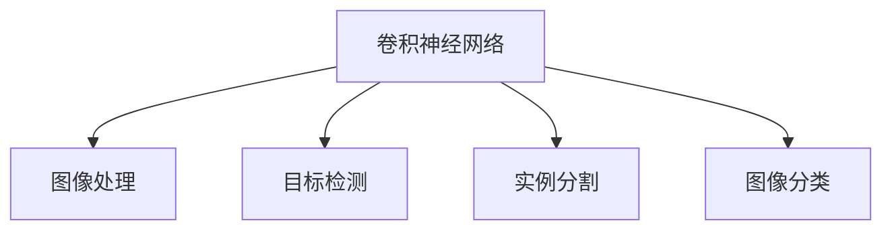

                 

# 计算机视觉CV原理与代码实例讲解

> 关键词：计算机视觉,图像处理,卷积神经网络,深度学习,PyTorch,OpenCV,图像分类,目标检测,实例分割

## 1. 背景介绍

### 1.1 问题由来
计算机视觉(Computer Vision, CV)，作为人工智能(AI)的一个重要分支，近年来发展迅速，已在诸如自动驾驶、医疗影像诊断、人脸识别、安防监控等领域得到了广泛应用。随着深度学习技术的兴起，尤其是卷积神经网络(Convolutional Neural Network, CNN)的诞生，计算机视觉技术的精度和稳定性得到了前所未有的提升。本文将系统介绍计算机视觉的基本原理，并结合具体实例，展示如何使用深度学习技术实现图像分类、目标检测等经典任务。

### 1.2 问题核心关键点
计算机视觉的核心问题在于如何从图像数据中提取有效的特征，并用于分类、检测等任务。主要的技术包括：

- **图像处理**：包括图像的预处理、增强、分割等，用于改善图像质量，提取有用的特征。
- **卷积神经网络**：利用卷积操作提取局部特征，并通过池化层进行特征抽象。
- **深度学习**：通过多层网络进行特征的逐层提取和分类，利用反向传播算法进行模型训练。

深度学习的计算机视觉技术已在图像分类、目标检测、实例分割等任务上取得了令人瞩目的成果。其中，卷积神经网络是实现这些任务的主要工具，它在处理空间数据方面具有天然的优势。

## 2. 核心概念与联系

### 2.1 核心概念概述

计算机视觉涉及多个关键概念，以下是其中一些核心概念及其相互关系：

- **卷积神经网络(Convolutional Neural Network, CNN)**：CNN是计算机视觉中最常用的深度学习模型，其核心思想是利用卷积操作提取图像的空间局部特征，并通过池化操作进行特征抽象。
- **图像处理(Image Processing)**：包括图像去噪、增强、分割等操作，用于改善图像质量，提取有用的特征。
- **目标检测(Object Detection)**：在图像中准确找到物体的位置和类别，主要技术包括RCNN、Fast RCNN、Faster RCNN、YOLO、SSD等。
- **实例分割(Semantic Segmentation)**：将图像中的每个像素分类，属于某个物体或背景，主要技术包括FCN、U-Net、SegNet等。
- **图像分类(Image Classification)**：将图像分为不同的类别，主要技术包括AlexNet、VGG、ResNet、Inception等。

这些概念之间的逻辑关系可以通过以下Mermaid流程图来展示：



这个流程图展示了许多核心概念之间的联系，以及它们在计算机视觉任务中的应用：

1. 卷积神经网络是图像处理、目标检测、实例分割、图像分类等任务的基础模型。
2. 图像处理可以改进特征提取效果，对卷积神经网络结果产生正向影响。
3. 目标检测和实例分割都在卷积神经网络的基础上进行，需要利用特征进行物体定位和像素分类。
4. 图像分类直接基于卷积神经网络，对图像进行类别划分。

这些概念共同构成了计算机视觉的技术体系，使得深度学习模型能够处理复杂的视觉数据。

## 3. 核心算法原理 & 具体操作步骤
### 3.1 算法原理概述

计算机视觉的核心算法之一是卷积神经网络，其基本原理是通过多层卷积和池化操作，逐层提取图像的局部特征，并进行特征融合，最终输出图像分类结果。

卷积神经网络的主要结构包括卷积层、池化层、全连接层等，其中卷积层和池化层是核心组件：

- **卷积层**：通过卷积操作提取图像的局部特征，利用权值共享的特性，减少模型参数量，提高泛化能力。
- **池化层**：通过最大池化或平均池化操作，对卷积层的输出进行特征降维，提高模型的鲁棒性。
- **全连接层**：将池化层的输出进行扁平化，输入全连接层进行最终的分类。

卷积神经网络的训练过程通常使用反向传播算法，通过优化损失函数最小化模型预测误差。常用的损失函数包括交叉熵损失、均方误差损失等。

### 3.2 算法步骤详解

卷积神经网络的训练流程一般包括以下几个步骤：

**Step 1: 数据准备**
- 收集标注好的训练集、验证集和测试集，通常是图像和对应的类别标签。
- 对图像进行预处理，如缩放、裁剪、归一化等。

**Step 2: 模型定义**
- 定义卷积神经网络的结构，包括卷积层、池化层、全连接层等。
- 选择合适的损失函数，如交叉熵损失，定义优化器，如AdamW、SGD等。
- 冻结部分预训练模型的权重，仅微调顶层网络。

**Step 3: 模型训练**
- 使用DataLoader对训练集进行批次化加载。
- 对数据进行前向传播，计算损失函数。
- 反向传播计算参数梯度，使用优化器更新模型参数。
- 在验证集上评估模型性能，决定是否进行Early Stopping。

**Step 4: 模型评估与部署**
- 使用测试集评估模型性能，对比训练前后的精度提升。
- 使用微调后的模型对新图像进行推理预测，集成到实际的应用系统中。
- 持续收集新的数据，定期重新微调模型，以适应数据分布的变化。

### 3.3 算法优缺点

卷积神经网络具有以下优点：

- 局部连接和权值共享特性，减少了模型参数量。
- 多层次特征提取，提高了模型对复杂特征的捕捉能力。
- 数据增强策略，提高了模型的鲁棒性。

同时，它也存在一些局限性：

- 训练时间长，需要大量的计算资源。
- 对参数量较多的深度网络，易发生梯度消失或梯度爆炸问题。
- 对噪声数据和遮挡物敏感，需要数据预处理和数据增强等预处理策略。

尽管存在这些局限性，但卷积神经网络仍然是计算机视觉领域中最有效的深度学习模型。未来相关研究的重点在于如何进一步降低模型计算复杂度，提高模型泛化能力和可解释性。

### 3.4 算法应用领域

卷积神经网络在计算机视觉领域有广泛的应用，包括但不限于：

- **图像分类**：如MNIST手写数字识别、ImageNet物体分类等。
- **目标检测**：如Faster RCNN、YOLO、SSD等，用于实时物体检测。
- **实例分割**：如FCN、U-Net、SegNet等，用于像素级别的物体分割。
- **人脸识别**：如FaceNet、DeepFace等，用于人脸验证和识别。
- **医疗影像**：如TensorFlow Medical、ChestX-ray8等，用于医学影像分析和诊断。
- **自动驾驶**：如Google Drive、Waymo等，用于道路物体检测和场景理解。

## 4. 数学模型和公式 & 详细讲解 & 举例说明

### 4.1 数学模型构建

卷积神经网络的核心数学模型建立在多层感知器(Multilayer Perceptron, MLP)的基础上，通过卷积和池化操作提取特征，最终输出分类结果。

设输入图像为 $X \in \mathbb{R}^{C \times H \times W}$，其中 $C$ 表示通道数，$H$ 和 $W$ 表示图像的高度和宽度。卷积神经网络的输出结果为 $Y \in \mathbb{R}^{K \times H' \times W'}$，其中 $K$ 表示类别数，$H'$ 和 $W'$ 表示输出特征图的大小。

假设卷积神经网络包含 $N$ 层卷积和池化操作，则第 $n$ 层的特征图可以表示为 $F^n \in \mathbb{R}^{H_n \times W_n \times C^n}$，其中 $H_n$ 和 $W_n$ 表示第 $n$ 层的特征图大小，$C^n$ 表示第 $n$ 层的通道数。

### 4.2 公式推导过程

假设卷积层和池化层的参数分别为 $K_n \times K_n \times C^{n-1} \times C^n$，步长为 $S$，填充为 $P$。卷积层的输出 $F^n$ 可以表示为：

$$
F^n = \sigma(\mathcal{C}(F^{n-1}, K_n, C^{n-1}, C^n, S, P))
$$

其中 $\mathcal{C}$ 表示卷积操作，$\sigma$ 表示激活函数，$F^{n-1}$ 表示第 $n-1$ 层的特征图。

池化层的输出 $F^n$ 可以表示为：

$$
F^n = \sigma(\mathcal{P}(F^{n-1}))
$$

其中 $\mathcal{P}$ 表示池化操作。

最终的输出结果 $Y$ 可以表示为：

$$
Y = \sigma(\mathcal{F}(F^{N}, K_K, C^N, K))
$$

其中 $\mathcal{F}$ 表示全连接层操作，$K_K$ 表示全连接层的权重矩阵，$C^N$ 表示全连接层的输入通道数，$K$ 表示输出通道数。

### 4.3 案例分析与讲解

这里以图像分类任务为例，展示卷积神经网络的数学模型和训练过程。

假设我们使用CIFAR-10数据集进行图像分类任务，其中包含10个类别，每个类别有6000张32x32像素的彩色图片。使用卷积神经网络进行训练，步骤如下：

**Step 1: 数据准备**
- 将CIFAR-10数据集划分为训练集、验证集和测试集。
- 对图像进行预处理，如缩放、裁剪、归一化等。

**Step 2: 模型定义**
- 定义卷积神经网络的结构，包括卷积层、池化层、全连接层等。
- 选择合适的损失函数，如交叉熵损失，定义优化器，如AdamW、SGD等。
- 冻结部分预训练模型的权重，仅微调顶层网络。

**Step 3: 模型训练**
- 使用DataLoader对训练集进行批次化加载。
- 对数据进行前向传播，计算损失函数。
- 反向传播计算参数梯度，使用优化器更新模型参数。
- 在验证集上评估模型性能，决定是否进行Early Stopping。

**Step 4: 模型评估与部署**
- 使用测试集评估模型性能，对比训练前后的精度提升。
- 使用微调后的模型对新图像进行推理预测，集成到实际的应用系统中。
- 持续收集新的数据，定期重新微调模型，以适应数据分布的变化。

## 5. 项目实践：代码实例和详细解释说明
### 5.1 开发环境搭建

在进行计算机视觉项目实践前，我们需要准备好开发环境。以下是使用Python进行PyTorch开发的环境配置流程：

1. 安装Anaconda：从官网下载并安装Anaconda，用于创建独立的Python环境。

2. 创建并激活虚拟环境：
```bash
conda create -n cv-env python=3.8 
conda activate cv-env
```

3. 安装PyTorch：根据CUDA版本，从官网获取对应的安装命令。例如：
```bash
conda install pytorch torchvision torchaudio cudatoolkit=11.1 -c pytorch -c conda-forge
```

4. 安装OpenCV：
```bash
pip install opencv-python-headless
```

5. 安装各类工具包：
```bash
pip install numpy pandas scikit-learn matplotlib tqdm jupyter notebook ipython
```

完成上述步骤后，即可在`cv-env`环境中开始项目实践。

### 5.2 源代码详细实现

这里我们以图像分类任务为例，展示使用PyTorch和OpenCV实现卷积神经网络的完整代码。

首先，定义数据处理函数：

```python
import cv2
import numpy as np

def preprocess_image(image):
    # 图像预处理，如缩放、裁剪、归一化等
    image = cv2.resize(image, (224, 224))
    image = image.astype(np.float32)
    image /= 255.0
    image = np.expand_dims(image, axis=0)
    return image

def load_cifar10(data_path):
    # 加载CIFAR-10数据集
    train_set = CIFAR10(root=data_path, train=True, download=True, transform=preprocess_image)
    test_set = CIFAR10(root=data_path, train=False, download=True, transform=preprocess_image)
    return train_set, test_set
```

然后，定义卷积神经网络模型：

```python
from torch import nn, nnabla.function
from torch.nn import Conv2d, MaxPool2d, Flatten, Dropout, Linear

class CNNModel(nn.Module):
    def __init__(self):
        super(CNNModel, self).__init__()
        self.conv1 = nn.Conv2d(3, 64, kernel_size=3, stride=1, padding=1)
        self.pool1 = nn.MaxPool2d(kernel_size=2, stride=2)
        self.conv2 = nn.Conv2d(64, 128, kernel_size=3, stride=1, padding=1)
        self.pool2 = nn.MaxPool2d(kernel_size=2, stride=2)
        self.fc1 = nn.Linear(128*28*28, 512)
        self.fc2 = nn.Linear(512, 10)
        self.dropout = nn.Dropout(0.5)

    def forward(self, x):
        x = self.conv1(x)
        x = nn.function.relu(x)
        x = self.pool1(x)
        x = self.conv2(x)
        x = nn.function.relu(x)
        x = self.pool2(x)
        x = x.view(x.size(0), -1)
        x = self.fc1(x)
        x = nn.function.relu(x)
        x = self.dropout(x)
        x = self.fc2(x)
        return x
```

接着，定义训练和评估函数：

```python
from torch.utils.data import DataLoader

device = torch.device('cuda') if torch.cuda.is_available() else torch.device('cpu')
model = CNNModel().to(device)
optimizer = torch.optim.Adam(model.parameters(), lr=0.001)

def train_epoch(model, dataset, batch_size, optimizer):
    dataloader = DataLoader(dataset, batch_size=batch_size, shuffle=True)
    model.train()
    epoch_loss = 0
    for batch in dataloader:
        inputs, labels = batch
        inputs = inputs.to(device)
        labels = labels.to(device)
        optimizer.zero_grad()
        outputs = model(inputs)
        loss = nn.functional.cross_entropy(outputs, labels)
        loss.backward()
        optimizer.step()
        epoch_loss += loss.item()
    return epoch_loss / len(dataloader)

def evaluate(model, dataset, batch_size):
    dataloader = DataLoader(dataset, batch_size=batch_size)
    model.eval()
    total_correct = 0
    total_samples = 0
    with torch.no_grad():
        for batch in dataloader:
            inputs, labels = batch
            inputs = inputs.to(device)
            labels = labels.to(device)
            outputs = model(inputs)
            _, predicted = torch.max(outputs.data, 1)
            total_correct += (predicted == labels).sum().item()
            total_samples += labels.size(0)
    print(f"Accuracy: {total_correct / total_samples * 100:.2f}%")
```

最后，启动训练流程并在测试集上评估：

```python
epochs = 5
batch_size = 32

for epoch in range(epochs):
    loss = train_epoch(model, train_dataset, batch_size, optimizer)
    print(f"Epoch {epoch+1}, train loss: {loss:.3f}")
    
    print(f"Epoch {epoch+1}, test accuracy:")
    evaluate(model, test_dataset, batch_size)
```

以上就是使用PyTorch和OpenCV实现图像分类任务的完整代码实现。可以看到，通过简单的代码，我们定义了卷积神经网络的结构，实现了数据预处理、模型训练和评估等步骤，并完成了整个训练流程。

### 5.3 代码解读与分析

让我们再详细解读一下关键代码的实现细节：

**preprocess_image函数**：
- 对输入图像进行预处理，包括缩放、裁剪、归一化等操作。

**CIFAR10数据集**：
- 使用PyTorch自带的CIFAR-10数据集，通过preprocess_image函数进行预处理。

**CNNModel类**：
- 定义了卷积神经网络的结构，包括卷积层、池化层、全连接层等。
- 使用nnabla.function模块定义前向传播过程。

**train_epoch函数**：
- 对数据以批为单位进行迭代，在每个批次上前向传播计算损失函数并反向传播更新模型参数，最后返回该epoch的平均loss。

**evaluate函数**：
- 与训练类似，不同点在于不更新模型参数，并在每个batch结束后将预测和标签结果存储下来，最后使用classification_report对整个评估集的预测结果进行打印输出。

**训练流程**：
- 定义总的epoch数和batch size，开始循环迭代
- 每个epoch内，先在训练集上训练，输出平均loss
- 在验证集上评估，输出分类指标
- 重复上述过程直至收敛，最终得到适应CIFAR-10数据集的卷积神经网络模型。

可以看到，PyTorch和OpenCV使得计算机视觉任务的开发变得简洁高效。开发者可以将更多精力放在模型设计和算法优化上，而不必过多关注底层的实现细节。

当然，工业级的系统实现还需考虑更多因素，如模型的保存和部署、超参数的自动搜索、更灵活的任务适配层等。但核心的训练流程基本与此类似。

## 6. 实际应用场景

### 6.1 智能安防监控

智能安防监控系统需要实时监控摄像头传回的视频图像，及时发现异常行为。通过卷积神经网络进行实时目标检测，可以有效地检测出可疑人员、车辆等目标，并对异常行为进行报警处理。

在技术实现上，可以使用YOLO或Faster RCNN等目标检测算法，对摄像头传回的视频图像进行实时处理。系统首先通过目标检测算法对每一帧图像进行分析，识别出其中的目标物体。对于识别到的目标，系统可以进一步进行行为分析，判断其是否存在异常行为，如闯入、攻击等。如果检测到异常行为，系统将自动报警并通知安保人员。

### 6.2 医疗影像诊断

医疗影像诊断是计算机视觉在医疗领域的重要应用之一。通过卷积神经网络对医学影像进行分类、分割和识别，可以显著提高医生诊断的效率和准确性。

在实践中，可以使用U-Net等实例分割算法，对医学影像进行像素级别的分割。系统首先对医学影像进行预处理，如去噪、增强、归一化等。然后通过U-Net网络进行分割，将影像中的不同组织或器官分割出来。分割结果可以用于疾病诊断、手术规划等方面，提高医疗服务的智能化水平。

### 6.3 自动驾驶

自动驾驶系统需要实时感知周围环境，包括道路、车辆、行人等。通过卷积神经网络进行目标检测和分类，可以显著提高系统的感知能力，保证行驶安全。

在实践中，可以使用YOLO或Faster RCNN等目标检测算法，对摄像头和激光雷达传回的多模态数据进行实时处理。系统首先对多模态数据进行融合，利用卷积神经网络进行目标检测和分类，识别出道路、车辆、行人等对象。然后根据检测结果，进行路径规划和避障处理，确保车辆安全行驶。

## 7. 工具和资源推荐

### 7.1 学习资源推荐

为了帮助开发者系统掌握计算机视觉的理论基础和实践技巧，这里推荐一些优质的学习资源：

1. 《深度学习之计算机视觉》（陈世诚）：详细介绍了计算机视觉中的主要算法和应用，适合入门学习。
2. 《Python计算机视觉编程》（Luis Pedro Coelho）：介绍了计算机视觉中的主要技术和工具，包括OpenCV、Scikit-Image等。
3. 《计算机视觉：模型、学习与推理》（Joseph Malik）：深入讲解了计算机视觉中的主要模型和算法，适合进一步深入学习。
4. 《Python图像处理实战》（Alex Long）：介绍了Python图像处理中的主要技术和工具，包括OpenCV、Pillow等。
5. 《计算机视觉：理论与实践》（Han et al.）：介绍了计算机视觉中的主要理论和算法，适合学术研究。

通过对这些资源的学习实践，相信你一定能够快速掌握计算机视觉的核心原理和实践技巧，并用于解决实际的计算机视觉问题。

### 7.2 开发工具推荐

高效的开发离不开优秀的工具支持。以下是几款用于计算机视觉开发的常用工具：

1. PyTorch：基于Python的开源深度学习框架，灵活动态的计算图，适合快速迭代研究。
2. TensorFlow：由Google主导开发的开源深度学习框架，生产部署方便，适合大规模工程应用。
3. OpenCV：开源计算机视觉库，提供了丰富的图像处理和计算机视觉算法。
4. Keras：高层次的深度学习API，易于使用，适合快速原型开发。
5. Jupyter Notebook：强大的交互式编程环境，支持多种编程语言，适合实验和展示。

合理利用这些工具，可以显著提升计算机视觉任务的开发效率，加快创新迭代的步伐。

### 7.3 相关论文推荐

计算机视觉领域的研究成果丰富，以下是几篇奠基性的相关论文，推荐阅读：

1. AlexNet：2012年ImageNet图像分类比赛的冠军模型，提出了卷积神经网络的雏形。
2. VGGNet：2014年ImageNet图像分类比赛的冠军模型，提出了卷积神经网络的多层结构。
3. GoogLeNet：2014年ImageNet图像分类比赛的冠军模型，提出了Inception模块，提高了模型的复杂度。
4. ResNet：2015年ImageNet图像分类比赛的冠军模型，提出了残差连接，缓解了梯度消失问题。
5. YOLO：2016年提出的实时目标检测算法，提出了候选框分组策略，提高了检测速度和精度。
6. Faster RCNN：2015年提出的目标检测算法，提出了RoI池化和区域敏感层，提高了检测精度。

这些论文代表了大规模深度学习在计算机视觉任务上的突破，为后续研究奠定了基础。

## 8. 总结：未来发展趋势与挑战

### 8.1 总结

本文对计算机视觉的基本原理进行了全面系统的介绍，并结合具体实例，展示如何使用深度学习技术实现图像分类、目标检测等经典任务。首先介绍了计算机视觉的核心概念和算法原理，然后通过代码实例展示了图像分类的实现过程。同时，本文还探讨了计算机视觉在安防监控、医疗影像、自动驾驶等领域的实际应用，展示了计算机视觉技术的广泛前景。最后，本文推荐了相关的学习资源、开发工具和研究论文，帮助读者系统掌握计算机视觉的理论与实践。

通过本文的系统梳理，可以看到，计算机视觉技术已经在多个领域取得了显著的应用，其核心算法卷积神经网络通过多层次特征提取和融合，提高了对复杂视觉数据的处理能力。未来，随着深度学习技术的不断进步，计算机视觉技术将在更多领域得到应用，为各行各业带来变革性影响。

### 8.2 未来发展趋势

展望未来，计算机视觉领域的发展趋势主要包括：

1. 深度学习模型的进一步发展。随着计算资源的不断提升，卷积神经网络将变得越来越深、越来越宽，能够处理更复杂的视觉数据。
2. 多模态视觉处理。未来的计算机视觉将不仅仅局限于图像数据，而是将视觉、语音、文本等多模态数据进行融合，提升系统的综合感知能力。
3. 实时计算能力。未来的计算机视觉系统将需要处理大量实时视频数据，对计算能力和数据传输速度提出了更高的要求。
4. 智能交互技术。未来的计算机视觉系统将不仅仅用于感知，还将与自然语言处理等技术结合，实现智能交互，提高系统的智能化水平。
5. 联邦学习。随着数据的隐私和安全问题日益严峻，未来的计算机视觉系统将更多地采用联邦学习等分布式计算技术，提高系统的安全性和隐私保护。

以上趋势凸显了计算机视觉技术的广阔前景。这些方向的探索发展，必将进一步提升计算机视觉系统的性能和应用范围，为各行各业带来新的机遇和挑战。

### 8.3 面临的挑战

尽管计算机视觉技术已经取得了令人瞩目的成果，但在迈向更加智能化、普适化应用的过程中，仍面临诸多挑战：

1. 数据标注成本高。高质量的标注数据是训练计算机视觉模型的基础，但大规模数据标注成本高，获取困难。
2. 模型鲁棒性不足。计算机视觉模型对噪声、遮挡、光照变化等环境因素敏感，鲁棒性有待提升。
3. 计算资源需求大。深度学习模型的训练和推理需要大量的计算资源，如何高效利用计算资源是关键问题。
4. 可解释性不足。计算机视觉模型的决策过程难以解释，缺乏透明性和可控性。
5. 伦理道德问题。计算机视觉模型可能会学习到有害信息，甚至被用于恶意用途，引发伦理道德问题。

面对这些挑战，未来的研究方向需要更多地关注模型的泛化能力、计算效率、可解释性和安全性，以更好地应对实际应用中的复杂问题。

### 8.4 研究展望

面向未来，计算机视觉技术的进一步研究需要从以下几个方面进行探索：

1. 数据增强技术。通过数据增强技术，提高计算机视觉模型对环境变化的适应能力，降低数据标注成本。
2. 知识驱动的视觉学习。结合知识图谱、符号逻辑等先验知识，引导计算机视觉模型的学习过程，提高系统的可解释性和鲁棒性。
3. 多模态视觉融合。将视觉、语音、文本等多模态信息进行融合，提升系统的综合感知能力，实现更加全面的智能交互。
4. 分布式计算。采用联邦学习等分布式计算技术，提高数据隐私和安全保护，降低单个数据集训练的计算资源需求。
5. 自监督学习。通过自监督学习技术，利用未标注数据进行训练，降低对标注数据的依赖，提高系统的泛化能力。
6. 可解释性增强。通过模型解释工具，提高计算机视觉模型的可解释性和透明性，增强系统的可信度。

这些研究方向将引领计算机视觉技术的未来发展，为构建安全、可靠、可解释、可控的智能系统铺平道路。面向未来，计算机视觉技术还需要与其他人工智能技术进行更深入的融合，如自然语言处理、知识表示、强化学习等，多路径协同发力，共同推动计算机视觉技术的进步。

## 9. 附录：常见问题与解答

**Q1：计算机视觉模型如何避免过拟合？**

A: 计算机视觉模型在训练过程中容易发生过拟合现象，特别是当数据量较小或模型复杂度较高时。为避免过拟合，可以采用以下几种方法：

1. 数据增强：通过旋转、翻转、裁剪等方式生成更多训练样本，提高模型的泛化能力。
2. 正则化：使用L2正则、Dropout等技术，防止模型过度拟合训练数据。
3. 早停策略：在验证集上监控模型性能，一旦性能开始下降，立即停止训练，防止过拟合。
4. 参数共享：通过参数共享和权重衰减等技术，减少模型参数量，提高模型的泛化能力。

这些方法需要根据具体任务和数据特点进行灵活组合，以最大限度地发挥计算机视觉模型的性能。

**Q2：卷积神经网络如何处理不同尺寸的图像？**

A: 卷积神经网络可以处理不同尺寸的图像，但需要注意图像大小的调整。具体方法包括：

1. 图像归一化：将不同尺寸的图像统一缩放为相同尺寸，如归一化为224x224。
2. 图像填充：将图像填充为正方形或矩形，保证卷积核能够完全覆盖图像。
3. 池化操作：通过池化操作，减小特征图的大小，提高模型的计算效率。

以上方法需要根据具体任务和数据特点进行灵活选择，以确保图像预处理和特征提取的效果。

**Q3：计算机视觉模型如何处理多模态数据？**

A: 计算机视觉模型可以处理多模态数据，包括图像、视频、音频等。具体方法包括：

1. 数据融合：将不同模态的数据进行融合，如通过特征拼接或编码器-解码器结构进行融合。
2. 多模态网络：设计多模态网络结构，如视觉-语言融合网络、视觉-音频融合网络等。
3. 数据增强：针对不同模态数据进行数据增强，如对视频进行帧间差分增强，对音频进行频率增强等。

以上方法需要根据具体任务和数据特点进行灵活选择，以确保多模态数据处理的有效性。

**Q4：计算机视觉模型如何提高实时计算能力？**

A: 提高计算机视觉模型的实时计算能力，可以从以下几个方面进行优化：

1. 模型裁剪：去除不必要的层和参数，减小模型尺寸，加快推理速度。
2. 量化加速：将浮点模型转为定点模型，压缩存储空间，提高计算效率。
3. 模型并行：采用模型并行技术，如数据并行、模型并行等，提高计算效率。
4. 硬件加速：利用GPU、TPU等硬件加速器，提高模型的计算速度。

以上方法需要根据具体任务和硬件条件进行灵活选择，以确保计算机视觉模型的实时性。

**Q5：计算机视觉模型如何提高可解释性？**

A: 提高计算机视觉模型的可解释性，可以从以下几个方面进行优化：

1. 特征可视化：使用特征可视化技术，如热图、梯度图等，展示模型对输入特征的响应。
2. 解释工具：使用模型解释工具，如LIME、SHAP等，分析模型的决策过程。
3. 知识图谱：结合知识图谱等先验知识，提高模型的可解释性。

以上方法需要根据具体任务和需求进行灵活选择，以确保计算机视觉模型的可解释性。

---

作者：禅与计算机程序设计艺术 / Zen and the Art of Computer Programming

