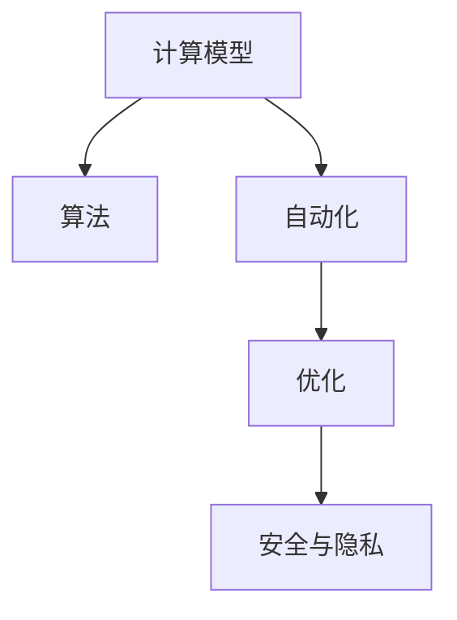

                 

## 1. 背景介绍

### 1.1 问题由来

计算的本质与自动化的未来是信息时代的一个重要议题。随着计算机技术的发展，自动化正在深刻地改变人类社会的生活方式和生产模式。从早期的工业自动化到现代的软件和服务自动化，计算技术已经渗透到各个领域。然而，这一进程并不总是顺利的，其中的许多挑战和问题仍未得到解决。

### 1.2 问题核心关键点

计算的本质在于将复杂问题转化为可计算的形式，使得机器能够理解、处理和解决这些问题。自动化的未来则在于如何更好地利用计算技术，以实现各种目标和任务，例如提升生产效率、改善用户体验等。

这些问题涉及的关键点包括：

- 计算模型的选择：如何选择最合适的计算模型来表示和解决问题。
- 算法的优化：如何设计高效的算法来优化计算过程。
- 自动化的应用场景：自动化技术可以应用到哪些领域，如何解决实际问题。
- 计算与人类关系：计算技术的普及对人类社会的影响，包括就业、伦理和安全等方面。

### 1.3 问题研究意义

研究计算的本质与自动化的未来，对于推动技术进步和创新，提升人类生活质量，以及确保技术的安全和公平使用具有重要意义。

具体而言：

1. **推动技术进步**：计算与自动化技术的发展将推动许多新领域的创新，如人工智能、量子计算等。

2. **提升生活质量**：自动化技术能够提升生产效率、减少人力成本，改善用户体验。

3. **确保技术安全**：自动化技术必须确保其安全性，防止被滥用或导致意外后果。

4. **公平与伦理**：自动化技术必须考虑到公平性，避免加剧社会不平等。

## 2. 核心概念与联系

### 2.1 核心概念概述

为更好地理解计算的本质与自动化的未来，本节将介绍几个密切相关的核心概念：

- **计算模型**：计算机程序处理数据和执行任务的基本框架，如函数式编程、面向对象编程等。
- **算法**：解决问题的步骤和策略，通常用于优化计算模型，提高计算效率。
- **自动化**：使用计算技术来执行任务和决策的过程，通常涉及到规则、模型和控制流程。
- **优化**：提高计算效率和性能的过程，通常通过算法和模型选择来实现。
- **安全与隐私**：保护计算系统免受未经授权的访问和恶意攻击，确保数据隐私。

这些核心概念之间的逻辑关系可以通过以下Mermaid流程图来展示：



这个流程图展示了几大核心概念及其之间的关系：

1. 计算模型是自动化的基础，提供了问题求解的基本框架。
2. 算法用于优化计算模型，提高计算效率。
3. 自动化通过算法和模型选择来实现任务执行和决策。
4. 优化旨在提升自动化系统的性能和安全性。
5. 安全与隐私是自动化系统的重要保障。

这些概念共同构成了计算的本质与自动化的框架，使其能够在各种场景下发挥强大的功能和价值。通过理解这些核心概念，我们可以更好地把握计算和自动化的工作原理和优化方向。

## 3. 核心算法原理 & 具体操作步骤

### 3.1 算法原理概述

计算的本质是模型选择和算法优化。自动化的未来则在于如何更好地应用这些技术，以实现目标和解决实际问题。

**3.1.1 模型选择**

选择最合适的计算模型是实现自动化任务的关键。常见的计算模型包括函数式编程、面向对象编程、过程式编程等。模型选择应考虑任务特性、性能需求和可维护性等因素。

**3.1.2 算法优化**

优化算法是提高计算效率和性能的重要手段。算法优化的目标是找到最快的解决方法，通常通过算法分析和实验评估来确定。常见的算法优化方法包括分治法、动态规划、贪心算法等。

### 3.2 算法步骤详解

基于计算模型的自动化通常包括以下关键步骤：

**3.2.1 需求分析**

明确自动化任务的需求和目标，包括输入数据、输出结果和性能指标等。

**3.2.2 模型选择**

根据任务需求选择合适的计算模型。例如，对于复杂数据处理任务，可以选择机器学习模型，对于实时系统则可以选择流处理模型。

**3.2.3 数据预处理**

对输入数据进行预处理，包括清洗、归一化和特征提取等，以便模型能够更好地处理数据。

**3.2.4 算法选择**

选择最适合问题的算法，通常需要考虑算法的复杂度、效率和可扩展性等因素。

**3.2.5 实现与测试**

将算法实现为程序或系统，并进行测试以验证其正确性和性能。

**3.2.6 部署与维护**

将系统部署到生产环境中，并进行持续维护和优化，以确保其稳定性和性能。

### 3.3 算法优缺点

基于计算模型的自动化方法具有以下优点：

1. **通用性强**：能够应用于各种任务和场景。
2. **可扩展性好**：可以方便地添加新功能和扩展系统。
3. **高效性**：优化算法通常能够显著提高计算效率。

但同时也存在一些缺点：

1. **复杂度高**：设计和实现复杂，需要具备较强的技术背景。
2. **开发周期长**：从需求分析到部署可能需要较长的周期。
3. **资源消耗大**：自动化系统通常需要较大的计算和存储资源。

### 3.4 算法应用领域

基于计算模型的自动化方法在各个领域都有广泛的应用，例如：

- **软件工程**：自动化测试、代码生成和代码审查等。
- **数据科学**：数据预处理、模型训练和结果分析等。
- **人工智能**：图像识别、语音识别和自然语言处理等。
- **自动化控制**：机器人控制、智能家居和自动驾驶等。
- **金融科技**：算法交易、风险管理和金融分析等。

这些领域的应用展示了计算模型和自动化技术的强大潜力和广泛适用性。

## 4. 数学模型和公式 & 详细讲解 & 举例说明

### 4.1 数学模型构建

自动化的核心在于使用数学模型来表示和解决问题。常见的数学模型包括线性回归、决策树、神经网络等。

**4.1.1 线性回归模型**

线性回归模型是常用的回归模型，用于预测连续变量的值。其数学公式为：

$$
y = \beta_0 + \beta_1x_1 + \beta_2x_2 + \cdots + \beta_nx_n + \epsilon
$$

其中，$y$ 是预测值，$x_i$ 是输入变量，$\beta_i$ 是模型参数，$\epsilon$ 是误差项。

**4.1.2 决策树模型**

决策树模型是一种树形结构，用于分类和回归任务。其基本思想是将数据集划分为多个子集，每个子集对应一个叶子节点，直到所有数据都被正确分类。

### 4.2 公式推导过程

线性回归模型的推导过程如下：

1. 假设 $y = \beta_0 + \beta_1x_1 + \beta_2x_2 + \cdots + \beta_nx_n + \epsilon$。
2. 将模型参数 $\beta_i$ 表示为矩阵 $\mathbf{X}$ 和向量 $\mathbf{y}$ 的线性组合：

$$
\mathbf{y} = \mathbf{X}\mathbf{\beta} + \mathbf{\epsilon}
$$

3. 最小化均方误差：

$$
\mathop{\min}_{\mathbf{\beta}}\frac{1}{N}\sum_{i=1}^N(y_i - \hat{y}_i)^2
$$

其中，$N$ 是样本数量，$\hat{y}_i$ 是预测值。

4. 使用最小二乘法求解 $\mathbf{\beta}$：

$$
\mathbf{\beta} = (\mathbf{X}^T\mathbf{X})^{-1}\mathbf{X}^T\mathbf{y}
$$

### 4.3 案例分析与讲解

假设我们有一个简单的数据集，用于预测房价：

| 房屋面积 $x_1$ | 房屋年龄 $x_2$ | 房价 $y$ |
| --- | --- | --- |
| 100 | 10 | 200 |
| 120 | 15 | 220 |
| 130 | 5 | 190 |
| 140 | 20 | 250 |

我们可以使用线性回归模型来预测房价，具体步骤如下：

1. 构建线性回归模型 $y = \beta_0 + \beta_1x_1 + \beta_2x_2$。
2. 使用最小二乘法求解模型参数：

$$
\mathbf{X} = \begin{bmatrix}
100 & 10 \\
120 & 15 \\
130 & 5 \\
140 & 20
\end{bmatrix}, \quad \mathbf{y} = \begin{bmatrix}
200 \\
220 \\
190 \\
250
\end{bmatrix}
$$

$$
\mathbf{\beta} = (\mathbf{X}^T\mathbf{X})^{-1}\mathbf{X}^T\mathbf{y} = \begin{bmatrix}
2 \\
3
\end{bmatrix}
$$

3. 将新房屋面积和年龄代入模型计算房价：

$$
y = 2 \times 100 + 3 \times 15 = 250
$$

这个例子展示了如何使用线性回归模型来预测房价，体现了数学模型的计算本质。

## 5. 项目实践：代码实例和详细解释说明

### 5.1 开发环境搭建

在进行自动化实践前，我们需要准备好开发环境。以下是使用Python进行TensorFlow开发的环境配置流程：

1. 安装Anaconda：从官网下载并安装Anaconda，用于创建独立的Python环境。

2. 创建并激活虚拟环境：
```bash
conda create -n tf-env python=3.8 
conda activate tf-env
```

3. 安装TensorFlow：根据CUDA版本，从官网获取对应的安装命令。例如：
```bash
conda install tensorflow -c conda-forge -c pytorch
```

4. 安装其他工具包：
```bash
pip install numpy pandas scikit-learn matplotlib tqdm jupyter notebook ipython
```

完成上述步骤后，即可在`tf-env`环境中开始自动化实践。

### 5.2 源代码详细实现

这里我们以房价预测为例，给出使用TensorFlow进行线性回归的PyTorch代码实现。

首先，定义线性回归模型：

```python
import tensorflow as tf
import numpy as np

def linear_regression_model(input_dim):
    # 定义输入层和输出层
    input_layer = tf.keras.layers.Input(input_dim)
    hidden_layer = tf.keras.layers.Dense(1)(input_layer)
    output_layer = tf.keras.layers.Dense(1, activation='sigmoid')(hidden_layer)
    
    # 定义模型
    model = tf.keras.models.Model(inputs=input_layer, outputs=output_layer)
    
    return model
```

然后，定义损失函数和优化器：

```python
# 定义损失函数
def mean_squared_error(y_true, y_pred):
    return tf.reduce_mean(tf.square(y_true - y_pred))

# 定义优化器
optimizer = tf.keras.optimizers.Adam(learning_rate=0.01)
```

接着，定义训练函数：

```python
def train_model(model, X_train, y_train, X_test, y_test, epochs=100, batch_size=32):
    # 编译模型
    model.compile(loss=mean_squared_error, optimizer=optimizer)
    
    # 训练模型
    model.fit(X_train, y_train, epochs=epochs, batch_size=batch_size, validation_data=(X_test, y_test))
    
    # 评估模型
    model.evaluate(X_test, y_test)
```

最后，启动训练流程并在测试集上评估：

```python
# 创建模型
model = linear_regression_model(2)

# 准备数据
X_train = np.array([[100, 10], [120, 15], [130, 5], [140, 20]])
y_train = np.array([200, 220, 190, 250])
X_test = np.array([[110, 12], [130, 5], [140, 20]])
y_test = np.array([225, 210, 250])

# 训练模型
train_model(model, X_train, y_train, X_test, y_test)

# 输出模型参数
print(model.get_weights())
```

以上就是使用TensorFlow进行房价预测的完整代码实现。可以看到，TensorFlow提供了丰富的工具和API，使得模型构建和训练变得简单高效。

### 5.3 代码解读与分析

让我们再详细解读一下关键代码的实现细节：

**线性回归模型类**：
- `linear_regression_model`方法：定义了一个线性回归模型，包含输入层、隐藏层和输出层。
- 输入层：使用`tf.keras.layers.Input`定义输入数据的维度。
- 隐藏层：使用`tf.keras.layers.Dense`定义一个具有1个神经元的全连接层。
- 输出层：使用`tf.keras.layers.Dense`定义一个具有1个神经元的sigmoid激活函数。

**损失函数和优化器**：
- `mean_squared_error`函数：定义了一个均方误差损失函数，用于衡量预测值与真实值之间的差异。
- `optimizer`变量：使用Adam优化器，设置学习率为0.01。

**训练函数**：
- `train_model`方法：定义了一个训练函数，包括编译模型、训练模型和评估模型等步骤。
- 编译模型：使用`model.compile`方法，指定损失函数和优化器。
- 训练模型：使用`model.fit`方法，指定训练集、测试集、迭代次数和批次大小等参数。
- 评估模型：使用`model.evaluate`方法，评估模型在测试集上的性能。

**数据准备**：
- 创建输入数据和输出数据：使用NumPy数组创建训练集和测试集。
- 调用训练函数：将数据和模型作为参数传递给`train_model`函数，进行模型训练和评估。

可以看到，TensorFlow的API设计简洁直观，使得模型构建和训练变得十分方便。通过这些关键代码的实现，我们能够深入理解TensorFlow的基本操作和应用方式。

## 6. 实际应用场景

### 6.1 金融自动化

金融自动化是自动化应用的重要领域之一。在金融领域，自动化技术可以用于交易策略开发、风险管理、客户服务等方面。

例如，可以使用机器学习模型对历史交易数据进行分析，自动生成交易策略。使用优化算法来优化交易参数，提高交易成功率和收益。还可以使用自然语言处理技术，自动分析客户咨询，提高客户服务质量。

### 6.2 制造业自动化

制造业自动化也是自动化应用的重要方向。通过自动化技术，可以提高生产效率、降低成本、提升产品质量。

例如，可以使用机器视觉技术对产品进行质量检测，自动化检测生产线上的缺陷。使用机器人进行自动化装配和搬运，提高生产效率。还可以使用预测模型对生产数据进行分析，优化生产计划和资源配置。

### 6.3 医疗自动化

医疗自动化在现代医疗体系中扮演着越来越重要的角色。自动化技术可以用于诊断、治疗、管理等方面。

例如，可以使用图像识别技术对医学影像进行自动分析，辅助医生进行诊断。使用自然语言处理技术，自动分析病历和报告，提高医疗信息的利用效率。还可以使用预测模型对患者数据进行分析，制定个性化的治疗方案。

### 6.4 未来应用展望

随着计算技术的发展，自动化技术的应用范围将不断扩大，涵盖更多的领域。未来的自动化技术将具备更高的智能化水平，能够更加灵活地应对各种复杂问题。

例如：

- **智能城市**：自动化技术可以用于城市管理、交通控制、公共安全等方面，提高城市运营效率和居民生活质量。
- **个性化推荐**：自动化技术可以用于推荐系统，推荐个性化的商品、内容和服务，提升用户体验。
- **虚拟助手**：自动化技术可以用于虚拟助手，提供自然语言交互和智能决策，帮助人们解决各种问题。

自动化技术的未来发展将带来更加智能化、高效化的生活方式和生产模式，推动社会进步和经济繁荣。

## 7. 工具和资源推荐

### 7.1 学习资源推荐

为了帮助开发者系统掌握自动化技术，这里推荐一些优质的学习资源：

1. 《Python深度学习》书籍：深度学习领域的经典入门书籍，涵盖了神经网络、图像处理、自然语言处理等多个方面。
2. 《TensorFlow官方文档》：TensorFlow的官方文档，提供了全面的API和教程，适合新手快速上手。
3. 《深度学习与强化学习》课程：Coursera上的经典课程，由斯坦福大学教授讲授，深入浅出地介绍了深度学习和强化学习的基础知识和应用。
4. 《AutoML：自动机器学习实践》书籍：介绍自动化机器学习的技术和方法，适合实践自动化任务的开发者。
5. 《PyTorch官方文档》：PyTorch的官方文档，提供了丰富的API和教程，适合TensorFlow用户快速学习PyTorch。

通过这些资源的学习实践，相信你一定能够快速掌握自动化的精髓，并用于解决实际的自动化问题。

### 7.2 开发工具推荐

高效的开发离不开优秀的工具支持。以下是几款用于自动化开发常用的工具：

1. Jupyter Notebook：交互式的编程环境，支持Python、R等多种编程语言，适合进行数据处理和模型训练。
2. PyCharm：Python开发的IDE，提供了代码高亮、自动补全、版本控制等多种功能，适合进行大规模项目开发。
3. Visual Studio Code：跨平台的IDE，支持Python、R等多种编程语言，提供了丰富的扩展插件，适合进行自动化任务开发。
4. Scikit-learn：Python的机器学习库，提供了丰富的算法和工具，适合进行机器学习任务开发。
5. TensorFlow和PyTorch：深度学习框架，提供了丰富的模型和API，适合进行深度学习任务开发。

合理利用这些工具，可以显著提升自动化任务的开发效率，加快创新迭代的步伐。

### 7.3 相关论文推荐

自动化技术的发展离不开学界的持续研究。以下是几篇奠基性的相关论文，推荐阅读：

1. **《A Survey on Multi-Task Learning in Deep Neural Networks: A Tutorial》**：综述了多任务学习的相关研究，介绍了多任务学习的原理、算法和应用。
2. **《AutoML: Opportunities and Challenges》**：介绍了自动化机器学习的概念和研究进展，提出了自动化机器学习的挑战和未来方向。
3. **《Hands-Free Machine Learning with Deep Sets》**：介绍了一种基于神经网络的无监督学习方法，无需手工标注数据即可进行机器学习。
4. **《An Introduction to Deep Learning for Natural Language Processing》**：介绍了深度学习在自然语言处理中的应用，包括文本分类、情感分析、机器翻译等。
5. **《Deep Learning for Autonomous Vehicles》**：介绍了深度学习在自动驾驶中的应用，包括目标检测、行为预测、路径规划等。

这些论文代表了大规模自动化技术的研究进展，通过学习这些前沿成果，可以帮助研究者把握学科前进方向，激发更多的创新灵感。

## 8. 总结：未来发展趋势与挑战

### 8.1 总结

本文对计算的本质与自动化的未来进行了全面系统的介绍。首先阐述了计算的本质在于模型选择和算法优化，自动化的未来则在于如何更好地应用这些技术，以实现目标和解决实际问题。其次，从原理到实践，详细讲解了自动化的数学模型和算法实现，给出了自动化任务开发的完整代码实例。同时，本文还广泛探讨了自动化技术在金融、制造业、医疗等多个领域的应用前景，展示了自动化技术的强大潜力和广泛适用性。此外，本文精选了自动化的各类学习资源，力求为读者提供全方位的技术指引。

通过本文的系统梳理，可以看到，计算与自动化技术的发展正在深刻改变人类社会的生活方式和生产模式。未来的计算技术将更加智能化、高效化和普适化，为各行各业带来颠覆性的变革。

### 8.2 未来发展趋势

展望未来，计算与自动化技术将呈现以下几个发展趋势：

1. **智能化水平提升**：自动化技术将具备更高的智能化水平，能够更加灵活地应对各种复杂问题。
2. **多模态融合**：自动化技术将融合视觉、语音、文本等多模态信息，实现更全面的数据处理和任务执行。
3. **自动化决策**：自动化技术将具备更强的决策能力，能够自动进行复杂决策和优化。
4. **联邦学习**：自动化技术将采用联邦学习等技术，保护数据隐私和安全。
5. **自动化伦理**：自动化技术将引入伦理和公平性约束，确保其行为符合人类价值观和伦理道德。

这些趋势凸显了计算与自动化技术的广阔前景，展示了其对社会进步和经济繁荣的巨大贡献。

### 8.3 面临的挑战

尽管自动化技术已经取得了显著的进展，但在迈向更加智能化、高效化和普适化应用的过程中，仍面临诸多挑战：

1. **数据隐私和安全**：自动化技术需要处理大量敏感数据，如何保护数据隐私和安全是一个重要挑战。
2. **模型可解释性**：自动化模型的决策过程缺乏可解释性，如何提高模型的透明度和可理解性是一个重要问题。
3. **系统鲁棒性**：自动化系统需要具备更强的鲁棒性，能够应对各种异常情况和干扰。
4. **资源消耗**：自动化系统需要大量计算和存储资源，如何优化资源消耗是一个重要问题。
5. **公平性和伦理**：自动化系统需要考虑公平性和伦理问题，避免加剧社会不平等和偏见。

正视这些挑战，积极应对并寻求突破，将是大规模自动化技术走向成熟的必由之路。相信随着学界和产业界的共同努力，这些挑战终将一一被克服，自动化技术必将在构建智能社会中扮演越来越重要的角色。

### 8.4 研究展望

未来的研究需要在以下几个方面寻求新的突破：

1. **多模态数据处理**：融合视觉、语音、文本等多模态信息，实现更全面的数据处理和任务执行。
2. **自动化伦理**：引入伦理和公平性约束，确保自动化系统的行为符合人类价值观和伦理道德。
3. **自动化决策**：提高自动化系统的决策能力，能够自动进行复杂决策和优化。
4. **联邦学习**：采用联邦学习等技术，保护数据隐私和安全。
5. **智能化水平提升**：提高自动化系统的智能化水平，能够灵活应对各种复杂问题。

这些研究方向将引领计算与自动化技术走向更高的台阶，为构建智能社会提供新的动力。面向未来，计算与自动化技术需要与其他人工智能技术进行更深入的融合，共同推动社会进步和经济繁荣。只有勇于创新、敢于突破，才能不断拓展计算与自动化的边界，让智能技术更好地造福人类社会。

## 9. 附录：常见问题与解答

**Q1：什么是计算的本质？**

A: 计算的本质在于将复杂问题转化为可计算的形式，使得机器能够理解、处理和解决这些问题。

**Q2：什么是自动化的未来？**

A: 自动化的未来在于如何更好地利用计算技术，以实现各种目标和任务，例如提升生产效率、改善用户体验等。

**Q3：如何进行模型选择？**

A: 模型选择应考虑任务特性、性能需求和可维护性等因素。例如，对于复杂数据处理任务，可以选择机器学习模型，对于实时系统则可以选择流处理模型。

**Q4：如何进行算法优化？**

A: 算法优化通常需要考虑算法的复杂度、效率和可扩展性等因素。常见的方法包括分治法、动态规划、贪心算法等。

**Q5：如何进行自动化开发？**

A: 自动化开发通常包括以下关键步骤：需求分析、模型选择、数据预处理、算法选择、实现与测试、部署与维护。

**Q6：什么是多模态融合？**

A: 多模态融合是指融合视觉、语音、文本等多模态信息，实现更全面的数据处理和任务执行。

**Q7：什么是自动化伦理？**

A: 自动化伦理是指引入伦理和公平性约束，确保自动化系统的行为符合人类价值观和伦理道德。

通过这些问题的解答，相信你能够更深入地理解计算与自动化的本质和未来方向，为未来的自动化开发和研究提供有益的参考。

