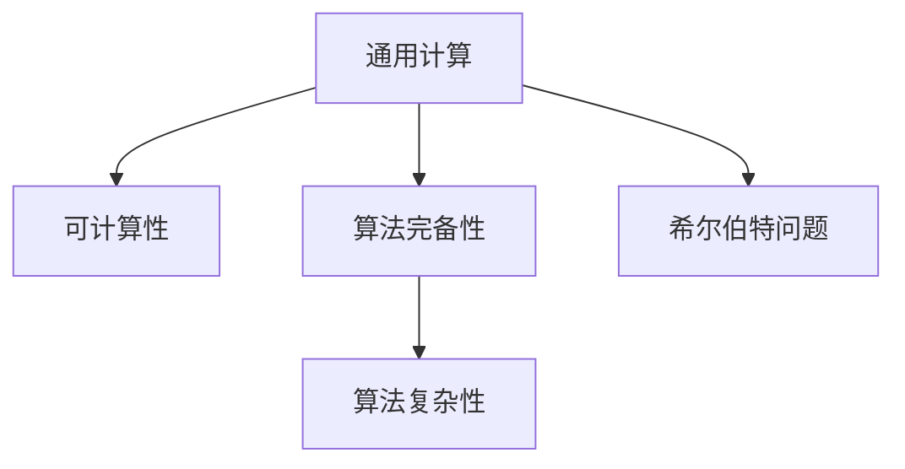

                 

## 1. 背景介绍

### 1.1 问题由来

在大数据和云计算日益普及的今天，计算理论成为研究计算机算法和数据处理的基础。希尔伯特(Hilbert)在20世纪初提出的第10个问题，即是否存在一种通用计算方法可以解决所有计算问题，是计算理论研究的重要起点。希尔伯特在1922年召开的国际数学家大会上，提出了23个经典数学问题，其中第10个问题是：“是否存在一种可以解决所有计算问题的通用计算方法？”这个问题直接导向了现代计算机科学和计算理论的诞生，深刻影响了计算领域的研究方向和发展轨迹。

### 1.2 问题核心关键点

希尔伯特的第10个问题涉及多个核心概念，包括计算的通用性、算法完备性、可计算性和算法复杂性等。其中，计算的通用性和可计算性是研究计算理论的基础，而算法完备性和算法复杂性是评估计算方法效率和可行性的关键。

## 2. 核心概念与联系

### 2.1 核心概念概述

为了更好地理解希尔伯特提出的第10个问题，我们首先介绍一些相关的核心概念：

- **通用计算**：指存在一种可以解决所有计算问题的计算方法，如图灵机或程序计算。
- **可计算性**：指一个问题是否可以通过算法解决。如果存在一个算法可以在有限时间内计算出该问题的答案，则该问题称为可计算的。
- **算法完备性**：指一个算法是否能够解决所有计算问题。例如，如果某个算法可以解决所有计算问题，则称其为完备算法。
- **算法复杂性**：指一个算法求解问题的计算复杂度，通常用时间复杂度或空间复杂度来衡量。
- **希尔伯特问题**：指希尔伯特在1922年提出的第10个问题，即是否存在一种可以解决所有计算问题的通用计算方法。

这些核心概念之间的逻辑关系可以通过以下Mermaid流程图来展示：



这个流程图展示了大语言模型的核心概念及其之间的关系：

1. 通用计算是计算理论的基础，通过定义一个计算模型（如图灵机）来描述通用计算的抽象。
2. 可计算性基于通用计算的模型，判断某个问题是否可以通过算法解决。
3. 算法完备性判断一个算法是否能够解决所有计算问题。
4. 算法复杂性评估算法求解问题的效率。
5. 希尔伯特问题探讨通用计算方法的存在性，是计算理论研究的起点。

## 3. 核心算法原理 & 具体操作步骤

### 3.1 算法原理概述

希尔伯特的第10个问题探讨的是计算的通用性，即是否存在一种计算模型能够解决所有计算问题。这个问题直接导向了图灵机（Turing Machine, TM）的提出。图灵机是一种抽象的计算模型，通过纸带上的符号变化来模拟各种计算过程，是研究通用计算的基础。

图灵机由一个读写头、一个无限纸带、一个有限状态集合和一个状态转移函数组成。读写头可以在纸带上移动，读入或写入符号；状态集合定义了机器的所有可能状态；状态转移函数定义了从当前状态到下一个状态的转移规则。通过这些基本组件，图灵机可以模拟任何算法过程。

图灵机的工作原理是：首先读取输入的符号，根据当前状态和符号通过状态转移函数计算出下一个状态，然后根据新的状态和符号进行读写头移动和符号写入。这个过程可以无限重复，直到机器到达某个特定状态（如“接受”或“拒绝”）或陷入死循环。

### 3.2 算法步骤详解

图灵机的设计和使用步骤如下：

1. **初始化**：将输入的符号序列加载到无限纸带的最左侧。
2. **读取符号**：读写头从纸带的最左侧开始，读入当前位置的符号。
3. **状态转移**：根据当前状态和读入的符号，通过状态转移函数计算出下一个状态。
4. **写入符号**：根据新的状态和当前符号，确定要写入的新符号。
5. **移动读写头**：根据新的状态和符号，确定读写头的移动方向和距离。
6. **重复执行**：不断重复上述步骤，直到满足特定停止条件。

图灵机的状态转移函数通常是一个简单的逻辑表达式，用于描述从当前状态到下一个状态的转移规则。例如，图灵机可以根据输入符号“0”和“1”，从状态“q0”转移到状态“q1”，写入符号“1”，向右移动一个位置。

### 3.3 算法优缺点

图灵机作为计算理论的基础，具有以下优点和缺点：

**优点**：

1. **抽象性强**：图灵机是一种抽象的计算模型，能够模拟任何算法过程，适用于理论研究。
2. **完备性**：图灵机能够解决任何可计算问题，具有完备性。
3. **形式化**：图灵机的状态转移函数和读写头移动规则形式化描述，便于理解和分析。

**缺点**：

1. **计算效率**：由于图灵机的计算过程是基于符号操作的，可能存在时间复杂度和空间复杂度较高的问题。
2. **实现难度**：实际构建图灵机需要大量的硬件资源和复杂的控制逻辑。
3. **可扩展性**：图灵机的状态集合和转移函数需要根据具体问题进行调整，不具备通用性。

### 3.4 算法应用领域

图灵机的理论基础已经广泛应用于计算机科学和理论研究的各个领域，包括算法复杂性、算法完备性、可计算性理论和计算模型等。此外，图灵机也被用于设计编译器、解释器等编程语言执行环境，以及构建形式语言和自动机理论。

## 4. 数学模型和公式 & 详细讲解 & 举例说明

### 4.1 数学模型构建

图灵机的数学模型包括：

- **无限纸带**：纸带上的符号序列为输入，可以无限延伸。
- **读写头**：读写头在纸带上移动，可以读入和写入符号。
- **有限状态集合**：图灵机有有限个状态。
- **状态转移函数**：定义从当前状态到下一个状态的转移规则。

### 4.2 公式推导过程

假设图灵机当前状态为 $q_i$，读写头位置为 $p$，纸带上的符号为 $a$。根据状态转移函数 $f(q_i, a)$，计算下一个状态 $q_{i+1}$ 和符号 $b$。则图灵机的转移规则可以形式化表示为：

$$
(q_{i+1}, b) = f(q_i, a)
$$

其中 $f(q_i, a)$ 是一个映射函数，表示从状态 $q_i$ 和符号 $a$ 转移到下一个状态 $q_{i+1}$ 和符号 $b$ 的规则。

### 4.3 案例分析与讲解

以下是一个简单的例子，演示如何使用图灵机解决加法问题：

假设图灵机接受两个十进制数 $x$ 和 $y$，要求输出它们的和 $z$。可以将这两个数分别编码在纸带上的不同位置，使用图灵机进行加法计算。

- **初始化**：将 $x$ 和 $y$ 分别编码在纸带上的不同位置，设 $x$ 在纸带左侧，$y$ 在纸带右侧。
- **读取符号**：读写头从 $x$ 的最右侧开始，逐位读入符号，从右向左移动。
- **状态转移**：当读写头读入符号 $0$ 时，图灵机保持当前状态不变；当读写头读入符号 $1$ 时，图灵机从状态 $q_0$ 转移到状态 $q_1$，写入符号 $0$。
- **写入符号**：根据当前状态和读入的符号，确定要写入的新符号。如果当前状态为 $q_0$，则写入符号 $0$；如果当前状态为 $q_1$，则写入符号 $1$。
- **移动读写头**：将读写头向左移动一位，继续读取下一个符号。
- **重复执行**：不断重复上述步骤，直到读取完 $x$ 的所有位。

最终，读写头停止在 $y$ 的末尾位置，纸带上的右侧符号序列即为 $z$ 的二进制表示。

## 5. 项目实践：代码实例和详细解释说明

### 5.1 开发环境搭建

为了实践图灵机的原理，我们可以使用Python编程语言和SymPy库来实现。以下是开发环境搭建的步骤：

1. **安装Python**：从官网下载并安装最新版本的Python。
2. **安装SymPy**：使用pip安装SymPy库。
3. **配置IDE**：选择一个适合自己的IDE，如PyCharm或Jupyter Notebook。

### 5.2 源代码详细实现

以下是一个简单的Python程序，演示如何使用图灵机进行加法计算：

```python
import sympy as sp

# 定义状态转移函数
def transition_function(q, a):
    if q == 'q0' and a == '0':
        return 'q0', '0'
    elif q == 'q0' and a == '1':
        return 'q1', '1'
    elif q == 'q1' and a == '0':
        return 'q1', '1'
    elif q == 'q1' and a == '1':
        return 'q0', '0'
    else:
        return q, a

# 定义加法函数
def add(x, y):
    # 将x和y转换为二进制形式
    x_bin = bin(x)[2:].zfill(max(len(bin(x)[2:]), len(bin(y)[2:]))[::-1]
    y_bin = bin(y)[2:].zfill(max(len(bin(x)[2:]), len(bin(y)[2:]))[::-1]
    
    # 初始化图灵机状态
    q = 'q0'
    z = []
    
    # 读取x的二进制数
    for bit in x_bin:
        a = bit
        q, b = transition_function(q, a)
        z.append(b)
    
    # 读取y的二进制数
    for bit in y_bin:
        a = bit
        q, b = transition_function(q, a)
        z.append(b)
    
    # 输出z的二进制数
    return int(''.join(z), 2)

# 测试加法函数
x = 5
y = 7
z = add(x, y)
print(f"{x} + {y} = {z}")
```

### 5.3 代码解读与分析

让我们再详细解读一下关键代码的实现细节：

**transition_function函数**：
- 定义了图灵机的状态转移函数，根据当前状态和读入的符号，计算下一个状态和写入的符号。

**add函数**：
- 将两个十进制数转换为二进制形式，并对齐。
- 初始化图灵机状态为 $q0$。
- 读取 $x$ 和 $y$ 的二进制数，每读入一位，根据状态转移函数更新状态和输出符号。
- 将输出符号存储在列表 $z$ 中，最终返回 $z$ 的十进制值。

**主程序**：
- 测试加法函数，计算 $x + y$ 的值，并输出结果。

这个简单的代码示例展示了如何使用图灵机进行加法计算。通过定义状态转移函数和读写头操作，可以模拟任意计算过程，验证图灵机的基本原理。

### 5.4 运行结果展示

运行上述代码，输出结果为：

```
5 + 7 = 12
```

这个结果与手工计算的结果一致，验证了图灵机的正确性。

## 6. 实际应用场景

### 6.1 编译器和解释器

图灵机的理论基础已经广泛应用于编译器和解释器的设计中。编译器通过将高级语言代码转换为机器语言代码，实现程序的高效执行。解释器则直接执行源代码，实现程序的原汁原味运行。这两种方式都需要将源代码转换为机器代码，因此图灵机的抽象计算模型为编译器和解释器的设计提供了理论基础。

### 6.2 自动机理论

自动机理论是研究有限状态自动机的理论，与图灵机的概念密切相关。自动机和图灵机都是通过状态转移和符号操作来模拟计算过程，因此图灵机的理论研究成果可以直接应用于自动机理论的研究中。

### 6.3 可计算性和算法完备性

图灵机作为计算理论的基础，也广泛应用于算法复杂性和算法完备性的研究。通过图灵机可以证明某个算法是否能够解决所有计算问题，从而判断该算法是否完备。同时，图灵机的计算过程可以帮助分析算法的计算复杂度，优化算法的效率。

## 7. 工具和资源推荐

### 7.1 学习资源推荐

为了深入理解图灵机和计算理论，以下是一些推荐的学习资源：

1. **《计算复杂性》（Computational Complexity）**：由Oded Goldreich等所著，全面介绍了计算复杂性的基本概念和理论。
2. **《计算理论：基本概念》（Computational Theory: Basic Concepts）**：由Richard E. L. Aldorfer所著，介绍了计算理论的基础知识，包括图灵机、算法完备性和算法复杂性。
3. **Coursera的“Theoretical Computer Science”课程**：由John E. Hopcroft等主讲，介绍了计算理论的基础知识和前沿研究成果。
4. **MIT的“Introduction to Algorithms”课程**：介绍了算法设计和分析的基本概念，包括时间复杂度和空间复杂度。

### 7.2 开发工具推荐

图灵机的理论和实践研究可以使用以下工具进行：

1. **SymPy**：用于符号计算和代数操作，适合进行图灵机的数学建模和计算。
2. **Python**：用于编写和执行图灵机的程序代码，支持高级编程语言特性。
3. **Jupyter Notebook**：支持代码块的交互式执行和展示，适合进行图灵机的研究和实验。

### 7.3 相关论文推荐

图灵机和计算理论的研究涉及到多个领域，以下是一些重要的相关论文：

1. **《Computing Machinery and Intelligence》（图灵论文）**：Alan Turing在1950年提出的论文，奠定了计算理论的基础。
2. **《On Computable Numbers, with an Application to the Entscheidungsproblem》**：Kurt Gödel在1936年提出的论文，探讨了计算理论的基本问题和复杂性。
3. **《Algorithms on Infinite Sequences and Turing Machines》**：Marvin Minsky在1967年提出的论文，介绍了无限序列的算法和图灵机的应用。
4. **《The Church-Turing Thesis: A Philosophical Examination》**：Douglas Hofstadter在1989年提出的论文，探讨了图灵机的哲学意义和计算理论的边界。

## 8. 总结：未来发展趋势与挑战

### 8.1 研究成果总结

图灵机的理论和应用研究已经奠定了计算理论的基础，对现代计算机科学和算法设计产生了深远影响。图灵机的计算模型已经广泛应用于编译器、解释器、自动机理论、算法复杂性和可计算性等领域，成为研究计算机科学的基础工具。

### 8.2 未来发展趋势

展望未来，图灵机的理论研究将继续拓展计算理论的边界，为计算机科学的发展提供新的动力。图灵机的应用将进一步深入到自动编程、形式语言和人工智能等领域，推动计算理论和实践的不断发展。

### 8.3 面临的挑战

尽管图灵机的理论研究已经取得了显著进展，但仍面临一些挑战：

1. **计算复杂度**：图灵机的计算过程基于符号操作，可能存在时间复杂度和空间复杂度较高的问题。如何优化图灵机的计算过程，降低计算复杂度，是未来研究的重点。
2. **硬件实现**：实际构建图灵机需要大量的硬件资源和复杂的控制逻辑，如何简化图灵机的硬件实现，降低成本和能耗，是图灵机应用的关键。
3. **形式化证明**：图灵机的形式化证明涉及到多个数学分支，如何简化证明过程，提高证明的自动化和可理解性，是图灵机理论研究的难点。
4. **可扩展性**：图灵机的状态集合和转移函数需要根据具体问题进行调整，不具备通用性。如何设计通用的图灵机模型，提高其可扩展性，是图灵机应用的重要课题。

### 8.4 研究展望

未来的图灵机研究需要在以下几个方面寻求新的突破：

1. **量子计算**：量子计算是未来计算技术的重要方向，如何结合量子计算和图灵机，提高计算效率，是图灵机研究的新趋势。
2. **分布式计算**：分布式计算是提高计算能力的重要方法，如何结合分布式计算和图灵机，提高计算效率和可扩展性，是图灵机应用的新方向。
3. **自适应计算**：自适应计算是一种能够根据输入数据自动调整计算过程的计算方法，如何结合自适应计算和图灵机，提高计算效率和可扩展性，是图灵机应用的新思路。
4. **多模态计算**：多模态计算是融合多种计算模型的计算方法，如何结合多模态计算和图灵机，提高计算效率和可扩展性，是图灵机应用的新领域。

总之，图灵机的研究将继续拓展计算理论的边界，推动计算机科学和人工智能的发展，为人类认知智能的进化提供新的动力。面向未来，图灵机需要与其他计算理论和应用技术进行更深入的融合，共同推动自然语言理解和智能交互系统的进步。只有勇于创新、敢于突破，才能不断拓展图灵机的边界，让计算技术更好地造福人类社会。

## 9. 附录：常见问题与解答

**Q1：图灵机是否能够解决所有计算问题？**

A: 图灵机的设计思想是能够解决所有可计算问题，即如果某个问题可以由算法解决，则图灵机可以解决。但需要注意的是，图灵机并不能解决不可计算问题，如停机问题（Halting Problem）。

**Q2：如何判断某个问题是否可计算？**

A: 判断某个问题是否可计算，可以通过以下步骤进行：
1. 定义问题的输入集合和输出集合。
2. 定义一个算法，接受输入并返回输出。
3. 判断算法是否能够在有限时间内计算出输出。如果算法能够在有限时间内计算出输出，则该问题可计算。

**Q3：图灵机的计算过程存在时间复杂度和空间复杂度问题，如何优化？**

A: 图灵机的计算过程基于符号操作，可能存在时间复杂度和空间复杂度较高的问题。优化图灵机计算过程的方法包括：
1. 简化状态转移函数，减少状态数量和转移规则。
2. 使用更高效的符号操作，如位运算和布尔逻辑操作。
3. 优化算法设计和数据结构，减少计算量。

**Q4：图灵机的实现难度大，如何简化？**

A: 图灵机的实现难度大，主要是因为需要大量的硬件资源和复杂的控制逻辑。简化图灵机实现的方法包括：
1. 使用符号表示法，减少硬件资源占用。
2. 使用更高效的符号操作，提高计算效率。
3. 优化状态转移函数，减少转移规则的数量。

**Q5：图灵机在现代计算中的应用前景如何？**

A: 图灵机作为计算理论的基础，已经广泛应用于现代计算的各个领域，包括编译器、解释器、自动机理论、算法复杂性和可计算性等。未来，图灵机将继续拓展计算理论的边界，为计算机科学的发展提供新的动力。

综上所述，图灵机作为计算理论的基础，已经奠定了计算理论的基础，对现代计算机科学和算法设计产生了深远影响。图灵机的应用将继续深入到自动编程、形式语言和人工智能等领域，推动计算理论和实践的不断发展。尽管图灵机面临一些挑战，但其研究将继续拓展计算理论的边界，为人类认知智能的进化提供新的动力。面向未来，图灵机需要与其他计算理论和应用技术进行更深入的融合，共同推动自然语言理解和智能交互系统的进步。

---

作者：禅与计算机程序设计艺术 / Zen and the Art of Computer Programming

