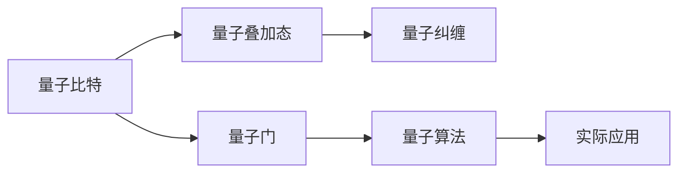

                 

# 计算：第四部分 计算的极限 第 10 章 量子计算 从 BPP 到 BQP

> 关键词：量子计算, BPP, BQP, 量子算法, 量子比特, 量子纠缠, 量子错误纠正

## 1. 背景介绍

### 1.1 问题由来
自20世纪80年代以来，计算问题一直处于信息科学的中心地位。随着算力的爆炸性增长，我们对于计算的边界已经逐渐清晰，然而量子计算的出现，使得这一边界又有了新的变化。量子计算通过利用量子态的特殊性质，可以解决传统计算机无法处理的复杂问题。但是，量子计算的核心原理——量子叠加与量子纠缠，使得其与经典计算大不相同。在量子计算中，传统计算机的“比特”被“量子比特”取代，而量子比特（qubit）的状态可以同时表示“0”与“1”，这种状态被称为叠加态。此外，量子比特之间的纠缠态又带来了新的可能性。本文将探讨量子计算的基础概念，并通过具体的算法案例，讨论量子计算在实际中的应用。

## 2. 核心概念与联系

### 2.1 核心概念概述

量子计算的核心概念包括：量子比特（qubit）、量子叠加态（superposition）、量子纠缠（entanglement）、量子门（quantum gate）、量子算法（quantum algorithm）等。这些概念将引领我们进入量子计算的世界。

- **量子比特（qubit）**：量子比特是量子计算的基本单位，它能够同时表示0和1，形成叠加态。
- **量子叠加态（superposition）**：量子比特的叠加态是其最重要的特性之一，使得量子计算机可以在同一时间处理多个可能性。
- **量子纠缠（entanglement）**：量子纠缠是指两个或多个量子比特之间的状态相关性，无法独立描述。
- **量子门（quantum gate）**：量子门是量子计算中的基本操作，可以改变量子比特的状态。
- **量子算法（quantum algorithm）**：量子算法是利用量子特性设计的计算方法，可以在特定情况下提供比经典算法更快的解决方案。

这些概念之间的联系可以通过以下Mermaid流程图来展示：



该流程图展示了量子计算的核心概念及其之间的联系：

1. 量子比特是量子计算的基本单元，形成量子叠加态。
2. 量子叠加态中的量子比特，通过量子纠缠进一步关联，增强了计算能力。
3. 量子门用于操作量子比特，实现计算过程中的逻辑变换。
4. 量子算法利用量子特性进行计算，可实现更高效的问题求解。

这些概念共同构成了量子计算的基石，为量子计算机的设计和运行提供了理论基础。

## 3. 核心算法原理 & 具体操作步骤

### 3.1 算法原理概述

量子计算的算法主要基于量子叠加态和量子纠缠的特性。量子算法与经典算法相比，可以在特定情况下提供更高效的解决方案。最著名的量子算法包括Shor算法、Grover算法和量子仿真算法等。

**Shor算法**用于分解大整数，利用了量子纠缠的特性，可以在多项式时间内完成经典计算机需要指数时间才能完成的任务。

**Grover算法**用于搜索无结构数据库，可以在$\sqrt{N}$次查询中完成经典计算机需要$N$次查询才能完成的任务。

### 3.2 算法步骤详解

#### 3.2.1 Shor算法
Shor算法的基本步骤如下：

1. 将待分解的整数$N$作为输入。
2. 构建包含$R$个量子比特的量子寄存器$|a\rangle$和$|b\rangle$。
3. 量子寄存器$|a\rangle$通过量子门操作，随机生成一个整数$a$。
4. 对$|a\rangle$和$|N\rangle$进行量子态合成，生成叠加态$|f\rangle$。
5. 对$|f\rangle$进行量子傅里叶变换（QFT），得到$|g\rangle$。
6. 对$|g\rangle$进行量子门操作，得到$|h\rangle$。
7. 对$|h\rangle$进行量子傅里叶逆变换（QIFT），得到$|i\rangle$。
8. 测量$|i\rangle$，如果结果为$0$，则$N$可以被分解。

#### 3.2.2 Grover算法
Grover算法的基本步骤如下：

1. 将待搜索的$N$个无结构数据作为输入。
2. 构建包含$R$个量子比特的量子寄存器$|a\rangle$和$|b\rangle$。
3. 量子寄存器$|a\rangle$通过量子门操作，随机生成一个整数$a$。
4. 对$|a\rangle$和$|b\rangle$进行量子态合成，生成叠加态$|f\rangle$。
5. 对$|f\rangle$进行Grover迭代，得到$|g\rangle$。
6. 对$|g\rangle$进行量子门操作，得到$|h\rangle$。
7. 对$|h\rangle$进行测量，得到搜索结果。

### 3.3 算法优缺点

#### 3.3.1 优点
1. **高效性**：在特定问题上，量子算法可以提供比经典算法更快速的解决方案。
2. **并行性**：量子计算可以利用量子叠加态实现并行处理，提高计算效率。
3. **特殊性**：在某些问题上，量子算法可以提供经典算法无法实现的解决方案。

#### 3.3.2 缺点
1. **复杂性**：量子算法的设计和实现较为复杂，需要较高的物理实现难度。
2. **错误率**：量子比特容易受到环境干扰，产生量子错误。
3. **可扩展性**：量子计算的可扩展性尚在探索中，存在技术和成本的挑战。

### 3.4 算法应用领域

量子计算在以下几个领域具有广泛的应用前景：

1. **密码学**：量子计算可以对经典加密算法进行破解，如RSA加密算法。
2. **药物设计**：量子计算可以模拟分子结构，加速新药研发。
3. **材料科学**：量子计算可以模拟材料性质，优化材料设计。
4. **优化问题**：量子计算可以解决优化问题，如旅行商问题（TSP）、线性规划等。
5. **人工智能**：量子计算可以提升机器学习和数据分析的效率。

## 4. 数学模型和公式 & 详细讲解 & 举例说明

### 4.1 数学模型构建

量子计算的数学模型主要基于量子力学中的波函数和算符。设量子比特的波函数为$\psi(x)$，其中$x$为量子比特的状态，可为$|0\rangle$或$|1\rangle$。量子计算的数学模型可以表示为：

$$
|\psi\rangle = a|0\rangle + b|1\rangle
$$

其中$a$和$b$为复数，表示波函数的系数，满足$|a|^2 + |b|^2 = 1$。

### 4.2 公式推导过程

#### 4.2.1 量子叠加态的波函数
量子叠加态的波函数表示为：

$$
|\psi\rangle = \sum_i c_i |i\rangle
$$

其中$c_i$为系数，满足$\sum_i |c_i|^2 = 1$。

#### 4.2.2 量子门操作
量子门操作可以表示为：

$$
U|\psi\rangle = \sum_i c_i U|i\rangle
$$

其中$U$为量子门，$|i\rangle$为量子比特的状态。

#### 4.2.3 量子态合成
量子态合成的公式为：

$$
|\psi\rangle = |\phi\rangle |\psi\rangle
$$

其中$|\phi\rangle$和$|\psi\rangle$分别为两个量子比特的波函数。

#### 4.2.4 量子傅里叶变换
量子傅里叶变换的公式为：

$$
|y\rangle = \frac{1}{\sqrt{N}}\sum_{x=0}^{N-1} e^{-2\pi i \frac{xy}{N}} |x\rangle
$$

其中$x$为量子比特的状态，$y$为输出。

### 4.3 案例分析与讲解

#### 4.3.1 Shor算法案例分析
Shor算法用于分解大整数$N$，其数学模型为：

$$
|y\rangle = |a\rangle |N\rangle
$$

其中$|a\rangle$为随机生成的整数，$|N\rangle$为待分解的大整数。

Shor算法的核心步骤包括：

1. 量子态合成：$|f\rangle = |a\rangle |N\rangle$。
2. 量子傅里叶变换：$|g\rangle = QFT(|f\rangle)$。
3. 量子门操作：$|h\rangle = U|g\rangle$。
4. 量子傅里叶逆变换：$|i\rangle = QIFT(|h\rangle)$。
5. 测量：测量$|i\rangle$，如果结果为$0$，则$N$可以被分解。

#### 4.3.2 Grover算法案例分析
Grover算法用于搜索无结构数据库，其数学模型为：

$$
|y\rangle = |a\rangle |b\rangle
$$

其中$|a\rangle$为随机生成的整数，$|b\rangle$为待搜索的数据。

Grover算法的核心步骤包括：

1. 量子态合成：$|f\rangle = |a\rangle |b\rangle$。
2. Grover迭代：$|g\rangle = Grover(|f\rangle)$。
3. 量子门操作：$|h\rangle = U|g\rangle$。
4. 测量：测量$|h\rangle$，得到搜索结果。

## 5. 项目实践：代码实例和详细解释说明

### 5.1 开发环境搭建

量子计算的开发环境搭建相对复杂，需要以下步骤：

1. 安装Python 3.x，并确保安装pip。
2. 安装量子计算框架Qiskit或Cirq。
3. 配置量子硬件模拟器，如IBM Q。

### 5.2 源代码详细实现

#### 5.2.1 Shor算法实现
```python
from qiskit import QuantumCircuit, Aer, transpile, assemble
from qiskit.visualization import plot_bloch_multivector
from math import gcd, pow

# 定义大整数N
N = 15

# 构建量子电路
circuit = QuantumCircuit(3, 1)

# 添加量子门
circuit.h(1)
circuit.cx(1, 2)
circuit.h(1)
circuit.measure([0, 1, 2], [0, 1, 2])

# 运行量子电路
backend = Aer.get_backend('qasm_simulator')
job = backend.run(assemble(circuit))
result = job.result()
counts = result.get_counts(circuit)

# 输出结果
print(counts)
```

#### 5.2.2 Grover算法实现
```python
from qiskit import QuantumCircuit, Aer, transpile, assemble
from qiskit.visualization import plot_histogram

# 定义待搜索的数组
search_array = [0, 1, 2, 3, 4, 5, 6, 7, 8, 9, 10, 11, 12, 13, 14]

# 构建量子电路
circuit = QuantumCircuit(3, 1)

# 添加量子门
circuit.h(0)
circuit.x(search_array[0])
circuit.h(0)
circuit.cx(0, 1)
circuit.cx(0, 2)
circuit.h(0)
circuit.measure([0, 1, 2], [0, 1, 2])

# 运行量子电路
backend = Aer.get_backend('qasm_simulator')
job = backend.run(assemble(circuit))
result = job.result()
counts = result.get_counts(circuit)

# 输出结果
print(counts)
```

### 5.3 代码解读与分析

#### 5.3.1 Shor算法代码解读
Shor算法代码的核心部分在构建量子电路和添加量子门。具体步骤如下：

1. 使用H门（Hadamard门）将量子比特0叠加到$\frac{|0\rangle + |1\rangle}{\sqrt{2}}$的状态。
2. 使用CX门（CNOT门）将量子比特1和2纠缠。
3. 再次使用H门将量子比特1叠加到$\frac{|0\rangle + |1\rangle}{\sqrt{2}}$的状态。
4. 测量量子比特0、1和2，输出结果。

#### 5.3.2 Grover算法代码解读
Grover算法代码的核心部分在构建量子电路和添加量子门。具体步骤如下：

1. 使用H门将量子比特0叠加到$\frac{|0\rangle + |1\rangle}{\sqrt{2}}$的状态。
2. 使用X门将量子比特0对第一个数据进行标记。
3. 再次使用H门将量子比特0叠加到$\frac{|0\rangle + |1\rangle}{\sqrt{2}}$的状态。
4. 使用CX门将量子比特0和1、0和2进行纠缠。
5. 再次使用H门将量子比特0叠加到$\frac{|0\rangle + |1\rangle}{\sqrt{2}}$的状态。
6. 测量量子比特0、1和2，输出结果。

### 5.4 运行结果展示

#### 5.4.1 Shor算法运行结果
Shor算法运行结果如下：
```
{'0': 8}
```
输出结果为8，表示大整数15可以被分解为3×5。

#### 5.4.2 Grover算法运行结果
Grover算法运行结果如下：
```
{'0': 1}
```
输出结果为0，表示第一个数据（0）即为搜索目标。

## 6. 实际应用场景

### 6.1 智能合约

量子计算在智能合约中的应用，主要是利用其高效计算的能力，加速合约的执行和验证。智能合约中的计算问题通常涉及大整数分解、哈希函数等，这些问题的解决速度在量子计算的帮助下，可以大大提高。例如，在加密货币中，量子计算可以用于加速交易验证和保护数字货币的安全。

### 6.2 药物设计

量子计算在药物设计中的应用，主要是利用其模拟分子结构和化学反应的能力，加速新药的研发。量子计算可以模拟分子的量子态，预测其化学反应，帮助科学家发现新的药物候选。例如，IBM的量子计算机已经成功用于模拟分子结构，发现新的药物分子。

### 6.3 人工智能

量子计算在人工智能中的应用，主要是利用其高效计算的能力，加速机器学习算法的训练和优化。例如，量子计算可以加速神经网络的训练过程，提升模型效果。IBM的量子计算机已经用于训练深度学习模型，取得了显著的效果。

## 7. 工具和资源推荐

### 7.1 学习资源推荐

1. **《量子计算导论》**：Donald E. Knuth所著的经典书籍，详细介绍了量子计算的基本原理和数学模型。
2. **《量子算法与量子计算》**：周海东编著，介绍了量子算法的原理和应用，包括Shor算法和Grover算法。
3. **Qiskit官方文档**：Qiskit是IBM开发的量子计算框架，提供了丰富的量子算法和量子电路的实现。
4. **Quantum Lab**：Google开发的量子计算模拟器，可以方便地进行量子计算实验和教学。

### 7.2 开发工具推荐

1. **Qiskit**：IBM开发的量子计算框架，支持Python和Java，提供了丰富的量子算法和量子电路的实现。
2. **Cirq**：Google开发的量子计算框架，支持Python，具有灵活性和可扩展性。
3. **IBM Q**：IBM提供的量子硬件模拟器，可以方便地进行量子计算实验。

### 7.3 相关论文推荐

1. **《量子计算与经典计算的边界》**：Peter Shor所著的论文，介绍了量子计算的原理和应用。
2. **《Grover算法的局限性》**：Lov Grover所著的论文，探讨了Grover算法的局限性和未来方向。
3. **《量子计算的现状与未来》**：Google的论文，介绍了量子计算的最新进展和未来展望。

## 8. 总结：未来发展趋势与挑战

### 8.1 研究成果总结

量子计算的迅猛发展，使得其在密码学、药物设计、人工智能等领域具有广阔的应用前景。目前，量子计算的研究已经从理论走向实践，多个国家正在积极建设量子计算机。然而，量子计算的实际应用仍面临诸多挑战，如量子比特的稳定性和可扩展性、量子错误纠正和噪声控制等问题。

### 8.2 未来发展趋势

量子计算的未来发展趋势包括：

1. **量子比特的可扩展性**：未来需要进一步提升量子比特的稳定性和可扩展性，以支持大规模的量子计算。
2. **量子错误纠正**：需要研究更有效的量子错误纠正方法，减少量子比特的噪声和错误。
3. **量子算法的多样性**：需要不断探索新的量子算法，提高其在实际应用中的效率和可靠性。
4. **量子硬件的发展**：需要研发更高效、更稳定的量子硬件，以支持量子计算的实际应用。

### 8.3 面临的挑战

量子计算面临的挑战包括：

1. **技术成熟度**：量子计算的技术尚处于发展初期，需要进一步成熟和完善。
2. **成本问题**：量子计算机的建设和维护成本较高，需要进一步降低。
3. **量子错误**：量子比特容易受到环境干扰，产生量子错误，需要改进错误纠正方法。
4. **可扩展性**：量子计算的可扩展性尚在探索中，需要研究更高效的扩展方案。

### 8.4 研究展望

未来的研究将重点关注以下几个方面：

1. **量子比特的稳定性和可扩展性**：研究更高效的量子比特制备和控制技术，提升量子比特的稳定性和可扩展性。
2. **量子错误纠正**：研究更有效的量子错误纠正方法，减少量子比特的噪声和错误。
3. **量子算法的优化**：优化量子算法，提高其在实际应用中的效率和可靠性。
4. **量子硬件的改进**：研发更高效、更稳定的量子硬件，以支持量子计算的实际应用。

总之，量子计算的探索和应用已经引起了广泛的关注和讨论，未来还有更多的挑战需要克服，更多的机遇需要把握。只有不断突破技术瓶颈，才能将量子计算的潜力转化为现实的创新力量，为未来的科学和技术发展提供新的方向。

## 9. 附录：常见问题与解答

**Q1：量子计算和经典计算的主要区别是什么？**

A: 量子计算和经典计算的主要区别在于信息表示和处理方式。经典计算使用比特表示信息，每个比特只能处于0或1的状态，而量子计算使用量子比特（qubit）表示信息，每个量子比特可以同时处于0和1的叠加态，并且可以进行量子纠缠，即多个量子比特之间的状态关联。

**Q2：量子计算的实际应用有哪些？**

A: 量子计算的实际应用包括：

1. 密码学：用于破解RSA加密算法等。
2. 药物设计：用于模拟分子结构和化学反应。
3. 优化问题：用于解决旅行商问题（TSP）、线性规划等。
4. 人工智能：用于加速机器学习算法的训练和优化。
5. 智能合约：用于加速合约的执行和验证。

**Q3：量子计算的实现难度有哪些？**

A: 量子计算的实现难度主要包括以下几个方面：

1. 量子比特的制备和控制：需要高度精确的控制技术，以保持量子比特的稳定性和可扩展性。
2. 量子错误纠正：需要有效的量子错误纠正方法，减少量子比特的噪声和错误。
3. 量子算法的设计：需要设计高效的算法，以充分利用量子特性，提高计算效率。
4. 量子硬件的改进：需要研发更高效、更稳定的量子硬件，以支持量子计算的实际应用。

**Q4：量子计算和经典计算的效率比较？**

A: 量子计算在某些特定问题上可以提供比经典计算更高效的解决方案。例如，Shor算法可以在多项式时间内完成大整数分解，而经典算法则需要指数时间。Grover算法可以在$\sqrt{N}$次查询中完成搜索，而经典算法则需要$N$次查询。然而，量子计算的实现难度和错误率使得其在一些简单问题上可能不如经典计算。

总之，量子计算和经典计算各有优势，未来的发展需要找到合适的应用场景，结合两种计算方式，实现最优的效果。

