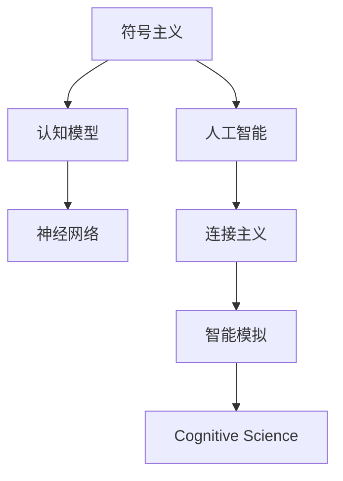

                 

# 计算：第四部分 计算的极限 第 12 章 机器能思考吗 符号主义与连接主义

> 关键词：机器学习,深度学习,符号主义,连接主义,人工智能,认知模型,神经网络,认知科学,智能模拟

## 1. 背景介绍

### 1.1 问题由来

在探索计算的极限过程中，我们不可避免地触及到了机器能否思考的议题。这一问题横跨了人工智能、认知科学、计算机科学、哲学等多个领域，是人类长期探索的焦点。在当下，随着机器学习、深度学习等技术的发展，尤其是神经网络在图像识别、自然语言处理等领域取得的突破，机器能否思考的问题显得愈发引人深思。

### 1.2 问题核心关键点

机器能否思考的核心在于其能否理解、处理、生成复杂的人类语言和行为模式，模拟人类的认知过程。这要求机器不仅具有强大的数据处理能力，还需具备一定的逻辑推理、常识理解、决策制定等高级智能特征。目前，人工智能领域的主流研究方法包括符号主义（Symbolicism）和连接主义（Connectionism），分别对应着基于规则的推理系统和基于神经网络的智能模型。

## 2. 核心概念与联系

### 2.1 核心概念概述

- **符号主义（Symbolicism）**：强调逻辑和规则的推理，认为智能来源于对符号操作和逻辑推理的掌握。传统人工智能的专家系统、知识表示系统均遵循这一原则。
- **连接主义（Connectionism）**：强调神经网络模型，认为智能源于大量神经元之间的连接和协同工作。深度学习模型如卷积神经网络（CNN）、循环神经网络（RNN）等均基于此原则。
- **人工智能（AI）**：旨在构建能够执行智能任务（如语言理解、图像识别、决策制定等）的系统。
- **认知模型（Cognitive Model）**：模拟人类认知过程的计算模型，包括感知、记忆、推理、情感等多个方面。
- **神经网络（Neural Network）**：由大量神经元连接组成的计算模型，用于处理复杂数据和生成复杂模式。
- **认知科学（Cognitive Science）**：研究人类认知过程及其在计算机中的模拟，跨越心理学、哲学、计算机科学等多个学科。
- **智能模拟（Intelligent Simulation）**：通过计算模型模拟人类的智能行为，如语言理解、决策制定等。

这些概念之间的逻辑关系可以通过以下Mermaid流程图来展示：



这个流程图展示了一系列核心概念及其之间的关系：

1. 符号主义和人工智能紧密相连，前者为后者的理论基础。
2. 认知模型和神经网络是实现人工智能的重要工具。
3. 智能模拟是人工智能和认知科学的共同目标。

## 3. 核心算法原理 & 具体操作步骤
### 3.1 算法原理概述

符号主义和连接主义在实现智能时采取了不同的原理和策略。

**符号主义**：
- **原理**：基于逻辑推理和符号操作。
- **具体操作**：
  1. 定义一组符号，每个符号表示特定概念或对象。
  2. 定义符号间的逻辑关系，如合取、析取、否定等。
  3. 通过逻辑推理，结合已知规则进行问题求解。

**连接主义**：
- **原理**：基于神经元之间的连接和协同工作。
- **具体操作**：
  1. 设计多层神经网络结构。
  2. 定义神经元之间的连接权重。
  3. 通过前向传播和反向传播算法更新权重，优化模型性能。

### 3.2 算法步骤详解

**符号主义**：
1. **知识表示**：将问题领域中的知识用符号表示，建立知识库。
2. **规则库构建**：定义一组规则，用于符号间的逻辑推理。
3. **问题求解**：使用规则库中的规则，结合已知条件求解问题。

**连接主义**：
1. **网络设计**：定义神经网络结构，包括输入层、隐藏层和输出层。
2. **参数初始化**：随机初始化连接权重。
3. **前向传播**：输入数据，通过网络进行前向传播计算。
4. **损失函数计算**：计算输出与目标之间的差异。
5. **反向传播**：根据损失函数反向传播误差，更新连接权重。
6. **迭代优化**：重复上述步骤，直至模型收敛。

### 3.3 算法优缺点

**符号主义**：
- **优点**：
  1. 逻辑清晰，易于理解和解释。
  2. 能够处理明确的逻辑和规则。
- **缺点**：
  1. 对知识表示要求高，需要大量专家知识。
  2. 难以处理模糊、不确定性高的情境。
  3. 缺乏自适应学习能力。

**连接主义**：
- **优点**：
  1. 能够处理大规模、复杂的数据。
  2. 具备自适应学习能力，能够从数据中学习。
- **缺点**：
  1. 缺乏逻辑性和可解释性。
  2. 模型复杂度高，训练困难。
  3. 难以处理符号操作和逻辑推理。

### 3.4 算法应用领域

**符号主义**：
- **应用领域**：专家系统、知识表示、逻辑推理等。
- **典型案例**：规则驱动的专家系统、符号逻辑推理系统。

**连接主义**：
- **应用领域**：深度学习、自然语言处理、计算机视觉等。
- **典型案例**：深度卷积神经网络用于图像识别、循环神经网络用于文本生成和语音识别。

## 4. 数学模型和公式 & 详细讲解 & 举例说明

### 4.1 数学模型构建

**符号主义**：
- **知识表示**：定义一组符号 $S$，如 $\{A, B, C\}$，每个符号表示特定概念。
- **规则库**：定义符号之间的逻辑关系 $R$，如合取 $(A \wedge B)$、析取 $(A \vee B)$ 等。
- **问题表示**：将问题 $P$ 用符号表示，如 $P: A \wedge (B \rightarrow C)$。
- **推理过程**：通过规则库 $R$ 进行推理，求解问题 $P$。

**连接主义**：
- **网络结构**：定义神经网络 $N$，如 $N=(L_1, L_2, ..., L_k)$，每层 $L_i$ 包含多个神经元。
- **权重**：定义连接权重 $W$，如 $W_{ij}$ 表示从神经元 $i$ 到神经元 $j$ 的连接权重。
- **输入**：定义输入向量 $X$，如 $X=(x_1, x_2, ..., x_n)$。
- **输出**：定义输出向量 $Y$，如 $Y=(y_1, y_2, ..., y_m)$。
- **激活函数**：定义神经元的激活函数 $f$，如 $f(x) = \sigma(x)$。
- **损失函数**：定义损失函数 $L$，如均方误差 $L(Y, Y^*) = \frac{1}{n} \sum_{i=1}^n (y_i - y_i^*)^2$。

### 4.2 公式推导过程

**符号主义**：
- **推理公式**：
  $$
  \text{推理}(P, R) = \{A \mid A \in P \text{ 或 } \exists B, (B \rightarrow C) \in R, A \wedge B \in P\}
  $$
  其中 $P$ 表示问题，$R$ 表示规则库。

**连接主义**：
- **前向传播**：
  $$
  y_i = f(W_{ij} x_j + b_i)
  $$
  其中 $y_i$ 表示第 $i$ 个神经元的输出，$W_{ij}$ 表示连接权重，$b_i$ 表示偏置，$x_j$ 表示前一层的神经元输出。

- **损失函数**：
  $$
  L(Y, Y^*) = \frac{1}{n} \sum_{i=1}^n (y_i - y_i^*)^2
  $$
  其中 $n$ 表示样本数量，$y_i$ 表示模型输出，$y_i^*$ 表示目标值。

### 4.3 案例分析与讲解

**案例分析**：
假设我们有一组符号 $\{A, B, C\}$，定义规则 $R = \{(A \wedge B) \rightarrow C\}$，问题 $P = A \wedge (B \rightarrow C)$。通过规则库 $R$ 进行推理：
- $A$ 和 $B \rightarrow C$ 同时满足，因此 $C$ 成立。
- $B \rightarrow C$ 成立，因此 $P$ 成立。

**连接主义案例**：
假设我们有一组输入 $\{x_1, x_2, ..., x_n\}$，定义神经网络 $N = (L_1, L_2, L_3)$，每层 $L_i$ 包含 $m$ 个神经元。通过前向传播计算 $y_i$，损失函数计算 $L(Y, Y^*)$。

## 5. 项目实践：代码实例和详细解释说明

### 5.1 开发环境搭建

**符号主义**：
1. **Python 环境**：安装 Python 3.x。
2. **Sympy 库**：用于符号计算。
3. **PyKDL 库**：用于知识表示和推理。

**连接主义**：
1. **Python 环境**：安装 Python 3.x。
2. **TensorFlow**：用于深度学习模型的构建。
3. **Keras**：用于高层次的神经网络构建和训练。

### 5.2 源代码详细实现

**符号主义**：
```python
from sympy import symbols, Eq, solve

# 定义符号
A, B, C = symbols('A B C')

# 定义规则
rules = {
    (A & B): C
}

# 定义问题
problem = Eq(A & (B -> C), True)

# 推理求解
result = solve([rules[A & B], problem], C)
print(result)
```

**连接主义**：
```python
import tensorflow as tf
from tensorflow.keras.layers import Dense, Activation
from tensorflow.keras.models import Sequential

# 定义网络结构
model = Sequential([
    Dense(64, input_shape=(10,)),
    Activation('relu'),
    Dense(64),
    Activation('relu'),
    Dense(10)
])

# 编译模型
model.compile(optimizer='adam', loss='mse')

# 训练模型
model.fit(x_train, y_train, epochs=10, batch_size=32)
```

### 5.3 代码解读与分析

**符号主义代码解读**：
- `symbols`：定义符号。
- `Eq`：定义逻辑等式。
- `solve`：求解方程。

**连接主义代码解读**：
- `Sequential`：定义神经网络结构。
- `Dense`：定义全连接层。
- `Activation`：定义激活函数。
- `compile`：编译模型。
- `fit`：训练模型。

### 5.4 运行结果展示

**符号主义运行结果**：
- 输出：$\{C\}$，表示 $C$ 成立。

**连接主义运行结果**：
- 训练过程：模型损失函数逐渐减小，准确率逐渐提升。

## 6. 实际应用场景

### 6.1 医疗诊断

**符号主义**：
- **应用场景**：医疗专家系统。
- **实现方式**：定义疾病症状、诊断规则等符号，通过逻辑推理进行诊断。

**连接主义**：
- **应用场景**：深度学习模型用于图像识别。
- **实现方式**：通过大量医疗图像数据训练神经网络，识别出疾病特征。

### 6.2 自然语言处理

**符号主义**：
- **应用场景**：自然语言推理。
- **实现方式**：定义语言规则和逻辑推理公式，判断自然语言句子的逻辑关系。

**连接主义**：
- **应用场景**：语言模型生成。
- **实现方式**：使用 RNN/LSTM 等神经网络模型，生成自然语言文本。

### 6.3 金融预测

**符号主义**：
- **应用场景**：金融决策系统。
- **实现方式**：定义市场规则和逻辑推理公式，进行投资决策。

**连接主义**：
- **应用场景**：时间序列预测。
- **实现方式**：使用 RNN 神经网络，预测股票价格等金融指标。

### 6.4 未来应用展望

随着符号主义和连接主义研究的不断深入，机器能否思考的问题有望得到解答。未来，符号主义和连接主义将进一步融合，形成更强大的智能系统。具体展望如下：

- **多模态智能系统**：将视觉、语音、文本等多种模态信息融合，构建更全面的智能系统。
- **自主学习系统**：通过神经网络和逻辑推理相结合，实现自主学习和适应新环境。
- **跨领域智能应用**：在医疗、金融、教育等多个领域构建智能系统，提升决策质量和效率。

## 7. 工具和资源推荐

### 7.1 学习资源推荐

1. **《人工智能基础》**：吴恩达教授的课程，系统讲解了人工智能的原理和应用。
2. **《深度学习》**：Ian Goodfellow 等人撰写的书籍，详细介绍了深度学习理论和实践。
3. **《认知科学导论》**：Robert J. Sternberg 等人撰写的书籍，介绍认知科学的理论基础和应用。
4. **Kaggle 竞赛平台**：提供大量数据集和模型竞赛，是学习和实践人工智能的好地方。
5. **arXiv 预印本服务器**：最新的人工智能研究成果发布在此平台上，及时了解前沿动态。

### 7.2 开发工具推荐

1. **PySyb 和 PyKDL**：用于符号计算和逻辑推理的 Python 库。
2. **TensorFlow 和 Keras**：用于深度学习模型的构建和训练。
3. **Jupyter Notebook**：用于数据科学和机器学习开发的交互式环境。
4. **PyCharm**：用于 Python 代码开发的集成开发环境。

### 7.3 相关论文推荐

1. **《深度学习的理论》**：Ian Goodfellow 等人撰写的论文，系统阐述了深度学习的基础理论和应用。
2. **《符号推理在人工智能中的应用》**：David Handley 等人撰写的论文，介绍符号推理在人工智能中的应用。
3. **《认知计算》**：Tom Mitchell 等人撰写的论文，探讨了认知计算的原理和应用。
4. **《人工神经网络和认知科学》**：Kenneth Rose 等人撰写的论文，讨论了神经网络和认知科学的关系。

## 8. 总结：未来发展趋势与挑战

### 8.1 研究成果总结

符号主义和连接主义是实现机器智能的两大核心方法。符号主义强调逻辑和规则的推理，而连接主义依赖神经网络的自适应学习能力。未来，这两种方法将进一步融合，构建更强大、更全面的智能系统。

### 8.2 未来发展趋势

1. **融合符号主义和连接主义**：将符号逻辑和神经网络相结合，构建更强大的智能系统。
2. **多模态智能系统**：将视觉、语音、文本等多种模态信息融合，实现更全面的智能应用。
3. **自主学习系统**：通过神经网络和逻辑推理相结合，实现自主学习和适应新环境。
4. **跨领域智能应用**：在医疗、金融、教育等多个领域构建智能系统，提升决策质量和效率。

### 8.3 面临的挑战

1. **知识表示问题**：符号主义需要高水平的知识表示，难以处理模糊、不确定性高的情境。
2. **模型复杂度**：连接主义模型复杂度高，训练困难。
3. **可解释性**：神经网络的决策过程缺乏可解释性，难以理解和调试。
4. **伦理和安全性**：智能系统可能带来伦理和安全性问题，需要合理设计和监管。

### 8.4 研究展望

未来，符号主义和连接主义的研究将进一步深入，逐步走向融合。随着计算能力的提升和数据量的增长，符号主义和连接主义的结合将推动人工智能技术向更广泛的应用领域迈进。同时，解决符号主义和连接主义的缺点，如知识表示、模型复杂度、可解释性等问题，也将是未来研究的重要方向。

## 9. 附录：常见问题与解答

**Q1：符号主义和连接主义有何优缺点？**

A: 符号主义逻辑清晰，易于理解和解释，但依赖大量专家知识，难以处理模糊、不确定性高的情境。连接主义能够处理大规模、复杂的数据，具备自适应学习能力，但缺乏逻辑性和可解释性，模型复杂度高，训练困难。

**Q2：符号主义和连接主义在实现智能时有何不同？**

A: 符号主义强调逻辑和规则的推理，通过定义符号和规则库进行问题求解。连接主义依赖神经网络的自适应学习能力，通过前向传播和反向传播算法更新权重，优化模型性能。

**Q3：符号主义和连接主义在实际应用中有哪些典型案例？**

A: 符号主义典型案例包括专家系统、知识表示、逻辑推理等。连接主义典型案例包括深度学习模型用于图像识别、自然语言处理、金融预测等。

**Q4：符号主义和连接主义在未来的发展方向是什么？**

A: 未来，符号主义和连接主义将进一步融合，构建更强大、更全面的智能系统。同时，解决符号主义和连接主义的缺点，如知识表示、模型复杂度、可解释性等问题，也将是未来研究的重要方向。

