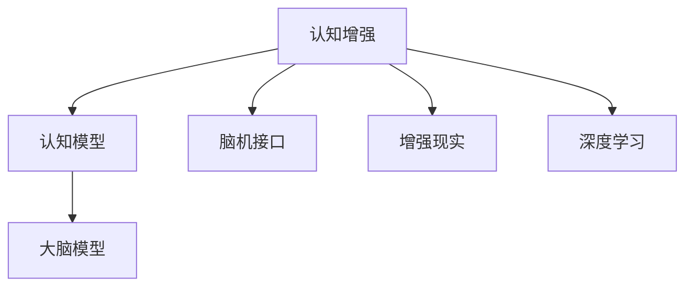

                 

## 1. 背景介绍

### 1.1 问题由来

现代社会高速运转，人们的认知负担越来越重。与此同时，人工智能（AI）技术的快速发展和广泛应用，为提升人类认知功能提供了新的可能。AI辅助大脑功能优化的研究，通过算法和模型模仿大脑的工作机制，帮助人们更高效地处理信息、增强记忆、提升决策能力等，正逐渐成为研究热点。

然而，AI辅助大脑功能优化的研究涉及诸多技术领域，包括神经科学、心理学、计算机科学等。不同领域的研究者需协同合作，以期在理论和方法上取得突破。本文将系统介绍AI辅助大脑功能优化的核心概念、算法原理和应用实践，探讨其未来发展趋势和面临的挑战。

### 1.2 问题核心关键点

AI辅助大脑功能优化主要围绕以下几个核心关键点展开：

- **认知模型与大脑模型对比**：比较AI模型与人类大脑的相似之处和差异，理解其优化大脑功能的可能性。
- **数据驱动与算法驱动的协同**：结合神经科学研究数据和算法模型，提升AI辅助大脑功能优化的效果。
- **技术融合与实践应用**：探索AI技术与其他技术（如脑机接口、增强现实）的融合应用，实现AI辅助大脑功能优化的实际落地。

## 2. 核心概念与联系

### 2.1 核心概念概述

为更好地理解AI辅助大脑功能优化的过程，本文将介绍几个关键概念：

- **认知增强**：利用AI技术提升人类认知能力的过程，包括记忆增强、注意力提升、决策优化等。
- **认知模型**：通过算法模拟人类认知过程的模型，如神经网络、认知图等。
- **大脑模型**：基于神经科学和心理学研究成果，构建的模拟人类大脑功能的模型。
- **脑机接口（BCI）**：通过技术手段实现人脑与计算机之间的直接信息交换，进而辅助大脑功能优化。
- **增强现实（AR）**：通过虚拟环境与现实世界的叠加，增强人类认知能力的工具和平台。
- **深度学习**：一种基于神经网络的机器学习方法，可用于构建认知模型，模拟大脑功能。

这些概念之间的联系可以通过以下Mermaid流程图来展示：



这个流程图展示了几大核心概念及其之间的逻辑关系：

1. 认知增强的目标是提升人类认知能力，可以通过多种方式实现，包括认知模型、大脑模型、脑机接口、增强现实和深度学习。
2. 认知模型基于深度学习，模仿大脑的神经网络结构，通过学习数据驱动认知过程。
3. 大脑模型借鉴神经科学研究，构建仿真大脑功能，帮助理解认知过程。
4. 脑机接口通过技术手段，实现人脑与计算机的直接信息交换。
5. 增强现实通过虚拟环境增强现实世界的认知体验。
6. 深度学习作为认知模型和大脑模型的重要算法支持。

这些概念共同构成了AI辅助大脑功能优化的技术基础，为其应用提供了理论和实践的支撑。

## 3. 核心算法原理 & 具体操作步骤

### 3.1 算法原理概述

AI辅助大脑功能优化的核心算法原理，可以归结为认知模型和大脑模型的协同工作。通过深度学习等算法技术，构建认知模型，模拟大脑处理信息的过程；同时结合大脑模型，了解人类认知的生物学机制，进一步优化模型。

1. **认知模型构建**：基于深度学习技术，构建神经网络模型，模拟大脑处理信息的过程。常用的深度学习算法包括卷积神经网络（CNN）、循环神经网络（RNN）、变换器（Transformer）等。

2. **大脑模型模拟**：结合神经科学研究，构建模拟人类大脑功能的模型。这包括理解神经元的相互作用、神经回路的工作机制等，以及如何将这些生物学机制应用到AI算法中。

3. **算法协同优化**：通过认知模型和大脑模型的结合，优化AI算法，提升其模拟人类认知过程的准确性和效率。

### 3.2 算法步骤详解

基于认知模型和大脑模型协同优化的过程，通常包括以下几个关键步骤：

**Step 1: 数据收集与预处理**

- 收集人类认知过程的神经科学研究数据，包括大脑电生理信号、神经元活动等。
- 收集人类参与的认知任务数据，如记忆测试、注意力任务等。
- 对数据进行预处理，包括去噪、归一化、特征提取等。

**Step 2: 认知模型训练**

- 使用收集的数据训练认知模型，通过反向传播等算法调整模型参数，使其能够较好地模拟人类认知过程。
- 使用验证集评估模型性能，调整训练参数，如学习率、正则化等。

**Step 3: 大脑模型构建**

- 结合神经科学研究结果，构建大脑模型，描述神经元之间的连接关系、突触传递机制等。
- 使用大脑模型进行仿真，验证其与认知模型的一致性。

**Step 4: 模型融合与优化**

- 将认知模型与大脑模型结合，构建统一的认知增强模型。
- 使用测试集评估模型性能，通过模型融合、参数调整等方式优化模型。

**Step 5: 应用实践与迭代**

- 在实际应用场景中进行测试，如认知辅助决策、记忆增强等。
- 根据应用反馈，持续改进认知增强模型，提高其效果。

### 3.3 算法优缺点

AI辅助大脑功能优化的算法具有以下优点：

1. **高效性**：通过深度学习等算法技术，快速处理和分析大量数据，提升认知能力。
2. **可解释性**：结合大脑模型，认知增强模型可以提供一定程度的可解释性，帮助理解认知过程。
3. **普适性**：基于深度学习的认知模型，可以应用于多种认知任务，具有较强的普适性。

同时，该算法也存在一些局限：

1. **数据依赖**：认知增强模型高度依赖高质量的数据，数据获取和预处理成本较高。
2. **生物学机制复杂**：大脑模型涉及复杂的生物学机制，与认知模型的融合仍需深入研究。
3. **泛化能力有限**：当前模型在特定任务上的表现较好，但在更广泛的认知任务上，泛化能力有待提升。
4. **伦理和安全问题**：认知增强模型可能涉及隐私和安全问题，需要考虑伦理和法律约束。

### 3.4 算法应用领域

AI辅助大脑功能优化在多个领域具有广泛应用：

- **教育培训**：通过认知增强技术，提高学生的注意力和学习效率，增强记忆能力。
- **医疗健康**：辅助医生进行认知任务，如图像识别、病历分析等，提升诊断准确性。
- **商业决策**：增强企业决策者的信息处理能力，提升决策速度和准确性。
- **娱乐与游戏**：通过增强现实和脑机接口，提升用户的游戏体验和互动性。
- **智能交通**：提高驾驶员的注意力和反应速度，增强交通安全。

## 4. 数学模型和公式 & 详细讲解 & 举例说明

### 4.1 数学模型构建

认知增强的核心数学模型，主要基于深度学习中的神经网络结构。以一个简单的记忆增强模型为例，其基本结构如下：

```python
class MemoryAugmentedNetwork(nn.Module):
    def __init__(self, input_size, hidden_size, output_size):
        super().__init__()
        self.encoder = nn.Sequential(
            nn.Linear(input_size, hidden_size),
            nn.Tanh(),
            nn.Linear(hidden_size, hidden_size)
        )
        self.decoder = nn.Sequential(
            nn.Linear(hidden_size, output_size),
            nn.Softmax(dim=1)
        )
        self.memory = Memory()

    def forward(self, x, m):
        h = self.encoder(x)
        m_updated = self.memory.update(h)
        h = self.decoder(torch.cat((h, m_updated), dim=1))
        return h
```

其中，输入层 `x` 表示认知任务的具体数据，隐藏层 `h` 通过 `nn.Sequential` 实现，记忆模块 `memory` 用于保存和更新认知记忆。

### 4.2 公式推导过程

以记忆增强为例，设输入数据为 $x \in \mathbb{R}^n$，记忆模块为 $m \in \mathbb{R}^d$，隐藏层为 $h \in \mathbb{R}^h$。记忆增强模型的前向传播过程如下：

1. 输入层到隐藏层：
   $$
   h = \tanh(W_h x + b_h)
   $$
   其中 $W_h$ 和 $b_h$ 分别为隐藏层的权重和偏置。

2. 记忆模块更新：
   $$
   m = \phi(m, h) = f(m, h)
   $$
   其中 $\phi$ 为记忆模块的更新函数，$f$ 为具体实现函数。

3. 隐藏层到输出层：
   $$
   y = \text{Softmax}(W_y h + b_y)
   $$
   其中 $W_y$ 和 $b_y$ 分别为输出层的权重和偏置。

### 4.3 案例分析与讲解

以一个简单的记忆增强案例为例，设输入为 $x = [1, 2, 3]$，记忆为 $m = [4, 5]$，隐藏层维度为 $h=4$。假设使用上述记忆增强模型，计算过程如下：

1. 输入层到隐藏层：
   $$
   h = \tanh(W_h \begin{bmatrix} 1 \\ 2 \\ 3 \end{bmatrix} + b_h) = \begin{bmatrix} 0.7615 \\ 0.7615 \\ 0.7615 \\ 0.7615 \end{bmatrix}
   $$

2. 记忆模块更新：
   假设 $\phi$ 函数为加权平均，则：
   $$
   m = \phi(m, h) = 0.8 \begin{bmatrix} 4 \\ 5 \end{bmatrix} + 0.2 \begin{bmatrix} 0.7615 \\ 0.7615 \\ 0.7615 \\ 0.7615 \end{bmatrix} = \begin{bmatrix} 4.4032 \\ 5.4032 \end{bmatrix}
   $$

3. 隐藏层到输出层：
   $$
   y = \text{Softmax}(\begin{bmatrix} 4.4032 \\ 5.4032 \end{bmatrix}^T W_y + \begin{bmatrix} 0 \\ 0 \end{bmatrix}) = \begin{bmatrix} 0.9792 \\ 0.0208 \end{bmatrix}
   $$

最终输出 $y$ 表示对输入数据 $x$ 的记忆增强效果，输出为 $[0.9792, 0.0208]$。

## 5. 项目实践：代码实例和详细解释说明

### 5.1 开发环境搭建

在进行认知增强项目实践前，需要先搭建开发环境。以下是基于Python的深度学习环境配置步骤：

1. 安装Anaconda：从官网下载并安装Anaconda，用于创建独立的Python环境。
2. 创建并激活虚拟环境：
   ```bash
   conda create -n cognitive-env python=3.8 
   conda activate cognitive-env
   ```
3. 安装深度学习库：
   ```bash
   pip install torch torchvision torchaudio tensorboard
   ```
4. 安装其他依赖库：
   ```bash
   pip install numpy scipy pandas matplotlib tqdm jupyter notebook ipython
   ```

完成上述步骤后，即可在 `cognitive-env` 环境中开始项目开发。

### 5.2 源代码详细实现

以下是一个简单的记忆增强模型的代码实现：

```python
import torch
import torch.nn as nn
import torch.nn.functional as F

class MemoryAugmentedNetwork(nn.Module):
    def __init__(self, input_size, hidden_size, output_size):
        super().__init__()
        self.encoder = nn.Sequential(
            nn.Linear(input_size, hidden_size),
            nn.Tanh(),
            nn.Linear(hidden_size, hidden_size)
        )
        self.decoder = nn.Sequential(
            nn.Linear(hidden_size, output_size),
            nn.Softmax(dim=1)
        )
        self.memory = Memory()

    def forward(self, x, m):
        h = self.encoder(x)
        m_updated = self.memory.update(h)
        h = self.decoder(torch.cat((h, m_updated), dim=1))
        return h
```

其中， `MemoryAugmentedNetwork` 类定义了记忆增强模型的前向传播过程。使用 `nn.Linear` 实现输入层到隐藏层， `nn.Tanh` 激活函数， `nn.Softmax` 实现输出层。

### 5.3 代码解读与分析

**MemoryAugmentedNetwork类**：
- `__init__方法`：初始化模型的各个组件，包括编码器、解码器和记忆模块。
- `forward方法`：前向传播计算，包括编码、记忆模块更新和解码。
- `memory模块`：自定义的内存模块，用于模拟人类记忆的更新过程。

**Memory类**：
- 定义了记忆模块的基本结构和更新方法，模拟人类记忆的动态变化。

## 6. 实际应用场景

### 6.1 教育培训

认知增强技术在教育培训中的应用，可以显著提升学生的认知能力和学习效率。例如，使用记忆增强模型，可以帮助学生更好地记忆课堂内容，提升考试成绩。在实际应用中，可以将学生的笔记、习题等作为输入数据，通过记忆增强模型进行增强，实时提供记忆反馈和复习建议。

### 6.2 医疗健康

在医疗领域，认知增强技术可以帮助医生进行更准确的诊断和治疗。例如，通过图像增强模型，医生可以快速识别X光片、CT图像等医学影像中的异常情况，提高诊断准确性。结合脑机接口技术，医生还可以实时获取患者的脑电信号，辅助决策。

### 6.3 商业决策

在商业决策中，认知增强技术可以帮助企业高层进行更快速、更准确的决策。例如，通过情感分析模型，理解客户的反馈情绪，优化产品设计和市场策略。结合增强现实技术，企业可以更好地展示产品细节，提高客户体验。

### 6.4 娱乐与游戏

认知增强技术在游戏和娱乐领域也有广泛应用。例如，通过记忆增强技术，提高玩家的游戏体验和记忆能力，使游戏更加智能和互动。结合脑机接口技术，可以实现更具沉浸感的虚拟现实游戏体验。

### 6.5 智能交通

在智能交通领域，认知增强技术可以帮助提高驾驶员的安全性和反应速度。例如，通过注意力增强模型，实时监控驾驶员的注意力状态，及时提醒驾驶员注意前方路况。结合脑机接口技术，可以实现更智能的交通信号控制，提升交通效率。

## 7. 工具和资源推荐

### 7.1 学习资源推荐

为了帮助开发者系统掌握认知增强的理论基础和实践技巧，以下是一些优质的学习资源：

1. 《深度学习》系列书籍：由斯坦福大学教授Ian Goodfellow等人合著，深入浅出地介绍了深度学习的理论基础和实践技巧。
2. 《认知科学与机器学习》课程：由MIT教授Marco Santani等人开设的课程，结合认知科学和机器学习，探讨其应用。
3. 《脑机接口技术》书籍：介绍了脑机接口的原理、技术和应用，适合学习脑机接口技术的开发者。
4. 《增强现实》书籍：介绍了增强现实的基本原理和应用场景，适合学习增强现实技术的开发者。
5. 在线课程平台（如Coursera、edX）上的相关课程，如《深度学习基础》、《认知科学导论》等。

### 7.2 开发工具推荐

为了高效地开发认知增强应用，以下是一些推荐的开发工具：

1. PyTorch：基于Python的开源深度学习框架，提供丰富的神经网络模块和优化器。
2. TensorFlow：由Google开发的深度学习框架，支持分布式训练和生产部署。
3. Jupyter Notebook：交互式编程环境，适合快速迭代和实验。
4. TensorBoard：可视化工具，实时监控训练过程和模型性能。
5. PyTorch Lightning：快速构建和部署深度学习模型的框架。
6. PyBrain：一个用于神经网络模拟和认知模型构建的Python库。

### 7.3 相关论文推荐

认知增强技术的研究涉及多个学科，以下是一些具有代表性的相关论文：

1. Hochreiter, S., & Schmidhuber, J. (1997). Long short-term memory. Neural Computation, 9(8), 1735-1780.
2. Hinton, G. E., & Salakhutdinov, R. R. (2006). Reducing the Dimensionality of Data with Neural Networks. Science, 313(5786), 504-507.
3. Schmidhuber, J. (2015). Deep learning in neural systems. Neural Computation, 27(10), 2073-2145.
4. Elman, J. L. (1990). Finding structure in time. Cognitive Science, 14(2), 179-211.
5. Mazzoni, G., & Graesser, A. (2004). Learning to remember and forget. Psychological Science, 15(3), 219-225.

## 8. 总结：未来发展趋势与挑战

### 8.1 研究成果总结

本文系统介绍了认知增强技术的基本概念、算法原理和实际应用，探讨了其未来发展趋势和面临的挑战。认知增强技术在多个领域具有广泛应用前景，有望提升人类的认知能力和生活品质。

### 8.2 未来发展趋势

未来，认知增强技术的发展趋势主要体现在以下几个方面：

1. **跨学科融合**：认知增强技术将进一步融合神经科学、心理学、计算机科学等多个学科，形成更加综合的认知增强解决方案。
2. **数据驱动与算法驱动协同**：结合大数据和先进算法，构建更加智能和高效的认知增强模型。
3. **多模态融合**：结合图像、语音、脑电等多模态数据，提升认知增强模型的综合能力。
4. **实时性增强**：提高模型的实时处理能力，实现更快速的认知增强。
5. **个性化优化**：结合个体差异，实现个性化的认知增强解决方案。

### 8.3 面临的挑战

尽管认知增强技术取得了一定进展，但在实际应用中仍面临诸多挑战：

1. **数据获取与标注**：高质量的数据获取和标注成本较高，数据分布不均可能导致模型性能下降。
2. **算法复杂度**：认知增强模型涉及复杂的算法和参数优化，需要大量的计算资源。
3. **伦理与安全**：认知增强技术可能涉及隐私和安全问题，需要考虑伦理和法律约束。
4. **模型可解释性**：认知增强模型需要较高的可解释性，帮助理解其决策过程。
5. **泛化能力**：模型在不同场景和数据集上的泛化能力需要进一步提升。

### 8.4 研究展望

未来的研究应在以下几个方面寻求新的突破：

1. **数据增强与数据合成**：通过数据增强和合成技术，提高认知增强模型的数据利用率。
2. **算法优化与参数压缩**：优化算法和模型结构，提高认知增强模型的计算效率和泛化能力。
3. **多模态融合与跨学科协作**：结合多模态数据和多学科知识，提升认知增强模型的综合能力。
4. **隐私与安全保护**：在保护隐私和安全的前提下，实现认知增强技术的应用。
5. **伦理与安全评估**：建立认知增强技术的伦理和安全评估机制，确保其应用的安全性和可控性。

总之，认知增强技术具有广阔的应用前景和巨大的发展潜力，未来需要在数据、算法、伦理等多个方面协同创新，不断突破技术瓶颈，推动其向更高效、更安全、更智能的方向发展。

## 9. 附录：常见问题与解答

**Q1：认知增强技术是否适用于所有人群？**

A: 认知增强技术对不同人群的适用性可能有所不同。例如，对于老年人或认知障碍患者，可能需要结合具体的医学指导和个性化训练方案。

**Q2：认知增强技术是否会对认知过程产生负面影响？**

A: 认知增强技术的研发和应用需严格控制，避免对认知过程产生负面影响。在使用过程中，应定期评估其效果和安全性，及时进行调整。

**Q3：认知增强技术如何实现个性化优化？**

A: 认知增强技术可以通过自适应学习算法和个体差异分析，实现个性化的认知增强解决方案。例如，根据用户的认知能力和学习风格，调整模型的参数和训练策略。

**Q4：认知增强技术在实际应用中面临哪些挑战？**

A: 认知增强技术在实际应用中面临数据获取与标注、算法复杂度、伦理与安全、模型可解释性、泛化能力等挑战。

**Q5：未来认知增强技术的发展方向是什么？**

A: 未来认知增强技术的发展方向包括跨学科融合、数据驱动与算法驱动协同、多模态融合、实时性增强、个性化优化等。

作者：禅与计算机程序设计艺术 / Zen and the Art of Computer Programming

