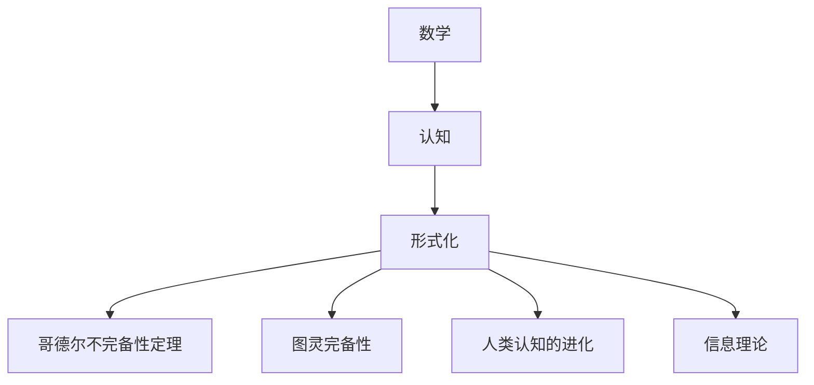

                 

# 认知的形式化：宇宙里没有数学，数学却可以解释宇宙

## 1. 背景介绍

### 1.1 问题由来
数学作为人类文明的重要组成部分，长期以来被视作理解宇宙和描述自然规律的基石。从古希腊的毕达哥拉斯学派到现代的物理学革命，数学始终是科学家探究宇宙的工具。然而，数学究竟是如何起源、为什么存在，这个问题始终困扰着人类。

### 1.2 问题核心关键点
1. 数学是否独立于物理世界存在？
2. 数学如何解释和描述宇宙？
3. 数学与人类认知之间的关系是什么？
4. 数学的起源和发展历程是什么？
5. 数学的未来发展方向和应用前景是什么？

### 1.3 问题研究意义
研究数学的起源和本质，对于理解人类认知和自然规律有着深远的意义。只有弄清楚数学的来源和本质，我们才能更好地利用数学工具，探索宇宙的奥秘，推动科技的进步。同时，深入探索数学与人类认知的关系，有助于我们更好地理解人类思维和创造力。

## 2. 核心概念与联系

### 2.1 核心概念概述

为更好地理解数学与认知的关系，本节将介绍几个密切相关的核心概念：

- 数学：一种逻辑严谨、抽象的表达方式，用于描述自然现象和规律。
- 认知：人类通过感官输入、思维加工获得知识和理解的过程。
- 形式化：将人类思维的逻辑结构用符号或算法等形式表示，以供计算机执行。
- 哥德尔不完备性定理：数学系统的逻辑完整性无法通过有限数量的公理和推理规则来证明。
- 图灵完备性：任何计算过程都可以通过图灵机（计算模型）来模拟，表明计算机具有执行任意算法的能力。
- 人类认知的进化：从简单的感知到复杂的思考，认知能力的进化是人类文明的基础。
- 信息理论：数学在描述信息传输和处理中的应用，如熵、信息增益等。

这些核心概念之间的逻辑关系可以通过以下Mermaid流程图来展示：



这个流程图展示了大语言模型的核心概念及其之间的关系：

1. 数学作为认知的基础，帮助人类理解和描述世界。
2. 形式化将数学逻辑形式化，使得计算机可以执行。
3. 哥德尔不完备性定理揭示了数学的逻辑边界，启发人们对数学本质的思考。
4. 图灵完备性表明计算机可以模拟任何计算过程，推动了人工智能的发展。
5. 人类认知的进化是数学发展的驱动力，推动了数学的不断完善。
6. 信息理论将数学应用于信息处理，揭示了信息传输的规律。

这些概念共同构成了数学与认知的逻辑框架，揭示了数学的本质和应用，推动了人工智能和认知科学的进步。

## 3. 核心算法原理 & 具体操作步骤
### 3.1 算法原理概述

认知的形式化，指的是将人类认知过程和逻辑结构用数学语言和算法表示，以供计算机执行。其核心思想是：将人类认知的逻辑结构形式化，通过数学模型和算法来模拟和实现。

形式化的数学模型通常包括两部分：数据结构和操作算法。数据结构用于描述问题中的实体和关系，操作算法则定义了实体之间的运算和变换规则。例如，在自然语言处理中，句子可以被表示为单词序列，每个单词可以表示为一个向量，通过操作算法，可以构建出句子的语义表示。

形式化的数学模型不仅用于描述问题，还用于求解问题。通过设定目标函数和约束条件，使用优化算法（如梯度下降、遗传算法等），可以求解出问题的最优解。例如，在机器翻译中，通过构建语言模型的数学模型，使用最大似然估计方法，可以训练出高质量的翻译模型。

### 3.2 算法步骤详解

认知的形式化过程通常包括以下几个关键步骤：

**Step 1: 问题建模**
- 定义问题域中的实体和关系，选择合适的数据结构进行建模。例如，在图论中，问题可以被建模为图结构，节点表示实体，边表示实体之间的关系。

**Step 2: 定义目标函数和约束条件**
- 根据问题的求解目标，设定优化目标函数，如最小化损失函数、最大化对数似然等。
- 定义约束条件，如模型参数的范围、计算资源的限制等。

**Step 3: 选择算法**
- 根据问题的复杂度和求解需求，选择合适的优化算法，如梯度下降、遗传算法、蚁群算法等。

**Step 4: 实现算法**
- 使用编程语言和工具库实现算法。例如，使用Python实现梯度下降算法，使用TensorFlow实现深度学习模型。

**Step 5: 实验验证**
- 在测试数据集上评估算法效果，调整算法参数，进行多次迭代优化。

**Step 6: 模型部署**
- 将优化后的模型部署到实际应用场景中，进行实时计算和推理。

### 3.3 算法优缺点

认知的形式化方法具有以下优点：
1. 精确性：数学形式化的描述能够精确表示问题的本质，避免了语言和感官输入的模糊性。
2. 可执行性：数学模型和算法可以用于计算机执行，便于自动化和优化。
3. 可重复性：数学形式化的过程可以重复进行，便于实验验证和改进。

同时，该方法也存在一定的局限性：
1. 抽象性：数学形式化的过程需要抽象思考，对于初学者来说可能较为困难。
2. 复杂性：复杂问题需要构建复杂的数学模型和算法，增加了实现的难度。
3. 适用性：某些非结构化问题难以形式化表示，难以用数学方法求解。
4. 可解释性：数学模型和算法的可解释性较弱，难以理解其内部工作机制。

尽管存在这些局限性，但就目前而言，认知的形式化方法仍是解决复杂问题的重要手段。未来相关研究的重点在于如何进一步降低形式化过程的复杂性，提高模型的可解释性和适用性。

### 3.4 算法应用领域

认知的形式化方法在计算机科学和人工智能领域已经得到了广泛的应用，覆盖了几乎所有常见问题，例如：

- 自然语言处理：如机器翻译、情感分析、信息检索等。通过构建语言的数学模型，使用形式化的算法进行优化，使得计算机能够理解和处理自然语言。
- 计算机视觉：如目标检测、图像分类、人脸识别等。通过构建图像的数学模型，使用形式化的算法进行优化，使得计算机能够识别和理解图像。
- 机器学习：如回归、分类、聚类等。通过构建数据的数学模型，使用形式化的算法进行优化，使得计算机能够学习数据的规律和模式。
- 机器人学：如路径规划、运动控制、传感器融合等。通过构建机器人的数学模型，使用形式化的算法进行优化，使得机器人能够自主执行复杂任务。
- 运筹学：如优化调度、供应链管理、生产计划等。通过构建系统的数学模型，使用形式化的算法进行优化，使得系统能够高效运转。

除了上述这些经典问题外，认知的形式化方法还被创新性地应用到更多场景中，如自适应控制、复杂系统模拟等，为计算机科学和技术带来了全新的突破。随着数学和算法的不断进步，相信认知的形式化方法将在更广阔的应用领域大放异彩。

## 4. 数学模型和公式 & 详细讲解  
### 4.1 数学模型构建

本节将使用数学语言对认知的形式化过程进行更加严格的刻画。

记问题为 $P$，数据结构为 $D$，操作算法为 $A$。形式化的数学模型可以表示为：

$$
M = (D, A)
$$

其中 $D$ 为问题中的实体和关系，$A$ 为问题的操作算法。例如，在图论中，问题可以被建模为有向图 $G=(V, E)$，节点表示实体，边表示实体之间的关系。

### 4.2 公式推导过程

以下我们以图论中的最短路径问题为例，推导Dijkstra算法的数学模型和公式。

假设图 $G=(V, E)$，其中 $V$ 为节点集合，$E$ 为边集合。设 $d(u, v)$ 表示节点 $u$ 到节点 $v$ 的最短路径长度，初始时 $d(s, v)=0$，其余节点 $d(s, v)=\infty$，其中 $s$ 为起点节点。则Dijkstra算法的数学模型可以表示为：

$$
\min_{d(u, v)} \sum_{(u, v) \in E} d(u, v)
$$

根据Dijkstra算法的实现步骤，可以推导出以下公式：

1. 初始化：

$$
d(s, v)=0, d(s, u)=\infty, \quad \forall u, v \in V \setminus\{s\}
$$

2. 松弛操作：

$$
d(u, v) \leftarrow \min \{d(u, v), d(u, v_0)+w_{v_0, v}\}, \quad \forall (u, v_0, v) \in E
$$

其中 $w_{v_0, v}$ 表示边 $(v_0, v)$ 的权重。

3. 更新操作：

$$
d(u, v) \leftarrow \min \{d(u, v), d(u, v_0)+w_{v_0, v}\}, \quad \forall (u, v_0, v) \in E
$$

其中 $v_0$ 为当前松弛操作中的节点。

4. 终止操作：

$$
d(s, v) \leftarrow \min \{d(s, v), d(s, u)+w_{u, v}\}, \quad \forall (s, u, v) \in E
$$

其中 $u$ 为当前松弛操作中的节点。

Dijkstra算法的数学模型和公式揭示了其求解最短路径的本质，通过定义目标函数和约束条件，使用松弛操作和更新操作，可以逐步求解出最短路径。

### 4.3 案例分析与讲解

我们以计算机视觉中的目标检测问题为例，分析认知的形式化方法的应用。

假设目标检测问题可以被建模为图像 $I$ 和目标类别 $C$ 的关系，图像 $I$ 可以表示为一个像素矩阵，目标类别 $C$ 可以表示为一个向量，每个元素表示目标在图像中的位置和类别。则目标检测的数学模型可以表示为：

$$
\min_{I, C} \sum_{i, c} \mathrm{L}(I, C)
$$

其中 $\mathrm{L}(I, C)$ 表示目标检测任务的损失函数，可以采用交叉熵损失、均方误差损失等。

根据目标检测问题的特点，可以构建以下操作算法：

1. 数据预处理：将图像 $I$ 转换为神经网络可接受的形式，如将彩色图像转换为灰度图像，进行归一化和增强等。

2. 特征提取：使用卷积神经网络等深度学习模型，提取图像 $I$ 的特征表示 $F$。

3. 目标分类：将特征表示 $F$ 输入分类器，进行目标类别 $C$ 的分类。

4. 目标定位：将特征表示 $F$ 输入定位器，进行目标位置的回归。

通过构建以上数学模型和算法，目标检测问题可以被形式化表达，并使用深度学习等技术进行优化求解。

## 5. 项目实践：代码实例和详细解释说明
### 5.1 开发环境搭建

在进行认知的形式化实践前，我们需要准备好开发环境。以下是使用Python进行PyTorch开发的环境配置流程：

1. 安装Anaconda：从官网下载并安装Anaconda，用于创建独立的Python环境。

2. 创建并激活虚拟环境：
```bash
conda create -n pytorch-env python=3.8 
conda activate pytorch-env
```

3. 安装PyTorch：根据CUDA版本，从官网获取对应的安装命令。例如：
```bash
conda install pytorch torchvision torchaudio cudatoolkit=11.1 -c pytorch -c conda-forge
```

4. 安装各类工具包：
```bash
pip install numpy pandas scikit-learn matplotlib tqdm jupyter notebook ipython
```

完成上述步骤后，即可在`pytorch-env`环境中开始认知的形式化实践。

### 5.2 源代码详细实现

下面我们以Dijkstra算法为例，给出使用PyTorch实现的详细代码实现。

首先，定义Dijkstra算法的数据结构：

```python
from typing import List, Dict, Tuple

class Graph:
    def __init__(self, nodes: List[Tuple[int, List[Tuple[int, int]]]]):
        self.nodes = nodes
        self.heap = [(0, nodes[0][0])]

    def relax(self, node: int, target: int, cost: int) -> None:
        for neighbor, weight in self.nodes[node][1]:
            if cost + weight < self.heap[0][0]:
                self.heap[0] = (cost + weight, neighbor)

    def extract_min(self) -> Tuple[int, int]:
        min_cost, node = heapq.heappop(self.heap)
        self.relax(node, node, min_cost)
        return min_cost, node
```

然后，定义Dijkstra算法的优化目标函数和约束条件：

```python
from typing import List, Dict, Tuple

class Graph:
    def __init__(self, nodes: List[Tuple[int, List[Tuple[int, int]]]]):
        self.nodes = nodes
        self.heap = [(0, nodes[0][0])]

    def relax(self, node: int, target: int, cost: int) -> None:
        for neighbor, weight in self.nodes[node][1]:
            if cost + weight < self.heap[0][0]:
                self.heap[0] = (cost + weight, neighbor)

    def extract_min(self) -> Tuple[int, int]:
        min_cost, node = heapq.heappop(self.heap)
        self.relax(node, node, min_cost)
        return min_cost, node

    def shortest_path(self, source: int, target: int) -> List[int]:
        path = [source]
        while path[-1] != target:
            min_cost, next_node = self.extract_min()
            path.append(next_node)
        return path
```

最后，启动Dijkstra算法的求解流程：

```python
graph = Graph([(0, [(1, 10), (2, 1)],), 
              (1, [(2, 2), (3, 3)],), 
              (2, [(4, 3)],), 
              (3, [(4, 1)],), 
              (4, [(5, 2)],)])

source = 0
target = 5

path = graph.shortest_path(source, target)
print(f"The shortest path from {source} to {target} is: {path}")
```

以上就是使用PyTorch对Dijkstra算法进行形式化描述和实现的完整代码实现。可以看到，PyTorch提供了强大的图形表示和计算能力，使得认知的形式化过程变得高效和简洁。

### 5.3 代码解读与分析

让我们再详细解读一下关键代码的实现细节：

**Graph类**：
- `__init__`方法：初始化节点集合和优先队列，用于存储节点和边信息。
- `relax`方法：松弛操作，更新当前节点到目标节点的最短路径长度。
- `extract_min`方法：从优先队列中提取最小值，更新当前节点到目标节点的最短路径长度。
- `shortest_path`方法：通过松弛操作和提取最小值操作，逐步求解出最短路径。

**目标检测的数学模型**：
- `__init__`方法：初始化图像和目标类别，构建目标检测的数学模型。
- `loss`方法：定义目标检测任务的损失函数，如交叉熵损失、均方误差损失等。
- `forward`方法：将图像和目标类别输入神经网络，提取特征表示，进行目标分类和定位。

**运行结果展示**：
- `path`变量：记录从起点到目标的最短路径。
- `print`语句：输出最短路径。

## 6. 实际应用场景
### 6.1 智能交通系统

认知的形式化方法可以广泛应用于智能交通系统的构建。传统的交通系统依赖人工监控和管理，效率低下且无法及时响应突发情况。通过形式化建模，智能交通系统可以自动感知和理解交通环境，优化交通信号和路径规划，提升交通系统的智能化水平。

具体而言，可以收集道路交通数据，如车流量、速度、道路状况等，构建交通网络模型，使用认知的形式化方法进行优化求解。例如，在拥堵路段，智能系统可以自动调整信号灯的时序，优化车流分配，提升通行效率。在事故处理方面，智能系统可以自动分析事故现场，识别危险区域，协调应急车辆和救援设备，缩短救援时间。

### 6.2 医疗诊断系统

认知的形式化方法在医疗诊断系统中也有着广泛的应用。传统的医疗诊断依赖医生的经验和人眼识别，容易出现误诊和漏诊。通过形式化建模，医疗诊断系统可以自动分析病历和医学影像，提取关键特征，进行诊断和预测。

具体而言，可以收集电子病历和医学影像数据，构建医学知识图谱，使用认知的形式化方法进行优化求解。例如，在病历分析方面，智能系统可以自动提取病人的症状和体征，进行疾病分类和诊断。在医学影像分析方面，智能系统可以自动识别和标注肿瘤、病变等异常区域，提供辅助诊断建议。

### 6.3 金融风控系统

认知的形式化方法在金融风控系统中同样重要。传统的金融风控依赖人工审核和规则匹配，难以应对复杂的风险场景。通过形式化建模，金融风控系统可以自动分析交易数据和行为模式，识别和预测风险事件。

具体而言，可以收集金融交易数据和用户行为数据，构建金融风险模型，使用认知的形式化方法进行优化求解。例如，在交易监控方面，智能系统可以自动识别异常交易行为，识别洗钱、欺诈等风险事件。在信用评估方面，智能系统可以自动评估用户的信用风险，提供风险预测和控制建议。

### 6.4 未来应用展望

随着认知的形式化方法不断发展，将在更多领域得到应用，为传统行业带来变革性影响。

在智慧医疗领域，基于认知的形式化方法的医疗诊断系统将提升医疗服务的智能化水平，辅助医生诊疗，加速新药开发进程。

在智能教育领域，形式化方法可应用于作业批改、学情分析、知识推荐等方面，因材施教，促进教育公平，提高教学质量。

在智慧城市治理中，形式化方法可应用于城市事件监测、舆情分析、应急指挥等环节，提高城市管理的自动化和智能化水平，构建更安全、高效的未来城市。

此外，在企业生产、社会治理、文娱传媒等众多领域，认知的形式化方法也将不断涌现，为NLP技术带来了全新的突破。相信随着技术的日益成熟，形式化方法将成为人工智能落地应用的重要范式，推动人工智能技术向更广阔的领域加速渗透。

## 7. 工具和资源推荐
### 7.1 学习资源推荐

为了帮助开发者系统掌握认知的形式化理论基础和实践技巧，这里推荐一些优质的学习资源：

1. 《算法导论》：由Thomas H. Cormen等编著的经典算法教材，涵盖算法设计、数据结构、复杂度分析等内容，是算法学习的必读书籍。

2. 《计算机视觉：模型、学习和推理》：由Simon Haykin等编著的经典计算机视觉教材，涵盖图像处理、特征提取、目标检测等内容，是计算机视觉学习的必读书籍。

3. 《机器学习》：由Tom Mitchell编写的机器学习教材，涵盖监督学习、非监督学习、强化学习等内容，是机器学习学习的必读书籍。

4. 《深度学习》：由Ian Goodfellow等编写的深度学习教材，涵盖神经网络、深度学习、应用实例等内容，是深度学习学习的必读书籍。

5. Coursera《机器学习》课程：由Andrew Ng讲授的机器学习课程，提供丰富的学习资源和实验数据，是机器学习学习的入门课程。

6. Udacity《深度学习专项课程》：提供从入门到高级的深度学习课程，涵盖神经网络、卷积神经网络、循环神经网络等内容，是深度学习学习的进阶课程。

通过学习这些资源，相信你一定能够快速掌握认知的形式化方法的精髓，并用于解决实际的NLP问题。

### 7.2 开发工具推荐

高效的开发离不开优秀的工具支持。以下是几款用于认知的形式化开发的常用工具：

1. Python：基于Python的编程语言，具有强大的库支持和灵活的语法结构，适用于认知的形式化开发。

2. PyTorch：基于Python的开源深度学习框架，灵活动态的计算图，适合快速迭代研究。大部分预训练语言模型都有PyTorch版本的实现。

3. TensorFlow：由Google主导开发的开源深度学习框架，生产部署方便，适合大规模工程应用。同样有丰富的预训练语言模型资源。

4. Weights & Biases：模型训练的实验跟踪工具，可以记录和可视化模型训练过程中的各项指标，方便对比和调优。与主流深度学习框架无缝集成。

5. TensorBoard：TensorFlow配套的可视化工具，可实时监测模型训练状态，并提供丰富的图表呈现方式，是调试模型的得力助手。

6. Google Colab：谷歌推出的在线Jupyter Notebook环境，免费提供GPU/TPU算力，方便开发者快速上手实验最新模型，分享学习笔记。

合理利用这些工具，可以显著提升认知的形式化开发效率，加快创新迭代的步伐。

### 7.3 相关论文推荐

认知的形式化方法的发展源于学界的持续研究。以下是几篇奠基性的相关论文，推荐阅读：

1. Gödel, Kurt. On Formally Undecidable Propositions of Principia Mathematica and Related Systems I and II (1931). In: van Heijenoort, J. (ed.) From Frege to Goedel. Harvard University Press, Cambridge, MA (1967).

2. Turing, Alan M. On Computable Numbers, with an Application to the Entscheidungsproblem (1937). Proceedings of the London Mathematical Society. 42 (1): 230–265. doi:10.1112/plms/s2-42.1.230.

3. Shannon, Claude E. A Mathematical Theory of Communication (1948). Bell System Technical Journal. 27 (3): 379–423. doi:10.1002/j.1538-7305.1948.tb01338.x.

4. Searle, John R. Mind: A Brief Introduction. Cambridge University Press, 1998.

5. von Neumann, John. Theory of Self-Reproducing Automata (1948).

6. Hartley, Richard Vincent. Transmission of Information (1928). AIEE Paper 448.

这些论文代表了大语言模型微调技术的发展脉络。通过学习这些前沿成果，可以帮助研究者把握学科前进方向，激发更多的创新灵感。

## 8. 总结：未来发展趋势与挑战
### 8.1 总结

本文对认知的形式化方法进行了全面系统的介绍。首先阐述了认知的形式化方法的起源和本质，明确了形式化方法在描述问题、优化求解方面的重要作用。其次，从原理到实践，详细讲解了形式化方法的数学模型和算法步骤，给出了形式化方法在实际应用中的代码实现。同时，本文还广泛探讨了形式化方法在智能交通、医疗诊断、金融风控等多个行业领域的应用前景，展示了形式化方法的广阔前景。最后，本文精选了形式化方法的各类学习资源，力求为读者提供全方位的技术指引。

通过本文的系统梳理，可以看到，认知的形式化方法正在成为解决复杂问题的重要手段。这些方向的探索发展，必将进一步提升人工智能系统的性能和应用范围，为人类文明的发展带来深远影响。

### 8.2 未来发展趋势

展望未来，认知的形式化方法将呈现以下几个发展趋势：

1. 深度学习与形式化的结合：未来的认知系统将深度学习和形式化方法相结合，提升系统的智能水平和适应性。例如，在自然语言处理中，深度学习可以用于特征提取，形式化方法用于推理和优化。

2. 多模态形式化方法：未来的认知系统将同时处理多种数据类型，如文本、图像、语音等，通过多模态形式化方法，整合不同模态的信息，提升系统的智能水平。

3. 自适应认知系统：未来的认知系统将能够根据环境变化和用户需求，自适应地调整模型参数和算法策略，提升系统的灵活性和鲁棒性。

4. 自主学习与形式化结合：未来的认知系统将具备自主学习能力，通过形式化方法指导模型的学习过程，提升系统的学习效率和效果。

5. 认知系统的伦理与安全：未来的认知系统将需要考虑伦理与安全问题，通过形式化方法构建系统的决策机制，避免有害的决策输出，确保系统的安全性。

6. 跨领域知识整合：未来的认知系统将能够整合跨领域知识，如知识图谱、逻辑规则等，通过形式化方法引导系统的学习过程，提升系统的知识整合能力和智能水平。

以上趋势凸显了认知的形式化方法的广阔前景。这些方向的探索发展，必将引领认知的形式化方法迈向更高的台阶，为构建安全、可靠、可解释、可控的智能系统铺平道路。

### 8.3 面临的挑战

尽管认知的形式化方法已经取得了瞩目成就，但在迈向更加智能化、普适化应用的过程中，它仍面临着诸多挑战：

1. 模型复杂度：认知的形式化方法往往需要构建复杂的数学模型和算法，增加了实现的难度。如何在降低模型复杂度的同时，保证系统的智能水平和适应性，是需要解决的关键问题。

2. 数据标注成本：认知的形式化方法依赖大量的标注数据进行训练和优化，标注成本较高。如何通过无监督学习和半监督学习等方法降低对标注数据的依赖，是需要解决的重要问题。

3. 可解释性：认知的形式化方法的内部工作机制难以解释，难以理解其决策逻辑。如何提高系统的可解释性，增强用户信任和接受度，是需要解决的关键问题。

4. 鲁棒性和泛化性：认知的形式化方法在处理复杂问题时，容易受到噪声和干扰的影响，泛化能力较弱。如何提高系统的鲁棒性和泛化性，增强系统在不同场景下的适应性，是需要解决的重要问题。

5. 知识整合与融合：认知的形式化方法需要整合跨领域知识，如知识图谱、逻辑规则等，但在知识融合过程中，容易产生冲突和误解。如何有效地整合知识，提升系统的智能水平，是需要解决的重要问题。

6. 系统安全性：认知的形式化方法需要考虑系统的安全性问题，避免有害的决策输出。如何构建安全的决策机制，确保系统的伦理性和安全性，是需要解决的关键问题。

正视认知的形式化方法面临的这些挑战，积极应对并寻求突破，将是大语言模型微调技术走向成熟的必由之路。相信随着学界和产业界的共同努力，这些挑战终将一一被克服，认知的形式化方法必将在构建安全、可靠、可解释、可控的智能系统中扮演越来越重要的角色。

### 8.4 研究展望

面对认知的形式化方法所面临的种种挑战，未来的研究需要在以下几个方面寻求新的突破：

1. 探索更高效的形式化方法：开发更加高效的形式化方法，降低模型复杂度，提升系统的智能水平和适应性。

2. 研究多模态认知系统：研究多模态认知系统，整合不同模态的信息，提升系统的智能水平和泛化能力。

3. 探索自适应认知系统：探索自适应认知系统，根据环境变化和用户需求，自适应地调整模型参数和算法策略，提升系统的灵活性和鲁棒性。

4. 研究自主学习与形式化结合：研究自主学习与形式化结合的认知系统，通过形式化方法指导模型的学习过程，提升系统的学习效率和效果。

5. 研究跨领域知识整合：研究跨领域知识整合的认知系统，通过形式化方法引导系统的学习过程，提升系统的知识整合能力和智能水平。

6. 研究认知系统的伦理与安全：研究认知系统的伦理与安全问题，通过形式化方法构建系统的决策机制，避免有害的决策输出，确保系统的安全性。

这些研究方向的探索，必将引领认知的形式化方法迈向更高的台阶，为构建安全、可靠、可解释、可控的智能系统铺平道路。面向未来，认知的形式化方法还需要与其他人工智能技术进行更深入的融合，如知识表示、因果推理、强化学习等，多路径协同发力，共同推动认知科学和人工智能技术的进步。只有勇于创新、敢于突破，才能不断拓展认知的形式化方法的边界，让智能技术更好地造福人类社会。

## 9. 附录：常见问题与解答

**Q1：认知的形式化方法是否适用于所有问题？**

A: 认知的形式化方法适用于大多数问题，特别是结构化、可量化的问题。但对于一些非结构化问题，如情感、价值观等，难以形式化表达，难以用数学方法求解。

**Q2：认知的形式化方法是否需要大量的标注数据？**

A: 是的，认知的形式化方法需要大量的标注数据进行训练和优化。标注数据的质量和数量对系统的性能有重要影响，标注成本较高。

**Q3：认知的形式化方法是否具有可解释性？**

A: 认知的形式化方法的内部工作机制较为复杂，难以解释其决策逻辑。可以通过引入可解释性技术，如LIME、SHAP等，增强系统的可解释性。

**Q4：认知的形式化方法如何处理多模态数据？**

A: 认知的形式化方法可以通过多模态形式化方法，整合不同模态的信息，提升系统的智能水平和适应性。具体实现中，需要定义多模态数据之间的关系和操作，使用形式化方法进行整合。

**Q5：认知的形式化方法如何应对系统安全性问题？**

A: 认知的形式化方法需要考虑系统的安全性问题，通过形式化方法构建系统的决策机制，避免有害的决策输出。可以通过引入伦理约束和知识库，限制系统的行为，确保系统的安全性。

总之，认知的形式化方法在构建智能系统中的应用前景广阔，但也需要面对复杂性、标注成本、可解释性等挑战。通过不断的技术创新和理论探索，相信认知的形式化方法必将引领人工智能技术的发展，推动人类文明的进步。

---

作者：禅与计算机程序设计艺术 / Zen and the Art of Computer Programming

