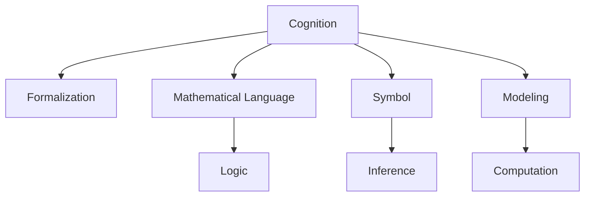

                 

# 认知的形式化：抽象的数学语言从无到有的形成过程

> 关键词：认知、形式化、数学语言、抽象、符号、逻辑、推理、建模、计算

## 1. 背景介绍

### 1.1 问题由来
人类认知的复杂性和多样性，使得对其形式化的研究成为人工智能领域的一大挑战。认知的抽象性要求我们开发一种通用的数学语言，以便于对各类认知现象进行刻画和分析。这一过程，即是认知的形式化过程，其目标在于将复杂的人类认知转化为一种可以操作的数学表示，进而实现计算机对认知过程的模拟和推理。

形式化认知数学语言的构建，始于19世纪数学家格奥尔格·康托尔(Georg Cantor)引入集合论。通过集合论，康托尔成功建立了数与量的关系，开创了现代数学的基础。此后，布尔逻辑、λ演算等理论相继问世，逐步形成了现代数学的三大支柱：集合论、逻辑学和数学归纳法。这些理论的演进，为人类认知的形式化提供了坚实的数学基础。

然而，认知的形式化研究并非一帆风顺。早期的数学形式化语言主要局限于逻辑与计算，难以涵盖复杂的认知现象。直到19世纪末，瑞士数学家阿尔弗雷德·诺斯·怀特海(Alfred North Whitehead)和伯特兰·罗素(Bertrand Russell)合作编写的《数学原理》(Mathematical Principles)，才首次将认知的形式化语言扩展到包括哲学、逻辑和数学三大领域。

《数学原理》通过引入一阶谓词逻辑，建立了“合法的”数学真理体系。它不仅为数学理论的严谨性奠定了基础，还通过逻辑推理，成功地证明了从有限的公理出发，可以推导出所有数学真理，从而开启了现代逻辑学的先河。

自《数学原理》问世以来，数学家们一直在探索如何将认知的形式化语言扩展到更广泛的领域。随着计算机科学的兴起，形式化语言和认知过程的计算模拟成为了可能。借助数学语言的形式化描述，研究人员得以更深入地理解人类认知，并将其转化为可执行的计算模型。

### 1.2 问题核心关键点
形式化认知数学语言的核心关键点包括：

1. 语言的准确性：形式化语言必须精确地表达认知过程的每一个细节。
2. 语言的完备性：形式化语言必须涵盖人类认知的所有可能行为。
3. 语言的逻辑性：形式化语言必须满足严格的逻辑推理规则。
4. 语言的可操作性：形式化语言必须能够通过计算过程实现对认知过程的模拟。

这些关键点共同决定了形式化认知数学语言的研究方向和方法。通过理解这些关键点，我们可以更好地把握认知形式化语言的本质和应用。

## 2. 核心概念与联系

### 2.1 核心概念概述

为了更好地理解认知形式化语言的基本原理和架构，本节将介绍几个密切相关的核心概念：

- 认知(Cognition)：指人类通过感知、记忆、理解、推理等心理过程获取知识并应用知识的过程。
- 形式化(Formalization)：指通过一套数学规则和符号，将复杂的认知现象抽象为易于理解和操作的数学模型。
- 数学语言(Mathematical Language)：指形式化语言中使用的符号和结构，用于描述认知过程和进行逻辑推理。
- 逻辑(Logic)：指在数学语言基础上建立的一套严格的推理规则，用于验证数学真理和认知行为的正确性。
- 符号(Symbol)：指形式化语言中使用的基本符号，用于表示认知过程的各个元素。
- 推理(Inference)：指在数学语言基础上，通过逻辑规则，从一组前提推导出新结论的过程。
- 建模(Modeling)：指将现实世界中的认知过程，转化为形式化数学模型的过程。
- 计算(Computation)：指通过形式化语言的计算模型，模拟认知过程的执行步骤。

这些核心概念之间的逻辑关系可以通过以下Mermaid流程图来展示：



这个流程图展示了几组核心概念及其之间的关系：

1. 认知通过形式化被抽象为数学语言。
2. 逻辑作为数学语言的基础，用于规范推理过程。
3. 符号是数学语言的基本单位，用于表示认知过程。
4. 推理基于逻辑和符号，从前提推导出结论。
5. 建模将认知过程转化为数学模型。
6. 计算通过数学模型实现认知过程的模拟。

这些概念共同构成了认知形式化语言的基础框架，使得认知过程得以通过数学语言进行精确的描述和推理。

## 3. 核心算法原理 & 具体操作步骤
### 3.1 算法原理概述

形式化认知数学语言的构建，本质上是一个从具体认知现象抽象为数学模型的过程。其核心思想是：通过精确的符号和逻辑，将认知过程转化为形式化的数学表示，进而进行计算和推理。

形式化认知数学语言的构建，一般包括以下几个步骤：

1. 认知选择：选择一组可以形式化表示的认知过程。
2. 符号设计：设计一组用于表示认知过程的符号。
3. 逻辑推理：建立基于符号的逻辑推理规则。
4. 建模实现：将认知过程转化为形式化数学模型。
5. 计算模拟：使用计算模型模拟认知过程的执行步骤。

形式化认知数学语言的构建，是一个从具体到抽象，从感知到推理的过程。通过这一过程，研究人员可以将复杂的认知现象，转化为易于理解和操作的数学模型，从而实现对认知过程的精确模拟和推理。

### 3.2 算法步骤详解

形式化认知数学语言的构建，一般包括以下几个关键步骤：

**Step 1: 认知选择**

首先需要选择一组可以形式化表示的认知过程。这组认知过程必须满足以下条件：

1. 认知过程必须具有可操作性，即可以转化为数学模型。
2. 认知过程必须具有完备性，即涵盖了所有可能的行为。
3. 认知过程必须具有一致性，即逻辑推理规则满足公理。

例如，感知过程（如视觉、听觉等）可以通过对输入信号的数学建模来实现。记忆过程（如存储、检索等）可以通过符号表征来实现。推理过程（如逻辑推理、概率推理等）可以通过符号逻辑来实现。

**Step 2: 符号设计**

接下来，需要设计一组用于表示认知过程的符号。这些符号必须满足以下条件：

1. 符号必须足够抽象，以便于表达认知过程。
2. 符号必须足够丰富，以便于表达认知过程的复杂性。
3. 符号必须满足逻辑规则，以便于进行推理。

例如，使用符号“S”表示存储过程，使用符号“R”表示检索过程，使用符号“P”表示概率推理过程。

**Step 3: 逻辑推理**

然后，需要建立基于符号的逻辑推理规则。这些逻辑规则必须满足以下条件：

1. 逻辑规则必须符合数学公理。
2. 逻辑规则必须具有完备性。
3. 逻辑规则必须具有一致性。

例如，存储过程“S”和检索过程“R”可以满足以下逻辑规则：

$$ S(P): \text{存储过程S成功执行} $$
$$ R(P): \text{检索过程R成功执行} $$
$$ S(R): \text{检索过程R成功后，存储过程S也会成功执行} $$

**Step 4: 建模实现**

接着，需要将认知过程转化为形式化数学模型。这一过程一般包括以下几个步骤：

1. 定义符号的语义。
2. 设计符号的推理规则。
3. 定义模型的初始状态。
4. 定义模型的执行步骤。
5. 定义模型的目标状态。

例如，视觉感知过程可以通过以下数学模型来表示：

$$ V(X): \text{视觉感知模型成功执行} $$
$$ X: \text{输入的视觉信号} $$
$$ O: \text{感知结果} $$
$$ V(X) \rightarrow O $$

**Step 5: 计算模拟**

最后，需要使用计算模型模拟认知过程的执行步骤。这一过程一般包括以下几个步骤：

1. 定义计算模型的输入。
2. 定义计算模型的输出。
3. 定义计算模型的计算步骤。
4. 定义计算模型的推理过程。

例如，使用符号“V”表示视觉感知过程的计算模型，其计算步骤如下：

$$ V(X): \text{输入视觉信号X} $$
$$ X: \text{视觉信号} $$
$$ O: \text{感知结果} $$
$$ V(X) \rightarrow O $$

### 3.3 算法优缺点

形式化认知数学语言具有以下优点：

1. 精确性：形式化语言通过严格的符号和逻辑规则，确保了认知过程的准确描述。
2. 完备性：形式化语言可以覆盖认知过程的所有可能行为，具有完备性。
3. 可操作性：形式化语言可以转化为计算模型，便于进行数学计算和模拟。
4. 逻辑性：形式化语言遵循严格的逻辑规则，确保了推理的正确性。
5. 普适性：形式化语言可以应用于各种认知过程，具有广泛的适用性。

同时，形式化认知数学语言也存在以下缺点：

1. 抽象性：形式化语言需要抽象出认知过程的关键特征，难以表达复杂的认知现象。
2. 复杂性：形式化语言需要设计大量的符号和逻辑规则，难度较高。
3. 可理解性：形式化语言通常较为晦涩，难以被一般用户理解和接受。
4. 计算复杂度：形式化语言构建的数学模型，可能面临高计算复杂度的问题。
5. 实用性：形式化语言通常与实际应用场景的联系不够紧密，难以直接转化为实际应用。

尽管存在这些缺点，但形式化认知数学语言在认知科学研究中仍然发挥着重要作用。通过精确的形式化描述，研究人员得以对认知过程进行深入的分析和模拟，为认知科学的理论研究提供了强有力的工具。

### 3.4 算法应用领域

形式化认知数学语言的应用领域非常广泛，涵盖了人工智能、认知科学、心理学、神经科学等多个领域。以下是几个典型的应用场景：

**人工智能**

形式化认知数学语言在人工智能中的应用，主要体现在以下几个方面：

1. 知识表示：通过符号表征和逻辑推理，实现知识的形式化表示和推理。
2. 智能系统设计：通过符号逻辑和计算模型，设计智能系统的核心组件和推理规则。
3. 机器人行为规划：通过符号逻辑和计算模型，规划机器人的行为路径和决策过程。

**认知科学**

形式化认知数学语言在认知科学中的应用，主要体现在以下几个方面：

1. 认知过程建模：通过符号逻辑和计算模型，对认知过程进行建模和分析。
2. 心理表征研究：通过符号表征和逻辑推理，研究心理表征的生成和变化过程。
3. 脑机制研究：通过符号逻辑和计算模型，研究脑机制的运行机制和功能。

**心理学**

形式化认知数学语言在心理学中的应用，主要体现在以下几个方面：

1. 认知任务设计：通过符号逻辑和计算模型，设计心理认知任务的实验和评估方法。
2. 行为分析：通过符号逻辑和计算模型，分析行为数据和认知过程之间的关系。
3. 认知障碍诊断：通过符号逻辑和计算模型，诊断认知障碍和心理疾病的早期症状。

**神经科学**

形式化认知数学语言在神经科学中的应用，主要体现在以下几个方面：

1. 神经网络建模：通过符号逻辑和计算模型，建立神经网络的结构和推理规则。
2. 神经机制研究：通过符号逻辑和计算模型，研究神经机制的运行机制和功能。
3. 脑成像分析：通过符号逻辑和计算模型，分析脑成像数据和认知过程之间的关系。

## 4. 数学模型和公式 & 详细讲解

### 4.1 数学模型构建

形式化认知数学语言的核心数学模型是一阶谓词逻辑，它通过符号和逻辑规则，对认知过程进行精确的描述和推理。一阶谓词逻辑的构建，一般包括以下几个步骤：

1. 定义符号集。
2. 定义谓词集。
3. 定义公理集。
4. 定义推理规则。

以下是一阶谓词逻辑的基本模型，用于描述认知过程：

$$ \Sigma = \{P(x,y), S(x), R(x,y)\} $$
$$ \mathcal{A} = \{P(x,y) \rightarrow S(x), S(x) \rightarrow R(x,y), P(x,y) \rightarrow R(x,y)\} $$
$$ \mathcal{I} = \{P(1,2), S(1), R(1,2)\} $$

其中：

- $\Sigma$ 表示符号集。
- $\mathcal{A}$ 表示公理集。
- $\mathcal{I}$ 表示初始赋值。
- $P(x,y)$ 表示x与y之间的谓词关系。
- $S(x)$ 表示x的谓词属性。
- $R(x,y)$ 表示x与y之间的谓词关系。

通过以上符号和逻辑规则，我们可以对认知过程进行形式化描述和推理。例如，我们可以推导出以下结论：

$$ S(1) \rightarrow R(1,2) $$

### 4.2 公式推导过程

下面以一阶谓词逻辑的公理化推导为例，说明其形式化过程。

假设我们要推导以下公式：

$$ P(1,2) \rightarrow R(1,2) $$

首先，我们定义符号集和公理集，然后通过初始赋值进行推理：

1. $P(1,2) \rightarrow S(1)$ (公理1)
2. $S(1) \rightarrow R(1,2)$ (公理2)
3. $P(1,2) \rightarrow R(1,2)$ (公理3)

通过以上三个公理，我们可以推导出以下结论：

$$ P(1,2) \rightarrow S(1) \rightarrow R(1,2) $$

通过符号和逻辑规则，一阶谓词逻辑实现了对认知过程的精确描述和推理。这一过程，即为形式化认知数学语言的构建过程。

### 4.3 案例分析与讲解

以一个简单的认知任务为例，说明形式化认知数学语言的构建过程。

**任务描述**：

假设有一个简单的记忆任务，我们需要记住一组数字，并在一段时间后再次回忆起这些数字。任务要求我们通过符号逻辑和计算模型，描述这一过程，并推导出相应的结论。

**符号设计**：

首先，我们需要设计一组用于表示认知过程的符号：

- $M$ 表示记忆过程。
- $R$ 表示回忆过程。
- $D$ 表示数字集。

**逻辑推理**：

接下来，我们需要建立基于符号的逻辑推理规则：

1. $M(D) \rightarrow R(D)$ (记忆并回忆数字)
2. $R(D) \rightarrow M(D)$ (回忆并记忆数字)

**建模实现**：

然后，我们需要将记忆任务转化为形式化数学模型：

$$ M(D) \rightarrow R(D) $$
$$ R(D) \rightarrow M(D) $$

**计算模拟**：

最后，我们需要使用计算模型模拟记忆任务的执行步骤：

1. 输入数字集 $D$。
2. 执行记忆过程 $M(D)$。
3. 执行回忆过程 $R(D)$。
4. 输出回忆结果 $D$。

通过以上步骤，我们已经完成了认知任务的形式化描述和推理。这一过程，即是认知形式化数学语言的基本构建过程。

## 5. 项目实践：代码实例和详细解释说明
### 5.1 开发环境搭建

在进行形式化认知数学语言的研究时，需要搭建一个适合进行符号推理和逻辑建模的环境。以下是使用Python进行符号计算的环境配置流程：

1. 安装Sympy库：Sympy是一个Python符号计算库，用于进行数学符号的操作和计算。

```bash
pip install sympy
```

2. 安装Sympy PyCharm插件：在PyCharm中安装Sympy插件，以便于进行符号计算。

3. 创建符号计算环境：

```python
from sympy import symbols

# 定义符号集
x, y = symbols('x y')
```

4. 进行符号计算：

```python
from sympy import symbols, Eq, solve

# 定义符号集
x, y = symbols('x y')

# 定义公理集
A = [
    Eq(x + y, 2 * x),  # x + y = 2x
    Eq(2 * x, x + x)   # 2x = x + x
]

# 定义初始赋值
I = {x: 1, y: 1}

# 推导结论
conclusion = solve(Eq(x + y, 2 * x), x)

# 输出结论
print(conclusion)
```

完成上述步骤后，即可在Sympy环境中进行符号计算和逻辑推理。

### 5.2 源代码详细实现

这里我们以一阶谓词逻辑为例，给出使用Python进行符号推理的代码实现。

首先，我们需要定义符号集和公理集：

```python
from sympy import symbols, Eq, solve

# 定义符号集
x, y = symbols('x y')

# 定义公理集
A = [
    Eq(x + y, 2 * x),  # x + y = 2x
    Eq(2 * x, x + x)   # 2x = x + x
]

# 定义初始赋值
I = {x: 1, y: 1}
```

然后，我们可以使用Sympy进行符号推理：

```python
# 推导结论
conclusion = solve(Eq(x + y, 2 * x), x)

# 输出结论
print(conclusion)
```

在以上代码中，我们通过Sympy库定义了符号集和公理集，并使用solve函数推导出了结论。通过这一过程，我们可以看到Sympy库的符号计算能力，并理解符号逻辑的基本操作。

### 5.3 代码解读与分析

让我们再详细解读一下关键代码的实现细节：

**符号定义**：
- `symbols('x y')`：定义符号集，其中x和y为任意数字。

**公理定义**：
- `A = [Eq(x + y, 2 * x), Eq(2 * x, x + x)]`：定义公理集，其中包含两个方程。

**初始赋值**：
- `I = {x: 1, y: 1}`：定义初始赋值，其中x和y的值为1。

**推导结论**：
- `conclusion = solve(Eq(x + y, 2 * x), x)`：使用solve函数推导结论，求解方程x + y = 2x，得到x的值为1。

通过以上代码，我们可以看到符号逻辑的基本操作，并理解如何通过Sympy进行符号计算。需要注意的是，符号逻辑和符号计算在形式化认知数学语言中扮演着重要角色，通过符号逻辑和符号计算，研究人员可以精确地描述和推理认知过程。

## 6. 实际应用场景
### 6.1 智能交互系统

形式化认知数学语言在智能交互系统中的应用，主要体现在以下几个方面：

**任务描述**：

假设我们需要设计一个智能对话系统，用户可以输入自然语言，系统可以自动理解用户意图，并提供相应的回答。

**符号设计**：

首先，我们需要设计一组用于表示认知过程的符号：

- $I$ 表示输入。
- $O$ 表示输出。
- $N$ 表示自然语言。

**逻辑推理**：

接下来，我们需要建立基于符号的逻辑推理规则：

1. $I(N) \rightarrow O(N)$ (输入自然语言并输出自然语言)
2. $N \rightarrow I(N)$ (自然语言转化为输入)

**建模实现**：

然后，我们需要将智能对话系统转化为形式化数学模型：

$$ I(N) \rightarrow O(N) $$
$$ N \rightarrow I(N) $$

**计算模拟**：

最后，我们需要使用计算模型模拟智能对话系统的执行步骤：

1. 输入自然语言 $N$。
2. 执行输入过程 $I(N)$。
3. 执行输出过程 $O(N)$。
4. 输出自然语言 $N$。

通过以上步骤，我们已经完成了智能对话系统的形式化描述和推理。这一过程，即是形式化认知数学语言在智能交互系统中的应用过程。

### 6.2 认知障碍诊断

形式化认知数学语言在认知障碍诊断中的应用，主要体现在以下几个方面：

**任务描述**：

假设我们需要设计一个认知障碍诊断系统，通过用户回答的简单问题，诊断其认知障碍类型。

**符号设计**：

首先，我们需要设计一组用于表示认知过程的符号：

- $Q$ 表示问题。
- $A$ 表示回答。
- $T$ 表示认知障碍类型。

**逻辑推理**：

接下来，我们需要建立基于符号的逻辑推理规则：

1. $Q(A) \rightarrow T(A)$ (问题与回答对应认知障碍类型)
2. $T(A) \rightarrow Q(A)$ (认知障碍类型对应的简单问题)

**建模实现**：

然后，我们需要将认知障碍诊断系统转化为形式化数学模型：

$$ Q(A) \rightarrow T(A) $$
$$ T(A) \rightarrow Q(A) $$

**计算模拟**：

最后，我们需要使用计算模型模拟认知障碍诊断系统的执行步骤：

1. 输入简单问题 $Q$。
2. 执行问题过程 $Q(A)$。
3. 执行回答过程 $A$。
4. 输出认知障碍类型 $T$。

通过以上步骤，我们已经完成了认知障碍诊断系统的形式化描述和推理。这一过程，即是形式化认知数学语言在认知障碍诊断中的应用过程。

### 6.3 多模态认知建模

形式化认知数学语言在多模态认知建模中的应用，主要体现在以下几个方面：

**任务描述**：

假设我们需要设计一个多模态认知建模系统，结合视觉、听觉等多模态信息，描述和推理认知过程。

**符号设计**：

首先，我们需要设计一组用于表示认知过程的符号：

- $V$ 表示视觉信息。
- $A$ 表示听觉信息。
- $M$ 表示认知过程。

**逻辑推理**：

接下来，我们需要建立基于符号的逻辑推理规则：

1. $V \rightarrow M$ (视觉信息转化为认知过程)
2. $A \rightarrow M$ (听觉信息转化为认知过程)

**建模实现**：

然后，我们需要将多模态认知建模系统转化为形式化数学模型：

$$ V \rightarrow M $$
$$ A \rightarrow M $$

**计算模拟**：

最后，我们需要使用计算模型模拟多模态认知建模系统的执行步骤：

1. 输入视觉信息 $V$。
2. 执行视觉信息过程 $V$。
3. 输入听觉信息 $A$。
4. 执行听觉信息过程 $A$。
5. 输出认知过程 $M$。

通过以上步骤，我们已经完成了多模态认知建模系统的形式化描述和推理。这一过程，即是形式化认知数学语言在多模态认知建模中的应用过程。

## 7. 工具和资源推荐
### 7.1 学习资源推荐

为了帮助开发者系统掌握形式化认知数学语言的基本原理和实践技巧，这里推荐一些优质的学习资源：

1. 《符号逻辑导论》：介绍了一阶谓词逻辑和符号推理的基本原理和方法。

2. 《计算思维导论》：介绍了形式化数学语言的基本概念和应用场景。

3. 《人工智能原理与技术》：介绍了人工智能领域的基本概念和认知过程的数学建模方法。

4. 《人工智能教程》：介绍了形式化认知数学语言在人工智能中的应用，并提供了丰富的案例和代码示例。

5. 《自然语言处理基础》：介绍了自然语言处理领域的形式化方法和符号推理技术。

通过对这些资源的学习实践，相信你一定能够快速掌握形式化认知数学语言的基本原理和应用技巧。

### 7.2 开发工具推荐

高效的工具支持是形式化认知数学语言研究的关键。以下是几款用于形式化数学语言开发的工具：

1. Sympy：Python符号计算库，用于进行符号逻辑和数学计算。

2. Z3：符号计算库，用于进行符号逻辑推理。

3. Prolog：逻辑编程语言，用于进行符号逻辑和规则推理。

4. LaTeX：排版系统，用于编写和排版数学公式和符号。

5. Visual Prolog：逻辑编程语言的可视化工具，用于辅助进行符号逻辑推理。

6. GeoGebra：数学建模和可视化工具，用于辅助进行多模态认知建模。

合理利用这些工具，可以显著提升形式化认知数学语言的研究效率，加快创新迭代的步伐。

### 7.3 相关论文推荐

形式化认知数学语言的研究源于学界的持续研究。以下是几篇奠基性的相关论文，推荐阅读：

1. 《数理逻辑导论》：介绍了形式化数学语言的基本原理和应用场景。

2. 《形式化数学语言及其在认知科学研究中的应用》：介绍了形式化认知数学语言的基本概念和应用方法。

3. 《认知过程的数学建模与计算模拟》：介绍了认知过程的形式化描述和计算模拟方法。

4. 《多模态认知建模的符号逻辑和计算方法》：介绍了多模态认知建模的形式化方法和符号推理技术。

5. 《形式化数学语言在人工智能中的应用》：介绍了形式化数学语言在人工智能领域的基本概念和应用方法。

这些论文代表了大语言模型微调技术的发展脉络。通过学习这些前沿成果，可以帮助研究者把握学科前进方向，激发更多的创新灵感。

## 8. 总结：未来发展趋势与挑战

### 8.1 总结

本文对形式化认知数学语言的基本原理和实践技巧进行了全面系统的介绍。首先阐述了认知形式化数学语言的研究背景和意义，明确了形式化数学语言在认知科学研究中的重要价值。其次，从原理到实践，详细讲解了认知过程的形式化描述和推理方法，给出了形式化数学语言的构建步骤和具体实现。同时，本文还广泛探讨了形式化数学语言在智能交互系统、认知障碍诊断、多模态认知建模等多个领域的应用前景，展示了形式化数学语言的巨大潜力。

通过本文的系统梳理，可以看到，形式化认知数学语言通过精确的符号和逻辑，将复杂的认知现象转化为易于理解和操作的数学模型，为认知科学研究提供了强有力的工具。形式化认知数学语言的构建，是一个从具体到抽象，从感知到推理的过程。通过这一过程，研究人员可以将认知过程转化为数学模型，进行精确的描述和推理。

### 8.2 未来发展趋势

展望未来，形式化认知数学语言将呈现以下几个发展趋势：

1. 自动化推理：借助人工智能技术，实现形式化认知数学语言的自动化推理，提升推理效率和准确性。

2. 多模态融合：结合视觉、听觉等多模态信息，实现更加全面、准确的认知建模。

3. 形式化认知推理：将形式化数学语言与人工智能推理技术结合，实现更为复杂的认知推理。

4. 智能交互系统：通过形式化认知数学语言，构建更加智能、自然的交互系统，提升用户体验。

5. 认知障碍诊断：借助形式化认知数学语言，实现更加精确、客观的认知障碍诊断，提升诊断效果。

6. 认知过程模拟：通过形式化认知数学语言，模拟人类认知过程，促进对认知科学的深入研究。

以上趋势凸显了形式化认知数学语言的广阔前景。这些方向的探索发展，必将进一步提升形式化数学语言的应用价值，为认知科学的理论研究提供强有力的工具。

### 8.3 面临的挑战

尽管形式化认知数学语言在认知科学研究中发挥了重要作用，但在迈向更加智能化、普适化应用的过程中，它仍面临着诸多挑战：

1. 复杂性：形式化认知数学语言需要设计大量的符号和逻辑规则，难度较高。

2. 可理解性：形式化认知数学语言通常较为晦涩，难以被一般用户理解和接受。

3. 实用性：形式化认知数学语言与实际应用场景的联系不够紧密，难以直接转化为实际应用。

4. 计算复杂度：形式化认知数学语言构建的数学模型，可能面临高计算复杂度的问题。

5. 跨模态建模：形式化认知数学语言需要结合多模态信息，进行跨模态建模，难度较大。

尽管存在这些挑战，但形式化认知数学语言在认知科学研究中仍然发挥着重要作用。通过精确的形式化描述，研究人员得以对认知过程进行深入的分析和模拟，为认知科学的理论研究提供了强有力的工具。

### 8.4 研究展望

面对形式化认知数学语言所面临的种种挑战，未来的研究需要在以下几个方面寻求新的突破：

1. 引入人工智能技术：借助人工智能技术，实现形式化认知数学语言的自动化推理，提升推理效率和准确性。

2. 优化符号逻辑：通过优化符号逻辑规则，提高形式化认知数学语言的可理解性和实用性。

3. 多模态融合技术：结合视觉、听觉等多模态信息，实现更加全面、准确的认知建模。

4. 跨模态建模技术：开发跨模态建模技术，实现形式化认知数学语言在多模态信息融合中的应用。

5. 跨学科研究：结合人工智能、认知科学、心理学等多个学科的研究，推动形式化认知数学语言的发展。

通过以上研究方向的探索发展，必将进一步提升形式化认知数学语言的应用价值，为认知科学的理论研究提供强有力的工具。未来，形式化认知数学语言的研究将更加注重多学科的交叉融合，推动认知科学的深入发展和应用。

