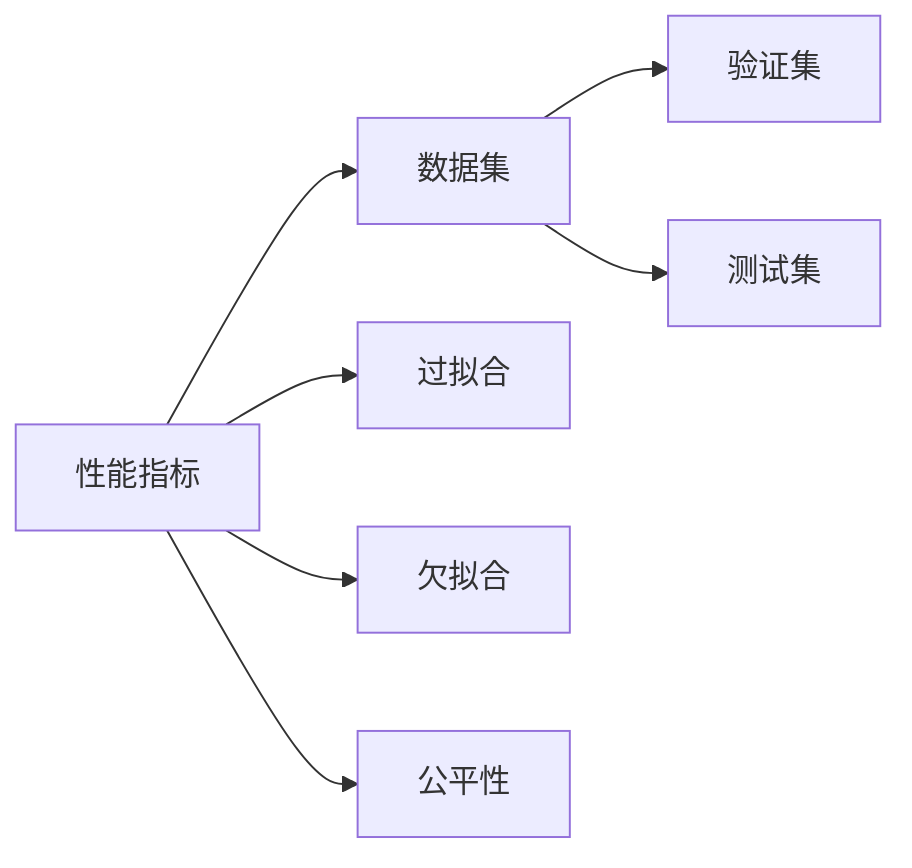

                 

## 1. 背景介绍

在人工智能(AI)时代，评估AI系统性能是一个关键的问题。准确的性能评估不仅可以帮助开发者和研究人员理解模型的能力，还可以指导模型的改进方向，提高AI系统的实用性和可靠性。然而，评估AI系统的性能并非易事。不同的任务、不同的模型以及不同的应用场景都有其特定的评估标准。本文旨在探讨评估AI系统性能的最佳实践，从理论和实践两个层面，深入分析如何选择合适的评估方法，如何避免常见的评估陷阱，以及如何在实际应用中应用这些评估方法。

## 2. 核心概念与联系

### 2.1 核心概念概述

在评估AI系统性能时，以下概念至关重要：

- **性能指标(Performance Metrics)**：用来衡量模型在特定任务上的表现的标准。如准确率、召回率、F1分数等。
- **数据集(Data Sets)**：用于评估模型性能的数据集合。应确保数据集具有代表性，能够涵盖所有可能的场景。
- **验证集(Validation Set)**：在模型训练过程中，用于评估模型性能的独立数据集。通常用于模型选择和超参数调优。
- **测试集(Test Set)**：用于评估模型在未见过的数据上的泛化能力，最终选择的评估指标应基于该集。
- **过拟合(Overfitting)**：模型在训练集上表现良好，但在测试集上性能下降的现象。需要通过正则化等方法缓解。
- **欠拟合(Underfitting)**：模型无法捕捉数据中的复杂关系，表现欠佳。需要增加模型复杂度或训练时间。
- **公平性(Fairness)**：模型对不同群体是否平等对待。特别是在涉及偏见和歧视的问题上，公平性至关重要。

这些概念之间存在着密切的联系。性能指标是评估模型的依据，数据集是评估的基础，而验证集和测试集则是确保模型泛化能力的关键。过拟合和欠拟合则是在模型训练过程中需要避免的问题。公平性则是在应用AI系统时需要考虑的重要原则。

### 2.2 核心概念原理和架构的 Mermaid 流程图



## 3. 核心算法原理 & 具体操作步骤

### 3.1 算法原理概述

评估AI系统性能的基本原理是，通过将模型在特定任务上的表现与预定义的性能指标进行对比，从而评估模型的能力。常用的性能指标包括但不限于：

- **准确率(Accuracy)**：模型正确预测的样本数占总样本数的比例。
- **召回率(Recall)**：真实正例被正确预测的正例数占所有正例的比例。
- **精确率(Precision)**：正确预测的正例数占被预测为正例的样本数的比例。
- **F1分数(F1 Score)**：精确率和召回率的调和平均值，常用于不平衡数据集的评估。

对于每个性能指标，都有其特定的计算方法。例如，准确率的计算公式为：

$$
\text{Accuracy} = \frac{\text{True Positives} + \text{True Negatives}}{\text{True Positives} + \text{False Positives} + \text{False Negatives} + \text{True Negatives}}
$$

### 3.2 算法步骤详解

评估AI系统性能的具体步骤如下：

1. **数据准备**：收集和预处理数据集。确保数据集的多样性和代表性，涵盖不同的数据类型和场景。
2. **模型训练**：使用训练集对模型进行训练，调整超参数，选择最佳模型。
3. **验证集评估**：在验证集上评估模型性能，选择最优模型。
4. **测试集评估**：在测试集上评估模型泛化能力，选择最终模型。
5. **性能报告**：生成包含各项性能指标的报告，包括准确率、召回率、F1分数等。

### 3.3 算法优缺点

#### 优点

- **准确性高**：使用多种性能指标，可以全面评估模型表现。
- **可解释性强**：每个指标都有明确的计算公式，易于理解和解释。
- **泛化性强**：通过验证集和测试集的对比，可以评估模型的泛化能力。

#### 缺点

- **计算复杂**：需要处理大量数据和模型，计算成本较高。
- **容易过拟合**：如果过度关注某一指标，可能忽略其他重要指标。
- **难以解释**：复杂的模型和数据集可能导致难以解释的性能评估结果。

### 3.4 算法应用领域

评估AI系统性能的方法广泛应用于各个领域，如自然语言处理(NLP)、计算机视觉(CV)、语音识别、推荐系统等。例如，在NLP中，可以使用BLEU、ROUGE、ROUGE-L等指标评估机器翻译和文本摘要的质量；在CV中，可以使用均方误差(MSE)、交叉熵(Cross-Entropy)等指标评估图像分类和物体检测的性能。

## 4. 数学模型和公式 & 详细讲解 & 举例说明

### 4.1 数学模型构建

评估AI系统性能的数学模型通常包括以下几个部分：

- **输入数据**：模型的训练数据集，用于评估模型的预测能力。
- **模型预测**：模型的预测结果，与实际标签进行对比。
- **损失函数(Loss Function)**：用于衡量模型预测与实际标签之间的差异，常用的有均方误差(MSE)、交叉熵(Cross-Entropy)等。
- **性能指标**：如准确率、召回率、F1分数等，用于量化模型性能。

### 4.2 公式推导过程

以准确率为例，其计算公式为：

$$
\text{Accuracy} = \frac{\text{TP} + \text{TN}}{\text{TP} + \text{FP} + \text{TN} + \text{FN}}
$$

其中，TP表示真正例，FP表示假正例，FN表示假反例，TN表示真反例。

### 4.3 案例分析与讲解

以二分类问题为例，假设模型在训练集上的准确率为0.85，验证集上的准确率为0.82，测试集上的准确率为0.81。这个结果表明，模型在训练集上表现最好，验证集次之，测试集最差。这可能是因为模型在训练集上过拟合了，而测试集上的泛化能力不足。

## 5. 项目实践：代码实例和详细解释说明

### 5.1 开发环境搭建

评估AI系统性能通常需要使用Python和相关库，如Scikit-learn、TensorFlow等。以下是一个简单的Python环境搭建步骤：

1. 安装Python：从官网下载并安装Python 3.x版本。
2. 安装Anaconda：从官网下载并安装Anaconda，用于创建独立的Python环境。
3. 创建虚拟环境：使用Anaconda创建虚拟环境，以避免与其他项目冲突。
4. 安装相关库：使用pip安装Scikit-learn、TensorFlow等库。

### 5.2 源代码详细实现

以下是一个使用Scikit-learn评估二分类模型性能的Python代码：

```python
from sklearn.metrics import accuracy_score
from sklearn.model_selection import train_test_split
from sklearn.linear_model import LogisticRegression

# 假设有一个数据集X和标签y
X, y = load_data()

# 将数据集划分为训练集和测试集
X_train, X_test, y_train, y_test = train_test_split(X, y, test_size=0.2)

# 定义模型
model = LogisticRegression()

# 训练模型
model.fit(X_train, y_train)

# 在测试集上评估模型
y_pred = model.predict(X_test)
accuracy = accuracy_score(y_test, y_pred)
print("Accuracy:", accuracy)
```

### 5.3 代码解读与分析

代码中，我们首先使用Scikit-learn的`train_test_split`函数将数据集划分为训练集和测试集。然后，定义一个逻辑回归模型，使用训练集数据拟合模型，并在测试集上进行预测。最后，使用`accuracy_score`函数计算模型的准确率。

### 5.4 运行结果展示

运行上述代码，输出的准确率结果可能为0.81或类似值，表示模型在测试集上的性能。

## 6. 实际应用场景

### 6.1 智能客服系统

在智能客服系统中，评估AI系统性能的主要指标包括响应速度、回答准确率、用户满意度等。可以使用在线问卷调查、用户反馈等方式获取这些指标。

### 6.2 金融舆情监测

在金融舆情监测中，评估AI系统性能的指标包括舆情监测速度、准确性、覆盖率等。可以使用实时数据分析工具和报告系统进行评估。

### 6.3 个性化推荐系统

在个性化推荐系统中，评估AI系统性能的指标包括点击率、转化率、用户满意度等。可以使用A/B测试和用户行为数据分析工具进行评估。

### 6.4 未来应用展望

未来，随着AI技术的不断进步，评估AI系统性能的方法也将更加多样化和智能化。例如，可以使用强化学习评估AI系统的动态性能，通过模拟器和真实环境的数据对比，评估AI系统的鲁棒性和适应性。

## 7. 工具和资源推荐

### 7.1 学习资源推荐

1. **《机器学习实战》**：由Peter Harrington编写的经典机器学习入门书籍，包含大量实战案例和代码示例。
2. **Coursera《机器学习》课程**：由Andrew Ng主讲的著名机器学习课程，涵盖广泛的主题和算法。
3. **Kaggle**：一个数据科学竞赛平台，提供了大量数据集和模型评估工具，是学习实践的好地方。

### 7.2 开发工具推荐

1. **Jupyter Notebook**：一个交互式编程环境，适合进行数据分析和机器学习实验。
2. **TensorBoard**：一个可视化工具，可以实时展示模型训练和评估结果，帮助调试和优化模型。
3. **PyTorch Lightning**：一个用于构建快速原型和高质量AI模型的框架，支持分布式训练和自动调优。

### 7.3 相关论文推荐

1. **《Evaluating Machine Learning Models》**：由Brian MacKay编写的经典机器学习评估书籍，详细介绍了各种评估方法和技巧。
2. **《Deep Learning》**：由Ian Goodfellow、Yoshua Bengio和Aaron Courville合著的经典深度学习教材，包含大量评估模型性能的案例和实例。

## 8. 总结：未来发展趋势与挑战

### 8.1 研究成果总结

本文系统介绍了评估AI系统性能的最佳实践，包括选择合适的评估方法、避免常见的评估陷阱、在实际应用中应用这些评估方法。通过深入分析和实践指导，帮助开发者和研究人员理解如何评估AI系统的性能，从而提高系统的实用性和可靠性。

### 8.2 未来发展趋势

未来，评估AI系统性能的方法将更加多样化和智能化，例如：

1. **多模态评估**：结合文本、图像、语音等多种数据类型，评估AI系统的综合能力。
2. **动态评估**：通过强化学习、模拟器等方法，实时评估AI系统的性能。
3. **可解释性评估**：通过可视化、调试工具等，提高AI系统的可解释性，帮助用户理解系统的决策过程。

### 8.3 面临的挑战

尽管评估AI系统性能的方法不断进步，但仍面临一些挑战：

1. **数据多样性**：不同领域和场景的数据具有差异性，如何确保评估方法的有效性是一个挑战。
2. **模型复杂性**：复杂的模型和算法可能难以解释和评估。
3. **公平性和公正性**：在评估过程中，如何确保公平性和公正性，避免算法偏见和歧视，是一个重要的问题。

### 8.4 研究展望

未来的研究可以从以下几个方向寻求新的突破：

1. **自动化评估**：开发自动化评估工具，提高评估效率和准确性。
2. **可解释性评估**：结合符号化逻辑和机器学习，提高系统的可解释性。
3. **公平性评估**：引入公平性指标，评估AI系统的偏见和歧视，确保系统的公正性。

总之，评估AI系统性能是一个复杂而重要的任务，需要从理论、实践和工程等多个层面进行全面研究。只有不断突破技术瓶颈，才能更好地推动AI技术的普及和应用。

## 9. 附录：常见问题与解答

**Q1：如何选择合适的性能指标？**

A: 选择合适的性能指标应考虑任务类型和应用场景。例如，对于分类任务，准确率、召回率和F1分数都是常用的指标。对于回归任务，均方误差(MSE)、平均绝对误差(MAE)等指标更合适。

**Q2：如何在多类别任务中进行评估？**

A: 多类别任务可以使用混淆矩阵、精确率-召回率曲线、ROC曲线等指标进行评估。其中，精确率-召回率曲线和ROC曲线是常用的评估方法，能够全面反映模型的性能。

**Q3：如何处理数据不平衡问题？**

A: 数据不平衡问题可以使用重采样、类别加权、阈值调整等方法处理。例如，在二分类任务中，可以通过过采样或欠采样来平衡数据集。

**Q4：如何进行模型选择？**

A: 模型选择可以通过交叉验证、网格搜索等方法进行。例如，在Scikit-learn中，可以使用`GridSearchCV`函数进行模型选择和超参数调优。

**Q5：如何进行模型调优？**

A: 模型调优可以通过调整超参数、改进模型结构等方式进行。例如，在神经网络中，可以通过改变隐藏层数量、激活函数、学习率等超参数来优化模型性能。

---

作者：禅与计算机程序设计艺术 / Zen and the Art of Computer Programming

