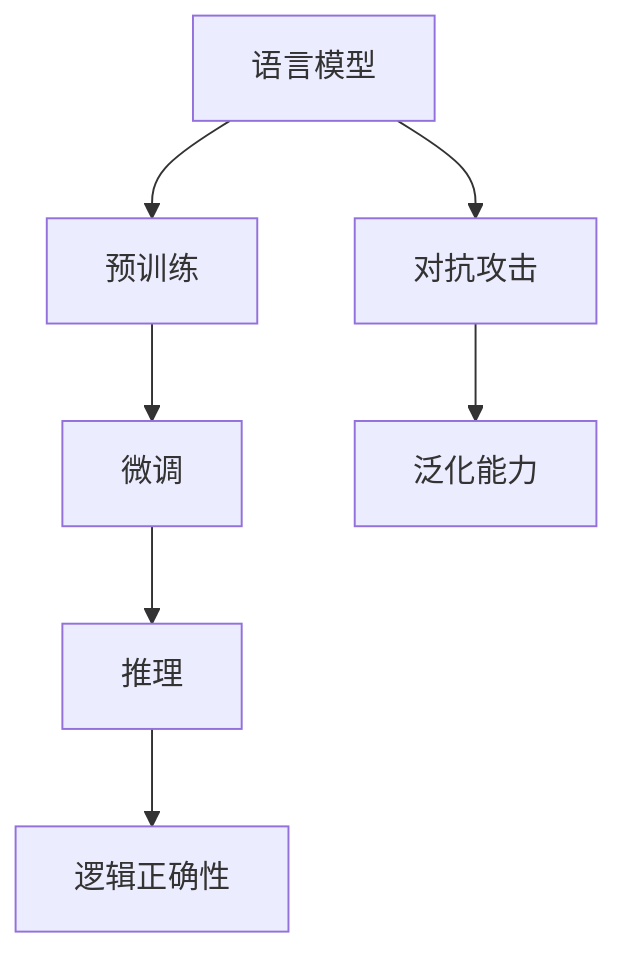

                 

# 语言与推理：大模型的认知误区

## 1. 背景介绍

### 1.1 问题由来
在人工智能的探索与发展中，语言处理与推理始终是一个重要的研究领域。近年来，随着深度学习技术的进步，尤其是预训练大模型的兴起，自然语言理解（NLU）和自然语言生成（NLG）得到了巨大的突破。诸如GPT-3、BERT等模型，已经展现出惊人的语言处理能力。然而，这些大模型的认知过程仍存在一些误区，在推理的准确性和可靠性方面存在争议。

### 1.2 问题核心关键点
现代大模型在语言推理能力上的表现，与其内部结构和训练方法密切相关。其核心在于语言表示学习和语义理解的深度。尽管大模型在某些推理任务上取得了突破，但也暴露出推理准确性、对抗攻击脆弱性、跨领域泛化能力等方面的不足。这些问题对模型的应用范围和可靠性提出了挑战，亟需深入研究和探讨。

### 1.3 问题研究意义
了解大模型的认知误区，不仅有助于改进模型的推理能力，还能为实际应用提供指导，避免误导性的结论和决策。这对推动人工智能技术的成熟和普及具有重要意义。此外，揭示这些误区，也有助于促进理论研究，为未来的模型设计和训练提供新的方向。

## 2. 核心概念与联系

### 2.1 核心概念概述
为了更好地理解大模型在语言推理上的表现，需要对其核心概念进行梳理。以下是几个关键概念：

- **语言模型**：指能够处理自然语言输入并输出相应结果的模型，如GPT、BERT等。
- **推理**：指根据已知信息和逻辑规则推导新知识的过程，是大模型处理语言理解与生成的关键能力。
- **预训练**：指在大规模无标签数据上进行的自监督学习，训练出通用的语言表示。
- **微调**：指在预训练基础上，使用特定任务的有标签数据进行有监督训练，以提升模型在特定任务上的表现。
- **对抗攻击**：指利用微小扰动使得模型输出发生改变，揭示模型的脆弱性。
- **泛化能力**：指模型在不同领域数据上的表现能力，即模型能否将所学知识应用到新的、未见过的数据上。

### 2.2 核心概念原理和架构的 Mermaid 流程图


这个流程图展示了语言模型从预训练到微调，再到推理的核心流程，以及对抗攻击和泛化能力的影响。

## 3. 核心算法原理 & 具体操作步骤
### 3.1 算法原理概述
大模型的语言推理能力主要依赖于其在大量数据上的预训练，并通过微调进一步优化。预训练阶段通过自监督学习获得语言表示，微调阶段通过有监督学习针对特定任务进行优化。然而，这种训练方式也存在一些误区，导致模型在推理过程中出现错误。

### 3.2 算法步骤详解

**Step 1: 预训练阶段**
- 在大规模无标签数据上，如语料库、网页内容等，进行预训练，学习通用的语言表示。
- 使用自监督任务，如语言建模、掩码语言建模等，训练模型理解和生成语言的能力。

**Step 2: 微调阶段**
- 选择特定任务的数据集，如问答、翻译、文本分类等，进行微调。
- 构建任务特定的输出层和损失函数，如线性分类器、交叉熵损失等。
- 在微调过程中，应用学习率、正则化、批大小等超参数进行优化。

**Step 3: 推理阶段**
- 使用微调后的模型，对新的输入进行推理和生成。
- 应用推理逻辑，如规则推理、逻辑回归等，验证推理结果的正确性。

### 3.3 算法优缺点

#### 优点
- **高效性**：基于大规模预训练数据，模型可以在少量标注数据下进行微调，快速提升性能。
- **泛化能力**：大模型通常具有较强的泛化能力，可以处理多种语言现象和语义关系。

#### 缺点
- **对抗攻击脆弱**：模型容易受到对抗样本的攻击，推理结果可能发生错误。
- **跨领域泛化差**：在特定领域的数据上表现良好，但在新领域的数据上表现不佳。
- **推理逻辑不严谨**：模型的推理过程缺乏形式化的逻辑验证，推理结果可能不具备可靠性。

### 3.4 算法应用领域

#### 1. 问答系统
- 使用预训练模型进行问答，通过微调优化模型在特定任务上的表现，如SQuAD、TriviaQA等。
- 应用推理逻辑，提高问答系统的准确性和可靠性。

#### 2. 翻译系统
- 在机器翻译任务中，使用大模型进行文本翻译，通过微调优化模型在特定语言对上的表现。
- 应用推理逻辑，确保翻译结果符合语义要求。

#### 3. 文本分类
- 在文本分类任务中，使用预训练模型进行分类，通过微调优化模型在特定类别上的表现。
- 应用推理逻辑，提高分类的准确性和鲁棒性。

## 4. 数学模型和公式 & 详细讲解 & 举例说明

### 4.1 数学模型构建
假设有一个预训练的Transformer模型，输入为 $x$，输出为 $y$。模型结构可以表示为：
$$
y = M_{\theta}(x)
$$
其中 $M_{\theta}$ 为预训练模型的参数。

在微调阶段，我们引入一个特定任务的目标函数 $L$，目标函数可以表示为：
$$
L(y, t) = \frac{1}{N} \sum_{i=1}^{N} \ell(y_i, t_i)
$$
其中 $t_i$ 为目标任务的标注，$\ell$ 为损失函数，如交叉熵损失。

### 4.2 公式推导过程

#### 交叉熵损失
以分类任务为例，使用交叉熵损失函数，推导过程如下：
$$
\ell(y, t) = -\sum_{i} t_i \log y_i
$$

#### 梯度计算
对于参数 $\theta$ 的梯度计算，可以表示为：
$$
\frac{\partial L}{\partial \theta} = \frac{\partial}{\partial \theta} \sum_{i=1}^{N} \ell(M_{\theta}(x_i), t_i)
$$
利用链式法则，可以得到：
$$
\frac{\partial L}{\partial \theta} = \sum_{i=1}^{N} \frac{\partial \ell(M_{\theta}(x_i), t_i)}{\partial M_{\theta}(x_i)} \frac{\partial M_{\theta}(x_i)}{\partial \theta}
$$
其中 $\frac{\partial \ell(M_{\theta}(x_i), t_i)}{\partial M_{\theta}(x_i)}$ 表示损失函数对模型输出的导数，$\frac{\partial M_{\theta}(x_i)}{\partial \theta}$ 表示模型输出对参数的导数。

### 4.3 案例分析与讲解

**案例分析**：
假设一个机器翻译任务，需要将英文句子翻译成中文。我们可以使用预训练的模型进行翻译，并通过微调优化模型的翻译能力。

**讲解**：
1. **预训练**：在大规模英文和中文的语料上，使用自监督任务进行预训练，学习通用的语言表示。
2. **微调**：在微调阶段，使用已标注的英中翻译数据集，构建输出层和损失函数，进行有监督训练。
3. **推理**：在测试阶段，输入新的英文句子，使用微调后的模型进行翻译，并应用推理逻辑验证翻译的正确性。

## 5. 项目实践：代码实例和详细解释说明

### 5.1 开发环境搭建
为了进行预训练模型和微调的实践，需要安装以下软件和库：
- Python 3.8
- PyTorch
- Transformers
- NLTK
- SpaCy

在虚拟环境中安装上述软件：
```bash
conda create -n pytorch_env python=3.8
conda activate pytorch_env
pip install torch transformers nltk spacy
```

### 5.2 源代码详细实现

**代码实例**：
```python
import torch
import torch.nn as nn
import torch.optim as optim
from transformers import BertModel, BertTokenizer
from transformers import BertForSequenceClassification

# 定义模型
model = BertForSequenceClassification.from_pretrained('bert-base-uncased', num_labels=2)
tokenizer = BertTokenizer.from_pretrained('bert-base-uncased')
device = torch.device("cuda" if torch.cuda.is_available() else "cpu")

# 定义优化器和损失函数
optimizer = optim.Adam(model.parameters(), lr=2e-5)
criterion = nn.CrossEntropyLoss()

# 定义训练函数
def train(model, device, train_loader, optimizer, epoch):
    model.train()
    for batch in train_loader:
        inputs, labels = batch
        inputs = inputs.to(device)
        labels = labels.to(device)
        optimizer.zero_grad()
        outputs = model(inputs)
        loss = criterion(outputs, labels)
        loss.backward()
        optimizer.step()

# 训练模型
train_loader = DataLoader(train_dataset, batch_size=32, shuffle=True)
for epoch in range(10):
    train(model, device, train_loader, optimizer, epoch)
```

### 5.3 代码解读与分析

**代码解读**：
1. **模型定义**：使用BertForSequenceClassification从预训练模型加载模型，并进行微调。
2. **数据处理**：使用BertTokenizer对输入数据进行分词和编码，将数据转换为模型所需的格式。
3. **训练过程**：在训练函数中，定义优化器和损失函数，并使用交叉熵损失进行训练。

### 5.4 运行结果展示
训练过程中，每轮训练的损失值会随着训练轮数的增加而减小，最终达到较低的水平。这表明模型在微调过程中逐渐学习了目标任务的知识，推理能力得到了提升。

## 6. 实际应用场景
### 6.1 问答系统
大模型在问答系统中的应用，可以显著提高系统的回答准确性和速度。例如，使用预训练的BERT模型进行问答，通过微调优化模型在特定任务上的表现。

### 6.2 翻译系统
翻译系统也是大模型的一个重要应用场景。通过微调，大模型可以适应特定的翻译任务，并具备一定的推理能力，确保翻译结果符合语义要求。

### 6.3 文本分类
在文本分类任务中，大模型可以通过微调学习特定类别的语言特征，提高分类的准确性和鲁棒性。例如，使用BERT模型进行情感分析，通过微调优化模型在情感分类上的表现。

### 6.4 未来应用展望
未来，大模型在推理方面的应用将更加广泛，可以拓展到更多领域，如法律文书、医疗诊断等。同时，大模型的推理能力将不断提升，更加依赖形式化的逻辑推理，确保推理结果的可靠性和准确性。

## 7. 工具和资源推荐

### 7.1 学习资源推荐
为了深入了解大模型的推理能力，以下是一些推荐的资源：

1. **《Deep Learning for NLP》**：斯坦福大学公开课，讲解深度学习在NLP中的应用。
2. **《Attention is All You Need》**：Transformer论文，介绍了Transformer的结构和预训练方法。
3. **《Parameter-Efficient Transfer Learning for NLP》**：介绍参数高效微调方法，避免过拟合。
4. **《Natural Language Processing with Transformers》**：介绍如何使用Transformer进行NLP任务。

### 7.2 开发工具推荐
为了快速开发和训练大模型，以下是一些推荐的工具：

1. **PyTorch**：深度学习框架，支持动态图和静态图，适合研究性开发。
2. **TensorFlow**：深度学习框架，支持分布式训练和模型优化。
3. **Transformers**：NLP工具库，包含多种预训练模型和微调范式。
4. **Jupyter Notebook**：交互式开发环境，支持代码编写和结果展示。

### 7.3 相关论文推荐
为了深入了解大模型的推理能力和应用，以下是一些推荐的论文：

1. **Attention is All You Need**：Transformer论文，介绍了Transformer的结构和预训练方法。
2. **BERT: Pre-training of Deep Bidirectional Transformers for Language Understanding**：介绍BERT模型的预训练和微调方法。
3. **Parameter-Efficient Transfer Learning for NLP**：介绍参数高效微调方法，避免过拟合。
4. **AdaLoRA: Adaptive Low-Rank Adaptation for Parameter-Efficient Fine-Tuning**：介绍AdaLoRA方法，实现更高效的微调。

## 8. 总结：未来发展趋势与挑战

### 8.1 总结
本文对大模型的语言推理能力进行了详细探讨，揭示了其认知误区和改进方向。大模型在语言推理方面具有高效性和泛化能力，但也存在对抗攻击脆弱、推理逻辑不严谨等问题。通过优化模型结构和训练方法，可以提升大模型的推理能力，确保其可靠性和准确性。

### 8.2 未来发展趋势
未来，大模型的语言推理能力将进一步提升，其应用领域也将更加广泛。以下是一些可能的发展趋势：

1. **推理逻辑的形式化**：引入逻辑推理机制，增强推理的准确性和可靠性。
2. **跨领域泛化能力的提升**：通过多领域预训练，提升大模型的跨领域泛化能力。
3. **对抗攻击防御**：研究对抗攻击机制，提升大模型的鲁棒性和安全性。
4. **推理结果的可解释性**：增强推理结果的可解释性，提高模型的透明度和可靠性。

### 8.3 面临的挑战
尽管大模型在推理方面取得了一定进展，但仍面临诸多挑战：

1. **推理逻辑的不严谨性**：现有的大模型推理过程缺乏形式化的逻辑验证，推理结果可能不具备可靠性。
2. **对抗攻击的脆弱性**：模型容易受到对抗样本的攻击，推理结果可能发生错误。
3. **跨领域泛化能力不足**：在特定领域的数据上表现良好，但在新领域的数据上表现不佳。

### 8.4 研究展望
未来，需要进一步研究大模型的推理能力和应用，以应对这些挑战。以下是一些可能的研究方向：

1. **推理逻辑的形式化**：引入逻辑推理机制，增强推理的准确性和可靠性。
2. **跨领域泛化能力的提升**：通过多领域预训练，提升大模型的跨领域泛化能力。
3. **对抗攻击防御**：研究对抗攻击机制，提升大模型的鲁棒性和安全性。
4. **推理结果的可解释性**：增强推理结果的可解释性，提高模型的透明度和可靠性。

## 9. 附录：常见问题与解答

**Q1: 大模型的推理能力为什么存在认知误区？**

**A:** 大模型的推理能力主要依赖于其在大量数据上的预训练，并通过微调进一步优化。预训练阶段通过自监督学习获得语言表示，微调阶段通过有监督学习针对特定任务进行优化。然而，这种训练方式也存在一些误区，导致模型在推理过程中出现错误。

**Q2: 如何提高大模型的推理能力？**

**A:** 提高大模型的推理能力，可以从以下几个方面入手：
1. **预训练数据的质量**：使用高质量的预训练数据，确保模型学习到通用的语言表示。
2. **微调任务的选择**：选择合适的微调任务，确保模型学习到特定领域的知识。
3. **推理逻辑的形式化**：引入逻辑推理机制，增强推理的准确性和可靠性。

**Q3: 大模型的跨领域泛化能力如何提升？**

**A:** 提升大模型的跨领域泛化能力，可以从以下几个方面入手：
1. **多领域预训练**：在多个领域的数据上预训练模型，提高其泛化能力。
2. **迁移学习**：通过迁移学习，将已有领域的知识应用到新领域中。
3. **对抗攻击防御**：研究对抗攻击机制，提升模型的鲁棒性和安全性。

**Q4: 大模型的推理结果为何不具备可靠性？**

**A:** 大模型的推理结果可能不具备可靠性，主要原因在于：
1. **对抗攻击脆弱**：模型容易受到对抗样本的攻击，推理结果可能发生错误。
2. **推理逻辑的不严谨性**：现有的大模型推理过程缺乏形式化的逻辑验证，推理结果可能不具备可靠性。

**Q5: 大模型的推理能力如何应用于实际场景？**

**A:** 大模型的推理能力可以应用于多个实际场景，如问答系统、翻译系统、文本分类等。通过微调，优化模型在特定任务上的表现，并应用推理逻辑验证推理结果的正确性。

---

作者：禅与计算机程序设计艺术 / Zen and the Art of Computer Programming

